```### 此资源由 58学课资源站 收集整理 ###
	想要获取完整课件资料 请访问：58xueke.com
	百万资源 畅享学习

```
# yum精讲

linux常见的基础依赖环境，一般这些软件应该是在系统安装时，勾选上，如果没有则需要手动安装

```

yum install gcc patch libffi-devel python-devel  zlib-devel bzip2-devel openssl-devel ncurses-devel sqlite-devel readline-devel tk-devel gdbm-devel db4-devel libpcap-devel xz-devel -y
```


# 点名游戏

- 抓鸭子
- 抓几只
- 抓3只
- 嘎
- 噶
- 噶
- 抓鸭子
- 抓几只
- 没抓到
- 抓鸭子(继续循环)

抓出来的笨蛋鸭子，中午分享5分钟


# 学习任务背景

开发团队需要一套数据库服务器环境来测程序

现在需要运维人员协助在测试机Centos7.6上安装好==MySQL-5.6.43==版本用于前期迁移准备工作

同时==配置好本地yum源和外网源==方便后续软件包安装（安装）


- 任务是安装mysql软件 5.6.43
  - 下载mysql-5.6.43.rpm
    - 需要手动解决mysql安装的需要的依赖关系
  - 下载mysql-5.6.43.tar.gz源码包编译安装
    - 可以选择的
- yum一键安装


# 学习目标

- 理解为什么需要用yum
  - yum就是帮你轻松管理，安装rpm软件的

- 掌握yum源配置
  - 本地源
    - 光盘源,centos7.iso（提供了大量的基础软件rpm包）
    - 自建yum仓库目录
      - 用于离线安装linux软件
      - 需要提前准备好软件所需的所有rpm包（rpm -ivh 这种需要捋清楚rpm的包的依赖关系）
      - yum自动判断软件之间的依赖关系，轻松安装
  - 网络源
    - 配置阿里云的yum源
    - 清华源
    - 官方也提供了yum源（必然是这个最靠谱，好用）
- 使用yum安装各种软件
  - 安装mysql5.6.43
- 使用yum进行离线rpm安装


# yum的作用、优缺点

## yum源是什么

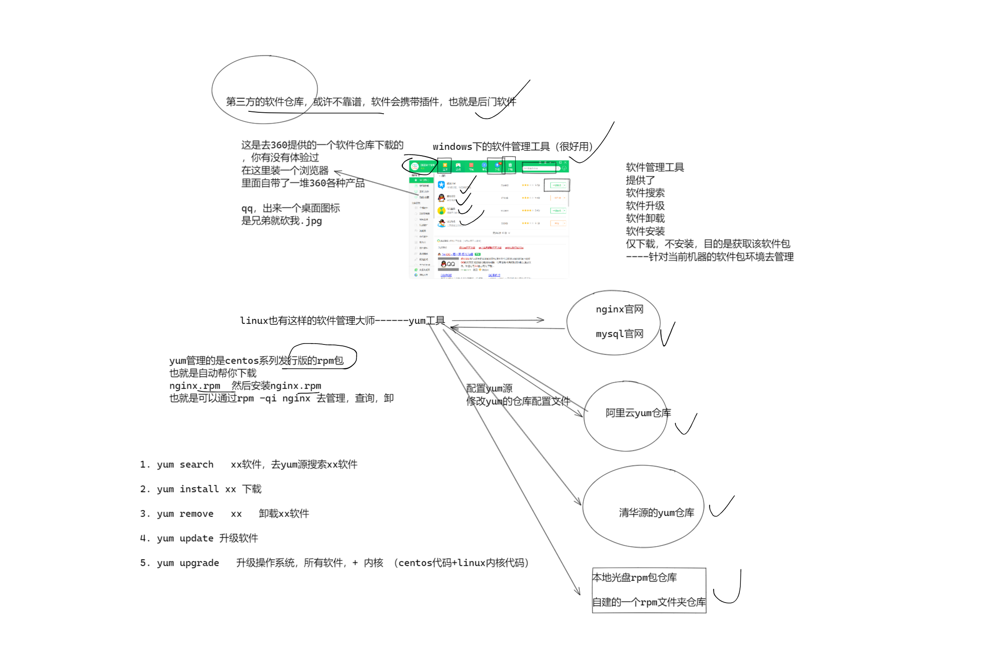


# yum源有几种形式

- 本地光盘镜像yum源
- 网络yum源


## 国内知名的网络yum源

网络yum源也是用的最多的

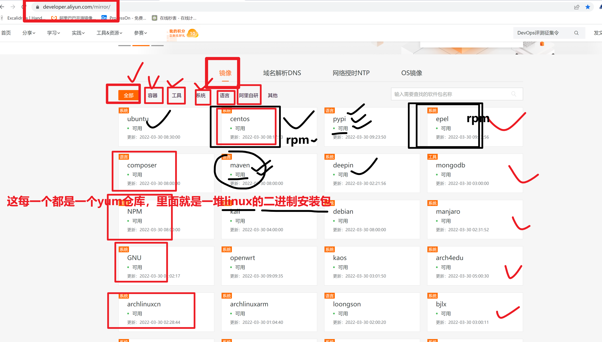

----

选择的是 

centos+epel两个yum仓库

- centos仓库，等于在线获取了一个光盘的镜像站，里面有操作系统，自带的各种rpm包
- epel源


>所谓的yum源，其实就是
>
>1.下载了一个yum的配置文件，里面就是一个url而已！
>
>2.这个url指向了不同的镜像站，里面的一个rpm包集合地
>
>3.当你yum install安装的时候，yum自动去这个网站里，搜索mysql名字相关的rpm进行下载，安装


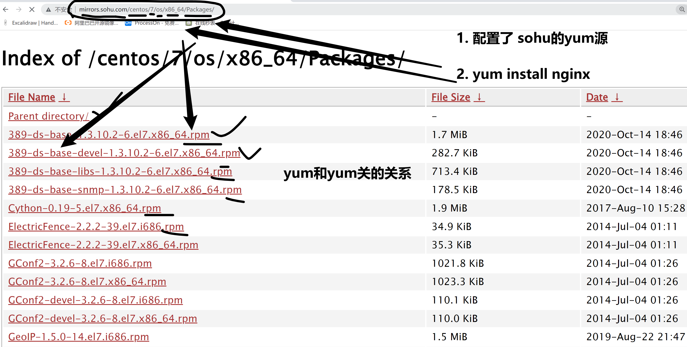


上面是互联网中，第三方的yum源查看


## 软件官方提供的yum源查看

https://dev.mysql.com/doc/refman/8.0/en/linux-installation-yum-repo.html


# yum实践操作

# yum仓库目录语法

```
yum的仓库文件，都被统一放在了一个固定的目录
语法
是在这个目录中，名字是 *.repo结尾的文件，就会被yum识别为仓库文件
并且只能是在第一层目录，否则都无法识别为yum仓库

因此 /etc/yum.repos.d/就是yum仓库文件夹，并且只能是这个文件夹的第一层目录
存在于 *.repo文件
否则第一层目录，没有*.repo文件，就是没有可使用的yum仓库
也就是无法使用yum命令


[root@167 ~]# cd /etc/yum.repos.d/
[root@167 yum.repos.d]# 
[root@167 yum.repos.d]# pwd
/etc/yum.repos.d
[root@167 yum.repos.d]# 
[root@167 yum.repos.d]# ls
bak_repo  CentOS-Base.repo  epel.repo


```

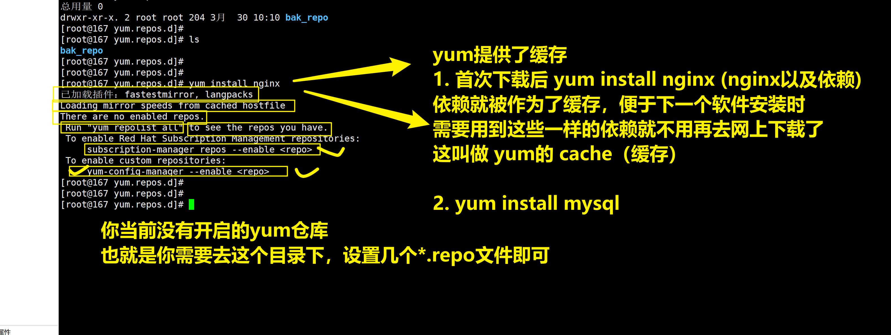


## 挂载本地光盘，作为镜像源（作为yum的rpm包仓库）

```
1. 找到一个光盘镜像吧 (vmware虚拟机+物理机+准备一个外置光驱+自己刻录一个centos7光盘) (vmware连接上centos7光盘即可)


2. 在系统中， 找到这个光盘文件（linux一切皆文件，你所有的物理硬件，都可以在系统上以文件形式找到）
ls /dev目录下

```

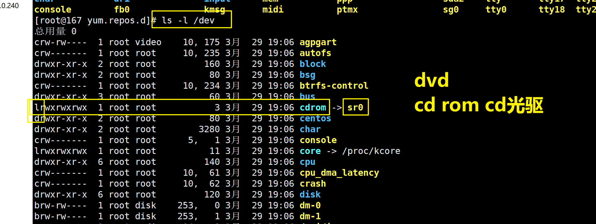

```
找到光盘文件，进行挂载动作，让某一个目录和这个光盘，建立连接

mkdir /mnt/my_centos

[root@167 opt]# mount /dev/sr0  /mnt/my_centos/
mount: /dev/sr0 写保护，将以只读方式挂载
[root@167 opt]# 
[root@167 opt]# 
[root@167 opt]# ls /mnt
my_centos
[root@167 opt]# 
[root@167 opt]# ls /mnt/my_centos/
CentOS_BuildTag  EFI  EULA  GPL  images  isolinux  LiveOS  Packages  repodata  RPM-GPG-KEY-CentOS-7  RPM-GPG-KEY-CentOS-Testing-7  TRANS.TBL
[root@167 opt]# 
[root@167 opt]# 
[root@167 opt]# df -h
文件系统                 容量  已用  可用 已用% 挂载点
/dev/mapper/centos-root   17G  8.3G  8.8G   49% /
devtmpfs                 1.9G     0  1.9G    0% /dev
tmpfs                    1.9G     0  1.9G    0% /dev/shm
tmpfs                    1.9G   21M  1.9G    2% /run
tmpfs                    1.9G     0  1.9G    0% /sys/fs/cgroup
/dev/sda1               1014M  170M  845M   17% /boot
tmpfs                    378M   12K  378M    1% /run/user/42
tmpfs                    378M     0  378M    0% /run/user/0
/dev/sr0                 4.2G  4.2G     0  100% /mnt/my_centos
[root@167 opt]# 
[root@167 opt]# 


3.创建yum的仓库文件，学习yum仓库文件语法
去看一看阿里云，给你创建的yum仓库，语法长什么样，模仿着写就行
写一个关于光盘挂载的repo文件
此时的光盘数据在本地目录，/mnt/my_centos/
如果你的rpm包，得通过互联网去找，语法是 http://aliyun.com/xxxxxxxxxxxxx
如果你的rpm是去系统中找，语法是 file://路径即可


vim /etc/yum.repos.d/my_cdrom.repo


[base]
name=0224-linux-yum-cdrom
baseurl=file:///mnt/my_centos/
enabled=1
gpgcheck=0


4.此时有了yum仓库，熟练的敲下两个命令
# 先清空旧的yum缓存
yum clean all  # 清空内存中的yum缓存
rm -rf /var/cache/yum  # 删除磁盘上的yum缓存


# 生成新的yum缓存（否则你第一次yum install会去下载很多元数据，比较慢）
[root@167 yum.repos.d]# 
[root@167 yum.repos.d]# yum makecache
已加载插件：fastestmirror, langpacks
Determining fastest mirrors
base                                                                                                                                                            | 3.6 kB  00:00:00     
(1/4): base/group_gz                                                                                                                                            | 166 kB  00:00:00     
(2/4): base/filelists_db                                                                                                                                        | 3.1 MB  00:00:00     
(3/4): base/primary_db                                                                                                                                          | 3.1 MB  00:00:00     
(4/4): base/other_db                                                                                                                                            | 1.3 MB  00:00:00     
元数据缓存已建立


5.此时你可以用yum，去本地光盘中装软件 


6.记住，删除东西，也别用rpm -e去删了，它只删了一个软件，没删依赖
删也用yum 去删
yum remove vim* -y


7.yum去安装，检查火狐浏览器


# 查看当前yum仓库，都有哪些rpm包
yum list

yum list |wc -l  # 查看当前yum仓库中，有多少rpm包可以用


[root@167 yum.repos.d]# yum list |grep -i firefox
firefox.x86_64                          52.7.3-1.el7_5                 installed


yum remove firefox -y

yum install firefox -y 


8.尝试在本地光盘中安装mysql，看看发生什么

查看当前yum源，是否有mysql的软件
经验告诉我 ，mysql这个软件，属于c/s模式
client/server模式
因此mysql这样的软件，也得先装服务端
（服务端的名字，基本是mysql-server-版本号.rpm）

再装客户端

历史典故
因为mysql8企业版 被oracle收购了，收费了，以及java也被oracle 
由于mysql收费了，因此开源组织，将其改造，换了个马甲，名字叫做mariadb用法一样，系统上运行后，什么都一样，只不过软件包的名字换了

yum remove mysql -y


你会发现在光盘仓库中，可以找到 的是 
mariadb 5.5.56-2.el7 
你是找不到 mysql -5.6.xx

这个仓库就不好使。。。
换一个仓库。。

如何从当前yum仓库，搜索某软件的用法

[root@167 yum.repos.d]# yum list|grep mariadb
mariadb-libs.x86_64                     1:5.5.56-2.el7                 @anaconda
mariadb.x86_64                          1:5.5.56-2.el7                 base     
mariadb-bench.x86_64                    1:5.5.56-2.el7                 base     
mariadb-devel.x86_64                    1:5.5.56-2.el7                 base     
mariadb-server.x86_64                   1:5.5.56-2.el7                 base     
mariadb-test.x86_64                     1:5.5.56-2.el7                 base     
[root@167 yum.repos.d]# 


```

学会查看yum的报错

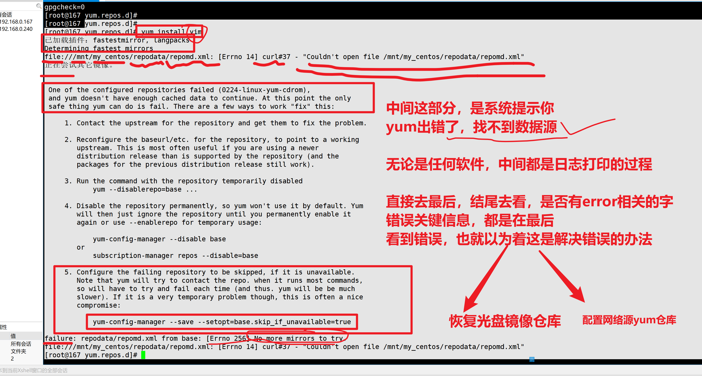


yum很好用


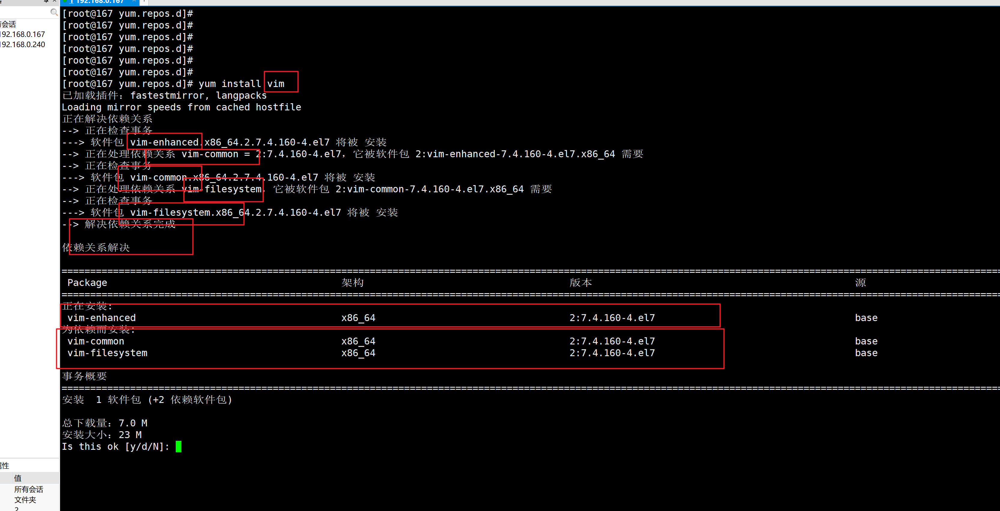

---


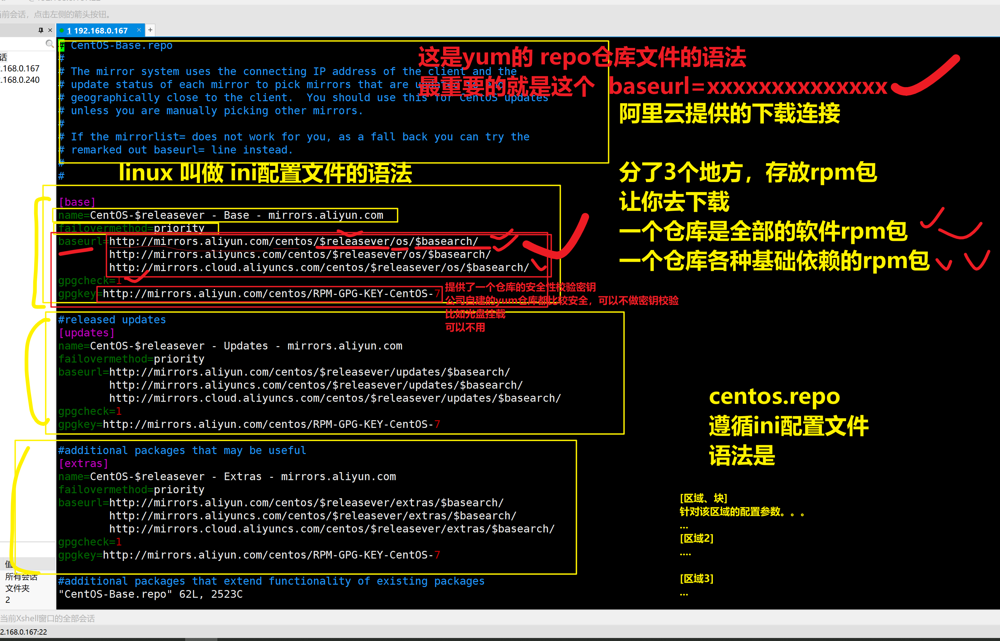


## 配置网络yum源（阿里云yum源）

```
1.选择主流的开源镜像站

2.用人家提供的命令，生成yum仓库文件即可
首先必须在 /etc/yum.repos.d 只能在这个目录下，且是第一级
/etc/yum.repos.d/aliyun.repo

为什么要用网络源，因为内容更多，更全
因为如阿里云的工程师，会吧市面主流的软件，全部同步到这个阿里云仓库中，比较齐全，但是也有限制


比如，本地光盘是没有nginx这个工具的


3. 快速配置阿里云仓库，以及移除本地光盘源
https://developer.aliyun.com/mirror/


使用wget命令下载阿里云的repo文件
#wget -O 对该文件进行存放到指定目录，且改名
wget -O /etc/yum.repos.d/CentOS-Base.repo https://mirrors.aliyun.com/repo/Centos-7.repo


# 上述命令等于如下
cd /etc/yum.repos.d/

wget  https://mirrors.aliyun.com/repo/Centos-7.repo

ls /etc/yum.repos.d/Centos-7.repo

4.配置阿里云仓库
wget -O /etc/yum.repos.d/CentOS-Base.repo https://mirrors.aliyun.com/repo/Centos-7.repo


5. 你会发现，上面这个默认的源，软件数量也不算多，比如nginx就找不到，它的作用类似于 你挂载光盘源，用于安装很多基础，简单的工具
而第三方的工具是没有，如nginx

还得配置一个叫做epel仓库
wget -O /etc/yum.repos.d/epel.repo http://mirrors.aliyun.com/repo/epel-7.repo


6.配置好2个仓库后，基本完事，可以安装市面绝大多数的软件了
生成缓存，便于后续加速下载
yum clean all
rm -rf /var/cache/yum
yum makecache

7.此时可以验证用yum源去安装软了
比如先看看软件列表有多少东西
yum list|wc -l

yum list|grep mysql
yum list|grep nginx


8.想用什么软件，可以先


```

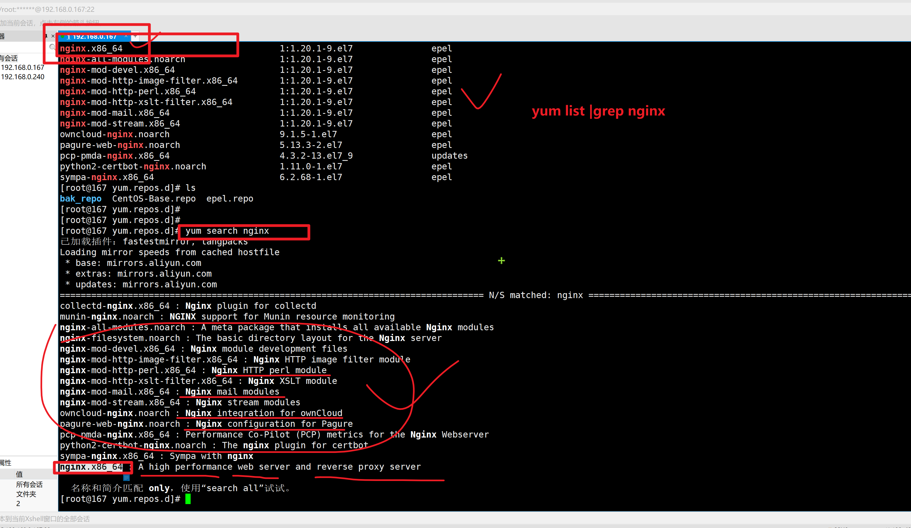


## 捋一捋，学了几个yum仓库

- 本地光盘挂载仓库
- 网络源仓库
- 离线安装软件包，比如就是nginx，
  - 先准备好该软件的rpm包，准备好nginx的软件包，以及它的软件依赖rpm包
  - 准备到一个目录中，让其成为yum可识别的仓库即可
  - 然后创建yum仓库的repo文件，完事
  - yum install 软件


```
yum支持这俩功能
[root@167 ~]# #只下载，不安装
[root@167 ~]# # 下载，安装，且保留rpm包，便于你下次的离线安装

是如下俩参数，可以实现，很方便的通过网络源，下载你想要的rpm包
     --downloadonly
              Don't update, just download. This is done in the background, so the yum lock is released for other operations. This can also be chosen by typing 'd'ownloadonly  at
              the transaction confirmation prompt.

       --downloaddir=directory
              Specifies an alternate directory to store packages.


# 获取vim安装包，以及它必须的依赖

[root@167 0224_software]# yum install --downloadonly  --downloaddir=/0224_software/     vim

```


## 自建yum仓库（本地目录rpm包）


```
1.创建一个软件目录
[root@167 ~]# mkdir /0224_software

2.准备软件的所有rpm包，你可以选择用光盘仓库，也可以用这个神奇的办法
# 拿vim举例，安装vim以及它的依赖包

yum install --downloadonly  --downloaddir=/0224_software/     vim


3.使用命令，让该目录成为yum可识别仓库
yum install createrepo -y

4.使用该命令，创建本地仓库
[root@167 0224_software]# 
[root@167 0224_software]# createrepo /0224_software/
Spawning worker 0 with 1 pkgs
Spawning worker 1 with 1 pkgs
Spawning worker 2 with 0 pkgs
Spawning worker 3 with 0 pkgs
Workers Finished
Saving Primary metadata
Saving file lists metadata
Saving other metadata
Generating sqlite DBs
Sqlite DBs complete
[root@167 0224_software]# 
[root@167 0224_software]# 
[root@167 0224_software]# 
[root@167 0224_software]# ll /0224_software/ -a
总用量 7156
drwxr-xr-x   3 root root     114 3月  30 11:56 .
dr-xr-xr-x. 30 root root    4096 3月  30 11:46 ..
drwxr-xr-x   2 root root    4096 3月  30 11:56 repodata
-rw-r--r--   1 root root 6205700 12月 18 2020 vim-common-7.4.629-8.el7_9.x86_64.rpm
-rw-r--r--   1 root root 1106008 12月 18 2020 vim-enhanced-7.4.629-8.el7_9.x86_64.rpm
[root@167 0224_software]# 


5.此时，创建repo文件，指向这个目录即可，就是一个本地仓库目录
你先移除其他的repo文件，让yum被识别


cat >> /etc/yum.repos.d/my_dir.repo <<EOF
[base]
name=0224-linux-my_dir
baseurl=file:///0224_software/
enabled=1 # 这个参数是控制，该repo启用，还是关闭的
gpgcheck=0
EOF


6.此时yum本地仓库就好使了
yum install vim -y


已安装:
  vim-enhanced.x86_64 2:7.4.629-8.el7_9                                                  

作为依赖被升级:
  vim-common.x86_64 2:7.4.629-8.el7_9                                                    

完毕！
[root@167 yum.repos.d]# vim
[root@167 yum.repos.d]# 


```

## 保留问题，关于yum获取软件依赖(离线安装、获取rpm)


## 关于yum的补充

### 通过yum获取rpm包缓存


建议操作，刘永飞证实

- 准备一个最小化安装的系统，yum会自动判断，它需要什么基础依赖
  - 因为最小化，系统缺少很多依赖包
- 再使用`yum install --downloadonly  --downloaddir=/0224_software/     nginx`这个命令去尝试，看看下载多少依赖
  - vim ，只找到了2个依赖
  - 最小化机器进行操作，5个依赖
  - yum是针对当前机器的环境，判断，安装vim，需要多少个rpm依赖包

```
还有一个办法，修改yum配置文件，前提是你有一个可用的yum源仓库
1.需求是安装nginx，且获取nginx的rpm包，缓存下来（存在于epel仓库）
修改epel.repo文件，添加如下参数
keepcache=1

yum install nginx 

2.此时nginx相关的rpm包都在缓存目录下了
[root@167 yum.repos.d]# 
[root@167 yum.repos.d]# find /var/cache/yum/ -name *.rpm
/var/cache/yum/x86_64/7/epel/packages/nginx-1.20.1-9.el7.x86_64.rpm

```


### 修改yum仓库的优先级

```
1.你的机器，又有本地光盘仓库--------版本1.4
2.有有阿里云的仓库---------版本2.5

===================省事点，不要的仓库，移走就行===========了

只需要在对应的repo仓库文件中，针对仓库的区域设置，添加一个参数即可
priority=1

```


## 最后安装MySQL-5.6.43

```
1.获取软件的rpm包 ，也要想办法，找到mysql-5.6.43这个rpm包，用rpm装，还是yum装
2. mysql-5.6.43.tar.gz 编译安装
3.配置yum仓库
- 本地光盘
- 阿里云yum源
- 自建yum仓库文件夹

4.去mysql官网，寻找该软件的下载地址，设置为yum仓库即可


```

## 实践过程

```
你们上述，安装过mysql，可能会和这个有冲突
你可能需要执行如下的命令，清理阿里云安装的mysql环境
注意，本操作，和其他题目无关，不要随便删东西，删东西，请看好，你在做什么
注意，本操作，和其他题目无关，不要随便删东西，删东西，请看好，你在做什么
注意，本操作，和其他题目无关，不要随便删东西，删东西，请看好，你在做什么
注意，本操作，和其他题目无关，不要随便删东西，删东西，请看好，你在做什么
注意，本操作，和其他题目无关，不要随便删东西，删东西，请看好，你在做什么


yum remove mysql* mysql-* mysql mariadb* -y


```


```
1.去mysql官网，找到mysql的rpm包下载地址
https://repo.mysql.com//mysql80-community-release-el7-5.noarch.rpm

通过分析其url，找到了mysql-5.6版本的rpm包，集合地儿
https://repo.mysql.com/yum/mysql-5.6-community/el/7/x86_64/

2.创建mysql的yum配置文件即可
[root@167 yum.repos.d]# cat mysql5643.repo 
[mysql56]
name='This is mysql 5.6.43 server rpm'
baseurl='https://repo.mysql.com/yum/mysql-5.6-community/el/7/x86_64/'
enable=1
gpgcheck=0


3.安装对应版本软件即可
[root@167 yum.repos.d]# yum install mysql-community-server-5.6.43

如果出现依赖报错，需要你分析报错，解决对应的依赖关系

4.安装完毕后，启动mysql-5.6.43即可

找到如下脚本，即可用systemctl去管理启动了

[root@167 yum.repos.d]# ls /usr/lib/systemd/system/mysqld.service 
/usr/lib/systemd/system/mysqld.service
[root@167 yum.repos.d]# 
[root@167 yum.repos.d]# 
[root@167 yum.repos.d]# systemctl start mysqld
[root@167 yum.repos.d]# 


5.启动mysql
[root@167 yum.repos.d]# systemctl start mysqld
[root@167 yum.repos.d]# netstat -tunlp|grep mysql

[root@167 yum.repos.d]# ps -ef|grep mysql


6.能执行基本的sql语句

[root@167 yum.repos.d]# 
[root@167 yum.repos.d]# # 如下是客户端命令去登录
[root@167 yum.repos.d]# 
[root@167 yum.repos.d]# mysql -uroot -p
Enter password: 
Welcome to the MySQL monitor.  Commands end with ; or \g.
Your MySQL connection id is 2
Server version: 5.6.43 MySQL Community Server (GPL)

Copyright (c) 2000, 2021, Oracle and/or its affiliates. All rights reserved.

Oracle is a registered trademark of Oracle Corporation and/or its
affiliates. Other names may be trademarks of their respective
owners.

Type 'help;' or '\h' for help. Type '\c' to clear the current input statement.

mysql> 
mysql> 
mysql> show databases;
+--------------------+
| Database           |
+--------------------+
| information_schema |
| mysql              |
| performance_schema |
+--------------------+
3 rows in set (0.00 sec)

mysql> exit;
Bye
[root@167 yum.repos.d]# 
[root@167 yum.repos.d]# 


```

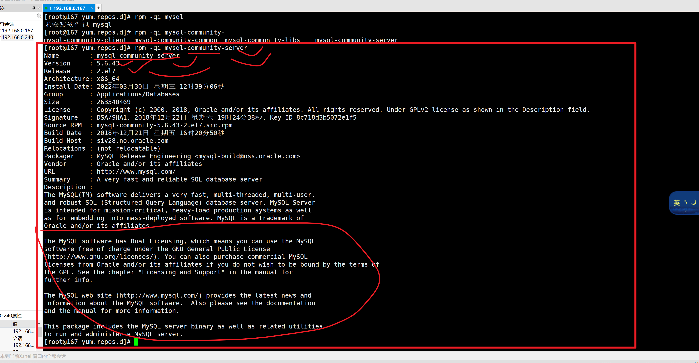

---


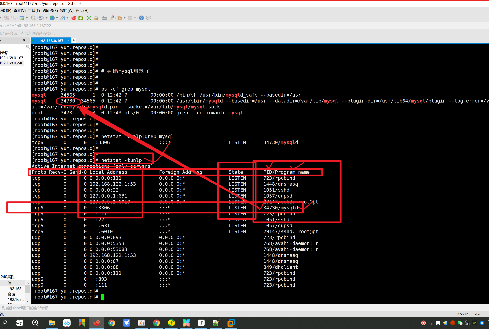

----

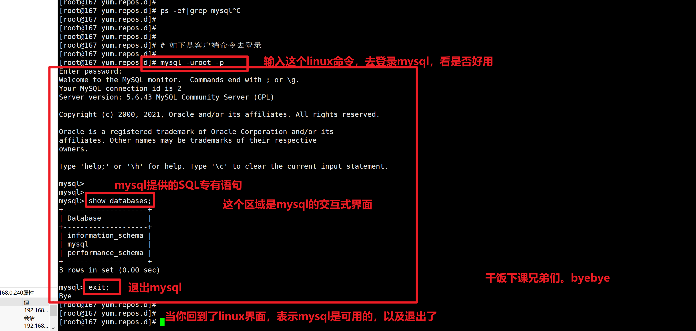


