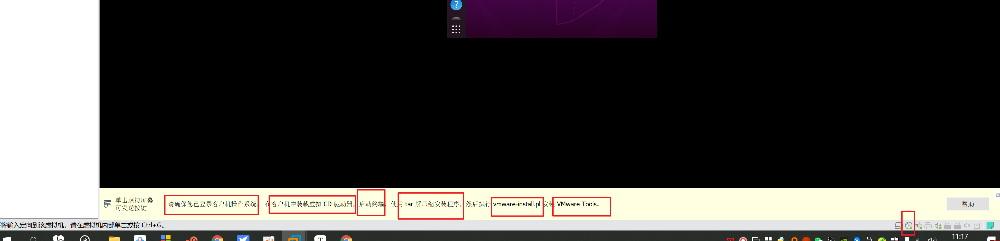

```### 此资源由 58学课资源站 收集整理 ###
	想要获取完整课件资料 请访问：58xueke.com
	百万资源 畅享学习

```
# 作业讲解

- 对于自建yum仓库的方式，获取缓存等还不太懂


# 软件包安装开胃菜（docker搭建游戏）

看懂报错信息，尝试去翻译，还是去分析，找到关键字，找到解决问题的办法。

用时间累计，多敲，多见识，多学，才能获得的经验

程序员，入行定理----------10玩行代码------------------------------------

运维入行定理---------报错10行------------------------------------


- 作为运维工程师，搞懂linux的软件安装是第一步，面对各种软件部署，心中要有一百个方案，轻松拿下
  - 前提自己没经验，不知道怎么解决，就学，吧别人的经验，学过来，转化转化就是你的经验了
  - 心中没有方案，去google搜索，找出的答案，就是你的经验

- 随着运维技能的提升，会想尽办法，让自己更懒，更省事， 恨不得，一天就干完一个月的活
  - 为什么需要进行运维自动化

- 部署程序运行环境，迁移环境，是个麻烦，docker让这件事变得更简单


```
使用docker搭建小游戏网站，初体验其强大
从学习趣味上来，利用docker工具，实现环境的轻松部署

1.需要安装一个工具，名字叫做docker
准备好阿里云yum源
yum install docker -y

启动
[root@client-242 opt]# systemctl start docker
[root@client-242 opt]# 


2.需要提前准备好docker镜像（老师准备好了）
这个游戏，源码，不管是什么编程语言写的，你现在都不需要关心，你不需要装任何其他东西
确保docker命令可以用
[root@client-242 opt]# docker -v
Docker version 1.13.1, build 7d71120/1.13.1


3.导入该游戏镜像
[root@client-242 opt]# 
[root@client-242 opt]# docker load < game_v2.tar 

4.一条命令，在没有修改宿主机的环境下，就可以运行这个程序了
[root@client-242 opt]# docker run -P -d game:v2 
8b0f0a7796642540693086752e338875ef281d922ee2922f99d935858c4fb928
[root@client-242 opt]# 
[root@client-242 opt]# 
[root@client-242 opt]# docker ps
CONTAINER ID        IMAGE               COMMAND                  CREATED             STATUS              PORTS                                                                     NAMES
8b0f0a779664        game:v2             "/docker-entrypoin..."   2 seconds ago       Up 2 seconds        0.0.0.0:32770->80/tcp, 0.0.0.0:32769->8080/tcp, 0.0.0.0:32768->8090/tcp   serene_meninsky
[root@client-242 opt]# 
[root@client-242 opt]# 


5.此时可以访问
0.0.0.0:32768
0.0.0.0:32769
两个端口号，对应了2个游戏网站

谁的ip ，宿主机的ip

第一个游戏，是像素小鸟
第二个游戏


```

# linux的软件安装技术

- centos平台下的
  - 管理rpm包（redhat、centos、软件包格式是rpm）
    - 手动管理这些rpm包的命令，也叫作rpm
    - rpm -ivh  nginx-1.20.rpm
  - yum自动管理rpm包，处理依赖关系（redhat、centos、提供自动化管理rpm，是yum工具）
  - 源代码编译安装
  - 二进制程序解压即用安装


- 国产的麒麟系统
- 乌班图
  - 系统本身支持一个通用的软件包格式，比如乌班图的 *.deb
    - nginx-1.20.deb
    - 乌班图下，安装deb包的命令是dpkg这个命令
    - 还提供了一个自动化下载，安装deb包的命令，叫做apt（等于centos的yum命令）


# ubuntu学习

# ubuntu是什么


Linux有非常多的发行版本，从性质上划分，大体分为由商业公司维护的商业版本与由开源社区维护的免费发行版本。*(centos)


商业版本以Redhat为代表，开源社区版本则以debian为代表。

这些版本各有不同的特点，在`不同的应用领域`发挥着不同的作用，不能一概而论。

下面就这些不同的Linux发行版进行简单的分析。

## Ubuntu

Ubuntu近些年的粉丝越来越多，Ubuntu有着漂亮的用户界面(苹果系统)，完善的包管理系统，强大的软件源支持(mysql,nginx,java,python,.golang)，丰富的技术社区，Ubuntu还对大多数硬件有着良好的兼容性，包括最新的图形显卡（做区块链的，需要用最新的显卡技术做计算，那么centos可能还没有对应的驱动支持，乌班图一般就有了）等等。

这一切让Ubuntu越来越向大众化方向发展。

但别忘了：你所需要的只是一个简约、稳定、易用的服务器系统而已！

Ubuntu的图形界面固然漂亮，但这也决定了它最佳的应用领域是桌面操作系统而非服务器操作系统。如何你希望在学习Linux的过程中有个沉浸式的环境，那么Ubuntu的确不错：仅仅安装在自己的电脑中而非服务器中。

乌班图适用于物联网企业，是最多的，比如智能机器人，智能输入法，智能窗帘


乌班图适合的场景

https://cn.ubuntu.com/internet-of-things

乌班图是更好看，有更多的丰富的应用程序，更适合喜欢用linux的程序员，作为个人笔记本的系统。


## CentOS

你会发现非常多的商业公司部署在生产环境上的服务器都是使用的CentOS系统，CentOS是从RHEL源代码编译的社区重新发布版。

CentOS简约，命令行下的人性化做得比较好，稳定，有着强大的英文文档与开发社区的支持。与Redhat有着相同的渊源。

虽然不单独提供商业支持，但往往可以从Redhat中找到一丝线索。

相对debian来说，CentOS略显体积大一点。是一个非常成熟的Linux发行版。

很多网站站长一般都选择centOS系统，CentOS是从redhat源代码编译重新发布版。

CentOS去除很多与服务器功能无关的应用，系统简单但非常稳定，命令行操作可以方便管理系统和应用，并且有帮助文档和社区的支持。


# 准备好乌班图机器

安装ubuntu

```

```

安装vmware-tools工具

```
1.你得挂载linux的系统光盘镜像
2.根据如下提示，找到vmware的安装脚本
3.执行脚本，全部yes同意，安装路径也默认即可

```




## 开启ssh服务

乌班图下，都是普通用户操作，必须加sudo

```
1.默认拿到一个新机器，可能没开启ssh服务，无法远程连接

2.或许需要升级下软件仓库
sudo apt update


3.需要安装ssh服务
sudo apt  install openssh-server

4.启动ssh服务，即可远程连接
sudo service sshd start 

5.查看该端口
sudo ss -tunlp|grep 22


```


## 远程登录ubuntu


#  ubuntu软件包管理


和centos管理方式一样，只不过软件包的格式，不是rpm包，而是deb包

但是其他管理方式，如源码编译三部曲，二进制包安装都一样。

| 软件包种类 | 特点                             | 缺点                         |
| ---------- | -------------------------------- | ---------------------------- |
| deb包      | 编译好了，安装简单，安装参数固定 | 软件版本较低，无法定制化安装 |
| 源码包     | 手动编译安装，繁琐，容易出错     | 软件版本自由，安装自由扩展   |
| 二进制包   | 解压即用                         | 无法源码，无法定制化         |


```
centos ---*.rpm  ============ubuntu -------*.deb
centos ---rpm -ivh xxx===========ubuntu   dpkg  *.deb

centos-----yum   ============== ubuntu  -------apt 
```


## dpkg命令管理deb包

```
dpkg -i package.deb                  #安装包
dpkg -r package                      #删除包，保留配置文件
dpkg -P package                       #删除包（包括配置文件）
dpkg -L package                      #列出与该包关联的文件
dpkg -l package                      #显示该包的版本
dpkg --unpack package.deb        #解开 deb 包的内容
dpkg -S keyword                      #搜索所属的包内容
dpkg -s package                 # 查询软件包详细信息
dpkg -l                              #列出当前已安装的包
dpkg -c package.deb                 #列出 deb 包的内容
dpkg --configure package         #配置包

```


## 安装ubuntu软件

nginx_1.18.0-2~focal_amd64.deb


```
# 下载该软件
yu@yu-virtual-machine:~$ wget yuchaoit.cn/nginx_1.18.0-2~focal_amd64.deb


# 安装该nginx
# 等于 rpm -ivh nginx.rpm

yu@yu-virtual-machine:~$ sudo dpkg -i nginx_1.18.0-2~focal_amd64.deb 


# 启动nginx服务

yu@yu-virtual-machine:~$ sudo service nginx start
yu@yu-virtual-machine:~$ 

yu@yu-virtual-machine:~$ ss -tunlp|grep 80
tcp    LISTEN  0       511            0.0.0.0:80           0.0.0.0:*            
yu@yu-virtual-machine:~$ 


# 如何访问呢

```


## apt命令

```
apt说了，等于使用yum一样用法
你可以直接用apt安装如vim
sudo apt install vim  

# 默认走的是乌班图的中国官网 

# 给乌班图配置网络apt源
1.打开图版图的apt源配置文件
yu@yu-virtual-machine:~$ sudo apt install vim -y
yu@yu-virtual-machine:~$ sudo vim /etc/apt/sources.list


写入如下配置即可
deb http://mirrors.aliyun.com/ubuntu/ focal main restricted universe multiverse
deb-src http://mirrors.aliyun.com/ubuntu/ focal main restricted universe multiverse

deb http://mirrors.aliyun.com/ubuntu/ focal-security main restricted universe multiverse
deb-src http://mirrors.aliyun.com/ubuntu/ focal-security main restricted universe multiverse

deb http://mirrors.aliyun.com/ubuntu/ focal-updates main restricted universe multiverse
deb-src http://mirrors.aliyun.com/ubuntu/ focal-updates main restricted universe multiverse

deb http://mirrors.aliyun.com/ubuntu/ focal-proposed main restricted universe multiverse
deb-src http://mirrors.aliyun.com/ubuntu/ focal-proposed main restricted universe multiverse

deb http://mirrors.aliyun.com/ubuntu/ focal-backports main restricted universe multiverse
deb-src http://mirrors.aliyun.com/ubuntu/ focal-backports main restricted universe multiverse


2.需要更新乌班图的软件源
sudo apt update


3.使用图版图，安装nginx、或者apache2
sudo apt install apache2

4.如果你机器80被占用，请关闭80端口即可
# service命令是旧时代的命令， 被systemctl替代了
sudo systemctl stop nginx

sudo systemctl start apache2.service

5.注意给停了
yu@yu-virtual-machine:~$ sudo systemctl stop apache2


```


你知道了

乌班图如何管理deb包，使用dpkg命令安装deb包

使用apt命令自动下载安装乌班图的软件，配置一个阿里云的apt源


# ubuntu搭建私有云盘（由于源码出错，看不到效果了）

- 获取网盘源码（网盘源码得正确，得告诉你运维，他是怎么开发的，需要什么样的环境才能运行，）
  - 代码更新了，需要修改很多nginx，php的设置，以后再学
- 


```
1.下载代码，安装环境，启动即可
# 很多网站，开源的工具，比如这个云盘（基于网站提供访问）
# 一个网站，基本是（php后端+nginx网站+mysql后端的数据库）
# 准备云盘的源代码，+ nginx的环境即可
sudo apt install php7.4 php7.4-fpm php7.4-gd php7.4-curl php7.4-mbstring nginx unzip -y


2.获取云盘这个程序的源码
yu@yu-virtual-machine:/opt$ sudo mkdir /my_yunpan
yu@yu-virtual-machine:/opt$ 
yu@yu-virtual-machine:/opt$ 
yu@yu-virtual-machine:/opt$ cd /my_yunpan/
yu@yu-virtual-machine:/my_yunpan$ 
yu@yu-virtual-machine:/my_yunpan$ sudo wget http://static.kodcloud.com/update/download/kodexplorer4.40.zip

此时需要解压这个目录
yu@yu-virtual-machine:/my_yunpan$ sudo unzip kodexplorer4.40.zip 


3.此时，云盘的源码有了，云盘运行的环境也有了，只需要修改nginx的配置文件，让它能找到这个云盘即可

第一步，创建nginx的配置文件， 如下
yu@yu-virtual-machine:/my_yunpan$ sudo vim /etc/nginx/conf.d/my_yunpan.conf

第二部，写入如下的内容
# 我们这个配置文件，设置的网站端口是81

server{
        listen 81;
        server_name yuchao_linux.top;
        root /code;
        index index.php index.html;
        location ~ \.php$ {
             root        /my_yunpan;
             fastcgi_pass   127.0.0.1:9000;
             fastcgi_index  index.php;
             fastcgi_param  SCRIPT_FILENAME  $document_root$fastcgi_script_name;
             include        fastcgi_params;
         }
}


4.验证你的语法是否正确
yu@yu-virtual-machine:/my_yunpan$ sudo nginx -t
nginx: the configuration file /etc/nginx/nginx.conf syntax is ok
nginx: configuration file /etc/nginx/nginx.conf test is successful


# 5.启动nginx即可
sudo systemctl start nginx

# 6.此时你还得让php和nginx能互相认识，修改如下配置即可
yu@yu-virtual-machine:/my_yunpan$ sudo vim /etc/php/7.4/fpm/pool.d/www.conf

修改36,37行的配置
 36 ;listen = /run/php/php7.4-fpm.sock
 37 listen = 127.0.0.1:9000


# 7.最后一步，修改这个代码的文件属主、属组
yu@yu-virtual-machine:/my_yunpan$ sudo chown -R www-data:www-data /my_yunpan/

重启php和nginx即可
sudo systemctl stop apache2.service
sudo systemctl start nginx php7.4-fpm

# 7.访问
172.25.250.129:81


```


# ubuntu搭建博客系统（搭建java环境）

```
1.准备环境
sudo apt install openjdk-8-jre-headless -y

检查java环境
yu@yu-virtual-machine:~$ java -version
openjdk version "1.8.0_312"
OpenJDK Runtime Environment (build 1.8.0_312-8u312-b07-0ubuntu1~20.04-b07)
OpenJDK 64-Bit Server VM (build 25.312-b07, mixed mode)


2.下载博客源码
sudo wget https://dl.halo.run/release/halo-1.4.2.jar


3.启动这个程序

sudo java -jar halo-1.4.2.jar

4.访问
http://172.25.250.129:8090

5.可以看到如下博客页面
记住你的账号密码。。。


```


# 一键部署LAMP

http://apecome.com:9494/01_Linux%E5%9F%BA%E7%A1%80/15_YUM%E4%B8%8E%E5%BC%80%E6%BA%90%E9%A1%B9%E7%9B%AE%EF%BC%88Web%E8%BF%90%E7%BB%B4%EF%BC%89.html


