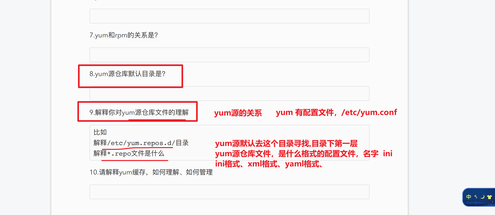

```### 此资源由 58学课资源站 收集整理 ###
	想要获取完整课件资料 请访问：58xueke.com
	百万资源 畅享学习

```



.请解释yum缓存，如何理解、如何管理

```
去网络源下载软件rpm包，会涉及网络延时，网络资源消耗
```


# 1.解决，关于yum缓存包的理解（自己搭建yum仓库）


11.当你拿到一个初始化的机器，默认安装的软件（centos上的rpm格式的软件）数量可能很少

导致你后期使用各种工具，会报错，比如python调用gzip解压缩功能

ssh远程登录调用数据加密功能，openssl没装

nginx > http >https  (http+openssl数据加密功能)

....


```
1.你要准备一个初始化安装的机器，因为它的确缺少很多工具包

yum install gcc patch libffi-devel python-devel zlib-devel bzip2-devel openssl-devel ncurses-devel sqlite-devel readline-devel tk-devel gdbm-devel db4-devel libpcap-devel xz-devel net-tools vim -y

办法1，挂载本地光盘作为yum仓库（没有光驱，没法用光盘）
办法2，自己提前准备好所需的rpm包，通过usb 接口，把rpm包考过去，安装

2.还要关注你用的yum源是谁，我这个机器用的是centos官方的，你可以更换为阿里云的


3.linux仅下载rpm包，而不安装
yum install --downloaddir=/opt/base_rpm/ --downloadonly gcc patch libffi-devel python-devel zlib-devel bzip2-devel openssl-devel ncurses-devel sqlite-devel readline-devel tk-devel gdbm-devel db4-devel libpcap-devel xz-devel net-tools vim -y

4.检查下载好的本地rpm包
[root@client-242 opt]# ls base_rpm/ |wc -l
90


5.此时该如何批量安装这些rpm包呢？
该如何用如下这个命令，安装上述我下载好的rpm包，在一个离线的环境

yum install gcc patch libffi-devel python-devel zlib-devel bzip2-devel openssl-devel ncurses-devel sqlite-devel readline-devel tk-devel gdbm-devel db4-devel libpcap-devel xz-devel net-tools vim -y

办法是？
自建yum仓库文件夹

6.你得准备好这些rpm包，存放于一个目录
ls /opt/base_rpm

7.使用createrepo命令，将这个目录，改造为yum可识别的一个仓库目录，它会生成repodata文件夹

createrepo /opt/base_rpm

8.创建本地yum仓库文件，去找这些rpm包了，找本地的yum仓库文件夹
[root@client-242 yum.repos.d]# cat local_dir.repo 
[local_dir]
name=local dir base rpm
baseurl=file:///opt/base_rpm
enabled=1
gpgcheck=0


9.注意清空yum缓存（因为，系统中现有的，是centos7官方的一些rpm包缓存数据）
yum clean all

[root@client-242 yum.repos.d]# yum clean all
Loaded plugins: fastestmirror
Cleaning repos: local_dir
Cleaning up everything


Maybe you want: rm -rf /var/cache/yum, to also free up space taken by orphaned data from disabled or removed repos
Cleaning up list of fastest mirrors
[root@client-242 yum.repos.d]# 
[root@client-242 yum.repos.d]# 
[root@client-242 yum.repos.d]# rm -rf /var/cache/yum

这里的缓存分为两种
一个是内存缓存，是通过yum clean all
一个是持久化存储的缓存，以及写入到磁盘了 rm -rf /var/cache/yum


10.才是一个干净的机器，可以去装软件


11.总结
等于自定义了一堆rpm包，给了一个断网的机器，且没有用光盘的机器，安装了这些工具包


```


## yum安装本地文件夹的rpm包参数

```
yum 的参数

    localinstall
              Is used to install a set of local rpm files. If required the enabled repositories will be used to resolve dependencies. Note that the install command will do a local install, if  given
              a filename. This command is maintained for legacy reasons only.


用法
yum localinstall  xx.rpm


```


# 2.如何检查rpm软件依赖

```
上面两种要求该软件，在机器上以及安装了
1.针对以安装的rpm程序（以及在你机器上装好来的，rpm软件）
[root@client-242 yum.repos.d]# rpm -qR vim-enhanced


2.安装工具 rpmreaper
sudo yum install rpmreaper
rpmreaper会向用户显示已安装包的列表，显示他们的依赖关系


（不要求安装，直接去yum源仓库中，检索他们的依赖关系）
3.使用repoquery工具来罗列包的依赖关系，软件名字得正确，先yum list看看
# 安装如下工具包，即可使用
yum install yum-utils

# 前提是你的yum仓库中有这个软件包。且名字不能错
[root@client-242 yum.repos.d]# repoquery --requires --resolve nginx


```


# 3.如何yum获取rpm包

仅仅是下载rpm包，不安装

```
1.使用yumdownloader工具（前提是，配置好yum仓库源）
yum install yum-utils

2.仅仅下载linux的软件rpm包
# --destdir 也是指定一个rpm包存放的路径
[root@client-242 yum.repos.d]# yumdownloader --destdir=/opt/mysql mysql


3.以及学过了的是？
# --downloadonly   默认是把rpm包，放到/var/cache/yum/
yum install --downloadonly   --downloaddir=/opt/my_rpm/  nginx


```


4..配置阿⾥云yum源，以及epel源，仅仅且保留nginx的rpm包缓存

到/opt/nginx_rpm/

```
[root@client-242 ~]# yumdownloader --destdir=/opt/nginx_rpm nginx
Loaded plugins: fastestmirror
Loading mirror speeds from cached hostfile
 * base: mirrors.aliyun.com
 * extras: mirrors.aliyun.com
 * updates: mirrors.aliyun.com
[root@client-242 ~]# 
[root@client-242 ~]# ls /opt/nginx_rpm/
nginx-1.20.1-9.el7.x86_64.rpm


```


# 4.做作业，或者干活，要细心，看好，文档，手册的要求

