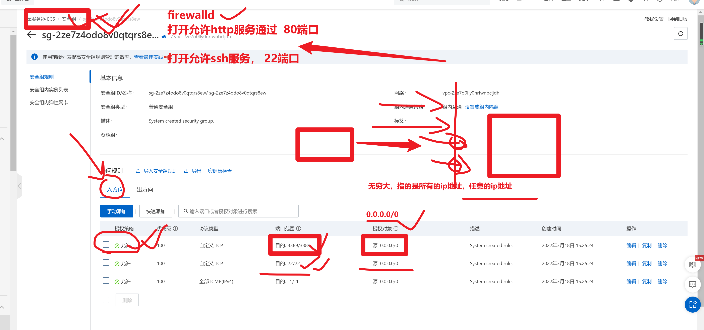

```### 此资源由 58学课资源站 收集整理 ###
	想要获取完整课件资料 请访问：58xueke.com
	百万资源 畅享学习

```
# LAMP和磁盘管理

```
java -jar  halo-1.14.jar

php


python  

运维要做的是，部署一个linux机器的环境，让程序去运行
lamp=====linux + apache + mysql +php
lnmp ==== linux + nginx + mysql + python


```




## 此时你可以去登录阿里云了

阿里云也默认允许了22端口的请求

```
1.获取阿里云的公网ip
ssh root@39.105.179.202
```


# 部署LAMP架构

## 永久关闭selinux

1.喜欢关闭所有的防火墙，内置防火墙，linux的软件防火

```
1.关闭selinux，美国的航空安全局，开发的linux内置防火墙
查询selinux状态，基本只有centos8会多些selinux的策略，centos7不用

# 看到disbaled表示selinux是永久禁止的
[root@AlienCat ~]# getenforce 
Disabled

2.修改selinux的配置文件，永久禁止它开机自启
这是selinux配置信息
[root@AlienCat ~]# cat /etc/selinux/config 

# This file controls the state of SELinux on the system.
# SELINUX= can take one of these three values:
#     enforcing - SELinux security policy is enforced.
#     permissive - SELinux prints warnings instead of enforcing.
#     disabled - No SELinux policy is loaded.
SELINUX=disabled
# SELINUXTYPE= can take one of three values:
#     targeted - Targeted processes are protected,
#     minimum - Modification of targeted policy. Only selected processes are protected. 
#     mls - Multi Level Security protection.
SELINUXTYPE=targeted


运行中
#     enforcing - SELinux security policy is enforced.
临时关闭中，下次开机还会启动
#     permissive - SELinux prints warnings instead of enforcing.
永久关闭了
#     disabled - No SELinux policy is loaded.

修改selinux状态，enforcing > permissive
setenforce 0

想永久关闭，还得修改配置文件，然后reboot
reboot

```

## 关闭内置的firewalld，以及清空iptables规则

```
[root@AlienCat ~]# iptables -F
[root@AlienCat ~]# 
[root@AlienCat ~]# systemctl stop firewalld

[root@AlienCat ~]# systemctl disable firewalld


```


# 用简易方式安装

- rpm包
- 配置阿里云yum源，yum下载即可

```
# 1.linux安装

# 2.安装apache
yum install httpd -y

# 3. 启动，和验证apache是否运行
[root@AlienCat ~]# systemctl start httpd
[root@AlienCat ~]# 
[root@AlienCat ~]# 
[root@AlienCat ~]# netstat -tnlp|grep httpd
tcp6       0      0 :::443                  :::*                    LISTEN      21301/httpd         
tcp6       0      0 :::80                   :::*                    LISTEN      21301/httpd         
[root@AlienCat ~]# 
[root@AlienCat ~]# 
[root@AlienCat ~]# curl -I 127.0.0.1:80

# 4.此时可以通过apache的公网ip，可以访问到这个服务器
查看公网ip的方式有俩
一、你可以去阿里云控台看
二、技巧如下，由于我们现实在2个公网中的机器，互相访问
[root@AlienCat ~]# curl ifconfig.me
39.105.179.202


# 5.此时你还得打开阿里云的安全组，允许80端口请求通过


# 6.安装数据库，mysql，默认的阿里云源，没有mysql，你可以去自己配置mysql的yum仓库


配置mylsq的源
从软件包的名字，可以分析它的作用
# mysql-config.rpm
# rpm -ivh mysql-config.rpm 
# mysql-server.rpm 
# mysql-client.rpm 

# 下载mysql仓库的配置文件rpm包
# 安装这个rpm包，只会生成一些配置文件
wget http://dev.mysql.com/get/mysql-community-release-el7-5.noarch.rpm

rpm -ivh mysql-community-release-el7-5.noarch.rpm

# 7.安装mysql即可
yum -y install mysql-community-server

如果是卸载，别卸载
yum remove mysql-community-server -y

# 8.先启动mysql
[root@AlienCat yum.repos.d]# systemctl restart mysqld


# 9.启动myqsl数据库，需要进行初始化设置，设置密码操作
# 初始化密码设置
mysql_secure_installation 

密码是songling123


# 10.用新密码登录数据库
mysql -uroot -p
密码songling123


# 11.此时需要安装后端语言了
yum install php -y


安装了php，默认会和apache结合工作，你试一试是否apapche可以加载php的代码即可
创建php的代码，index.php放入apache的网页目录下

[root@AlienCat html]# cat index.php 

<?php
phpinfo();
?>

在这个页面上，加一行字


你是后安装的php，想让httpd结合，还得重启httpd
systemctl restart httpd


```


# 练习题

要求通过yum部署，lamp，查看phpinfo页面。


## 报错解决思路

```
问题背景

1.张少辉这个机器，之前安装过mysql相关软件

2.删除mysql旧的依赖即可


```


## 基于lamp架构环境

有了这个环境，只需要准备各种php写的程序，即可运行了

比如国内主流的disucz论坛代码

```
1.下载该论坛源码
https://www.dismall.com/forum.php?mod=attachment&aid=MTA0fGZlYmVhN2ZlfDE2NDg3ODQ3ODV8MHw3Mw%3D%3D

2.上传到linux中

3.安装unzip命令
[root@boos-aliyun html]# yum install unzip -y


4.解压缩论坛源码，到apache的目录下，查看内容
[root@boos-aliyun html]# unzip -d /var/www/html/ ~/Discuz_X3.4_SC_UTF8_20220131.zip 

5.对该论坛源码进行权限修改
chmod -R 777 /var/www/html/ 

6.再次刷新网页，检查论坛的信息设置是否正确
发现缺少mysql的驱动
安装该驱动即可
yum install php-mysqli -y

告诉apache重启，apache，知道php的功能更新了
systemctl restart httpd

7.环境检查通过后，即可开始安装

8.最后安装完毕，确保论坛可访问，使用，发表新贴，以及它提供的插件，自己玩吧


```


# 综合练习

关于linux的软件安装

- yum是简易版安装，所有的安装目录都是固定的，安装简单、易用，但是缺少定制化，在性能、自动化配置上不够靠谱
  - yum自动的安装软件到 /etc /var /usr 等路径，很可能与被人冲突，或者被yum remove卸载
  - 当你服务器批量管理的时候，你也无法批量操作，很容易出问题，比如，如下机器要批量安装lamp架构
  - 机器A
  - 机器B
  - 机器C，这台机器已经yum装过了mysql，必然会冲突出错。
  - 机器D

```


1.你先琢磨明白yum怎么用
第一个任务

用yum安装的lamp，discuz论坛，要搭建出来，截图让我看到你发的帖子，以及你的服务器截图


```


- 因此当你选择源码编译安装，通过脚本对服务器批量化操作，如安装到/opt/自定义文件夹下，出错的几率必然很小很小（mkdir /my_software_dir）
  - 而且编译可扩展很多功能，都是yum无法比拟的
  - 因此掌握编译安装是一个重点


# 大练习

你领导给了你一个文档，让你看文档，通过编译的手段，安装LAMP架构，文档地址是

http://apecome.com:9494/03%E7%B3%BB%E7%BB%9F%E6%9C%8D%E5%8A%A1%E7%AF%87/3-10-%E9%BB%84%E9%87%91web%E6%9E%B6%E6%9E%84%E4%B9%8BLAMP.html

> 友情提醒，工作里，同事、领导写的文档，可不会像老师这样详细，很少有注释，三言两句就完事，甚至你可能看不懂他写的什么，
>
> 你只能主动去问人家，把工作继续下去，这就看你为人处世的本事


目标

- 参考文档，完成LAMP架构的编译安装
- 部署出wordpress页面
- 先自己试试看文档练习，完事老师再来讲，加深印象。


