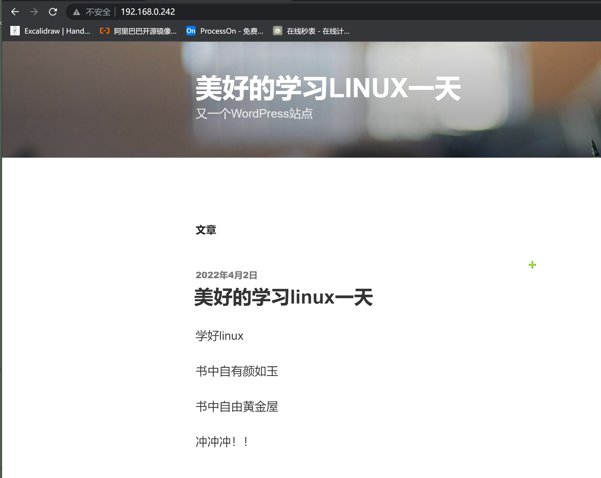

```### 此资源由 58学课资源站 收集整理 ###
	想要获取完整课件资料 请访问：58xueke.com
	百万资源 畅享学习

```
# 学习背景

学习目的，在搭建lamp架构的业务背景下，先用了yum搭建的形式，部署了disuz产品
从过程中理解yum如何安装软件，生成的配置文件路径，如何启动每一个进程，你应该整理清楚操作文档，下次拿着这个文档，可以很快的再部署出多套一样的环境。

有同学感慨，说这个搭建环境好难，的确，和之前的命令学习，比较零散的知识点，环境搭建，联系密切，知识点也紧凑。，就好比你在工地搬砖，前期先认识什么是水泥桶，什么是铁锹，什么是小推车，然后你就去盖房子吧

然后我们是尝试自己看文档，根据文档手册进行难度加大的源码编译安装，apache，mysql，php，每一个都是独立的软件，编译之间还有联系性，这就得你得查阅软件官方手册，对apache,php,mysql之间有什么联系，他们是如何联调的，安装顺序是什么，需要用到哪些系统的基础依赖。
你得单独的对php，apache，mysql都有一定的了解才行。
但是咱们本次练习目的在于动手实践，搞懂编译安装的流程，置于lamp之间的联系，我们放在web集群架构再去琢磨

然后下一步，就是学习磁盘管理，你想想为什么，你的wordpress搭建起来了，得存储用户文章数据吧，你机器上有几个硬盘，几个分区，容量够不够，磁盘满了怎么扩容，这是我们运维要解决的事，人家开发吧wordpress代码写好了，运维提供lamp环境运行代码，以及对系统资源管理，确保，磁盘够用，网络稳定，cpu，内存负载正常。
好了，这是要给大家表述的，关于运维工作的理解


# 编译部署LAMP环境

1.准备一个，干净的，初始化刚装好系统的机器（它必然是缺少很多依赖的）

```
对于大家使用的阿里云，如果你之前yum装过很多东西，必然会给系统生成很多依赖软件
yum install装的软件是阿里云的版本，mysql 5.5，装的依赖，也是根据5.5运行环境而来的

编译安装 5.8 ，那底层的依赖，多少会有些冲突，需要你自己去解决了
看报错，看提示，去找解决办法


给大家的建议是，初学的时候，不用个自己踩太多坑，可以直接系统初始化，重装恢复环境
你再去编译安装，坑少一些
能尽快的吧环境搭建起来


是使用的vmware的进行快照恢复，回到了初始化的系统

```


2.基础软件运行环境准备，一般在系统刚装好的时候执行

因为最小化安装安装，缺少很多基础系统工具包，导致你编译安装或者运行软件时会报错。

## 1.一个新机器初始化的步骤如下

关于基础软件的配置

```

关于系统要安装的基础环境，如下，你都给先装上

大前提是，你的yum源配置好了吗？
建议用最新的阿里云yum源
[root@client-242 ~]# yum install wget -y
再去配置阿里云的yum源
https://developer.aliyun.com/mirror/?spm=a2c6h.25603864.0.0.3d974ccaV0zX40

配置yum源
wget -O /etc/yum.repos.d/CentOS-Base.repo https://mirrors.aliyun.com/repo/Centos-7.repo

wget -O /etc/yum.repos.d/epel.repo http://mirrors.aliyun.com/repo/epel-7.repo

清空yum缓存
[root@client-242 yum.repos.d]# yum clean all
Loaded plugins: fastestmirror
Cleaning repos: base epel extras updates
Cleaning up everything
Maybe you want: rm -rf /var/cache/yum, to also free up space taken by orphaned data from disabled or removed repos
Cleaning up list of fastest mirrors
[root@client-242 yum.repos.d]# 
[root@client-242 yum.repos.d]# rm -rf /var/cache/yum


# 注意，关闭selinux，关闭firewalld，这是俩大坑  404  403 目录数据无法读写
[root@client-242 yum.repos.d]# grep -i 'selinux='  /etc/selinux/config 
# SELINUX= can take one of these three values:
SELINUX=disabled

[root@client-242 yum.repos.d]# systemctl stop firewalld
[root@client-242 yum.repos.d]# 
[root@client-242 yum.repos.d]# systemctl disable firewalld


# 安装如下基础软件，就可以解决你后面编译脚本的，绝大多数错误问题了
# 安装如下基础软件，就可以解决你后面编译脚本的，绝大多数错误问题了
# 安装如下基础软件，就可以解决你后面编译脚本的，绝大多数错误问题了
# 安装如下基础软件，就可以解决你后面编译脚本的，绝大多数错误问题了


yum install gcc patch libffi-devel python-devel zlib-devel bzip2-devel openssl-devel ncurses-devel sqlite-devel readline-devel tk-devel gdbm-devel db4-devel libpcap-devel xz-devel net-tools vim -y

yum install cmake make pcre-devel ncurses-devel openssl-devel libcurl-devel -y

yum install libxml2-devel  libjpeg-devel libpng-devel freetype-devel  libcurl-devel wget -y

linux很多软件的运行，依赖于操作系统本身的一些软件支持
yum groupinstall "Development tools" -y

桌面开发工具包（图形化相关包）
yum groupinstall "Desktop Platform Development" -y 


确保你上面三个步骤，全部安装完毕了

如果下载太慢yum,,wget等太慢

1.尝试更换yum源，阿里云，163，sohu，清华源
2.尝试更换dns
3.更换网络环境（5G网、wifi、有线、使用代理下载，梯子，设置系统全局http_proxy就行了

4.如果下载太慢，几kb/s 没必要一直等着，可以ctrl + c 断掉重试，有时候网络不稳定，得重连


```

### 关于基础依赖的理解补充

比如关于压缩的报错

```
mysql.tar.gz 
是一个tar进行归档的归档文件，调用gzip命令压缩 
tar -zxvf mysql.tar.gz 解压缩的时候
前提是机器有tar命令  -x参数调用tar命令
而且得有gzip命令才能去解压缩gz后缀  -z参数调用gzip命令


解压缩xxx.tar.bz2
tar -xf  xxx.tar.bz2

报错了，提示找不到bzip2这个命令
解决办法是，安装bzip2这个命令
yum install bzip2-devel 

基本上，大家编译mysql，编译httpd都遇见了这个报错
报错是，系统中缺少openssl相关，以及curses相关。。请安装该工具包

【先装好工具包，再去编译安装】
yum install openssl-devel ncurses-devel

```

## 2. 开始编译mysql安装

```
1.mysql的安装规格说明

安装需求

软件版本	安装目录	数据目录	端口
mysql-5.6.31	/usr/local/mysql	/usr/local/mysql/data	3306


2. 创建mysql用户，用于给mysql的数据，进程，设置相关的user属主

㈠ 创建mysql用户
[lamp-server root ~]$useradd -r -s /sbin/nologin mysql
[lamp-server root ~]$
[lamp-server root ~]$
[lamp-server root ~]$id mysql
uid=998(mysql) gid=996(mysql) groups=996(mysql)


3.创建一个指定的源码目录，下载对应软件
cd /usr/local ; mkdir software-mysql;cd software-mysql
wget -c https://repo.huaweicloud.com/mysql/Downloads/MySQL-5.6/mysql-5.6.50.tar.gz

查看源码，解压缩
[lamp-server root /usr/local/software-mysql]$ls
mysql-5.6.50.tar.gz

解压缩，进入mysql源代码目录
[lamp-server root /usr/local/software-mysql]$tar -zxf mysql-5.6.50.tar.gz 

[lamp-server root /usr/local/software-mysql]$cd mysql-5.6.50
[lamp-server root /usr/local/software-mysql/mysql-5.6.50]$

发现mysql-5.6这个源码包，没有提供以前学过的configure配置脚本
却提供了另一种配置脚本，叫做cmake脚本
因此使用这种方式即可，需要安装cmake这个命令才行

4.进行编译配置，也就安装定制化的操作
创建编译脚本，注意是在mysql的源码目录下
[lamp-server root /usr/local/software-mysql/mysql-5.6.50]$
上述的写法是，多行转义为了一行的概念，等于是多行，拼接为了一行
[lamp-server root /usr/local/software-mysql/mysql-5.6.50]$cat cmake.sh 
cmake . \
-DCMAKE_INSTALL_PREFIX=/usr/local/mysql/ \
-DMYSQL_DATADIR=/usr/local/mysql/data \
-DENABLED_LOCAL_INFILE=1 \
-DWITH_INNOBASE_STORAGE_ENGINE=1 \
-DMYSQL_TCP_PORT=3306 \
-DDEFAULT_CHARSET=utf8mb4 \
-DDEFAULT_COLLATION=utf8mb4_general_ci \
-DWITH_EXTRA_CHARSETS=all \
-DMYSQL_USER=mysql

# 关于报错信息如何看
这些关键字是编译器，程序里设置的关键字，代表着日志错误级别
error 严重及错误，程序是无法运行
warnging 警告，没那么太严重，不影响程序继续，但是你后续的使用，可能会有报错
info ，输出程序正常日志的

小故事
产品经理去挂一个牌子，写了warning..error
开发全掉进去了
运维躲过了

终端会打印日志，从下，网上翻，找关键字，比如error，比如 warning 


5.此时可以进行编译且安装了
make && make install 

最后一步 install才是生成数据文件夹的步骤


6.配置mysql的PATH变量即可
[lamp-server root ~]$tail -1 /etc/profile
export PATH=$PATH:/usr/local/mysql/bin/
想让他生效，还得重新登录，或者手动source读取该文件配置
[lamp-server root ~]$
[lamp-server root ~]$source /etc/profile
[lamp-server root ~]$
[lamp-server root ~]$
[lamp-server root ~]$
[lamp-server root ~]$echo $PATH
/usr/local/sbin:/usr/local/bin:/usr/sbin:/usr/bin:/root/bin:/usr/local/mysql/bin/

7.关于mysql的客户端登录命令
总结如下报错，原因是？mysql没启动

[lamp-server root ~]$mysql -uroot -p
Enter password: 
ERROR 2002 (HY000): Can't connect to local MySQL server through socket '/tmp/mysql.sock' (2)

linux的软件启动后，可以有2种形式，提供客户端去访问
1. ip：port形式，如0.0.0.0:3306，网络连接方式
2  socket本地套接字文件形式， 本地进程套接字文件，启动mysql，提供它的本地连接进程文件，/tmp/mysql.sock，只要这个文件存在，级你的mysql是启动的

使用客户端命令
mysql -uroot -p


8.修改mysql的文件权限，属主，属组
[lamp-server root ~]$chown -R mysql:mysql /usr/local/mysql/
[lamp-server root ~]$
[lamp-server root ~]$
[lamp-server root ~]$ll /usr/local/mysql/
total 220
drwxr-xr-x  2 mysql mysql   4096 Apr  2 10:19 bin
drwxr-xr-x  3 mysql mysql     18 Apr  2 10:19 data
drwxr-xr-x  2 mysql mysql     55 Apr  2 10:19 docs
drwxr-xr-x  3 mysql mysql   4096 Apr  2 10:19 include
drwxr-xr-x  3 mysql mysql    291 Apr  2 10:19 lib
-rw-r--r--  1 mysql mysql 198041 Sep 23  2020 LICENSE
drwxr-xr-x  4 mysql mysql     30 Apr  2 10:19 man
drwxr-xr-x 10 mysql mysql   4096 Apr  2 10:19 mysql-test
-rw-r--r--  1 mysql mysql    587 Sep 23  2020 README
drwxr-xr-x  2 mysql mysql     30 Apr  2 10:19 scripts
drwxr-xr-x 28 mysql mysql   4096 Apr  2 10:19 share
drwxr-xr-x  4 mysql mysql   4096 Apr  2 10:19 sql-bench
drwxr-xr-x  2 mysql mysql    136 Apr  2 10:19 support-files

9.此时要对数据库初始化，生成必备的一些数据文件
mysql设置账号密码，得有一个库，数据表得存储吧

检查是否有旧的mysql数据文件残留
移除当前的mysql配置文件，/etc/my.cnf

mv /etc/my.cnf /etc/my.cnf.bak

使用初始化mysql数据命令操作
进入到mysql的安装目录，找到他的初始化数据，执行如下安装命令
[lamp-server root /usr/local/mysql]$pwd
/usr/local/mysql
[lamp-server root /usr/local/mysql]$./scripts/mysql_install_db --user=mysql


10.因为是编译安装，需要手动创建启动脚本
cp /usr/local/mysql/support-files/mysql.server /etc/init.d/mysql

此时使用service命令，会去读取/etc/init.d目录下的脚本文件，启动mysql

[lamp-server root /usr/local/mysql]$service mysql start
Starting MySQL.Logging to '/usr/local/mysql/data/lamp-server.err'.
 SUCCESS! 
[lamp-server root /usr/local/mysql]$
[lamp-server root /usr/local/mysql]$
[lamp-server root /usr/local/mysql]$service mysql status
 SUCCESS! MySQL running (41255)
[lamp-server root /usr/local/mysql]$
[lamp-server root /usr/local/mysql]$
[lamp-server root /usr/local/mysql]$netstat -tunlp
Active Internet connections (only servers)
Proto Recv-Q Send-Q Local Address           Foreign Address         State       PID/Program name    
tcp        0      0 0.0.0.0:22              0.0.0.0:*               LISTEN      895/sshd            
tcp        0      0 127.0.0.1:25            0.0.0.0:*               LISTEN      1083/master         
tcp6       0      0 :::3306                 :::*                    LISTEN      41255/mysqld        
tcp6       0      0 :::22                   :::*                    LISTEN      895/sshd            
tcp6       0      0 ::1:25                  :::*                    LISTEN      1083/master   

11.此时可以修改mysql的密码，用如下命令，注意语法
# -u -p参数后面不得有空格，是直接跟上用户名或者密码的
# -p 不写密码的话，会让你交互式输入密码
# password 跟上你的新的mysql密码

/usr/local/mysql/bin/mysqladmin -uroot -p   password 'yuanlai0224'

为了不让别人看到你的密码，请清空历史记录
[lamp-server root /usr/local/mysql]$history -c
[lamp-server root /usr/local/mysql]$
[lamp-server root /usr/local/mysql]$history -w
[lamp-server root /usr/local/mysql]$


[lamp-server root /usr/local/mysql]$mysql -uroot -p
Enter password: 
Welcome to the MySQL monitor.  Commands end with ; or \g.
Your MySQL connection id is 3
Server version: 5.6.50 Source distribution

Copyright (c) 2000, 2020, Oracle and/or its affiliates. All rights reserved.

Oracle is a registered trademark of Oracle Corporation and/or its
affiliates. Other names may be trademarks of their respective
owners.

Type 'help;' or '\h' for help. Type '\c' to clear the current input statement.

mysql> 
mysql> select version();
+-----------+
| version() |
+-----------+
| 5.6.50    |
+-----------+
1 row in set (0.00 sec)

mysql> 

```


## 3.编译安装apache


### 1. 安装依赖包apr

```
下载源码，且解压缩，然后编译安装即可
wget -c http://archive.apache.org/dist/apr/apr-1.5.2.tar.bz2
[lamp-server root /usr/local/software-apache]$tar -xf apr-1.5.2.tar.bz2 
[lamp-server root /usr/local/software-apache]$
[lamp-server root /usr/local/software-apache]$ls
apr-1.5.2  apr-1.5.2.tar.bz2

要对apr软件进行编译配置，编译三部曲
以前都是指定
./configure 


可能由于其1.5.2的bug，存在一个配置错误，需要修改如下的一个配置参数
并且这里需要修改一个配置
修改此行
[root@lamp-241 apr-1.5.2]# vim configure
29605     RM='$RM -f'


# 然后进行编译且安装
make 


# 安装
make install 


```

### 2.再编译安装一个apache必须的基础库apr-util

```
1.下载，解压，配置，编译，编译且安装
wget -c https://archive.apache.org/dist/apr/apr-util-1.5.4.tar.bz2
tar -xf apr-util-1.5.4.tar.bz2 
cd apr-util-1.5.4


2.开始进行配置动作

./configure --with-apr=/usr/local/apr/bin/apr-1-config

3.编译
make

4. 安装
make install

5.此时apr和apr-util这俩工具，就生成了一些基础的linux文件，你需要告诉linux系统，多了一些这些工具，linux才能够读取到他们的信息，然后apache才能用

把编译安装的apr工具，写入系统的动态库配置文件中，然后更新这些基础动态库即可
[lamp-server root /usr/local/software-apache/apr-util-1.5.4]$echo "/usr/local/apr/lib/" >> /etc/ld.so.conf

执行ldconfig命令，让linux能找到你安装的这个apr即可
[lamp-server root /usr/local/software-apache/apr-util-1.5.4]$ldconfig 


```

### 3.依赖完毕后，可以编译apache 了

```
编译三部曲
1.下载源码
[lamp-server root /usr/local/software-apache]$tar -xf httpd-2.4.37.tar.bz2 
[lamp-server root /usr/local/software-apache]$ll
total 8368
drwxr-xr-x 28 1000 1000    4096 Apr  2 11:17 apr-1.5.2
-rw-r--r--  1 root root  826885 Apr 29  2015 apr-1.5.2.tar.bz2
drwxr-xr-x 20 1000 1000    4096 Apr  2 11:21 apr-util-1.5.4
-rw-r--r--  1 root root  694427 Sep 20  2014 apr-util-1.5.4.tar.bz2
drwxr-sr-x 11 root   40    4096 Oct 18  2018 httpd-2.4.37
-rw-r--r--  1 root root 7031632 Oct 22  2018 httpd-2.4.37.tar.bz2
解压缩


2. 配置脚本，由于参数过多，写成sh文件
apache或者nginx都提供了模块的概念，所有的功能都是以模块，插件的形式提供的
如果你不装插件，就缺少某个功能

[lamp-server root /usr/local/software-apache/httpd-2.4.37]$cat config.sh 
./configure \
--enable-modules=all \
--enable-mods-shared=all \
--enable-so \
--enable-rewrite \
--with-pcre \
--enable-ssl \
--with-mpm=prefork \
--with-apr=/usr/local/apr/bin/apr-1-config \
--with-apr-util=/usr/local/apr/bin/apu-1-config


[lamp-server root /usr/local/software-apache/httpd-2.4.37]$chmod +x config.sh


3.执行该脚本，开始配置

[lamp-server root /usr/local/software-apache/httpd-2.4.37]$./config.sh


4. 编译且安装
先make命令

再make install命令


5.检查apache的安装路径
[lamp-server root /usr/local/software-apache/httpd-2.4.37]$ls /usr/local/apache2/
bin  build  cgi-bin  conf  error  htdocs  icons  include  logs  man  manual  modules
[lamp-server root /usr/local/software-apache/httpd-2.4.37]$ls /usr/local/apache2/bin
ab         apxs      dbmmanage  envvars-std  htcacheclean  htdigest  httpd      logresolve
apachectl  checkgid  envvars    fcgistarter  htdbm         htpasswd  httxt2dbm  rotatelogs


6.还得修改apache的配置文件，加载php的模块
找到conf文件夹apache的配置在这了
[lamp-server root /usr/local/apache2]$ls /usr/local/apache2/conf/
extra  httpd.conf  magic  mime.types  original


```


### 备注，这里忘记装php了（先去装php）

因此你是缺少php的模块的！！！


### 4.修改apache的主配置文件httpd.conf


```
主配置文件路径

[lamp-server root /usr/local/software-php/php-7.2.17]$vim /usr/local/apache2/conf/httpd.conf


1.修改apache配置文件，找到你的安装路径
配置语言支持
159 LoadModule negotiation_module modules/mod_negotiation.so 去掉这一行的注释
482 Include conf/extra/httpd-languages.conf 打开此选项，扩展配置文件就生效了

让apache支持php语言的插件，当有用户访问php程序时，apache自动转发给php程序去解析。
166 LoadModule php7_module        modules/libphp7.so   找到这一行，然后在下面添加语句

添加以下两行意思是以.php结尾的文件都认为是php程序文件，注意两句话的.php前面都是有一个空格的
也就是长这样
166 LoadModule php7_module        modules/libphp7.so
167 AddHandler php7-script .php
168 AddType text/html .php


添加一个默认的网站首页，添加为php的文件
263 #
264 # DirectoryIndex: sets the file that Apache will serve if a directory
265 # is requested.
266 #
267 <IfModule dir_module>
268     DirectoryIndex index.php index.html
269 </IfModule>
270

关于网站默认的首页html文件，存放的目录路径，由以下参数控制
230 # DocumentRoot: The directory out of which you will serve your
231 # documents. By default, all requests are taken from this directory, but
232 # symbolic links and aliases may be used to point to other locations.
233 #
234 DocumentRoot "/usr/local/apache2/htdocs"
235 <Directory "/usr/local/apache2/htdocs">


```

### 5.修改apache 的子配置文件，语言conf

```
[root@lamp-241 php-7.2.17]# vim /usr/local/apache2/conf/extra/httpd-languages.conf
 19 DefaultLanguage zh-CN

 75 # Just list the languages in decreasing order of preference. We have
 76 # more or less alphabetized them here. You probably want to change this.
 77 #
 78 LanguagePriority zh-CN en ca cs da de el eo es et fr he hr it ja ko ltz nl nn no pl pt pt-BR ru sv tr zh-CN zh-TW


```

### 6.启动apache即可

```
1.生成apache的执行命令
cp /usr/local/apache2/bin/apachectl /etc/init.d/apache

2.启动即可
service apache start

3.如果你要创建apache的systemctl管理脚本，可以用如下技巧

用另一台机器，yum install httpd 

查看yum给你生成的httpd.service脚本，然后模仿该脚本写法，修改你编译的http路径即可


```

### 7.查看apache是否支持php

打开phpinfo页面即可

```
[lamp-server root /usr/local/apache2/htdocs]$cat /usr/local/apache2/htdocs/index.php 
冲冲冲
<?php
    phpinfo();
?>


```

### 8.至此，lamp的linux环境就准备好了


## 4.编译安装php（注意，先装好php，再去修改apache配置文件）


想让昂apache，是别php，你得先装好php

```
wget -c https://museum.php.net/php7/php-7.2.17.tar.xz
[lamp-server root /usr/local/software-php]$tar -xf php-7.2.17.tar.xz 

[lamp-server root /usr/local/software-php]$cd php-7.2.17

配置编译过程
./configure \
--with-apxs2=/usr/local/apache2/bin/apxs \
--with-mysqli \
--with-pdo-mysql \
--with-zlib \
--with-curl \
--enable-zip \
--with-gd \
--with-freetype-dir \
--with-jpeg-dir \
--with-png-dir \
--enable-sockets \
--with-xmlrpc \
--enable-soap \
--enable-opcache \
--enable-mbstring \
--enable-mbregex \
--enable-pcntl \
--enable-shmop \
--enable-sysvmsg \
--enable-sysvsem \
--enable-sysvshm \
--enable-calendar \
--enable-bcmath


配置结束后，开始编译、且安装
make  && make install 


```


## 5.准备wordpress源码

放入apache的网页目录即可

开发给了你一个php的源码，你给放入到一个部署好的lamp机器上就好了

```
1.下载博客源码
wget -c https://cn.wordpress.org/wordpress-4.7.3-zh_CN.tar.gz

2.解压缩该源码，放入到httpd的网页根目录中去
[lamp-server root /opt/wordpress]$ls
wordpress  wordpress-4.7.3-zh_CN.tar.gz
[lamp-server root /opt/wordpress]$mv wordpress/* /usr/local/apache2/htdocs/

3.由于是静态文件做了更改，你不需要重启httpd，直接访问该网站即可
但是，注意，先看一下apache的启动进程，用户是谁

修改wordpress源码文件的属主、属组，防止权限有问题

[lamp-server root /opt/wordpress]$chown -R daemon.daemon /usr/local/apache2/htdocs/


4.此时可以去访问网站了


```

## 6.访问wordpress，查看博客安装

```
1.发现该博客需要写入数据库，wordpress，需要你先创建这个数据库
登录数据库，操作
[lamp-server root /opt/wordpress]$mysql -uroot -p
Enter password: 
Welcome to the MySQL monitor.  Commands end with ; or \g.
Your MySQL connection id is 5
Server version: 5.6.50 Source distribution

Copyright (c) 2000, 2020, Oracle and/or its affiliates. All rights reserved.

Oracle is a registered trademark of Oracle Corporation and/or its
affiliates. Other names may be trademarks of their respective
owners.

Type 'help;' or '\h' for help. Type '\c' to clear the current input statement.

mysql> show databases;
+--------------------+
| Database           |
+--------------------+
| information_schema |
| mysql              |
| performance_schema |
| test               |
+--------------------+
4 rows in set (0.00 sec)

mysql> 


创建wordpress数据库
mysql> create database wordpress default charset utf8;
Query OK, 1 row affected (0.00 sec)

mysql> show databases;
+--------------------+
| Database           |
+--------------------+
| information_schema |
| mysql              |
| performance_schema |
| test               |
| wordpress          |
+--------------------+
5 rows in set (0.00 sec)

mysql> 


```


用户访问 wenjie.top/index.php >  lamp的linux服务器

apache(index.php) >

php (处理wordpress程序) >

mysql(用户数据，博客文章数据)


## 7.最后，确保看到如下结果即可





