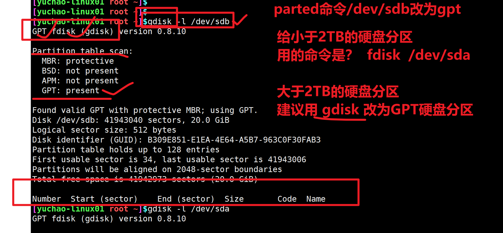

```### 此资源由 58学课资源站 收集整理 ###
	想要获取完整课件资料 请访问：58xueke.com
	百万资源 畅享学习

```
# 磁盘管理

# 学习磁盘管理的背景

数据存储也是网站架构中的一大重点，关于存储方案，我们需要考虑到，硬件、软件


硬件角度

- 存储的读写性能
  - 固态硬盘、机械磁盘的抉择

- 存储的数据备份，数据安全性
  - raid磁盘阵列技术

- 存储的数据扩容，合理的磁盘容量管理，磁盘满了怎么办

软件角度

- 系统对存储的优化参数
- 数据库类软件的优化参数


# 存储管理背景


## 实战目标

- 使用fdisk命令管理磁盘分区
- 格式化分区文件系统
- 磁盘分区挂载（手动、开机启动、自动挂载）
- 理解lvm原理
  - 物理卷、卷组、逻辑卷
  - 创建物理卷
  - 创建卷组
  - 创建逻辑卷
- 熟练掌握lvm的命令。


# 计算机和存储硬件

...

# 硬盘是什么

...

```
硬盘是什么
硬盘就是计算机中用来存储、持久化存储数据的一个设备。
市面主流的硬盘有两类、机械硬盘、固态硬盘，以不同的接口，区分个人硬盘，服务器级别硬盘

区别于内存、硬盘中的数据，关机后，一直存在。
硬盘也被称为磁盘，因为硬盘存储数据和电磁有关，机械硬盘里有很多张磁盘。
```


# 硬盘分区要学什么

...

https://www.diskgenius.cn/

使用U盘实践、查看分区类型

- 分区
- 格式化文件系统
- 挂载


# 磁盘管理知识体系

...

# 数据写入流程

...


# 硬盘原理

...

# 盘片原理

...

# 磁盘知识名词

...磁盘名词（记忆）

> l 磁头（head）数：每个盘片一般有上下两面，分别对应1个磁头，共2个磁头；
>
> l 磁道（track）数：磁道是从盘片外圈往内圈编号0磁道，1磁道...，靠近主轴的同心圆用于停靠磁头，不存储数据；
>
> l 柱面（cylinder）数：同磁道数量；
>
> 
>
> l 扇区（sector）数：每个磁道都别切分成很多扇形区域，每道的扇区数量相同，扇区大小是0.5KB是512字节，文件存储在硬盘中，最小存储单位就是扇区。
>
> l 磁头读取扇区数据，是读取`连续的多个扇区，称之为block（块）`
>
> 
>
> l 圆盘（platter）数：就是盘片的数量。


# linux存储单位（block）

...

# 磁盘分区

...

## mbr类型分区

...


## GPT类型分区

...


# 磁盘接口类型（了解）


# linux磁盘命名规则（重要）


```
用ls  /dev/看看磁盘文件

ls /dev/sd*
/dev/sda  /dev/sda1  /dev/sda2
/dev/sdb
/dev/sdc


```


## fdisk命令分区实践

```
1.给虚拟机，添加硬盘（去京东购买一个新硬盘）

2.查看当前有哪些分区表的信息
lsblk
ls /dev/sd*
fdisk -l


```


# 主分区、扩展分区

...


# fdisk命令实践（mbr）

任务：将sdb硬盘分区（20G）

- 1个主分区  (2G)
- 1个扩展分区 （剩下的全给他） 18G
- 2个逻辑分区
  - 逻辑分区1，10G
  - 逻辑分区2，剩下的都给他  8G

```
1.fdisk /dev/sdb

2.使用指令，去分区实战

3.最终看到的分区应该是
/dev/sdb   /dev/sdb1  /dev/sdb2   /dev/sdb5  /dev/sdb6

```


# lsblk命令

```
[yuchao-linux01 root ~]$lsblk 
NAME            MAJ:MIN RM  SIZE RO TYPE MOUNTPOINT
sda               8:0    0   20G  0 disk 
├─sda1            8:1    0    1G  0 part /boot
└─sda2            8:2    0   19G  0 part 
  ├─centos-root 253:0    0   17G  0 lvm  /
  └─centos-swap 253:1    0    2G  0 lvm  [SWAP]
sdb               8:16   0   20G  0 disk 
├─sdb1            8:17   0    2G  0 part 
├─sdb2            8:18   0    1K  0 part 
├─sdb5            8:21   0   10G  0 part 
└─sdb6            8:22   0    8G  0 part 
sdc               8:32   0   20G  0 disk 
sr0              11:0    1  4.2G  0 rom  

```

### partx刷新分区

```
当你fdisk分区玩了之后，看不到分区的信息，是因为linux内核，还未更新分区表
得使用命令，重新读取磁盘的分区
[yuchao-linux01 root ~]$partx /dev/sdb
NR    START      END  SECTORS SIZE NAME UUID
 1     2048  4196351  4194304   2G      
 2  4196352 41943039 37746688  18G      
 5  4198400 25169919 20971520  10G      
 6 25171968 41943039 16771072   8G      
[yuchao-linux01 root ~]$
[yuchao-linux01 root ~]$
[yuchao-linux01 root ~]$lsblk 
NAME            MAJ:MIN RM  SIZE RO TYPE MOUNTPOINT
sda               8:0    0   20G  0 disk 
├─sda1            8:1    0    1G  0 part /boot
└─sda2            8:2    0   19G  0 part 
  ├─centos-root 253:0    0   17G  0 lvm  /
  └─centos-swap 253:1    0    2G  0 lvm  [SWAP]
sdb               8:16   0   20G  0 disk 
├─sdb1            8:17   0    2G  0 part 
├─sdb2            8:18   0    1K  0 part 
├─sdb5            8:21   0   10G  0 part 
└─sdb6            8:22   0    8G  0 part 
sdc               8:32   0   20G  0 disk 
sr0              11:0    1  4.2G  0 rom  
[yuchao-linux01 root ~]$


```

## 查看磁盘的分区表类型

```
[yuchao-linux01 root ~]$fdisk -l /dev/sdb

Disk /dev/sdb: 21.5 GB, 21474836480 bytes, 41943040 sectors
Units = sectors of 1 * 512 = 512 bytes
Sector size (logical/physical): 512 bytes / 512 bytes
I/O size (minimum/optimal): 512 bytes / 512 bytes
Disk label type: dos   # 看到dos就是mbr类型
Disk identifier: 0xa07c9f25

   Device Boot      Start         End      Blocks   Id  System
/dev/sdb1            2048     4196351     2097152   83  Linux
/dev/sdb2         4196352    41943039    18873344    5  Extended
/dev/sdb5         4198400    25169919    10485760   83  Linux
/dev/sdb6        25171968    41943039     8385536   83  Linux
[yuchao-linux01 root ~]$

```

## 课间练习，创建新硬盘（mbr）

按照如下要求，进行分区为mbr类型

```
任务：将sdb硬盘分区（20G）

- 1个主分区  (2G)
- 1个扩展分区 （剩下的全给他） 18G
- 2个逻辑分区
  - 逻辑分区1，10G
  - 逻辑分区2，剩下的都给他  8G
```


待会再分为gpt类型，最后再去格式化文件系统操作


## 给硬盘分区为GPT类型（GUID类型）

### 删除/dev/sdb分区的信息

```
fdisk /dev/sdb
使用d指令，删除原有所有的mbr分区表下的分区信息

```


# parted命令

是使用parted命令，可以修改硬盘的分区表类型

```
ms-doc  这是mbr类型的名字
gpt 这是GUID分区表的类型名字


parted /dev/sdb 
修改当前硬盘的分区表类型，改为gpt，注意如下操作会摧毁原有的数据
(parted) mklabel gpt  
使用print指令，查看分区表信息，以及分区表类型
(parted) print
Model: VMware, VMware Virtual S (scsi)
Disk /dev/sdb: 21.5GB
Sector size (logical/physical): 512B/512B
Partition Table: gpt
Disk Flags: 

Number  Start  End  Size  File system  Name  Flags

(parted)               
```

因为parted没有太多交互式的提醒，不用它进行分区了，换为gdisk命令去操作超过2TB的硬盘分区动作。

## gdisk命令

```
1.需要额外安装操作
yum install gdisk -y

```



```
gdisk命令用起来和fdisk一样简单，通过n指令，创建分区，p指令查看分区，且输入w才可以写入分区，永久生效

```


..

# 文件系统类型

```

```


# mkfs格式化文件系统

```
使用mkfs命令可以进行分区，文件系统格式化

1.把机器上的/dev/sdc硬盘，重新分区一个单个分区，是20G
fdisk /dev/sdc

2.给这个分区，分别格式化xfs文件系统
[yuchao-linux01 root ~]$mkfs.xfs /dev/sdc1
meta-data=/dev/sdc1              isize=512    agcount=4, agsize=1310656 blks
         =                       sectsz=512   attr=2, projid32bit=1
         =                       crc=1        finobt=0, sparse=0
data     =                       bsize=4096   blocks=5242624, imaxpct=25
         =                       sunit=0      swidth=0 blks
naming   =version 2              bsize=4096   ascii-ci=0 ftype=1
log      =internal log           bsize=4096   blocks=2560, version=2
         =                       sectsz=512   sunit=0 blks, lazy-count=1
realtime =none                   extsz=4096   blocks=0, rtextents=0


3.挂载一个目录，到这个分区，即可使用该分区，存储数据了
[yuchao-linux01 root ~]$mount /dev/sdc1 /opt/my_sdc/
[yuchao-linux01 root ~]$
[yuchao-linux01 root ~]$
[yuchao-linux01 root ~]$mount -l |grep sdc1
/dev/sdc1 on /opt/my_sdc type xfs (rw,relatime,attr2,inode64,noquota)
[yuchao-linux01 root ~]$


4.查看挂载情况
mount -l


5.设置永久挂载
上述的mount挂载命令是临时生效，需要开机就让系统自动挂载，方可实现，永久生效
编辑 /etc/fstab文件即可
[yuchao-linux01 root /opt]$tail -1 /etc/fstab 
/dev/sdc1 /opt/my_sdc xfs defaults 0 0 


6.重启机器，查看是否开机就能自动挂载，读取到/dev/sdc1磁盘的数据
再次使用mount -l |grep sdc 查看磁盘的挂载情况

以及去访问挂载点，是否能读到分区的数据即可

[yuchao-linux01 root ~]$mount -l |grep sdc
/dev/sdc1 on /opt/my_sdc type xfs (rw,relatime,attr2,inode64,noquota)
[yuchao-linux01 root ~]$
[yuchao-linux01 root ~]$
[yuchao-linux01 root ~]$
[yuchao-linux01 root ~]$ls /opt/my_sdc/
准备下课，辛苦了兄弟们


```

## 保留问题

关于分区删除后，文件系统依然存在的问题


# mount挂载分区

```
1.mount挂载命令
mount 设备名  挂载点
[yuchao-linux01 root /opt/my_sdc]$mount /dev/sdc1 /opt/my_sdc/


2.挂载的参数，设置(rw)是可读可写的


3.取消挂载，注意，该挂载点，无人使用，才可以取消挂载
umount 挂载点


```


# 后续磁盘内容

- raid
- lvm


