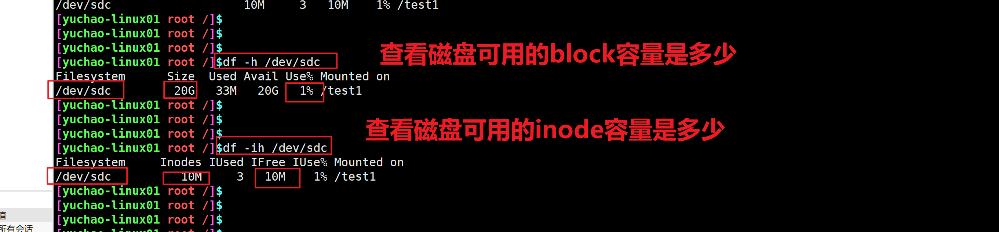

```### 此资源由 58学课资源站 收集整理 ###
	想要获取完整课件资料 请访问：58xueke.com
	百万资源 畅享学习

```


# mount挂载实践

```
mount -l 显示挂载情况
mount -a 读取/etc/fstab所有的挂载设置
mount -o 练习，读写，只读，允许二进制执行的三个参数

[yuchao-linux01 root ~]$mount -o ro /dev/sdc /test1
[yuchao-linux01 root ~]$
[yuchao-linux01 root ~]$
[yuchao-linux01 root ~]$mount -l |grep test1
/dev/sdc on /test1 type ext4 (ro,relatime,data=ordered)
[yuchao-linux01 root ~]$
[yuchao-linux01 root ~]$
[yuchao-linux01 root ~]$cat /test1/冲冲冲 
123
[yuchao-linux01 root ~]$
[yuchao-linux01 root ~]$
[yuchao-linux01 root ~]$echo "456" >> /test1/冲冲冲 
-bash: /test1/冲冲冲: Read-only file system

读写
mount 挂载默认参数，即是rw读写

# 不允许执行程序
noexec 
[yuchao-linux01 root ~]$mount -o noexec,rw /dev/sdc /test1
[yuchao-linux01 root ~]$
[yuchao-linux01 root ~]$
[yuchao-linux01 root ~]$mount -l |grep text1
[yuchao-linux01 root ~]$mount -l |grep test1
/dev/sdc on /test1 type ext4 (rw,noexec,relatime,data=ordered)
[yuchao-linux01 root ~]$


[yuchao-linux01 root /test1]$./hello.sh
-bash: ./hello.sh: Permission denied
[yuchao-linux01 root /test1]$


```

## 退出光盘的命令

```
Eject弹出设备命令
eject # 弹出光驱

eject -r /dev/sr0 # 指定设备弹出

[yuchao-linux-242 root ~]#eject
```


# inode、block、硬链接


## 文件属性查看


---


## 什么是inode

linux的文件名，其实是分为了【元数据】+【文件内容】，两部分。


```
元数据，也就是文件的属性信息，可以通过stat命令查看到

一个新的磁盘，格式化文件系统后，就有了2个存储空间，一个叫做
inode存储空间，存储设备上，所有文件名，对应的元数据信息（文件的属性信息）
一个叫做block存储空间（存储设备上，所有的文件的内容，数据都在这）

存储元数据信息的空间，被称之为Inode

存储文件数据的空间，被称之为block


linux读取文件内容，其实是 以  文件名 > inode编号 > block 的顺序来读取


在你创建文件前必须先要分区、格式化（创建文件系统）
创建文件系统后inode和block的数量就会固定下来。
mkfs.xfs /dev/sdc 格式化xfs文件系统后，inode和block的数量就固定下来了
可以通过xfs_info查看


每个inode都有一个号码，操作系统用inode号码来识别不同的文件。
[yuchao-linux01 root /test1]$ls -l -i  /tmp/c* 
16777294 -rw-r--r-- 1 root root 0 Apr  7 11:01 /tmp/c1
16777702 -rw-r--r-- 1 root root 0 Apr  7 11:01 /tmp/c2

通过ls -i参数，查看文件，文件夹的inode号码
/opt/t1.log
/opt/t2.log 


这里值得重复一遍，Unix/Linux系统内部不使用文件名，而使用inode号码来识别文件。对于系统来说，文件名只是inode号码便于识别的别称或者绰号。

表面上，用户通过文件名，打开文件。实际上，系统内部这个过程分成三步：首先，系统找到这个文件名对应的inode号码；其次，通过inode号码，获取inode信息；最后，根据inode信息，找到文件数据所在的block，读出数据。
```

使用如下命令，查看文件的inode号

```
[yuchao-linux01 root /opt]$ls -i 5G.txt
50391778 5G.txt
```

### 为什么linux要设计inode


```
理解inode，要从文件储存说起。

文件储存在硬盘上，硬盘的最小存储单位叫做"扇区"（Sector）。每个扇区储存512字节（相当于0.5KB）。

操作系统读取硬盘的时候，不会一个个扇区地读取，这样效率太低，而是一次性连续读取多个扇区，即一次性读取一个"块"（block）。这种由多个扇区组成的"块"，是文件存取的最小单位。"块"的大小，最常见的是4KB，即连续八个 sector组成一个 block。

文件数据都储存在"块"中，那么很显然，我们还必须找到一个地方储存文件的元信息，比如文件的创建者、文件的创建日期、文件的大小等等。这种储存文件元信息的区域就叫做inode，中文译名为"索引节点"。

每一个文件都有对应的inode，里面包含了与该文件有关的一些信息。
```


### inode存储的内容

```
* 文件的字节数

* 文件拥有者的User ID

* 文件的Group ID

* 文件的读、写、执行权限

* 文件的时间戳，共有三个：ctime指inode上一次变动的时间，mtime指文件内容上一次变动的时间，atime指文件上一次打开的时间。

* 链接数，即有多少文件名指向这个inode

* 文件数据block的位置
```

可以用stat命令，查看某个文件的具体inode信息

```
[yuchao-linux01 root /opt]$stat t1.log
  File: ‘t1.log’
  Size: 4         	Blocks: 8          IO Block: 4096   regular file
Device: fd00h/64768d	Inode: 50391810    Links: 1
Access: (0644/-rw-r--r--)  Uid: (    0/    root)   Gid: (    0/    root)
Access: 2022-04-06 19:15:09.577496171 +0800
Modify: 2022-04-06 19:15:09.577496171 +0800
Change: 2022-04-06 19:15:09.577496171 +0800
 Birth: -
```


## 图解文件访问原理


## 文件夹和文件的关系


```
目录是一个特殊的文件，目录保存的是当前目录下的文件名字
简单说，文件夹就是方便人类记忆文件存在哪、然后通过这个文件名吗，找到对应的文件inode号
inode号里记录了文件数据所处的block位置，最终访问到数据
```


## 什么是block

```
block是linux实际存储数据的空间，是8个连续的扇区，（8*512bytes=4KB）
单个大文件需要用多个block来存储
特别小的文件即使不满足4KB，也只能浪费其空间。

1 block =4kb

```

## 删除文件原理


---


# 九、软连接、硬链接


## 1.软连接就是windows下的快捷方式

软连接文件存储的是源文件的路径。

```
创建软连接 ln -s参数去创建软连接
↓
当你访问软连接文件，其实是
↓
访问到源文件的路径，源文件的文件名
↓
访问源文件的inode编号  ls -i filename
↓
inode找到block，访问到数据

```


```
软连接特点
1.软连接文件的inode号和源文件不同，作用是存储源文件的路径
2.命令ln -s创建
3.删除普通软连接，不影响源文件
4.删除源文件，软连接找不到目标，报错提示。
```


## 2.硬链接

硬链接，就是一个数据（block）被多个`相同inode号`的文件指向。

就好比超市有好多个大门，但是都能进入到这个超市。。。

- 注意，大坑，硬链接，不得跨分区设置（inode号，是基于分区来创建）


---


```
创建语法
ln 源文件 目标文件

创建硬链接
[yuchao-linux01 root /opt]$ls -l  /yuchao.log
-rw-r--r-- 1 root root 0 Apr  6 20:24 /yuchao.log
[yuchao-linux01 root /opt]$
[yuchao-linux01 root /opt]$ln /yuchao.log /tmp/c1
[yuchao-linux01 root /opt]$ln /yuchao.log /tmp/c2
[yuchao-linux01 root /opt]$
[yuchao-linux01 root /opt]$ls -l  /yuchao.log
-rw-r--r-- 3 root root 0 Apr  6 20:24 /yuchao.log

检查多个硬链接的inode号，都是同一个，表示是指向同一个区域的数据
[yuchao-linux01 root /opt]$ls -i /yuchao.log
71295 /yuchao.log
[yuchao-linux01 root /opt]$ls -i /tmp/c1
71295 /tmp/c1
[yuchao-linux01 root /opt]$ls -i /tmp/c2
71295 /tmp/c2


```


```
硬链接特点
1.可以对已存在的文件做硬链接，该文件的硬链接数，至少是1，为0就表示文件不存在
2.硬链接的文件，inode相同，属性一致
3.只能在同一个磁盘分区下，同一个文件系统下创建硬链接
4.不能对文件夹创建硬链接，只有文件可以
5.删除一个硬链接，不影响其他相同inode号的文件
6.文件夹的硬链接，默认是2个，以及是2+（第一层子目录总数）=文件夹的硬链接数量
7.可以用任意一个硬链接作为入口，操作文件（修改的其实是block中的数据）
8.当文件的硬链接数为0时，文件真的被删除


```

## 文件夹的硬连接

文件夹是一个特殊的文件，默认的连接数就是2

```
由于文件夹中存在两个特殊子目录，一个是
. 当前目录，表示其本身
.. 上级目录，也能通过它，找到当前目录

因此硬连接数是2

如果修改文件的硬链接数，要在它，第一层文件夹中，创建子文件夹，即可增加硬链接数量


```


## 6.工作里咋用

```
1.一般会给文件夹添加软连接，便于管理
2.通过软连接来区分软件的多种版本
3.通过inode号彻底删除文件，和硬连接关联的
```

## 7.练习题

```
1.创建文件夹的软连接
2.创建文件的软连接
3.删除文件、目录的软连接，查看效果
4.删除文件、目录的源文件，查看效果
5.往源文件写入数据，查看软连接文件的变化
6.往软连接里写数据，查看源文件的变化
```


## 查看分区的inode和block数量(xfs_info)

inode和block的数量，是在你mkfs创建文件系统的时候，就已经确定好了

ext4的文件系统，查看文件系统信息的命令，dumpe2fs

xfs文件系统,查看文件系统信息的命令,xfs_info


\

查看某分区，有多少block让你用，（查看这个磁盘，分区还有多少容量）

```
df -h  # -h参数，是友好的显示容量单位，如kb ，mb，gb

```


查看某分区，一共有多少inode容量编号给我们用

```
如/dev/sdc1


[yuchao-linux01 root /opt]$df -i
Filesystem                Inodes  IUsed    IFree IUse% Mounted on
/dev/mapper/centos-root  8910848 129697  8781151    2% /
devtmpfs                  995986    426   995560    1% /dev
tmpfs                     999042      1   999041    1% /dev/shm
tmpfs                     999042   1317   997725    1% /run
tmpfs                     999042     16   999026    1% /sys/fs/cgroup
/dev/sda1                 524288    327   523961    1% /boot
tmpfs                     999042      1   999041    1% /run/user/0
/dev/sdc1               10485248      3 10485245    1% /opt/my_sdc

```




## inode的作用

```
df -h
查看磁盘block空间的使用情况，如果看到分区快满了，可以去删除大容量的文件


df -i 
inode存储文件属性的
当你机器上有大量的无用的小文件，空文件，白白消耗inode数量

查看磁盘分区inode空间的使用情况，如果可用的不多的，删除大量的4kb小文件即可，因为它们真用了太多的无效inode编号，应该留给别人用。

明明 df -h看到磁盘还是有空间，但是写入数据，系统提示你
no space for disk，你虽然还有block空间可以存数据
但是你的inode数量肯定是没了

touch 创建新文件，想分配inode编号，发现不够用了

```


# raid磁盘阵列是什么


# 生产环境下的raid选择

raid 0 

raid 1

raid 1 + raid 0  = raid 10


```
可能用，只会是硬件的磁盘阵列卡

可能不用，现在的存储技术，都发展到了分布式该年，比如主流的共有云服务器，都不用raid技术了，即使人家用了，基本你也完全管不着

只有当你需要拿到一堆服务器，进行服务器从零初始化
对磁盘，做raid技术，4块硬盘，将其采用raid技术搭建
只能是用硬件的raid卡

只能用linux软raid技术，查看它的效果


物理服务器、使用物理raid卡来实现

云服务器、完全不用关心raid搭建，云厂商会给你提供靠谱的高性能、高安全性的磁盘底层技术。

于超老师问过阿里云的技术客服，他们已经不用raid了，而是用2种方式

现在的磁盘，读写速度都很快，阿里的云盘，可以不考虑这些
1.本地高性能硬盘，nvme技术
如https://search.jd.com/Search?keyword=nvme&enc=utf-8


2.分布式存储技术，具体看阿里云文档
https://help.aliyun.com/document_detail/25383.html?source=5176.11533457&userCode=r3yteowb&type=copy
```


# raid级别与特性


# 硬raid、软raid选择

- 硬件购买硬件raid卡即可
- 软件raid，没人用，知道即可，可以用于感受raid方案的效果


## 实战，体验raid10 的玩法

```
1.准备4块硬盘，切记，是新的四块硬盘，没有任何分区的，你可以用parted命令清除原有的分区

[yuchao-linux01 root ~]$lsblk 
NAME            MAJ:MIN RM  SIZE RO TYPE MOUNTPOINT
sda               8:0    0   20G  0 disk 
├─sda1            8:1    0    1G  0 part /boot
└─sda2            8:2    0   19G  0 part 
  ├─centos-root 253:0    0   17G  0 lvm  /
  └─centos-swap 253:1    0    2G  0 lvm  [SWAP]
sdb               8:16   0   20G  0 disk 
sdc               8:32   0   20G  0 disk 
sdd               8:48   0   20G  0 disk 
sde               8:64   0   20G  0 disk 
sr0              11:0    1  4.2G  0 rom  


2.安装raid命令，创建raid10
yum install mdadm -y
 
3.通过命令，吧这4个硬盘，创建为raid 10 组即可
创建raid10这个硬盘组，这个硬盘组的名字 /dev/md0

mdadm -Cv /dev/md0  -a yes -n 4 -l 10 /dev/sdb /dev/sdc /dev/sdd /dev/sde

4.此时正确情况下，你的机器就生成了 md0硬盘设备
[yuchao-linux01 root ~]$fdisk -l /dev/md0

Disk /dev/md0: 42.9 GB, 42914021376 bytes, 83816448 sectors
Units = sectors of 1 * 512 = 512 bytes
Sector size (logical/physical): 512 bytes / 512 bytes
I/O size (minimum/optimal): 524288 bytes / 1048576 bytes

5.格式化文件系统可以用了
[yuchao-linux01 root ~]$mkfs.xfs /dev/md0
[yuchao-linux01 root ~]$mount /dev/md0 /md0_disk/
[yuchao-linux01 root ~]$
[yuchao-linux01 root ~]$
[yuchao-linux01 root ~]$df -h
Filesystem               Size  Used Avail Use% Mounted on
/dev/mapper/centos-root   17G  6.1G   11G  36% /
devtmpfs                 3.8G     0  3.8G   0% /dev
tmpfs                    3.9G     0  3.9G   0% /dev/shm
tmpfs                    3.9G   12M  3.8G   1% /run
tmpfs                    3.9G     0  3.9G   0% /sys/fs/cgroup
/dev/sda1               1014M  142M  873M  14% /boot
tmpfs                    781M     0  781M   0% /run/user/0
/dev/md0                  40G   33M   40G   1% /md0_disk


6.查看raid10 状态的命令
[yuchao-linux01 root ~]$
[yuchao-linux01 root ~]$mdadm -D /dev/md0

7.移除一块硬盘，查看磁盘组是否还可用
mdadm /dev/md0 -f /dev/sdd


8.第七部，模拟的一块硬盘损坏了，你还得重新加入一个新的硬盘，继续恢复raid 10的状态

因此你得买硬盘，重启机器，重新修复raid10

reboot

9.添加硬盘到阵列组中
 mdadm /dev/md0 -a /dev/sdd
 
10.再去验证磁盘组 /dev/md0的状态，是否都恢复了
留成课下作业提交查看。

11.你可以删除所有的raid，查看笔记操作即可，。

```


