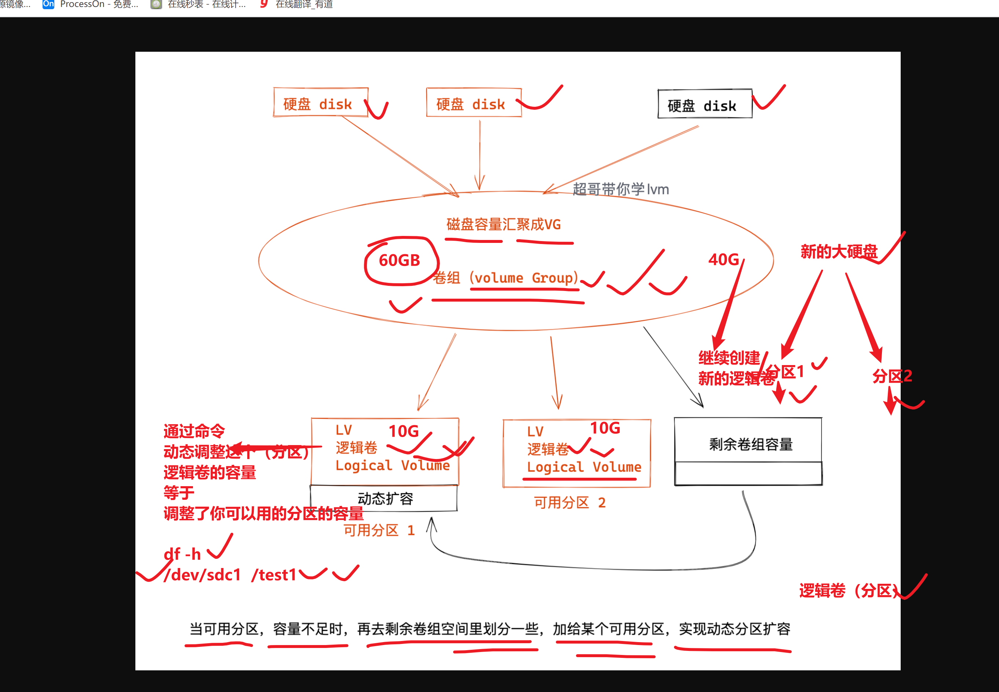
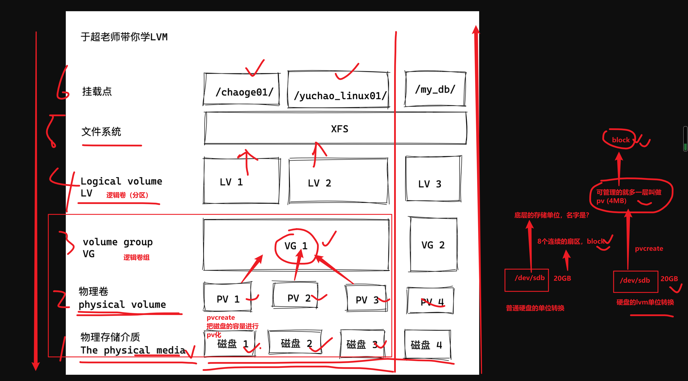
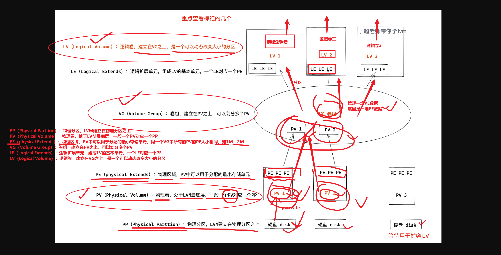
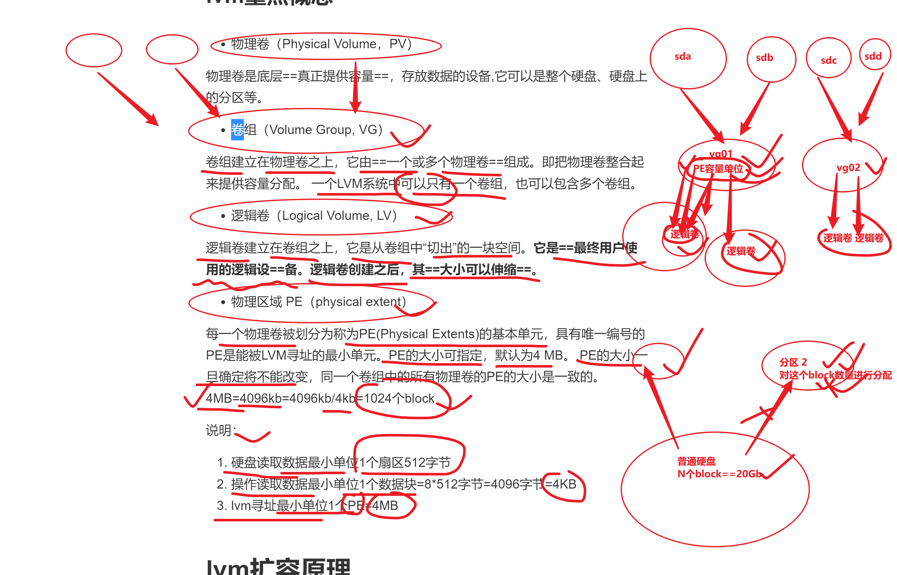
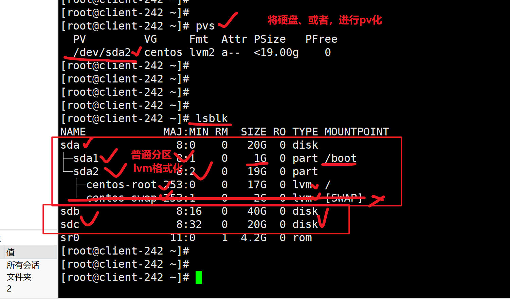
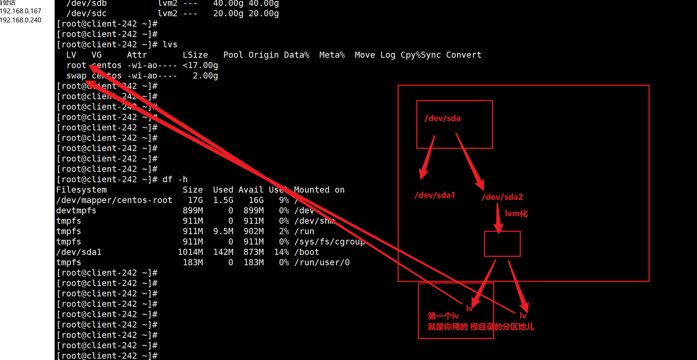

```### 此资源由 58学课资源站 收集整理 ###
	想要获取完整课件资料 请访问：58xueke.com
	百万资源 畅享学习

```
# 为什么学lvm

```
250GB

虚拟机


试想，企业里的生产服务器，一开始没有规划好磁盘容量，随着用户增长，磁盘可能会逐渐填满
这时候你只能添加新硬盘，新分区
但是旧的数据还在旧的磁盘分区上，你就只能停止业务进行数据迁移了。

lvm也是吧多个磁盘，化成一个大硬盘，但是特点是，后期可以继续加入新硬盘，这个逻辑卷组的容量就扩大了，等于这个大硬盘容量更大
使用这个逻辑卷组（500G+100G=600G）（大硬盘500G）
↓
获取部分的容量，化为一个逻辑卷（分区）
↓
逻辑卷进行格式化（分区进行格式化）
↓
挂载使用


但是如果你用了lvm，你可以将多个物理分区、抽象为一个逻辑卷组，并且这个逻辑卷组是可以动态扩容、缩容的。
当逻辑卷组容量不够了，只需要买新硬盘，通过命令再添加到这个指定的逻辑卷组中，可以在不停机的情况下，立即实现扩容，且被linux识别，那可是太巴适了。
```


# 什么是LVM


# 图解lvm工作流程



---




# lvm原理名词记忆



---




## lvm重点名词

```
普通磁盘
↓
格式化文件系统、block=4KB ，有N个block
↓
挂载分区使用


lvm磁盘
↓
磁盘、格式化为PV（磁盘的容量被分为N个PE） ，PE默认单位是4MB，等于1024个block
↓
PV加入卷组VG（动态伸缩的大磁盘）
↓
创建逻辑卷LV（等于创建了分区）
↓
格式化文件系统xfs （sdb sdc sdd），逻辑卷
↓
挂载使用


```


# lvm扩容原理

增减PE


# LVM优点


# lvm常用命令

## 再次通过lsblk查看磁盘信息




## pv命令

```
前提是需要安装lvm命令
yum install lvm2 -y
安装该工具后，方可使用lvm的命令
pvcreate
pvs
[root@client-242 ~]# pvs
  PV         VG     Fmt  Attr PSize   PFree 
  /dev/sda2  centos lvm2 a--  <19.00g     0 
  /dev/sdb          lvm2 ---   40.00g 40.00g
[root@client-242 ~]# 


pvscan
[root@client-242 ~]# pvscan 
  PV /dev/sda2   VG centos          lvm2 [<19.00 GiB / 0    free]
  PV /dev/sdb                       lvm2 [40.00 GiB]
  Total: 2 [<59.00 GiB] / in use: 1 [<19.00 GiB] / in no VG: 1 [40.00 GiB]
[root@client-242 ~]# 


[root@client-242 ~]# pvdisplay 


1.准备好硬盘
/dev/sdb

2.对硬盘进行pv化，然后查看pv的信息

3.删除pv
[root@client-242 ~]# pvremove /dev/sdb
  Labels on physical volume "/dev/sdb" successfully wiped.


```


## vg命令

```
vgs 查看机器上现有的卷组信息

来自于sda硬盘，创建的pv，加入的卷组，名字是centos

[root@client-242 ~]# vgs
  VG     #PV #LV #SN Attr   VSize   VFree
  centos   1   2   0 wz--n- <19.00g    0 


1.将2块硬盘 sdb sdc 创建为 vg-0224

第一件事 pv化
[root@client-242 ~]# pvcreate  /dev/sdb /dev/sdc
  Physical volume "/dev/sdb" successfully created.
  Physical volume "/dev/sdc" successfully created.


2.加入卷组
[root@client-242 ~]# vgcreate vg-02241  /dev/sdb /dev/sdc
  Volume group "vg-0224" successfully created


vgs
vgscan
vgdisplay
删除vg
[root@client-242 ~]# vgremove vg-0224
  Volume group "vg-0224" successfully removed


```


## lv命令




```
lv的参数选项
lvcreate 
-L 指定逻辑卷的大小，单位为“kKmMgGtT”字节
-l 指定逻辑卷的大小（PE个数）
-n 后面跟逻辑卷名 
-s 创建快照


查看当前机器的逻辑卷信息
lvs

根据卷组，创建逻辑卷
[root@client-242 ~]# pvs
  PV         VG     Fmt  Attr PSize   PFree 
  /dev/sda2  centos lvm2 a--  <19.00g     0 
  /dev/sdb          lvm2 ---   40.00g 40.00g
  /dev/sdc          lvm2 ---   20.00g 20.00g
[root@client-242 ~]# 
[root@client-242 ~]# 
[root@client-242 ~]# 
[root@client-242 ~]# 
[root@client-242 ~]# vgs
  VG     #PV #LV #SN Attr   VSize   VFree
  centos   1   2   0 wz--n- <19.00g    0 
[root@client-242 ~]# 
[root@client-242 ~]# 
[root@client-242 ~]# 
[root@client-242 ~]# vgcreate vg-0224  /dev/sdb /dev/sdc
  Volume group "vg-0224" successfully created
[root@client-242 ~]# 
[root@client-242 ~]# 
[root@client-242 ~]# vgs
  VG      #PV #LV #SN Attr   VSize   VFree 
  centos    1   2   0 wz--n- <19.00g     0 
  vg-0224   2   0   0 wz--n-  59.99g 59.99g


创建lv，设定为卷组容量的一半
[root@client-242 ~]# vgs
  VG      #PV #LV #SN Attr   VSize   VFree 
  centos    1   2   0 wz--n- <19.00g     0 
  vg-0224   2   0   0 wz--n-  59.99g 59.99g
[root@client-242 ~]# 
[root@client-242 ~]# 
[root@client-242 ~]# lvcreate -n 0224lv1 -l 50%VG vg-0224
  Logical volume "0224lv1" created.
[root@client-242 ~]# 
[root@client-242 ~]# lvs
  LV      VG      Attr       LSize   Pool Origin Data%  Meta%  Move Log Cpy%Sync Convert
  root    centos  -wi-ao---- <17.00g                                                    
  swap    centos  -wi-ao----   2.00g                                                    
  0224lv1 vg-0224 -wi-a----- <30.00g                                                    
[root@client-242 ~]# 
[root@client-242 ~]# 


删除逻辑卷
[root@client-242 ~]# lvremove /dev/vg-0224/0224lv1 
Do you really want to remove active logical volume vg-0224/0224lv1? [y/n]: y
  Logical volume "0224lv1" successfully removed
[root@client-242 ~]# 


指定逻辑卷大小
[root@client-242 ~]# lvcreate -n lv1-0224 -L 20G vg-0224
  Logical volume "lv1-0224" created.
[root@client-242 ~]# 
[root@client-242 ~]# 
[root@client-242 ~]# lvs
  LV       VG      Attr       LSize   Pool Origin Data%  Meta%  Move Log Cpy%Sync Convert
  root     centos  -wi-ao---- <17.00g                                                    
  swap     centos  -wi-ao----   2.00g                                                    
  lv1-0224 vg-0224 -wi-a-----  20.00g   
  

```

## 清空lvm的环境

```
1.删逻辑卷 lv
2. 删卷组 vg
3. 删pv  

还原了硬盘的本质，普通硬盘
[root@client-242 ~]# 
[root@client-242 ~]# lvs
  LV       VG      Attr       LSize   Pool Origin Data%  Meta%  Move Log Cpy%Sync Convert
  root     centos  -wi-ao---- <17.00g                                                    
  swap     centos  -wi-ao----   2.00g                                                    
  lv1-0224 vg-0224 -wi-a-----  20.00g                                                    
[root@client-242 ~]# 
[root@client-242 ~]# 
[root@client-242 ~]# lvremove /dev/vg-0224/lv1-0224 
Do you really want to remove active logical volume vg-0224/lv1-0224? [y/n]: y
  Logical volume "lv1-0224" successfully removed
[root@client-242 ~]# 
[root@client-242 ~]# 
[root@client-242 ~]# vgremove vg-0224
  Volume group "vg-0224" successfully removed
[root@client-242 ~]# 
[root@client-242 ~]# 
[root@client-242 ~]# 
[root@client-242 ~]# pvremove /dev/sdb /dev/sdc
  Labels on physical volume "/dev/sdb" successfully wiped.
  Labels on physical volume "/dev/sdc" successfully wiped.
[root@client-242 ~]# 
[root@client-242 ~]# 
[root@client-242 ~]# lvs
  LV   VG     Attr       LSize   Pool Origin Data%  Meta%  Move Log Cpy%Sync Convert
  root centos -wi-ao---- <17.00g                                                    
  swap centos -wi-ao----   2.00g                                                    
[root@client-242 ~]# 
[root@client-242 ~]# 
[root@client-242 ~]# vgs
  VG     #PV #LV #SN Attr   VSize   VFree
  centos   1   2   0 wz--n- <19.00g    0 
[root@client-242 ~]# 
[root@client-242 ~]# 
[root@client-242 ~]# pvs
  PV         VG     Fmt  Attr PSize   PFree
  /dev/sda2  centos lvm2 a--  <19.00g    0 
[root@client-242 ~]# 
[root@client-242 ~]# 
[root@client-242 ~]# 

```

## 课堂练习

```
参考课堂笔记，完成

1.创建2块硬盘，分别是10G，20G

3.练习pv、vg、lv的增删改查，以及环境清理
```


# lvm创建流程（重点）

要求

- 使用2块硬盘，容量分别是30G，30G
- 创建卷组，名字是vg0224

- 创建3个lv，名字依次是0224-lv1,0224-lv2,0224-lv3，容量分别是10G，15G，25G
- 3个逻辑卷，挂载点分别是/test1 /test2 /test3，文件系统分别是xfs、xfs、ext4
- 要求分别查看3个逻辑卷的文件系统信息
- 要求扩容0224-lv1，扩大到30G容量


```
1.安装lvm
yum install lvm2 -y

2.查看pv
pvs

3.创建pv
[root@client-242 ~]# pvcreate /dev/sdb /dev/sdc


4.查看创建后的pv
[root@client-242 ~]# pvs
  PV         VG     Fmt  Attr PSize   PFree 
  /dev/sda2  centos lvm2 a--  <19.00g     0 
  /dev/sdb          lvm2 ---   40.00g 40.00g
  /dev/sdc          lvm2 ---   20.00g 20.00g


5.查看vg
[root@client-242 ~]# vgs
  VG     #PV #LV #SN Attr   VSize   VFree
  centos   1   2   0 wz--n- <19.00g    0 


6.创建vg sdb sdc创建为卷组，名字是 vg1-0224
注意语法

[root@client-242 ~]# vgcreate vg1-0224  /dev/sdb /dev/sdc
  Volume group "vg1-0224" successfully created
[root@client-242 ~]# 
[root@client-242 ~]# 


7.查看创建后的vg

[root@client-242 ~]# vgs
  VG       #PV #LV #SN Attr   VSize   VFree 
  centos     1   2   0 wz--n- <19.00g     0 
  vg1-0224   2   0   0 wz--n-  59.99g 59.99g


8.查看lv
lvs


9.创建lv（创建分区）
一个lv1  20G
lv2  15G 

[root@client-242 ~]# lvcreate -n lv1  -L 20G  vg1-0224
  Logical volume "lv1" created.
[root@client-242 ~]# 
[root@client-242 ~]# 
[root@client-242 ~]# lvcreate -n lv2  -L 10G  vg1-0224
  Logical volume "lv2" created.
[root@client-242 ~]# 
[root@client-242 ~]# 
[root@client-242 ~]# lvs
  LV   VG       Attr       LSize   Pool Origin Data%  Meta%  Move Log Cpy%Sync Convert
  root centos   -wi-ao---- <17.00g                                                    
  swap centos   -wi-ao----   2.00g                                                    
  lv1  vg1-0224 -wi-a-----  20.00g                                                    
  lv2  vg1-0224 -wi-a-----  10.00g                                                    
[root@client-242 ~]# 
[root@client-242 ~]# 
[root@client-242 ~]# ls /dev/vg1-0224/
lv1  lv2


10.查看lv
lvs


11.查看磁盘设备信息
通过如下命令，查看lvm设备的信息

[root@client-242 ~]# blkid |grep 'sd[bc]'
/dev/sdb: UUID="O5ueJC-Tbd2-qab2-kx6U-Z2dD-y4od-tjosy3" TYPE="LVM2_member" 
/dev/sdc: UUID="uygL2d-owAr-NCoC-j6Ml-dHrT-QbSh-DjABxZ" TYPE="LVM2_member" 


查看/dev/卷组/

ls /dev/vg1-0224/


12.给lv格式化文件系统
lv1  20G ---xfs
lv2  15G  ----ext4

[root@client-242 ~]# mkfs.xfs /dev/vg1-0224/lv1

[root@client-242 ~]# mkfs.ext4 /dev/vg1-0224/lv2


13.挂载lv
mount 设备名   挂载点

[root@client-242 ~]# mount /dev/vg1-0224/lv1 /t1
[root@client-242 ~]# 
[root@client-242 ~]# 
[root@client-242 ~]# 
[root@client-242 ~]# mount /dev/vg1-0224/lv2 /t2


14.查看挂载

[root@client-242 ~]# mount -l |grep t1
/dev/mapper/vg1--0224-lv1 on /t1 type xfs (rw,relatime,attr2,inode64,noquota)
[root@client-242 ~]# mount -l |grep t2
/dev/mapper/vg1--0224-lv2 on /t2 type ext4 (rw,relatime,data=ordered)

[root@client-242 ~]# df -h
Filesystem                 Size  Used Avail Use% Mounted on
/dev/mapper/centos-root     17G  1.5G   16G   9% /
devtmpfs                   899M     0  899M   0% /dev
tmpfs                      911M     0  911M   0% /dev/shm
tmpfs                      911M  9.6M  902M   2% /run
tmpfs                      911M     0  911M   0% /sys/fs/cgroup
/dev/sda1                 1014M  142M  873M  14% /boot
tmpfs                      183M     0  183M   0% /run/user/0
/dev/mapper/vg1--0224-lv1   20G   33M   20G   1% /t1
/dev/mapper/vg1--0224-lv2  9.8G   37M  9.2G   1% /t2


[root@client-242 ~]# lsblk 
NAME            MAJ:MIN RM  SIZE RO TYPE MOUNTPOINT
sda               8:0    0   20G  0 disk 
├─sda1            8:1    0    1G  0 part /boot
└─sda2            8:2    0   19G  0 part 
  ├─centos-root 253:0    0   17G  0 lvm  /
  └─centos-swap 253:1    0    2G  0 lvm  [SWAP]
sdb               8:16   0   40G  0 disk 
├─vg1--0224-lv1 253:2    0   20G  0 lvm  /t1
└─vg1--0224-lv2 253:3    0   10G  0 lvm  /t2
sdc               8:32   0   20G  0 disk 
sr0              11:0    1  4.2G  0 rom  

尝试写入数据

[root@client-242 ~]# touch /t1/今天也是美好的一天
[root@client-242 ~]# touch /t2/明天更是美好的一天
[root@client-242 ~]# 
[root@client-242 ~]# 
[root@client-242 ~]# ls /t1
今天也是美好的一天
[root@client-242 ~]# ls /t2
lost+found  明天更是美好的一天


15.开机自动挂载
一定切记，如果你的设备发生了变化，一定要去修改/etc/fstab
否则系统开机，读取该fstab文件，找不到设备，无法正确挂载就会报错
进入紧急模式，直到你再次修复fstab文件
重启即可

把t1 t2设置为开机自动挂载
[root@client-242 ~]# tail -2 /etc/fstab 
UUID="04fda700-511c-43d4-ae9a-d87d72ee7175"  /t1  xfs  defaults 0 0 
/dev/mapper/vg1--0224-lv2 /t2  ext4  defaults 0 0 


16.重启
reboot


```


# lvm扩容（重点）

需求

```
先查看当前机器的lv情况，确定你要扩容的设备
[root@client-242 ~]# df -h |grep t2
/dev/mapper/vg1--0224-lv2  9.8G   37M  9.2G   1% /t2

扩容到20G需求
1. 你的卷组，容量还够不够
2. 卷组容量不够，加新硬盘，再次pv化，加入卷组就好了
```

## 方案1，卷组容量够

```
1.确认vg够不够
[root@client-242 ~]# vgs
  VG       #PV #LV #SN Attr   VSize   VFree 
  centos     1   2   0 wz--n- <19.00g     0 
  vg1-0224   2   2   0 wz--n-  59.99g 29.99g


2.确认够用，直接lvextend扩容lv逻辑卷即可
给lv2增加10G
[root@client-242 ~]# lvextend -L +10G  /dev/vg1-0224/lv2
  Size of logical volume vg1-0224/lv2 changed from 10.00 GiB (2560 extents) to 20.00 GiB (5120 extents).
  Logical volume vg1-0224/lv2 successfully resized.
[root@client-242 ~]# 
[root@client-242 ~]# 
[root@client-242 ~]# lvs
  LV   VG       Attr       LSize   Pool Origin Data%  Meta%  Move Log Cpy%Sync Convert
  root centos   -wi-ao---- <17.00g                                                    
  swap centos   -wi-ao----   2.00g                                                    
  lv1  vg1-0224 -wi-ao----  20.00g                                                    
  lv2  vg1-0224 -wi-ao----  20.00g      
  
  
用法2，直接，调整到25G大小
[root@client-242 ~]# lvextend -L 25G /dev/vg1-0224/lv2
  Size of logical volume vg1-0224/lv2 changed from 20.00 GiB (5120 extents) to 25.00 GiB (6400 extents).
  Logical volume vg1-0224/lv2 successfully resized.
[root@client-242 ~]# 
[root@client-242 ~]# lvs
  LV   VG       Attr       LSize   Pool Origin Data%  Meta%  Move Log Cpy%Sync Convert
  root centos   -wi-ao---- <17.00g                                                    
  swap centos   -wi-ao----   2.00g                                                    
  lv1  vg1-0224 -wi-ao----  20.00g                                                    
  lv2  vg1-0224 -wi-ao----  25.00g      

3.虽然你调整了 lv2逻辑卷的大小，但是文件系统它不知道，你得告诉文件系统，也跟着调整分区的容量，以及重新设置block的数量

ext4文件系统，使用resize2fs命令
xfs文件系统，使用xfs_growfs调整大小


4.调整lv ext4文件系统的大小
[root@client-242 ~]# resize2fs /dev/mapper/vg1--0224-lv2
resize2fs 1.42.9 (28-Dec-2013)
Filesystem at /dev/mapper/vg1--0224-lv2 is mounted on /t2; on-line resizing required
old_desc_blocks = 2, new_desc_blocks = 4
The filesystem on /dev/mapper/vg1--0224-lv2 is now 6553600 blocks long.


[root@client-242 ~]# df -hT
Filesystem                Type      Size  Used Avail Use% Mounted on
/dev/mapper/centos-root   xfs        17G  1.6G   16G   9% /
devtmpfs                  devtmpfs  899M     0  899M   0% /dev
tmpfs                     tmpfs     911M     0  911M   0% /dev/shm
tmpfs                     tmpfs     911M  9.6M  902M   2% /run
tmpfs                     tmpfs     911M     0  911M   0% /sys/fs/cgroup
/dev/sda1                 xfs      1014M  142M  873M  14% /boot
/dev/mapper/vg1--0224-lv1 xfs        20G   33M   20G   1% /t1
/dev/mapper/vg1--0224-lv2 ext4       25G   44M   24G   1% /t2
tmpfs                     tmpfs     183M     0  183M   0% /run/user/0
[root@client-242 ~]# 


5.调整lv1的文件系统，调整到50G

看看卷组还剩下多少，不够用了，就得扩大卷组了
[root@client-242 ~]# vgs
  VG       #PV #LV #SN Attr   VSize   VFree 
  centos     1   2   0 wz--n- <19.00g     0 
  vg1-0224   2   2   0 wz--n-  59.99g 14.99g
[root@client-242 ~]# 
[root@client-242 ~]# 


```


## 情况2，卷组容量不够了

```
1.创建新物理卷，pv
步骤
关机、添加硬盘，开机
添加一个50G硬盘
[root@client-242 ~]# ls /dev/sd*
/dev/sda  /dev/sda1  /dev/sda2  /dev/sdb  /dev/sdc  /dev/sdd

给硬盘pv化
[root@client-242 ~]# pvcreate /dev/sdd
  Physical volume "/dev/sdd" successfully created.

2.查看pv
pvs


3.查看vg
vgs

[root@client-242 ~]# pvs
  PV         VG       Fmt  Attr PSize   PFree 
  /dev/sda2  centos   lvm2 a--  <19.00g     0 
  /dev/sdb   vg1-0224 lvm2 a--  <40.00g     0 
  /dev/sdc   vg1-0224 lvm2 a--  <20.00g 14.99g
  /dev/sdd            lvm2 ---   50.00g 50.00g
[root@client-242 ~]# 
[root@client-242 ~]# 
[root@client-242 ~]# vgs
  VG       #PV #LV #SN Attr   VSize   VFree 
  centos     1   2   0 wz--n- <19.00g     0 
  vg1-0224   2   2   0 wz--n-  59.99g 14.99g


4.vg扩容

[root@client-242 ~]# 
[root@client-242 ~]# vgextend vg1-0224  /dev/sdd
  Volume group "vg1-0224" successfully extended
[root@client-242 ~]# 
[root@client-242 ~]# vgs
  VG       #PV #LV #SN Attr   VSize    VFree  
  centos     1   2   0 wz--n-  <19.00g      0 
  vg1-0224   3   2   0 wz--n- <109.99g <64.99g


5.再次查看vg
[root@client-242 ~]# vgs
  VG       #PV #LV #SN Attr   VSize    VFree  
  centos     1   2   0 wz--n-  <19.00g      0 
  vg1-0224   3   2   0 wz--n- <109.99g <64.99g


6.扩容lv

[root@client-242 ~]# 
[root@client-242 ~]# lvextend -L 50G /dev/vg1-0224/lv1
  Size of logical volume vg1-0224/lv1 changed from 20.00 GiB (5120 extents) to 50.00 GiB (12800 extents).
  Logical volume vg1-0224/lv1 successfully resized.
[root@client-242 ~]# 
[root@client-242 ~]# 
[root@client-242 ~]# 


7.再次查看lv

[root@client-242 ~]# 
[root@client-242 ~]# lvs
  LV   VG       Attr       LSize   Pool Origin Data%  Meta%  Move Log Cpy%Sync Convert
  root centos   -wi-ao---- <17.00g                                                    
  swap centos   -wi-ao----   2.00g                                                    
  lv1  vg1-0224 -wi-ao----  50.00g                                                    
  lv2  vg1-0224 -wi-ao----  25.00g                                                    
[root@client-242 ~]# 


8.调整xfs文件系统
[root@client-242 ~]# xfs_growfs /t1
meta-data=/dev/mapper/vg1--0224-lv1 isize=512    agcount=4, agsize=1310720 blks
         =                       sectsz=512   attr=2, projid32bit=1
         =                       crc=1        finobt=0 spinodes=0
data     =                       bsize=4096   blocks=5242880, imaxpct=25
         =                       sunit=0      swidth=0 blks
naming   =version 2              bsize=4096   ascii-ci=0 ftype=1
log      =internal               bsize=4096   blocks=2560, version=2
         =                       sectsz=512   sunit=0 blks, lazy-count=1
realtime =none                   extsz=4096   blocks=0, rtextents=0
data blocks changed from 5242880 to 13107200


9.查看磁盘挂载容量情况
[root@client-242 ~]# 
[root@client-242 ~]# df -hT
Filesystem                Type      Size  Used Avail Use% Mounted on
/dev/mapper/centos-root   xfs        17G  1.6G   16G   9% /
devtmpfs                  devtmpfs  899M     0  899M   0% /dev
tmpfs                     tmpfs     911M     0  911M   0% /dev/shm
tmpfs                     tmpfs     911M  9.6M  902M   2% /run
tmpfs                     tmpfs     911M     0  911M   0% /sys/fs/cgroup
/dev/sda1                 xfs      1014M  142M  873M  14% /boot
/dev/mapper/vg1--0224-lv1 xfs        50G   33M   50G   1% /t1
/dev/mapper/vg1--0224-lv2 ext4       25G   44M   24G   1% /t2
tmpfs                     tmpfs     183M     0  183M   0% /run/user/0
[root@client-242 ~]# 
[root@client-242 ~]# 


```


# 删除lvm

严谨考虑，确保别出问题

删除lvm

```
1.考虑/etc/fstab，清除开机自动挂载的配置

2.取消挂载
[root@client-242 ~]# umount /t1
[root@client-242 ~]# umount /t2


3.依次删除lvm的组件
[root@client-242 ~]# 
[root@client-242 ~]# lvremove /dev/vg1-0224/lv1
Do you really want to remove active logical volume vg1-0224/lv1? [y/n]: y
  Logical volume "lv1" successfully removed
[root@client-242 ~]# 
[root@client-242 ~]# lvremove /dev/vg1-0224/lv2
Do you really want to remove active logical volume vg1-0224/lv2? [y/n]: y
  Logical volume "lv2" successfully removed
[root@client-242 ~]# 

删除vg
[root@client-242 ~]# vgremove vg1-0224
  Volume group "vg1-0224" successfully removed
[root@client-242 ~]# 
[root@client-242 ~]# 
[root@client-242 ~]# vgs
  VG     #PV #LV #SN Attr   VSize   VFree
  centos   1   2   0 wz--n- <19.00g    0 


删除pv，还原磁盘原本类型
[root@client-242 ~]# 
[root@client-242 ~]# pvremove /dev/sdb /dev/sdc /dev/sdd
  Labels on physical volume "/dev/sdb" successfully wiped.
  Labels on physical volume "/dev/sdc" successfully wiped.
  Labels on physical volume "/dev/sdd" successfully wiped.
[root@client-242 ~]# 


最后，磁盘就还原为了不可动态调整的磁盘了，你可以格式化后，挂载使用该设备
[root@client-242 ~]# mount /dev/sdd /t1
[root@client-242 ~]# 
[root@client-242 ~]# df -hT
Filesystem              Type      Size  Used Avail Use% Mounted on
/dev/mapper/centos-root xfs        17G  1.6G   16G   9% /
devtmpfs                devtmpfs  899M     0  899M   0% /dev
tmpfs                   tmpfs     911M     0  911M   0% /dev/shm
tmpfs                   tmpfs     911M  9.6M  902M   2% /run
tmpfs                   tmpfs     911M     0  911M   0% /sys/fs/cgroup
/dev/sda1               xfs      1014M  142M  873M  14% /boot
tmpfs                   tmpfs     183M     0  183M   0% /run/user/0
/dev/sdd                xfs        50G   33M   50G   1% /t1
[root@client-242 ~]# 


```


# 大练习

要求

- 使用2块硬盘，容量分别是30G，30G
- 创建卷组，名字是vg0224

- 创建3个lv，名字依次是0224-lv1,0224-lv2,0224-lv3，容量分别是10G，15G，25G
- 3个逻辑卷，挂载点分别是/test1 /test2 /test3，文件系统分别是xfs、xfs、ext4
- 要求分别查看3个逻辑卷的文件系统信息
- 要求扩容0224-lv1，扩大到30G容量


# 整理磁盘管理篇的学习笔记

- 笔记
- 脑图
- 博客


