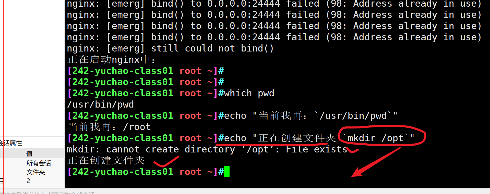

```### 此资源由 58学课资源站 收集整理 ###
	想要获取完整课件资料 请访问：58xueke.com
	百万资源 畅享学习

```
# 如何学这些符号

- 通配符
- 正则表达式


学正则表达式 

1.学语法 

2.根据需求，思考正则、解决问题 。

因此学正则只有一个字，练


# 什么是通配符

（通配符是用来找文件，根据文件名找文件的时候，使用该符号）

/opt/myfirst.txt

```
1. 文件有名字，可以用于找到该文件=============通配符

2. 文件有内有数据，内部的一堆字符串==============正则表达式
```


- 当你在查找特定文件名，却不记得如何拼写时，通配符是帮你寻找的神器。
- 通配符,是专门用于处理文件名的特殊字符，而不是文件内容！
- 可以方便查找类似、但是不相同的文件名。
- 通配符是shell的内置语法、大部分linux命令都认识通配符

# 通配符语法

```
假设要找到如下的文件名

/opt/myfirst.txt
```


| **字符** | **说明**                                                     | **示例**                                      |
| -------- | ------------------------------------------------------------ | --------------------------------------------- |
| *        | 匹配任意字符数。 您可以在字符串中使用星号 (*****)。          | ls /opt/my*.txt                               |
| ?        | 在特定位置中匹配单个字母。                                   | ls /opt/myfis?.txt                            |
| [ ]      | 匹配方括号中的字符。[abd]，[a-z]                             | ls /opt/myfirs[a-z].txt                       |
| !        | 在方括号中排除字符 [!abcd]   [!a-z]                          | ls  myfirs[!a-g].txt                          |
| -        | 匹配一个范围内的字符。 记住以升序指定字符（A 到 Z，而不是 Z 到 A）。 | [a-z] 小写的a一直到z的序列 [A-Z]  [0-9a-zA-Z] |
|          |                                                              |                                               |
|          |                                                              |                                               |
| ^        | 同感叹号、在方括号中排除字符，用法和感叹号一样               | ls [^a-c]yfirst.txt                           |
|          |                                                              |                                               |


# 测试数据

```
[yuchao-linux-242 root /tmp]#mkdir /test ;cd /test
[yuchao-linux-242 root /test]#
[yuchao-linux-242 root /test]#touch
yuchao.txt yuc.txt cc.txt yuchao01.log yuyu.log cc.sh

txt
	yuchao.txt yuc.txt cc.txt 
log
sh

```


## * 匹配任意字符

ls find

```
cd /test/

找出所有txt结尾的文件
ls  *.txt 

找出以y开头的txt文件
ls  y*.txt

找出以y开头t结尾的文件
ls y*t

查看以.sh结尾的shell脚本文件
ls *.sh

找出机器上所有的以y开头且是sh脚本的文件
find / -name 'y*.sh'


# 找出机器上 所有的sh文件，且文件名是？以小写字母开头的sh文件
find /   -name '[a-z]*.sh'

# 找出机器上，所有的以数字开头的sh文件
find /  -name '[0-9]*.sh'

# 找出机器上，大写字母或是数字开头的sh文件
find / -name '[A-Z0-9].sh'

# 这个意思是？找出机器上的单个字符的sh文件，文件名是大写字母或是数字的
find / -name '[A-Z0-9].sh'


查看以yu开头、txt结尾的文件
ls yu*.txt


查看以yu开头、log结尾的文件
ls yu*.log


查看所有以yu开头的文件

ls yu*


找出以c开头的文件

ls c*

找出文件名包含了chao的文件

ls  *chao*


```

## ? 匹配任意一个字符（用得少）

```
可以执行吗？
[yuchao-linux-242 root /test]#ls ?.sh
不能执行，找不就当的字符开头的.txt文件就不能执行

如何查找特定字符数量的文件？


找出所有sh脚本文件，必须用?符号

最方便的办法，不考虑前面文件名有多长
ls *.sh

必须用?去找sh文件
?.txt    所有当字符.txt
??.txt   所有2个字符.txt


找出当前目录下所有txt ，必须用?符号

先不用问号
ls *.txt


必须使用问号，不得有其他符号
[242-yuchao-class01 root /test]#ls ?.txt;ls ??.txt; ls ???.txt
0.txt  h.txt  H.txt  &.txt
cc.txt
Q&a.txt  yuc.txt


注意，不要去写 这样的符号，比较无聊
当然你得看懂这个写法
ls ?*.txt


```


## []  匹配方括号里的内容


```
实测，[a-z] 找到a到z之间的所有字母，不区分大小写了

只能限定的使用[abc]或[ABC]

[242-yuchao-class01 root /test]#ls yu[abc].txt
yua.txt  yub.txt  yuc.txt

[242-yuchao-class01 root /test]#ls yu[ABC].txt
yuA.txt  yuB.txt  yuC.txt

具体你想还使用，匹配所有的大写，所有小写，使用unix风格的即可

ls [[:upper:]].log
ls [[:lower:]].log

找出以yu开头后续是单个小写字母的txt文件
ls yu[[:lower:]].txt
ls yu[[:upper:]].txt


```


```
创建测试数据，如
[yuchao-linux-242 root /test]#touch {a..g}.log
[yuchao-linux-242 root /test]#ls
a.log  b.log  cc.sh  cc.txt  c.log  c.sh  d.log  e.log  f.log  g.log  yuchao01.log  yuchao.txt  yuc.txt  yuyu.log


找出a-z之间任意一个字符的log

[242-yuchao-class01 root /test]#ls [a-z].log
a.log  b.log  c.log  d.log  e.log  f.log  g.log

或许是bash的问题
unix(posix)   ，匹配大写字母[[:upper:]]，小写字母 [[:lower:]]  
ls [[:upper:]].log
ls [[:lower:]].log


↓
linux(centos)， [A-Z]   ,[a-z]   ，表示[a-zA-Z]

通配符的写法，是有历史发展来源的
比如在unix时代


找出a-c之间任意一个字符的log


创建测试数据
[yuchao-linux-242 root /test]#touch yu{1..5}.log
[yuchao-linux-242 root /test]#touch yc{1..5}.log
[yuchao-linux-242 root /test]#touch y{1..5}.log

找出以yu1  yu2 yu3 相关的log文件

[242-yuchao-class01 root /test]#ls yu[123].log
yu1.log  yu2.log  yu3.log
[242-yuchao-class01 root /test]#ls yu[1-3].log
yu1.log  yu2.log  yu3.log


找出以y开头相关的log ，用中括号去找
[242-yuchao-class01 root /test]#ls y[0-9a-z].log
y1.log  y2.log  y3.log  y4.log  y5.log
[242-yuchao-class01 root /test]#
[242-yuchao-class01 root /test]#
[242-yuchao-class01 root /test]#ls y[a-z0-9][0-9a-z].log
yc1.log  yc3.log  yc5.log  yu2.log  yu4.log
yc2.log  yc4.log  yu1.log  yu3.log  yu5.log


只找出文件名是三个字符的log文件
ls [a-z0-9][a-z0-9][0-9a-z].log


找出系统中所有文件名是两个字符的txt文件

find / -name '??.txt'

仅仅是这一题
find / -name '[a-zA-Z0-9][a-zA-Z0-9].txt'


```

## [!字符区间]   取反方括号的内容

```
[cu] 匹配和c和u字符
```


```
创建如下测试数据
[yuchao-linux-242 root /test]#ls
a.log  cc.sh   c.log  d.log  f.log  yc1.log  yc3.log  yc5.log  yu2.log  yu4.log  yuchao01.log  yuc.txt
b.log  cc.txt  c.sh   e.log  g.log  yc2.log  yc4.log  yu1.log  yu3.log  yu5.log  yuchao.txt    yuyu.log


找出除了以abcd开头的log文件，两种写法
ls [!abcd]*.log


找出除了abcd开头的单个字母的log文件
ls [!abcd].log


找出所有文件名包含了y和u字符的文件
只要文件名中有y和u字符的文件，就给列出来
ls *[yu]*

以y或u开头的文件
ls [yu]*


排除所有名字里包含y和u字符开头的文件，注意加上星号

ls [!yu]*


排除所有名字里包含y和u的sh文件
ls *[!yu]*.sh


找出任意除了y和u的单个字符的sh文件
ls [!yu].sh


找出任意除了y和u开头的sh文件
ls [!yu]*.sh

```


## find找文件与通配符

记好、通配符用于解决什么问题？

- 关于文件名的搜索

```
搜索/etc下所有包含hosts相关字符的文件

find /etc  -name '*hosts*'


搜索/etc下的以ifcfg开头的文件（网卡配置文件）

ifcfg*

find /etc -name 'ifcfg*'


只查找以数字结尾的网卡配置文件(ifcfg开头的)


find /etc  -name 'ifcfg*[0-9]'


找到系统中的第一块到第四块磁盘，注意磁盘的语法命名
/dev/sda  sdb sdd sdc sde  sdf
/dev/sda1
/dev/sda2
/dev/sda3


ls /dev/sd[abcd]


找找sdb硬盘有几个分区，请考虑到* ? [] 通配符


ls /dev/sdb

这个不对，不严谨
ls /dev/sdb*

等于找到
/dev/sdb
ls /dev/sdb1
ls /dev/sdb2
ls /dev/sdb3

正确的写法
[0-9]

ls /tmp/dev/sdb[0-9]

还有写法吗？问号
ls /tmp/dev/sdb?


```

## 练习二

```
测试数据源准备
[yuchao-linux01 root ~/test_shell]$touch {a..h}.log
[yuchao-linux01 root ~/test_shell]$touch {1..10}.txt
[yuchao-linux01 root ~/test_shell]$ls
10.txt  1.txt  2.txt  3.txt  4.txt  5.txt  6.txt  7.txt  8.txt  9.txt  a.log  b.log  c.log  d.log  e.log  f.log  g.log  h.log
[yuchao-linux01 root ~/test_shell]$


找出a到e的log文件
ls [a-e].log


找出除了3到5的txt文件

ls [!3-5].txt
ls [^3-5].txt


找出除了2,5,8,9的txt文件

两个写法
ls [!2589].txt
ls [!2,5,8,9].txt

尖角号一样和感叹号
[242-yuchao-class01 root ~]#ls [^2,5,8,9].txt
1.txt  3.txt  4.txt  6.txt  7.txt
[242-yuchao-class01 root ~]#ls [^2589].txt
1.txt  3.txt  4.txt  6.txt  7.txt


找出除了a,e,f的log文件
ls [!aef].log
ls [^aef].log
ls [^a,e,f].log


```


# 3.特殊符号

## 什么是特殊符号

```
比起通配符来说，linux的特殊符号更加杂乱无章，但是一个专业的linux运维
孰能生巧，这些都不是问题
```

## 路径相关

| 符号 | 作用                                                         |
| ---- | ------------------------------------------------------------ |
| ~    | 当前登录用户的家目录，对目录操作的命令,cd ,ls,touch,mkdir,find,cat |
| -    | 上一次工作路径，仅仅是在shell命令行里的作用                  |
| .    | 当前工作路径，表示当前文件夹本身；或表示隐藏文件 .yuchao.linux |
| ..   | 上一级目录                                                   |

## 引号相关

引号意义，为什么要用引号

- 在于区分一个字符串的边界
- 因为linux识别，命令，参数，文件对象，中间是以空格区分的
- echo 'hello world'


```
'' 单引号、所见即所得,引号里的所有内容，原样输出
[242-yuchao-class01 root ~]#echo 'hello&*('
hello&*(
[242-yuchao-class01 root ~]#echo 'hello!!*('
hello!!*(
[242-yuchao-class01 root ~]#
[242-yuchao-class01 root ~]#
[242-yuchao-class01 root ~]#echo 'hello!!*($(pwd)'
hello!!*($(pwd)


"" 双引号、可以解析变量、及引用、linux命令


[242-yuchao-class01 root ~]#echo 'hello!!*($(pwd)'   "现在时间是$(date)"
hello!!*($(pwd) 现在时间是Mon Apr 11 11:04:53 CST 2022
[242-yuchao-class01 root ~]#echo "现在时间是 $(date '+%F %T')"
现在时间是 2022-04-11 11:08:26
[242-yuchao-class01 root ~]#
[242-yuchao-class01 root ~]#
[242-yuchao-class01 root ~]#
[242-yuchao-class01 root ~]#echo '现在时间是 $(date '+%F %T')'
现在时间是 $(date +%F %T)

[242-yuchao-class01 root ~]#name='吴彦祖'
[242-yuchao-class01 root ~]#
[242-yuchao-class01 root ~]#echo "别人都喊我${name}"
别人都喊我吴彦祖
[242-yuchao-class01 root ~]#
[242-yuchao-class01 root ~]#echo '别人都喊我${name}'
别人都喊我${name}


`` 反引号、可以解析命令

输出一段话
当前时间是：时间格式化

引号嵌套
[242-yuchao-class01 root ~]#echo "当前时间是：`date '+%F %T'`"
当前时间是：2022-04-11 11:11:23

作用同上
$(linux命令)


无引号，一般我们都省略了双引号去写linux命令，但是会有歧义，比如空格，建议写引号
	 
	 
	 


```


## 重定向符号

```
>  		stdout覆盖重定向
ls *.txt   > all_txt.file


>> 		stdout追加重定向
ls *.txt   >》 all_txt.file


<			stdin重定向


数据流代号
0  stdin   数据输入，如键盘的输入，如文件数据的导入
1  stdout  ，cat /etc/passwd
2  stderr , cat /etc/passwdddddddddddddddddddddd


2>&1   stderr重定向
把stderr当做stdout进行处理

[242-yuchao-class01 root ~]#ls /opt/ttttttttt > /tmp/opt.file   2>&1

[242-yuchao-class01 root ~]#cat /tmp/opt.file 
ls: cannot access /opt/ttttttttt: No such file or directory
[242-yuchao-class01 root ~]#


2>&1  stderr追加重定向

[242-yuchao-class01 root ~]#ls /opt/ttttttttt >> /tmp/opt.file   2>&1
[242-yuchao-class01 root ~]#ls /opt/ttttttttt >> /tmp/opt.file   2>&1
[242-yuchao-class01 root ~]#ls /opt/ttttttttt >> /tmp/opt.file   2>&1
[242-yuchao-class01 root ~]#ls /opt/ttttttttt >> /tmp/opt.file   2>&1
[242-yuchao-class01 root ~]#ls /opt/ttttttttt >> /tmp/opt.file   2>&1
[242-yuchao-class01 root ~]#ls /opt/ttttttttt >> /tmp/opt.file   2>&1
[242-yuchao-class01 root ~]#
[242-yuchao-class01 root ~]#
[242-yuchao-class01 root ~]#cat /tmp/opt.file 
ls: cannot access /opt/ttttttttt: No such file or directory
ls: cannot access /opt/ttttttttt: No such file or directory
ls: cannot access /opt/ttttttttt: No such file or directory
ls: cannot access /opt/ttttttttt: No such file or directory
ls: cannot access /opt/ttttttttt: No such file or directory
ls: cannot access /opt/ttttttttt: No such file or directory
ls: cannot access /opt/ttttttttt: No such file or directory


```


## 命令执行

```
command1 && command2 	 #  command1成功后执行command2
编译安装软件
make && make install 

例子，多个 && 多个命令成功后，向后执行
#ls  && cd /opt && pwd 

错误演示
[242-yuchao-class01 root ~]#lssss  && cd /opt && pwd 
-bash: lssss: command not found


[242-yuchao-class01 root ~]#ls && cd /optt && pwd


command1 || command2 	 #  command1失败后执行command2
[242-yuchao-class01 root ~]#ls /optt  || cd /opt || ls /tmp 
ls: cannot access /optt: No such file or directory
[242-yuchao-class01 root /opt]#


command1 ; command2		 #  无论command1成功还是失败、后执行command2

分号，执行多个linux命令
[242-yuchao-class01 root /opt]#cd /opt ; pwd ;cd ~;
/opt


\				# 转义特殊字符，还原字符原本含义
需要和双引号结合使用
[242-yuchao-class01 root ~]#touch "\$name的文件"
[242-yuchao-class01 root ~]#
[242-yuchao-class01 root ~]#ls
$name的文件


$()			# 执行小括号里的命令
[242-yuchao-class01 root ~]#echo "opt下的内容是$(ls /opt)"
opt下的内容是mm8888888.sh
M.sh
myfirst.txt


``     # 反引号，和$()作用一样
[242-yuchao-class01 root ~]#echo "opt下的内容是`ls /opt`"
opt下的内容是mm8888888.sh
M.sh
myfirst.txt

创建一个log文件，以当前时间命名

文件名是 "nginx_日期.log"

当你进行引号嵌套时，请你这样用，
最外层用双引号，内层用单引号


touch "nginx_`date '+%F#%T'`.log"


|			 # 管道符
管道符，是命令二多次加工处理

找出某进程
ps -ef|grep 进程名


{}		 # 生成序列

生成英文字母序列，数字序列，用于文件拷贝的文件名简写


```


# 4.引号练习


## 单引号

结论、单引号是所见即所得，单引号里面是什么，输入就是什么，没有任何改变，特殊符号也都失去了其他作用。

如下写法都不好使了

- 命令
- 变量
- 特殊符号

```
命令
touch 'nginx_$(date).log'

变量
名字是$age.log

touch '名字是$age.log'


```


## 务必使用双引号，别用无引号

```
[242-yuchao-class01 root ~]#touch now_`date '+%F %T'`.log
[242-yuchao-class01 root ~]#
[242-yuchao-class01 root ~]#ll
total 0
-rw-r--r-- 1 root root 0 Apr 11 11:56 11:56:20.log
-rw-r--r-- 1 root root 0 Apr 11 11:56 now_2022-04-11
[242-yuchao-class01 root ~]#


因此，在结合特殊命令时，请加上双引号，表示限定字符串区间
touch "now_`date '+%F %T'`.log"
```


## 反引号

反引号中的linux命令是可以执行的，且反引号中只能写可执行的linux命令

系统会首先执行反引号里的命令，然后再进行下一步的处理。

```
linux命令
- 时间查看

echo 的作用在于，在终端打印某些信息，常用在脚本执行的时候，告诉用户，脚本执行到了哪里

- 启动nginx
echo "正在启动nginx中：$(/usr/sbin/nginx)"


- 显示工作路径
echo "当前我再：`/usr/bin/pwd`"


- 创建文件夹

echo "正在创建文件夹 `mkdir /opt`"


变量解析

echo "变量name的值是：$name"


```

证明，反引号，$() 都是优先执行命令，再执行其他普通命令




## 双引号

当输出双引号内的内容是，如果内容里有linux命令、或者变量、特殊转义符等

会优先解析变量、命令、转义字符，然后得到最终的内容

- 绝大多数场景，都会优先用双引号，因为能识别特殊符号，可以做很多事

```
linux命令执行（引号嵌套）


变量解析（引号嵌套）
- PATH查看

总结
在双引号中，是可以加载变量的解析，以及反引号，和$() 这样的命令解析的


```


## 无引号

没有引号、很难确定字符串的边界，很容易出现各种故障

```
例如date "+%F %T"这样的命令
```


# 5.特殊符号练习

## 重定向符号


## ; 分号

- 表示命令的结束，效果和下面这个一样

- ```
  ls ;
  ```

- 

- 多个命令之间的分隔符

- ```
  ls ;cd ;pwd
  ```

- 

- 某些配置文件的注释符，在文件数据中，表示注释符

- 常见的配置文件，注释符号（#居多）

- 

```
```

## # 符号

- 配置文件注释符号
- shell命令注释符号


## | 管道符

如生活中的管道，能够传输物质

Linux管道符 | 用于传输数据，对linux命令的处理结果再次处理，直到得到最终结果

```

ps -ef|grep nginx

```

## && 符

- 命令1 && 命令 2

```
# 安装nginx，且启动nginx

yum install nginx -y && systemctl start nginx


```


## || 符

只有前面命令失败、才执行后面命令

```

# 用户创建

判断用户已经存在了，就删掉用户

useradd wenjie || userdel -f wenjie 


```

## $() 符

```
执行linux命令
- 时间查看
- 创建文件以时间命名
- 搜索文件、删除文件
使用$()，找到当前目录下的文件，且删除

坑，文件名如果有问题，这个方法不适用

步骤1，删除文件， rm -f 文件名

步骤2  rm -f $(ls *.log)

- 启动、关闭、nginx


```


## {} 序列符

- 字母序列 
- 数字序列
- 文件名简写

```
用在文件拷贝时

修改linux的dns文件，但是要提前备份 ，文件名加上.bak

[242-yuchao-class01 root ~]#cp /etc/resolv.conf /etc/resolv.conf.bak
[242-yuchao-class01 root ~]#
[242-yuchao-class01 root ~]#ls /etc/resolv.conf*
/etc/resolv.conf  /etc/resolv.conf.bak


这个写法，支持简写，再生成一个备份文件，叫做 .ori
[242-yuchao-class01 root ~]#cp /etc/resolv.conf{,.ori}


```


- 变量分隔符  `${name}`


```
{a..z}
{A..Z}
{0..9}.jpg
```


