```### 此资源由 58学课资源站 收集整理 ###
	想要获取完整课件资料 请访问：58xueke.com
	百万资源 畅享学习

```
# 通配符

linux命令行里，提取系统中的文件名信息的

```
文件 
文件的名字

文件内的数据 
```


# 关于学习正则

- 正则表达式这个知识点的学习，在于先学习正则符号的意义，以及如何使用正则提取你需要的数据。
  它不像linux的命令，有一些固定的含义，也不像服务搭建，有固定的流程。
  因此你要做的就是把这些正则练习题，不看答案的情况下，能写出来；以及自己独立思考出来另外的办法，一种、甚至多种办法，解决同一个问题，都是可以的。

- ```
  正则表达式，数据处理的人去用，数据分析的，爬虫工程师
  前端、后端开发，对各种数据提取，构造
  
  运维人员
  提取文件数据的关键信息，做分析
  日志分析，提取网站的链接
  
  http://www.taobao.com
  https://www.jd.com
  http://yuchaoit.cn
  
  
  ```

- ps -ef | grep 'nginx'

- 以及在学完正则后、结合sed、awk、grep三剑客命令，去记忆一些通用的用法，解决常见的运维需求，例如对日志信息提取，等，这个我们学完后再统一正则。
- 正则表达式的知识体系，是足够写一整本书的知识点，所以你在短短一两天内想快速掌握，必然是个辛苦活，所以先听课，再完成作业，加上后期的不断学习，不断练习，也就自然熟能生巧，掌握常见正则用法了。


# 正则表达式学习安排

- 1.学语法

- ```
  http://apecome.com:9494/03%E7%B3%BB%E7%BB%9F%E6%9C%8D%E5%8A%A1%E7%AF%87/3-16-%E6%AD%A3%E5%88%99%E8%A1%A8%E8%BE%BE%E5%BC%8F%E5%92%8C%E4%B8%89%E5%89%91%E5%AE%A2.html
  ```

- 

- 2.做练习

- ```
  http://apecome.com:9494/03%E7%B3%BB%E7%BB%9F%E6%9C%8D%E5%8A%A1%E7%AF%87/3-19-%E6%AD%A3%E5%88%99%E7%BB%83%E4%B9%A0%E9%A2%98.html#%E5%B7%A5%E4%BD%9C%E5%B8%B8%E8%A7%81%E9%9C%80%E6%B1%82
  ```


# 基础语法

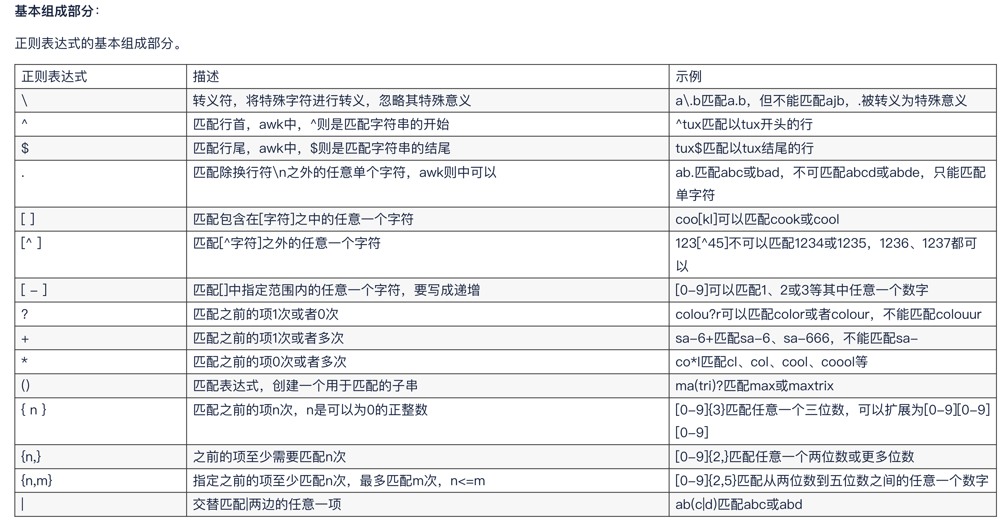

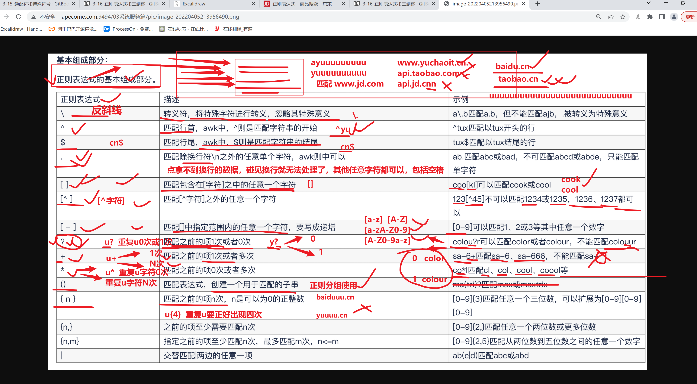

--

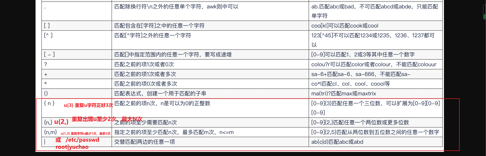


#  什么是正则表达式

- 正则表达式就是为了`处理大量的字符串`而定义的一套规则和方法。
- 通过定义的这些特殊符号的辅助，系统管理员就可以快速过滤(grep)，替换(sed)或输出(awk)需要的字符串。
- Linux 正则表达式一般以行为单位处理文件数据的，文件数据

```
wwwwwwwwwwwww 
eeeeeeeeeeee
qweqweqweqwe

234134r1234r34t243t

linux的换行符 \n

```


--

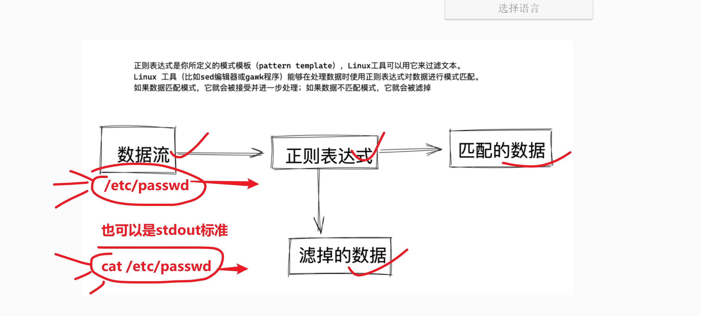

---


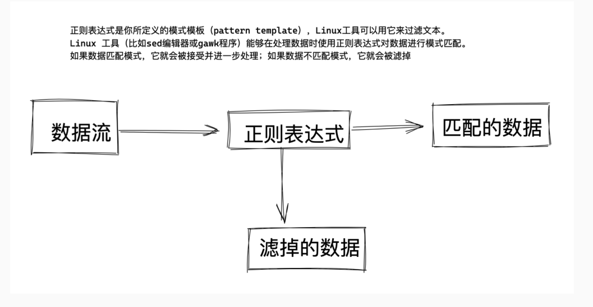

# 如何用正则表达式

通常Linux运维工作，都是面临大量带有字符串的内容，如

- 配置文件
- 程序代码
- 命令输出结果
- 日志文件

且此类字符串内容，我们常会有特定的需要，查找出符合工作需要的特定的字符串，因此正则表达式就出现了

- 正则表达式是一套规则和方法
- 正则工作时以单位进行，一次处理一行
- 正则表达式化繁为简，提高工作效率
- linux仅受三剑客（sed、awk、grep）支持，其他命令无法使用


# 学正则的注意事项

- 正则表达式应用非常广泛，很多编程语言都支持正则表达式，用于处理字符串提取数据。

- ```
  java
  python
  golang
  javascripts
  
  sed
  awk
  grep
  ```

- 

- Linux下普通命令无法使用正则表达式的，只能使用linux下的三个命令，结合正则表达式处理。
  - sed
  - grep
  - awk
  
- 通配符是大部分普通命令都支持的，用于查找文件或目录

- 而正则表达式是通过三剑客命令在文件（数据流）中过滤内容的，注意区别

- 以及注意字符集，需要设置`LC_ALL=C`，注意这一点很重要


## 关于字符集设置

你会发现很多shell脚本里都有这么一个语句如下

```
LC_ALL=C

这个变量赋值的动作，是等于还原linux系统的字符集

因为我们系统本身是支持多语言的
德文
英文
中文
每一个语言都有其特有的语言，字符，计算机为了统一字符，生成了编码表

比如你平时喜欢让linux支持中文，如果你的系统编码是中文，很可能导致你的正则出错，因此要还原系统的编码
LANG='zh_CN.UTF-8'

执行一个还原本地所有编码信息的变量
LC_ALL=C

用法如下
[242-yuchao-class01 root ~]#export LC_ALL=C

```


作用是修改linux的字符集，通过`locale`命令可以查看本地字符集设置

linux通过如下变量设置程序运行的不同语言环境，如中文、英文环境。

```
[root@yuchao-tx-server ~]# locale
LANG=en_US.UTF-8
LC_CTYPE="zh_CN.UTF-8"
LC_NUMERIC="zh_CN.UTF-8"
LC_TIME="zh_CN.UTF-8"
LC_COLLATE="zh_CN.UTF-8"
LC_MONETARY="zh_CN.UTF-8"
LC_MESSAGES="zh_CN.UTF-8"
LC_PAPER="zh_CN.UTF-8"
LC_NAME="zh_CN.UTF-8"
LC_ADDRESS="zh_CN.UTF-8"
LC_TELEPHONE="zh_CN.UTF-8"
LC_MEASUREMENT="zh_CN.UTF-8"
LC_IDENTIFICATION="zh_CN.UTF-8"
LC_ALL=zh_CN.UTF-8
```

一般我们会使用`$LANG`变量来设置linux的字符集，一般设置为我们所在的地区，如`zh_CN.UTF-8`

```
[root@yuchao-tx-server ~]# echo $LANG
en_US.UTF-8
```

为了让系统能正确执行shell语句（由于自定义修改的不同语言环境，对一些特殊符号的处理区别，如中文输入法，英文输入法下的标点符号等，导致shell无法执行）

我们会使用如下语句，恢复linux的所有的本地化设置，恢复系统到初始化的语言环境。

```
[root@yuchao-tx-server ~]# export LC_ALL=C
```


## 通配符和正则的区别

1.从语法上就记住，只有awk、gred、sed才识别正则表达式符号、其他都是通配符

```
只有用这3个命令的操作，你写下的特殊符号，才是正则表达式---提取数据流的关键信息

其他linux命令的操作，都是通配符的概念，以及------查找文件名


```


2.从用法上区分

- 表达式操作的是文件、目录名（属于是通配符）
- 表达式操作的是文件内容（正则表达式）

3.比如如下符号区别

```
通配符和正则表达式 都有  *  ?  [abcd] 符号
通配符中，都是用来标识任意的字符
如 ls *.log，可以找到a.log  b.log   ccc.log


正则中，都是用来表示这些符号前面的字符，出现的次数，如

grep 'a*'
```


> 实际案例

```
通配符，一般用于对文件名的处理，查找文件
如ls命令结合*
意思是匹配任意字符
[root@yuchao-tx-server test]# ls *.log
1.log  2.log  3.log  4.log  5.log


而三剑客，结合*符号，是处理文件内容，如grep
此时的*作用就不一样了
```


# 正则表达式分类

使用正则表达式的问题是、有两大类正则表达式规范、linux不同的应用程序，会使用不同的正则表达式。

例如

- 不同的编程语言使用正则（python,java）
- Linux实用工具（sed、awk、grep）
- 其他软件使用正则（mysql、nginx）

正则表达式是通过正则表达式引擎（regular expression engine）实现的。正则表达式引擎是 一套底层软件，负责解释正则表达式模式并使用这些模式进行文本匹配。

 在Linux中，有两种流行的正则表达式引擎： 

    基于unix标准下的正则表达式符号规则有两类：
    POSIX基础正则表达式（basic regular expression，BRE）引擎
    比较常见，简单的，早期unix系统中就存在的一些符号
    
    
    POSIX扩展正则表达式（extended regular expression，ERE）引擎 
    又额外的出现了一堆特殊字符，叫做扩展正则表达式
    
    
    
    解释posix
    POSIX（Portable Operating System Interface）是Unix系统的一个设计标准。
    当年最早的Unix，源代码流传出去了，加上早期的Unix不够完善，于是之后出现了好些独立开发的与Unix基本兼容但又不完全兼容的OS，通称Unix-like OS

### 两类、正则表达式符号


## 为什么会跟你强调这个事

```
因为grep
awk
sed
在处理正则时，默认也只认识 基础正则表达式

如果你写了分区，或者，这样的符号，必须给grep，加上额外的参数，让它识别这些扩展正则
```


linux规范将正则表达式分为了两种

- 基本正则表达式（BRE、basic regular expression）

```
BRE对应元字符有 
^ $ . [ ] *

其他符号是普通字符
; \
```

- 扩展正则表达式（ERE、extended regular expression）

```
ERE在在BRE基础上，增加了
( ) { } ? + |  等元字符
```

- 转义符

```
反斜杠 \
反斜杠用于在元字符前添加，使其成为普通字符
```


# 基本正则表达式（BRE）

# 测试文本数据

```bash
[242-yuchao-class01 root ~]#cat -n t1.log 
     1	I am teacher yuchao.
     2	I teach linux,python!
     3	
     4	I like english
     5	
     6	My website is http://yuchaoit.cn
     7	Our school site is https://apecome.com
     8	My qq num is 877348180
     9	
    10	Good good study , day day up!
    11	
    12	
    13	my name is wu yan zu .

```

## 关于单引号、双引号

- 没使用变量的话，请你都用单引号


## grep与正则

```
接下来会以，过滤，查找文件内容，也就是结合grep来学习正则表达式
```


```语法
NAME
       grep, egrep, fgrep - print lines matching a pattern

SYNOPSIS
       grep [OPTIONS] PATTERN [FILE...]
       grep [OPTIONS] [-e PATTERN | -f FILE] [FILE...]
```

例如传入的pattern（模式是） ，我们可以统称你写的正则是`模式`

```
grep '关键字,模式,正则表达式'   数据流
```


`^m`，以m开头的行

```
[242-yuchao-class01 root ~]#grep '^m' t1.log 
my name is wu yan zu .
[242-yuchao-class01 root ~]#
[242-yuchao-class01 root ~]#
[242-yuchao-class01 root ~]#
-n 显示行号
[242-yuchao-class01 root ~]#grep '^m' t1.log -n
13:my name is wu yan zu .

[242-yuchao-class01 root ~]#
[242-yuchao-class01 root ~]#

-o 只显示grep找出来的结果，而不是那一行所有的信息
[242-yuchao-class01 root ~]#grep '^m' t1.log -n -o
13:m

```


## ^ 尖角符

```
语法
写于最左侧，如
^yu 逐行匹配，找到以yu开头的内容

```

结合grep用法，-i 忽略大小写，可以找到更多的数据匹配

```
找出以yu开头的行
grep '^yu' t1.log  -i 

找出以m开头的行，且显示行号
[242-yuchao-class01 root ~]#grep '^m' t1.log -i -n
6:My website is http://yuchaoit.cn
8:My qq num is 877348180
13:my name is wu yan zu .


找出m或M开头的行
[242-yuchao-class01 root ~]#grep '^m' t1.log -i -n
6:My website is http://yuchaoit.cn
8:My qq num is 877348180
13:my name is wu yan zu .

```


只显示grep每次匹配到的结果，而不是匹配到的文本行数据

```
找出以my开头的行

[242-yuchao-class01 root ~]#grep '^my' t1.log -i -n -o
[242-yuchao-class01 root ~]#grep '^my' t1.log -i -n -o
6:My
8:My
13:my
[242-yuchao-class01 root ~]#
[242-yuchao-class01 root ~]#
[242-yuchao-class01 root ~]#
[242-yuchao-class01 root ~]#
[242-yuchao-class01 root ~]#
[242-yuchao-class01 root ~]#grep '^my' t1.log -i -n   
6:My website is http://yuchaoit.cn
8:My qq num is 877348180
13:my name is wu yan zu .


匹配出qq那一行
[242-yuchao-class01 root ~]#grep 'qq'  t1.log 
My qq num is 877348180


```


匹配行内容，且显示行号

```
找出包含i字符的行
[242-yuchao-class01 root ~]#grep 'i' t1.log 
I teach linux,python!
I like english
My website is http://yuchaoit.cn
Our school site is https://apecome.com
My qq num is 877348180
my name is wu yan zu .
[242-yuchao-class01 root ~]#
[242-yuchao-class01 root ~]#
[242-yuchao-class01 root ~]#
[242-yuchao-class01 root ~]#grep 'i' t1.log -n -o
2:i
4:i
4:i
6:i
6:i
6:i
7:i
7:i
8:i
13:i


找出以i开头的行
[242-yuchao-class01 root ~]#
[242-yuchao-class01 root ~]#grep '^i' t1.log 
[242-yuchao-class01 root ~]#grep '^i' t1.log -i
I am teacher yuchao.
I teach linux,python!
I like english
[242-yuchao-class01 root ~]#grep '^i' t1.log -i -n
1:I am teacher yuchao.
2:I teach linux,python!
4:I like english


找出以i开头的行，且只显示匹配内容
[242-yuchao-class01 root ~]#
[242-yuchao-class01 root ~]#grep '^i' t1.log 
[242-yuchao-class01 root ~]#grep '^i' t1.log -i
I am teacher yuchao.
I teach linux,python!
I like english
[242-yuchao-class01 root ~]#grep '^i' t1.log -i -n
1:I am teacher yuchao.
2:I teach linux,python!
4:I like english

[242-yuchao-class01 root ~]#grep '^i' t1.log -i -n -o
1:I
2:I
4:I


```

## $ 美元符

```
语法

word$ 匹配以word结尾的行
```


```
匹配所有以字符n结尾的行
[242-yuchao-class01 root ~]#grep 'n$'  t1.log -n
6:My website is http://yuchaoit.cn


匹配所有以.结尾的行

[242-yuchao-class01 root ~]#grep '\.$' t1.log -n
1:I am teacher yuchao.
13:my name is wu yan zu .

```

11.05


## 单、双引号区别

- 单引号、所见即所得，可以用于匹配如标点符号，还原其本义。

- 双引号、能够识别linux的特殊符号、或变量，需要借助转义符还原字符本义。

- 当需要引号嵌套时，一般做法是，双引号，嵌套单引号。

```
```


## ^$ 匹配空行

```
^字符
匹配以这个字符开头的行

字符$
匹配以这个字符结尾的行

^$
以空开头，空结尾===空行


```


找出文件的空行

```
[242-yuchao-class01 root ~]#grep '^$' t1.log -n
3:
5:
9:
11:
12:

```

## .   点符

`. `  匹配除了换行符以外所有的内容、字符+空格，除了换行符。

### . 点处理空格

- `.` 可以匹配到空格，以及任意字符

- 以及拿不到空行

- 但是点，不匹配换行符。(拿不到换行符，什么意思?)

```
测试数据
cat -n t1.log
y
u
c
h

a o
```

验证点和换行、空格的关系

```
[242-yuchao-class01 root ~]#grep '.' t2.log -on
1:y
2:u
3:c
4:h
6:a
6: 
6:o

```


.   匹配除换行符的所有字符

```
[242-yuchao-class01 root ~]#grep '.' t1.log -n
1:I am teacher yuchao.
2:I teach linux,python!
4:I like english
6:My website is http://yuchaoit.cn
7:Our school site is https://apecome.com
8:My qq num is 877348180
10:Good good study , day day up!
13:my name is wu yan zu .

```


.  代表任意一个字符

```
如
y.
y..


[242-yuchao-class01 root ~]#grep 'y.' t1.log 
I am teacher yuchao.
I teach linux,python!
My website is http://yuchaoit.cn
My qq num is 877348180
Good good study , day day up!
my name is wu yan zu .


练习，找出符合.ac正则的行

[242-yuchao-class01 root ~]#grep '.ac' t1.log -n
1:I am teacher yuchao.
2:I teach linux,python!
[242-yuchao-class01 root ~]#
[242-yuchao-class01 root ~]#
[242-yuchao-class01 root ~]#grep '.ac' t1.log -no
1:eac
2:eac

```


### .$ 匹配任意字符结尾

```
. 任意一个字符
.$ 任意字符结尾

拿到每一行的结尾的符号
[242-yuchao-class01 root ~]#grep '.$' t1.log -n
1:I am teacher yuchao.
2:I teach linux,python!
4:I like english
6:My website is http://yuchaoit.cn
7:Our school site is https://apecome.com
8:My qq num is 877348180
10:Good good study , day day up!
13:my name is wu yan zu .


```


拿到每一行的结尾字符

```
[242-yuchao-class01 root ~]#grep '.$' t1.log -n
1:I am teacher yuchao.
2:I teach linux,python!
4:I like english
6:My website is http://yuchaoit.cn
7:Our school site is https://apecome.com
8:My qq num is 877348180
10:Good good study , day day up!
13:my name is wu yan zu .

```


### . 和转义符

只想拿到每一行结尾的普通小数点 .，需要对点转义

```
grep '\.$' t1.log
```


## \ 转义符

转义字符，让有特殊意义的字符，现出原形，还原其本义。

```
\.
\$
转义符
```


## 空格、换行、tab

```
使用该网址，验证换行符

```


https://deerchao.cn/tools/wegester/使用这个网址来测试换行符的匹配


## 换行符、制表符

```
\b 匹配单词边界，如我想从字符串中“This is Regex”匹配单独的单词 “is” 正则就要写成 “\bis\b”

hello world
helloworld


\n 匹配换行符 ，表示newline，向下移动一行，不会左右移动
\r 匹配回车符，表示return，回到当前行的最左边

在windows中，换行符号是 \r\n
linux中，换行符就是\n

linux中输入 enter键，表示\r \n


linux换行符是\n，表示\r+\n 换行且回车，换行且回到下一行的行首


windows换行符是\r\n，表示回车+换行

\t 匹配一个横向的制表符，等于tab键

```

## * 星号

重复前一个字符0此或n次

```
[242-yuchao-class01 root ~]#grep 'w*' t1.log
I am teacher yuchao.
I teach linux,python!

I like english

My website is http://yuchaoit.cn
Our school site is https://apecome.com
My qq num is 877348180

Good good study , day day up!


my name is wu yan zu .

my name is wwwwwwwwwwwwwwwwwwwwwwwwu yifan.
[242-yuchao-class01 root ~]#
[242-yuchao-class01 root ~]#
[242-yuchao-class01 root ~]#grep 'w*' t1.log -no
6:w
13:w
15:wwwwwwwwwwwwwwwwwwwwwwww

```


## .* 符

```
. 匹配任意一个字符

* 重复前一个字符0或N次

.* 找出任意内，[这一行有东西，没东西，]全给找出来，是*的作用

对比 . 和.*就理解了

只找出有字符的行
grep '.' t1.log

无论有无字符，都找出来这行
grep '.*' t1.log
```


## 图解点 . 不匹配换行

```
首先，不匹配换行这事，是因为 . 的作用
.* 是重复前面这个字符0次或N次
```

再次记住，.不处理换行的

通过如下命令证明

```
[242-yuchao-class01 root ~]#
[242-yuchao-class01 root ~]#grep '.*' t1.log
I am teacher yuchao.
I teach linux,python!

I like english

My website is http://yuchaoit.cn
Our school site is https://apecome.com
My qq num is 877348180

Good good study , day day up!


my name is wu yan zu .

my name is wwwwwwwwwwwwwwwwwwwwwwwwu yifan.
[242-yuchao-class01 root ~]#
[242-yuchao-class01 root ~]#
[242-yuchao-class01 root ~]#grep 'teach.*python' t1.log 
I teach linux,python!
[242-yuchao-class01 root ~]#
[242-yuchao-class01 root ~]#
[242-yuchao-class01 root ~]#grep 'teach.*english' t1.log 
[242-yuchao-class01 root ~]#
[242-yuchao-class01 root ~]#

```


例如关于多行数据

```
i love you  
i hate you 

love.*hate 这样的正则是不可用的，拿不到的数据的
```


## ^.*符号

```
^m  以m开头

.* 任意内容

^.* 以任意内容开头
```


```
语法
^.* 表示以任意多个字符开头的行

只找出以i开头的行
[242-yuchao-class01 root ~]#grep '^i' t1.log  -i
I am teacher yuchao.
I teach linux,python!
I like english

[242-yuchao-class01 root ~]#grep '^i' t1.log  -i -o
I
I
I


找出任意以字母i开头，以及匹配到后续所有数据
[242-yuchao-class01 root ~]#grep '^i.*' t1.log -i -o 
I am teacher yuchao.
I teach linux,python!
I like english


找出任意以字母i开头的行，且以h结尾的行，且拿到其中所有数据

[242-yuchao-class01 root ~]#grep '^i.*h$'  t1.log -i -o -n
4:I like english


```


## .*$ 符

以任意多个字符结尾的行

```
grep '.*$'  t1.log
等于
grep '.*' t1.log
```

尝试如下正则的意义

```
p.*$的作用


[242-yuchao-class01 root ~]#
[242-yuchao-class01 root ~]#grep 'p.*$'  -i -n t1.log
2:I teach linux,python!
6:My website is http://yuchaoit.cn
7:Our school site is https://apecome.com
10:Good good study , day day up!
[242-yuchao-class01 root ~]#
[242-yuchao-class01 root ~]#
[242-yuchao-class01 root ~]#
[242-yuchao-class01 root ~]#
[242-yuchao-class01 root ~]#
[242-yuchao-class01 root ~]#
[242-yuchao-class01 root ~]#grep 'p.*$'  -i -n t1.log  -o
2:python!
6:p://yuchaoit.cn
7:ps://apecome.com
10:p!


```


## [ ] 中括号

中括号，有如下用法

### [abc]

```
[abc] 匹配括号内的小写a、b、c字符
[A-Z]
```

提示，关于到大小写的精准匹配，就别添加忽略大小写参数了

```
```


### [a-z]、 [A-Z] 、[a-zA-z]、[0-9]

````
[a-z]				匹配所有小写单个字母
[A-Z]				匹配所有单个大写字母
[a-zA-Z]		匹配所有的单个大小写字母
[0-9]				匹配所有单个数字
[a-zA-Z0-9]	匹配所有数字和字母

````

[a-z] 匹配小写字母

等于找出文件中所有的小写字母

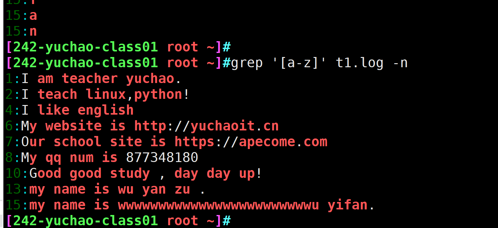


[A-Z] 匹配大写字母

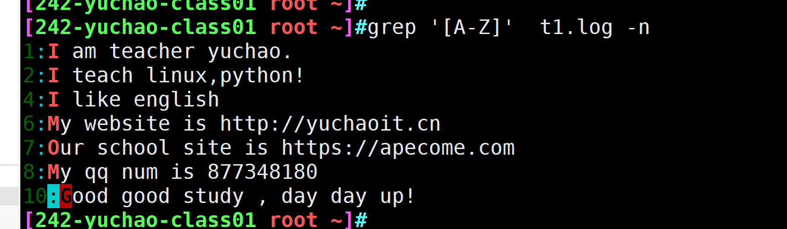


[a-z0-9] 匹配小写字母和数字

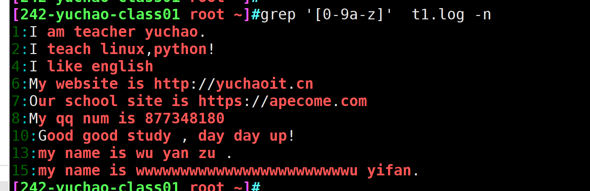


[0-9A-Z] 匹配大写字母和数字

```
grep '[0-9A-Z]' t1.log
```

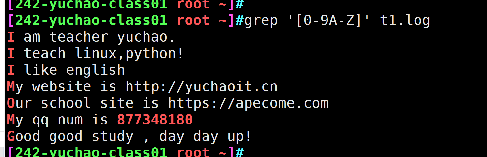


[a-z0-9A-Z] 匹配大写、小写字母、数字，没有空格，特殊符号

```
grep '[a-z0-9A-Z]' t1.log -n
```

只想拿到特殊符号，对中括号里的字符进行取反即可

```
grep '[^a-z0-9A-Z]'  t1.log -n
```

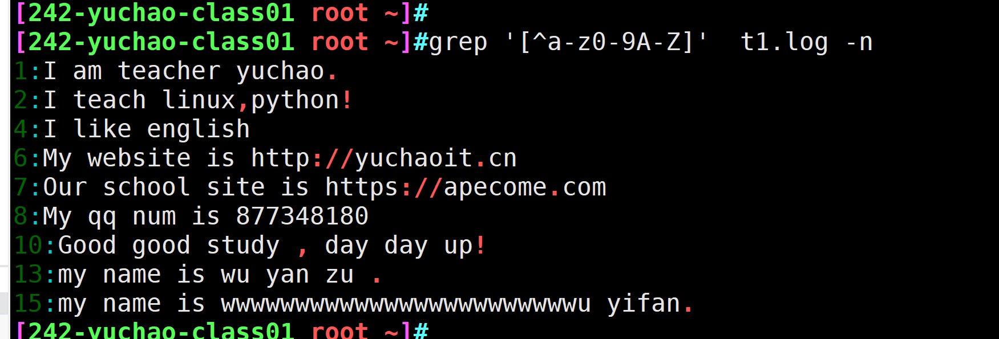


## [^abc] 中括号取反

```
语法
语法

[^abc] 排除中括号里的a、b、c ，和单独的^符号，作用是不同的

[^a-z] 排除小写字母

```

实践

```
[^a-z] 排除小写字母

grep '[^a-z]'  t1.log 
```

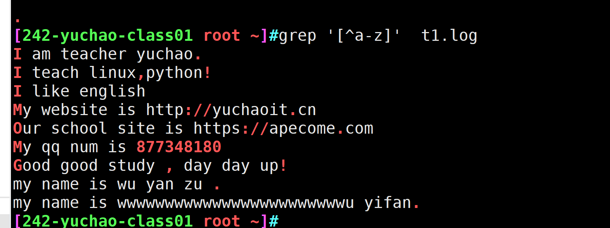


## { } 花括号（扩展正则）

```
grep命令和扩展正则结合使用

grep '基本正则表达式'  t1.log

# 使用-E参数是最新扩展正则用法

grep -E '扩展正则表达式'  t1.log 

egrep '扩展正则表达式' t1.log

```

## 测试数据

```
[242-yuchao-class01 root ~]#cat t1.log 
I am teacher yuchao.
I teach linux,python!

I like english

My website is http://yuchaoit.cn
Our school site is https://apecome.com
My qq num is 877348180

aaaaaaaa

aaaaaple
Good good study , day day up!
my name is wu yan zu .

my name is wwwwwwwwwwwwwwwwwwwwwwwwu yifan.

```

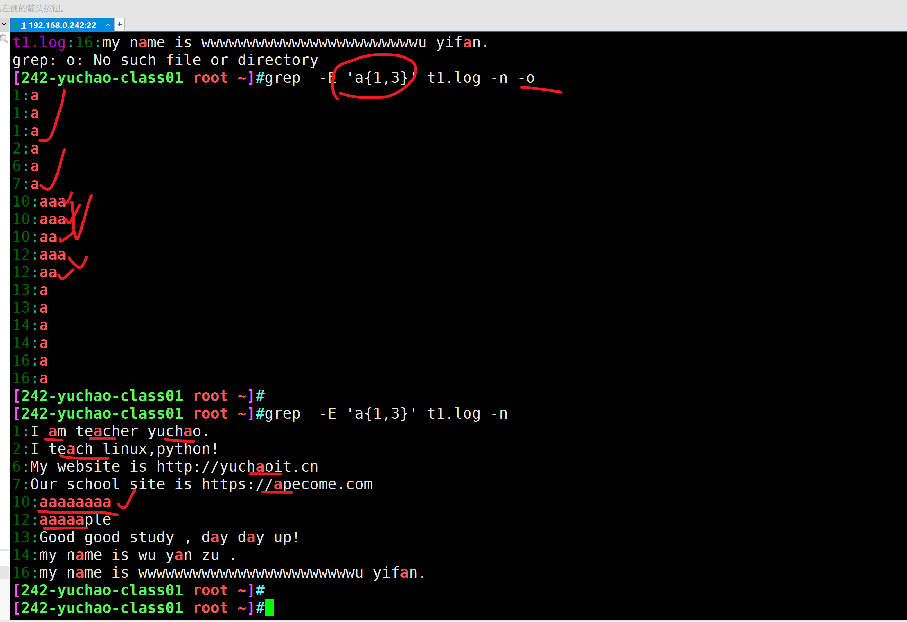


### `a\{n,m\}`

```
a\{n,m\} 重复字符a，n到m次

a\{1,3\} 重复字符a，1到3次

# 建议用这个语法 ，使用-E参数

grep  -E 'a{1,3}' t1.log
```

实践

### 测试数据

```
测试数据
[root@yuchao-tx-server test]# cat chaoge666.txt
I am teacher yuchao.
I teach linux,python!

I like english

My website is http://yuchaoit.cn
Our school site is https://apecome.com
My qq num is 877348180

my qq num is not  87777773333344444888811188880000

Goog good study , day day up!
```

### 实践

匹配数字8一次到3次

```
grep -E '8{1,3}' t1.log
```

每次最少找出2个8、最多3个8

```
grep -E '8{2,3}' t1.log
```


### grep 默认不认识扩展正则 {}

grep默认不认识扩展正则{}，识别不到它的特殊作用，因此只能用转义符，让他成为有意义的字符。

```
```

解决办法

```
办法1
使用转义符 \{\}

办法2，让grep认识花括号，可以省去转义符
使用egrep命令
或者 grep -E 
```

匹配数字8一次到3次

```
grep -E '8{1,3}' t1.log
```


每次最少找出2个8、最多3个8

```
grep -E '8{2,3}' t1.log
```


每次只找出3个8

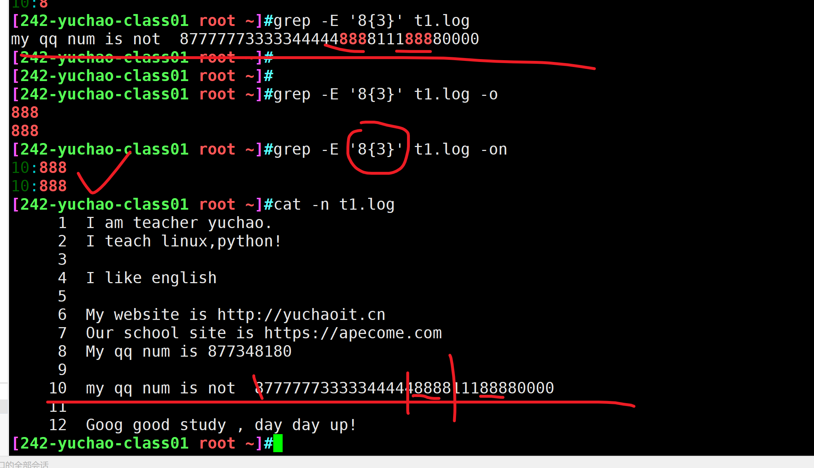


```
grep -E '8{3}' t1.log
```


### `a\{n,\}`

重复a字符至少n次，可以用简写了

```
8至少出现2次
grep -E '8{2,}' t1.log

8至少出现1次
grep -E '8{1,}' t1.log
```


### `a\{n\}`

```
重复字符a，正好n次。

重复8出现3次

grep -E '8{3}' t1.log
```


### ` a\{,m\}`

匹配字符a最多m次。

```
重复8出现最多3次

grep -E '8{,3}' t1.log

grep -E '8{最少重复次数,最多重复次数}' t1.log
```


# 扩展正则表达式（ERE）

这样记忆就好

- 基本正则表达式
  - 属于早期正则表达式，支持一些基本的功能
  - 与grep、sed命令结合使用
- 扩展正则表达式
  - 后来添加的正则表达式
  - 和egrep、awk命令结合
  - 必须是grep -E 参数
- 


# 扩展正则表达式（ERE）

这样记忆就好

- 基本正则表达式
  - 属于早期正则表达式，支持一些基本的功能
  - 与grep、sed命令结合使用
- 扩展正则表达式
  - 后来添加的正则表达式
  - 和egrep、awk命令结合

## 测试数据

```
测试数据
[root@yuchao-tx-server test]# cat chaoge666.txt
I am teacher yuchao.
I teach linux,python!

I like english

My website is http://yuchaoit.cn
Our school site is https://apecome.com
My qq num is 877348180

my qq num is not  87777773333344444888811188880000

Goog good study , day day up!
```


## + 加号

```
语法

+ 
重复前一个字符1次或多次


注意和*的区别，*是0次或多次，找不到的那一行，也会显示出来
```

匹配一次或者多次0，没有0的行是不会显示的

### 0+

要求

```
每次找出一个、或者多个数字零
找出存在至少一次0的行
grep '0+'  t1.log


[242-yuchao-class01 root ~]#grep -E  '0+'  t1.log -n
8:My qq num is 877348180
10:my qq num is not  87777773333344444888811188880000

```

### [0-9]+

从文中找出连续的数字，等于排除字母，特殊符号、空格

顺丰快递的数据库文件

```
地区：
手机号： 连续11位的数字 [0-9]{11}
姓名：
寄件人：
收件人：
```

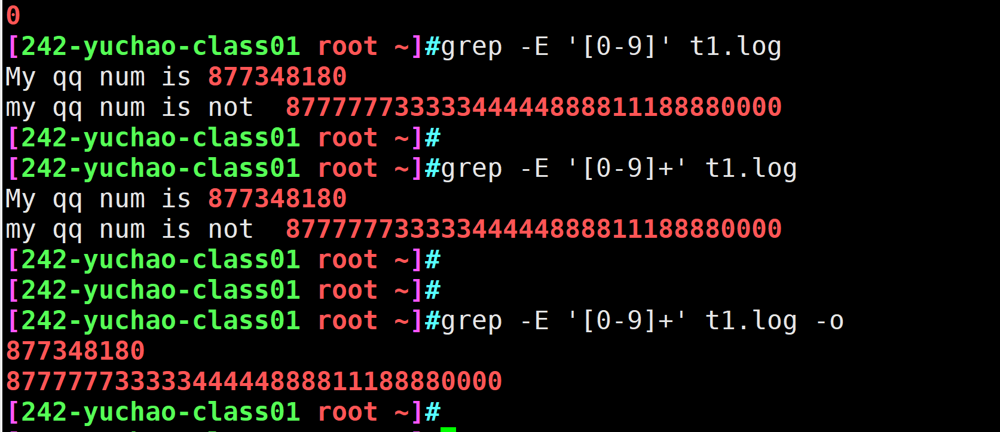


```
提取出文件中的连续的数字


grep -E '[0-9]' t1.log
```

### [a-z]+

找出连续的小写字母、等于排除大写字母、标点符号、数字，空格，找出每一个单词了吧

```

grep -E '[a-z]+' t1.log
```

### [A-Za-z0-9]+

注意，这里添加了+号，就是找的连续的字母数字了

缺少+号则是每次匹配单个字符

```
grep -E '[A-Za-z0-9]+'  t1.log


```

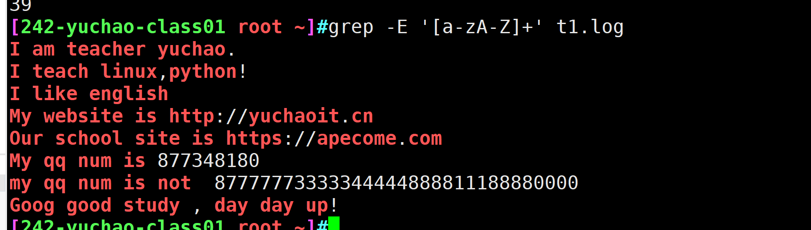

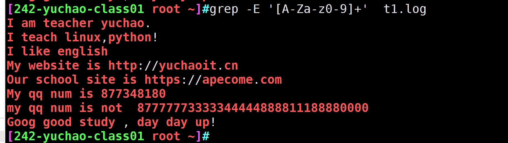


### `[^A-Za-z0-9]+]`

此写法，找出除了数字、大小写字母以外的内容，如空格、标点符号。

你可以使用-o参数，看到每次匹配的内容。

```
```


## *和+的区别

```
语法
*是重复0次、重复多次，因此没匹配到的行也过滤出来了

+是重复1次、多次、因此至少匹配到1次才看到
```

例如，我们来找到字母o，看如下2个写法

```
'o+'

+号，是重复前面的字符1次或N次
重复找这个o1次，还是多次
grep -E 'o+' t1.log  


重复这个9，零次，或者N次
'9*'


```


### `go*d和go+d和go?d区别`

准备测试数据

```
[root@yuchao-tx-server test]# cat god.log
I am God, I need you to good good study and day day up, otherwise I will send you to see Gd,oh sorry, gooooooooood!
```

关于寻找god、goooood、gd的区别

```
go*d 可以有0个或者n个字母o
go*d 可以找到啥

grep  'go*d'  god.txt -n  -i
god
goooooooooood
gd


go+d 可以有一个或n个字母o
go+d 可以找到啥

扩展正则，使用-E才行
grep -E  'go+d'  god.txt -n  -i
god
goooooooooooood


go?d  可以有0个或者1个字母0
go?d 可以找到啥

[242-yuchao-class01 root ~]#grep -E 'go?d' god.txt -n -i -o
1:God
1:Gd


```


## | 或者符


### 测试数据

```
[242-yuchao-class01 root ~]#cat t1.log 
I am teacher yuchao.
I teach linux,python!

I like english

My website is http://yuchaoit.cn
Our school site is https://apecome.com
My qq num is 877348180

#my qq num is not  87777773333344444888811188880000
#
#Goog good study , day day up!

```


竖线在正则里是或者的意思


查看文件系统的inode数量和block信息

```

ext4文件系统
1.准备好分区，以及挂载该ext4
2. 使用dumpe2fs命令查看该分区信息即可，过滤inode和block相关信息
得看该分区，而不是挂载点

[242-yuchao-class01 root ~]#dumpe2fs /dev/sdc | grep -E -i '^inode|^block'
dumpe2fs 1.42.9 (28-Dec-2013)
Inode count:              1310720
Block count:              5242880
Block size:               4096
Blocks per group:         32768
Inodes per group:         8192
Inode blocks per group:   512
Inode size:	          256


xfs_info
[242-yuchao-class01 root ~]#xfs_info /xfs_test/ |grep -E 'isize|block'
meta-data=/dev/sdd               isize=512    agcount=4, agsize=3276800 blks
data     =                       bsize=4096   blocks=13107200, imaxpct=25
log      =internal               bsize=4096   blocks=6400, version=2
realtime =none                   extsz=4096   blocks=0, rtextents=0


```

查看内存和swap的容量信息

```
[242-yuchao-class01 root ~]#free -m | grep -E -i '^mem|^swap'
Mem:           1821         116        1370           9         334        1514
Swap:          2047           0        2047

```

排除文件的空行、注释行

grep -v参数，对结果取反

```
排除空行
grep -v '^$' t1.log

排除注释行
grep -v '^#' t1.log


排除文件的空行、注释行
grep -v '^$' t1.log | grep -v '^#' 

[242-yuchao-class01 root ~]#grep -v '^$' t1.log | grep -v '^#' -n      
I am teacher yuchao.
I teach linux,python!
I like english
My website is http://yuchaoit.cn
Our school site is https://apecome.com
My qq num is 877348180


# 使用正则的或的用法
grep -E '^#|^$'  t1.log -n -v
```


## ( ) 括号、分组符

```
语法
() 作用是将一个或者多个字符捆绑在一起，当做一个整体进行处理

1.可以用括号，把正则括起来，以及系统最多支持9个括号


小括号功能之一是分组过滤被括起来的内容，括号内的内容表示一个整体


括号内的数据，可以向后引用，
() () () ()    \1  \2  \3  \4 


括号()内的内容可以被后面的"\n"正则引用，n为数字，表示引用第几个括号的内容

\1：表示从左侧起，第一个括号中的模式所匹配到的字符
\2：从左侧起，第二个括号中的模式所匹配到的字符


```

测试数据

```
测试数据
[root@yuchao-tx-server test]# cat god.log
I am God, I need you to good good study and day day up, otherwise I will send you to see Gd,oh sorry, gooooooooood!
I am glad to see you, god,you are a good god!
```

要求仅仅匹配出glad和good

```
分组的第一个用法，将数据，正则当做一个整体处理
grep -E 'glad|good'  god.log

括号用法
grep -E 'g(la|oo)d'  god.log

g.........d


```

### 分组与向后引用

- 向后引用用法， 在grep中不容易体现，

- 明天学sed，就会发现分组括号，向后引用更多用法了

```
语法
()      
分组过滤，被括起来的内容表示一个整体，另外()的内容可以被后面的\n引用，n为数字，表示引用第几个括号的内容

\n      
引用前面()里的内容，例如(abc)\1 表示匹配abcabc


```

测试数据

```
[root@yuchao-tx-server test]# cat lovers.log
I like my lover.
I love my lover.
He likes his lovers.
He love his lovers.
```

提取love出现2次的行

```
[242-yuchao-class01 root ~]#grep -E '^.*(love).*\1.*' lovers.txt -o
I love my lover.
He love his lovers.

```

提取/etc/passwd 中用户名和登录解释器名字一样的行

```

```


