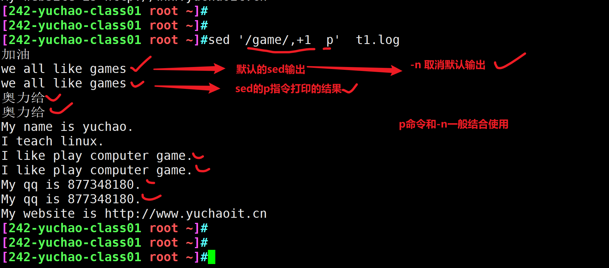

```### 此资源由 58学课资源站 收集整理 ###
	想要获取完整课件资料 请访问：58xueke.com
	百万资源 畅享学习

```
# 关于学正则

- 单个正则字符还认识

- 组合到一起就晕了，怎么办？

  - 本质还是对单个字符没理解

  - ```
    .认识
    
    *认识
    
    .*组合到就一起就蒙了，为什么？还是没想明白.的意义，*的意义
    
    正则表达式，从左向右，逐步理解单个字符的意义
    
    怎么做？
    1.思维脑图写没写？
    2.每一个正则表达式的符号，自己有没有动手再敲几遍?
    需要提取的数据，有了一定的理解，（脑海中转变为，是否能通过正则的符号，去替代，匹配这些数据）
    3.练习题是否不看答案，自己是否能写出正则表达式？以及琢磨出一个新答案？
    
    最后
    1.正则表达式这个东西，的确是需要孰能生巧，慢慢来，语法记住了，就慢慢练就好，这玩意是和写代码是一个意思，逻辑性很重
    
    
    ```

  

  # 关于linux三剑客

  - grep，过滤关键字信息数据。主要是用于查文本内的数据
  - sed ，对文本数据进行编辑，修改原文件内容
  - awk，对文件数据过滤，提取，并且能实现，格式化输出
    - awk对文件数据处理后，还能更美观的展示数据

  

# sed是什么

- sed软件本身
- sed提供的加工的命令
- 给sed提供的源数据


# sed是一个软件


# sed语法

```
sed [选项] [sed内置命令字符] [输入文件]

说明:
1.注意 sed 软件及后面选项,sed 命令和输入文件,每个元素之间都至少有一个空格

2.为了避免混淆,文本称呼sed为sed软件.sed-commands(sed命令)是sed软件内置的一些命令选项,为了和前面的 options(选项)区分,故称为sed命令.

3.sed-commands 既可以是单个sed 命令,也可以是多个sed命令组合.

4.input-file(输入文件)是可选项,sed 还能够从标准输入或管道获取输入
```

```

语法
sed替换字符数据
s替换指令
#替换前的数据(正则)#替换后的数据#

sed   's#替换前的数据#替换后的数据#'   file.txt

```


# sed命令执行图解


# sed模式空间


# sed参数

````
sed默认修改的是模式空间内的数据
（简单大白话，sed读取了一行文本数据，放入到内存里进行修改，修改的结果默认不会写入到文件中，只是在内存里修改，且打印让你看到修改的结果）
吧修改的结果写入到文件


就得借助参数的功能
-i 把sed处理的结果，写入到文件，且不在终端打印了
sed -i  's#替换前的数据#替换后的数据#'   file.txt
````


```
options[选项]
解释说明
-n    取消默认的 sed 软件的输出,常与 sed 命令的 p 连用
-e    一行命令语句可以执行多条 sed 命令
-f    选项后面可以接 sed 脚本的文件名
-r    使用正则拓展表达式,默认情况 sed 只识别基本正则表达式
-i    直接修改文件内容,而不是输出终端,如果不使用-i 选项 sed 软件只是修改在 内存中的数据,并不影响磁盘上的文件
```


# sed命令

```
sed软件

sed提供了很多功能的指令
在某一行插入数据
替换字符数据

sed-commands[sed 命令]
解释说明
a 追加,在指定行后添加一行或多行文本
c 取代指定的行
d 删除指定的行
D 删除模式空间的部分内容,直到遇到换行符\n 结束操作,与多行模式相关
i 插入,在指定的行前添加一行或多行文本
h 把模式空间的内容复制到保持空间
H 把模式空间的内容追加到保持空间
g 把保持空间的内容复制到模式空间
G 把保持空间的内容追加到模式空间
x 交换模式空间和保持空间的内容
l 打印不可见的字符
n 清空模式空间,并读取下一行数据并追加到模式空间
N 不清空模式空间,并读取下一行数据并追加到模式空间
p 打印模式空间的内容,通常 p 会与选项-n 一起使用
P(大写) 打印模式空间的内容,直到遇到换行符\你结束操作
q 退出 sed
r 从指定文件读取数据
s 取代,s#old#new#g==>这里 g 是 s 命令的替代标志,注意和 g 命令区分
w 另存,把模式空间的内容保存到文件中
y 根据对应位置转换字符
:label  定义一个标签
t 如果前面的命令执行成功,那么就跳转到 t 指定的标签处,继续往下执行后 续命令,否则,仍然继续正常的执行流程
```


# sed匹配范围

sed默认是一行一行，处理文件中每一行的数据

```
文件有100行

```


sed匹配文本范围

| 范围        | 解释                                                         |
| ----------- | ------------------------------------------------------------ |
| 空地址      | 全文处理                                                     |
| 单地址      | 指定文件某一行                                               |
| `/pattern/` | 被模式匹配到的每一行  #写入正则，字符数据#                   |
| 范围区间    | `10,20 十到二十行`，`10,+5第10行向下5行`，`/pattern1/,/pattern2/` |
| 步长        | `1~2，表示1、3、5、7、9行`，`2~2两个步长，表示2、4、6、8、10、偶数行` |


# sed软件实践

```
My name is yuchao.
I teach linux.
I like play computer game.
My qq is 877348180.
My website is http://www.yuchaoit.cn
```


## Sed 默认不修改源文件

sed默认的命令操作，不会修改源文件，你看到的终端结果，只是sed把模式空间的内容打印给你看了而已。

得用sed -i 参数修改源数据。

## sed工作图解


## sed的修改字符与取消默认输出


# sed增删改查（练习）

在练习期间，别用-i参数，去修改源文件，直接看替换结果

理解sed的语法


增，表示在指定行与行之间，添加新字符数据

```
我们也可以用vi、vim去在某一行，增加数据，但是这种交互式操作，没法进行脚本化
因此sed来了！
```

sed增加字符命令

```
"a":追加文本到指定行,记忆方法:a 的全拼是 apend,,意思是追加

3a 表示在第三行下面追加数据

"i":插入文本到指定行前,记忆方法:i 的全拼是 insert,意思是插入

3i 在第三行上面插入数据


```

## 单行增加命令

语法

```
sed '行号 sed指令   你想添加的字符数据' 源文件
```


sed增加数据的命令

```
a 追加,在指定行后添加一行或多行文本

i 插入,在指定的行前添加一行或多行文本
```

实践

在文件第二行后，插入数据，"今天又是美好的一天"

```
sed  '2 a  "今天又是美好的一天" '  t1.log

[242-yuchao-class01 root ~]#sed  '2 a  "今天又是美好的一天" '  t1.log
My name is yuchao.
I teach linux.
"今天又是美好的一天" 
I like play computer game.
My qq is 877348180.
My website is http://www.yuchaoit.cn

```

在第二行前，插入数据

```

sed '2 i  今天雾霾比较大'  t1.log
```

# sed多行增加

增加的数据存在换行


## cat实现多行文本追加

```
cat >>my.log<<EOF
你好
我好
他也好
EOF
```

## echo 追加多行数据

```
1.多次追加
echo "你好" >> tt.log

2.使用换行符，一次添加多行数据

echo 'hello\nworld\n你好\n我也好' > hello.log

hello
world
你好
我也好


用法如下
[242-yuchao-class01 root ~]#echo -e "hello\nworld\n你好\n我也好" > hello.log
[242-yuchao-class01 root ~]#cat hello.log 
hello
world
你好
我也好


```

## sed追加多行文本

无论是cat、还是echo，都只能往文件末尾追加内容。

而sed是按行处理文本，可以指定要处理的行，也就是在指定行插入字符数据。

使用\n添加多行数据

```
给t1.log 开头，添加两行数据
加油
奥力给

[242-yuchao-class01 root ~]#sed -i '1 i 加油\n奥力给'  t1.log
[242-yuchao-class01 root ~]#
[242-yuchao-class01 root ~]#
[242-yuchao-class01 root ~]#
[242-yuchao-class01 root ~]#cat -n t1.log 
     1	加油
     2	奥力给
     3	My name is yuchao.
     4	I teach linux.
     5	I like play computer game.
     6	My qq is 877348180.
     7	My website is http://www.yuchaoit.cn


```


### 练习sed追加配置文件信息（单行）


```
1.练习，修改nginx配置文件，在第39行插入新数据 listen 81;

只修改，且终端上看到修改结果，但是不修改文件
sed '39 i listen 81;'  /etc/nginx/nginx.conf

sed -i '39 i listen 81;'  /etc/nginx/nginx.conf
```


## 修改sshd_config实战

```
[242-yuchao-class01 root ~]## 远程连接服务 sshd 
[242-yuchao-class01 root ~]#ls /etc/ssh/sshd_config

```


例如我们在系统初始化优化时，需要修改sshd服务端设置，需要加入如下多行配置

```
Port 25515                                   # 改端口
PermitRootLogin no                   # 不允许root登录
PerminEmptyPasswords no         # 不允许空密码
UseDNS no                                    # 不做主机名解析，加速ssh连接
GSSAPIAuthentication no            # 不做主机名解析，加速ssh连接
```

在开头加入这些配置

```
sed -i '1 i Port 25515\nPermitRootLogin no\nPerminEmptyPasswords no\nUseDNS no\nGSSAPIAuthentication no'   /etc/ssh/sshd_config
```


### 备份sshd_config

修改配置之前先备份源文件 

```
源文件 /etc/ssh/sshd_config
备份，添加ori后缀

cp /etc/ssh/sshd_config{,.ori}

```

sed写入多行配置

```
sed -i '1 i Port 25515\nPermitRootLogin no\nPerminEmptyPasswords no\nUseDNS no\nGSSAPIAuthentication no'   /etc/ssh/sshd_config
```


```
sed和vim的一些指令有共性

vim  
	插入模式
	a
	i
	o 

sed
	数据插入命令
	a 在指定的行下面插入
	i 在指定行上面插入数据
```


# sed删除字符数据

我们以前是用vim编辑文本，也是通过d命令，剪切（删除）数据。

sed关于删除的命令


```
d 删除指定的行
d 命令，表示删除字符，delete意思

sed默认是多行处理所有文本，如果不指定范围，sed默认是删除所有文本行数据了
```

sed删除所有数据

```
[242-yuchao-class01 root ~]#
[242-yuchao-class01 root ~]#
sed 删除第二行数据

[242-yuchao-class01 root ~]#sed '2 d' t1.log 
加油
My name is yuchao.
I teach linux.
I like play computer game.
My qq is 877348180.
My website is http://www.yuchaoit.cn
[242-yuchao-class01 root ~]#
[242-yuchao-class01 root ~]#
[242-yuchao-class01 root ~]#sed 'd' t1.log 
[242-yuchao-class01 root ~]#

```

sed删除1到4行

```
sed '1,4d' t1.log
```


# sed命令语法（记忆）

sed软件提供的命令很强大，刚开始到不用全部记住，以后逐步记忆即可，记住最常用的。

### 关于sed处理文件行范围语法


| sed命令语法                     | 作用                                              |
| ------------------------------- | ------------------------------------------------- |
| 3{sed-commands}                 | 操作第三行                                        |
| 3,6{sed-commands}               | 操作3~6行，包括3和6行                             |
| 3,+5{sed-commands}              | 操作3到3+5(8)行，包括3,8行                        |
| 1~2{sed-commands}               | 步长为2，操作1,3,5,7..行                          |
| 3,${sed-commands}               | 对3到末尾行操作，包括3行                          |
| /yuchao/{sed-commands}          | 对匹配字符yuchao的该行操作                        |
| /yuchao/,/chaoge/{sed-commands} | 对匹配字符yuchao到chaoge的行操作                  |
| /yuchao/,${sed-commands}        | 对匹配字符yuchao到结尾的行操作                    |
| /yuchao/,+2{sed-commands}       | '/yuchao/,+2p'，打印匹配到yuchao的行，包括其后2行 |

```
删除第三行数据
sed '3 d'  t1.log
删除文件的3到6行
sed '3,6 d' t1.log

删除第三行开始，向下2行
sed '3,+2 d'  t1.log

删除奇数行 1,3,5,7,9

sed '1~2 d' t1.log

删除偶数行 2,4,6,8
sed '2~2 d' t1.log

保留前三行
[242-yuchao-class01 root ~]#sed -e  '4,$  d'  t1.log 
加油
奥力给
My name is yuchao.


找到game那一行，且删掉
[242-yuchao-class01 root ~]#sed '/game/ d' t1.log
加油
奥力给
My name is yuchao.
I teach linux.
My qq is 877348180.
My website is http://www.yuchaoit.cn

删除game这一行到结尾
[242-yuchao-class01 root ~]#sed '/game/,$ d'  t1.log 
加油
奥力给
My name is yuchao.
I teach linux.

删除文件中所有包含game的行，以及它下一行
[242-yuchao-class01 root ~]#sed '/game/,+1 d' t1.log 
加油
奥力给
My name is yuchao.
I teach linux.
My website is http://www.yuchaoit.cn


```


### 打印行范围练习

sed提供打印的命令是p




```
打印game那一行，以及game的后1行

[242-yuchao-class01 root ~]#sed '/game/,+1  p'  t1.log -n
we all like games
奥力给
I like play computer game.
My qq is 877348180.

```


## sed删除命令练习


源数据

```
[yuchao-linux01 root ~]#cat chaoge.log
My name is yuchao.
I teach linux.
I like play computer game.
My qq is 877348180.
My website is http://www.yuchaoit.cn
```


### 删除文件所有行

```
sed不指定行号的话，默认匹配所有行，执行d删除命令

sed '行号 d命令' 文件
```

```
sed 'd' file
```

### 删除文件第2行

```
sed '2 d'  file
```

### 删除1到3行

```
sed '1,3 d'
```

### 删除第1、2、4行

语法是用分号，隔开多个命令，多次删除

```
sed '1 d;2 d;4d;' t1.log
```

## 正则与sed删除

如果要精确匹配，你依然写下精准的字符，也是不错的选择

### 删除game的行

```
sed '/game/d' t1.log
```

## 关于正则匹配范围的删除（别用它）


### 删除game和http的行

也就是删除了2个指定的行

```
sed '/game/d;/http/d'  t1.log
```

### 删除My开头的行

```
sed '/^My/d' t1.log


```

### sed忽略大小写的指令

```
sed提供了 大写的I 指令
用于忽略大小写
[242-yuchao-class01 root ~]#sed '/^My/d' t1.log
加油
we all like games
奥力给
I teach linux.
I like play computer game.


my 大脑 已经 停机了
[242-yuchao-class01 root ~]#sed '/^My/Id' t1.log
加油
we all like games
奥力给
I teach linux.
I like play computer game.


```


### 删除以.结尾的行

```
sed '/\.$/d'  t1.log
```

### 删除第二行到qq的行

```
sed '2,7d' t1.log

sed '2,/qq/d' t1.log

```

### 删除2和5两行

```
sed '2d;5d' t1.log
```

### 删除2到5行

```
sed '2,5d' t1.log
```

### 删除3到尾行

```
sed '3,$d' t1.log
```

### 删除偶数行（步长）

```
[242-yuchao-class01 root ~]#seq 1 10 | sed '2~2d' 
1
3
5
7
9

```

### 删除奇数行（步长）

```
[242-yuchao-class01 root ~]#seq 1 10 | sed '1~2 d'
2
4
6
8
10

```

### 感叹号取反

感叹号在很多命令里都是取反的作用，sed也一样，但是是和`sed命令`结合用，如`!d`

```
Id sed的忽略大小写命令

!d 结果取反

```


- ```
  [^abc]
  取除了abc的其他字符
  
  ```

- 

- 直接对动作命令取反


### 除了有字符yuchao的行，其他都删除

```
[242-yuchao-class01 root ~]#sed '/yuchao/!d' t1.log 
My name is yuchao.
My website is http://www.yuchaoit.cn
[242-yuchao-class01 root ~]#

```

### 删掉除了My开头的行

```
sed '/^My/!d'  t1.log
```

### 总结

工作里用的最多的还是指定数字行号，或者完整字符精确匹配，不容易出错。

而正则或是其他模糊匹配，很容易改错，了解即可。


# sed修改数据

修改数据，是一大重点，因为我们需要用sed来修改各种配置文件，sed这种非交互式修改文件内容，在脚本中实现自动化修改是最常见的。

如修改nginx的端口；

修改mysql的数据存储路径；

## 替换整行命令（c）

```
c    把选定的行改为新的文本。

把11行替换为新数据 ，  睡醒了 精神很饱满
语法
sed ' 11 c   睡醒了,精神很饱满  ' t1.log
```

替换文件的第二行，改为  "I love linux , python !"

```
整行全部替换
sed '2c  I love linux , python !' t1.log
```

## 替换字符（s命令）

```


语法

```


这个功能占用了sed使用率的80%，基本替换的功能都是这个s指令。

```
sed替换的命令解释
这个分隔符，常见有如下形式
sed 's/old_string/new_string/'
sed 's#old_string#new_string#'
sed 's@old_string@new_string@'

强烈建议用# 
sed 's#old_string#new_string#'


替换一次
sed 's/替换前字符/替换后字符/' file

全局替换，global 全局替换
sed 's/替换前字符/替换后字符/g' file

s 将每一行第一处匹配的字符替换 
s/old_string/new_string/

sed 's#i#I#'  t1.log


g 全局替换global，每一行，每一处匹配的字符都替换  s/old_string/new_string/

sed 's#i#I#g'  t1.log

sed 's/i/I/g'  t1.log


-i 选项、参数，直接修改文件

sed默认是修改内存中的模式空间数据，不会修改源文件，使用-i会修改源文件，修改磁盘上的文件数据。
```

### sed命令s的替换语法格式

```
关于s替换的语法，如下都可以

sed 's/old_string/new_string/g' file.log
sed 's@old_string@new_string@g' file.log

建议用这个#号，作为分隔符，因为其他符号也经常用到，例如 / ，否则你就得写转义符，你得疯掉
sed 's#old_string#new_string#g' file.log

例如如下恶心的写法
's\//opt/data/\//opt/new_data/\/g'


改为这样，是不是舒服多了？
's#/opt/data/#/opt/new_data/#g'

这个# 称作边界符
```

## 测试数据

```
My name is yuchao. you can call me yuchao.
I teach linux.
I like play computer game.
My qq is 877348180.
My website is http://www.yuchaoit.cn , and another website is https://www.yuchao.top/

```


### 字符yuchao改为老于

替换一次

```
[242-yuchao-class01 root ~]#sed 's#yuchao#老于#' t1.log 
My name is 老于. you can call me yuchao.
I teach linux.
I like play computer game.
My qq is 877348180.
My website is http://www.老于it.cn , and another website is https://www.yuchao.top/


```

替换多次，全局替换

```
sed 's#yuchao#老于#g' t1.log 
```


### 替换第三行的computer改为linux

```
sed '3 s#computer#linux#g' t1.log
```


### 所有的My改为His

指定my开头

```
注意，sed提供了忽略大小写的命令，大写的 I
注意大小写

不加忽略大小写命令的写法
sed 's#^My#His#'  t1.log


添加忽略大小写的命令
sed 's#my#His#Ig'  t1.log

```

### sed使用shell变量

```

sed要替换数据，替换的内容是从shell变量里拿到的

new_name="彭于晏"

注意单引号、双引号的对变量的解析作用
[242-yuchao-class01 root ~]#sed "s#yuchao#$new_name#g"  t1.log
My name is 彭于晏. you can call me 彭于晏.
I teach linux.
I like play computer game.
My qq is 877348180. my num is 1555555555.
My website is http://www.彭于晏it.cn , and another website is https://www.彭于晏.top/


```

## sed分组替换

注意别忘了扩展正则 -r参数

```
语法：
sed软件也提供了 \(\)分组功能
使用\1引用第一个括号的数据
\2引用第二个括号的数据
sed最多记住9个分组

() \1向后引用分组数据


```

测试数据

```
echo 'I am teacher yuchao,welcome my linux course' | sed -r '^.*,(.*)\s+m.*'
```

提取出welcome这个单词

```
[242-yuchao-class01 root ~]#echo 'I am teacher yuchao,welcome my linux course' | sed -r 's/^.*,(.*)m.*/\1/g'
welcome 

```


### 分组取出ip

\s 表示单个空格

```
去头去尾法
[242-yuchao-class01 root ~]#ifconfig ens33 | sed -e '2s/^.*inet//' -e '2s/netmask.*//p' -n 
 192.168.0.242  
 
 
分组提取法

```


```
参数作用

sed命令时的作用

```


# sed查询

sed的修改，删除最重要的学完了

接下来看看sed的查询，也是比较实用的，比起cat、more要方便的多。

```
sed打印命令p 打印sed正则处理后的数据

并且sed默认打印模式空间，可以用-n取消

文本，10数据  > sed 一行一行的读取，编辑 >> 打印

固定用法，只要使用到了p打印些数据，就是想输出指定数据
必然用-n取消默认打印，目的是，只看到你想p打印的那些数据
```

## 打印第二行

```
sed '2 p ' t1.log
```


## 打印前三行

```
[242-yuchao-class01 root ~]#sed '1,3p' t1.log -n
My name is yuchao. you can call me yuchao.
I teach linux.
I like play computer game.

```

## 只显示qq号那一行

```
[242-yuchao-class01 root ~]#sed -r '/[0-9]{9}/p' t1.log -n
My qq is 877348180. my num is 1555555555.


```

## 找出http和linux的行

```
-e 多次编辑
[242-yuchao-class01 root ~]#sed -e '/http/p'  -e '/linux/p' t1.log -n
I teach linux.
My website is http://www.yuchaoit.cn , and another website is https://www.yuchao.top/

[242-yuchao-class01 root ~]#sed '/http/p;/linux/p' -n t1.log 
I teach linux.
My website is http://www.yuchaoit.cn , and another website is https://www.yuchao.top/


```

# sed其他命令

## w命令

作用是将sed操作结果，写入到指定文件中

```
语法

sed '/模式/w new_file' old_file

必须，找出computer这一行，数据写入到game2.log文件中
[242-yuchao-class01 root ~]#sed '/computer/w  game2.log' t1.log  -n
[242-yuchao-class01 root ~]#
[242-yuchao-class01 root ~]#
[242-yuchao-class01 root ~]#cat game2.log 
I like play computer game.

```

替换文件中所有的yuchao为老于，新数据写入 yu.log

```
[242-yuchao-class01 root ~]#sed 's#yuchao#老于#gw yu.log' t1.log -n

```

## -e选项

-e选项用于接上sed多个命令

sed提取ip地址

```
```


提取1,2,4行信息

```
语法
sed -e 'sed命令' -e 'sed命令'  -e 'sed命令'

sed -e '1p' -e '2p'  -e '4p' t1.log -n 

换成分号
```


## ; 分号

分号也用于执行多条命令，和linux基础命令一样支持这种写法。

单独提取出1,2,4行信息

```
sed '1p;2p;4p'  t1.log -n
```

```
[242-yuchao-class01 root ~]#sed -e '1p' -e '2p'  -e '4p' t1.log -n 
My name is yuchao. you can call me yuchao.
I teach linux.
My qq is 877348180. my num is 1555555555.
[242-yuchao-class01 root ~]#
[242-yuchao-class01 root ~]#
[242-yuchao-class01 root ~]#sed '1p;2p;4p'  t1.log -n
My name is yuchao. you can call me yuchao.
I teach linux.
My qq is 877348180. my num is 1555555555.

```


# 今日任务

- 做sed笔记（语法练一练，做笔记，很重要）
- sed练习题（不要求今天做完）

```
http://apecome.com:9494/03%E7%B3%BB%E7%BB%9F%E6%9C%8D%E5%8A%A1%E7%AF%87/3-20-sed%E7%BB%83%E4%B9%A0%E9%A2%98.html
```


