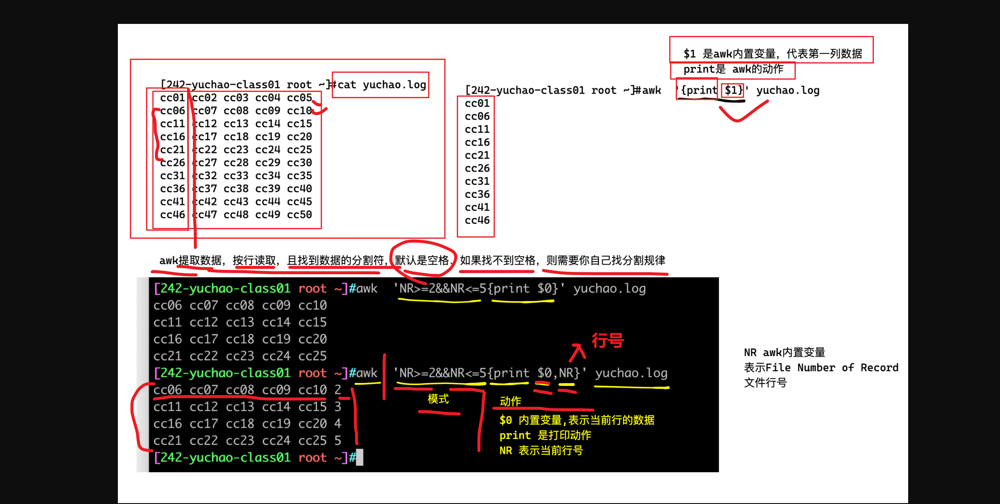
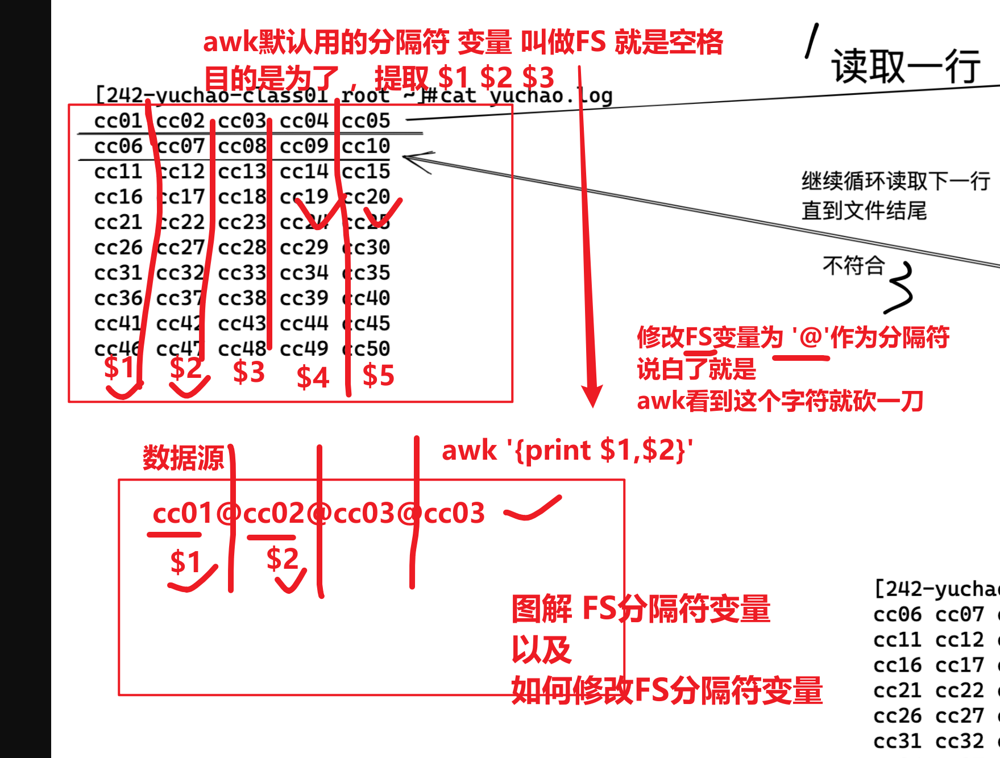
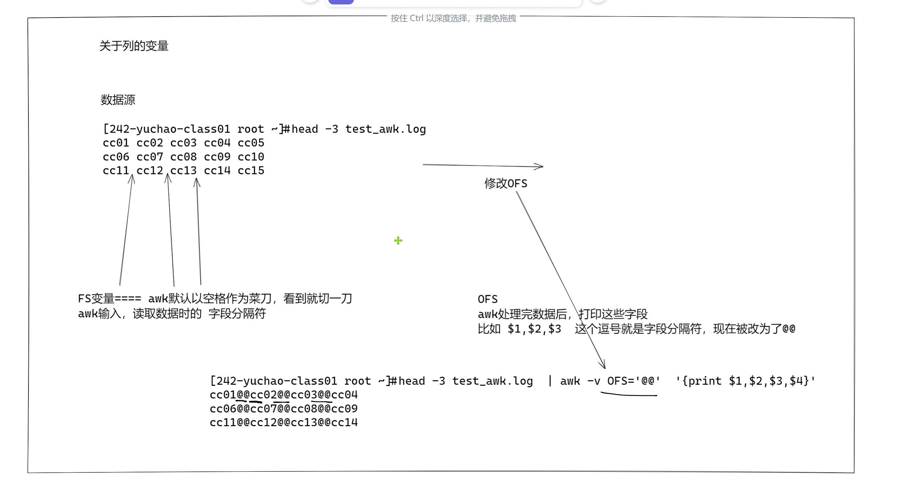

```### 此资源由 58学课资源站 收集整理 ###
	想要获取完整课件资料 请访问：58xueke.com
	百万资源 畅享学习

```


# awk是什么


## 再谈三剑客

- grep，擅长单纯的查找或匹配文本内容
- sed，更适合编辑、处理匹配到的文本内容
- awk，更适合格式化文本内容，对文本进行复杂处理后、更友好的显示

三个命令称之为Linux的三剑客

# awk学完后的能力

以下部分内容需要结合shell编程

- 对文本行数据提取数据字段
- 模式、动作
  - 正则模式匹配
  - 匹配到数据后的动作
- awk执行流程
- awk内置变量（默认预留变量）
- awk数组
- awk循环、条件判断
- awk内置函数
- awk参数传递
- awk程序开发


# 如何学awk


## 学awk就两件事、行、列

- 对行操作、对列操作

  - 如何分割数据，

  - 如何输出数据，指定第一行，到第三行

# awk的语法格式

awk 指令是由`模式,动作,或者模式和动作的组合`组成.

- 模式即 pattern,可以类似理解成 sed 的模式匹配,可以由表达式组成,也可以使两个正斜杠之间的正则表 达式.比如 NR==1,这就是模式,可以把他理解为一个条件.
- 动作即 action,是由在大括号里面的一条或多条语句组成,语句之间使用分号隔开,如下 awk 使用格式


- Action指的是动作，awk擅长文本格式化，且输出格式化后的结果，因此最常用的动作就是`print`


# awk模式、动作

- 模式，是指，要操作哪些行
- 动作，是指，找到这些行之后，干什么，如何处理
- 

```
生成测试数据
[242-yuchao-class01 root ~]#echo cc{01..50} | xargs -n 5
cc01 cc02 cc03 cc04 cc05
cc06 cc07 cc08 cc09 cc10
cc11 cc12 cc13 cc14 cc15
cc16 cc17 cc18 cc19 cc20
cc21 cc22 cc23 cc24 cc25
cc26 cc27 cc28 cc29 cc30
cc31 cc32 cc33 cc34 cc35
cc36 cc37 cc38 cc39 cc40
cc41 cc42 cc43 cc44 cc45
cc46 cc47 cc48 cc49 cc50

写入文件，生成测试数据文件
echo cc{01..50} | xargs -n 5 > yuchao.log
```

## 无模式、只有动作

不写模式、默认处理每一行

```
1. 直接输出源文件，所有内容
动作是 {print $0}  这个$0是表示列的数据，默认是表示一整行数据
关于字段的取值语法
是
$0 表示所有字段数据
$1 第一列数据
$2 第二列数据
依次类推
。。。


[242-yuchao-class01 root ~]#awk '{print $0}' test_awk.log 
cc01 cc02 cc03 cc04 cc05
cc06 cc07 cc08 cc09 cc10
cc11 cc12 cc13 cc14 cc15
cc16 cc17 cc18 cc19 cc20
cc21 cc22 cc23 cc24 cc25
cc26 cc27 cc28 cc29 cc30
cc31 cc32 cc33 cc34 cc35
cc36 cc37 cc38 cc39 cc40
cc41 cc42 cc43 cc44 cc45
cc46 cc47 cc48 cc49 cc50


2.输出每一行数据，但是只要第一列的数据
awk '{print $1}' test_awk.log

3. 输出每一行数据，只要第二列的数据
awk '{print $2}' test_awk.log

4. 输出每一行数据，只要第一列和 第三列的数据
awk '{print $1,$3 }' test_awk.log

[242-yuchao-class01 root ~]#awk '{print $1,$3 }' test_awk.log
cc01 cc03
cc06 cc08
cc11 cc13
cc16 cc18
cc21 cc23
cc26 cc28
cc31 cc33
cc36 cc38
cc41 cc43
cc46 cc48


```


## 行变量NR、匹配范围语法

- 刚才是没指定处理那一行，默认是所有行
- 可以指定对某一行处理了


```
语法说明，内置变量NR，表示awk处理的每一行
number of record   （记录，行的意思）
NR ============== 行号


#格式说明
NR      行  
直接打印这个内置变量，表示取当前行的号码
在开头显示行号
[242-yuchao-class01 root ~]#awk '{print NR,$0}' test_awk.log 
在结尾显示行号
[242-yuchao-class01 root ~]#awk '{print $0,NR}' test_awk.log 


NR==    等于行 

打印第二行的所有字段数据
awk  'NR==2{print $0}'    test_awk.log
打印第二行的，第1列，和第四列数据
[242-yuchao-class01 root ~]#awk 'NR==2{print $1,$4}' test_awk.log
cc06 cc09


NR>=    大于等于行
NR<=    小于等于
NR>=N && NR<=M   从N行到M行
|| 或的用法

这是关于awk对行处理的 语法

```

## 列变量NF、每一列的字段


```
number of field  (字段的数量) =====NF====等于列的总数

直接写NF变量表示每一行字段的总数
查看每一行有多少个字段
awk '{print $0,NF}' test_awk.log


输出列：
#位置变量说明

直接写NF变量表示每一行字段的总数
查看每一行有多少个字段====
这个NF，默认表示，字段的总数
awk '{print $0,NF}' test_awk.log

$1,$2,$3
,         输出分隔符，默认逗号，awk输出每一列的分隔符是，空格
$0      输出所有字段
$1      输出第一列 
$2      输出第二列的数据 
$3      输出第三类的数据
... 依次类推


$NF     输出最后一列
awk '{print $NF}' test_awk.log 


$(NF-1)    输出倒数第2列 


```

最后一列图解


## 指定行（模式）、打印动作

```
awk '模式 {打印动作} '
```


提取出第二行的数据

NR 行变量

```
awk 'NR==2{print $0}'  test_awk.log

懒人写法，默认awk给你进行打印$0了，不建议用
awk 'NR==2' test_awk.log


```

提取出第二行到第五行

```
2
~
5


awk 'NR>=2&&NR<=5{print $0}' test_awk.log


```


## 指定行（模式）、打印某一列（动作）

提取出第二行到第五行，并且只打印**前三列**的数据

```

[242-yuchao-class01 root ~]#awk 'NR>=2&&NR<=5{print $1,$2,$3}' test_awk.log
cc06 cc07 cc08
cc11 cc12 cc13
cc16 cc17 cc18
cc21 cc22 cc23

```


## 图解模式、动作




## 只有模式，不写动作（懒人写法，别用）

awk不指定动作的话，默认打印整行信息


```
提取前五行的数据，请务必加上动作，且显示行号在前面

awk 'NR<=5{print NR,$0}' test_awk.log

```

## 只有动作、不写模式

没有模式，也就是没限定条件，

Awk默认处理所有行

```
打印前三列的数据
awk '{print $1,$2,$3}' test_awk.log
```


## 多个模式和动作（解释NR、NF）

- 指定行，`NR==4`，number of record，行号的记录

- 指定动作，

  ```
  [242-yuchao-class01 root ~]#awk '{print $0,NF,NR}' test_awk.log 
  cc01 cc02 cc03 cc04 cc05 5 1
  cc06 cc07 cc08 cc09 cc10 5 2
  cc11 cc12 cc13 cc14 cc15 5 3
  cc16 cc17 cc18 cc19 cc20 5 4
  cc21 cc22 cc23 cc24 cc25 5 5
  cc26 cc27 cc28 cc29 cc30 5 6
  cc31 cc32 cc33 cc34 cc35 5 7
  cc36 cc37 cc38 cc39 cc40 5 8
  cc41 cc42 cc43 cc44 cc45 5 9
  cc46 cc47 cc48 cc49 cc50 5 10
  
  ```
  
  - 内置变量$0表示整行数据
  - NF表示Number of filed，字段的数量，表示这一行数据分了几列
    - NF表示字段总数
    - $NF表示取最后一个字段的值
  - NR表示,number of record，行号的记录，表示在处理第几行


```
打印前四行数据，要求输出每一行的行号、字段数、以及对应行的数据
[242-yuchao-class01 root ~]#awk 'NR<=4{print NR,NF,$0 }' test_awk.log
1 5 cc01 cc02 cc03 cc04 cc05
2 5 cc06 cc07 cc08 cc09 cc10
3 5 cc11 cc12 cc13 cc14 cc15
4 5 cc16 cc17 cc18 cc19 cc20

```

对、行、列数据的快速入门操作


## awk快速入门小结

- pattern和action都要用单引号，防止shell作特殊解释（是交给awk去执行的，而不是bash）

- 不指定模式，awk默认处理输入的文件数据，每一行，每一列

  - 如果指定模式，例如指定的行，awk就处理指定那一行的数据

- awk的动作，必须写在花括号里

  ```
  {print}
  ```

  ，括号里写入awk提供的命令。

  - 如果没有`{ }`花括号，就会被识别为patter，而不是action

- 注意给awk传入数据，一般都是file

- 也可以是管道传递的数据

```
拿到第二行的，倒数第二列的数据

[242-yuchao-class01 root ~]#cat test_awk.log | awk 'NR==2{print $(NF-1)}'
cc09

```


# 图解awk执行过程


# awk的字段（列）、记录（行）变量

| awk变量符号 | 作用                                 | 名称翻译          |
| ----------- | ------------------------------------ | ----------------- |
| NR          | 行记录、行数据、awk处理的第几行      | umber of record   |
| NF          | 字段的数量，表示这一行数据分了几列， | Number of filed， |
| $1          | 第一个字段的数据、$2、$3以此类推     |                   |
|             |                                      |                   |


## awk其他内置变量（翻译）

参考国外awk网址

https://www.thegeekstuff.com/2010/01/8-powerful-awk-built-in-variables-fs-ofs-rs-ors-nr-nf-filename-fnr/

```
NR=======行号
NF========字段数量

FS===========数据输入的字段分隔符，默认是    【空格】
（awk读取的这个数据，以什么分隔符去读，去分割它的数据）

RS============record separator 行分隔符，默认是【换行符】

```

图解FS变量，，，，，，，，，，，，关于列的分隔符



图解RS变量,,,,,,,,,,,,,,,,关于行分隔符


```
awk的其他内置变量如下。

FILENAME：当前文件名

===================awk在数据输入时，的一个分隔符===================
FS：字段分隔符，默认是空格和制表符。
Input field separator variable.输入字段分隔符变量。

RS：行分隔符，用于分割每一行，默认是换行符。
Record Separator variable，行分隔符变量


============awk处理完毕后，打印的数据格式，分隔符=================
OFS：输出字段的分隔符，用于打印时分隔字段，默认为空格。
Output Field Separator Variable，输出字段分隔符变量

ORS：输出记录的分隔符，用于打印时分隔记录，默认为换行符。
Output Record Separator Variable，输出记录分隔符变量

OFMT：数字输出的格式，默认为％.6g。


```


---


## RS变量/ORS变量

```
RS变量作用是，  行分隔符========awk在数据输入时，读取的一个行分隔符


ORS ，output RS =======awk在{print $0} 打印数据后，的一个行分隔符==
```


```
RS变量: record separator，输入行、分隔符

ORS、awk输出行、分隔符


```

## 图解awk执行的输入、输出

awk 对每个要处理的输入数据认为都是具有格式和结构的,而不仅仅是一堆字符串

默认情况下,每一行 内容都是一条记录,并以换行符分隔**(\n)**结束

- awk默认下，每一行就是每一个record（记录）
- RS 即 record separator 输入输入数据 ,表示每个记录输入的时候分隔符.即行与行之间如何分隔.
- NR 即 number of record 记录(行)号,表示当前正在处理的记录(行)的号码
- ORS 即 output record separator 输出记录分隔符

## 修改RS/修改awk输入显示


## 测试修改RS变量

测试修改awk的数据输入，行分隔符


测试数据

```
[242-yuchao-class01 root ~]#head -3 yuchao.log
cc01 cc02 cc03 cc04 cc05
cc06 cc07 cc08 cc09 cc10
cc11 cc12 cc13 cc14 cc15

=========基本玩法，默认行分隔符是 换行符

awk '{print $0}' test_awk.log


```

### awk默认的行分隔符

```
[242-yuchao-class01 root ~]#
这个写法，等于awk默认的行分隔符，现在是指定看效果是 \n
[242-yuchao-class01 root ~]#awk -v RS='\n'  '{print $0}' test_awk.log 
cc01 cc02 cc03 cc04 cc05
cc06 cc07 cc08 cc09 cc10
cc11 cc12 cc13 cc14 cc15
cc16 cc17 cc18 cc19 cc20
cc21 cc22 cc23 cc24 cc25
cc26 cc27 cc28 cc29 cc30
cc31 cc32 cc33 cc34 cc35
cc36 cc37 cc38 cc39 cc40
cc41 cc42 cc43 cc44 cc45
cc46 cc47 cc48 cc49 cc50
[242-yuchao-class01 root ~]## 让awk读取该文件，将每一个 cc01 cc02 都单独认为是一行
[242-yuchao-class01 root ~]#
[242-yuchao-class01 root ~]#

这里是修改RS行分隔符为空格
awk看到空格就认为是新的一行数据
[242-yuchao-class01 root ~]#awk -v RS=' '  '{print $0}' test_awk.log 
cc01
cc02
cc03

```


## 修改ORS、修改awk动作执行后的数据打印格式

当awk处理完毕后，print打印结果，默认也是 一个换行符

```
源数据
[242-yuchao-class01 root ~]#cat test_awk.log 
cc01 cc02 cc03 cc04 cc05
cc06 cc07 cc08 cc09 cc10
cc11 cc12 cc13 cc14 cc15
cc16 cc17 cc18 cc19 cc20
cc21 cc22 cc23 cc24 cc25
cc26 cc27 cc28 cc29 cc30
cc31 cc32 cc33 cc34 cc35
cc36 cc37 cc38 cc39 cc40
cc41 cc42 cc43 cc44 cc45
cc46 cc47 cc48 cc49 cc50

awk给这个默认打印的结果，结尾加上的是 换行符

你可以修改这个，awk的输出行分隔符，默认是   换行符

把awk输出的行分隔符，改为 @@
修改 ORS变量为@@


awk -v ORS='@@'  '{print $0}' test_awk.log


```


## 修改ORS/修改awk输出显示

你可以自由修改，awk处理完毕后的每一行的分隔符，也就是修改ORS变量。


### 小结

- awk默认情况下，认为文件从头到尾是一整行数据，直到碰见换行符

  ```
  \n 回车换行符
  ```

  ，因此本行结束，进入下一行

  - 可以通过修改awk的RS变量，修改行输入的分隔符


# 面试题，统计单词出现频率

- 并且统计出现最多的前5个

```
[242-yuchao-class01 root ~]#cat english.log 
I have a dog, it is lovely, it is called Mimi. Every time I go home from school, Mimi always cruising around me, I will go to the kitchen to get a piece of meat to it, it lay on the floor to eat. My legs and then jump to bark "Wang "called, so I picked up Mimi, it is the opportunity to lick my hand, making me laugh.I like Mimi, like puppies.


1.将一整行的数据，改为，每一个单词，就是一行
2.改为这样后，就可以交给sort去排序了
3.再去uniq 去重 -c 统计重复的次数


```

### 代码思路

- 先让所有单词合并为1列，注意是一列、排成一队、然后排序，合并重复的，且统计重复次数
- 主要是对空格转换


```
这道题，核心就在于
1.单行的多个单词，替换为，每一个单词成为一行
 - 简单处理，找到空格就改为换行，修改RS，数据输入换行符，改为RS=' '
 - 复杂处理，找到非连续的大小写字母，就换行

2. 排序

3.去重

4.排序统计 最多的前五个
```


## sed答题

```
[242-yuchao-class01 root ~]#sed -r 's#[^a-zA-Z]+#\n#g' english.log  | sort | uniq -c | sort -r -n  | head -5
      6 to
      5 it
      5 I
      4 Mimi
      3 the


```


## tr答题

```
tr命令就是将字符替换的作用

基本语法

[242-yuchao-class01 root ~]#echo 'hello world' | tr 'll' 'LL'
heLLo worLd

思路就是
将文本中的空格，换为 \n ，就实现了每一个单词，作为新的一行

[242-yuchao-class01 root ~]#cat english.log |tr ' '  '\n' | sort | uniq -c | sort -r -n  | head -5
      6 to
      4 it
      4 I
      3 the
      3 is


```


## grep答题

```
grep关键字提取
[242-yuchao-class01 root ~]#grep -E '[a-zA-Z]+' english.log  -o  | sort | uniq -c | sort -r -n  | head -5
      6 to
      5 it
      5 I
      4 Mimi
      3 the


```


## awk答题

```
简单考虑，直接考虑输入的行分隔符，改为 空格
1.将一整行的数据，改为，每一个单词，就是一行
awk -v RS=' ' '{print $0}' english.log

2.改为这样后，就可以交给sort去排序了，将子母一样的，搁一块
awk -v RS=' ' '{print $0}' english.log | sort 


3.再去uniq 去重 -c 统计重复的次数
awk -v RS=' ' '{print $0}' english.log | sort  |uniq

4.并且统计出现最多的前5个
awk -v RS=' ' '{print $0}' english.log | sort  |uniq -c  | sort -r | head -5

就是用正则，提取，大小写字母


复杂考虑
[242-yuchao-class01 root ~]#awk -v RS='[^a-zA-z]+' '{print $0}' english.log | sort | uniq -c | sort -r -n  | head -5
      6 to
      5 it
      5 I
      4 Mimi
      3 the

```


# awk列操作（分隔符修改）

- 行操作
- 列操作
- 


## 字段（列）

每条记录都是由多个区域(field)组成的

每一行数据，都被分割为了很多个字段

默认情况下区域之间的分隔符是由空格(即空格或制表符)来分隔

将分隔符记录在内置变量 FS中

每行记录的区域数据保存在 awk 的内置变量 NF 中


### 图解awk字段

- FS 即 fileld separator,输入字段(列)分隔符,分隔符就是菜刀,把一行字符串切为很多区域

- ```
  FS=':'
  
  看到冒号，就砍一刀，分割为左右两边的数据
  
  ```

- 

- NF 即 number of fileds,表示一行中列(字段)的个数,可以理解为菜刀切过一行后,切成了多少份


### 指定分隔符

当文本不是以空格分割，你得自己找特征，进行切蛋糕。

- FS的值可以是固定的字符、也可以是正则表达式

```
例如/etc/passwd文件 ，提取用户信息

提取出用户名、登录解释器

awk -v FS=':'  '{print $1,$NF }' /etc/passwd

# 美化显示的命令column -t

[242-yuchao-class01 root ~]#awk -v FS=':'  '{print $1,$NF }' /etc/passwd |column -t


```


### 提取用户账号密码信息

生成测试数据，python脚本

工作常用的，数据 csv存储

股票.csv

用户信息.csv

如何去提取里面的数据

1.思考，分析该数据的 每一个字段的分隔符是否有特点

2.提取该分隔符，


### 提取前10位用户的数据

```


简单的，读数据，然后awk打印，改为以空格分割每一个数据

test10 123456 583438864691290311

awk  -v FS=','  '{print $1,$2,$3}' user_id.csv 


修改格式
身份证号   用户名  密码

awk  -v FS=','   '{print $3,$1,$2}' user_id.csv 


身份证号---用户名---密码
[242-yuchao-class01 root ~]#cat user1.csv 
t1,123,1111111
t2,456,2222222
[242-yuchao-class01 root ~]#
[242-yuchao-class01 root ~]#
[242-yuchao-class01 root ~]#awk -v FS=','  '{print $3,$2,$1}' user1.csv 
1111111 123 t1
2222222 456 t2


```

### 提取30号用户的用户名、身份证号，且显示行号

```
test30,123456,895782891435332651	
test90,123456,845590904189307705	
test91,123456,631309684235761490	
test92,123456,140550391185668516	
test93,123456,753107759637368854	
test94,123456,572732019383725076	
test95,123456,817005865875540475	

答案

awk -v FS=',' 'NR==30{print $1,$3,NR}' user_id.csv 

awk使用正则的语法
test30

awk '/正则表达式/{action}' user_id.csv

awk -v FS=','   '/^test30/{print $1,$3,NR}' user_id.csv


```


## 提取ip地址

```
```


## awk内置变量梳理

## 关于行的内置变量，RS、ORS


## 关于列的变量

FS，提取数据时，提取的字段，以什么字符进行切割，分割

OFS，打印数据时，每一个字段之间的分隔符是什么




## 修改FS和OFS变量

刚才我们练习了

- RS和ORS
  - RS、输入记录分隔符，决定awk如何分隔每一行（默认是\n）
  - ORS，输出记录分隔符，决定awk如何输出每一行（默认是\n）
- FS和OFS
  - FS是输入字段分隔符，决定awk输入数据后的每一个字段分隔符是什么，默认是空格
  - OFS是输出字段分隔符，决定awk输出每个字段的分隔符是什么，默认是空格


### 指定FS分隔符（在哪个位置切蛋糕）

```
两个方式
1、参数
awk -F '分隔符'

2.修改变量
awk -v FS='分隔符'
```

当你拿到一个数据文本，并非是很直观的可以看出 空格分割的数据

那么你就得自己找规律，如何提取该数据，也就是指定分隔符，修改FS变量。


### 指定OFS分隔符

```
两个方式
1、参数
awk -F '分隔符'

2.修改变量
awk -v FS='分隔符'
```

测试数据

```
[242-yuchao-class01 root /opt]#cat yuchao.log
cc01 cc02 cc03 cc04 cc05
cc06 cc07 cc08 cc09 cc10
cc11 cc12 cc13 cc14 cc15
cc16 cc17 cc18 cc19 cc20
cc21 cc22 cc23 cc24 cc25
cc26 cc27 cc28 cc29 cc30
cc31 cc32 cc33 cc34 cc35
cc36 cc37 cc38 cc39 cc40
cc41 cc42 cc43 cc44 cc45
cc46 cc47 cc48 cc49 cc50
```

要求修改每一个数据之间的分隔符，改为#号

$1 ,$2 是字段之间的逗号，和OFS对应

```
[242-yuchao-class01 root ~]#awk -v OFS='#'  '{print $1,$2,$3,$4,$5}' test_awk.log 
cc01#cc02#cc03#cc04#cc05
cc06#cc07#cc08#cc09#cc10
cc11#cc12#cc13#cc14#cc15
cc16#cc17#cc18#cc19#cc20
cc21#cc22#cc23#cc24#cc25
cc26#cc27#cc28#cc29#cc30
cc31#cc32#cc33#cc34#cc35
cc36#cc37#cc38#cc39#cc40
cc41#cc42#cc43#cc44#cc45
cc46#cc47#cc48#cc49#cc50


```

### 修改/etc/passwd的格式

修改原本用户信息的冒号分隔符、改为`---`

提取出 root、家目录、登录解释器

```
[242-yuchao-class01 root ~]#head -5 /etc/passwd
root:x:0:0:root:/root:/bin/bash
bin:x:1:1:bin:/bin:/sbin/nologin
daemon:x:2:2:daemon:/sbin:/sbin/nologin
adm:x:3:4:adm:/var/adm:/sbin/nologin
lp:x:4:7:lp:/var/spool/lpd:/sbin/nologin


head -5 /etc/passwd|awk -v FS=':' -v OFS='---'  'NR==1{print $1, $(NF-1),$NF}'  


```


### 图解修改FS、OFS


## 总结行、列

- RS、ORS、代表了awk的输入、输出、关于`行`的分隔符
- FS、OFS、代表了awk的输入、输出、关于`列`的分隔符
  - 对于不同的文本，需要选择合适的FS、合适的菜刀，来分割出左右可以便于提取的数据
- NR表示行号、记录号
- NF表示每一行的字段数、有多少列
- $符号一般用于提取某一列的数据，如$1、$2
  - $NF表示最后一列的数据


# 关于awk基础快速入门总结

- awk的命令行、语法结构
- awk的模式、动作
- awk的行、列
- awk的列、也就是字段是核心需要提取的某一块数据。


