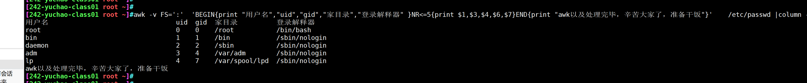

```### 此资源由 58学课资源站 收集整理 ###
	想要获取完整课件资料 请访问：58xueke.com
	百万资源 畅享学习

```
# awk模式种类

>awk的模式匹配

```
NR 针对行号的比较，
==
>=

模式，是指定了第二行
awk 'NR==2{print $0}'

关于awk的正则匹配
语法

模式，指定正则
awk '/正则/{print $0}'
```


awk的模式分为这几种

- 正则表达式
  - 基本正则
  - 扩展正则
- 比较表达式
- 范围表达式
- 特殊模式
  - BEGIN
  - END


## awk比较运算符（语法）

关于数值的比较

| 关系运算符 | 解释     | 示例 |
| ---------- | -------- | ---- |
| <          | 小于     | x<y  |
| <=         | 小于等于 | x<=y |
| ==         | 等于     | x==y |
| !=         | 不等于   | x!=y |
| >=         | 大于等于 | x>=y |
| >          | 大于     | x>y  |
|            |          |      |
|            |          |      |

关于字符串的匹配

```
| ~    | 匹配正则       | x~/正则/  |


| !~   | 与表达式不匹配 | x!~/正则/ |
```

## 正则表达式语法（awk模式）

- 正则表达式作用在于在行数据中匹配想要的字符串、然后执行对应的action动作
- 支持基本正则、扩展正则

```
awk '/正则表达式/{print $0}'
```

再来看一下awk的语法，`模式`也可以理解为是`条件`

```
awk [option] 'pattern[action]'  file ...
```

**awk默认是按行处理文本，如果不指定任何模式（条件），awk默认一行行处理**

**如果指定了模式，只有符合模式的才会被处理**


## 经典语法图解


## awk正则练习/etc/passwd

创建测试数据

```
创建用户
[242-yuchao-class01 root ~]#for i in `seq 10`;do useradd t${i};done

删除用户
for i in `seq 10`;do userdel -rf t${i};done
```


### awk提取出/etc/passwd 中root用户行

```
1.显示root行所有信息

2.仅显示root用户名、家目录、登录解释器


```

### awk提取出允许登录的用户名

```
1.结尾是bash的行

awk -v FS=':'  '/bash$/{print $1}'  /etc/passwd


2.指定最后一个字段的正则匹配


```


### awk提取出用户名以t开头的行

```
```


### 提取出由用户自己创建的用户

```
1.uid

2./home
```


### 提取出禁止登录的用户

```
1.是nologin的行


2.非bash的行


```


## awk正则提取ip

```
1.指定行号

2.正则提取
```


## Awk判断22、80端口是否存活

```
```

## 提取/etc/passwd的10~20行

要求且显示行号

```
```


# awk范围模式

- 可以用到正则
- 可以用到比较运算符

范围模式就是从某一行到某一行，均是符合条件的行。

```
语法
awk '/regex1/,/regex2/{action}' yuchao.log
```

### 显示root行到mail用户的行

处理/etc/passwd

且显示行号

```
```

### 显示bin用户到第五行

且显示行号

```
```


# awk特殊模式BEGIN和END

```
print awk提供的命令之一

```


## BEGIN模式

- BEGIN模式作用是在awk开始读取文件行数据、之前就先执行，一般用于预定义一些操作，比如数据的表头格式化等。
- BEGIN后面必须跟上action动作

### BEGIN打印


```
语法

awk 'BEGIN{print "你好"}{print $0}' 
```


显示/etc/passwd前五行，且加上打印BEGIN动作，打印"awk正在执行中" 表头

```
awk '  BEGIN{print "awk正在执行中" }    NR<=5  {print $0}' /etc/passwd
```

```
语法
awk 'BEGIN{}  模式 {动作}'


```

### END{} 特殊模式


```
BEGIN{} 用于awk执行之前的操作
END{}  awk所有行数据处理完毕后，做什么事

语法
awk 'BEGIN{print "你好 "}  模式 {动作}  END{print "awk完事了"}' 


```


### awk格式化打印/etc/passwd

提取root、mail、nobody三个用户信息

- 名字
- 家目录
- 登录解释器

且设置好表头（格式化打印）

可以用column -t命令格式化制表符

```
```


## END模式

- 和BEGIN相反，END就是awk结束后的操作
- END是awk读取完所有的文件后，再执行END模块，一般用来总结、格式化打印一个结果
- END仅会在awk所有行数据处理完毕后，执行END动作。

### 简单打印

```
提取系统前五个用户的，用户名、uid、gid、家目录、登录解释器、设置为表头
且结束后提示，awk已经处理完毕


root:  x:   0:    0:   root:    /root:   /bin/bash
bin:x:1:1:bin:/bin:/sbin/nologin
daemon:x:2:2:daemon:/sbin:/sbin/nologin
adm:x:3:4:adm:/var/adm:/sbin/nologin
lp:x:4:7:lp:/var/spool/lpd:/sbin/nologin


awk -v FS=':'  'BEGIN{print "用户名","uid","gid","家目录","登录解释器" }NR<=5{print $1,$3,$4,$6,$7}END{print "awk以及处理完毕，辛苦大家了，准备干饭"}'    /etc/passwd


```




### 计算/etc/passwd行数

显示/etc/passwd的用户名、登录解释器、且在结尾显示行数。

- NR，number of record，行号记录

```
```


