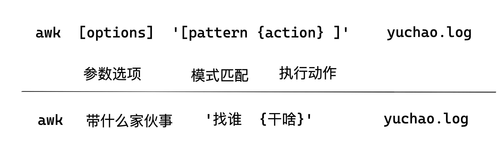
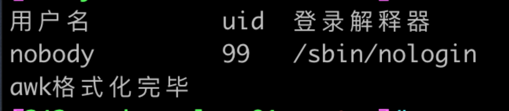

```### 此资源由 58学课资源站 收集整理 ###
	想要获取完整课件资料 请访问：58xueke.com
	百万资源 畅享学习

```
# awk练习题

# 前言

学awk就两件事

- 如何分割数据
- 如何输出数据


# 语法




# 1.输出列

## 测试数据

```
echo yuchao linux python music
```

## 练习语法

```
1.输出列：
#位置变量说明
,		输出分隔符，默认逗号表示空格
$0		输出所有  
$1  	输出第一列 
$N  	输出第N列
$NF 	输出最后一列
$(NF-1)	输出倒数第2列	

测试数据
echo "yuchao linux python music"


#1.输出所有列


#2.只输出第一列


#3.输出第1和第2列


#4.输出第1列到第3列


#5.改变输出顺序为第3列，第2列，第1列


#6.格式化打印为如下效果
姓名：yuchao 爱好：linux python music


#7.格式化输出所有列，以:分隔


#8.输出最后一列


```


# 2.指定列分隔符 FS

语法格式

```
#语法格式: 
awk -F ":"
awk -F ":/"
awk -F "[:/]"
awk -v FS='-'
awk -v FS=':'


```


## 1.FS改变默认分隔符

语法

```
awk -v FS='字段分隔符'

awk -F '字段分隔符'
```


```


1.源数据
echo 'yuchao-linux-python-music'

要求改为每一个单词分隔符，改为空格，两种解法


2.源数据
echo yuchao@linux@python@music

要求改为每一个单词分隔符，改为空格，两种解法


```

## 2.输出用户名和登录解释器（/etc/passwd）

```
[242-yuchao-class01 root ~]#awk -F ':' '{print $1,$NF}' /etc/passwd | column -t
```


## 3.输出第一个用户名和该用户的注释

```
（/etc/passwd）
```

## 4.输出所有行倒数第二列

```
（/etc/passwd）


```

## 5.切割多个符号

```
源数据是
echo 'yu:://...---yuchao:..chaoge'

要求提取为如下格式数据

yu yuchao chaoge


```


## 6.特殊场景（单引号分隔符）

```
源数据
echo "yuchao'linux'python'music" 


要求提取、且格式化输出为如下格式数据

yuchao---linux---music

```


## 7.以`[`为分隔符

```
echo "yuchao[linux[python[music" 

要求提取、且格式化输出为如下格式数据

yuchao music liux python
```


# 3. 默认列分隔符FS、OFS


也就是awk处理完毕后的结果输出，默认字段分隔符是空格

```
[242-yuchao-class01 root ~]#echo "yuchao linux python music" | awk '{print $1,$2,$3}'
yuchao linux python

源数据
echo "yuchao linux python music"

要求提取、格式化为如下数据
yuchao@linux@python
```

练习二

```
源数据
echo "yuchao@linux@python@music" 

要求格式化为如下
yuchao-linux-python
```


## 4.列匹配（列比较符号）

每一列数据、每一列的字段数据比较

```
语法
针对数字：
==
>
<
!=
>=
<=

针对字符串：
~	
~!	
```


练习

## /etc/passwd

```
1.输出uid等于0的用户


2.输出uid大于等于900的用户


3.输出uid小于等于900的用户名、用户uid

4.输出uid大于300或者小于50的用户名、用户id

5.输出不允许登录的用户名、用户注释、用户登录解释器、两种办法

```


# 4.正则匹配模式

```
创建用户
[242-yuchao-class01 root ~]#for i in `seq 10`;do useradd t${i};done

删除用户
for i in `seq 10`;do userdel -rf t${i};done
```


习题


```
语法
awk '/正则表达式/{print $0}'

# 1.输出root用户的用户名、uid、gid、home、login shell


# 2.输出yuchao01用户的用户名、uid、gid、home、login shell

# 3. 提取出允许登录的用户行

# 4. 提取出用户名以t开头的行

# 5.提取出由用户自己创建的用户

# 6.提取出禁止登录的用户

# 7. 显示root行到mail用户的行

# 8.显示bin用户到第五行

# 9. awk去除文件的空白、注释行

```


# 5.范围匹配（NR、行比较符号）

```
语法说明
#格式说明
NR  	行
NR==	等于行
NR>=    大于等于行
NR<=    小于等于
NR>=N&&NR<=M  从N行到M行
```

实践

/etc/passwd

```
1.打印第二行的信息


2.输出第二行到结尾的所有行，带上行号

3.输出2到5行的内容，包括行号


4.输出第3行、第11行的内容，包括行号


5.找到root用户到nobody用户的内容，包括行号


```


# 6.特殊模式BEGIN和END

```
1.提取nobody用户名、uid、登录解释器，且添加该行首字段，格式化显示，以及添加结尾动作，awk格式化完毕

要求格式化为如下形式


```

参考图





2.用awk统计root创建了多少个普通用户，要求：

- 打印所有符合条件的用户
- 结尾打印
  - 自建用户数量是：数字

```

```


# 7.日志处理

```
1.拿到日志,2022-4-12-nginx.log ，日志测试数据从超哥要

1.提取出IP访问次数最多的前10个
```


# 8.awk判断22端口和80端口是否存活

```
```


