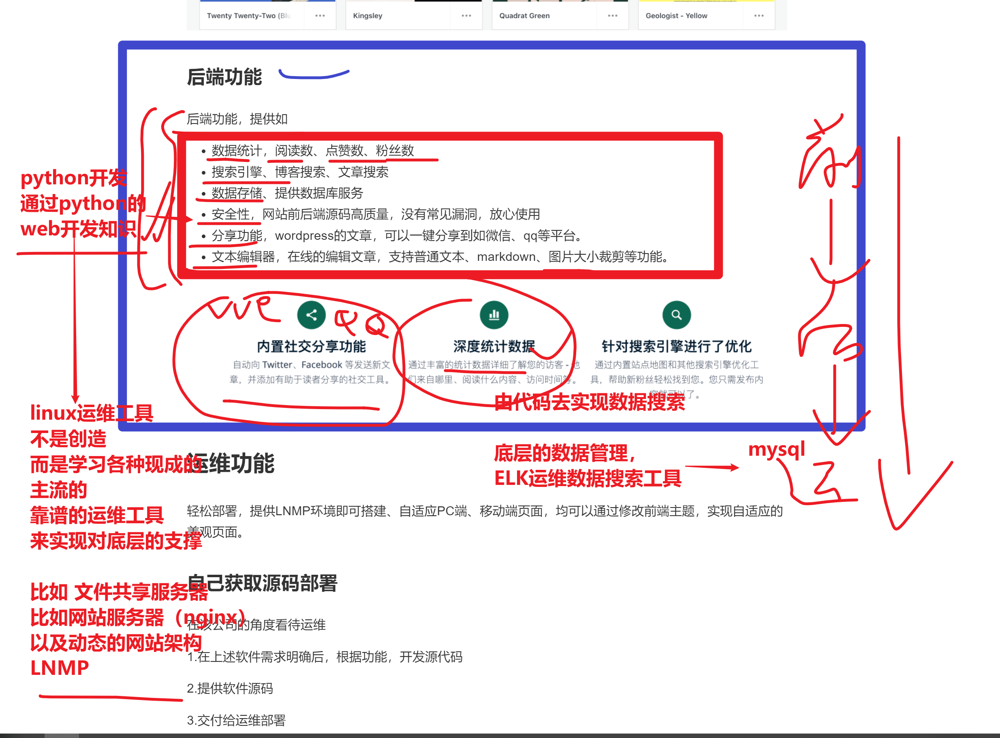

```### 此资源由 58学课资源站 收集整理 ###
	想要获取完整课件资料 请访问：58xueke.com
	百万资源 畅享学习

```
# 运维的工作场景描述


-=--




# 模板机器准备

```
服务器作用            主机名                外网地址            内网地址                运行软件                                    
管理机                master-61            10.0.0.61        172.16.1.61            Ansible/zabbix/jumpserver/openvpn        
负载均衡服务器        slb-5                10.0.0.5        172.16.1.5            nginx/keepalived
负载均衡服务器        slb-6                10.0.0.6        172.16.1.6             nginx/keepalived

web服务器            web-7                10.0.0.7        172.16.1.7             nginx/php
web服务器            web-8                10.0.0.8        172.16.1.8            nginx/tomcat
web服务器            web-9                10.0.0.9        172.16.1.9            nginx/php

存储服务器            nfs-31                 10.0.0.31        172.16.1.31         nfs/rsyncd/lsyncd
备份服务器            rsync-41             10.0.0.41        172.16.1.41            nfs/rsyncd/lsyncd

数据库服务器            db-51                10.0.0.51        172.16.1.51            mysql/redis


注意去理解架构图，生产环境下、只有最外层的负载均衡设备，才能对接到公网流量，因此需要配置公网ip地址；
其他功能的服务器，只需要单网卡，内网IP即可；

外网地址
    - 模拟互联网的公网ip
    - 你可以直接使用windows，ping通该地址，（xshell）ssh连接该地址（服务器）


内网地址
    - 模拟服务器的内网，局域网环境
    - 无法直接通过xshell连接该服务器
```

## 模板机的创建


```
注意点是，双网卡，并且要修改网卡默认命名规则
在开机选择linux内核画面，输入tab键
net.ifnames=0 biosdevname=0
这个参数的作用是修改linux的安装过程，让网卡名，恢复为旧的linux命名规则，也就是eth0


模板机举例
网卡0   
eth0  
IPADDR   10.0.0.100  
GATEWAY  10.0.0.254 (1.vmware虚拟网络编辑器里确定好 2.修改linux的eth0网卡配置文件)
NETMASK  255.255.255.0
DN1=223.5.5.5


模拟外网网卡，因此需要网关


网卡1   eth1  ，仅仅模拟局域网，我们这9台机器
内网的网段设置（vmware，创建的LAN局域网，纯纯的局域网，只能和这个网段的ip地址通信，没有网关，无法从这个网关大门出去，和外接地址通信 ）
IPADDR 172.16.1.100
NETMASK 255.255.255.0


```


## linux装好后，开始系统初始化配置

```
1.该模板机，以及在安装阶段，设置好了双网卡，以及外网卡eth0的ip地址配置，目的是为了待会可以ssh连接
以及也修改了默认的网卡名字

2.等待安装完毕后，ssh连接，开始后续的系统初始化步骤

3.首次连接该模板机，通过xshell管理
ssh root@10.0.0.100

4.对网卡配置文件设置，修改eth0的网卡，生成新的eth1的网卡（设置完毕后，确保两个网卡正常）

确保你的eth0网卡，配置和我一样
[root@template-linux01 network-scripts]# cat ifcfg-eth0 
TYPE=Ethernet
BOOTPROTO=static
NAME=eth0
DEVICE=eth0
ONBOOT=yes
IPADDR=10.0.0.100
NETMASK=255.255.255.0
GATEWAY=10.0.0.254
DNS1=223.5.5.5


根据这个eth0，生成另一个eth1
[root@template-linux01 network-scripts]# cat ifcfg-eth1
TYPE=Ethernet
BOOTPROTO=static
NAME=eth1
DEVICE=eth1
ONBOOT=yes
IPADDR=172.16.1.100
NETMASK=255.255.255.0

# 重启网络，让，eth1也生效


```


## 关闭所有防火墙

- selinux，内置的防火墙
- firewalld，iptables，通过程序安装在linux上的软件防火墙

```
查看selinux状态
临时关闭selinux
[root@template-linux01 network-scripts]# setenforce 0
[root@template-linux01 network-scripts]# 

[root@template-linux01 network-scripts]# getenforce 
Permissive


永久关闭，需要修改配置文件
[root@template-linux01 network-scripts]# grep '^SELINUX' /etc/selinux/config 
SELINUX=disabled
SELINUXTYPE=targeted 


需要reboot重启

关闭防火墙firewalld，以及清空当前所有的 防火墙规则

清空防护墙规则
iptables -F

关闭firewalld服务，推到所有的防火墙大门，所有的链
systemctl stop firewalld
systemctl disable firewalld

如下确保，只有三行信息，表示防火墙，彻底关了
[root@template-linux01 network-scripts]# iptables -L
Chain INPUT (policy ACCEPT)
target     prot opt source               destination         

Chain FORWARD (policy ACCEPT)
target     prot opt source               destination         

Chain OUTPUT (policy ACCEPT)
target     prot opt source               destination    


```

## 加速ssh连接

默认ssh连接的时候，可能比较慢，因为它默认进行了dns解析，关闭这个功能


```
修改如下3个参数，和我一样即可
[root@template-linux01 network-scripts]# grep -Ei 'gssapiauth|usedns|pidfile' /etc/ssh/sshd_config 
GSSAPIAuthentication no
UseDNS no
PidFile /var/run/my_sshd.pid


改完了配置文件，务必要重启服务
[root@template-linux01 network-scripts]# systemctl restart sshd

由于重启了sshd服务，进程id必然会变化，
如何查找该服务的进程id？

看进程
[root@template-linux01 ~]# ps -ef|grep sshd
root       3078      1  0 10:41 ?        00:00:00 /usr/sbin/sshd -D
root       3085   3078  2 10:43 ?        00:00:00 sshd: root@pts/0
root       3105   3089  0 10:43 pts/0    00:00:00 grep --color=auto sshd

看端口
[root@template-linux01 ~]# ss -tnlp|grep sshd
LISTEN     0      128          *:22                       *:*                   users:(("sshd",pid=3078,fd=3))
LISTEN     0      128         :::22                      :::*                   users:(("sshd",pid=3078,fd=4))


根据pidfile文件，找到sshd服务的进程id
[root@template-linux01 ~]# cat /var/run/my_sshd.pid 
3078

[root@template-linux01 ~]# kill -9 `cat /var/run/my_sshd.pid `  


此时发现sshd服务挂了，无法远程连接了
找到它的物理服务器，想办法登录服务器本身，重新开启sshd服务
systemctl start sshd


```


## 优化PS1变量

```
让命令提示符显示的更有好些

每一个用户，登录该机器，都可以使用这个PS1变量

写入 
/etc/profile

echo  'export PS1="[\[\e[34;1m\]\u@\[\e[0m\]\[\e[32;1m\]\H\[\e[0m\] \[\e[31;1m\]\w\[\e[0m\]]\\$"'   >> /etc/profile


```


## yum源优化

```
一个新机器，无法安装各种软件，因此配置阿里云的默认仓库，以及epel仓库
可以安装绝大多数软件

1.备份旧的默认repo
[root@yuchao-template-100 ~]# cd /etc/yum.repos.d/
[root@yuchao-template-100 yum.repos.d]# mkdir bakrepo ;mv *.repo bakrepo/


2.生成新的repo文件，wget在线下载资源

wget -O /etc/yum.repos.d/CentOS-Base.repo https://mirrors.aliyun.com/repo/Centos-7.repo

wget -O /etc/yum.repos.d/epel.repo http://mirrors.aliyun.com/repo/epel-7.repo

想思路
1.用旧的repo文件，先下载wget命令
是配置一个正确可用的仓库，安装这个wget基础命令


2.使用本地光盘挂载形式，安装wget命令

3. 获取wget 的rpm包安装该命令

4. linux内置了curl命令，也是发起http请求的命令

用法

curl https://mirrors.aliyun.com/repo/Centos-7.repo > /etc/yum.repos.d/centos-base.repo


curl也有参数，把数据写入到指定的文件中
[root@template-linux01 /etc/yum.repos.d]#curl -o /etc/yum.repos.d/epel.repo  http://mirrors.aliyun.com/repo/epel-7.repo
  % Total    % Received % Xferd  Average Speed   Time    Time     Time  Current
                                 Dload  Upload   Total   Spent    Left  Speed
100   664  100   664    0     0   2394      0 --:--:-- --:--:-- --:--:--  2397


清楚旧的yum缓存  生成新的缓存
yum clean all && yum makecache


```


## 安装基础软件

```
因为你是最小化安装的系统，缺少很多基础软件依赖，安装即可

yum install -y tree wget bash-completion bash-completion-extras lrzsz net-tools sysstat iotop iftop htop unzip telnet ntpdate lsof        

```


## 关闭邮件告警

```
你所有的操作，都会被linux内置的邮件服务器记录，不断的写入 /var/log下的日志文件
可能会占用无用的磁盘
echo 'unset mailcheck' >> /etc/profile

source /etc/profile


```


## 配置hosts主机名解析，通过主机名访问不同的机器

练习awk

```
[root@template-linux01 ~]#awk -F ' ' 'BEGIN{print "内网ip" , "外网ip" ,  "主机名" ,  "机器的作用"  ,"机器需要安装哪些软件"}{print $4,$3,$2,$1,$NF}END{print "awk","真好用","你说呢"}'  hosts.ip  |column -t
内网ip       外网ip     主机名     机器的作用      机器需要安装哪些软件
172.16.1.61  10.0.0.61  master-61  管理机          Ansible/zabbix/jumpserver/openvpn
172.16.1.5   10.0.0.5   slb-5      负载均衡服务器  nginx/keepalived
172.16.1.6   10.0.0.6   slb-6      负载均衡服务器  nginx/keepalived
172.16.1.7   10.0.0.7   web-7      web服务器       nginx/php
172.16.1.8   10.0.0.8   web-8      web服务器       nginx/tomcat
172.16.1.9   10.0.0.9   web-9      web服务器       nginx/php
172.16.1.31  10.0.0.31  nfs-31     存储服务器      nfs/rsyncd/lsyncd
172.16.1.41  10.0.0.41  rsync-41   备份服务器      nfs/rsyncd/lsyncd
172.16.1.51  10.0.0.51  db-51      数据库服务器    mysql/redis
awk          真好用     你说呢

```


```
linux机器之间的通信，最底层肯定是ip
还可以是通过主机名通信
主机名就和网站的域名一样理解即可

ip地址    主机名  


ping 主机名（如果想指定解析到某个ip，得hosts文件里写死）

需要修改hosts文件
cat > /etc/hosts <<EOF
# 外网地址   内网地址     主机名
10.0.0.61  172.16.1.61  master-61
10.0.0.5   172.16.1.5   slb-5
10.0.0.6   172.16.1.6   slb-6
10.0.0.7   172.16.1.7   web-7
10.0.0.8   172.16.1.8   web-8
10.0.0.9   172.16.1.9   web-9
10.0.0.31  172.16.1.31  nfs-31
10.0.0.41  172.16.1.41  rsync-41
10.0.0.51  172.16.1.51  db-51
EOF


```


## 配置时间同步定时任务，确保时间机器正确

你刚装好的机器，时间是错的

```
1.检查crontab服务是否运行
[root@template-linux01 ~]#systemctl status crond


2.写入定时任务语句
crontab -e 

3.检查定时任务语句
[root@template-linux01 ~]#crontab -e
no crontab for root - using an empty one
crontab: installing new crontab
[root@template-linux01 ~]#
[root@template-linux01 ~]#
[root@template-linux01 ~]#crontab -l
* * * * * /usr/sbin/ntpdate time1.aliyun.com > /dev/null 2>&1
[root@template-linux01 ~]#
[root@template-linux01 ~]#
[root@template-linux01 ~]#
[root@template-linux01 ~]#cat /var/spool/cron/root 
* * * * * /usr/sbin/ntpdate time1.aliyun.com > /dev/null 2>&1


```


## 关闭swap功能

```
取消swap的功能，不适用这个从磁盘获取而来的部分内存容量，因为效率太差,企业里的服务器内存都巨大，有钱
swapoff -a


需要关闭swap的文件系统开机挂载

[root@template-linux01 ~]#cat /etc/fstab 

#
# /etc/fstab
# Created by anaconda on Mon Apr 18 12:41:32 2022
#
# Accessible filesystems, by reference, are maintained under '/dev/disk'
# See man pages fstab(5), findfs(8), mount(8) and/or blkid(8) for more info
#
/dev/mapper/centos-root /                       xfs     defaults        0 0
UUID=4b434f73-2809-489d-ac02-8a5e7803abd9 /boot                   xfs     defaults        0 0
#/dev/mapper/centos-swap swap                    swap    defaults        0 0


```

## 拍摄快照（模板机）

```
此时的模板机，已经做好了所有的初始化操作，可以放心克隆，给其他的机器使用了，如果你希望模板机有更多的功能，例如安装好java、python，也行


1.针对模板机，拍摄快照，记录第一次初始化

2.针对该快照，生成多个虚拟机

```


## 开发修改ip脚本（克隆操作）

克隆新机器，修改其ip地址

```
克隆后的机器，ip是需要变化的

1. eth0 eth1 手动修改网卡配置文件


写脚本，把你重复的操作，记录为sh脚本，执行该脚本，输入需要变化的部分即可
由于物理服务器不认识中文，建议你写成，英文即可
"你自己看得懂就行。。。

cat change_network.sh
#!/bin/bash
read -p "请输入IP主机位：" my_ip
read -p "请输入主机名："  host_name
echo '正在修改网卡配置文件eth0'
sed -i "/IPADDR/s#100#${my_ip}#g"  /etc/sysconfig/network-scripts/ifcfg-eth0
echo '正在修改网卡配置文件eth1'
sed -i "/IPADDR/s#100#${my_ip}#g"  /etc/sysconfig/network-scripts/ifcfg-eth1
echo '网卡配置文件修改完毕'

echo '正在修改主机名'
hostnamectl set-hostname ${host_name}

echo "=========================="
echo "此时的eth0配置是："  `cat /etc/sysconfig/network-scripts/ifcfg-eth0`

echo "=========================="
echo "此时的eth1配置是："   `cat /etc/sysconfig/network-scripts/ifcfg-eth1`
echo "当前的主机名是："   `hostname`


```


## 


# 开始克隆9台机器（链接克隆）


```
基于模板机的快照，生成，链接克隆

好多坑，基于快照克隆，要求该快照也是关机的状态

1.先把模板机关机
2.给模板机拍摄快照（关机状态的快照）
3.基于该关机状态的快照，克隆出其他机器


```

## 第一台nfs31机器

```
1.开机
2.执行脚本，修改网卡
bash change_network.sh

3.重启机器
reboot

4.试试，是否可以基于ssh连接，ping通两块网卡，内外网都通，以及确保nfs-31是否可以上外网访问百度

[root@nfs-31 ~]#ping baidu.com

确保模板机100，和这个31是通的

master-61  nfs-31

基于主机名 通信


```

## 第二台rsync41

```
和nsf31一样操作，修改ip、主机名即可

```


## 最后

确保nfs-31和rsync-41是互相通信的即可

```
[root@nfs-31 ~]#ping 172.16.1.41
PING 172.16.1.41 (172.16.1.41) 56(84) bytes of data.
64 bytes from 172.16.1.41: icmp_seq=1 ttl=64 time=0.436 ms


[root@rsync-41 ~]#ping 172.16.1.31
PING 172.16.1.31 (172.16.1.31) 56(84) bytes of data.
64 bytes from 172.16.1.31: icmp_seq=1 ttl=64 time=0.186 ms


sed -i -r "s#^IPADDR=(.*)\.(.*)\.(.*)\.(.*)#IPADDR=\1.\2.\3.${my_ip}#' /etc/sysconfig/network-scripts/ifcfg-eth0"
```


## 午休练习

```

```


```
友情提醒
你写的正则，你得能解释出来，如何通过正则提取到了某些数据，然后你如何替换网卡ip地址的
不唯一，每个人都应该有自己的对正则的思考

```


# 最后、别忘了给新克隆的机器，首次快照


