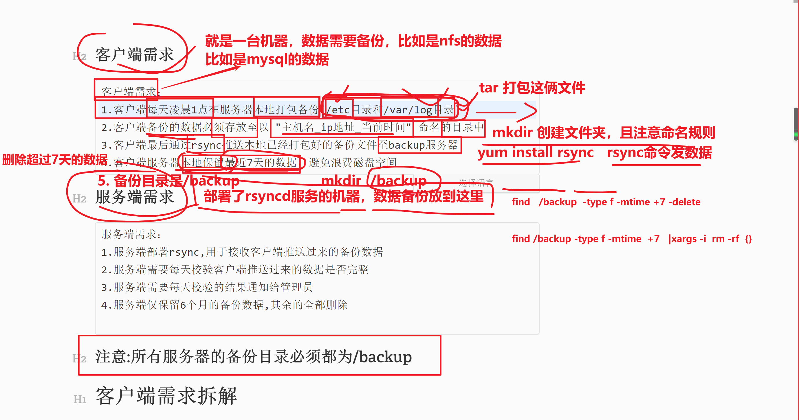
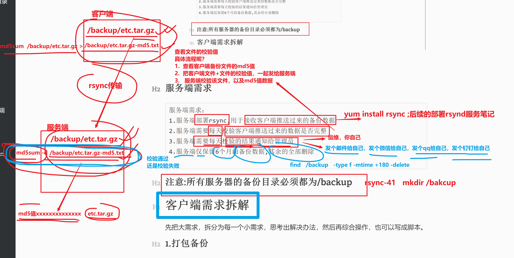
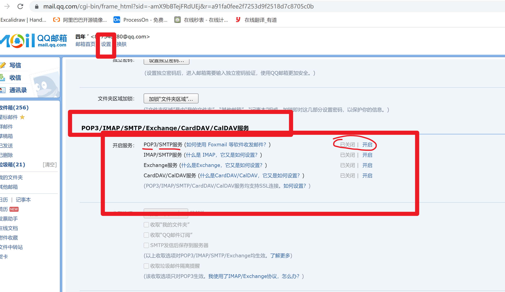

```### 此资源由 58学课资源站 收集整理 ###
	想要获取完整课件资料 请访问：58xueke.com
	百万资源 畅享学习

```
# 06-备份任务实战

今天的任务主要以实际备份任务入手，完成综合练习，完成对rsync的综合运用。

- 先看需求
- 再讲解
- 再次动手实践


## 客户端需求

```
客户端需求：
1.客户端每天凌晨1点在服务器本地打包备份(/etc目录和/var/log目录) 
2.客户端备份的数据必须存放至以 "主机名_ip地址_当前时间" 命名的目录中 
3.客户端最后通过rsync推送本地已经打包好的备份文件至backup服务器 
4.客户端服务器本地保留最近7天的数据，避免浪费磁盘空间
```




## 服务端需求

```
服务端需求：
1.服务端部署rsync,用于接收客户端推送过来的备份数据 
2.服务端需要每天校验客户端推送过来的数据是否完整 
3.服务端需要每天校验的结果通知给管理员 
4.服务端仅保留6个月的备份数据,其余的全部删除 

```




## 注意:所有服务器的备份目录必须都为/momo


# 客户端需求拆解

先把大需求，拆分为每一个小需求，思考出解决办法，然后再综合操作，也可以写成脚本。

```
最后定时任务，可以执行该脚本，完成这一系列的需求要求的操作

```


## 1.打包备份

客户端每天凌晨1点在服务器本地打包备份(/etc目录和/var/log目录)

以后见到需求，某任务，要写入定时任务

- 把其他所有的事全搞定了，最后再去写入定时任务

  

```
- 注意tar命令打包，尽量以相对路径去打包
- /etc目录是为了备份系统配置文件、应用配置文件
- /var/log是为了备份所有应用程序的日志


1.需求是创建/backup目录
mkdir -p /backup

/etc
/var/log


[root@nfs-31 /]#cd / && tar -zcf /backup/etc.tgz  etc
[root@nfs-31 /]#cd / && tar -zcf /backup/log.tgz  var/log

[root@nfs-31 /]#ls /backup/ -lh
total 11M
-rw-r--r-- 1 root root 9.4M Apr 21 12:03 etc.tgz
-rw-r--r-- 1 root root 698K Apr 21 12:04 log.tgz


```

## 2.文件夹命名要求

2.客户端备份的数据必须存放至以`"主机名_ip地址_当前时间"`命名的目录中

期望的结果是，如`nfs-31_10.0.0.31_2022-04-19`

```
1.提取主机名
$(hostname)
`hostname`

2.提取ip地址

$(ifconfig eth0 | awk 'NR==2{print $2}')

3.时间设置
$(date "+%F")


4.拼接在一起，文件夹命名的命令如下
mkdir -p /backup/$(hostname)_$(ifconfig eth0 | awk 'NR==2{print $2}')_$(date "+%F")


5.创建文件夹，你也可以用内网ip操作
要求，在备份目录下，创建以格式要求的文件夹

mkdir -p /backup/$(hostname)_$(ifconfig eth0 | awk 'NR==2{print $2}')_$(date "+%F")

6.检查最终的客户端备份目录

ls /backup

7.备份的etc和log数据，得在这个目录中
[root@nfs-31 /]#cd / && tar -zcf /backup/$(hostname)_$(ifconfig eth0 | awk 'NR==2{print $2}')_$(date "+%F")/etc.tgz  etc


[root@nfs-31 /]#cd / && tar -zcf /backup/$(hostname)_$(ifconfig eth0 | awk 'NR==2{print $2}')_$(date "+%F")/log.tgz  var/log


```

## 3.文件传输

3.客户端最后通过rsync命令推送本地已经打包好的备份文件至rsyncd服务器

```
需求，把/backup目录下的数据，发给备份服务器
# 去看rsync服务端提供的账户密码

# 客户端还得添加密码
# export RSYNC_PASSWORD=momo666


rsync  -avzP   /backup/     momo01@10.0.0.41::momo_data


```

## 4.删除过期文件

4.客户端服务器本地保留最近7天的数据，避免浪费磁盘空间

```
find  /backup  -type f -mtime +7 -delete
```

## 5.整合脚本

吧客户端的所有部署操作，写成脚本，待会交给定时任务执行即可


把上述拆解的过程，写成一个脚本、批量执行。

当然这个脚本还可以有多的优化。

```
#!/bin/bash

# 主动在脚本中，定义path变量，防止命令无法执行
PATH=/usr/local/sbin:/usr/local/bin:/usr/sbin:/usr/bin:/root/bin

# 1.创建目录，注意目录名字规则
mkdir -p /backup/$(hostname)_$(ifconfig eth0 | awk 'NR==2{print $2}')_$(date "+%F")

# 2.打包备份数据
cd / && tar -zcf /backup/$(hostname)_$(ifconfig eth0 | awk 'NR==2{print $2}')_$(date "+%F")/etc.tgz  etc

cd / && tar -zcf /backup/$(hostname)_$(ifconfig eth0 | awk 'NR==2{print $2}')_$(date "+%F")/log.tgz  var/log


# 2.1 对数据进行校验，生成校验值的文件
[root@nfs-31 ~]#md5sum /backup/$(hostname)_$(ifconfig eth0 | awk 'NR==2{print $2}')_$(date "+%F")/*.tgz > /backup/$(hostname)_$(ifconfig eth0 | awk 'NR==2{print $2}')_$(date "+%F")/all_data_md5.txt


# 3.传输客户端备份数据到，rsync备份服务器上，别忘记是如何验证密码的
export RSYNC_PASSWORD=momo666
rsync  -avzP   /backup/     momo01@10.0.0.41::momo_data


# 4.删除过期文件
find  /backup  -type f -mtime +7 -delete


```

## 6.调试脚本

只显示执行过程，而不会真的执行，发生修改，用于调试程序 -x参数

shell提供了-x参数，能让你看到脚本执行过程，用于调试脚本，不会真的产生数据变动，只会看到执行的过程日志

```
bash -x my_rsync.sh
```

## 7.定时任务

```
1.确保crond是否运行
systemctl status crond

2.写定时任务语句
crontab -e 

* *  * * * /bin/bash /my_rsync.sh 

3.定时任务，最后再去执行


```


# 服务端需求拆解

## 1.脚本化部署rsyncd服务端

1.服务端部署rsyncd服务用于接收客户端推送过来的备份数据

```
配置rsyncd服务端的的全流程，也可以写成脚本，一键安装了

# 1.安装rsync服务
yum install rsync -y

# 2.写配置文件
cat > /etc/rsyncd.conf <<EOF
uid = www 
gid = www 
port = 873
fake super = yes
use chroot = no
max connections = 200
timeout = 600
ignore errors
read only = false
list = false
auth users = momo01
secrets file = /etc/rsync.momo 
log file = /var/log/rsyncd.log
#####################################
[momo_data]
comment = yuchaoit.cn about rsync
path = /momo/

[momo_data2]
comment = this is secord backup dir,to website data..
path = /momo2

EOF

# 3.创建配置文件定义的信息
mkdir -p /{momo,momo2}
chown -R www.www  /momo
chown -R www.www  /momo2

touch /etc/rsync.momo 
chmod 600 /etc/rsync.momo 

# 4.创建用于连接的账户密码
echo "momo01:momo666" > /etc/rsync.momo 


# 5. 重启服务
systemctl restart rsyncd


```

### 1.1 修改服务端的rsync安装为脚本

```
install_rsync.sh

#!/bin/bash
# 1.安装rsync服务
yum install rsync -y

# 2.写配置文件
cat > /etc/rsyncd.conf <<EOF
uid = www 
gid = www 
port = 873
fake super = yes
use chroot = no
max connections = 200
timeout = 600
ignore errors
read only = false
list = false
auth users = momo01
secrets file = /etc/rsync.momo 
log file = /var/log/rsyncd.log
#####################################
[momo_data]
comment = yuchaoit.cn about rsync
path = /momo/

[momo_data2]
comment = this is secord backup dir,to website data..
path = /momo2

EOF

# 3.创建配置文件定义的信息
mkdir -p /{momo,momo2}
chown -R www.www  /momo
chown -R www.www  /momo2

touch /etc/rsync.momo 
chmod 600 /etc/rsync.momo 

# 4.创建用于连接的账户密码
echo "momo01:momo666" > /etc/rsync.momo 


# 5. 重启服务
systemctl restart rsyncd


```

给脚本添加执行权限

```
chmod u+x install_rsync.sh

./install_rsync.sh

```


## 2.校验数据完整性

2.服务端需要每天校验客户端推送过来的数据是否完整

```
客户端先生成校验信息,回头改脚本
```


此时在rsync服务端，可以通过md5sum命令校验文件完整性

```

```

## 3.邮件通知

让脚本执行的结果，告诉运维，它正确的执行了，数据备份也是没问题的

如果有问题，运维看到邮件也会立即去处理了

运维在公司里，每天第一件事就打开邮箱，看看其他组的同事是否发来的故障邮件，然后根据邮件解决问题，回复邮件。


3.服务端需要每天校验的结果通知给管理员

这里你就照抄就好，固定步骤而已，更换为你自己的qq邮箱即可

然后需要打开qq邮箱的smtp服务器的授权码，自己去获取

注意授权码别泄露给别人




```
#1.安装配置mailx：
yum install mailx -y

#2.邮箱配置文件，给你的自己的信息
利用的邮箱的smtp协议，需要打开你的qq，163邮箱的smtp功能即可
如下的信息，改为你自己的即可
邮箱的授权码，需要自己去获取


cat > /etc/mail.rc << 'EOF' 
set from=877348180@qq.com
set smtp=smtps://smtp.qq.com:465
set smtp-auth-user=877348180@qq.com
set smtp-auth-password=irmmuvbeibwxbbee
set smtp-auth=login
set ssl-verify=ignore
set nss-config-dir=/etc/pki/nssdb/
EOF


#3.服务端生成备份数据的校验结果文件，吧这些信息发个邮件发给运维的邮箱
md5sum -c /momo/nfs-31_10.0.0.31_2022-04-21/all_data_md5.txt  > /momo/nfs-31_10.0.0.31_2022-04-21/check_md5_result.txt


md5sum -


#4.校验发送命令，把校验结果，发给于超老师的qq邮箱
# 语法 mail -s "邮件主题" 邮箱 < 邮件正文


mail -s "0224-check-rsync-$(date +%F)" 877348180@qq.com < /momo/nfs-31_10.0.0.31_2022-04-21/check_md5_result.txt
```


## 4.过期文件删除

4.服务端仅保留6个月的备份数据,其余的全部删除

```
find /momo -type f -mtime +180 -delete
```

## 5.汇总脚本（服务端、客户端）

为什么要制作为脚本，因为要交给定时任务，统一执行这一系列的备份步骤。

### 5.1 客户端脚本

```
#!/bin/bash

#1.创建客户端备份数据的目录

#2.打包备份etc配置文件，var/log 日志目录

#3.生成校验文件，确保备份的数据完整性

#4.传输到备份服务器

#5.删除过期文件

```

### 5.2 服务端脚本

```
#!/bin/bash 
#1.校验数据完整性

#2.发送邮件

#3.删除过期文件

```

## 6.定时任务

服务端要求是每天校验

```

```

客户端是每天凌晨一点

```

```

测试脚本，服务端、客户端的脚本，改为每分钟试一下，也可以直接运行该脚本，查看结果。

```
* * * * *
```

注意测试顺序是

- 先客户端
- 再服务端

# 学习作业

1.理解任务需求

2.拆解任务需求、一步步思考，应该如何敲命令

3.整合所有操作，写成shell脚本

4.完成最终正确的备份、定时任务效果，确保正确性。

> 于超老师的笔记作为参考，自己可以尝试先自己写，最后不懂了再来看笔记

# 遇见问题，解决问题

一帆风顺，不如遇见坑，来的更nb

## 客户端的调整操作


```
[root@nfs-31 ~]## 决定修改客户端的备份数据目录 得修改脚本吧
[root@nfs-31 ~]#
[root@nfs-31 ~]#sed -i 's#backup#momo#g'  /my_rsync.sh 

执行脚本，看是否正确

[root@nfs-31 ~]#bash /my_rsync.sh 
sending incremental file list
./
nfs-31_10.0.0.31_2022-04-21/
nfs-31_10.0.0.31_2022-04-21/all_data_md5.txt
            152 100%    0.00kB/s    0:00:00 (xfr#1, to-chk=2/5)
nfs-31_10.0.0.31_2022-04-21/etc.tgz
      9,805,421 100%   33.76MB/s    0:00:00 (xfr#2, to-chk=1/5)
nfs-31_10.0.0.31_2022-04-21/log.tgz
        719,702 100%    2.30MB/s    0:00:00 (xfr#3, to-chk=0/5)

sent 10,255,231 bytes  received 92 bytes  6,836,882.00 bytes/sec
total size is 10,525,275  speedup is 1.03

```

## 服务端调试

```
数据校验
[root@rsync-41 ~]#md5sum -c /momo/nfs-31_10.0.0.31_2022-04-21/all_data_md5.txt 
/momo/nfs-31_10.0.0.31_2022-04-21/etc.tgz: OK
/momo/nfs-31_10.0.0.31_2022-04-21/log.tgz: OK


```


# 整合服务端，客户端的脚本，写入定时任务

注意先后顺序

先客户端

再服务端


## 客户端

```
每分钟，执行脚本，进行数据备份，传输给rsync服务器

* * * * *  /bash /my_rsync.sh
```


# 服务端

```
[root@rsync-41 ~]#cat my_rsync_server.sh 
#!/bin/bash
# 1. 对备份的数据校验，生成校验文件
md5sum -c /momo/nfs-31_10.0.0.31_$(date "+%F")/all_data_md5.txt  > /momo/nfs-31_10.0.0.31_$(date "+%F")/check_md5_result.txt

# 2.发邮件
mail -s "0224-check-rsync-$(date +%F)" 877348180@qq.com < /momo/nfs-31_10.0.0.31_$(date "+%F")/check_md5_result.txt

#3.删除旧资料
find /momo -type f -mtime +180 -delete


```


写入定时任务

```
* * * * * /bin/bash  /root/my_rsync_server.sh
```

# 总结

- 捋清楚这个业务需求
- 自己手动、独立的，不要看任何笔记，不要去抄笔记，你记不住的
- 你自己手动的完成这个需求，不要求操作和一模一样，能确保结果即可

```
1.客户端能备份数据，生成MD5校验，能发给rsync服务端
2.服务端能接受到客户端的数据，且能对数据进行MD5校验，以及导出校验结果，以及给你的邮箱，发送这个校验结果

下课
3点回来学习

```


