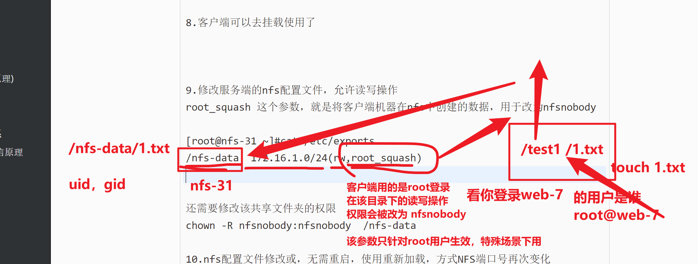

```### 此资源由 58学课资源站 收集整理 ###
	想要获取完整课件资料 请访问：58xueke.com
	百万资源 畅享学习

```
# nfs前言


# NFS在企业的应用架构


# 企业生产集群为什么需要共享存储


# 任务：用NFS完成网站共享存储


# 什么是共享存储

```
network file system 网络文件系统

NFS主要使用在局域网下，让不同的主机之间可以共享文件、或者目录数据

主要用于linux系统上实现文件共享的一种协议，其客户端主要是Linux


没有用户认证机制，且数据在网络上传送的时候是明文传送，一般只能在局域网中使用


不需要输入账号密码，在配置文件中，定义好可访问该NFS的机器，ip地址即可
还得借助其他用户认证的插件，结合NFS，提高安全性


支持多节点同时挂载及并发写入


```


# 什么是NFS


# NFS工作应用


# NFS服务架构(NFS原理)


# 什么是RPC

```
远程过程调用，相对应的就是，本地过程调用。
rpc一般是开发中的网络编程知识

1.于超老师本地写好了一个代码文件，如hello-world.py ，本地运行该程序，这就是本地过程调用（执行程序，拿到结果）


2.远程过程调用
于超老师在将代码文件放在远程服务器上，在自己笔记本上，远程调用、执行该代码文件，执行结果会通过网络把数据发回来，这就是远程过程调用
```


---


# NFS和RPC关系


# RPC和ansible的联系


# NFS结合rpcbind通信原理


原理文字描述


```
1.NFS服务端启动后、将自己的端口信息，注册到rpcbind服务中
2.NFS客户端通过TCP/IP的方式，连接到NFS服务端提供的rpcbind服务，并且从该服务中获取具体的端口信息
3.NFS客户端拿到具体端口信息后，将自己需要执行的函数，通过网络发给NFS服务端对应的端口
4.NFS服务端接收到请求后，通过rpc.nfsd进程判断该客户端是否有权限连接
5.NFS服务端的rpc.mount进程判断客户端是否有对应的操作权限
6.最终NFS服务端会将客户端请求的函数，识别为本地可以执行的命令，传递给内核、最终内核驱动硬件

结论、nfs的客户端、服务端之间的通信基于rpc协议，且必须运行rpcbind服务
```


# rpcbind服务

该服务是用于，nfs启动后，将端口号，注册到这个rpcbind服务中


# 图解NFS工作原理


# nfs工作流程图原理


# NFS配置文件，语法


# 机器准备

```
nfs服务端   nfs-31


多个nfs客户端    web-7

最终完成效果

让web-7 可以读写 nfs共享的静态文件数据

```


# NFS服务端部署


配置文件语法介绍


nfs限定网站的写法参考表

nfs客户端地址说明

| 客户端地址         | 具体地址         | 说明                                                         |
| ------------------ | ---------------- | ------------------------------------------------------------ |
| 单一客户端         | 192.168.178.142  | 用的少                                                       |
| 整个网段           | 192.168.178.0/24 | 24表示子网掩码255.255.255.0，指定网段，用的较多192.168.178.1~ 192.168.178.254   张老三 192.168.178.54 |
| 授权域名客户端     | nfs.yuchaoit.cn  | 弃用                                                         |
| 授权整个域名客户端 | *.yuchaoit.cn    | 弃用                                                         |


```
默认配置文件路径是/etc/exports

exports配置文件语法

NFS共享目录  NFS客户端地址(参数1、参数2...) 客户点地址2（参数1、参数2...）

例如
/        hostname1(rw)  hostname2(rw,no_root_squash)
/pub   *(rw)
/home/chao   123.206.16.61(ro)

参数解释
1.NFS共享目录：为NFS服务器要共享的实际目录，必须绝对路径，注意目录的本地权限，如果要读写共享，要让本地目录可以被NFS客户端的(nfsnobody)读写

2.NFS客户端地址，也就是NFS服务器端授权可以访问共享目录的客户端地址，详见下表

3.权限参数，对授权的NFS客户端访问权限设置，见下表
```





```
1.准备好nfs服务端机器

2.安装nfs工具包
yum install nfs-utils rpcbind -y


3.修改配置文件，填写为你需要的共享参数即可
先学学该软件的配置文件语法，每一个软件的配置文件语法，可能都不相同

[root@nfs-31 ~]#cat /etc/exports

需要你填入如下配置，定义共享文件，以及限定访问的ip主机，以及共享的参数，权限设置

4. 设置一个共享 /nfs-data文件夹，运行172.16.1.0局域网内的用户可以访问，权限是只读

mkdir  /nfs-data

vim /etc/exports
这里需要添加参数，让挂载后的客户端，身份改为匿名用户，降低权限，以及设置对应的读写权限

/nfs-data  172.16.1.0/24(rw,sync,)


5.注意要先启动rpcbind服务
确保如下2个进程都运行，rpc服务才正常，如果想停止rpc服务，也是关闭这俩进程

rpcbind.service
rpcbind.socket


systemctl start rpcbind.service
systemctl start rpcbind.socket

[root@nfs-31 ~]#systemctl start rpcbind.service
[root@nfs-31 ~]#systemctl start rpcbind.socket
[root@nfs-31 ~]#


6.运行nfs服务 ，每次重启nfs，nfs端口号，不断变化中
systemctl start nfs


7.检查nfs共享的情况
[root@nfs-31 ~]#showmount -e 172.16.1.31
Export list for 172.16.1.31:
/nfs-data 172.16.1.0/24

创建测试数据


8.客户端可以去挂载使用了


9.修改服务端的nfs配置文件，允许读写操作
root_squash 这个参数，就是将客户端机器在nfs中创建的数据，用于改为nfsnobody

[root@nfs-31 ~]#cat /etc/exports
/nfs-data  172.16.1.0/24(rw,root_squash)


还需要修改该共享文件夹的权限
chown -R nfsnobody:nfsnobody  /nfs-data

10.nfs配置文件修改或，无需重启，使用重新加载，方式NFS端口号再次变化
方法1
systemctl reload  nfs

方法2，更新nfs的配置文件设置
[root@nfs-31 ~]#exportfs -r


```

## 关于nfs挂载参数所有解释

```
ro 只读
rw 读写
root_squash 当nfs客户端以root访问时，它的权限映射为NFS服务端的匿名用户，它的用户ID/GID会变成nfsnobody
no_root_squash 同上，但映射客户端的root为服务器的root，不安全，避免使用
all_squash 所有nfs客户端用户映射为匿名用户，生产常用参数，降低用户权限，增大安全性。
sync 数据同步写入到内存与硬盘，优点数据安全，缺点性能较差
async 数据写入到内存，再写入硬盘，效率高，但可能内存数据会丢


/etc/exports  man 5 exports

共享目录        共享选项
/nfs/share      *(ro,sync)

共享主机：
*   ：代表所有主机
192.168.0.0/24：代表共享给某个网段
192.168.0.0/24(rw) 192.168.1.0/24(ro) :代表共享给不同网段
192.168.0.254：共享给某个IP
*.yuchaoit.cn:代表共享给某个域下的所有主机

共享选项：
ro：只读，不常用
rw：读写
sync：实时同步，直接写入磁盘
async：异步，先缓存在内存再同步磁盘
anonuid：设置访问nfs服务的用户的uid，uid需要在/etc/passwd中存在
anongid：设置访问nfs服务的用户的gid
root_squash ：默认选项 root用户创建的文件的属主和属组都变成nfsnobody,其他人nfs-server端是它自己，client端是nobody。
no_root_squash：root用户创建的文件属主和属组还是root，其他人server端是它自己uid，client端是nobody。
all_squash： 不管是root还是其他普通用户创建的文件的属主和属组都是nfsnobody

说明：
请用如下的参数，即可，生产环境用这个

anonuid和anongid参数和all_squash一起使用。

all_squash表示不管是root还是其他普通用户从客户端所创建的文件在服务器端的拥有者和所属组都是nfsnobody；服务端为了对文件做相应管理，可以设置anonuid和anongid进而指定文件的拥有者和所属组


```


# NFS客户端部署

```
1.查看机器的挂载情况
mount -l

2. 查看磁盘分区挂载情况
df -h


3.挂载nfs，查看nfs

[root@web-7 ~]#
[root@web-7 ~]#mount -t nfs  172.16.1.31:/nfs-data  /test-nfs
[root@web-7 ~]#
[root@web-7 ~]#
[root@web-7 ~]#df -h

4.尝试读写数据
ls /test-nfs

touch /test-nfs/hello.log  # 发现没有权限


5.更新nfs服务端的读写权限后，再次测试数据操作


[root@web-7 ~]#
[root@web-7 ~]#touch /test-nfs/可以了吗
[root@web-7 ~]#
[root@web-7 ~]#ll /test-nfs/ 
total 0
-rw-r--r-- 1 nfsnobody nfsnobody 0 Apr 22 10:58 你好啊赛利亚
-rw-r--r-- 1 nfsnobody nfsnobody 0 Apr 22 11:12 可以了吗
[root@web-7 ~]#
[root@web-7 ~]#
[root@web-7 ~]#echo "今天又是氪金的一天" >> /test-nfs/你好啊赛利亚 
[root@web-7 ~]#
[root@web-7 ~]#
[root@web-7 ~]#cat /test-nfs/你好啊赛利亚 
今天又是氪金的一天
[root@web-7 ~]#cat /test-nfs/你好啊赛利亚 
今天又是氪金的一天
冲他个十万吧 勇士


```


# NFS挂载参数


# 课间练习

```
要求使用机器
nfs-31        nfs服务端
web-7            nfs客户端
rsync-41     nfs客户端


三台机器

1.在nfs服务端创建两个共享目录，权限如下
/ops_data  权限是可读写
/dev_data  权限只读

2.通过两个nfs客户端挂载、读写测试
```


# NFS结合nginx实现共享存储

- 安装部署nfs服务端

- 生产环境下的参数rw,sync,all_squash,anonuid,anongid

````
rw,sync,


all_squash ,将web-7的任意用户root,bob01,，在该共享目录下的操作，全部改为nfsnobody以实现权限控制

web-7   /test-nfs   172.16.1.31:/nfs-data  

无论是root去读写 、/test-nfs
还是bob01读写 /test-nfs

创建的数据，都会被改为user，group都是 默认的nfsnobody


anonuid=id号


anongid=

集合这俩参数，就可以限制在 该nfs共享目录下的所有用户操作，统一被限制为了某个指定的用户


````


# 图解这个需求


```
任务需求
1.nginx的启动用户必须是www，uid是 1500，不允许登录

useradd  www -u 1500 -M -s /sbin/nologin

1.0 安装nginx
yum install nginx -y

1.1 修改nginx配置文件，指定是www用户运行
vim /etc/nginx/nginx.conf
修改如下
user www;


1.2 启动nginx
systemctl start nginx 

1.3 检查nginx进程
[root@web-7 ~]#ps -ef|grep nginx
root       5038      1  0 12:07 ?        00:00:00 nginx: master process /usr/sbin/nginx
www        5040   5038  0 12:07 ?        00:00:00 nginx: worker process


2.nfs共享存储用户也是www，uid是 1500，不允许登录，允许读写

修改nfs配置文件如下，限定客户端在该目录中的操作，权限都被转化为www用户

限制nginx机器才能访问

[root@nfs-31 ~]#mkdir /nfs-nginx
[root@nfs-31 ~]#useradd  www -u 1500 -M -s /sbin/nologin

修改配置文件
[root@nfs-31 ~]#cat /etc/exports
/nfs-data *(rw,all_squash)


/nfs-nginx     172.16.1.7(rw,sync,all_squash,anonuid=1500,anongid=1500)

3.重新加载nfs（reload是针对已经有进程在运行了，重新读取配置文件）
你是新安装的机器nfs，还能reload吗？

systemctl reload nfs

4.修改共享目录的属主、属组为www
[root@nfs-31 /nfs-nginx]#chown -R www.www /nfs-nginx/
[root@nfs-31 /nfs-nginx]#ll -d /nfs-nginx/
drwxr-xr-x 2 www www 6 Apr 22 12:09 /nfs-nginx/


3.nginx网站可以正常读写共享存储资料
先挂载nfs
mount -t nfs 172.16.1.31:/nfs-nginx /usr/share/nginx/html/

[root@web-7 ~]#df -h |grep nginx
172.16.1.31:/nfs-nginx    17G  1.6G   16G  10% /usr/share/nginx/html


客户端生成网页，和图片等静态资源，查看是否写入到NFS服务端
[root@web-7 ~]#vim /usr/share/nginx/html/index.html


模拟用普通用户，到该nginx目录下，生成一个数据图片
[client01@web-7 /usr/share/nginx/html]$wget -O  /usr/share/nginx/html/liyunlong.jpg  https://inews.gtimg.com/newsapp_bt/0/8823765779/1000

4.修改nginx网页，加载该用户自己创建的图片信息吗
[client01@web-7 /usr/share/nginx/html]$cat index.html 
<meta charset=utf-8>
把我李云龙的意大利炮拿来


5.模拟用户访问该nginx网站
http://10.0.0.7/


```


# NFS故障案例

1.客户端未挂载NFS

```
[root@web-7 ~]#
[root@web-7 ~]#umount /usr/share/nginx/html
[root@web-7 ~]#


重新挂载
mount -t nfs 172.16.1.31:/nfs-nginx /usr/share/nginx/html/

```

2.服务端出问题，。nfs挂了

导致nginx页面卡死，nginx网页目录操作也都卡死

此时明确了共享存储出问题了

去共享存储NFS服务器上找原因

```
发现nfs挂了，重启即可
systemctl restart nfs
```

3.nfs修复后，客户端的挂载可以恢复


4.如果真的nfs死机了，且暂时无法恢复，你还得快速恢复网站的业务，可以强制取消挂载

```
使用强制卸载参数
，先看看挂载了什么

mount -l |grep nfs

umount -fl 挂载点  # 取消挂载即可

然后最终还是要以恢复NFS为主

```


