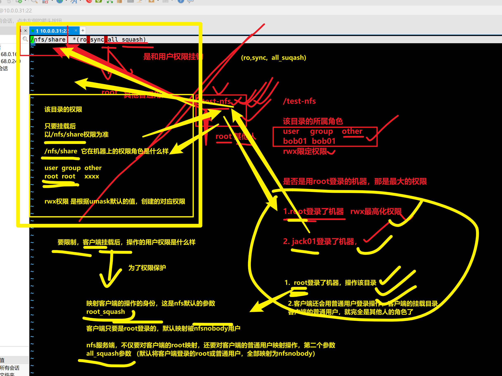
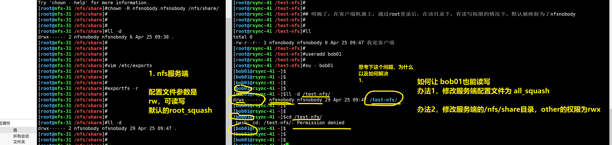
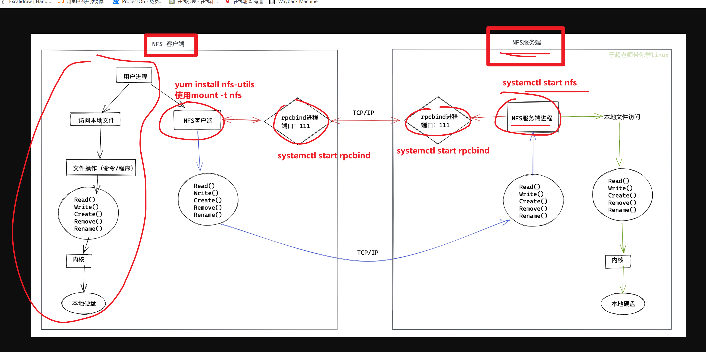
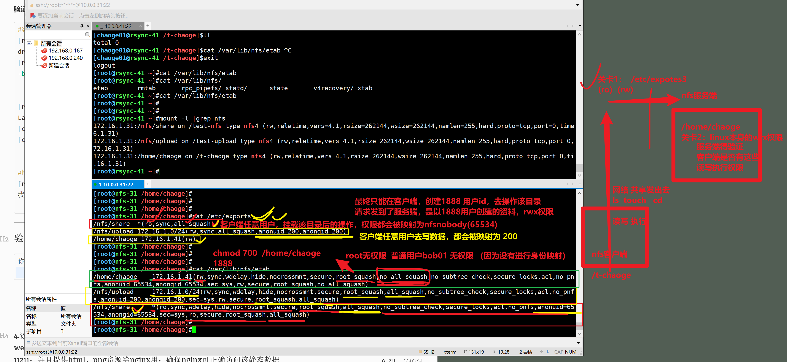

```### 此资源由 58学课资源站 收集整理 ###
	想要获取完整课件资料 请访问：58xueke.com
	百万资源 畅享学习

```
## 正则练习题

#### 1.如何删除系统中所有自建的user？

```
/etc/passwd

userdel -rf 


自建，通过root执行useradd创建的用户，默认的用户，uid是从1000开始的

useradd 

梳理做题的思路

找出uid大于1000的用户名，然后删除


```


**awk实现**

```bash
[root@template-linux01 ~]#cat /etc/passwd
root:x:0:0:root:/root:/bin/bash
bin:x:1:1:bin:/bin:/sbin/nologin
daemon:x:2:2:daemon:/sbin:/sbin/nologin
adm:x:3:4:adm:/var/adm:/sbin/nologin
lp:x:4:7:lp:/var/spool/lpd:/sbin/nologin
sync:x:5:0:sync:/sbin:/bin/sync
shutdown:x:6:0:shutdown:/sbin:/sbin/shutdown
halt:x:7:0:halt:/sbin:/sbin/halt
mail:x:8:12:mail:/var/spool/mail:/sbin/nologin
operator:x:11:0:operator:/root:/sbin/nologin
games:x:12:100:games:/usr/games:/sbin/nologin
ftp:x:14:50:FTP User:/var/ftp:/sbin/nologin
nobody:x:99:99:Nobody:/:/sbin/nologin
systemd-network:x:192:192:systemd Network Management:/:/sbin/nologin
dbus:x:81:81:System message bus:/:/sbin/nologin
polkitd:x:999:998:User for polkitd:/:/sbin/nologin
sshd:x:74:74:Privilege-separated SSH:/var/empty/sshd:/sbin/nologin
postfix:x:89:89::/var/spool/postfix:/sbin/nologin
ntp:x:38:38::/etc/ntp:/sbin/nologin
ysl01:x:1000:1000::/home/ysl01:/bin/bash
ysl02:x:1001:1001::/home/ysl02:/bin/bash
ysl03:x:1002:1002::/home/ysl03:/bin/bash
ysl04:x:1003:1003::/home/ysl04:/bin/bash
ysl05:x:1004:1004::/home/ysl05:/bin/bash
ysl06:x:2222:2222::/home/ysl06:/bin/bash


[root@template-linux01 ~]#awk -v FS=':' '$3>=1000{print $1}'  /etc/passwd
ysl01
ysl02
ysl03
ysl04
ysl05
ysl06


[root@template-linux01 ~]#awk -v FS=':' '$3>=1000{print $1}'  /etc/passwd |xargs -i userdel {} 


[root@template-linux01 ~]#cat /etc/passwd
root:x:0:0:root:/root:/bin/bash
bin:x:1:1:bin:/bin:/sbin/nologin
daemon:x:2:2:daemon:/sbin:/sbin/nologin
adm:x:3:4:adm:/var/adm:/sbin/nologin
lp:x:4:7:lp:/var/spool/lpd:/sbin/nologin
sync:x:5:0:sync:/sbin:/bin/sync
shutdown:x:6:0:shutdown:/sbin:/sbin/shutdown
halt:x:7:0:halt:/sbin:/sbin/halt
mail:x:8:12:mail:/var/spool/mail:/sbin/nologin
operator:x:11:0:operator:/root:/sbin/nologin
games:x:12:100:games:/usr/games:/sbin/nologin
ftp:x:14:50:FTP User:/var/ftp:/sbin/nologin
nobody:x:99:99:Nobody:/:/sbin/nologin
systemd-network:x:192:192:systemd Network Management:/:/sbin/nologin
dbus:x:81:81:System message bus:/:/sbin/nologin
polkitd:x:999:998:User for polkitd:/:/sbin/nologin
sshd:x:74:74:Privilege-separated SSH:/var/empty/sshd:/sbin/nologin
postfix:x:89:89::/var/spool/postfix:/sbin/nologin
ntp:x:38:38::/etc/ntp:/sbin/nologin

```

**grep实现**

```bash
[root@template-linux01 ~]#cat /etc/passwd
root:x:0:0:root:/root:/bin/bash
bin:x:1:1:bin:/bin:/sbin/nologin
daemon:x:2:2:daemon:/sbin:/sbin/nologin
adm:x:3:4:adm:/var/adm:/sbin/nologin
lp:x:4:7:lp:/var/spool/lpd:/sbin/nologin
sync:x:5:0:sync:/sbin:/bin/sync
shutdown:x:6:0:shutdown:/sbin:/sbin/shutdown
halt:x:7:0:halt:/sbin:/sbin/halt
mail:x:8:12:mail:/var/spool/mail:/sbin/nologin
operator:x:11:0:operator:/root:/sbin/nologin
games:x:12:100:games:/usr/games:/sbin/nologin
ftp:x:14:50:FTP User:/var/ftp:/sbin/nologin
nobody:x:99:99:Nobody:/:/sbin/nologin
systemd-network:x:192:192:systemd Network Management:/:/sbin/nologin
dbus:x:81:81:System message bus:/:/sbin/nologin
polkitd:x:999:998:User for polkitd:/:/sbin/nologin
sshd:x:74:74:Privilege-separated SSH:/var/empty/sshd:/sbin/nologin
postfix:x:89:89::/var/spool/postfix:/sbin/nologin
ntp:x:38:38::/etc/ntp:/sbin/nologin
ysl01:x:1000:1000::/home/ysl01:/bin/bash
ysl02:x:1001:1001::/home/ysl02:/bin/bash
ysl03:x:1002:1002::/home/ysl03:/bin/bash
ysl04:x:1003:1003::/home/ysl04:/bin/bash
ysl05:x:1004:1004::/home/ysl05:/bin/bash


[root@template-linux01 ~]#grep -E '[0-9]{4,}' /etc/passwd
ysl01:x:1000:1000::/home/ysl01:/bin/bash
ysl02:x:1001:1001::/home/ysl02:/bin/bash
ysl03:x:1002:1002::/home/ysl03:/bin/bash
ysl04:x:1003:1003::/home/ysl04:/bin/bash
ysl05:x:1004:1004::/home/ysl05:/bin/bash


[root@template-linux01 ~]#grep -E '[0-9]{4,}' /etc/passwd|grep -E '^[a-Z0-9]+' -o
ysl01
ysl02
ysl03
ysl04
ysl05


[root@template-linux01 ~]#grep -E '[0-9]{4,}' /etc/passwd|grep -E '^[a-Z0-9]+' -o|xargs -i userdel -rf {}


[root@template-linux01 ~]#cat /etc/passwd
root:x:0:0:root:/root:/bin/bash
bin:x:1:1:bin:/bin:/sbin/nologin
daemon:x:2:2:daemon:/sbin:/sbin/nologin
adm:x:3:4:adm:/var/adm:/sbin/nologin
lp:x:4:7:lp:/var/spool/lpd:/sbin/nologin
sync:x:5:0:sync:/sbin:/bin/sync
shutdown:x:6:0:shutdown:/sbin:/sbin/shutdown
halt:x:7:0:halt:/sbin:/sbin/halt
mail:x:8:12:mail:/var/spool/mail:/sbin/nologin
operator:x:11:0:operator:/root:/sbin/nologin
games:x:12:100:games:/usr/games:/sbin/nologin
ftp:x:14:50:FTP User:/var/ftp:/sbin/nologin
nobody:x:99:99:Nobody:/:/sbin/nologin
systemd-network:x:192:192:systemd Network Management:/:/sbin/nologin
dbus:x:81:81:System message bus:/:/sbin/nologin
polkitd:x:999:998:User for polkitd:/:/sbin/nologin
sshd:x:74:74:Privilege-separated SSH:/var/empty/sshd:/sbin/nologin
postfix:x:89:89::/var/spool/postfix:/sbin/nologin
ntp:x:38:38::/etc/ntp:/sbin/nologin

```


**sed方法展示在下一题**


#### 2.如何删除系统中所有自建的group?

```
/etc/group

过滤，其他正则方案提取出你需要的group名，然后groupdel删除


```


**sed实现**

```bash
[root@template-linux01 ~]#cat /etc/group
root:x:0:
bin:x:1:
daemon:x:2:
sys:x:3:
adm:x:4:
tty:x:5:
disk:x:6:
lp:x:7:
mem:x:8:
kmem:x:9:
wheel:x:10:
cdrom:x:11:
mail:x:12:postfix
man:x:15:
dialout:x:18:
floppy:x:19:
games:x:20:
tape:x:33:
video:x:39:
ftp:x:50:
lock:x:54:
audio:x:63:
nobody:x:99:
users:x:100:
utmp:x:22:
utempter:x:35:
input:x:999:
systemd-journal:x:190:
systemd-network:x:192:
dbus:x:81:
polkitd:x:998:
ssh_keys:x:997:
sshd:x:74:
postdrop:x:90:
postfix:x:89:
ntp:x:38:
ysl01:x:1000:
ysl02:x:1001:
ysl03:x:1002:


[root@template-linux01 ~]#sed -r -n 's#(.*):x:([0-9]{4,}).*#\1#p' /etc/group
ysl01
ysl02
ysl03


[root@template-linux01 ~]#sed -r -n 's#(.*):x:([0-9]{4,}).*#\1#p' /etc/group|xargs -i groupdel {}
[root@template-linux01 ~]#cat /etc/group
root:x:0:
bin:x:1:
daemon:x:2:
sys:x:3:
adm:x:4:
tty:x:5:
disk:x:6:
lp:x:7:
mem:x:8:
kmem:x:9:
wheel:x:10:
cdrom:x:11:
mail:x:12:postfix
man:x:15:
dialout:x:18:
floppy:x:19:
games:x:20:
tape:x:33:
video:x:39:
ftp:x:50:
lock:x:54:
audio:x:63:
nobody:x:99:
users:x:100:
utmp:x:22:
utempter:x:35:
input:x:999:
systemd-journal:x:190:
systemd-network:x:192:
dbus:x:81:
polkitd:x:998:
ssh_keys:x:997:
sshd:x:74:
postdrop:x:90:
postfix:x:89:
ntp:x:38:

```


## NFS练习题

#### 1.开放/nfs/share目录，提供给     任意用户    只读（/etc/exports  ro）        查询

```
1.任意客户端
2.任意的用户


```


**服务端**

showmout   

exportfs

systemctl start nfs


修改了nfs配置文件，需要重启什么吗？

```
修改了nfs配置文件，只需要让nfs重新读取该配置文件即可，你都不需要重新，因为你已重启，nfs工作端口又变了，导致所有客户端全部得重新连接

systemctl reload nfs

systemctl restart nfs

rpcinfo -p # 这个命令，查看nfs每次更新后的端口，是哪些在变化


```


rpcbind（记录nfs启动后的一个工作端口，nfs客户端首先会和rpcbind通信，获取该端口，然后再基于该端口，和nfs服务端通信）







### 关于nfs权限的小结

```
1. 重点在nfs服务端的 /etc/exportfs文件，里面定义的 rw，还是ro，以及root_squash，还是all_squash，以及不要给共享目录最高权限，一般不给other权限，都是对用户身份进行映射，
以及除了默认的nfsnobody用户，还可以指定映射为某个用户

2.还要看你客户端登录的用户是谁，是root，还是其他普通用户


```


```bash
#安装nfs与rpc
[root@nfs-31 ~]#yum install nfs-utils rpcbind -y
```

```bash
#按要求编辑nfs配置文件

# 关于nfs的权限
#第一道关卡 是 配置文件中的 rw，还是ro
# 第二道关卡，是该共享文件夹的权限，是否有rwx


[root@nfs-31 ~]#cat /etc/exports
/nfs/share  *(ro,sync,all_squash)


1.任意客户端
2.任意的用户

```

```bash
#创建目录，启动程序
[root@nfs-31 ~]#mkdir -p /nfs/share

[root@nfs-31 ~]#systemctl start rpcbind.service
[root@nfs-31 ~]#systemctl start rpcbind.socket

[root@nfs-31 ~]#systemctl start nfs


[root@nfs-31 ~]#showmount -e 172.16.1.31
Export list for 172.16.1.31:
/nfs/share *


1.任意客户端
2.任意的用户

```

**客户端**




```bash
#安装nfs与rpc
略
[root@rsync-41 ~]#systemctl start rpcbind

```

```bash
#创建用于挂载的文件夹，进行挂载
[root@web-7 ~]#mkdir /nfs_share
[root@web-7 ~]#mount -t nfs 172.16.1.31:/nfs/share /nfs_share
[root@web-7 ~]#df -h
Filesystem               Size  Used Avail Use% Mounted on
/dev/mapper/centos-root   17G  1.6G   16G   9% /
devtmpfs                 476M     0  476M   0% /dev
tmpfs                    488M     0  488M   0% /dev/shm
tmpfs                    488M  7.7M  480M   2% /run
tmpfs                    488M     0  488M   0% /sys/fs/cgroup
/dev/sda1               1014M  130M  885M  13% /boot
tmpfs                     98M     0   98M   0% /run/user/0
172.16.1.31:/nfs/share    17G  1.6G   16G  10% /nfs_share

```

**只读效果展示**

```bash

# 服务端
1.创建测试数据

[root@web-7 ~]  touch  /nfs/share/t1.log


2.先修改文件夹权限为对应的映射用户
chown -R nfsnobody.nfsnobody   /nfs/share


#客户端

mkdir -p /test-nfs
mount -t nfs   172.16.1.31:/nfs/share     /test-nfs

最终客户端可操作的权限如下

1.进入该目录，创建的文件就会被转为nfsnobody
2.但是现在该目录，nfs限制的是只读，所以无法创建


```


---


#### 2.开放/nfs/upload目录，提供给172.16.1.0/24网段内的机器上传数据，并且要求限制上传数据映射为nfs-upload用户，uid和gid均为200

```
用到大量的用户权限管理
以及用户、用户组的 权限设置，创建，uid，gid的知识


```


**服务端**

```bash

[root@nfs-31 /nfs/share]#groupadd -g 200 nfs-upload
[root@nfs-31 /nfs/share]#useradd -u 200 -g 200 -M -s /sbin/nologin nfs-upload


[root@nfs-31 /nfs/share]#mkdir /nfs/upload
[root@nfs-31 /nfs/share]#chown -R nfs-upload.nfs-upload /nfs/upload

[root@nfs-31 /nfs/share]#ll -d /nfs/upload/
drwxr-xr-x 2 nfs-upload nfs-upload 6 Apr 22 17:34 /nfs/upload/


先准备好挂载的数据，最后在启动nfs


[root@nfs-31 /nfs/share]#vim /etc/exports
[root@nfs-31 /nfs/share]#cat /etc/exports
/nfs/upload 172.16.1.0/24(rw,sync,all_squash,anonuid=200,anongid=200)


[root@nfs-31 /nfs/upload]#exportfs -r


```

**客户端**

```bash
[root@web-7 ~]#mkdir /nfs_upload
[root@web-7 ~]#mount -t nfs 172.16.1.31:/nfs/upload /nfs_upload/

```

**结果展示**

```bash
#客户端操作
[root@web-7 ~]#touch /nfs_upload/我建一个文件


 

#服务端操作
[root@nfs-31 /nfs/share]#cd /nfs/upload/
[root@nfs-31 /nfs/upload]#ll 
total 0
-rw-r--r-- 1 nfs-upload nfs-upload 0 Apr 22 17:45 我建一个文件

```

---


#### 3.

#### 开放/home/chaoge目录仅共享给172.16.1.41这台机器（服务端）

```
/home/chaoge 172.16.1.41(rw,all_squash,anonuid=1888,anongid=1888)
```


#### 且只有chaoge01用户可以完全访问该目录（客户端）

```
限制客户端，只能通过chaoge01(1888)  用户，去读写该/home/chaoge目录，其他用户都没权限


```


## 梳理题意（题意修改）

```
1.chaoge01这个用户，属于只有服务端才有，然后配置文件中，添加身份映射参数，能实现，客户端所有操作，也都被映射为该chaoge01用户，因此获得权限

2.chaoge01（1888）用户，服务端，客户端都有，限制只有1888这个id，才能操作该目录，其他任何用户，都没权限（客户端，只有通过1888这个用户才有读写执行权限）
这个需求，必然得删除，服务端的身份映射参数

服务端
[root@nfs-31 /nfs/share]#cat /etc/exports
/nfs/share  *(ro,sync,all_squash)
/nfs/upload 172.16.1.0/24(rw,sync,all_squash,anonuid=200,anongid=200)
/home/chaoge 172.16.1.41(rw)
[root@nfs-31 /nfs/share]#
[root@nfs-31 /nfs/share]#ll /home/chaoge/ -d
drwx------ 2 chaoge01 chaoge01 36 Apr 25 10:40 /home/chaoge/


客户端
普通用户
bob01 没有任何权限


root用户
root用户也无任何权限


只能通过1888这个id去操作该目录（因为你服务端没做身份映射）
创建的用户名和服务端最好一致
useradd chaoge01 -u 1888 


```


```
分析题意

创建chaoge01用户，uid为 1888

useradd  chaoge01  -u 1888 -M -s /sbin/nologin


mkdir -p /home/chaoge

/etc/exportfs
/home/chaoge   172.16.1.41()


/home/chaoge
只能被chaoge01用户有完全的访问(rwx)的权限
/home/chaoge 

user        group          other
chaoge01    chaoge01       xxxxxxxxxxxxxxx
7            0             0


# 部署笔记
[root@nfs-31 /nfs/share]#mkdir -p /home/chaoge
[root@nfs-31 /nfs/share]#useradd  chaoge01  -u 1888 -M -s /sbin/nologin
[root@nfs-31 /nfs/share]#id chaoge01
uid=1888(chaoge01) gid=1888(chaoge01) groups=1888(chaoge01)

该权限
[root@nfs-31 /nfs/share]#chown -R chaoge01.chaoge01 /home/chaoge/
[root@nfs-31 /nfs/share]#
[root@nfs-31 /nfs/share]#
[root@nfs-31 /nfs/share]#chmod 700 /home/chaoge/
[root@nfs-31 /nfs/share]#
[root@nfs-31 /nfs/share]#
[root@nfs-31 /nfs/share]#ll -d /home/chaoge/
drwx------ 2 chaoge01 chaoge01 6 Apr 25 10:28 /home/chaoge/

修改配置文件

[root@nfs-31 /nfs/share]#
[root@nfs-31 /nfs/share]## 服务端要做什么事
[root@nfs-31 /nfs/share]#
[root@nfs-31 /nfs/share]## 得限制，在该共享目录下的用户，全被映射为1888的用户
[root@nfs-31 /nfs/share]#
[root@nfs-31 /nfs/share]#cat /etc/exports
/nfs/share  *(ro,sync,all_squash)
/nfs/upload 172.16.1.0/24(rw,sync,all_squash,anonuid=200,anongid=200)

/home/chaoge 172.16.1.41(rw,all_squash,anonuid=1888,anongid=1888)


# 客户端操作如下
[root@nfs-31 /nfs/share]## 回答，客户端，如何才能对/home/chaoge有读写执行权限
[root@nfs-31 /nfs/share]#
[root@nfs-31 /nfs/share]## 创建一样uid的用户 名字也叫chaoge01， 1888 chaoge01


1.root登录机器的操作，创建文件

2.普通用户登录机器，创建文件


```


**服务端**

```bash
[root@nfs-31 /nfs/upload]#vim /etc/exports
[root@nfs-31 /nfs/upload]#cat /etc/exports
/nfs/share *(ro,sync,all_squash)
/nfs/upload 172.16.1.0/24(rw,sync,all_squash,anonuid=200,anongid=200)
/home/chaoge 172.16.1.41(rw)

[root@nfs-31 /nfs/upload]#mkdir /home/chaoge
[root@nfs-31 /nfs/upload]#useradd -u 1001 chaoge01
[root@nfs-31 /nfs/upload]#chown -R chaoge01.chaoge01 /home/chaoge
[root@nfs-31 /nfs/upload]#chmod 700 /home/chaoge

[root@nfs-31 /nfs/upload]#exportfs -r

```

**客户端**

```bash
#安装nfs,rpcbind略

[root@rsync-41 ~]#systemctl start nfs
[root@rsync-41 ~]#systemctl start rpcbind

[root@rsync-41 ~]#useradd -u 1001 chaoge01
[root@rsync-41 ~]#cat /etc/passwd|tail -1
chaoge01:x:1001:1001::/home/chaoge01:/bin/bash

[root@rsync-41 ~]#mount -t nfs 172.16.1.31:/home/chaoge /nfs_chaoge/

```

**验证效果**

```bash
#客户端操作
[root@rsync-41 /]#ll -d /nfs_chaoge/
drwx------ 2 chaoge01 chaoge01 17 Apr 22 20:42 /nfs_chaoge/
[root@rsync-41 /]#cd /nfs_chaoge/
-bash: cd: /nfs_chaoge/: Permission denied


[root@rsync-41 /]#su - chaoge01
Last login: Fri Apr 22 20:41:57 CST 2022 on pts/0
[chaoge01@rsync-41 ~]$cd /nfs_chaoge/
[chaoge01@rsync-41 /nfs_chaoge]$touch 我是chaoge01


#服务端操作
[root@nfs-31 /nfs/upload]#ls /home/chaoge
我是chaoge01

```

---

## 验证



```
你不能去猜nfs服务端到底提供了什么样的文件共享权限，你得看到结果

```


#### 4.添加30G硬盘，给nfs服务端/nfs-nginx-data目录使用，且仅提供给主机名为web-7的机器使用，并且要求限制上传数据映射为www用户，uid、gid均为11211；并且提供html、png资源给nginx用；确保nginx可正确访问该静态数据

**服务端**

```
服务端的要求
1.30G新硬盘，格式化文件系统
[root@nfs-31 ~]#ls /dev/sd*
/dev/sda  /dev/sda1  /dev/sda2  /dev/sdb

直接对整个大硬盘不分区，直接格式化文件系统直接用
[root@nfs-31 ~]#mkfs.xfs /dev/sdb

本地挂载，使用该目录
mkdir -p /nfs-nginx-data
mount /dev/sdb  /nfs-nginx-data


2.创建/nfs-nginx-data目录


3.服务端得创建该用户 
useradd www -u 11211  -M -s /sbin/nologin


4. 前提 /etc/hosts中做好解析
[root@nfs-31 ~]#systemctl start nfs
[root@nfs-31 ~]#exportfs -r
[root@nfs-31 ~]#systemctl enable nfs
Created symlink from /etc/systemd/system/multi-user.target.wants/nfs-server.service to /usr/lib/systemd/system/nfs-server.service.


/etc/exports
/nfs-nginx-data   web-7(rw,all_squash,anonuid=11211,anongid=1121)

5.在该目录下创建数据，且授权给www用户
[root@nfs-31 /nfs-nginx-data]#cat index.html 
<meta charset=utf8>
hello nfs , 加油，奥力给


[root@nfs-31 /nfs-nginx-data]#ls
aoligei.gif  index.html
[root@nfs-31 /nfs-nginx-data]#chown -R www.www /nfs-nginx-data/


客户端
yum install nginx -y
systemctl start nginx


直接挂载即可，你所有的操作，都会被映射为服务端的www用户
[root@rsync-41 ~]#mount -t nfs  172.16.1.31:/nfs-nginx-data  /usr/share/nginx/html


```


```bash
[root@nfs-31 ~]#lsblk
NAME            MAJ:MIN RM  SIZE RO TYPE MOUNTPOINT
sda               8:0    0   20G  0 disk 
├─sda1            8:1    0    1G  0 part /boot
└─sda2            8:2    0   19G  0 part 
  ├─centos-root 253:0    0   17G  0 lvm  /
  └─centos-swap 253:1    0    2G  0 lvm  
sdb               8:16   0   30G  0 disk 
sr0              11:0    1  4.2G  0 rom  
[root@nfs-31 ~]#mkfs.xfs /dev/sdb
meta-data=/dev/sdb               isize=512    agcount=4, agsize=1966080 blks
         =                       sectsz=512   attr=2, projid32bit=1
         =                       crc=1        finobt=0, sparse=0
data     =                       bsize=4096   blocks=7864320, imaxpct=25
         =                       sunit=0      swidth=0 blks
naming   =version 2              bsize=4096   ascii-ci=0 ftype=1
log      =internal log           bsize=4096   blocks=3840, version=2
         =                       sectsz=512   sunit=0 blks, lazy-count=1
realtime =none                   extsz=4096   blocks=0, rtextents=0
[root@nfs-31 ~]#mkdir /nfs-nginx-data
[root@nfs-31 ~]#mount /dev/sdb  /nfs-nginx-data/

[root@nfs-31 ~]#vim /etc/exports
[root@nfs-31 ~]#cat /etc/exports
/nfs/share *(ro,sync,all_squash)
/nfs/upload 172.16.1.0/24(rw,sync,all_squash,anonuid=200,anongid=200)
/home/chaoge 172.16.1.41(rw)
/nfs-nginx-data 172.16.1.7(rw,sync,all_squash,anonuid=11211,anongid=11211)

[root@nfs-31 ~]#useradd -u 11211 -M -s /sbin/nologin www
[root@nfs-31 ~]#chown -R www.www /nfs-nginx-data/
[root@nfs-31 ~]#ll -d /nfs-nginx-data/
drwxr-xr-x 2 www www 6 Apr 22 21:33 /nfs-nginx-data/

```

**客户端**

```bash
[root@web-7 ~]#yum install nginx -y
[root@web-7 ~]#systemctl start nginx

[root@web-7 ~]#mount -t nfs 172.16.1.31:/nfs-nginx-data  /usr/share/nginx/html/

[root@web-7 ~]#wget -O /usr/share/nginx/html/baidu.jpg https://www.baidu.com/img/PCtm_d9c8750bed0b3c7d089fa7d55720d6cf.png

[root@web-7 ~]#cd /usr/share/nginx/html/
[root@web-7 /usr/share/nginx/html]#ls
baidu.jpg
[root@web-7 /usr/share/nginx/html]#vim index.html
[root@web-7 /usr/share/nginx/html]#cat index.html
<meta charset=utf-8>
这是百度


```


吧这4道题的环境，准备好，结果，提供运行环境，让我来检查

nfs很重要

