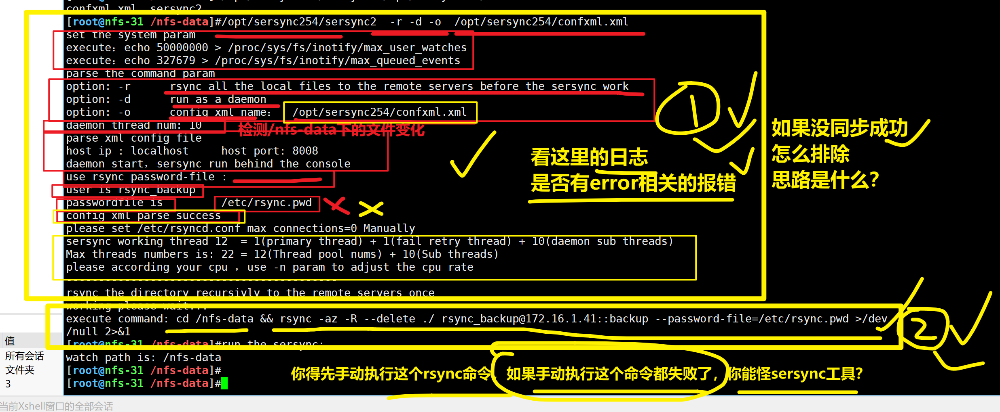
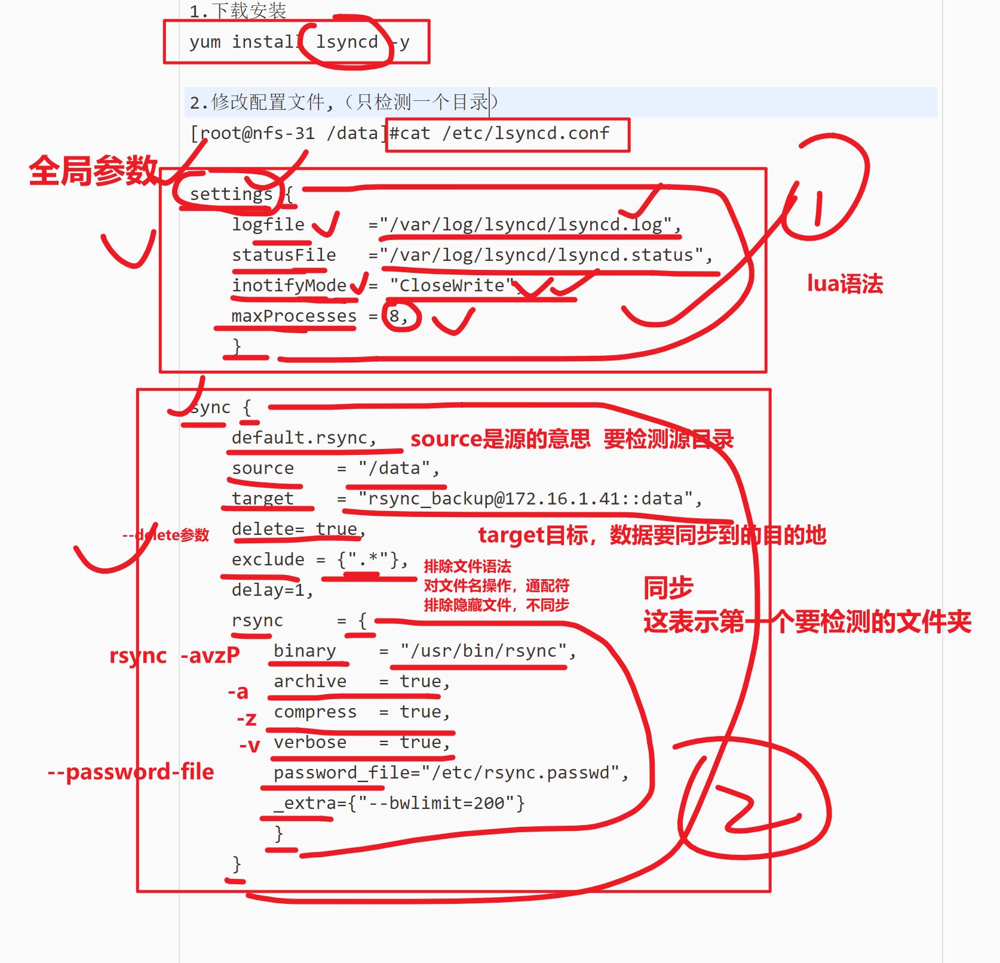

```### 此资源由 58学课资源站 收集整理 ###
	想要获取完整课件资料 请访问：58xueke.com
	百万资源 畅享学习

```
# 数据备份的重要性


# 数据备份方案


# 定时任务定期备份


# 为什么要用实时同步服务


# 实时复制方案


# 图解备份方式


## rsync+inotify实时同步


## 实时同步结合NFS


## 实时同步的难点


# inotify隆重出场


# 实施复制软件介绍


# Inofity-tools+Rsync实施复制实战


# 先准备rsyncd服务环境

## 部署拓扑图


## Backup服务器（rsync服务端）

```
1.恢复了快照，重新安装rsync服务端

2.快速的部署rsyncd服务端
#!/bin/bash
yum install rsync -y

cat > /etc/rsyncd.conf << 'EOF'
uid = www 
gid = www 
port = 873
fake super = yes
use chroot = no
max connections = 200
timeout = 600
ignore errors
read only = false
list = false
auth users = rsync_backup
secrets file = /etc/rsync.passwd
log file = /var/log/rsyncd.log
[backup]
comment = chaoge rsync backup!
path = /backup
EOF

useradd -u 1000 -M -s /sbin/nologin www
mkdir -p /{backup,data}
chown -R www:www /{backup,data}
echo "rsync_backup:yuchao666" > /etc/rsync.passwd
chmod 600 /etc/rsync.passwd
systemctl start rsyncd


3.执行脚本部署服务端的rsync
bash instal_rsync.sh


```


## dev服务器部署（rsync客户端）

```
试试是否可正确rsync备份

rsync  -avzp  /tmp/

```


# 准备部署inotify-tools软件（nfs-31机器）

## 内核检查

```
[root@nfs-31 ~]#uname -r
3.10.0-862.el7.x86_64

脚本通用型，健壮性

还有内核参数检查，
本质上是linux支持inotify机制
在性能还可以优化，支持更高的文件并发数
#检测多少个文件 ，文件内容大量的发生变化，inotify机制能同时检测多少文件 
这个参数的优化，就是调整linux的几个文件
[root@nfs-31 ~]#ls -l /proc/sys/fs/inotify/
total 0
-rw-r--r-- 1 root root 0 Apr 20 20:08 max_queued_events
-rw-r--r-- 1 root root 0 Apr 20 20:08 max_user_instances
-rw-r--r-- 1 root root 0 Apr 20 20:08 max_user_watches

系统文件解释
max_user_watches:    设置inotifywait或inotifywatch命令可以监视的文件数量（单进程）
默认只能监控8192个文件

max_user_instances:    设置每个用户可以运行的inotifywait或inotifywatch命令的进程数
默认每个用户可以开启inotify服务128个进程

max_queued_events:    设置inotify实例事件（event）队列可容纳的事件数量
默认监控事件队列长度为16384


inotify-tools 系统自带的比较low的工具

sersync 金山云的运维通过c++开发的工具

lsyncd三个工具  最新的，目前有人在用，适用于大规模服务器环境的工具
这些工具就3件事
1.优化，调整了这3文件的参数
2.检测某个目录
3.触发rsync命令


```


## 安装inotifty-tools工具

```
需要配置好epel源，才可以安装

[root@nfs-31 ~]#  yum install inotify-tools -y


检查生成的软件命令
[root@nfs-31 ~]# rpm -ql inotify-tools |head -2
/usr/bin/inotifywait
/usr/bin/inotifywatch
```


## Inotifywait详解

````
上述操作我们安装好了Inotify-tools软件，生成2个重要的命令

inotifywait：在被监控的目录等待特定文件系统事件（open、close、delete等事件），执行后处于阻塞状态，适合在Shell脚本中使用，是实现监控的关键
Inotifywatch：收集被监控的文件系统使用的统计数据（文件系统事件发生的次数统计）
【inotifywait命令解释】
````


## inotifywait实践


### 所有事件，任意的linux命令，只要对该目录的数据

对文件发生了修改动作，都会被检测到

````
mkdir /nfs-data

[root@nfs-31 ~]#inotifywait -mrq --timefmt '%T' --format "%T----%w------%f 捕获到的事件是：%e" /nfs-data
12:27:56----/nfs-data/------ 捕获到的事件是：CLOSE_NOWRITE,CLOSE,ISDIR
12:27:56----/nfs-data/------ 捕获到的事件是：OPEN,ISDIR
12:27:56----/nfs-data/------ 捕获到的事件是：CLOSE_NOWRITE,CLOSE,ISDIR


  


````

# 需要指定检测事件的名字

```
Events    含义
access    文件或目录被读取
modify    文件或目录内容被修改
attrib    文件或目录属性被改变
close    文件或目录封闭，无论读/写模式
open    文件或目录被打开
moved_to    文件或目录被移动至另外一个目录
move    文件或目录被移动到另一个目录或从另一个目录移动至当前目录
create    文件或目录被创建在当前目录
delete    文件或目录被删除
umount    文件系统被卸载
```


### Create、delete

检测，创建，删除两个时间，只有你执行了对应的linux命令，才会生成日志


```
-e  events 事件名

[root@nfs-31 ~]#inotifywait -mrq --timefmt '%T' --format "%T----%w------%f 捕获到的事件是：%e" -e  delete,create /nfs-data


12:29:46----/nfs-data/------hehe.log 捕获到的事件是：CREATE
12:30:24----/nfs-data/------aoligei.log 捕获到的事件是：CREATE

12:31:03----/nfs-data/------hehe.log 捕获到的事件是：DELETE

```


### move事件

```
[root@nfs-31 ~]#
[root@nfs-31 ~]#inotifywait -mrq --timefmt '%T' --format "%T----%w------%f 捕获到的事件是：%e" -e  move   /nfs-data


12:31:48----/nfs-data/------xixi.log 捕获到的事件是：MOVED_FROM
12:31:48----/nfs-data/------xixi.png 捕获到的事件是：MOVED_TO
12:32:17----/nfs-data/------xixi.png 捕获到的事件是：MOVED_FROM


12:32:54----/nfs-data/------xixi.png 捕获到的事件是：MOVED_TO

```


### close_write事件


```
[root@nfs-31 ~]#inotifywait -mrq --timefmt '%T' --format "%T----%w------%f 捕获到的事件是：%e" -e  close_write     /nfs-data


```


# inotify结合rsync实时同步


可知，这个工具的用法就是

1.inotify检测文件变化

2.执行rsync同步

那么想自动化实现的话，手工是不行了，就的结合脚本实现。

## 数据实时监测备份

### 简单看一下shell语法

1.脚本如下，这里需要跟着超哥学完shell编程之后，方可理解。 先看下shell脚本，如何检测到文件内容的变化


### 改造脚本结合rsync

这个脚本作用是让shell的while循环，不断的读取，文件内容

> 因此也可以用来读取inotifywait检测的日志信息，一旦有新日志出现，我们就执行rsync同步，实现（文件内容检测+rsync同步）

改造脚本，脚本需求是

1.开发机器上的代码目录，一旦有代码更新，执行rsync，将代码文件发给备份服务器

```
```


### 测试脚本结果

1.写入数据；2.查看rsync是否有数据同步 ；3.删除事件也支持


## 总结inotify-wait命令

```
1.该命令，在大量文件生成的时候，需要检测，性能会骤然下降，以及会丢失数据，有部分的文件，会无法被检测到，也就是无法被后续的动作抓取到

适用于数据量不大的情况下，你用也没问题，以及对数据


```


# 基于sersync工具同步（了解）

检测文件事件的工具，条件

- 某些文件不检测

```
1.下载安装
https://code.google.com/archive/p/sersync/ 
cd /opt && wget https://storage.googleapis.com/google-code-archive-downloads/v2/code.google.com/sersync/sersync2.5.4_64bit_binary_stable_final.tar.gz

[root@nfs-31 /opt]#tar -zxvf sersync2.5.4_64bit_binary_stable_final.tar.gz 

修改名字
[root@nfs-31 /opt]#mv GNU-Linux-x86/   sersync254


2.修改配置文件
找到需要检测的目录配置段，修改为你的机器环境即可

检测nfs-31  /nfs-data目录

修改如下部分配置
 23     <sersync>
 24         <localpath watch="/nfs-data">
 25             <remote ip="172.16.1.41" name="backup"/>
 26         </localpath>
 27         <rsync>
 28             <commonParams params="-az"/>
 29             <auth start="true" users="rsync_backup" passwordfile="/etc/rsync.pwd"/>


3.启动服务
[root@nfs-31 /nfs-data]#/opt/sersync254/sersync2  -r -d -o  /opt/sersync254/confxml.xml 

3.1 发现报错了，如何看日志，解决问题，咱们当前得问题是
1.没有密码文件
2.密码文件权限不对

[root@nfs-31 /nfs-data]#echo "yuchao666"  > /etc/rsync.pwd
[root@nfs-31 /nfs-data]#chmod 600 /etc/rsync.pwd 


4.使用工具
必须先确认sersync帮你生成的rsync命令，能正确的执行

5.查看sersync是否帮你做了同步
你必须确保，rsync可以手动，sersync才能帮你同步！！！
排查错误的经验所在

```

## 分析工具启动日志

分析，是为了更好的排错





# lsyncd工具（推荐使用）

某运维，在维护数据实时同步的时候，遇见难题了

```
1.去市面找开源的，主流的数据同步工具
inotify-wait

sersync工具


```


注意，当你做了很多的实验，机器上，可能会同时运行很多个rsync数据同步程序

解释

```
https://github.com/lsyncd/lsyncd

Lysncd 实际上是lua语言封装了 inotify 和 rsync 工具，采用了 Linux 内核（2.6.13 及以后）里的 inotify 触发机制，然后通过rsync去差异同步，达到实时的效果。
我认为它最令人称道的特性是，完美解决了 inotify + rsync海量文件同步带来的文件频繁发送文件列表的问题 —— 通过时间延迟或累计触发事件次数实现。
另外，它的配置方式很简单，lua本身就是一种配置语言，可读性非常强。
lsyncd也有多种工作模式可以选择，本地目录cp，本地目录rsync，远程目录rsyncssh。

实现简单高效的本地目录同步备份（网络存储挂载也当作本地目录），一个命令搞定。
```





```
0.干掉sersync工具

1.下载安装
yum install lsyncd -y

2.修改配置文件,（只检测一个目录）
[root@nfs-31 /data]#cat /etc/lsyncd.conf 

settings {
    logfile      ="/var/log/lsyncd/lsyncd.log",
    statusFile   ="/var/log/lsyncd/lsyncd.status",
    inotifyMode  = "CloseWrite",
    maxProcesses = 8,
    }

sync {
    default.rsync,
    source    = "/nfs-data",
    target    = "rsync_backup@172.16.1.41::backup",
    delete= true,
    exclude = {".*"},
    delay=1,
    rsync     = {
        binary    = "/usr/bin/rsync",
        archive   = true,
        compress  = true,
        verbose   = true,
        password_file="/etc/rsync.pwd",
        _extra={"--bwlimit=200"}
        }
    }
   
 
 
    

3.启动服务
systemctl start lsryncd
[root@nfs-31 /nfs-data]#
[root@nfs-31 /nfs-data]#systemctl start lsyncd
[root@nfs-31 /nfs-data]#
[root@nfs-31 /nfs-data]#systemctl status lsyncd


4.使用工具

[root@nfs-31 /nfs-data]#for i in {1..100};do echo ${i} > ${i}.log;sleep 0.1;done


```


## 作业提醒


```
有个同学，告诉我linux中毒

修改rsync配置文件 ，修改了又回去了 又回去。。。。
不断的被还原到某个状态


linux技术角度
1.  肯定是有某个程序，在修改这个文件  /etc/rsyncd.conf

ps -ef|grep rsyncd.conf

2.定时修改这个文件
crontab -l 

* * * * *   /bin/bash install_rsync.sh

cat > /etc/rsyncd.conf <<EOF
xxx
xxx
EOF
```


/nfs-data


Inotify-wait

sersync

lsyncd


1.同时运行着3个进程，你得注意这些坑

2.以及nfs的同名文件夹权限问题，各种坑，踩得你嗨到不行


所以，务必完成实验，每个人逐个给我检查演示nfs+nginx+rsync+实时同步的效果


