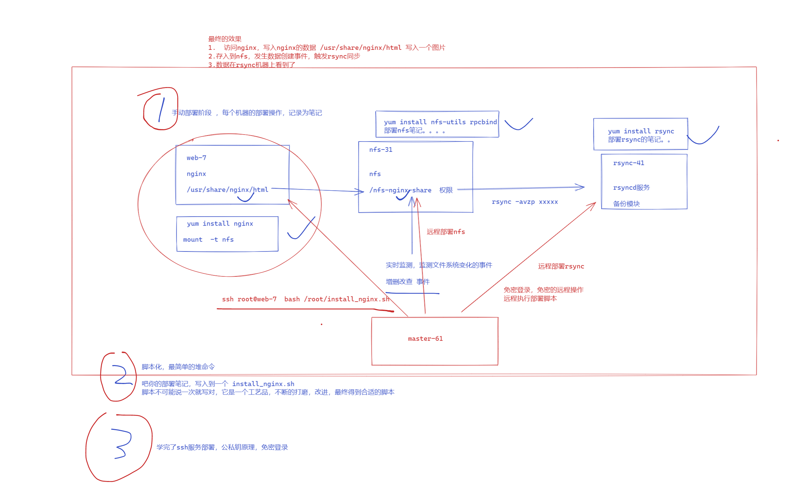

```### 此资源由 58学课资源站 收集整理 ###
	想要获取完整课件资料 请访问：58xueke.com
	百万资源 畅享学习

```
# nginx+nfs+rsync+shell

咱们接下来一整套的练习 都会围绕着nfs nginx rsync备份架构，不断升级

从手动部署

到shell一键部署

到基于ssh免密登录远程部署

到ansible批量自动化部署

因此你必须从手动部署这一环节就下功夫，务必搞懂，否则紧接而来的升级玩法，你可不能掉队


## 练习题

完成练习（能做多少是多少）
- inotify + rsync实时同步
- sersync + rsync实时同步 
- lsyncd + rsync实时同步 

## 实战小项目

三台机器

- web-7  （1.web-7的网页根目录数据来自于nfs共享目录/nfs-nginx-data/ ，要求该目录下的所有用户映射为www（uid=11111），允许读写）
- nfs-31 （2.在web-7的nginx网站根目录下创建首页文件后，触发实时同步，备份到rsync-41机器上）
- rsync-41 （3.数据备份服务器）




