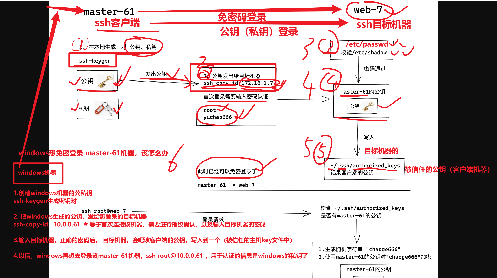
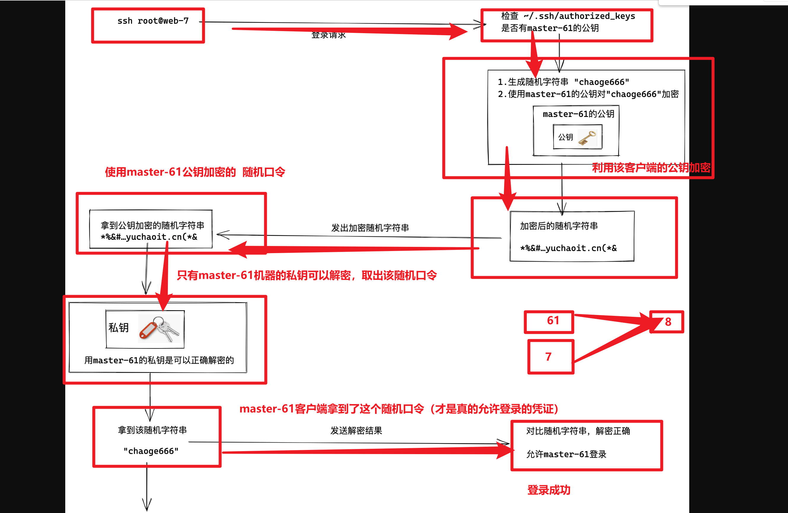
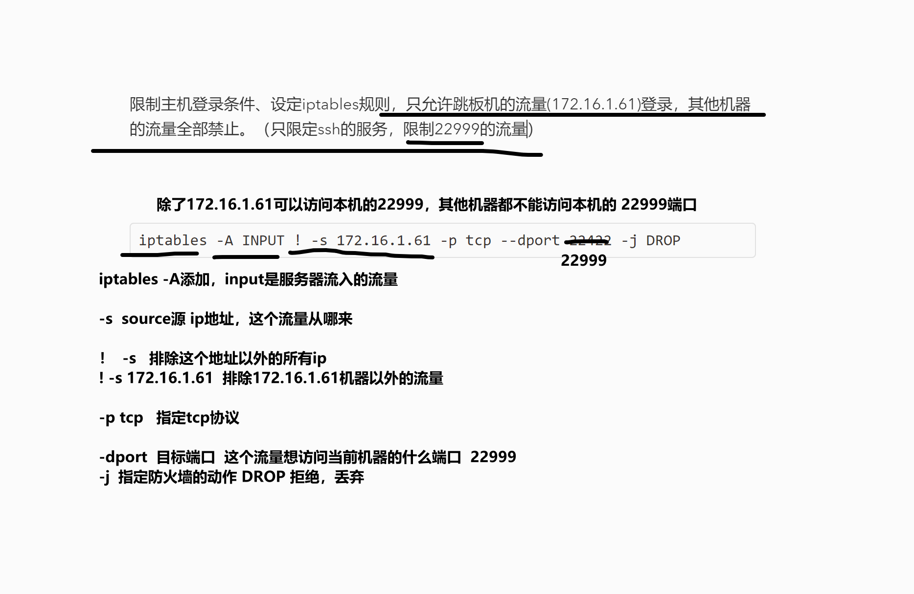

```### 此资源由 58学课资源站 收集整理 ###
	想要获取完整课件资料 请访问：58xueke.com
	百万资源 畅享学习

```
# 需要密码登录

```
在目标机器提供了公私钥，首次连接的时候，目标机器会发送给你公钥，加密登录

[root@m-61 ~]#ls /etc/ssh/ssh_host_ecdsa_key*
/etc/ssh/ssh_host_ecdsa_key 
/etc/ssh/ssh_host_ecdsa_key.pub

```


# 免密登录（重点）

- 公钥：一串字符串，在非对称加密里面用来加密数据，随意公开。
- 私钥：一串字符串，在非对称加密里面用来解密数据，不能泄露。
  - 你原本是用root的密码进行身份验证，登录该服务器
  - 客户端更换为公钥形式登录
  - 
- 普通密钥：一串字符串。在对称加密里面，加密和解密都用它。





## 基于公私钥的认证（免密码登录）

### windows免密登录linux

公钥文件会记录主机名


```
1. 生成公私钥，客户端的
客户端的~/.ssh 这个目录，就存放了客户端机器的公私钥文件

yu@DESKTOP-1TDLFH9 MINGW64 ~/Desktop
$ ssh-keygen
Generating public/private rsa key pair.
Enter file in which to save the key (/c/Users/yu/.ssh/id_rsa):
Enter passphrase (empty for no passphrase):
Enter same passphrase again:
Your identification has been saved in /c/Users/yu/.ssh/id_rsa
Your public key has been saved in /c/Users/yu/.ssh/id_rsa.pub
The key fingerprint is:
SHA256:Bsp4uy8IchkJAUuxA4dspOxcckzdTyBR2qWAZ3BmT/g yu@DESKTOP-1TDLFH9
The key's randomart image is:
+---[RSA 3072]----+
|B*oo+B=+..       |
|B=+.+=B.o.       |
|+* =o.o+o        |
|o Bo . E .       |
| o.o+   S        |
|o o. . .         |
|.o ..            |
|  . ..           |
|    .o.          |
+----[SHA256]-----+

yu@DESKTOP-1TDLFH9 MINGW64 ~/Desktop
$ ls ~/.ssh
id_rsa  id_rsa.pub


2.发给服务端
客户端的公私钥对以及有了，把客户端的公钥，发给服务端（~/.ssh/）
[root@m-61 ~]#ls ~/.ssh
known_hosts

通过命令，吧客户端的公钥，写入到服务端的authorized_keys文件中

$ ssh-copy-id root@10.0.0.61


3.检查服务端的 信任主机公钥文件 
这里存放了 客户端的公钥字符串
[root@m-61 ~]#cat  ~/.ssh/authorized_keys 


4.此时已经可以免密登录了，只能通过git-bash这个工具去免密登录，因为记录该主机名

ssh root@10.0.0.61


```

### linux免密登录linux

```
master-61  免密登录 web-7

1.在61机器生成公私钥对儿
ls ~/.ssh/
[root@m-61 ~]#ssh-keygen 
Generating public/private rsa key pair.
Enter file in which to save the key (/root/.ssh/id_rsa): 
Enter passphrase (empty for no passphrase): 
Enter same passphrase again: 
Your identification has been saved in /root/.ssh/id_rsa.
Your public key has been saved in /root/.ssh/id_rsa.pub.
The key fingerprint is:
SHA256:hkQRbkCBSXpR1QCXvgIEYfDOmk0Yka6UsYsH1B6MjLc root@m-61
The key's randomart image is:
+---[RSA 2048]----+
|O**=*+B*         |
|+O== =. .        |
|=oB...+          |
|.@E. o..         |
|=.=.  ..S        |
|o*. . ..         |
|o..  .           |
|                 |
|                 |
+----[SHA256]-----+


2.检查公私钥

[root@m-61 ~]#ll ~/.ssh/
total 16
-rw------- 1 root root  572 Apr 27 15:19 authorized_keys
-rw------- 1 root root 1679 Apr 27 15:26 id_rsa
-rw-r--r-- 1 root root  391 Apr 27 15:26 id_rsa.pub
-rw-r--r-- 1 root root  341 Apr 27 14:45 known_hosts


3.发送master-61的公钥，给web-7
为了免密登录
ssh-copy-id root@10.0.0.7


提问，web-7是如何允许master-61登录自己的？
root   /etc/passwd
123123   /etc/shadow


换了形式验证master-61是否被允许登录
前提一定你通过某办法，吧master-61的公钥，写入到web-7机器的~/.ssh/authorized_keys 


web-7 会去自己的 ~/.ssh/authorized_keys 是否有master-61的公钥 


比对，web-7上记录的公钥，以及比对master-61本地的公钥
[root@web-7 ~]#cat ~/.ssh/authorized_keys 
ssh-rsa AAAAB3NzaC1yc2EAAAADAQABAAABAQDhShiDhxEZbVaGzIo7rw3KM0tr6nU8eawVHWjwgpkk8RQ56QVaHt5030lDQ7qA9W+C4btDc1A34WLkfCsz2J8+QEKAvZYBSxzK++8H+bBDpcBPWRE0mMwtCAdBv/0uSrg5QLVHMwro8ezrctFpbV6A+BN383AxaOkz3ccG/578dB7DK1n/WrHIR7LwJSp3lv2PpeTM72vKAgvS1RM9O36cA7kCSz4KxbbpUfAGlQk45iJiod1lXk2a+b3xxdMRee5nVRAkmZmP+HLHqUzqQIwcrahRRcDiTBEIt1SPDT6/y02zKJYG7ZWotozpeDEVvC/Bg5N0mMTMKztCQeNBn5Pp root@m-61


master-61机器检查本地生成的公钥
[root@m-61 ~]#cat ~/.ssh/id_rsa.pub 
ssh-rsa AAAAB3NzaC1yc2EAAAADAQABAAABAQDhShiDhxEZbVaGzIo7rw3KM0tr6nU8eawVHWjwgpkk8RQ56QVaHt5030lDQ7qA9W+C4btDc1A34WLkfCsz2J8+QEKAvZYBSxzK++8H+bBDpcBPWRE0mMwtCAdBv/0uSrg5QLVHMwro8ezrctFpbV6A+BN383AxaOkz3ccG/578dB7DK1n/WrHIR7LwJSp3lv2PpeTM72vKAgvS1RM9O36cA7kCSz4KxbbpUfAGlQk45iJiod1lXk2a+b3xxdMRee5nVRAkmZmP+HLHqUzqQIwcrahRRcDiTBEIt1SPDT6/y02zKJYG7ZWotozpeDEVvC/Bg5N0mMTMKztCQeNBn5Pp root@m-61


此时可以免密登录了
ssh root@10.0.0.7


```





## 基于公私钥认证实践（重要）


### 免密登录步骤


### 检查web-7上的authorized_keys


### 检验master-61的公私钥文件


### 配置文件总结


## 练习题

```
1.准备master-61机器，  web-7  web-8  nfs-31  rsync-41  

让master-61可以免密登录这4台机器

操作吧

```

## 总结ssh原理的所有配置文件

为什么要学原理，就是在你出现各种bug，各种灵异事件的时候，心中有数，该如何从头、从尾，去找出问题，解决问题


### ssh账户密码认证涉及的配置文件、命令、以及作用

口述+实践

```
```


### ssh公私钥认证涉及的配置文件、命令、以及作用

口述+实践

```

```


# SSH远程执行命令


## 查看远程机器的信息

查看主机名

````
[root@m-61 ~]#ssh root@10.0.0.8 hostname
root@10.0.0.8's password: 
web-8

````


查看内存

```
[root@m-61 ~]#ssh root@10.0.0.7  free -m
              total        used        free      shared  buff/cache   available
Mem:           1982         108        1410          25         463        1666
Swap:             0           0           0

```


远程创建文件

```
[root@m-61 ~]#ssh root@10.0.0.7  touch /tmp/6666.png
```


远程安装软件redis

```
web7 redis

ssh root@10.0.0.7  yum install redis -y

远程删除redis
ssh root@10.0.0.7  yum remove redis -y
```


远程查看服务状态

```
远程查看web-7的nginx运行状态

ssh  root@10.0.0.7   systemctl status nginx
```


# ssh安全防御


安全因素

```
1.ssh支持密码连接、秘钥连接两个方式，为了密码别泄露，你得关闭密码登录
2.默认端口号全世界都知道是22，你得改掉
3.如果客户端私钥被窃取，root服务器也就危险了
```


## ssh优化

提前配置好公钥登录


禁止密码登录，只允许公钥登录

```
[root@web-7 ~]#grep -Ei '^(pub|password)'  /etc/ssh/sshd_config 
PubkeyAuthentication yes
PasswordAuthentication no

```


修改默认22端口

```
[root@web-7 ~]#grep -Ei '^(pub|password|port)'  /etc/ssh/sshd_config 
Port 22999
PubkeyAuthentication yes
PasswordAuthentication no

```


重启服务

```
[root@web-7 ~]#systemctl restart sshd
```

用master-61机器去登录他

```
[root@m-61 ~]#ssh root@10.0.0.7 -p 22999
Last login: Wed Apr 27 16:35:42 2022 from 10.0.0.1
[root@web-7 ~]#

```

用web-8机器也尝试登录web-7

```
发现是可以登录的
```


限制主机登录条件、设定iptables规则，只允许跳板机的流量(172.16.1.61)登录，其他机器的流量全部禁止。（只限定ssh的服务，限制22999的流量）




在想添加该规则的机器上执行

针对web-7限定只允许 master-61访问

```
[root@web-7 ~]#iptables -A INPUT ! -s 172.16.1.61 -p tcp --dport 22999 -j DROP
[root@web-7 ~]#
[root@web-7 ~]#
[root@web-7 ~]#iptables -L
Chain INPUT (policy ACCEPT)
target     prot opt source               destination         
DROP       tcp  -- !172.16.1.61          anywhere             tcp dpt:22999

Chain FORWARD (policy ACCEPT)
target     prot opt source               destination         

Chain OUTPUT (policy ACCEPT)
target     prot opt source               destination       


```


# 放假安排

4-28放假，预计5-3,4号，楼上装修好，可以开始自习

群里通知

5,1之后，去富雷科技二楼楼梯右手边上课


