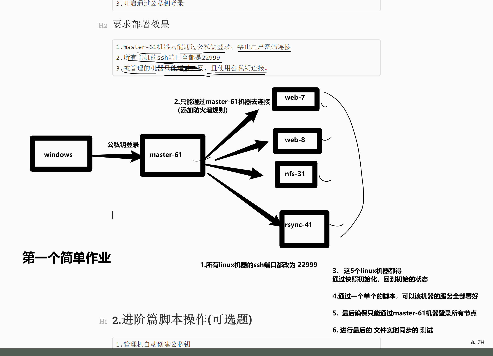

```### 此资源由 58学课资源站 收集整理 ###
	想要获取完整课件资料 请访问：58xueke.com
	百万资源 畅享学习

```
# 作业要求

# ssh大作业（根据要求部署）


# 0. 对今天所学的ssh所有知识点，整理，笔记

```
## 总结ssh原理的所有配置文件

为什么要学原理，就是在你出现各种bug，各种灵异事件的时候，心中有数，该如何从头、从尾，去找出问题，解决问题


### ssh账户密码认证涉及的配置文件、命令、以及作用

口述+实践

### ssh公私钥认证涉及的配置文件、命令、以及作用

口述+实践

```


# 1.简单作业


## windows部分

```
让windows可以免密登录master-61机器
```

## master-61管理机

```
1.修改ssh端口为22999
2.关闭密码登录
3.开启通过公私钥登录
```

## 被管理机(web-7 ,web-8,nfs-31,rsync-41)

```
1.修改ssh端口为22999
2.关闭密码登录
3.开启通过公私钥登录
```

## 要求部署效果

```
1.master-61机器只能通过公私钥登录，禁止用户密码连接
2.所有主机的ssh端口全都是22999
3.被管理的机器只能通过内网、且使用公私钥连接。
```




后续的两个作业，根据自己情况来，尽量也给做出来。。

后面反正总得完成，给自己假期好好的充充电


而且这些部署 都是小儿科，后面还有更难的。。通过更复杂的脚本（ansible）去优化


加油，奥力给！


# 2.进阶篇脚本操作(可选题)


```
1.管理机自动创建公私钥
2.管理机自动分发公钥到备管理机
3.远程修改被管理机的ssh连接端口为22999，监听地址是172.16.1.xx
4.远程修改被管理机不允许密码登录，只能是密钥登录
5.修改完毕后，验证是否生效，远程查看所有被管理主机的主机名
```

## 参考写法

- 思路不唯一
- 可优化还很多
- 脚本是一个工艺品，不断打磨，不断完善

### 批量修改配置文件

```
#1.管理机自动创建公私钥
echo "正在创建公私钥..."
if [ -f /root/.ssh/id_rsa ]
then
  echo "密钥对已经存在,请检查！"
else
  ssh-keygen -f /root/.ssh/id_rsa -N '' > /tmp/create_ssh.log 2>&1
fi

#2.管理机自动分发公钥到备管理机
echo "正在分发公钥中...分发的机器列表是{7,8,31,41}"
for ip in {7,8,31,41}
do
  sshpass -p '123123' ssh-copy-id 172.16.1.${ip} -o StrictHostKeyChecking=no > /tmp/create_ssh.log 2>&1
  echo "正在验证免密登录结果中...."
  echo "远程获取到主机名: $(ssh 172.16.1.${ip} hostname)"
done


#3.远程修改被管理机的ssh连接端口为22999，监听地址是172.16.1.xx
for ip in {7,8,31,41}
do
    echo "修改172.16.1.${ip}的ssh端口中..."
    ssh root@172.16.1.${ip} "sed -i '/Port 22/c Port 22999' /etc/ssh/sshd_config"
done


#4.远程修改被管理机不允许密码登录，只能是密钥登录
for ip in {7,8,31,41}
do
    echo "禁止密码登录参数修改中...当前操作的机器是172.16.1.${ip}"
    ssh root@172.16.1.${ip} "sed -i '/^PasswordAuthentication/c PasswordAuthentication no' /etc/ssh/sshd_config"
    echo "允许公钥登录参数修改中...当前操作的机器是172.16.1.${ip}"
    ssh root@172.16.1.${ip}  "sed -i  '/PubkeyAuthentication/c PubkeyAuthentication yes'  /etc/ssh/sshd_config"
done
```

### 重启ssh服务以及验证结果

1.批量重启sshd服务

```
for ip in {7,8,31,41}
do
    echo "重启sshd服务中，当前操作的机器是172.16.1.${ip}"
    ssh root@172.16.1.${ip} "systemctl restart sshd"
done
```

2.修改完毕后，验证是否生效，远程查看所有被管理主机的主机名

```
for ip in {7,8,31,41}
do
    echo "远程获取主机名中，当前操作的机器是172.16.1.${ip}"
    ssh -p 22999 root@172.16.1.${ip}  "hostname"
    echo "==========================================="
done
```

3.远程检查sshd端口

```
for ip in {7,8,31,41}
do
    echo "远程查看sshd端口中，当前操作的机器是172.16.1.${ip}"
    ssh -p 22999 root@172.16.1.${ip}  "netstat -tunlp|grep sshd"
    echo "===================================="
done
```

4.远程检查配置文件

```
for ip in {7,8,31,41}
do
    echo "远程查看sshd端口中，当前操作的机器是172.16.1.${ip}"
    ssh -p 22999 root@172.16.1.${ip}  "grep -Ei '^(pubkey|password)' /etc/ssh/sshd_config"
    echo "===================================="
done
```

# 3.变态型作业

不是于超老师狠，而是真的不希望你假期光剩下玩了，😁哈哈

作业要求

```
1.在master-61机器上远程一键安装rsyncd服务端，修改配置文件，且正确启动，确保可以rsync数据同步
2.在master-61机器上远程一键安装nfs服务端，修改配置文件，且正确启动，确保可以正确挂载
3.在master-61机器上远程一键安装lsyncd服务，修改配置文件，且正确启动,确保可以实现数据实时同步
4.在master-61机器上远程一键部署web-7的nginx服务，修改配置文件端口为81，且挂载nfs的共享目录，确保正确可访问nginx页面
5.最终效果
- web-7可以正常挂载nfs共享目录且权限是所有用户被映射为www（uid=11111），允许读写
- web-7用户上传那文件夹后，nfs服务器数据自动同步到backup服务器。
```

Copyright © www.yuchaoit.cn 2021 all right reserved，powered by Gitbook