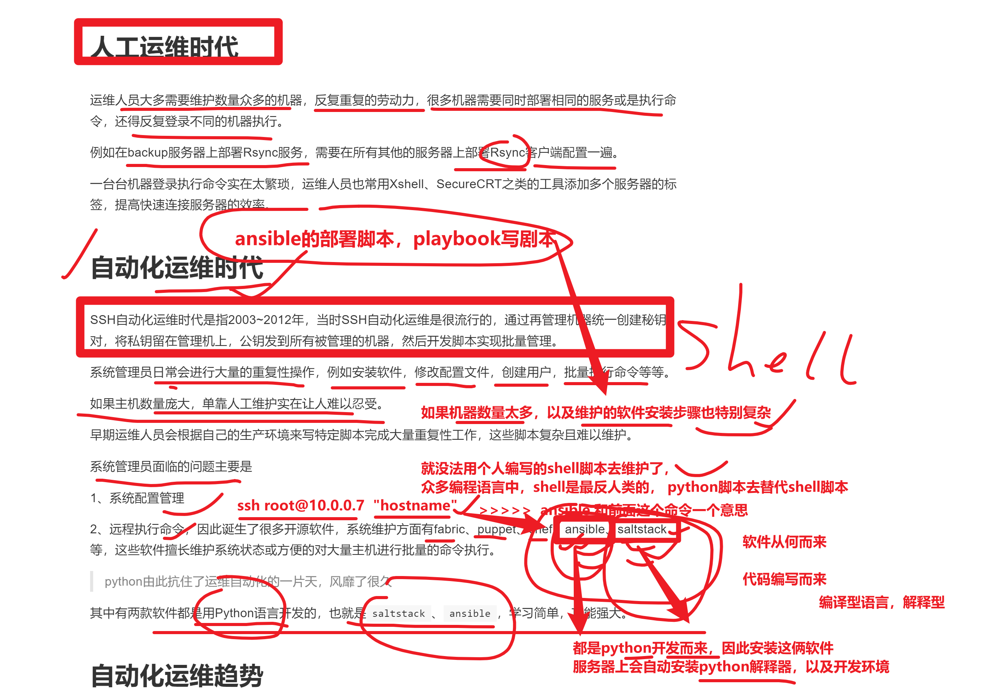
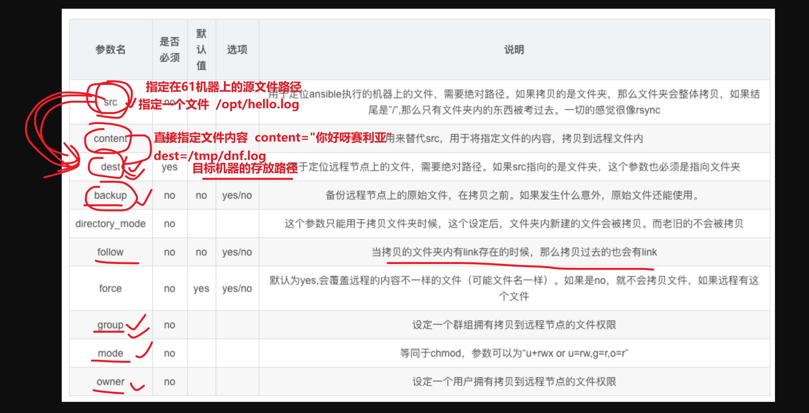

```### 此资源由 58学课资源站 收集整理 ###
	想要获取完整课件资料 请访问：58xueke.com
	百万资源 畅享学习

```
# 前言

学ansible，基础篇就是一件事

- 学各种模块的语法，参数
- 由于模块较多，参数较多，需要做好笔记，以及一定的背诵，敲打建议记忆


基础篇学习路线

- 1.主机清单语法，学会如何批量管理服务器组，配置服务器认证，服务器变量
- 2.学习常见的模块，语法，参数，用法
- 3.改造shell脚本为ansible模块


```
yum install rsync -y
yum remove rsync -y


这个shell命令就得转变为ansible的模块操作， yum模块，提供参数


useradd bob01
简单的linux命令，转变为ansible的模块操作
users模块，提供一些参数，用户名的名字，用户的uid，以及用户的过期时间等


```




# 自动化运维好处

- 提高工作效率，减少重复性工作
- 大大减少人为出错的可能性
- 数据化管理、数据化汇报、问题可追溯

```
ansible
saltstack
这俩自动化运维工具

master-61机器，管理了100台目标机器
指标
shell 脚本结合for循环处理这100个机器
每一个指标就是每一个命令
free -m > xxx.file
cpuinfo

shell，命令导出的数据就是一堆普通的文本字符串，难以加工处理

如果能导出为数据交换格式，如json，如yaml，如xml就可以很轻松的发给各种编程语言，实现数据加工，格式化处理，发给前端去做网页展示


ansible几条命令就可以实现了
并且
ansible导出的服务器信息，如内存，磁盘，网卡，等等一堆信息，可以直接导出为json数据
json数据就可以直接发给前端，前端就可以展示出服务器的信息

这就是运维开发做的事
后端python+ansible获取数据，导出json，发给前端
前端写html，js，对json数据展示

运维平台就出来了


```


# 如何学习ansible

```
1.打开ansible官网，查看所有最新的功能，不要看其他的文档，可能已经很陈旧了，python3也已经更新了很多，导致用法变化等。

https://docs.ansible.com/ansible/latest/
最新官网文档

nfs服务
rsync服务

shell脚本，堆砌了各种部署的命令
↓
把这个脚本，所有的操作，全部替换为ansible的模块


2.你可能要执行的各种命令，ansible都提供了模块，如文件拷贝，如软件安装，服务重启等；

3.你使用ansible，必须严格按照ansible提供的语法来，否则只有报错

4.先学语法，语法基本功扎实后，面对千变万化的需求，才能游刃有余

5.多动手，ansible需要记忆的操作比较多
```


# 1、ansible安装部署

## 在master-61管理机安装

```
yum install epel-release ansible libselinux-python -y


前提你配置好了阿里云的epel源可以直接安装
yum install ansible -y 


[root@master-61 ~]#ansible --version
ansible 2.9.27
  config file = /etc/ansible/ansible.cfg
  configured module search path = [u'/root/.ansible/plugins/modules', u'/usr/share/ansible/plugins/modules']
  ansible python module location = /usr/lib/python2.7/site-packages/ansible
  executable location = /usr/bin/ansible
  python version = 2.7.5 (default, Apr 11 2018, 07:36:10) [GCC 4.8.5 20150623 (Red Hat 4.8.5-28)]


```

## 其他被管理的机器

全部初始化，还原sshd原本的配置即可

用于学习ansible的主机连接配置参数


## 主机清单文件（主机分组）

https://docs.ansible.com/ansible/latest/user_guide/intro_inventory.html#inventory-basics-formats-hosts-and-groups

把综合架构需要用到的机器，进行分组


主机清单配置文件

```
vim /etc/ansible/hosts 

[web]
172.16.1.7
172.16.1.8
172.16.1.9


[nfs]
172.16.1.31

[bakcup]
172.16.1.41


```


主机分组后，执行命令测试，批量管理一组机器


管理所有的机器，使用特殊主机组，all

```
让所有的主机，远程执行hostname，返回主机名信息
[root@master-61 ~]#ansible all -m shell -a "hostname"

但是默认没配置认证方式，权限被拒绝

```


## ansible主机登录认证

Ansible批量管理主机有两种方式：

- 传统的密码认证
- 公钥认证

```
这里参考于超老师上一节讲解的ssh服务，所有的机器配置好公私钥登录，即可免密码操作
```

## ansible基于公私钥认证

1.将master61机器的公钥，分发给想免密登录的机器

2.后续在对该机器操作，就直接进行ssh的公钥认证了，可以免密码，直接远程执行


```
1.配置好master-61免密登录31机器

2.后续可以免密执行ansible的各种模块了

[root@master-61 ~]#ansible nfs -m command -a "hostname"


你可以配置所有机器的公钥一键分发，就可以实现all所有主机的远程命令执行
ansible all -m shell "hostname" # 返回结果给master-61机器


```


## 基于密码认证

- 在你的客户端机器、修改了ssh默认端口、以及密码需要修改主机清单文件才可以正确连接。
- 注意你得配置允许密码登录才能进行如下测试，可以再开一个web-9机器。


## ansible主机清单配置文件语法（重要）

```
/etc/ansible/hosts 主机清单文件


```


https://docs.ansible.com/ansible/latest/user_guide/intro_inventory.html#connecting-to-hosts-behavioral-inventory-parameters

```
注意，部分资料里的主机配置文件语法，旧版如下
Ansible 2.0 has deprecated the “ssh” from ansible_ssh_user, ansible_ssh_host, and ansible_ssh_port to become 

这是旧版本的用法
ansible_ssh_host
ansible_ssh_port
ansible_ssh_user
ansible_ssh_password

最新的，去掉了中间的_ssh


新版参数
ansible_user
ansible_host
ansible_port


如果你写旧版本的语法，新版也也认识

```

新版参数

| 参数             | 参数类型 | 参数说明                  |
| ---------------- | -------- | ------------------------- |
| ansible_host     | 主机地址 | 远程主机ip                |
| ansible_port     | 主机端口 | 设置SSH连接端口，默认22   |
| ansible_user     | 主机用户 | 默认SSH远程连接的用户身份 |
| ansible_password | 用户密码 | 指定SSH远程主机密码       |


## 给rsync机器，进行密码认证

```
1.给rsync机器，添加密码，端口等信息

[backup]
172.16.1.41  ansible_port=22  ansible_password='123123'  

2.如果目标机器的ssh信息都被改了，这里也得改
[backup]
172.16.1.41  ansible_port=22999  ansible_password='123456'  


```


#### 添加rsync机器的ssh信息

Ansible软件使用的前提是SSH+KEY免密验证的环境，如果没有配置也可以使用Ansible，如下

```
[root@master-61 ~]#tail -2 /etc/ansible/hosts 
[backup]
172.16.1.41 ansible_port=22999 ansible_user=root ansible_password=123123
```

测试执行

```
[root@master-61 ~]#ansible backup -m ping
172.16.1.41 | SUCCESS => {
    "ansible_facts": {
        "discovered_interpreter_python": "/usr/bin/python"
    }, 
    "changed": false, 
    "ping": "pong"
}
```

#### 添加web机器组的信息

```
[root@master-61 ~]#tail /etc/ansible/hosts 

[web]
172.16.1.7 ansible_port=22999 ansible_user=root ansible_password=123123
172.16.1.8 ansible_port=22999 ansible_user=root ansible_password=123123

[nfs]
172.16.1.31

[backup]
172.16.1.41 ansible_ssh_port=22999 ansible_ssh_user=root ansible_ssh_pass=123123
```

测试执行

```
[root@master-61 ~]#ansible web -m ping
172.16.1.8 | SUCCESS => {
    "ansible_facts": {
        "discovered_interpreter_python": "/usr/bin/python"
    }, 
    "changed": false, 
    "ping": "pong"
}
172.16.1.7 | SUCCESS => {
    "ansible_facts": {
        "discovered_interpreter_python": "/usr/bin/python"
    }, 
    "changed": false, 
    "ping": "pong"
}
```


#### 拿web机器测试（单独操作某主机）

```
1.先配置主机组的参数
[web]
172.16.1.7 ansible_port=22999 ansible_password='123123'
172.16.1.8 ansible_port=22999 ansible_password='123123'
172.16.1.9 ansible_port=22999 ansible_password='123123'


2.执行ping模块，看下是否和远程主机通信
[root@master-61 ~]#ansible  web -m ping
172.16.1.7 | SUCCESS => {
    "ansible_facts": {
        "discovered_interpreter_python": "/usr/bin/python"
    }, 
    "changed": false, 
    "ping": "pong"
}
172.16.1.9 | SUCCESS => {
    "ansible_facts": {
        "discovered_interpreter_python": "/usr/bin/python"
    }, 
    "changed": false, 
    "ping": "pong"
}
172.16.1.8 | SUCCESS => {
    "ansible_facts": {
        "discovered_interpreter_python": "/usr/bin/python"
    }, 
    "changed": false, 
    "ping": "pong"
}


```

#### 故障解决

你可能会遇见如下问题，关于新机器的指纹确认问题。

```
[root@master-61 ~]#
[root@master-61 ~]#ansible 172.16.1.9 -m ping
172.16.1.9 | FAILED! => {
    "msg": "Using a SSH password instead of a key is not possible because Host Key checking is enabled and sshpass does not support this.  Please add this host's fingerprint to your known_hosts file to manage this host."
}
```

解决办法1，手动ssh连接，进行指纹确认，写入到本机的

```
[root@master-61 ~]#cat ~/.ssh/known_hosts
```

解决办法2，ansible配置文件中忽略指纹确认

```
[root@master-61 ~]#grep 'host_key_checking' /etc/ansible/ansible.cfg 
host_key_checking = False
```

问题以及解决，可以正确操作web-9机器

```
[root@master-61 ~]#ansible 172.16.1.9 -m ping
172.16.1.9 | SUCCESS => {
    "ansible_facts": {
        "discovered_interpreter_python": "/usr/bin/python"
    }, 
    "changed": false, 
    "ping": "pong"
}
```

#### 踩坑记录(ansible缓存)

由于ansible在对远程主机操作之前，默认会先通过setup模块获取机器的facts（静态属性），并且会生成缓存，便于加速远程主机的操作；

但缓存也会导致一些奇怪的现象，比如客户端的机器信息更新了，服务端依旧使用的是旧数据，那就不准确了，因此可以删除缓存。

```
关于缓存导致bug的文章，https://serverfault.com/questions/630253/ansible-stuck-on-gathering-facts


清理ansible的缓存目录即可
[root@master-61 ~]#rm -rf ~/.ansible/cp/*
```


#### 同一组连续的ip

可以修改主机清单文件如下，前提是该些主机的配置一致

```
[web]
172.16.1.[7:9]
```


#### 公共变量

当主机清单里，很多主机组，有相同的变量属性，可以写成公共变量

这部分配置是针对web主机组，抽象的变量

```
[root@master-61 ~]#grep -vE '^#|^$' /etc/ansible/hosts 
[web:vars]
ansible_ssh_port=22999
ansible_ssh_user=root
ansible_ssh_pass=123123
[web]
172.16.1.[7:9]
[nfs]
172.16.1.31 ansible_ssh_port=22999 
[backup]
172.16.1.41 ansible_ssh_port=22999 ansible_ssh_user=root ansible_ssh_pass=123123
```


## 测试web组和backup组是否可用

```
1.主机清单
[web:vars]
ansible_port=22999 
ansible_password='123123'

[web]
172.16.1.[7:9]


[nfs]
172.16.1.31

[backup]
172.16.1.41  ansible_port=22999  ansible_password='123456'


2.ansible ad-hoc命令

web机器组
[root@master-61 ~]#ansible web -m ping


rsync机器
[root@master-61 ~]#ansible backup -m shell -a "touch /opt/已给我毅力giao    warn=false"
172.16.1.41 | CHANGED | rc=0 >>

[root@master-61 ~]#
[root@master-61 ~]#
[root@master-61 ~]#ansible backup -m shell -a "ls /opt/"
172.16.1.41 | CHANGED | rc=0 >>
已给我毅力giao


```


```
[root@master-61 ~]#ansible web -m ping
172.16.1.7 | SUCCESS => {
    "ansible_facts": {
        "discovered_interpreter_python": "/usr/bin/python"
    }, 
    "changed": false, 
    "ping": "pong"
}
172.16.1.8 | SUCCESS => {
    "ansible_facts": {
        "discovered_interpreter_python": "/usr/bin/python"
    }, 
    "changed": false, 
    "ping": "pong"
}
172.16.1.9 | SUCCESS => {
    "ansible_facts": {
        "discovered_interpreter_python": "/usr/bin/python"
    }, 
    "changed": false, 
    "ping": "pong"
}


# 获取主机名
[root@master-61 ~]#ansible web -m shell -a hostname
172.16.1.9 | CHANGED | rc=0 >>
web-9
172.16.1.8 | CHANGED | rc=0 >>
web-8
172.16.1.7 | CHANGED | rc=0 >>
web-7
```

#### 所有主机都生效的变量(最终版)

指定主机组名all，即可针对所有主机生效，前提是，你要确保这个信息是所有主机通用的。

```
[root@master-61 ~]#grep -vE '^#|^$' /etc/ansible/hosts 
[all:vars]
ansible_port=22999
#ansible_user=root
#ansible_password=123123

[web]
172.16.1.7
172.16.1.8
172.16.1.9

[nfs]
172.16.1.31

[backup]
172.16.1.41
```

远程执行命令

```
[root@master-61 ~]#rm -rf ~/.ansible/cp/*
[root@master-61 ~]#
[root@master-61 ~]#ansible all -m shell -a hostname

[root@master-61 ~]#ansible all -m shell -a hostname
172.16.1.31 | CHANGED | rc=0 >>
nfs-31
172.16.1.8 | CHANGED | rc=0 >>
web-8
172.16.1.41 | CHANGED | rc=0 >>
rsync-41
172.16.1.7 | CHANGED | rc=0 >>
web-7
172.16.1.9 | CHANGED | rc=0 >>
web-9
```


## 一定要学会看报错


## 关于ansible连接指纹确认的问题


```
1.master-61需要确认目标机器的指纹，记录到本地known_hosts文件
ls ~/.ssh/known_hosts文件中 这里就存放了目标机器的指纹信息

可以进行认证方式，密码，还是公钥


2.首次远程连接，需要指纹确认，可以忽略该指纹
ssh的连接参数，忽略指纹的确认
ansible的配置文件中也有一个参数忽略指纹的确认


一般用法是
总之ansible就是以ssh连接标准来


1.指纹确认 yes/no

2.密码认证/公钥认证

关于ansible如何初始化的使用，有三个方案


方案1
已经基于ssh完成了指纹确认，认证方式
ansible直接用就可以
你可以先一键分发公钥，实现批量免密登录，再ansible免密远程执行命令

方案2
ssh root@172.16.1.7
手动确认yes，写入到本地的known_hosts

你可以手动ssh连接，确认指纹后，再ansible去远程操作，选择认证方式就行


方案3,
你可以直接忽略指纹确认，在主机清单文件中定义好ssh连接配置参数

这个是最简单的，修改ansible配置文件，打开忽略指纹确认的参数即可

修改如下参数即可
 72 # uncomment this to disable SSH key host checking
 73 host_key_checking = False
 
后续就进入了认证方式阶段，选择密码，还是公钥，
常见错误
- 端口错了
-  密码错了
- 用户错了

如果出错
1.找ansible的/etc/ansible/hosts中语法是否出错
2.看目标机器，到底提供了什么样的ssh连接形式（sshd_config）


```


# 3、ansible命令执行方式

```
ansible提供了多少个模块给你用


[root@master-61 ~]#ansible-doc -l |wc -l
3387

```


Ansible实现批量管理主机的模式主要有俩：

- 利用ansible命令实现批量管理（ad-hoc）模式
- 利用ansible剧本实现批量管理（playbook）模式

Ad-hoc和playbook的关系就好比shell命令与shell scripts的关系

## ad-hoc模式

Ansible的ad-hoc模式也就是ansible的命令行模式，该模式通常用来临时处理一些任务。例如

- 临时批量查看所有被管控机器的内存、负载、磁盘
- 临时批量分发某个特定文件

## Playbook模式

Ansible的playbook模式就是针对特定的具体较大的任务，事先写好执行剧本，然后在其他机器上批量执行相同的任务，属于定制化的批量执行任务，例如

- 一键安装Rsync
- 一键搭建LNMP集群等

## ansible-doc命令

列出ansible所有支持的模块，这就是ansible这个万能工具箱所有的零件了。

```
[root@master-61 ~]#ansible-doc -l |grep ^ping
ping                                                          Try to connect to host, verify a usable python and re...
pingdom                                                       Pause/unpause Pingdom alerts   


[root@master-61 ~]#ansible-doc -l |grep ^shell
shell  


当前ansible支持3387个模块
[root@master-61 ~]#ansible-doc -l |wc -l
3387
```

当前ansible支持的模块数量

```
[root@master-61 ~]#ansible-doc -l |wc -l
3387
```

查看某个模块的具体用法

```
[root@master-61 ~]#ansible-doc -s shell

[root@master-61 ~]#ansible-doc -s ping
```


# 4、ansible核心内容（模块学习）

## ansible执行命令结果（状态颜色）

你后续使用各种模块操作，会有不同的颜色结果，都是有意义的

```
运维远程执行命令，有2个方式
shell脚本，远程执行
ansible模块，远程执行

区别在哪

shell脚本不够智能，不会记录上一次的执行状态，以及修改的状态，因此导致，傻瓜式的，重复性执行。效率是极其低下的，不做状态记录

shell   yum install  rsync  ;  mkdir -p ;


ansible的模块，yum模块会记录执行的状态
第一次执行,装完之后，的确对目标机器产生了修改的状态，会给master-61返回一个命令的执行结果，执行状态，存储下来
ansible web -m yum -a "name=rsync  state=installed"

ansible会检测目标机器，对比这个状态，如果状态没变，ansible就不会再执行该命令，因此效率很高
ansible web -m yum -a "name=rsync  state=installed"

```

ansible的状态，就是如下的颜色区分，看到不同的状态


```
这俩是命令成功了
绿色：命令以用户期望的执行了，但是状态没有发生改变；

黄色：命令以用户期望的执行了，并且状态发生了改变；


紫色：警告信息，说明ansible提示你有更合适的用法；出现了warning警告

红色：命令错误，执行失败；

蓝色： 详细的执行过程；
```

## 官网文档

如果说学ansible该去哪找正确玩法

1.看官网

2.看于超老师博客（😄）

```
https://docs.ansible.com/ansible/latest/collections/ansible/builtin/index.html#plugins-in-ansible-builtin
```

Ansible自动化软件的核心功能就在于其众多的模块，可以说学习Ansible就是学习模块的使用。

剩余的是对Ansible剧本编写的熟练度。


## 题外话

如今的运维只需要学这几样东西，可以横着走

- ansible
- docker k8s
- 阿里云运维
- shell
- 


## 4.1 ping测试连通性

```
1.通过master-61查看目标机器是否运行

ansible all -m ping
```


https://docs.ansible.com/ansible/latest/collections/ansible/builtin/ping_module.html#ansible-collections-ansible-builtin-ping-module

命令语法

```
ansible 主机组 -m 模块名  [模块参数]
```

查看模块解释

```
[root@master-61 ~]#ansible-doc -s ping
- name: Try to connect to host, verify a usable python and return `pong' on success
  ping:
      data:                  # Data to return for the `ping' return value. If this parameter is set to `crash', the
                               module will cause an exception.
[root@master-61 ~]#
```

执行

```
[root@master-61 ~]#ansible web -m ping
172.16.1.8 | SUCCESS => {
    "ansible_facts": {
        "discovered_interpreter_python": "/usr/bin/python"
    }, 
    "changed": false, 
    "ping": "pong"
}
172.16.1.9 | SUCCESS => {
    "ansible_facts": {
        "discovered_interpreter_python": "/usr/bin/python"
    }, 
    "changed": false, 
    "ping": "pong"
}
172.16.1.7 | SUCCESS => {
    "ansible_facts": {
        "discovered_interpreter_python": "/usr/bin/python"
    }, 
    "changed": false, 
    "ping": "pong"
}
```


## 4.2 command 简单命令模块

https://docs.ansible.com/ansible/latest/collections/ansible/builtin/command_module.html#ansible-collections-ansible-builtin-command-module

语法

```
[root@master-61 ~]#ansible-doc -s command

ansible 主机组 -m command -a "需要批量执行的命令"
```

该模块作用：在远程节点上执行一个命令

- command模块是ansible默认的模块，也就是默认就指定了 -m command
- 只支持简单命令命令执行，比如你想远程看下服务器的资源信息，普通的linux命令

command模块是ansible命令基本模块

- 使用command模块执行远程命令，命令不得用变量（$HOME）

- 不得出现特殊符号

  ```
  < 、>、|、；、&
  ```

  ，否则无法识别，需要则使用shell模块实现

  - 也就是无法使用复杂的linux命令

### 远程查看主机名

```
[root@master-61 ~]#ansible web -m command -a "hostname"
172.16.1.7 | CHANGED | rc=0 >>
web-7
172.16.1.8 | CHANGED | rc=0 >>
web-8
172.16.1.9 | CHANGED | rc=0 >>
web-9
[root@master-61 ~]#ansible web -a "hostname"
172.16.1.8 | CHANGED | rc=0 >>
web-8
172.16.1.7 | CHANGED | rc=0 >>
web-7
172.16.1.9 | CHANGED | rc=0 >>
web-9

```

简写，command是ansible的基础模块，默认就是`-m command`

```

```

### 查看远程主机内存

```
ansible web -a "free -m"
```

### 远程创建文件、查看文件


```

[root@master-61 ~]#ansible web  -m command -a "touch /opt/人生无常大肠包小肠.log"

[root@master-61 ~]#ansible web -m command -a "cat /opt/人生无常大肠包小肠.log"


```

### 远程获取机器负载

```
[root@master-61 ~]#ansible web -a "uptime"
172.16.1.9 | CHANGED | rc=0 >>
 11:35:36 up 3 days,  5:09,  2 users,  load average: 0.00, 0.01, 0.05
172.16.1.7 | CHANGED | rc=0 >>
 11:35:36 up  2:56,  2 users,  load average: 0.00, 0.01, 0.02
172.16.1.8 | CHANGED | rc=0 >>
 11:35:36 up  2:26,  2 users,  load average: 0.00, 0.01, 0.03

```

### 关闭告警信息

```

[root@master-61 ~]#ansible web  -m command -a "touch /opt/人生无常大肠包小肠.log    warn=false  "
172.16.1.9 | CHANGED | rc=0 >>

172.16.1.8 | CHANGED | rc=0 >>

172.16.1.7 | CHANGED | rc=0 >>

```

### 在所有机器上，创建yuchao01用户

```
[root@master-61 ~]#ansible web    -m command -a "useradd yuchao01"


```

### 使用command提供的专有命令

这些命令用于编写ansible-playbook，完成服务器部署的各种复杂条件限定。

| 选项参数          | 选项说明                                                     |
| ----------------- | ------------------------------------------------------------ |
| chdir             | 在执行命令执行，通过cd命令进入指定目录                       |
| creates           | 定义一个文件是否存在，若不存在，则运行相应命令；存在则跳过   |
| free_form（必须） | 参数信息中可以输入任何系统命令，实现远程管理                 |
| removes           | 定义一个文件是否存在，如果存在，则运行相应命令；如果不存在则跳过 |

### Command练习

备份/var/log日志目录，需要先进入根目录

`cd / && tar -zcvf /opt/log.tgz   /var/log`

注意你备份文件存放的文件夹是否存在

```
ansible web -m command -a "tar -zcf /opt/log.tgz   /var/log   chdir=/"


[root@master-61 ~]#ansible web -a "ls -l /opt"

```

在/opt下创建chaoge666.log

```
2个写法

ansible  web -a "touch /opt/chaoge666.log"

ansible web -a "touch chaoge666.log  chdir=/opt"


```

备份/etc所有配置文件到 /backup_config/etc.tgz 。

```
ansible web -a "tar -zcf /backup_config/etc.tgz   etc chdir=/"
目标目录不存在则会报错

```


练习removes命令

```
1.这里就得提前考虑 /backup_config文件夹是否存在，必须先有文件夹，才能执行该备份命令


2.判断如果该文件夹不存在，则不执行备份

目标文件夹不存在，这个命令不会对目标机器产生任何修改，因此绿色结果
ansible web -a "tar -zcf /backup_config/etc.tgz   etc chdir=/  removes=/backup_config"


3.你必须先创建该文件夹
ansible web -a "mkdir -p /backup_config"
ansible web -a "tar -zcf /backup_config/etc.tgz   etc chdir=/  removes=/backup_config"


4.再次执行该命令

```

测试creates命令，如果目标目录已经存在了，就别创建该目录了

```
[root@master-61 ~]#ansible backup -m command -a 'mkdir /opt creates=/opt'
172.16.1.41 | SUCCESS | rc=0 >>
skipped, since /opt exists
```


远程过滤进程信息，无法使用，因为command不支持特殊符号

```
想用特殊符号，更复杂的linux命令用shell模块

虽然ansible提供了大量的模块

万能模块shell
但是你在学习阶段，还是尽量的用专有的模块

```


## 4.3 shell模块（万能模块）

shell模块功能：在远程节点上执行命令（复杂的命令）

https://docs.ansible.com/ansible/latest/collections/ansible/builtin/shell_module.html#ansible-collections-ansible-builtin-shell-module

也就是等于你在linux上直接执行任何复杂的命令都可以

但是ansible的使用理念是，人家提供了几千个模块，并且有很复杂的功能，你在用shell模块之前，先查一查是否有对应的模块。

你如果想使用ansible提供的状态功能，记录你每次执行命令的结果，你就必须得使用专有的模块，否则无法使用该功能


```
在目标机器
执行一个普通的shell脚本

yum

group
user

```


### Shell练习

> shell模块可以识别特殊符号，就等于远程执行命令了

远程过滤ssh进程信息

```
ansible all -m shell -a "ps -ef|grep ssh"
```

使用重定向符号，创建文件

```
>>
>


# 远程获取时间信息，且写入到文件中
command

command不认识重定向
# ansible web -m command -a "date > /tmp/date.log"


[root@master-61 ~]#ansible web -m shell -a "date '+%F %T' > /tmp/date.log"
172.16.1.7 | CHANGED | rc=0 >>

172.16.1.9 | CHANGED | rc=0 >>

172.16.1.8 | CHANGED | rc=0 >>

[root@master-61 ~]#ansible web -m shell -a 'cat /tmp/date.log'
172.16.1.8 | CHANGED | rc=0 >>
2022-05-06 12:06:23
172.16.1.9 | CHANGED | rc=0 >>
2022-05-06 12:06:23
172.16.1.7 | CHANGED | rc=0 >>
2022-05-06 12:06:23

```


### 远程执行复杂linux命令

这个命令就无法在command中执行

通过一条命令，做如下事情

- 创建文件夹
- 生成sh脚本文件(查看主机名)
- 赋予脚本可执行权限
- 执行脚本
- 忽略warning信息

```


ansible web  -m shell  -a "mkdir /0224/;echo 'hostname' > /0224/hostname.sh;chmod +x /0224/hostname.sh;/0224/hostname.sh;  warn=false"


```

### 小结shell模块

shell命令别过度依赖，那就等于用ansible远程帮你执行了个普通的shell命令；

你应该多去琢磨其他模块，如文件模块、拷贝模块，脚本模块，定时任务模块，yum模块等等等。


## 4.4 copy拷贝文件

copy模块是远程推送数据模块，只能把数据推送给远程主机节点，无法拉取数据到本地。

既然是文件拷贝，可用参数也就是围绕文件属性。




```
将master-61管理机器上的数据，拷贝到目标机器上


```


### copy练习

语法

```
ansible 主机组 -m copy -a "参数"
```

### 简单发送文件

src

dest

参数练习

并且ansible的模块记录了文件属性，文件的md5值，得到了文件的唯一校验值，判断文件内容是否变化，如果未变化，不做处理，提升批量管理的效率


```
[root@master-61 ~]#ansible web -m copy   -a "src=/tmp/61-dnf.log   dest=/tmp/web-dnf.log"

```

### 发送文件且指定文件属性

```
61
↓
web机器组(属性变化，www，600)

```


权限改为600、修改为www用户（要求目标机器存在该用户）

```
创建www用户


远程拷贝文件，且修改权限，为600
[root@master-61 ~]#ansible web -m copy -a "src=/tmp/61-dnf.log   dest=/opt/web-dnf.log  group=www owner=www   mode=600 "


远程检查文件信息
[root@master-61 ~]#ansible web -m shell -a "ls -l  /opt/web-dnf.log"
172.16.1.8 | CHANGED | rc=0 >>
-rw------- 1 www www 22 May  6 12:21 /opt/web-dnf.log
172.16.1.7 | CHANGED | rc=0 >>
-rw------- 1 www www 22 May  6 12:21 /opt/web-dnf.log
172.16.1.9 | CHANGED | rc=0 >>
-rw------- 1 www www 22 May  6 12:21 /opt/web-dnf.log


```

### 发送文件且先做好备份

使用backup参数，防止覆盖远程文件，丢失备份，提前备份该目标机器的数据

```
1.检查目标机器的文件
[root@master-61 ~]#ansible web -m shell -a "ls -l  /opt/web-dnf.log"
172.16.1.8 | CHANGED | rc=0 >>
-rw------- 1 www www 22 May  6 12:21 /opt/web-dnf.log
172.16.1.7 | CHANGED | rc=0 >>
-rw------- 1 www www 22 May  6 12:21 /opt/web-dnf.log
172.16.1.9 | CHANGED | rc=0 >>
-rw------- 1 www www 22 May  6 12:21 /opt/web-dnf.log


2.远程拷贝文件，且做好备份
[root@master-61 ~]#ansible web -m copy -a "src=/tmp/61-dnf.log  dest=/opt/web-dnf.log   backup=yes"  


3.发现ansible帮你做好了备份
[root@master-61 ~]#ansible web -m copy -a "src=/tmp/61-dnf.log  dest=/opt/web-dnf.log   backup=yes"  ^C
[root@master-61 ~]#
[root@master-61 ~]#
[root@master-61 ~]#ansible web -m shell -a "ls -l /opt/web*"
172.16.1.8 | CHANGED | rc=0 >>
-rw------- 1 www www 83 May  6 12:25 /opt/web-dnf.log
-rw------- 1 www www 52 May  6 12:23 /opt/web-dnf.log.6088.2022-05-06@12:25:29~
172.16.1.9 | CHANGED | rc=0 >>
-rw------- 1 www www 83 May  6 12:25 /opt/web-dnf.log
-rw------- 1 www www 52 May  6 12:23 /opt/web-dnf.log.35948.2022-05-06@12:25:29~
172.16.1.7 | CHANGED | rc=0 >>
-rw------- 1 www www 83 May  6 12:25 /opt/web-dnf.log
-rw------- 1 www www 52 May  6 12:23 /opt/web-dnf.log.9089.2022-05-06@12:25:29~


```


### 指定数据写入到远程文件中

向rsyncd.conf中填入账号密码，覆盖其原有的文件内容

content参数

```
[root@master-61 ~]#ansible web -m copy -a "content='远离毒奶粉，好好学linux才是王道'   dest=/opt/web-dnf.log      "

查看文件内容


```

注意像这样的覆盖操作，还是添加备份参数更合适

```
[root@master-61 ~]#ansible web -m copy -a "content='远离毒奶粉，好好学linux才是王道'   dest=/opt/web-dnf.log    backup=yes  "
```

### 复制文件夹，注意结尾斜杠

练习src、dest，以及分隔符的添加


```


远程拷贝/opt/ 下的所有内容到目标机器
[root@master-61 ~]#ansible web -m copy -a "src=/opt/  dest=/tmp/"


远程拷贝/opt  整个目录到目标机器
[root@master-61 ~]#ansible web -m copy -a "src=/opt  dest=/tmp/"


```


# 目前已学的模块

```
ping   	检测目标机器是否存活
command    远程执行简单linux命令不支持特殊符号
shell       万能模块，远程执行简单linux命令，支持特殊符号
copy    批量分发文件 master-61机器要给所有被管理的机器，批量的发送，更新某文件，某文件夹

/etc/hosts文件  master-61机器上 ,所有被管理的机器集群，都可以使用这个本地
hosts 域名解析


ansible all -m copy  -a "src=/etc/hosts  dest=/etc/hosts   backup=yes"


准备了一些列的数据文件，网站的所有静态页面，图片等
master-61机器的 /www目录下  ,全部发给共享存储/nginx-html/，提供给web服务器组使用
/www/static/logo.png
/www/html/index.html


ansible  nfs  -m copy  -a "src=/www/  dest=/nginx-html/"


```


## 4.5 file文件操作模块

copy区别开

file模块作用是`创建`、以及`设置`文件目录属性。


```
copy模块，src(管理机器上 )  dest(目标机器上)


file专门用于在远程机器上，关于文件的所有操作
file  src(目标机器上的文件)   dest(目标机器上的文件)  


```


file模块主要用于创建文件、目录数据，以及对现有的文件、目录权限进行修改

对文件属性各种操作的


### 请看官网

https://docs.ansible.com/ansible/latest/modules/file_module.html#file-module

直接看examples示例用法即可

```
或者看命令帮助
[root@master-61 ~]#ansible-doc -s file
```

### 远程创建文件

ansible每次命令的执行，都会记录下当前的状态

state参数、path参数

```

远程在web服务器组中，创建一个文本，  hello_ansible.log

ansible web -m file -a "path=/opt/hello_ansible.log state=touch"


[root@master-61 ~]#ansible web -m shell -a "ls -ld /opt/hello*"
172.16.1.7 | CHANGED | rc=0 >>
drwxr-xr-x 2 root root 6 May  6 14:56 /opt/hello_ansible
-rw-r--r-- 1 root root 0 May  6 14:54 /opt/hello_ansible.log

```

### 创建文件夹

state参数、path参数

```
[root@master-61 ~]#ansible web -m file -a "path=/opt/hello_ansible  state=directory"

```

### 创建文件且设定权限

state参数、path参数、owner参数、group参数

path=/opt/hello-linux.log  

```
ansible web -m file -a "path=/opt/hello-linux.log  state=touch owner=www group=www  "
```

### 远程修改文件属性

```
[root@master-61 ~]#ansible web -m file -a "path=/opt/hello-linux.log  state=touch owner=www group=www  mode=777"


```


### 创建软连接文件

软连接，也就是在目标机器上，指定源文件，创建软连接

src、dest、state

给web服务器组的 /etc/hosts文件，添加软连接到/opt/hosts文件


```
ansible web -m file -a "src=/etc/hosts  dest=/opt/hosts state=link  "


```

### 强制性创建文件（软连接）

```
意义不大，查看force参数的作用
[root@master-61 ~]#ansible web -m file -a "src=/etc/hostsss  dest=/opt/hosts state=link  force=yes "


```


### 修改已存在文件/文件夹的属性


```
修改文件 Path、mode

[root@master-61 ~]#ansible 172.16.1.7 -m file -a "path=/opt/chaoge666.log  owner=www group=www  mode=666"


修改文件夹 Path、mode owner,group

[root@master-61 ~]#ansible 172.16.1.7 -m file -a "path=/opt/hello_ansible  owner=www group=www"


```

### 关于file模块的所有参数作用

```
https://docs.ansible.com/ansible/latest/collections/ansible/builtin/file_module.html#parameters
```

### 关于file模块的实例用法

playbook剧本的写法，yaml写法

```
https://docs.ansible.com/ansible/latest/collections/ansible/builtin/file_module.html#examples
```


## 4.6 script脚本模块

```
一键部署rsync，nfs，nginx等

1.把脚本发到目标机器上执行，

2.远程执行，目标机器上不需要存在这个脚本


```


官网

```
https://docs.ansible.com/ansible/latest/collections/ansible/builtin/script_module.html#ansible-collections-ansible-builtin-script-module
```

模块功能：把本地脚本传输到远程节点上并运行脚本

比起`shell`模块，script模块功能更强大，管理机本地有一份脚本，就可以在所有机器上运行。

### scripts模块的功能参数

| 选项参数          | 选项说明                                                     |
| ----------------- | ------------------------------------------------------------ |
|                   |                                                              |
| creates           | 定义一个文件是否存在，若不存在，则运行相应命令；存在则跳过   |
| free_form（必须） | 参数信息中可以输入任何系统命令，实现远程管理                 |
| removes           | 定义一个文件是否存在，如果存在，则运行相应命令；如果不存在则跳过 |

### 远程执行脚本

为什么要用ansible，主要是ansible使用对应的模块，执行完命令后，记录了每一次文件修改的状态，这个状态，一是让你更清晰文件的情况、而是也防止反复修改文件，提升效率。


```
为什么需要用scripts模块

script模块

反复执行命令，远程执行脚本

```


```
1.管理机创建测试脚本

master-61创建该脚本


[root@master-61 ~]#cat echo_server_info.sh 
echo "$(hostname -I)" >> /tmp/server_info.log
echo "$(uptime)" >> /tmp/server_info.log
echo "$(free -m)" >> /tmp/server_info.log


2.添加执行权限
[root@master-61 ~]#chmod +x echo_server_info.sh 


3.远程执行
发给nfs机器去执行


4.检查结果


```

利用script模块批量让所有被管控机器执行脚本，该脚本不用在远程主机上存在


### 远程在目标机器执行脚本

```
远程安装nginx脚本
[root@master-61 ~]#cat install_nginx.sh 
#yum install nginx -y
yum remove nginx -y

echo "ansible很重要，是你挣钱的工具"
[root@master-61 ~]#
[root@master-61 ~]#ansible nfs -m script -a "/root/install_nginx.sh"

```


### 查看命令执行详细过程

-vvvvv参数显示详细过程，v越多，越详细

```
[root@master-61 ~]#ansible nfs -vvvvv  -m shell -a "df -h"

显示命令执行的详细过程，开启了debug日志模式


```


```
记住ansible的语法

记住模块的名字

记住对应模块完成功能的参数

```


## 4.7 cron定时任务模块

```
官网文档
https://docs.ansible.com/ansible/latest/modules/cron_module.html#cron-module
```

cron模块用于管理定时任务的记录，编写任务

```
定时任务的记录，语法格式

* * * * *   要执行的命令


```


### 对比ansible的cron模块，和crontab

常见的参数如此，使用ansible编写定时任务，和直接编写是没有什么区别的


### 添加ntpdate定时任务

添加每5分钟执行一次和阿里云时间同步


```
*/5  * * * *            ntpdate -u ntp.aliyun.com
```


name、job、minute参数

```
cron模块创建定时任务
[root@master-61 ~]#ansible nfs  -m cron   -a "name='ntp aliyun'   minute=*/5   job='ntpdate -u ntp.aliyun.
172.16.1.31 | CHANGED => {
    "ansible_facts": {
        "discovered_interpreter_python": "/usr/bin/python"
    }, 
    "changed": true, 
    "envs": [], 
    "jobs": [
        "ntp aliyun"
    ]
}


查看远程机器的crontab记录


[root@master-61 ~]#ansible nfs -m shell -a "crontab -l"
172.16.1.31 | CHANGED | rc=0 >>
* * * * * /usr/sbin/ntpdate time1.aliyun.com > /dev/null 2>&1
#Ansible: ntp aliyun
*/5 * * * * ntpdate -u ntp.aliyun.com


```

### 删除定时任务

只能基于cron模块指定名字的修改

```
name参数，state参数


先检查远程的定时任务
[root@master-61 ~]#ansible nfs -m shell -a "crontab -l"
172.16.1.31 | CHANGED | rc=0 >>
* * * * * /usr/sbin/ntpdate time1.aliyun.com > /dev/null 2>&1
#Ansible: ntp aliyun
*/5 * * * * ntpdate -u ntp.aliyun.com


正统用法
ansible nfs -m cron -a "name='ntp aliyun'  state=absent "


歪门邪道
[root@master-61 ~]#ansible nfs -m shell -a "crontab -r"
172.16.1.31 | CHANGED | rc=0 >>


```

### 创建每分钟执行的任务

不指定任何时间规则，默认是每分钟

```
[root@master-61 ~]#ansible nfs -m cron -a "name='一句话'  job='echo "人定胜天" >>/tmp/hello.log '  "172.16.1.31 | CHANGED => {
    "ansible_facts": {
        "discovered_interpreter_python": "/usr/bin/python"
    }, 
    "changed": true, 
    "envs": [], 
    "jobs": [
        "一句话"
    ]
}
[root@master-61 ~]#
[root@master-61 ~]#ansible nfs -m shell -a "crontab -l"
172.16.1.31 | CHANGED | rc=0 >>
#Ansible: 一句话
* * * * * echo 人定胜天 >>/tmp/hello.log 

```

### 修改指定名称的定时任务

```
[root@master-61 ~]#ansible nfs -m cron -a "name='一句话'    minute=30  hour=23   job='echo 人定胜天 >>/tmp/hello.log' "
172.16.1.31 | CHANGED => {
    "ansible_facts": {
        "discovered_interpreter_python": "/usr/bin/python"
    }, 
    "changed": true, 
    "envs": [], 
    "jobs": [
        "一句话"
    ]
}
[root@master-61 ~]#
[root@master-61 ~]#
[root@master-61 ~]#ansible nfs -m shell -a "crontab -l"
172.16.1.31 | CHANGED | rc=0 >>
#Ansible: 一句话
30 23 * * * echo 人定胜天 >>/tmp/hello.log

```


## 4.8 group模块

管理系统用户组的模块

```
https://docs.ansible.com/ansible/latest/modules/group_module.html#group-
官网文档
```

语法

```
模块参数    参数描述
name    创建指定的组名
gid        组的GID
state        absent，移除远程主机的组
             present，创建远端主机的组
```

对组管理，也就是创建、删除、查看了


### 创建chaoge_ops组，gid=1234

name、gid

```
ansible nfs  -m group  -a "name=chaoge_ops   gid=1234"
```

### 删除组

```
name、gid、state

ansible nfs  -m group  -a "name=chaoge_ops   gid=1234  state=absent"  
```


## 4.9 user用户模块

用户管理，也就是关于用户的

- uid
- 用户名
- 用户主组
- 用户附加组
- 创建用户
- 删除用户
- 创建关于用户的公私钥
- 用户过期时间
- 用户密码过期时间

这里主要就是于超老师讲解的用户管理篇的知识，如果忘了回头看即可，这里就不做太多ansible的模块讲解，后续遇见了再操作。

```
https://docs.ansible.com/ansible/latest/modules/user_module.html#user-module
官网文档
```

### 语法参数

```
实例用法
https://docs.ansible.com/ansible/latest/collections/ansible/builtin/user_module.html#examples
```

| 模块参数    | 参数描述                                    |
| ----------- | ------------------------------------------- |
| create_home | 创建家目录，设置no则不创建家目录            |
| group       | 创建用户组                                  |
| name        | 创建用户的名字                              |
| password    | 创建用户的密码                              |
| uid         | 创建用户的UID                               |
| shell       | 用户登录解释器                              |
| state       | Absent（删除用户）present（默认参数，创建） |
| expires     | 账户过期时间                                |
|             |                                             |

### 创建chaoge01用户，uid为8888

```
ansible nfs -m user -a "name=chaoge01  uid=8888"

```

### 创建用户cc01

- uid、gid为1777
- 没有家目录、不允许登录


```
注意该用户组是否存在，否则报错
group、name、gid

ansible nfs -m group -a "name=cc01 gid=1777"


创建用户，设置权限
user、name、uid、group、create_home、shell


ansible nfs -m group -a "name=cc01 gid=1777"

[root@master-61 ~]#ansible nfs -m user -a "name=cc01 uid=1777 group=1777 create_home=no  shell=/sbin/nologin "


检查用户

```


## 4.10 yum安装软件

yum模块明显就是一个专门用于管理软件的模块。


### 官网文档示例用法

```
https://docs.ansible.com/ansible/latest/collections/ansible/builtin/yum_module.html#examples
```

yum模块其实就是在远程节点上，执行yum命令，你可以快速登录到目标机器，查看进程

### 安装net-tools最新版本

latest参数也用于升级软件包

```
[root@master-61 ~]#ansible backup -m yum -a "name=net-tools state=latest"
```

### 卸载net-tools软件

```
[root@master-61 ~]#ansible backup -m yum -a "name=net-tools state=absent"
```

### 卸载rsync服务

```
[root@master-61 ~]#ansible backup -m yum -a "name=rsync state=abesent"
```

### 安装rsync服务

```
[root@master-61 ~]#ansible backup -m yum -a "name=rsync state=installed"


检查rsync
[root@master-61 ~]#ansible backup -m shell -a "rpm -qa rsync"
```

## 4.11 service/systemd模块

该模块作用是针对yum包管理

service适用于centos6前的系统

systemd命令应用于centos7系统

**要注意的是service模块依旧对centos7有效，但是建议大家使用systemd模块**

> - systemd模块用于控制远程主机的systemd服务，说白了，就是Linux下的systemd命令。需要远程主机支持systemd
> - 用法和service模块基本相同

### systemd模块参数

```
如果使用systemctl 管理程序的话，可以使用systemd模块，systemctl 可以 控制程序启/停，reload，开机启动，观察程序状态（status）等，掌握使用后管理就更方便了

主要参数
daemon_reload：在执行任何其他操作之前运行守护进程重新加载，以确保systemd已经读取其他更改
enabled：服务是否开机自动启动yes|no。enabled和state至少要有一个被定义
masked：是否将服务设置为masked状态，被mask的服务是无法启动的
name：必选项，服务名称
no_block(2.3后新增)：不要同步等待操作请求完成
state：对当前服务执行启动，停止、重启、重新加载等操作（started,stopped,restarted,reloaded）
user：使用服务的调用者运行systemctl，而不是系统的服务管理者
```

### 安装、启动nginx服务

```
1.安装nginx服务
[root@master-61 ~]#ansible 172.16.1.7 -m yum -a "name=nginx state=installed"

2.启动服务
[root@master-61 ~]#ansible web -m systemd -a "name=nginx state=started"

3.查询状态，这里ansible未直接提供status参数，你可以借助command模块即可
[root@master-61 ~]#ansible web -a "systemctl status nginx"

4.停止nginx服务
[root@master-61 ~]#ansible web -m systemd -a "name=nginx state=stopped"

5.设置nginx开机自启
[root@master-61 ~]#ansible web -m systemd -a "name=nginx state=started enabled=yes"

6.检查nginx状态
[root@master-61 ~]#ansible web -a "systemctl is-enabled nginx"

[root@master-61 ~]#ansible web -a "systemctl status nginx"

7.关闭开机自启、且停止服务
[root@master-61 ~]#ansible web -m systemd -a "name=nginx state=stopped  enabled=no"

8.再次检查状态
[root@master-61 ~]#ansible web  -m shell -a "systemctl is-enabled nginx;systemctl status nginx"
```

## 4.12 mount挂载模块

```
官网
https://docs.ansible.com/ansible/latest/collections/ansible/posix/mount_module.html#mount-
```

### 给web-7机器挂载nfs目录（只写入/etc/fstab而不挂载）

```
[root@master-61 ~]#ansible web -m mount -a "src='172.16.1.1:/nfs-nginx-data' path=/usr/share/nginx/html fstype=nfs state=present"
```

### 给web-7机器挂载nfs目录（立即挂载且写入/etc/fstab）

```
[root@master-61 ~]#ansible web -m mount -a "src='172.16.1.31:/nfs-nginx-data' path=/usr/share/nginx/html fstype=nfs state=mounted"

检查
[root@master-61 ~]#ansible web -a "df -h"

[root@master-61 ~]#ansible web -a "cat /etc/fstab"
```

### 取消挂载，以及删除fstab记录

```
[root@master-61 ~]#ansible web -m mount -a "src='172.16.1.31:/nfs-nginx-data' path=/usr/share/nginx/html fstype=nfs state=absent"

验证
[root@master-61 ~]#ansible web -a "df -h"
[root@master-61 ~]#ansible web -a "cat /etc/fstab"
```

### 取消挂载，不删除fstab记录

```
[root@master-61 ~]#ansible web -m mount -a "src='172.16.1.31:/nfs-nginx-data' path=/usr/share/nginx/html fstype=nfs state=umounted"
```

### 总结参数

```
mounted 挂载设备且写入fstab
present 仅写入fstab 不挂载
absent  卸载且删除fstab记录
umounted 只卸载不删除fstab记录
```

## 4.13 archive压缩模块

```
官网文档
https://docs.ansible.com/ansible/latest/collections/community/general/archive_module.html
```

### 支持压缩类型

```
bz2

gz ← (default)

tar

xz

zip 

用法文档
https://docs.ansible.com/ansible/latest/collections/community/general/archive_module.html#examples
指定format即可
```

### 压缩/etc配置文件到指定路径

```
[root@master-61 ~]#ansible web -m archive -a "path=/etc dest=/opt/etc.tgz"
[root@master-61 ~]#ansible web -a "ls /opt -l"
[root@master-61 ~]#ansible web -a "file /opt/etc.tgz"
```

### 压缩/var/log为zip类型到指定路径

```
[root@master-61 ~]#ansible web -m archive -a "path=/var/log dest=/opt/log.zip format=zip"

[root@master-61 ~]#ansible web -a "file /opt/log.zip"
```

## 4.14 unarchive解压缩模块

注意了，你现在是远程解压缩，而不是在本机直接解压缩

```
https://docs.ansible.com/ansible/latest/collections/ansible/builtin/unarchive_module.html#examples
```

### 解压缩etc.tgz到指定目录（远程解压）

remote_src远程数据源

```
指定目录必须存在
[root@master-61 ~]#ansible web -m file -a "path=/opt/etc_file state=directory"


解压缩
[root@master-61 ~]#ansible web -m unarchive -a "src=/opt/etc.tgz dest=/opt/etc_file/ remote_src=yes"

查看
[root@master-61 ~]#ansible web -a "ls /opt/etc_file/etc/"
```

## 将管理机的压缩包，解压到远程机器上

将master-61的压缩文件，解压到web-7机器上

```
1.生成etc.tgz数据
[root@master-61 ~]#cd / && tar -zcf /opt/etc.tgz etc


2.远程解压到web-7机器上
[root@master-61 /]#ansible web -m unarchive -a "src=/opt/etc.tgz  dest=/tmp/"

3.检查
[root@master-61 /]#ansible web -a "ls /tmp/etc/"
```

# 综合大练习


## 练习1 ，基础模块学习笔记

```
1.完成于超老师课堂所讲的ansible 基础模块
- 学习笔记
- 模块对应练习实践
- 以后面试人家问你，ansible你经常用哪些模块，能否立即说出?


ping
command
shell
copy
file
script
cron
group
user
yum
systemd
mount
archive
unarchive
```


## 练习2，rsync、nfs、nginx改造为ansible脚本

全部替换为ad-hoc命令模式即可

讲了一整天的 ad-hoc命令模式

```
语法都是


都为为了完成每一个linux命令的需求


ansible  主机组名   -m 模块名   -a 该模块对应的参数


用户创建
配置文件远程拷贝
服务安装
启动服务

挂载服务


```


```
nginx > nfs > rsync 这一套综合练习，前面是写成了shell脚本形式

1.现在需要你将shell脚本，改造为ansible模块脚本的形式

2.要求ansible的主机清单为

nfs
backup
web

3.要求使用技术
ansible
nfs
nginx
lsyncd
rsync

4.涉及ansible模块，不限于
yum
copy
group
user
file
copy
systemd
等
```


