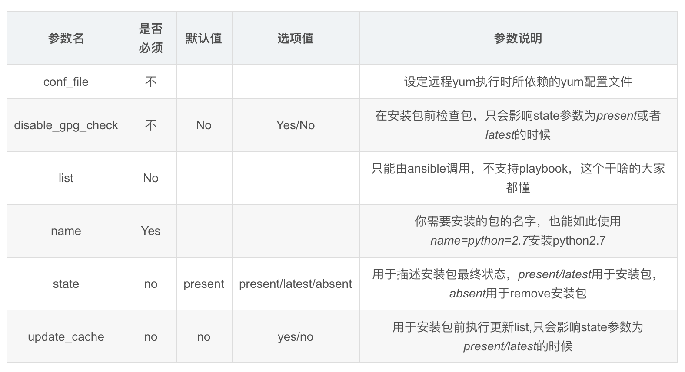
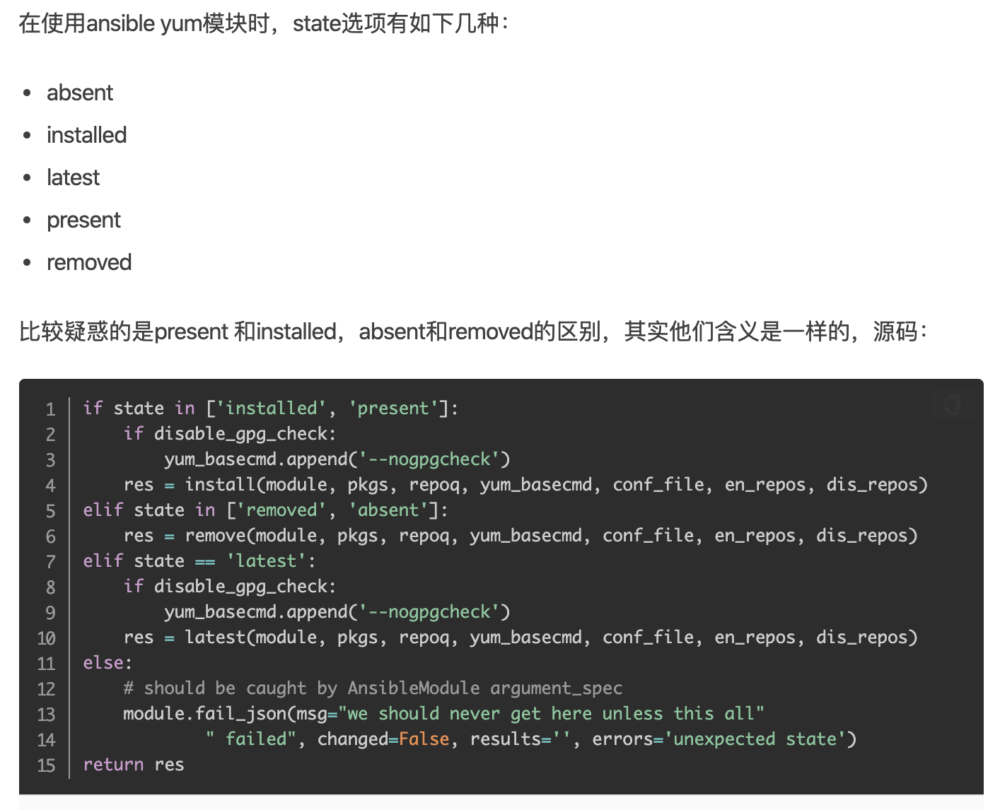

```### 此资源由 58学课资源站 收集整理 ###
	想要获取完整课件资料 请访问：58xueke.com
	百万资源 畅享学习

```
# 基础模块

```
ad-hoc命令模式

ping

command

shell

copy


file

script

cron

group

user


1.先看资料，看模块的语法
- 官网，看实例用法，语法注解
- ansible-doc  -s 模块名
- 你自己的学习笔记


2.每一个模块独有的参数


语法，都是
ad-hoc命令模式

ansible 主机组  -m 模块名  -a "模块独有的参数"


3.使用这些模块能解决什么问题


```

剩余模块

```
yum   软件管理，安装，卸载，升级


systemd 对应 service 作用一样   ，管理服务的状态，启停，重载


mount   挂载，可以挂载哪些文件系统 ，xfs , nfs , ext4

arvhive   （归档），打包、且压缩文件，文件夹  ，对应命令是tar  -czf  命令

unarchive （拆包） ，拆包，且解压缩，tar   -zxvf  

```

## 4.10 yum安装软件

yum模块明显就是一个专门用于管理软件的模块。

```
name 指定软件包名
state 指定对软件的操作状态，安装，卸载
	absent
	installed
	

update_cache 是否更新yum缓存

```




---



### 官网文档示例用法

```
https://docs.ansible.com/ansible/latest/collections/ansible/builtin/yum_module.html#examples
```

yum模块其实就是在远程节点上，执行yum命令，你可以快速登录到目标机器，查看进程


### 安装net-tools最新版本

latest参数也用于升级软件包

```

ansible all -m yum  -a "name=net-tools  state=latest"
ansible all -m yum  -a "name=net-tools  state=installed"

```

### 卸载net-tools软件

```
ansible all -m yum  -a "name=net-tools  state=removed"

```

### 卸载rsync服务

```
ansible  172.16.141   -m yum -a "name=rsync  state=absent"


```

### 安装rsync服务

```
ansible  172.16.141   -m yum -a "name=rsync  state=installed"
ansible  172.16.141   -m yum -a "name=rsync  state=present"
ansible  172.16.141   -m yum -a "name=rsync  state=latest"


```


## 4.11 service/systemd模块


```
yum install  rsync

rsyncd.services脚本，yum给你生成

systemctl start/stop/restart rsyncd
纯命令操作，shell不会记录你每一次的执行状态，执行记录

ansible的模块去管理服务，就会记录每次的操作状态


```


该模块作用是针对yum包管理

service适用于centos6前的系统

systemd命令应用于centos7系统

**要注意的是service模块依旧对centos7有效，但是建议大家使用systemd模块**

> - systemd模块用于控制远程主机的systemd服务，说白了，就是Linux下的systemd命令。需要远程主机支持systemd
> - 用法和service模块基本相同

### systemd模块参数

```
如果使用systemctl 管理程序的话，可以使用systemd模块，systemctl 可以 控制程序启/停，reload，开机启动，观察程序状态（status）等，掌握使用后管理就更方便了

主要参数
daemon_reload：在执行任何其他操作之前运行守护进程重新加载，以确保systemd已经读取其他更改
enabled：服务是否开机自动启动yes|no。enabled和state至少要有一个被定义
masked：是否将服务设置为masked状态，被mask的服务是无法启动的
name：必选项，服务名称
no_block(2.3后新增)：不要同步等待操作请求完成
state：对当前服务执行启动，停止、重启、重新加载等操作（started,stopped,restarted,reloaded）
user：使用服务的调用者运行systemctl，而不是系统的服务管理者
```


### 安装、启动nginx服务

```
1.安装nginx服务

ansible web -m yum -a "name=nginx state=installed"

2.启动服务

ansible web -m systemd -a "name=nginx  state=started"


3.查询nginx运行状态，这里ansible未直接提供status参数，你可以借助command模块即可
# systemd模块

ansible web  -m shell -a "systemctl status nginx"

ansible web  -m shell -a "ps -ef|grep nginx"

ansible web  -m shell -a "netstat -tunlp|grep nginx"


4.停止nginx服务
ansible web -m systemd -a "name=nginx  state=stopped"


5.设置nginx开机自启（）
# 先指定了名字是nginx，启动，停止，还是设置开机自启

# 仅设置服务开机自启，并且立即启动
ansible web -m systemd -a "name=nginx state=started   enabled=yes"


[root@master-61 ~]#ansible web -m shell -a "systemctl is-enabled nginx"
[root@master-61 ~]#ansible web -m shell -a "ps -ef|grep nginx"


```


## 4.12 mount挂载模块

```

state参数

mounted
	1.立即挂载
	2.写入fstab文件
	3.创建挂载点
	
unmounted
	1.卸载挂载设备
	2.不会删除fstab文件的记录

present
	1.只写入fstab文件记录
	2.不会立即挂载

absent
	1.删除fstab中记录
	2.卸载设备
	3.删除挂载点

remounted
	1.重新挂载这个设备
	

	


```


### 给web-7机器挂载nfs目录（只写入/etc/fstab而不立即挂载）

```
挂载设备
1.立即挂载，可以访问该设备的资料
[root@master-61 ~]#ansible  172.16.1.7  -m mount  -a "src='172.16.1.31:/nfs-data' path='/test-nfs'    state=present  fstype=nfs "


2.设置重启后，开机自动挂载， /etc/fstab文件
[root@master-61 ~]#ansible 172.16.1.7 -m shell -a "cat /etc/fstab"
172.16.1.7 | CHANGED | rc=0 >>

#
# /etc/fstab
# Created by anaconda on Mon Apr 18 12:41:32 2022
#
# Accessible filesystems, by reference, are maintained under '/dev/disk'
# See man pages fstab(5), findfs(8), mount(8) and/or blkid(8) for more info
#
/dev/mapper/centos-root /                       xfs     defaults        0 0
UUID=4b434f73-2809-489d-ac02-8a5e7803abd9 /boot                   xfs     defaults        0 0
#/dev/mapper/centos-swap swap                    swap    defaults        0 0
172.16.1.31:/nfs-data /test-nfs nfs defaults 0 0


```


###  给web-7机器挂载nfs目录（立即挂载且写入/etc/fstab）

```
ansible  172.16.1.7  -m mount  -a "src='172.16.1.31:/nfs-data' path='/test-nfs'    state=mounted  fstype=nfs "
```

### 取消挂载，以及删除fstab记录

```
1.删除fstab
2.卸载设备
3.删除挂载点

ansible  172.16.1.7  -m mount  -a "src='172.16.1.31:/nfs-data' path='/test-nfs'    state=absent  fstype=nfs "

```

### 取消挂载，不删除fstab记录

```
ansible  172.16.1.7  -m mount  -a "src='172.16.1.31:/nfs-data' path='/test-nfs'    state=unmounted  fstype=nfs "
```

### 总结参数

```

state参数

mounted
	1.立即挂载
	2.写入fstab文件
	3.创建挂载点
	
unmounted
	1.卸载挂载设备
	2.不会删除fstab文件的记录

present
	1.只写入fstab文件记录
	2.不会立即挂载

absent
	1.删除fstab中记录
	2.卸载设备
	3.删除挂载点

remounted
	1.重新挂载这个设备
	

	


```


## 4.13 archive压缩模块

```
官网文档
https://docs.ansible.com/ansible/latest/collections/community/general/archive_module.html

```

### 支持压缩类型

```
bz2

gz ← (default)

tar

xz

zip 

用法文档
https://docs.ansible.com/ansible/latest/collections/community/general/archive_module.html#examples
指定format即可

```


### 压缩/etc配置文件到指定路径

> 压缩整个/etc文件夹到 /tmp/all_etc.tar.gz

```
path=/etc
dest=/tmp/all_etc.tar.gz

backup机器

ansible backup -m archive  -a "path=/etc dest=/tmp/all_etc.tar.gz "

[root@master-61 ~]#ansible backup -m archive  -a "path=/etc dest=/tmp/all_etc.tar.gz


```

### 压缩/var/log为zip类型到指定路径

```

ansible backup -m archive  -a "path=/var/log  dest=/tmp/all_log.zip  format=zip "
```


## 4.14 unarchive解压缩模块

```
ansible远程管理机器

解压缩，准备好原文件

原文件在61机器上
61机器的压缩文件，解压到 41机器的某目录


还是在目标机器上
41机器上，解压缩到41机器的本地


```


注意了，你现在是远程解压缩，而不是在本机直接解压缩

```
https://docs.ansible.com/ansible/latest/collections/ansible/builtin/unarchive_module.html#examples
```

### 解压缩etc.tgz到指定目录（远程解压）

```

远程的解压缩

41机器的/tmp下有 all_etc.tar.gz

解压到/test-etc/


    
ansible backup  -m unarchive  -a "src=/tmp/all_etc.tar.gz  dest=/test-etc/ remote_src=yes  "

解压缩出了整个etc目录到 /test-etc/
[root@rsync-41 ~]#cd /test-etc/
[root@rsync-41 /test-etc]#ls
etc


```


## 将管理机的压缩包，解压到远程机器上

将master-61的压缩文件，解压到web-7机器上

```
1.生成 all_png.tgz数据


2.远程解压到web-7机器上

[root@master-61 /opt]#ansible backup -m unarchive  -a "src=/opt/all_png.tgz   dest=/test-etc/"


3.检查

```


