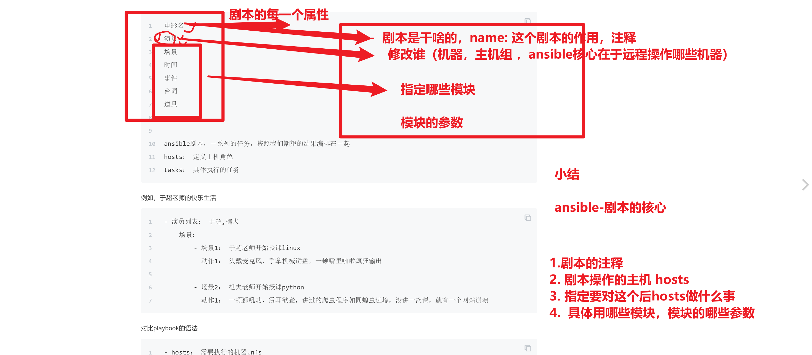
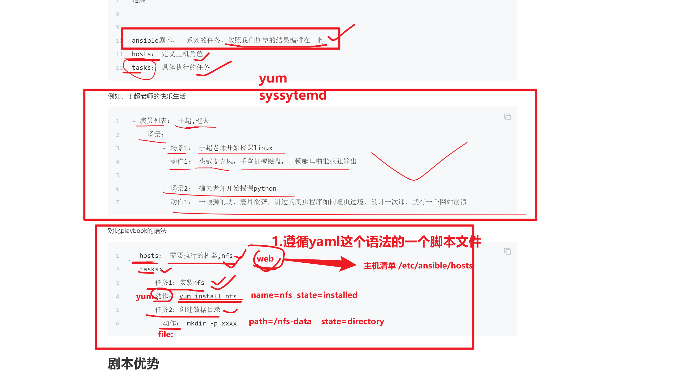
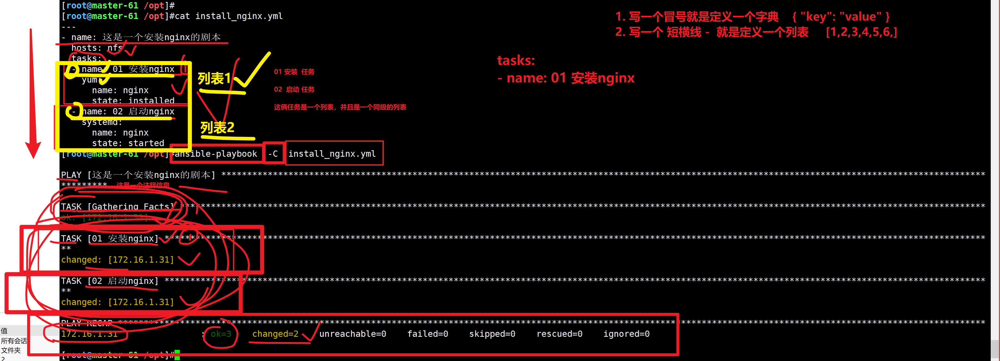

```### 此资源由 58学课资源站 收集整理 ###
	想要获取完整课件资料 请访问：58xueke.com
	百万资源 畅享学习

```
```
1.剧本主题内容

剧本就是两部分大知识点

- ansible的模块（模块的参数）
- yaml语法

3.工作之后
维护公司的剧本
- 看剧本，看懂了，维护，修改
- 修改各种参数，文件路径，文件名字，服务的端口名字（就是该ansible各种模块，参数的值）


2.json语法（网站数据传输，数据传输的最主流的格式）


3. 剧本练习

nfs,rsync,nginx,lsync  网站数据的共享，实时同步


第一阶段
ssh+shell脚本

第二阶段
ansible的 ad-hoc命令模式


写剧本很简单
1.先写好临时ad-hoc命令模式，

部署nginx服务
0.yum源的配置
ansible web -m copy -a "xxxx"


/etc/ansible/hosts

[web]
172.16.1.xx
172.16.1.xx
172.16.1.xx
172.16.1.xx
172.16.1.xx
172.16.1.xx


7,8,9

1.安装软件
ansible web -m yum -a "name=nginx state=installed"

2.修改配置文件（在管理机准备好配置文件，copy远程分发过去）
ansible web -m copy -a "xxx"

3.启动服务
ansible web -m systemd  -a "xxxx"


有了临时命令的语句，转变为剧本的写法，就是学yaml了


yaml语法


第三阶段
ansible-playbook 

61机器，通过执行剧本
- 初始化  nfs,rsync,nginx,lsync这个机器
- 剧本一键部署好这些服务
- 访问测试


```


# ad-hoc命令模式

```
ansible中有两种模式，分别是ad-hoc模式和playbook模式

ad-hoc简而言之，就是"临时命令"
- 临时的看下远程机器的内存信息
- 临时的批量分发一个配置文件
特别小的需求，临时命令就解决

大需求，部署软件，这样的复杂需求，就写剧本


https://docs.ansible.com/ansible/latest/user_guide/intro_adhoc.html
临时命令非常适合您很少重复的任务。例如，如果您想在圣诞节假期关闭实验室中的所有机器。

Ansible ad hoc 命令使用/usr/bin/ansible命令行工具在一个或多个托管节点上自动执行单个任务。ad hoc 命令既快速又简单，但它们不可重复使用。
```


# 剧本是什么




# 剧本语法




ansible-playbook，所必须的yaml语法


# 修改ansible的输出结果为json

```
json 数据转换格式，专有的语法

可以在网络中传输

发给后端 python （python的数据类型，去解析json的数据格式，处理）


也可以发给前端 （js， js解析json的数据格式，然后处理）


运维怎么处理json，jq命令，（获取到json数据后，提取json的数据）


、
# 1.修改ansible的配置文件，让它输出的结果是一个json
[root@master-61 /opt]#vim /etc/ansible/ansible.cfg 

[defaults]
stdout_callback = json
bin_ansible_callbacks = True


json的作用就是
定义了一堆 键值对的数据格式

根据key就可以拿到value

{ "key": "value"  } 读作字典形式


可以看到，此时ansible的命令输出结果，全部变为了json的格式


devops 运维开发
python


都是开发工程师做的
这些json数据，就可以发给后端，去处理，再最终发给前端


```


# yaml学习

## 拿安装nginx的yaml举例

```
yaml风格1
字典参数格式

1.先写好yaml
[root@master-61 /opt]#cat install_nginx.yml 
---
- name: 这是一个安装nginx的剧本
  hosts: nfs
  tasks: 
  - name: 01 安装nginx
    yum: 
      name: nginx
      state: installed
  - name: 02 启动nginx
    systemd:
      name: nginx
      state: started


2.可以去验证yaml语法是否正确

方法1，用ansible-playbook命令
ansible-playbook  -C  install_nginx.yml 


```




## yaml中定义hosts的信息语法

```
# 方式一：定义所管理的主机IP地址
- hosts: 192.168.178.111
  tasks: 
    动作...

# 方式二：定义所管理主机的名字
- hosts: backup01
  tasks:
    动作...

# 方式三：定义管理主机
- hosts: 192.168.178.111, rsync01
  tasks:
    动作...

# 方式四：管理所有主机
- hosts: all
  tasks:
    动作...
```


## 关于剧本的tasks任务部分

- tasks任务部分，就是决定用什么模块，做什么事，以及模块对应的参数的风格


字典风格的模块参数

```
[root@master-61 /opt]#cat install_nginx.yml 
---
- name: 这是一个安装nginx的剧本
  hosts: 172.16.1.7,172.16.1.8,nfs
  tasks: 
  - name: 01 安装nginx
    yum: 
      name: nginx
      state: installed
  - name: 02 启动nginx
    systemd:
      name: nginx
      state: started

```

变量风格的模块参数

```
[root@master-61 /opt]#cat vars_install_nginx.yml 
---
- name: 这是一个安装nginx的剧本
  hosts: 172.16.1.7,172.16.1.8,nfs
  tasks: 
  - name: 01 安装nginx
    yum: name=nginx state=installed 
  - name: 02 启动nginx
    systemd: name=nginx state=started
  - name: 03 设置nginx开机自启
    systemd: name=nginx enabled=yes

```


# yaml支持的数据类型

yaml这个语法中，只有三个数据类型

- 字典类型，特点就是 key : value形式
- 列表形式，特点是 通过 短横线定义
- 纯变量形式


```
数据类型
YAML 支持以下几种数据类型：

对象：键值对的集合，又称为映射（mapping）/ 哈希（hashes） / 字典（dictionary）

数组：一组按次序排列的值，又称为序列（sequence） / 列表（list）

纯量（scalars）：单个的、不可再分的值


我们都以python的数据类型来称呼yaml中支持的数据类型


```


## yaml中字典

```
key : value类型

字典键值对使用冒号结构表示 key: value，冒号后面要加一个空格。

支持字典嵌套


```


## yaml中列表

```
python

[ 1,2,3,"汉字","你好"  ,["我是嵌套的列表，第一个元素"]  ]


shell中也支持列表，（数组）

```


```
以 - 短横线开头，表示构成一个列表


在python中列表形式为 [1,2,3,'a','b','老王']，非常强大

shell也支持列表（数组），表示形式为，功能比较单一
[root@yuchao-tx-server ~]#students=("于超" "老王" "狗蛋")
[root@yuchao-tx-server ~]#
[root@yuchao-tx-server ~]#set|grep students
students=([0]="于超" [1]="老王" [2]="狗蛋")

[root@yuchao-tx-server ~]#echo ${students[0]}
于超
[root@yuchao-tx-server ~]#echo ${students[1]}
老王
[root@yuchao-tx-server ~]#echo ${students[2]}
狗蛋


```

## yaml中纯变量

表示单纯的变量，支持数据类型有

- 字符串
- 布尔值
- 整数
- 浮点数
- Null
- 时间
- 日期


## 练习

写一个安装nfs的playbook,遵循yaml语法


```
1.安装nfs服务

2.创建nfs配置文件

3.启动nfs服务

4.
```

编写如下的yaml语法

```
记住，yaml就三个属性

列表  -


字典  "name":  "我是值"

字典
"students": "我是学生"


"students": 
  - 陈亮亮
    罗兴林
    加强


纯变量
```


现在有一个json的数据格式如下

如下示例，分别用到了 字典，列表，纯变量


```
[
	{
        "老师":"于超",
        "男同学": [陈亮亮,李文杰,王仁刚],
        "女同学": [冯靖涵]
	}
]


手写，转变为yaml格式
```


# yaml支持的数据类型

```
字典
	"key": "value"    ，转化为json类型去看，{ "key":value }
	

纯变量的形式
	
列表的形式

   一个短横线  -   ，转变为json类型看效果 就是  [   ]
   

	
	

```


### 纠错（关于yaml的短横线定义列表）

```

短横线用于定义列表

多个短横线，同一个缩进下的元素，表示一个列表中的多个元素
- xxx
- ooo
- ddd
- ccc

"xxx", "ooo","ddd","ccc"
识别为，同一个列表下的多个元素


一个短横线，同一个缩进下的元素，表示是一个整体，大字符串

- xxx
  ooo
  ddd
  ccc
  
其实处理的数据是 "xxx ooo ddd ccc"


  
```

拿yaml转json测试，查看效果

```
https://www.bejson.com/json/json2yaml/
```


```
具体的yaml

将如下的ad-hoc转为yaml格式

# 1,先写ad-hoc命令模式
#2.对比理解转为yaml


ansible  web   -m  file -a "path=/etc/foo.conf     owner=foo    group=foo     mode=0644"  


# 写name字段，是表示定义剧本的注释，这一次任务的名称
# 写成字典风格的 模块参数
# 同一个缩进下，表示是一个整体，是一个大字符串

- name: 修改文件的属性
  file:
    path: /etc/foo.conf
    owner: foo
    group: foo
    mode: 0644
  
  


```


## 上学学了什么

```
1.yaml语法

2.写ansible-playbook（安装nginx的剧本）


3.json语法


4.jq命令

5. json和yaml转换

6. 一键部署nfs rsync  nginx 剧本


```


# json学习

语法

```
JSON 语法是 JavaScript 对象表示语法的子集。

数据在名称/值对中

数据由逗号分隔

大括号 {} 保存字典

中括号 [] 保存列表，列表可以包含多个对象

```

JSON 值可以是：

- 数字（整数或浮点数）
- 字符串（在双引号中）
- 逻辑值（true 或 false）
- 数组（在中括号中）
- 对象（在大括号中）
- null

## json的语法实例

```
{
    "students":null,
    "age":18,
    "male":true,
    "手机号":[
        152100000000,
        16800000000
    ],
    "你快乐吗":"我很快乐"
}
```

学习如何提取json的数据

```
根据key，提取value

前端通过js代码提取
后端 通过python代码提取

运维通过jq命令提取

```


## jq命令学习

```
1. 安装jq命令
yum install jq -y

2.简单json数据提取

[root@master-61 ~]#echo   '{"name":"德玛西亚","price":6888}'   | jq  

提取名字的值，价格
必须使用jq命令的过滤器，如下的语法

语法是 通过 . 提取，比如 jq '.name,.price'


[root@master-61 ~]#echo   '{"name":"德玛西亚","price":6888}'   | jq  '.name'
"德玛西亚"
[root@master-61 ~]#
[root@master-61 ~]#
[root@master-61 ~]#echo   '{"name":"德玛西亚","price":6888}'   | jq  '.price'
6888
[root@master-61 ~]#
[root@master-61 ~]#
[root@master-61 ~]#echo   '{"name":"德玛西亚","price":6888}'   | jq  '.price,.name'
6888
"德玛西亚"


3.数据再多一点
[root@master-61 ~]#echo   '{"name":"德玛西亚","price":6888,"hero_logo":"https://www.tukuppt.com/muban/zanyjwnk.html"}'   | jq '.price,.hero_logo,.name'
6888
"https://www.tukuppt.com/muban/zanyjwnk.html"
"德玛西亚"


4.串行执行，提取复杂的json数据，数据可能会有列表嵌套

```


# 今日作业

## 1.手写yaml

将如下json转为yaml

```
[
  {
    "0224": {
      "老师": "于超",
      "学生们": [
        {
          "黄彦": [
            {
              "年龄": 23,
              "地址": "深圳"
            }
          ],
          "陈亮亮": [
            {
              "年龄": 24,
              "地址": "广州"
            }
          ],
          "罗兴林": [
            {
              "年龄": 26,
              "地址": "贵州"
            }
          ]
        }
      ]
    }
  }
]
```


## 2.练习jq命令处理json

json资料地址

使用jq命令

```
1.提取出 于超


2.提取出学生列表

3.提取出罗兴林的资料

4.提取出陈亮亮的资料

5.提取出黄彦的地址

6.提取出罗兴林的年龄
```

## 3.一键部署rsync\nfs\nginx

分别编写好剧本

```

```


