```### 此资源由 58学课资源站 收集整理 ###
	想要获取完整课件资料 请访问：58xueke.com
	百万资源 畅享学习

```
# 剧本的高级特性

- 剧本高级特性是完全遵循python的循环结构来的
- 编程语言特有的逻辑控制语句
- 变量
- 循环
- 等等

你的剧本，可以考虑用高级特性，也可以不用

高级特性是为了简化剧本

比如，创建10个系统的用户

```
不用循环
手写

ansible bakcup -m user  -a "name=cc01"
ansible bakcup -m user  -a "name=cc02"
ansible bakcup -m user  -a "name=cc03"
ansible bakcup -m user  -a "name=cc04"

写在剧本中,ad-hoc命令转为剧本模式，转变为了剧本的四个tasks任务元素

- hosts: backup
  tasks:
    - name:  01 创建用户
      user:  "创建用户的参数"
      
    - name:  02 创建用户
      user:  "创建用户的参数"
      
    - name:  03 创建用户
      user:  "创建用户的参数"
      
    - name:  04 启动nginx
      systemd:  "启动服务的参数"  
    
    - name:  04 启动nginx
      systemd:  "启动服务的参数"  
      
      
你觉得这个写法，太繁琐，可以优化
loop循环特性

直接用这种普通办法，也没毛病，这个普通写法，大家都看得懂

改造为了loop写法，


```


## 关于剧本中模块的参数写法

有两个风格

```
风格1，是最正确的字典写法，参数，以字典形式去表示

---
- name: create user test1~5
  hosts: nfs
  tasks:
    - name: create test1
      user: 
        name: test1
        state: present
        
        
        
风格2，简写，这个写法，不属于yaml的语法，只是ansible剧本认识.
# 这叫做一个 缩写，写法，简写写法
# 因为在剧本中，有单独的 关键字vars定义剧本变量


---
- name: create user test1~5
  hosts: nfs
  tasks:
    - name: create test1
      user: "name=test1  state=present"
```


# 循环

```
务必记住，对比理解
ad-hoc命令模式
转化为
yaml剧本模式


最新用法，循环的内置关键字是用loop定义循环变量

item关键字，去提取loop每次循环出来的值

简答理解为shell的for循环就行


# 比较笨的办法


```


## 不用循环，去批量的创建，删除用户

```
[root@master-61 ~/my_scripts]#cat create_user.yml 
- name: create user test1~5
  hosts: backup
  tasks:
    - name: create test1
      user: 
        name: test1
        state: present
    - name: create test2
      user: 
        name: test2
        state: present
    - name: create test3
      user: 
        name: test3
        state: present
    - name: create tes4
      user: 
        name: test4
        state: present
    - name: create test5
      user: 
        name: test5 
        state: present
[root@master-61 ~/my_scripts]#
[root@master-61 ~/my_scripts]#
[root@master-61 ~/my_scripts]#sed -i  's#present#absent#g'  create_user.yml 

```

### 关于loop循环参数的语法


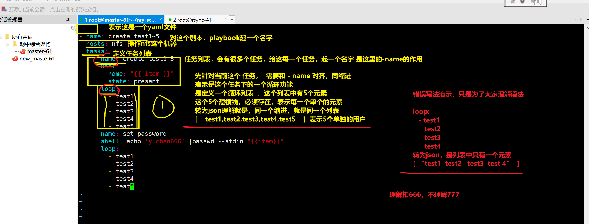


## 创建多个系统用户

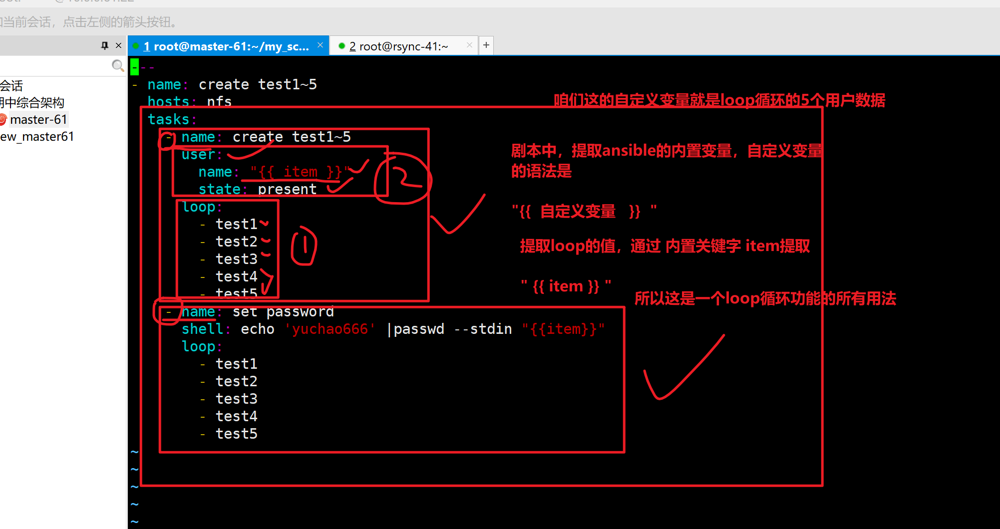


```
[root@master-61 ~/my_scripts]#cat create_user.yml 
---
- name: create test1~5
  hosts: backup
  tasks:
    - name: create test1~5
      user:
        name: "{{ item }}"
        state: present
      loop:
        - test1
        - test2
        - test3
        - test4
        - test5
    - name: set password
      shell: echo 'yuchao666' |passwd --stdin "{{item}}"
      loop:
        - test1
        - test2
        - test3
        - test4
        - test5

```

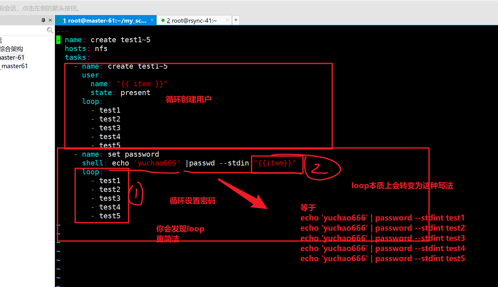


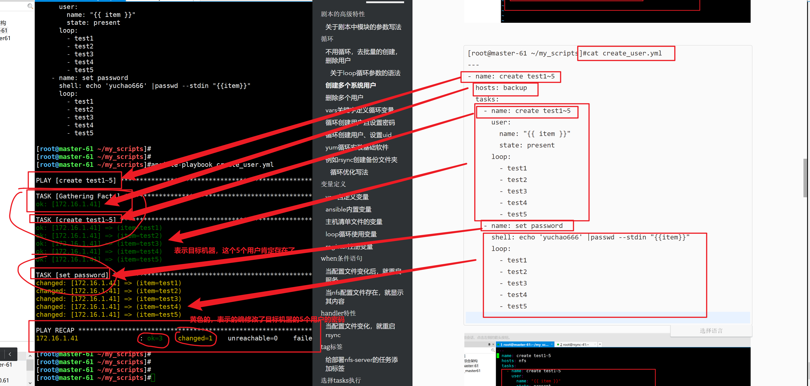


## 删除多个用户

```
[root@master-61 ~/my_scripts]#cat delete_user.yml 
---
- name: delete test1~5
  hosts: backup
  tasks:
    - name: delete user01
      user:
        name: "{{ item }}"
        state: absent
      loop:
        - test1
        - test2
        - test3
        - test4
        - test5


```


## vars关键字定义循环变量

上面会发现已然有重复的变量，还可以再简化

- 通过vars关键字定义用户列表，变量一般定义在任务开始之前
- 通过item关键字提取loop中每次循环的数据

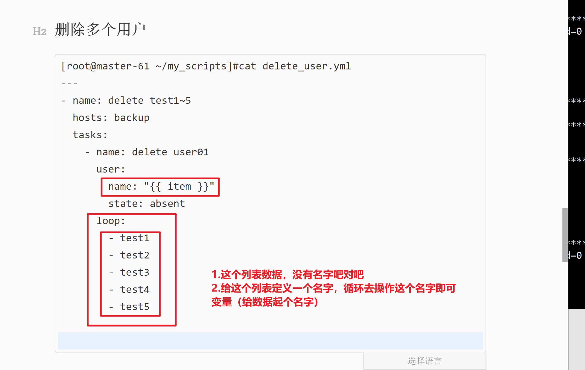


## 循环创建用户且设置密码

### 通过vars关键字，定义好用户列表变量user_list

然后通过loop去循环变量

通过item去提取每次循环的值

这是在通过loop提取列表的值。

loop还可以循环字典的值


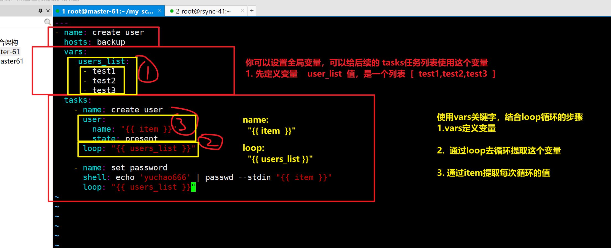

两种风格

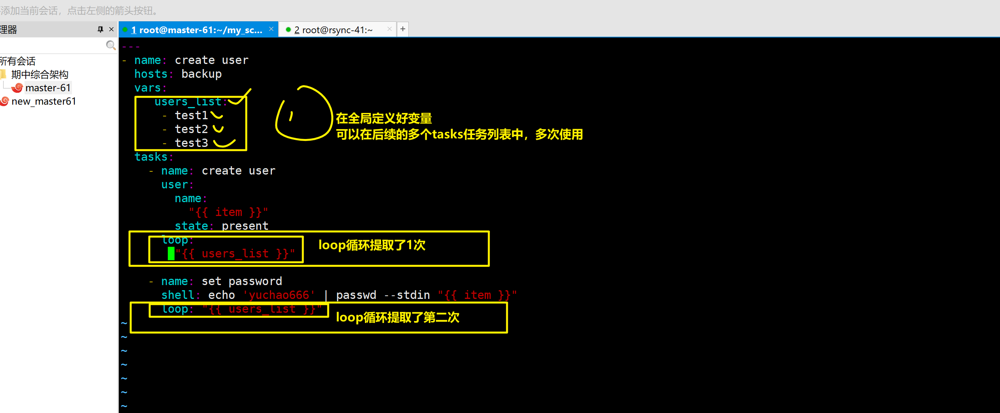


```
---
- name: create user
  hosts: backup
  vars:
     users_list:
      - test1
      - test2
      - test3
  tasks:
    - name: create user
      user:
        name: "{{ item }}"
        state: present
      loop: "{{ users_list }}"

    - name: set password
      shell: echo 'yuchao666' | passwd --stdin "{{ item }}"
      loop: "{{ users_list }}"
```


## loop结合vars循环提取字典的值

循环创建用户，且设置用户uid

结合变量，循环，字典数据，创建用户信息


```
---
- name: create user
  hosts: backup
  vars:
    users_info:
      - {user: 't1', uid: '2000'}
      - {user: 't2', uid: '2001'}
      - {user: 't3', uid: '2002'}
      - {user: 't4', uid: '2003'}

  tasks: 
  - name: create user and uid
    user:
        name: "{{ item.user }}"
        uid: "{{ item.uid }}"


    loop:
      "{{users_info}}"

```


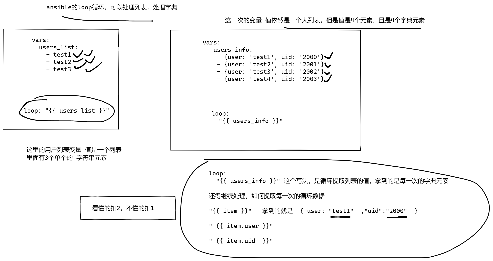


下午3点继续上课。


```
循环
1.  loop关键字用于对某变量进行循环提取值
2.  item去取值
3. "{{ item }}"


变量两个用法

```


## 例如rsync创建备份文件夹

```
比如部署nfs、rsync、nginx的综合剧本；
1.要安装多个软件  nfs-utils   rpcbind  nginx  wget  net-tools vim 
（定义为列表，循环去提取列表中的值，）
loop循环的知识用在 yum安装多个软件


2.创建多个目录rsynd.conf设置了多个备份目录，
ad-hoc临时命令模式
file 创建文件夹
file 创建文件夹
file 创建文件夹

loop循环的知识用在 file创建多个文件

3.复制多个目录
loop循环的知识用在 copy拷贝多个文件


4.每个文件的权限都不一样
```

繁琐的写法

```
- hosts: backup
  tasks:
  - name: 01安装rsync
    yum: 
      name: rsync
      state: installed
  - name: 02 发送配置文件模板
    copy:
      src: /script/rsyncd.conf
      dest: /etc/rsyncd.conf
  - name: 02 发送密码文件
    copy:
      src: /script/rsync.passwd
      dest: /etc/rsync.passwd
      mode: '600'

  - name: 03 创建www用户组
    group:
      name: www
      gid: 1000
  - name: 04 创建www用户
    user:
      name: www
      uid: 1000
      group: www
      create_home: no
      shell: /sbin/nologin
  - name: 05 备份目录创建与授权/data
    file:
      path: /data
      state: directory
      owner: www
      group: www
      mode: '755'
  - name: 06 备份目录创建与授权/backup
    file:
      path: /backup
      state: directory
      owner: www
      group: www
      mode: '755'
  - name: 07 启动服务
    systemd:
      name: rsyncd
      state: started
      enabled: yes
```

### 循环优化写法（利用loop循环的知识点，简化一些操作）

```
前提条件是，原本的动作是重复的，不是重复，就没办法
```

如下yaml

```
- name: yuchaoit.cn
  hosts: backup
  tasks:
  - name: create_data
    file:
      path: "{{ item.file_path }}"
      state: directory
      owner: www
      group: www
      mode: "{{ item.mode }}"
    loop:
      - { file_path:'/data' ,mode:'755' }
      - { file_path:'/backup' ,mode:'755' }
```

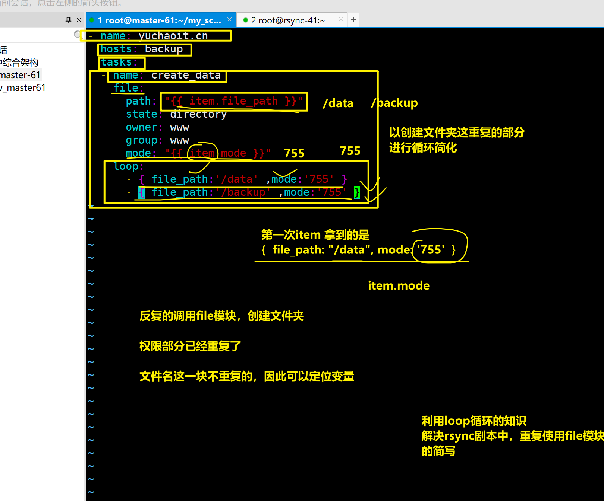


# 变量定义


## vars自定义变量

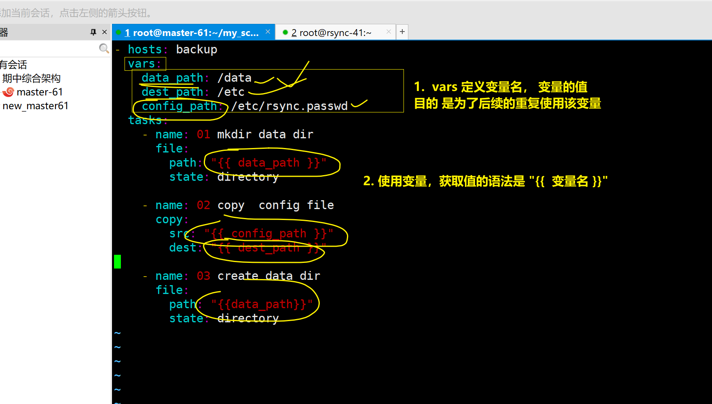

```
- hosts: backup
  vars:
    data_path: /data
    dest_path: /etc
    config_path: /etc/rsync.passwd
  tasks:
    - name: 01 mkdir data dir
      file:
        path: "{{ data_path }}" 
        state: directory

    - name: 02 copy  config file
      copy:
        src: "{{ config_path }}"
        dest: "{{ dest_path }}"
```

## ansible内置变量

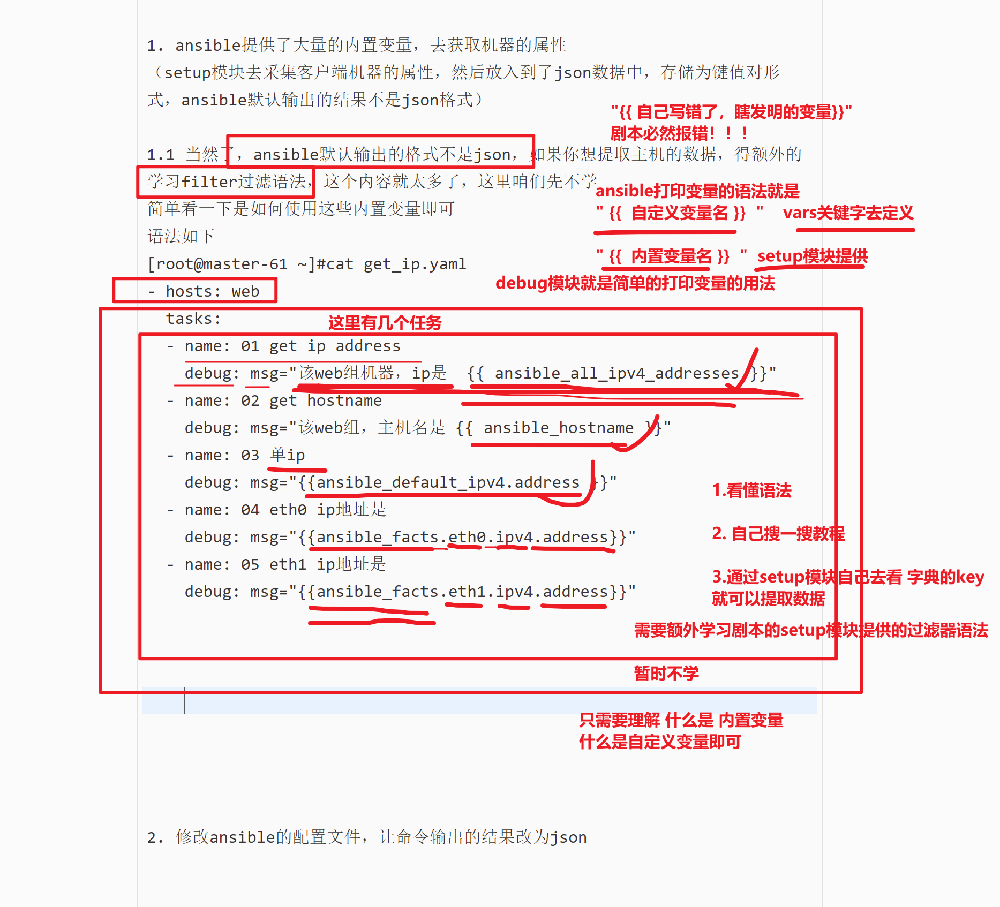


```
ansible默认提供了一个模块，setup模块，

master-61在通过ssh远程连接，操作目标机器的时候
ansible会默认收集这个机器的所有信息，放入到一个setup模块中
这个机器的 主机名，ip地址，mac地址，磁盘数量，是否是虚拟化，cpu核数
所有的这些静态数据


ansible backup -m setup

这个模块会默认采集目标机器的所有静态信息 

1. ansible提供了大量的内置变量，去获取机器的属性
（setup模块去采集客户端机器的属性，然后放入到了json数据中，存储为键值对形式，ansible默认输出的结果不是json格式）

1.1 当然了，ansible默认输出的格式不是json，如果你想提取主机的数据，得额外的学习filter过滤语法，这个内容就太多了，这里咱们先不学
简单看一下是如何使用这些内置变量即可
语法如下
[root@master-61 ~]#cat get_ip.yaml 
- hosts: backup
  tasks:
  - name: 01 get ip address
    debug: msg="该web组机器，ip是  {{ ansible_all_ipv4_addresses }}" 
  - name: 02 get hostname
    debug: msg="该web组，主机名是 {{ ansible_hostname }}"
  - name: 03 单ip
    debug: msg="{{ansible_default_ipv4.address }}"
  - name: 04 eth0 ip地址是
    debug: msg="{{ansible_facts.eth0.ipv4.address}}"
  - name: 05 eth1 ip地址是
    debug: msg="{{ansible_facts.eth1.ipv4.address}}"
    
    
    
    


2. 修改ansible的配置文件，让命令输出的结果改为json


3. 后续的通过jq命令方便的提取数据


4.简单的构造了，模拟setup输出的数据，然后我可以根据key，提取value


```


```
{
    "ansible_facts":{
        "ansible_all_ipv4_addresses":[
            "10.0.0.41",
            "172.16.1.41",
            "192.168.1.41"
        ]
    }
}
```


## 主机清单文件的变量

```
cat /etc/ansible/hosts 

[all:vars]
ansible_port=22999
ansible_password='123123'

[web]
172.16.1.[7:9] 


[nfs]
172.16.1.31

[backup]
172.16.1.41  ansible_port=22  ansible_password='123123'  


```

## loop循环使用变量

```
[root@master-61 ~/my_scripts]#
[root@master-61 ~/my_scripts]#cat loop_install_rsync.yaml 
- name: yuchaoit.cn
  hosts: backup
  vars:
    my_files:
      - { file_path: '/data' ,mode: '755' }
      - { file_path: '/backup' ,mode: '755' }

  tasks:
  - name: create_data
    file:
      path: "{{ item.file_path }}"
      state: directory
      owner: www
      group: www
      mode: "{{ item.mode }}"
    loop:
      "{{ my_files }}"

```

小结

```
关于ansible变量的知识

1. vars定义自定义变量，可以在剧本中使用 ，结合loop循环提取

2. 学了ansible的内置变量，setup模块采集的静态属性，可以通过过滤器语法提取，也可以转为json输出格式，用jq命令提取

3.  主机清单中的变量  /etc/ansible/hosts


4. 注册变量，待会再来


```


## register注册变量

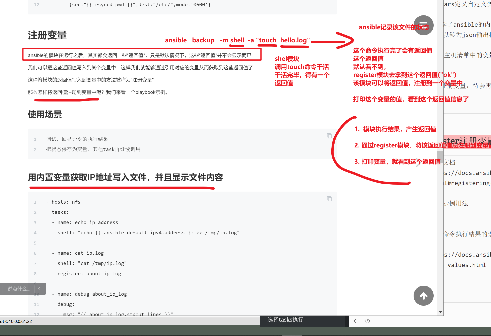

```
官网文档
讲解了 register模块的用法

https://docs.ansible.com/ansible/latest/user_guide/playbooks_variables.html#registering-variables

查看示例用法


关于命令执行结果的返回值信息提取
关于ansible中的返回值提供了哪些参数
比如解释了 msg: "{{ about_ip_log.stdout_lines }}" 这个stdout_lines提取返回值的结果的用法

https://docs.ansible.com/ansible/latest/reference_appendices/common_return_values.html


```


## 获取内置变量的信息，写入到文件，然后读取该文件

```
- hosts: backup
  tasks:
  - name: echo ip address
    shell: "echo {{ ansible_default_ipv4.address }} >> /tmp/ip.log"

  - name: cat ip.log
    shell: "cat /tmp/ip.log"
    register: about_ip_log

  - name: debug about_ip_log
    debug: 
      msg: "{{ about_ip_log.stdout_lines }}"
```

````
1. 执行了个命令，默认有返回值

2.  通过register提取该返回值，写入到变量

3. 通过debug模块，msg参数 ，打印了这个变量的信息
````


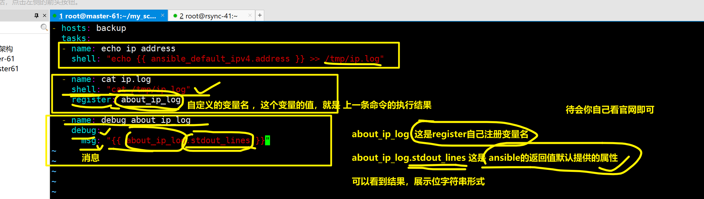


## 注册多个变量

执行多个命令，并且注册多个变量，提取多个返回值，

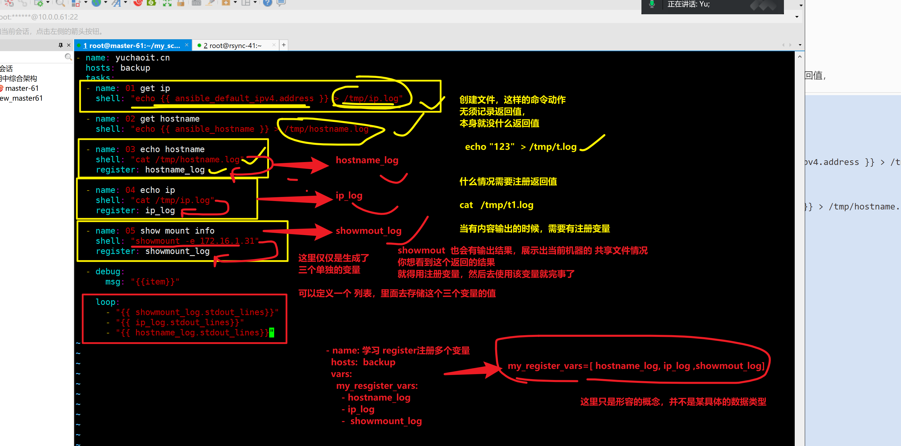

--

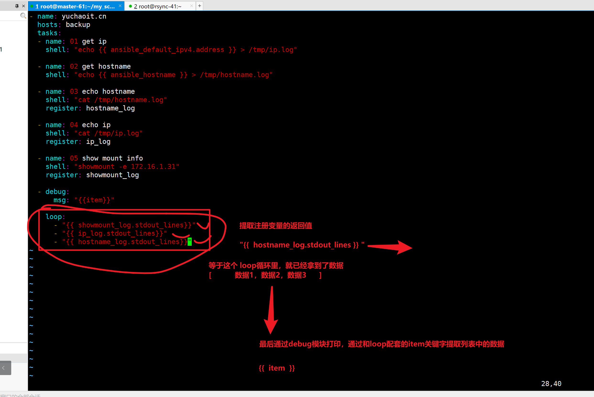


实践得出真知

```
[root@master-61 ~/my_scripts]#cat test2_register.yml 
- name: yuchaoit.cn
  hosts: backup
  tasks:
  - name: 01 get ip
    shell: "echo {{ ansible_default_ipv4.address }} > /tmp/ip.log"

  - name: 02 get hostname
    shell: "echo {{ ansible_hostname }} > /tmp/hostname.log"

  - name: 03 echo hostname
    shell: "cat /tmp/hostname.log"
    register: hostname_log

  - name: 04 echo ip
    shell: "cat /tmp/ip.log"
    register: ip_log

  - name: 05 show mount info
    shell: "showmount -e 172.16.1.41"
    register: showmount_log

  - debug:
      msg: "{{item}}"

    loop:
      - "{{ showmount_log.stdout_lines}}"
      - "{{ ip_log.stdout_lines}}"
      - "{{ hostname_log.stdout_lines}}"

```


```
- name: yuchaoit.cn
  hosts: backup
  tasks:
  - name: 01 get ip
    shell: "echo {{ ansible_default_ipv4.address }} > /tmp/ip.log"

  - name: 02 get hostname
    shell: "echo {{ ansible_hostname }} > /tmp/hostname.log"

  - name: 03 echo hostname
    shell: "cat /tmp/hostname.log"
    register: hostname_log

  - name: 04 echo ip
    shell: "cat /tmp/ip.log"
    register: ip_log

  - name: 05 show mount info
    shell: "showmount -e 172.16.1.31"
    register: showmount_log

  - debug:
      msg: "{{item}}"

    loop:
      - "{{ showmount_log.stdout_lines}}"
      - "{{ ip_log.stdout_lines}}"
      - "{{ hostname_log.stdout_lines}}"
```


下一个知识点

```
register注册变量
1. 获取命令的执行结果（返回值）
2. 这个返回值被注册为变量之后，可以交给后续的任务去使用
3. 这个注册变量（命令的返回值），还提供了很多的功能去使用
3.1 获取返回值的文本信息
my_log.stdout_lines


写一个示例
copy:  src='xxx'   dest='/etc/rsyncd.conf'
shell:  "cat  /etc/rsyncd.conf" 
register: my_config

my_config.changed   # 判断这个返回值，如果有更改，说明


4.想知道关于注册变量的返回值，可以用哪些方法，看这个官网即可


https://docs.ansible.com/ansible/latest/reference_appendices/common_return_values.html
关于命令的返回结果，可以使用的所有方法


```

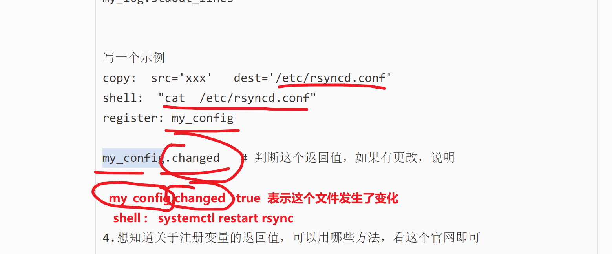


## 判断当配置文件变化后，就重启服务（register+when）.

yaml作用是判断配置文件变化后，就重启服务

```
1. 你以前写的剧本
都是固定的，定义tasks任务列表
1. 修改配置文件（判断配置文件是否变化）
2. 重启服务（只有配置文件变化，才有必要重启服务，否则是没变要）
3.
```


```
register和when都是针对tasks任务列表下，某一个任务设置的
- name:  01  修改配置文件
  register

- name: 02 重启服务


作用分别是
1.获取某任务的命令执行结果（返回值） register
 
2.利用when条件判断，针对返回值的不同状态（决定做什么事） ，ansible进阶篇，都是在大量使用编程语言的特性，以及语法了


```


我们重启配置服务的标准是，修改了配置文件，否则无须重启

例如，判断rsyncd.conf文件状态发生变化后，就重启服务。


```
- name: yuchaoit.cn
  hosts: backup
  tasks:
  - name: 01 copy rsyncd.conf
    copy: src=/script/rsyncd.conf dest=/etc/
    register: conf_status

  - name: 02 start rsyncd.service
    systemd: name=rsyncd state=started enabled=yes


  - name: 03 restart rsyncd.service
    systemd:
      name: rsyncd
      state: restarted
    when: conf_status.changed
```

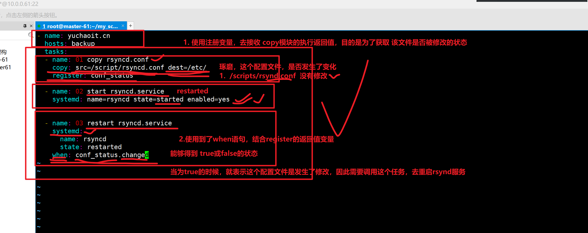

---

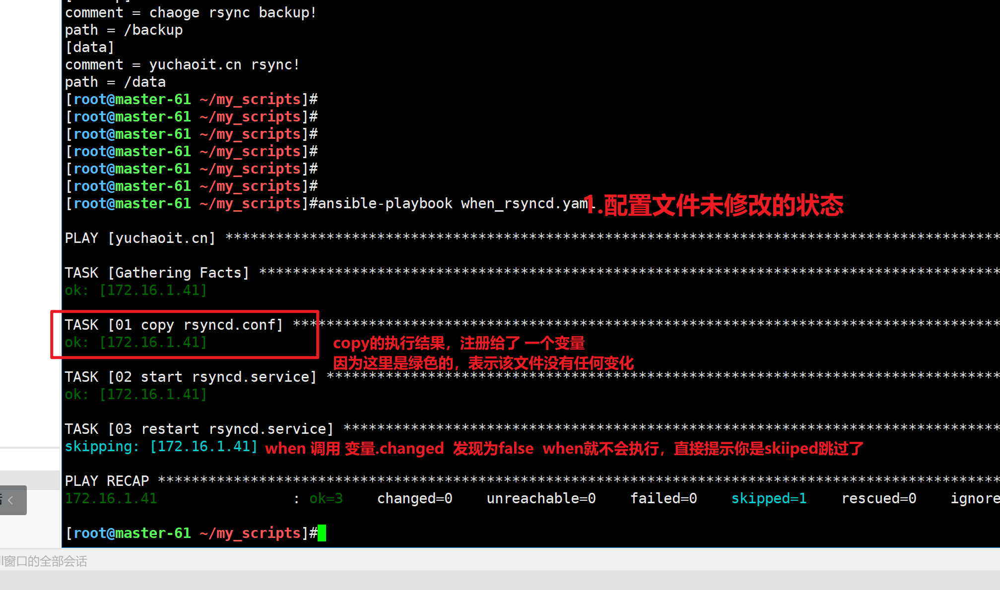

---

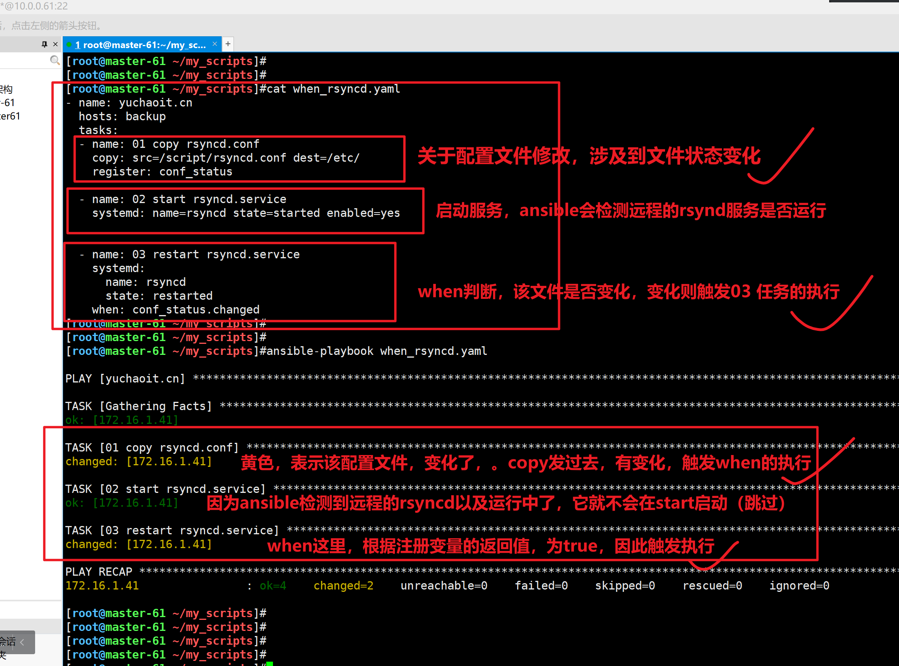


````
关于注册变量，以及注册变量.changed属性
结合when的一个实际应用成精

````


# when条件语句

官网文档

```
文档
https://docs.ansible.com/ansible/latest/user_guide/playbooks_conditionals.html
```

## 当nfs配置文件存在，就显示其内容

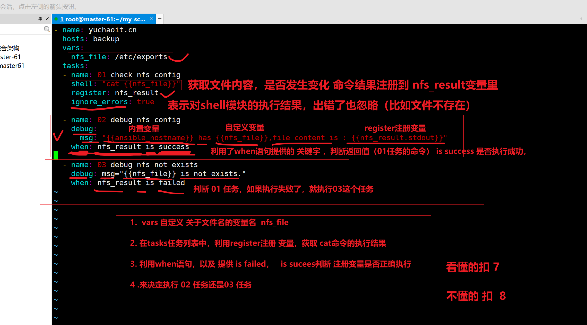


```
- name: yuchaoit.cn
  hosts: backup
  vars:
    nfs_file: /etc/exports
  tasks:
  - name: 01 check nfs config
    shell: "cat {{nfs_file}}"
    register: nfs_result
    ignore_errors: true

  - name: 02 debug nfs config
    debug:
      msg: "{{ansible_hostname}} has {{nfs_file}},file content is : {{nfs_result.stdout}}"
    when: nfs_result is success

  - name: 03 debug nfs not exists
    debug: msg="{{nfs_file}} is not exists."
    when: nfs_result is failed
```


余下的知识点

```
1.  剧本提供的handler特性，是专门用于实现，任务触发的模块，机制 
- 当你改了配置文件，是必须得重启服务
- /etc/exports           systemctl restart nfs
- /etc/nginx/nginx.conf    systemctl restart nginx

文件变化，则重启
文化不变化，则无序重启


利用了register+when 这俩结合，实现了 判断文件变化，才重启程序

2.其实ansible还提供了更专业的 handler机制

官网文档
https://docs.ansible.com/ansible/latest/user_guide/playbooks_handlers.html


```


# handler特性

```
有任务1,发生变化后 必须要执行任务2

使用handler特性


```


## 不恰当的例子

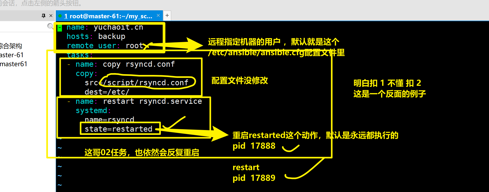


```
[root@master-61 ~]#cat restart_rsync.yaml 
- name: yuchaoit.cn
  hosts: backup
  remote_user: root
  tasks:
  - name: copy rsyncd.conf
    copy:
      src=/script/rsyncd.conf
      dest=/etc/
  - name: restart rsyncd.service
    systemd:
      name=rsyncd
      state=restarted
```


## 当配置文件变化，就重启rsync

handler+ notify 这两个关键字，来组合定义一个

```
任务1，一旦发生变化

触发任务2的必然执行

```

具体的yaml

解读handler和notify的机制

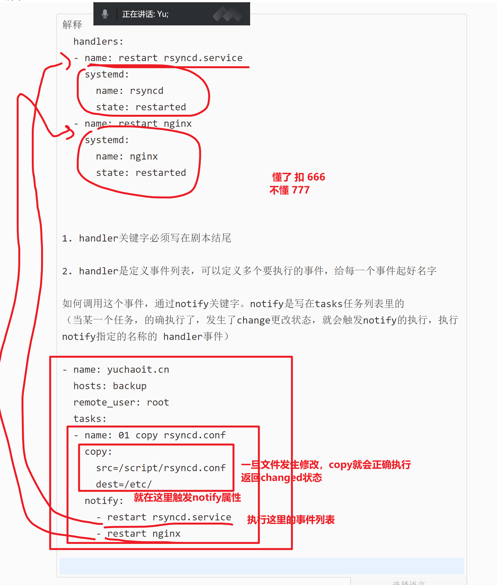


```
解释
  handlers:
  - name: restart rsyncd.service
    systemd:
      name: rsyncd
      state: restarted
  - name: restart nginx
    systemd:
      name: nginx
      state: restarted
      
      
      
1. handler关键字必须写在剧本结尾

2. handler是定义事件列表，可以定义多个要执行的事件，给每一个事件起好名字

如何调用这个事件，通过notify关键字。notify是写在tasks任务列表里的
（当某一个任务，的确执行了，发生了change更改状态，就会触发notify的执行，执行notify指定的名称的 handler事件）

- name: yuchaoit.cn
  hosts: backup
  remote_user: root
  tasks:
  - name: 01 copy rsyncd.conf
    copy:
      src=/script/rsyncd.conf
      dest=/etc/
    notify:
      - restart rsyncd.service
      - restart nginx
      
      
```


```
- name: yuchaoit.cn
  hosts: backup
  remote_user: root
  tasks:
  - name: 01 copy rsyncd.conf
    copy:
      src=/script/rsyncd.conf
      dest=/etc/
    notify:
      - restart rsyncd.service

  handlers:
  - name: restart rsyncd.service
    systemd:
      name: rsyncd
      state: restarted
```

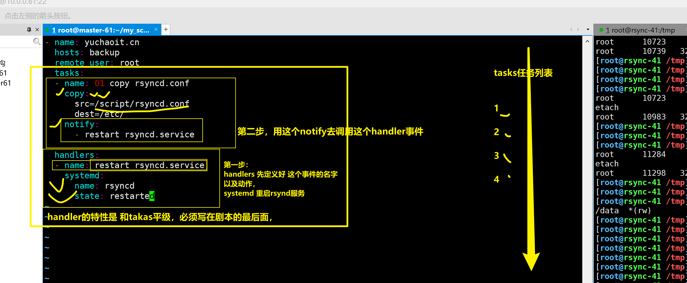


# tag标签


## 给部署nfs-server的任务添加标签

```
- name: yuchaoit.cn
  hosts: nfs
  tasks:
  - name: 01 安装nfs-utils 服务
    yum: name=nfs-utils state=installed
    tags: 01_install_nfs_service

  - name: 02 安装rpcbind 服务
    yum: name=rpcbind state=installed
    tags: 02_install_rpcbind_service

  - name: 03 创建组
    group: name=www gid=666
    tags: 03_add_group

  - name: 04 创建用户
    user: name=www uid=666 group=www create_home=no shell=/sbin/nologin
    tags: 04_add_user

  - name: 05 创建共享目录
    file: path=/data owner=www group=www state=directory
    tags: 05_create_data_dir

  - name: 06 拷贝配置文件
    copy: src=/script/exports dest=/etc/exports
    tags: 06_copy_nfs_exports

  - name: 07 创建关于rsync密码文件
    copy: content='yuchao666' dest=/etc/rsync.passwd mode=600
    tags: 07_create_rsync_passwd

  - name: 08 启动rpcbind
    service: name=rpcbind state=started enabled=yes
    tags: 08_start_rpcbind

  - name:  09 启动nfs
    systemd: name=nfs state=started enabled=yes
    tags: 09_start_nfs
```

## 列出查看当前剧本有没有标签可用

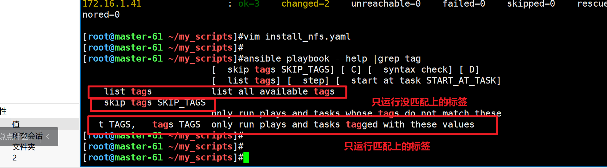

```
[root@master-61 ~/my_scripts]#ansible-playbook --list-tags install_nfs.yaml 

playbook: install_nfs.yaml

  play #1 (nfs): yuchaoit.cn	TAGS: []
      TASK TAGS: [01_install_nfs_service, 02_install_rpcbind_service, 03_add_group, 04_add_user, 05_create_data_dir, 06_copy_nfs_exports, 07_create_rsync_passwd, 08_start_rpcbind, 09_start_nfs]

```

## 选择运行某个标签

```
[root@master-61 ~/my_scripts]#ansible-playbook -t 01_install_nfs_service    install_nfs.yaml 

PLAY [yuchaoit.cn] ****************************************************************************************

TASK [Gathering Facts] ************************************************************************************
ok: [172.16.1.41]

TASK [01 安装nfs-utils 服务] **********************************************************************************
changed: [172.16.1.41]

PLAY RECAP ************************************************************************************************
172.16.1.41                : ok=2    changed=1    unreachable=0    failed=0    skipped=0    rescued=0    ignored=0   


```

## 跳过某些个标签

跳过，5 6 7 标签指定的任务了，执行了 

1 2 3 4 8 9 

```
[root@master-61 ~/my_scripts]#ansible-playbook --skip-tags  05_create_data_dir,06_copy_nfs_exports,07_create_rsync_passwd    install_nfs.yaml 

```


# 选择tasks执行

## 1.列出当前剧本有多少个任务（查看任务列表）


```
 --list-tasks          list all tasks that would be executed
查看有多少个任务需要执行，以及该任务是否有tag标签

[root@master-61 ~/my_scripts]#ansible-playbook --list-tasks  install_nfs.yaml 

playbook: install_nfs.yaml

  play #1 (backup): yuchaoit.cn	TAGS: []
    tasks:
      01 安装nfs-utils 服务	TAGS: [01_install_nfs_service]
      02 安装rpcbind 服务	TAGS: [02_install_rpcbind_service]
      03 创建组	TAGS: [03_add_group]
      04 创建用户	TAGS: [04_add_user]
      05 创建共享目录	TAGS: [05_create_data_dir]
      06 拷贝配置文件	TAGS: [06_copy_nfs_exports]
      07 创建关于rsync密码文件	TAGS: [07_create_rsync_passwd]
      08 启动rpcbind	TAGS: [08_start_rpcbind]
      09 启动nfs	TAGS: [09_start_nfs]


```

## 2.指定从哪个tasks开始运行

```
  --start-at-task START_AT_TASK

ansible-playbook --start-at-task  "07 创建关于rsync密码文件"  install_nfs.yaml
```

# 最后，最后总结

ansible-playbook 剧本相关的知识点就讲完了，今天的内容，比较难

做好笔记，以后自己面试遇见了回头看笔记，复习

工作中写剧本，是否用这些高级特性，不一定

但是你必须得看懂，以及你自己尝试在剧本中，添加，使用这些特性，需要慢慢的积累。

```
学了你就得会写。、

```

吧今天所学，整理整理

辛苦大家了， 明天9.30继续上课，今天好好休息吧。冲冲冲

88

视频，笔记，待会发出去。


