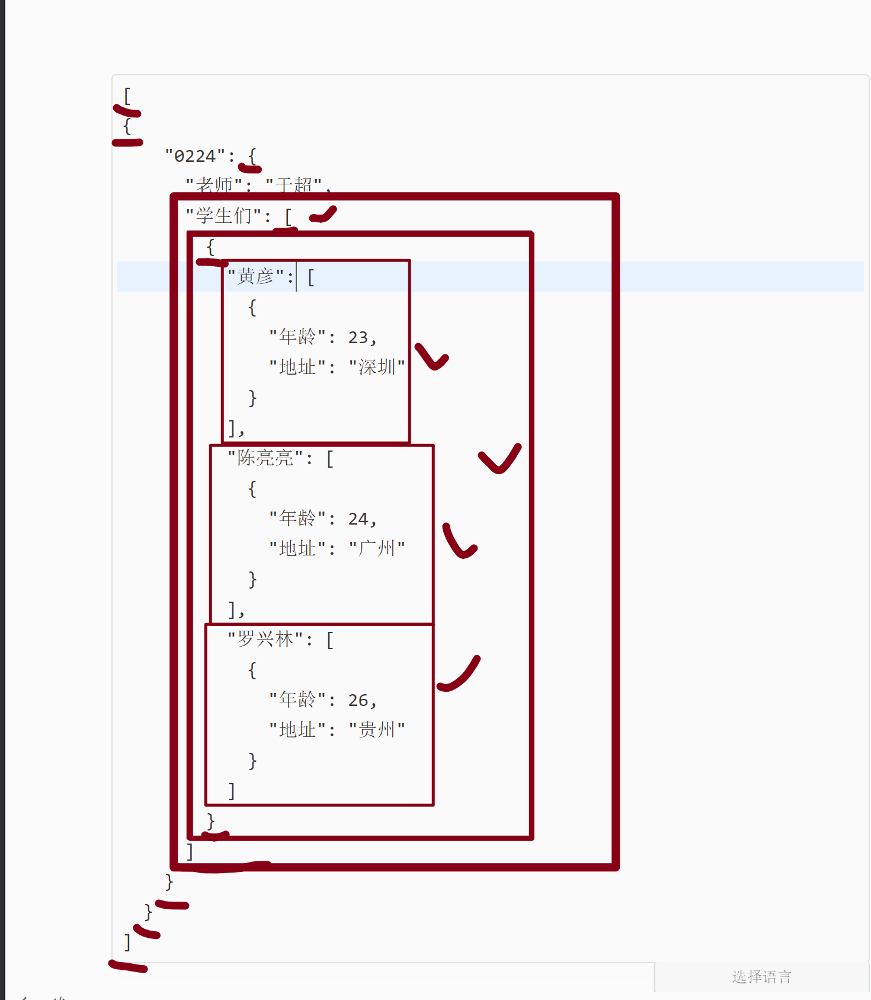
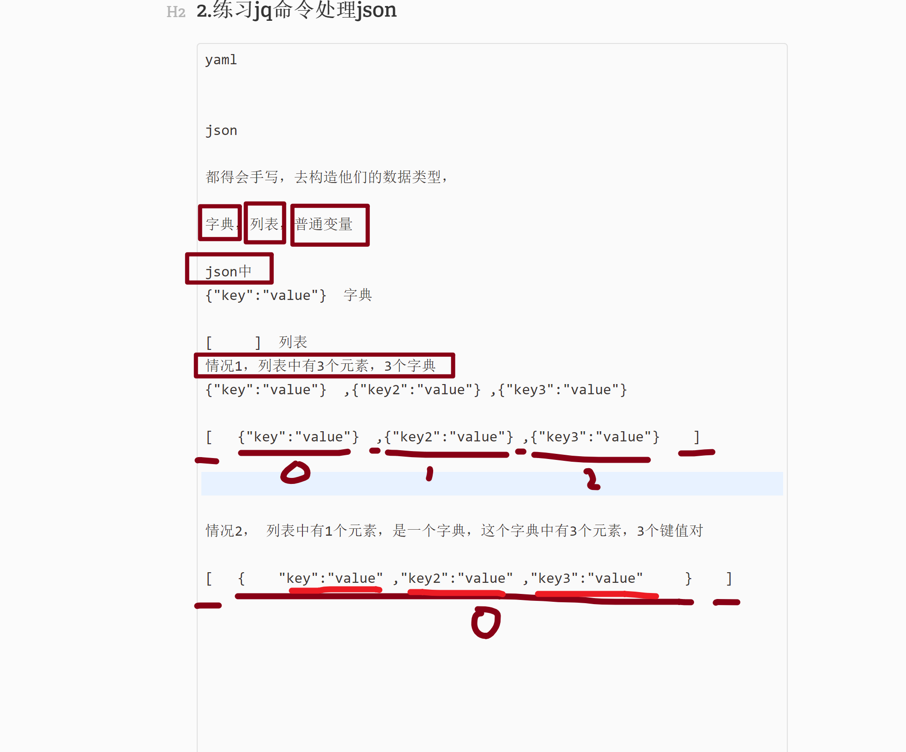
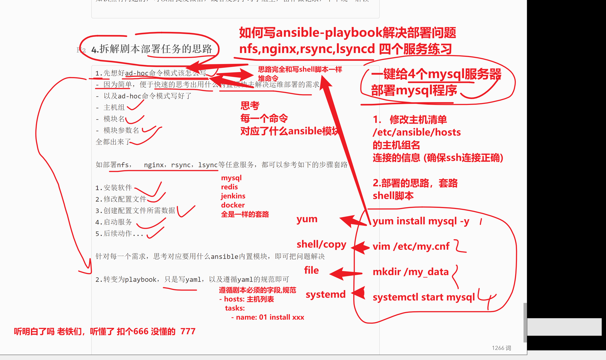
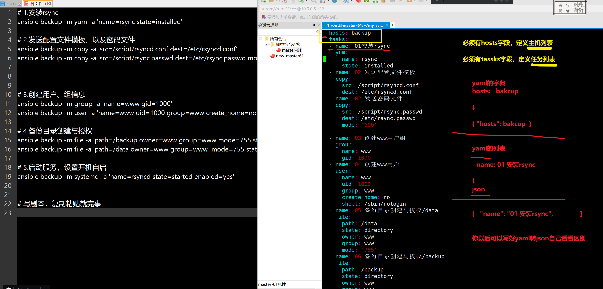
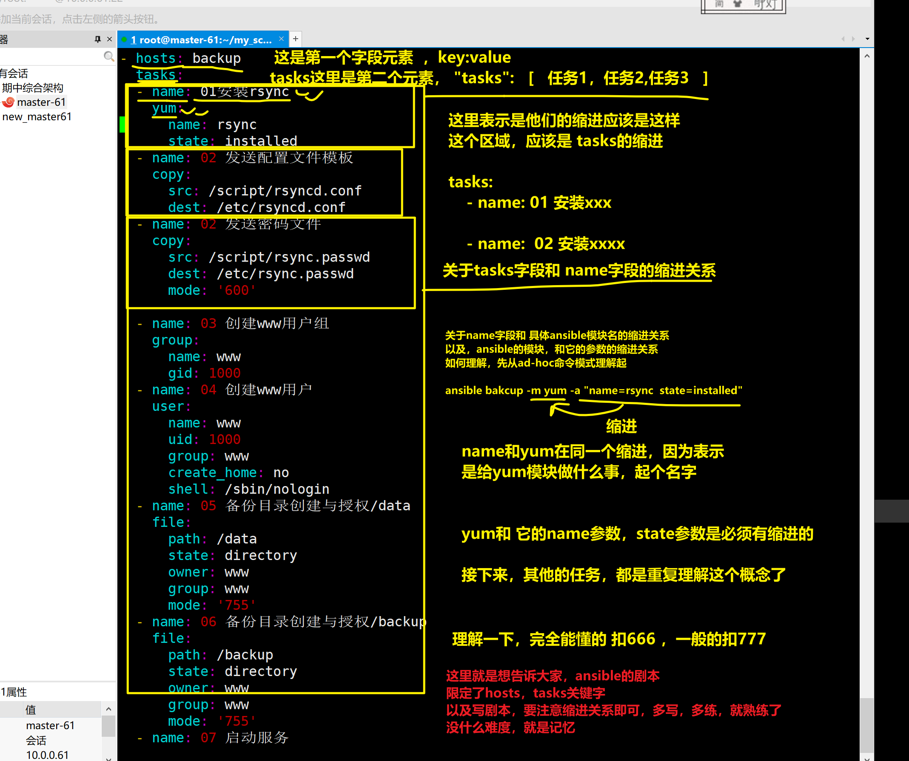
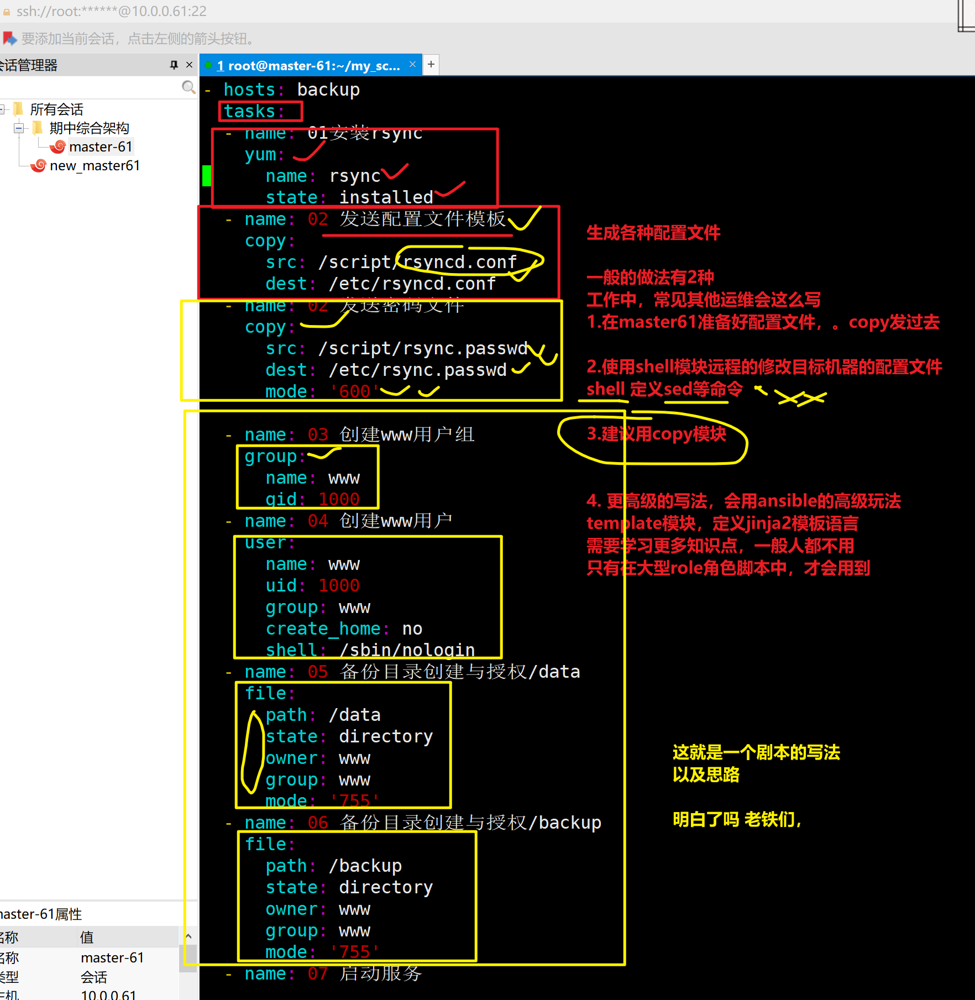
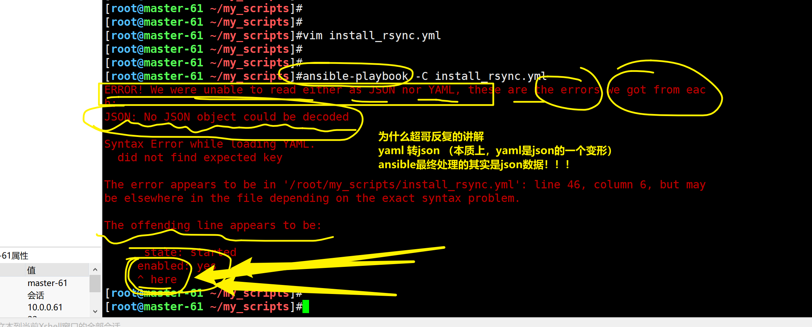

```### 此资源由 58学课资源站 收集整理 ###
	想要获取完整课件资料 请访问：58xueke.com
	百万资源 畅享学习

```
# 今日作业

## 1.手写yaml


```
json这个数据交互格式，语法是如下，是用于在网络中进行数据传输的
{ "key": "value" , "key2":"value2"  }

json传递给后端后，后端需要解析为当前编程语言的数据类型，才可以继续使用，解析
python举例

json数据 ，如{ "key": "value" , "key2":"value2"  }

发给python后，要进行解析 ↓

python中的字典类型，{ "key": "value" , "key2":"value2"  }


```


```
yaml是一个数据交互格式的类型，用在很多软件中
比如 ansible-playbook 使用了yaml语法
saltstack   也是使用yaml写脚本
docker file
k8s资源文件
以及如今云原生的各种软件也都支持yaml语法


```


将如下json转为yaml

yaml > json

看到每一个json的数据类型符号，就立即想到对应了yaml的什么符号，生成对应的数据类型





你写完yaml后，一定要用在线格式转换工具，转为json对比是否正确

- 你在初学阶段，想学好，必须手写能看懂语法
- 但是以后再实际应用，没人会去手写，都是工具转换

```
[
{
    "0224": {
      "老师": "于超",
      "学生们": [
        {
          "黄彦": [
            {
              "年龄": 23,
              "地址": "深圳"
            }
          ],
          "陈亮亮": [
            {
              "年龄": 24,
              "地址": "广州"
            }
          ],
          "罗兴林": [
            {
              "年龄": 26,
              "地址": "贵州"
            }
          ]
        }
      ]
    }
  }
]
```


正确的yaml如下

```yaml
- "0224":               
    "老师": "于超"
    "学生们":
      - "黄彦": 
          - "年龄": 23
            "地址": "深圳"
        "陈亮亮":
          - "年龄": 24
            "地址": "广州"
        "罗兴林":
          - "年龄": 26
            "地址": "贵州"

```


shell

```bash
echo '基尼太美'
```


```python
import time
print("基尼太美")
```


## 2.练习jq命令处理json



```
yaml
	

json

都得会手写，去构造他们的数据类型，

字典，列表，普通变量

json中
{"key":"value"}  字典

[     ]  列表  
情况1，列表中有3个元素，3个字典 
{"key":"value"}  ,{"key2":"value"} ,{"key3":"value"} 

[   {"key":"value"}  ,{"key2":"value"} ,{"key3":"value"}    ]


情况2， 列表中有1个元素，是一个字典，这个字典中有3个元素，3个键值对

[   {    "key":"value" ,"key2":"value" ,"key3":"value"     }    ]

才能够熟练的转化为yaml的数据类型写法

yaml比较难直接看懂
json更容易看懂


```


json资料地址

```
[
{
    "0224": {
      "老师": "于超",
      "学生们": [
        {
          "黄彦": [
            {
              "年龄": 23,
              "地址": "深圳"
            }
          ],
          "陈亮亮": [
            {
              "年龄": 24,
              "地址": "广州"
            }
          ],
          "罗兴林": [
            {
              "年龄": 26,
              "地址": "贵州"
            }
          ]
        }
      ]
    }
  }
]
```


使用jq命令

```
1.提取出 于超
[root@master-61 ~]#cat test1.json |   jq '.[0]   |  ."0224"   |  ."老师"'


2.提取出学生列表

[root@master-61 ~]#cat  test1.json |  jq '.[0]  |  ."0224"  |  ."学生们"  '

2.1 提取出这个列表中的值
[root@master-61 ~]#cat  test1.json |  jq '.[0]  |  ."0224"  |  ."学生们" |  .[0]   '


3.提取出罗兴林的资料
[root@master-61 ~]#cat test1.json | jq  ' .[] |  ."0224"  |  ."学生们"  |  .[]  |  ."罗兴林"  |  .[]  |  ."年龄",."地址"  '
26
"贵州"


4.提取出陈亮亮的资料
[root@master-61 ~]#cat test1.json | jq  ' .[] |  ."0224"  |  ."学生们"  |  .[]  |  ."陈亮亮"  |  .[]  |  ."年龄",."地址"  '
24
"广州"


5.提取出黄彦的地址
[root@master-61 ~]#cat test1.json | jq  ' .[] |  ."0224"  |  ."学生们"  |  .[]  |  ."黄彦"  |  .[]  |  ."地址"  '
"深圳"


6.提取出罗兴林的年龄

[root@master-61 ~]#cat test1.json | jq  ' .[] |  ."0224"  |  ."学生们"  |  .[]  |  ."罗兴林"  |  .[]  |  ."年龄"  '
26

```


## 3.一键部署rsync\nfs\nginx

```
一键部署，能够通过脚本化，整合所有的部署操作，以及一些优化操作；

部署每一个服务，一个服务，一个剧本；

一个install.yml 脚本，所有的服务全给装好了  150行
（nfs，rsync，nginx）
ansible-playbook install.yml


一大堆日志，你连调试都很难调试
日志就是ansible记录下，远程操作了服务器，返回的修改状态，修改结果

1.你的剧本执行的是正确的
2.远程服务器返回的执行结果也是正确的，状态是没问题的

所以，建议一个服务一个剧本

install_nfs.yml

install_nginx.yaml

...

```


分别编写好剧本


```
ansible 这一部分知识点的重点


1.  ad-hoc命令去临时批量管理服务器，临时分发配置文件

2.  ansible-playbook，部署复杂任务（学习部署的规范）

3.  可能有的运维会用role去部署程序（）

10.15继续，下课休息

知识点有问题的，可以给我发微信，或者发到学习小组里，留作做记录，下午统一解读

```


## 4.拆解剧本部署任务的思路



```
1.先想好ad-hoc命令模式该怎么写
- 因为简单，便于快速的思考出用什么内置模块去解决运维部署的需求
- 以及ad-hoc命令模式写好了
- 主机组
- 模块名
- 模块参数名
全都出来了

如部署nfs，  nginx，rsync，lsync等任意服务，都可以参考如下的步骤套路

1.安装软件
2.修改配置文件
3.创建配置文件所需数据
4.启动服务
5.后续动作...

针对每一个需求，思考对应要用什么ansible内置模块，即可把问题解决

2.转变为playbook，只是写yaml，以及遵循yaml的规范即可


```

## 5.部署rsync服务

```
1.整个部署nfs，rsync，nginx，lsync的正确剧本，写好了参考示例
http://apecome.com:9495/01-%E7%BB%BC%E5%90%88%E6%9E%B6%E6%9E%84%E5%BC%80%E7%AF%87/12-Ansible-playbook%E5%89%A7%E6%9C%AC.html#%E5%AE%9E%E6%88%98rsync%E5%89%A7%E6%9C%AC%E5%BC%80%E5%8F%91


2.做一个基本演示


3.今天作业，必须录制个视频，演示如下操作
1.被管理机器，手动初始化
2.通过master-61机器，安装剧本（对你的剧本做简单解释），完成服务部署
3.演示实时同步网站数据的部署操作


```






这个剧本这样写

其他剧本也是一样

大家如果开始不会写，参考我的博客，抄写就行，权当锻炼yaml的写法，palybook的字段写法

注意，一定要手巧，千万不能去复制粘贴，你需要理解这个过程

注意，一定要手巧，千万不能去复制粘贴，你需要理解这个过程

注意，一定要手巧，千万不能去复制粘贴，你需要理解这个过程

注意，一定要手巧，千万不能去复制粘贴，你需要理解这个过程




```
测试ansible的剧本执行，可以用-C参数
模拟剧本的执行，但是不会生成实际效果，一般用于临时调试剧本的正确性


但是有些情况下，有些tasks任

任务3，创建文件夹

任务4，需要用到这个文件夹 会导致任务4失败

这些特殊情况，
如果你用-C测试剧本

1. ansible-palybook -C  install-rsync.yml   
直接报错语法错误（缩进错误，修复缩进）

2. 添加-C，剧本的语法是正确的，但是某个任务失败了，
你可以去掉-C参数，继续测试脚本运行


  - name: 07 启动服务
    systemd:
      name: rsyncd
      state: started
     enabled: yes
                      
                      
                    1.  这是ansible的yaml语法错误（不是同级，属于yaml语法错误）
                     2.  还是ansible的模块参数用法错误？


```




## 6.梳理剧本的操作全过程

```
1.1.写好ad-hoc命令模式，便于转变剧本

2. 写ansible-playbook剧本，遵循正确的yaml，以及剧本规范

3.创建剧本中使用到的对应的数据文件
  - name: 02 发送配置文件模板
    copy:
      src: /script/rsyncd.conf
      dest: /etc/rsyncd.conf

mkdir  /script/
touch /script/rsyncd.conf
vim /script/rsyncd.conf


4.才是测试剧本运行

ansible-playbook   -C  install_rsync.yml 

5.正确安装剧本

ansible-playbook  install_rsync.yml 

6.验证rsync是否可用

master61数据同步

7.确认
install_rsync.yml 的确一键部署，安装好了rsync服务端

8.其他服务，按照这个思路来操作就，重复操作即可

===============================================
关于ansible-palybook的编写思路，语法，yaml语法，rsync实践过程，是否理解了。

11.15继续

去各自微信小组，回复3,2,1掌握情况


```


