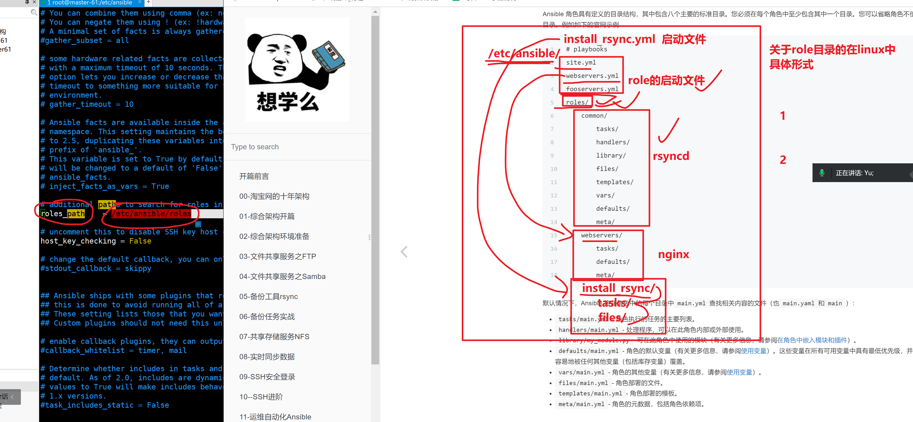

```### 此资源由 58学课资源站 收集整理 ###
	想要获取完整课件资料 请访问：58xueke.com
	百万资源 畅享学习

```
# role的官网介绍，与解释


## ansible-role的实际理念


# 为什么用role


```
把单个的大剧本，拆分为小剧本，便于维护，修改、使用

完成解耦、结构更清晰、调试更方便

如果是小部署， 还是剧本更方便
大型项目，必须通过role管理

在实际的工作当中，一个完整的项目实际上是很多功能体的组合，如果将所有的功能写在一个playbook中会存在如代码耦合程度高、playbook长而维护成本大、灵活性低等一系列的问题。

使用roles能巧妙的解决这一系列的问题。

roles是ansible1.2版本后加入的新功能，适合于大项目playbook的编排架构。
```


# 具体role的用法




```
1.难度会大大降低
role理念就是把你以前部署的playbook进行拆分，拆成固定的目录格式


2. 你来了新任务，直接基于role去部署


等于
ad-hoc 临时命令
再去写成palybook


```


# 先明确，创建好role的规范目录

```
1.定义好role存放路径
[root@master-61 /etc/ansible]#grep '^role' /etc/ansible/ansible.cfg 
roles_path    = /etc/ansible/roles


2. 创建role的固定目录
# yuchaoit.cn  ansible-role
site.yml                    # role入口
nfs_servers.yml             # role
rsync_servers.yml           # role
roles/                      # role规范目录结构
    nfs_servers/            # role具体名字
        tasks/              # 剧本任务
        handlers/           # 剧本里存放的handlers
        files/              # 如压缩文件，如需要拷贝的文件
        templates/          # 存放配置文件
        vars/               # 存放变量文件
    rsync_servers/
        tasks/
        handlers/
        files/
        templates/
        vars/
        
3. 创建如上的目录结构

mkdir -p /etc/ansible/roles
# 这里定义的文件名，必须和roles目录下的每一个任务目录同名
touch  /etc/ansible/{site.yml,nfs_servers.yml,rsync_servers.yml}

4. 创建关于rsync_servers的目录
mkdir -p /etc/ansible/roles/rsync_servers/{tasks,handlers,files,templates,vars}


5.检查创建好的目录结构
[root@master-61 /etc/ansible]#tree /etc/ansible/
/etc/ansible/
├── ansible.cfg
├── hosts
├── nfs_servers.yml
├── roles
│   └── rsync_servers
│       ├── files  # 指的是目录中，存放剧本运行需要用到的文件
│       ├── handlers
│       ├── tasks
│       ├── templates
│       └── vars
├── rsync_servers.yml
└── site.yml


```


# 部署rsyncd服务的role角色

1.准备写装rsync服务的role

2.创建好对应的目录结构

3. 写好playbook模式
4. 拆开即可


## 先写好纯playbook形式


```
什么时候定义变量，在你的  写剧本，。写写好ad-hoc临时命令模式

看你临时命令，使用这个属性，重复了2次以上，就可以抽象为变量

部署rsync的剧本
让大家理解，通过ad-hoc去思考，抽象变量
然后转为yaml，的变量提取形式

ansible bakcup  -m group  -a "name={{rsyncd_name}}  gid={{rsyncd_id}}"
ansible bakcup  -m user  -a  "name={{rsyncd_name}}  group={{rsyncd_id}}    "

创建备份目录了
ansible bakcup  -m file   -a "path=/data  state=direcotry owner={{rsyncd_name}} group={{rsyncd_id}}  "

你会发现，这个用户信息，是重复使用

vars:
  rsyncd_name: "www"
  rsyncd_id: 666
  
  
到这里，是否理解了，如何抽象变量，以及使用的思路

懂了 2 不懂 1

  
  


```


---


```yaml
- hosts: backup
  vars:
    user_id: '666'
    rsync_user: 'www'
  tasks:
  # 1.创建www用户和组
  - name: 01_create_group
    group:
      name: "{{ rsync_user }}"
      gid: "{{ user_id }}"

  # 2.创建www用户
  - name: 02_create_user
    user:
      name: "{{ rsync_user }}"
      gid: "{{ user_id }}"
      group: "{{ rsync_user}}"
      create_home: no
      shell: /sbin/nologin

  # 3.创建数据目录且授权
  - name: 03_createUdata
    file:
      path: "{{ item }}"
      state: direcotry
      owner: "{{ rsync_user }}"
      group: "{{ rsync_user}}"
      mode: "755"
    loop:
      - /data
      - /backup
  # 4.安装rsync软件
  - name: 04_install_rsync
    yum:
      name: rsync
      state: latest
  # 5.复制配置文件与密码文件
  - name: 05_copy_config
    copy:
      src: "{{ item.src }}"
      dest: /etc/
      mode: "{{ item.mode }}"
    notify:
      - restart_rsyncd
    loop:
      - { src:/script/rsyncd.conf,mode:'644'}
      - { src:/script/rsync.passwd,mode:'600'}

  # 6.启动服务
  - name: 06_start_rsync
    systemd:
      name: rsyncd
      state: started
      enabled: yes
  # 7.重启服务
  handlers:
    - name: restart_rsyncd
      systemd:
        name: rsyncd
        state: restarted
```


## 下一步，思考，如何吧这个剧本，拆开，拆为role的形式

```
1.如何拆，先看你的剧本中，有多少个部分，是符合role的目录规范的（有多少部分需要拆）

2.对配置文件，解析完毕后，可以去逐步的拆了


```


### 拆最多的tasks任务


```
1.创建tasks/main.yml

[root@master-61 /script]#touch /etc/ansible/roles/rsync_servers/tasks/main.yml


2.往tasks的主体文件中，写入拆分出来的任务列表
只需要复制原本的剧本中的 tasks任务列表，无须携带tasks这个key了，复制粘贴如下的任务列表即可，写入到该 tasks/main.yml

剧本中，依然会调用 变量信息，但是不写在这个tasks/main.yml中了
而是，role角色会自动的去 vars/main.yml 寻找这个变量 {{rsync_user}}


3.再次理解，咱们在拆分 这个大剧本

# 剧本如下
# 1.创建www组
- name: 01_create_group
  group:
    name: "{{rsync_user}}"
    gid: "{{user_id}}"

# 2.创建www用户
- name: 02_create_user
  user:
    name: "{{rsync_user}}"
    uid: "{{user_id}}"
    group: "{{rsync_user}}"
    create_home: no
    shell: /sbin/nologin

# 3.创建数据目录并更改授权
- name: 03_create_data
  file:
    path: "{{item}}"
    state: directory
    owner: "{{rsync_user}}"
    group: "{{rsync_user}}"
    mode: '755'
  loop:
    - /data
    - /backup/


# 4.安装rsync软件
- name: 04_install_rsync
  yum:
    name: rsync
    state: latest

# 5.复制文件
- name: 05-copy config
  copy:
    src: "{{item.src}}"
    dest: /etc
    mode: "{{item.mode}}"

  notify:
    - restart_rsyncd
  loop:
    - {src: rsyncd.conf,mode: '644'}
    - {src: rsync.passwd,mode: '600'}

# 6. 启动服务
- name: start service
  systemd:
    name: rsyncd
    state: started
    enabled: yes


```

### 拆 vars/main.yml

````
1.写入 剧本需要用到的变量即可，也是一样，不需要添加 vars: 这个脑袋了
roles判断，只要在 vars/main.yml 就识别这是一个变量yml文件


2.创建  vars/main.yml

touch  vars/main.yml
写入如下信息，无须缩进
user_id: '666'
rsync_user: 'www'


````

### 拆配置文件

```
1. 找到你原本的配置文件所在地儿，复制到 roles的 files目录下即可


懂了 1 不懂 2

2.创建文件如下

[root@master-61 /etc/ansible/roles/rsync_servers]#cp /script/rsync*   /etc/ansible/roles/rsync_servers/files/
[root@master-61 /etc/ansible/roles/rsync_servers]#
[root@master-61 /etc/ansible/roles/rsync_servers]#
[root@master-61 /etc/ansible/roles/rsync_servers]#ls files/
rsyncd.conf  rsync.passwd

```

### 拆handlers

```
1. 创建handlers文件
[root@master-61 /etc/ansible/roles/rsync_servers]#cat handlers/main.yml 
- name: restart_rsyncd
  systemd:
    name: rsyncd
    state: restarted


```

### 最后，安装rsync的role创建好了

### 创建启动文件即可


```

注意点，该启动文件，入口在 和 roles这个目录，平级的地方

写入需要操作的主机组，以及定义角色的名字（和角色文件夹对应即可）
# 注意，这里是错的，解决办法如下，让你更清晰，角色的启动文件写法
[root@master-61 /etc/ansible]#cat /etc/ansible/rsync_server.yml 
- hosts: backup
  roles:
    - rsync_server
```

留个伏笔，发现这个文件夹是错的，对不上的，试试能执行吗（发现的确是错误的）


````
1.调试该启动剧本是否可以运行，语法是否正确
ansible-playbook -C rsync_servers.yml

2.修改这个role的启动剧本 ，正确的入口文件，语法如下
[root@master-61 /etc/ansible]#cat /etc/ansible/rsync_server.yml 
- hosts: backup
  roles:
    - rsync_servers
````

发现是可以正确执行了这个安装rsync的角色了， 懂了 3 ，不懂 4


### 正式运行该rsync角色

```
1.准备好心机器，rsync-41机器测试

2. 运行角色程序
[root@master-61 /etc/ansible]#ansible-playbook  rsync_servers.yml

PLAY [backup] **************************************************************************************************************

TASK [Gathering Facts] *****************************************************************************************************
ok: [172.16.1.41]

TASK [rsync_servers : 01_create_group] *************************************************************************************
ok: [172.16.1.41]

TASK [rsync_servers : 02_create_user] **************************************************************************************
ok: [172.16.1.41]

TASK [rsync_servers : 03_create_data] **************************************************************************************
ok: [172.16.1.41] => (item=/data)
ok: [172.16.1.41] => (item=/backup/)

TASK [rsync_servers : 04_install_rsync] ************************************************************************************
ok: [172.16.1.41]

TASK [rsync_servers : 05-copy config] **************************************************************************************
ok: [172.16.1.41] => (item={u'src': u'rsyncd.conf', u'mode': u'644'})
ok: [172.16.1.41] => (item={u'src': u'rsync.passwd', u'mode': u'600'})

TASK [rsync_servers : start service] ***************************************************************************************
changed: [172.16.1.41]

PLAY RECAP *****************************************************************************************************************
172.16.1.41                : ok=7    changed=1    unreachable=0    failed=0    skipped=0    rescued=0    ignored=0   


```


## 测试让handlers执行

```
1.需要修改配置文件，触发notify，然后handlers才会执行
需要修改 roles目录下的 files目录，里面的配置文件

[root@master-61 /etc/ansible]#
[root@master-61 /etc/ansible]#ansible-playbook rsync_servers.yml 

PLAY [backup] **************************************************************************************************************

TASK [Gathering Facts] *****************************************************************************************************
ok: [172.16.1.41]

TASK [rsync_servers : 01_create_group] *************************************************************************************
ok: [172.16.1.41]

TASK [rsync_servers : 02_create_user] **************************************************************************************
ok: [172.16.1.41]

TASK [rsync_servers : 03_create_data] **************************************************************************************
ok: [172.16.1.41] => (item=/data)
ok: [172.16.1.41] => (item=/backup/)

TASK [rsync_servers : 04_install_rsync] ************************************************************************************
ok: [172.16.1.41]

TASK [rsync_servers : 05-copy config] **************************************************************************************
changed: [172.16.1.41] => (item={u'src': u'rsyncd.conf', u'mode': u'644'})
ok: [172.16.1.41] => (item={u'src': u'rsync.passwd', u'mode': u'600'})

TASK [rsync_servers : start service] ***************************************************************************************
ok: [172.16.1.41]

RUNNING HANDLER [rsync_servers : restart_rsyncd] ***************************************************************************
changed: [172.16.1.41]

PLAY RECAP *****************************************************************************************************************
172.16.1.41                : ok=8    changed=2    unreachable=0    failed=0    skipped=0    rescued=0    ignored=0   


```


至此，完成了部署rsync服务的剧本开发，以及改造为role角色全部流程，以及部署过程中可能踩的坑，也解决了。


# 还剩下一个关于template模板模块的学习

```
ansible-playbook中的 template模块使用

```


```
专门用于动态替换配置文件中的值，需要学习jinja2这个模板语言（内容太多，支持循环语句，条件判断，以后有机会再学。。）


这里学习它的 创建，使用规则；以及变量替换功能；实现配置文件的变量替换；
```


## 改为变量形式的配置文件

一个纯普通的文本文件，是没法识别这样的变量的

```
rsyncd.conf

uid = www 
gid = www 
port = 873
fake super = yes
use chroot = no
max connections = 200
timeout = 600
ignore errors
read only = false
list = false
auth users = rsync_bakcup
secrets file = /etc/rsync.passwd
log file = /var/log/rsyncd.log
[backup]
comment = chaoge rsync backup!
path = /backup
[data]
comment = yuchaoit.cn rsync!
path = /data

```


## 使用template模板替换配置文件的思路


因此ansible提供了一个jinja2模板语言，要求如下

第一件事，改造配置文件为 j2类型

```
1.创建配置文件，但是后缀必须是 j2格式的
rsyncd.j2
该j2文件写入配置
uid = www 
gid = www 
port = 873
fake super = yes
use chroot = no
max connections = 200
timeout = 600
ignore errors
read only = false
list = false
auth users = {{ rsync_auth_user }}
secrets file = /etc/rsync.passwd
log file = /var/log/rsyncd.log
[backup]
comment = chaoge rsync backup!
path = /backup
[data]
comment = yuchaoit.cn rsync!
path = /data

```

第二件事，修改vars变量文件，去替换j2文件中的变量值

只需要在vars/main.yml中写入变量即可 

```
rsync_auth_user: "rsync_backup"
```

第三件事，修改tasks任务yaml文件

还得修改tasks任务yaml文件，指定配置文件路径，为j2模板形式


# 以部署sshd服务为演示（role角色）


## 1.创建sshd_server角色目录

```
[root@master-61 /etc/ansible]#mkdir -p /etc/ansible/roles/sshd_server/{files,handlers,tasks,vars,templates}

检查
[root@master-61 /etc/ansible]#tree /etc/ansible/roles/sshd_server/
/etc/ansible/roles/sshd_server/
├── files
├── handlers
├── tasks
├── templates
└── vars

5 directories, 0 files

```


## 2.需要创建role目录下的每一个目录资料

```
1.你在写的时候，思路依然是

初学阶段，这思路是最好的，明白了扣 3 不懂 4
- 想好ad-hoc命令模式，想清楚，每一步要如何使用模块
- 转为playbook 剧本形式
- 思考如何拆为role要求的 files，template，tasks，vars目录

当你以后写的越来越熟练了，你可以直接上手roles，或者直接写palybook
```


直接写roles剧本了

- tasks

- vars

- templates

  

### 先创建部署sshd的tasks任务文件


---


```
template


```


```
1. 创建tasks/main.yml
vim tasks/main.yml

# 2. 写入剧本语法
[root@master-61 /etc/ansible/roles/sshd_server]#cat tasks/main.yaml 
# 1.复制文件
- name: 01_copy_sshd
  template:
    src: sshd_config.j2
    dest: /etc/ssh/sshd_config
    mode: '600'
    backup: yes
  notify:
    - restart sshd


# 2.启动服务
- name: start sshd service
  systemd:
    name: sshd
    state: started
    enabled: yes


```

### 3.创建template信息

创建模板配置文件，设置变量用于替换配置文件的值

```
1.你要准备好 sshd_config的配置文件
[root@master-61 /etc/ansible/roles/sshd_server]#cp /etc/ssh/sshd_config 
[root@master-61 /etc/ansible/roles/sshd_server]#ls templates/
sshd_config.j2

2.修改这个sshd_config.j2文件，修改需要用变量替换的参数
修改端口
禁止公钥登录

Port {{ sshd_port  }}
PubkeyAuthentication {{ pubkey_yes_no  }}


3.创建变量文件，写入这个对应的变量 值

4.检查
[root@master-61 /etc/ansible/roles/sshd_server]#tree
.
├── files
├── handlers
├── tasks
│   └── main.yml
├── templates
│   └── sshd_config.j2
└── vars


```


## 4.创建变量文件

```
1.创建文件
[root@master-61 /etc/ansible/roles/sshd_server]#cat vars/main.yml 
sshd_port: "2999"
pubkey_yes_no:  "no"

```


## 5.创建handlers文件，用于重启sshd

```
[root@master-61 /etc/ansible/roles/sshd_server]#cat  handlers/main.yml
- name: restart sshd
  systemd: 
    name: sshd
    state: restarted

```


## 6.检查当前服务的roles目录信息

```
[root@master-61 /etc/ansible/roles/sshd_server]#tree
.
├── files
├── handlers
│   └── main.yml
├── tasks
│   └── main.yml
├── templates
│   └── sshd_config.j2
└── vars
    └── main.yml

5 directories, 4 files

```

## 7.创建启动文件就完事

```
1.必须和roles同级
2.roles角色定义的工作目录名，必须和roles/文件夹名字对应的上


# 先进入/etc/ansible目录，创建启动文件
[root@master-61 /etc/ansible]#cat start_sshd.yml 
- hosts: backup
  roles:
    - sshd_server


3.测试剧本运行
[root@master-61 /etc/ansible/roles/sshd_server]#ansible-playbook /etc/ansible/start_sshd.yml 

PLAY [backup] *************************************************************************************************************

TASK [Gathering Facts] ****************************************************************************************************
ok: [172.16.1.41]

TASK [sshd_server : 01_copy_sshd] *****************************************************************************************
changed: [172.16.1.41]

TASK [sshd_server : start sshd service] ***********************************************************************************
ok: [172.16.1.41]

RUNNING HANDLER [sshd_server : restart sshd] ******************************************************************************
changed: [172.16.1.41]

PLAY RECAP ****************************************************************************************************************
172.16.1.41                : ok=4    changed=2    unreachable=0    failed=0    skipped=0    rescued=0    ignored=0   


```


至此，基于template，vars替换配置文件，重启进程就ok了


