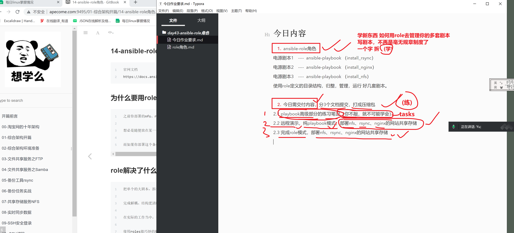

```### 此资源由 58学课资源站 收集整理 ###
	想要获取完整课件资料 请访问：58xueke.com
	百万资源 畅享学习

```
# 今日内容

1. ansible-role角色

电源剧本1    ----  ansible-playbook （install_rsync）

电源剧本2    ----  ansible-playbook （install_nginx）

电源剧本3    ----  ansible-playbook （install_nfs）


使用role定义的目录结构，归整，管理，运行 好几套剧本。


> 今天作业，下午就使劲开卷，写作业，然后提交作业
>
> 3.00签到，来腾讯会议签到，开始学习，


2. 今日需交付内容，分3个文档提交，打成压缩包

2.1 playbook高级部分的练习笔记（你不敲，就不可能学会）

2.2 远程演示，纯playbook模式，部署nfs、rsync、nginx的网站共享存储

2.3 完成role模式，部署nfs、rsync、nginx的网站共享存储




