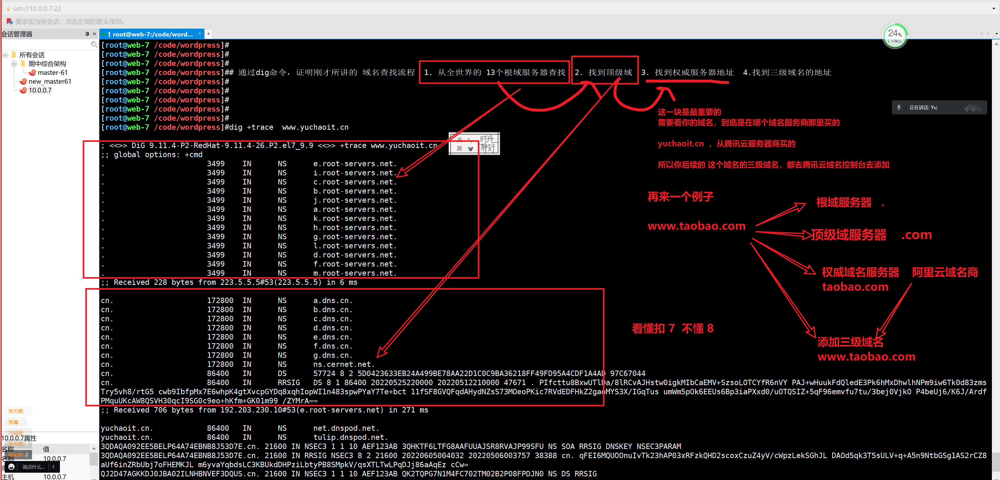

```### 此资源由 58学课资源站 收集整理 ###
	想要获取完整课件资料 请访问：58xueke.com
	百万资源 畅享学习

```
# 开篇介绍


# 学习内容概要


# dns篇

```
dns权威服务器，公网可信任的，权威域名解析服务器

....
119.29.29.29
223.5.5.5
223.6.6.6

1.2.3.4

8.8.8.8

这些服务器是如何通过提供一个ip地址给你用

写入到本地dns配置文件中
/etc/resolv.conf
nameserver 223.5.5.5

你的机器就可以正常访问baidu.com
拿到百度的ip的饿呢？

学习dns域名解析查找的原理流程，以及自己也搭建一个dns权威服务器


```

# 梳理访问网站的原理流程

```
原来想看小姐姐跳舞 背后有那么多复杂的事

正是如此，虎牙背后有大量的服务器，有运维提供了这么一个高效的网站，你才能看直播不卡。

运维搞定的

部署nginx，cdn，通过部署服务器架构，集群优化
提供了一个健壮的网站，高效的网站

```


# 你需要掌握的技术名词

首先你要将刚才将的流程，心中搞清楚了，这是你部署网站，出现问题，排错的完整的，精确的思路，从前到后，从客户端到服务端的所有环节

- 你部署了网站，访问不了


```
1.域名
	顶级域名
	二级
	三级

docs.qq.com
jd.com
taobao.com

2.域名解析
	dns查找顺序
	部署dns服务器

223.5.5.5

下节课，学习关于cdn的知识


3.TCP/IP 三次握手
4.TCP/IP 四次挥手
5.HTTP请求发出
6.HTTP响应报文


```


---


```
为什么要强调ip
dns 就是将域名解析为ip地址

dns其实不难

```





关于域名查找的全流程

1. hosts文件解析优先
2. 以上述所讲的 dns查找顺序来找
3. 通过如下命令可以证明所说

```
dig +trace  www.yuchaoit.cn

这是一个简单的 域名 > ip   的对应关系
```


## 接下来就去实践dns的解析操作即可

```
1. 查看权威服务器，添加的域名解析关系 （理解不同的域名类型）
关于权威服务器，就是指，用户需要在此处购买二级域名。

常见的权威服务器，有域名提供商，
阿里的万网域名
腾讯的域名
华为域名等等

后续的域名备案，域名解析关系，三级域名解析，CDN域名解析，都是在这里添加域名和IP的对应关系即可。


2. 自己搭建dns服务器，bind程序

练习要求如下


master-61 部署dns服务器
（域名---ip的对应）


```


## 理解关于dns的名词

### 递归查询

```
就好比我们递归创建文件夹一样
mkdir -p /opt/linux/0224/chaoge666.log

1.我们本地进行域名解析时，如ping baidu.com，优先去hosts文件找，没有就去本地的/etc/resolv.conf指定的DNS权威服务器接收到用户请求，必须返回给用户一个精准的ip结果。


2.如果指定的DNS服务器没有存储这个解析关系，就会以上述于超老师讲解的dns解析流程，开始向根域服务器发出请求，因此反复循环，直到拿到结果
```


```
你只需要搞清楚这个域名查找的流程即可

本质上，一个完整的域名，应该长这样

www.taobao.com.


.   全世界存放的13个根域服务器
.com  顶级域
taobao.com  二级域  （权威域名服务器存储该记录了,阿里云，腾讯，华为）
www.taobao.com  三基域（权威域名服务器存储该记录了，添加了一个A记录）


```


## 实践添加腾讯云域名


```

记录类型	使用目的
A 记录	将域名指向一个 IP 地址（外网地址）。
CNAME 记录	将域名指向另一个域名，再由另一个域名提供 IP 地址（外网地址）。
MX 记录	设置邮箱，让邮箱能收到邮件。
NS 记录	将子域名交给其他 DNS 服务商解析。
AAAA 记录	将域名指向一个 IPv6 地址。
SRV 记录	用来标识某台服务器使用了某个服务，常见于微软系统的目录管理。
TXT 记录	对域名进行标识和说明，绝大多数的 TXT 记录是用来做 SPF 记录（反垃圾邮件）。
隐、显性 URL 记录	将一个域名指向另外一个已经存在的站点。
```

- 你现在只需要记住，A记录类型，是用的最频繁的，因为他是直接指向了一个ip地址

```
比如你要给公司的域名，添加一个三级域名，指向一个服务器

www.yuchaoit.cn    # www开头的一半都是官网

nfs.yuchaoit.cn   # 是想给nfs服务器使用  172.16.1.31

只需要去dns服务器中，添加一个A记录即可

172.16.1.31   nfs.yuchaoit.cn


听懂  扣 6 不懂 7


```

- CNAME记录

```
将当前要访问的域名，转发给另一个域名，用在CDN部署上
www.taobao.com （123.123.123.123）

↓ cname

www.tb.xxxxx.com  (144.144.114.144)


最终用户访问 www.taobao.com拿到的ip是谁？


```


## 实践添加腾讯云的A记录三级域名


```

添加一个三级域名
linux.yuchaoit.cn
123.206.16.61

正统用法，应该解析到你自己的服务器地址
当然这个ip地址，你可以指定为其他的

看懂扣6 ，看不懂7 

这个事，没什么奇怪的，只是做了一个域名的解析关系

4399.yuchaoit.cn  在权威服务器上添加了解析关系，A记录（记录值是4399服务器的地址）


```


## 阿里云、腾讯云、DNS官方文档

```
大家都是阿里云服务器，操作起来是一样的


https://help.aliyun.com/document_detail/102237.html

https://help.aliyun.com/document_detail/29716.html

```


# 自己搭建dns服务器

这部分知识点，难在原理（需要你去看大量的dns资料，方可理解透彻，我当年也是啃了两本书。。。看了一堆阿里云的dns资料。。掉了几十根头发吧。。），部署其实不难


## bind软件


```
1.准备好机器 172.16.1.61机器服务端
客户端   172.16.1.7 这个机器作为客户端


2.部署bind软件
yum install bind bind-utils -y

# bind软件是dns服务器的主软件  bind-utils 是提供dns解析的命令，如dig，这个命令


3.安装完毕后，检查防火墙，别禁止了dns查询请求
[root@master-61 ~]#getenforce
Disabled
[root@master-61 ~]#
[root@master-61 ~]#
[root@master-61 ~]#iptables -L
Chain INPUT (policy ACCEPT)
target     prot opt source               destination         

Chain FORWARD (policy ACCEPT)
target     prot opt source               destination         

Chain OUTPUT (policy ACCEPT)
target     prot opt source               destination      

4.创建dns配置文件即可 ，先操作主配置文件，然后修改子配置文件（二级域名的配置文件）
/etc/named.conf  # 主配置文件

允许dns服务端，运行在0.0.0.0:53 上
 12 options {
 13         listen-on port 53 { 127.0.0.1; any; };
还差一个允许客户端的访问
 21         allow-query     { localhost;any; };


第二，查看主配置文件导入了，子配置文件，域配置文件
#  想去权威服务器上注册一个  laoliulinux.cn
#  权威服务器是谁？ 在内网中搭建的 bind服务  172.16.1.61
 59 include "/etc/named.rfc1912.zones";


第三部，创建 laoliulinux.cn的域配置文件即可

去这个/etc/named.rfc1912.zones 配置文件中创建即可

第四步，修改配置文件
# 写入如下内容 
# 定义二级域名，以及二级域名的配置文件


vim /etc/named.rfc1912.zones

zone "laoliulinux.cn" IN {
        type master;
        file "laoliulinux.cn.zone";
        allow-update { none; };
};


第五步，创建该二级域名的 主机记录配置文件
laoliulinux.cn.zone
需要以主机记录的格式去创建，且必须存放在 /var/named/目录下才行
# cp -p 保持原文件的属性 
cp -p /var/named/named.localhost /var/named/laoliulinux.cn.zone


第六步，添加 A记录即可
一般的网站首页，都会叫做  www.二级域名.com

[root@master-61 ~]#cat /var/named/laoliulinux.cn.zone  
$TTL 1D
@	IN SOA	@ rname.invalid. (
					0	; serial
					1D	; refresh
					1H	; retry
					1W	; expire
					3H )	; minimum
	NS	@
	A	172.16.1.61
	AAAA	::1

www   A   172.16.1.61  
linux A   172.16.1.61


第七步，这里就是添加了2个三级域名
只需要启动bind程序即可
[root@master-61 ~]#systemctl start named

第八步，检查named程序状态
[root@master-61 ~]#netstat -tunlp |grep named


[root@master-61 ~]#ps -ef|grep named

第九步，需要设置该dns地址，方可使用该dns解析查询

在给172.16.1.61机器部署dns服务端（权威服务器的角色）


[root@master-61 ~]#cat /etc/resolv.conf 
nameserver 172.16.1.61


```


## 客户端想使用自建的这个dns服务器

```
[root@web-7 ~]#
[root@web-7 ~]#cat /etc/resolv.conf 
nameserver 172.16.1.61

访问局域网内的域名，能够直接在  master-61机器上查询到

如果访问的是互联网中的域名，该bind软件，默认会递归查询，继续向上， 从dns解析流程走一遍

```


# dnsmasq软件

> 先把bind软件给停了
>
> [root@master-61 ~]#systemctl stop named

注意恢复你的dns设置

```
[root@master-61 ~]#cat /etc/resolv.conf 
nameserver 223.5.5.5

```


这是一个轻量级，很容易就实现dns服务器的一个软件，部署简单，不像bind那么复杂，重量级

很多软件，大型软件的集群，内部需要部署dns环境，都是通过dnsmasq

```
1.安装
yum install dnsmasq -y


2.创建dnsmasq配置文件，设置上游dns服务器地址，设置本地域名解析记录
[root@master-61 ~]#vim /etc/dnsmasq.conf 
修改如下参数即可
# 1.指定上游dns服务器地址，指定一个配置文件即可
# 2.指定运行地址是内网环境
# 3.需要指定你想要添加的本地 域名解析记录，默认 /etc/hosts文件
参考，修改如下几个配置即可
[root@master-61 ~]#grep -Ev '^($|#)'  /etc/dnsmasq.conf 
resolv-file=/etc/resolv.dnsmasq.conf
listen-address=172.16.1.61
addn-hosts=/etc/hosts.dnsmasq.conf
conf-dir=/etc/dnsmasq.d,.rpmnew,.rpmsave,.rpmorig

3.创建对应的数据文件即可

echo "nameserver 223.5.5.5" > /etc/resolv.dnsmasq.conf
cat >/etc/hosts.dnsmasq.conf <<EOF
172.16.1.61 master-61
172.16.1.5 slb-5
172.16.1.6 slb-6
172.16.1.7 web-7
172.16.1.8 web-8
172.16.1.9 web-9
172.16.1.31 nfs-31
172.16.1.41 rsync-41
172.16.1.51 db-51
EOF


4.启动dnsmasq服务，即可生效如上的自定义记录

systemctl start dnsmasq 

5.测试该dnsmasq是否可用，你还得主动的指定本地dns配置文件的记录，使用这个dnsmasq的服务端地址（172.16.1.61）


```


# 今天的内容还是挺多的，需要记忆，练习的

周末2天，完成

- playbook部署 nfs+rsync+nginx
- role 角色部署  nfs+rsync+nginx
- dns的作业


