```### 此资源由 58学课资源站 收集整理 ###
	想要获取完整课件资料 请访问：58xueke.com
	百万资源 畅享学习

```
# 阿里云CDN产品

```
https://www.aliyun.com/product/cdn
```

# 什么是cdn

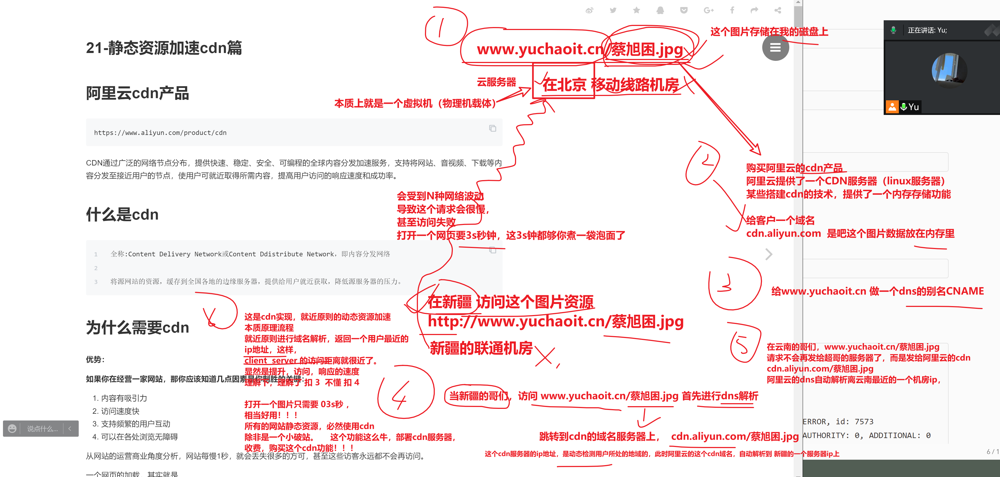


https协议的证书部署

让你的网站更安全


```
应该给cdn设置缓存过期时间，防止，源站数据更新了，用户看到的还是旧的

明白扣6  不懂 7 

这个操作就很简单了，1.在阿里云上设置 过期时间如 3天  2.直接主动的在cdn上更新某资源的数据


```

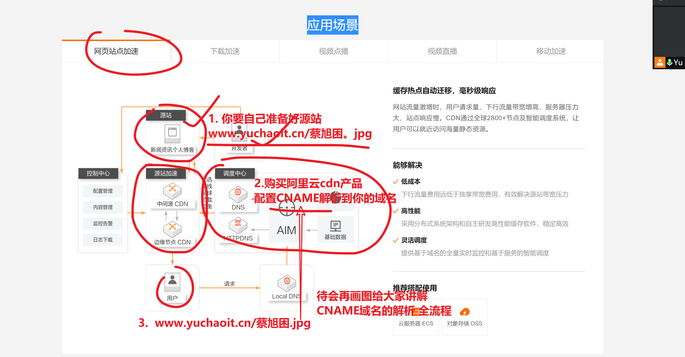


# cdn重要性

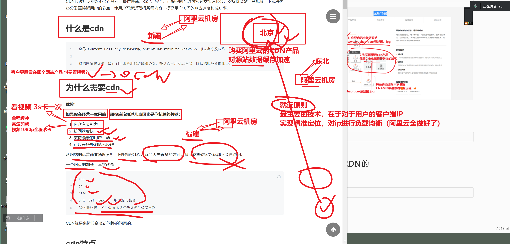


```
```

这些具体的详细信息，都需要大家再去看 HTTP权威指南 才能更清晰

现在的网站，都是基于 开发技术中的，ajax技术，实现，用户浏览一点内容，就发送一点请求

技术很牛的网站，会做这样的事，优化角度做的比较好


能够降低服务器的压力

```
如果是一次性，全部吧数据给用户返回，淘宝网首页，  10M的数据 
1.对客户端是不友好的，下载等待10M的数据 ，太慢了。 。。
2. 服务器也是不友好的  ，一个用户下载10M，100万个用户。。。。
```


这块听懂 扣  6  不懂 7 

继续来看企业实际使用cdn的场景

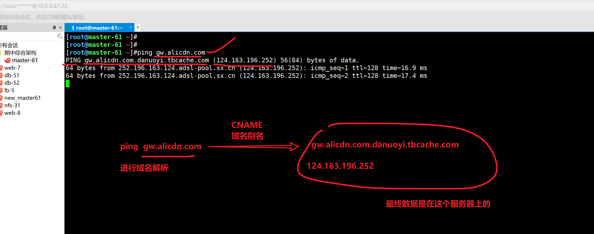


实际工作，解决问题，需要用到的技能，与思考流程，思考方式


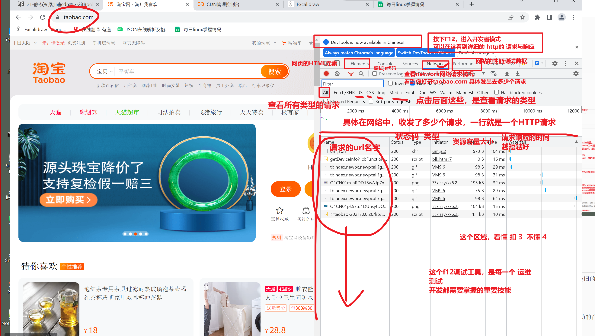

# 公司是怎么用CDN的

## 淘宝的官网图片，都是放在cdn中的

```
[root@master-61 ~]#ping gw.alicdn.com
PING gw.alicdn.com.danuoyi.tbcache.com (124.132.149.251) 56(84) bytes of data.
64 bytes from 124.132.149.251 (124.132.149.251): icmp_seq=1 ttl=128 time=22.9 ms

```

## b站是否用了cdn

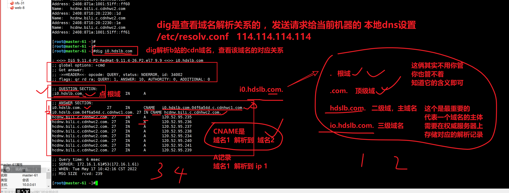


# 如何判断，是否使用CDN

```
去看主域名，是否配置了CNAME，没有则没有用CDN

```


# CDN原理图

```
➜  ~ dig www.taobao.com

; <<>> DiG 9.10.6 <<>> www.taobao.com
;; global options: +cmd
;; Got answer:
;; ->>HEADER<<- opcode: QUERY, status: NOERROR, id: 7573
;; flags: qr rd ra; QUERY: 1, ANSWER: 3, AUTHORITY: 0, ADDITIONAL: 0

;; QUESTION SECTION:
;www.taobao.com.			IN	A

;; ANSWER SECTION:
www.taobao.com.		558	IN	CNAME	www.taobao.com.danuoyi.tbcache.com.
www.taobao.com.danuoyi.tbcache.com. 50 IN A	116.136.165.107
www.taobao.com.danuoyi.tbcache.com. 50 IN A	116.136.165.106

;; Query time: 101 msec
;; SERVER: 192.168.1.1#53(192.168.1.1)
;; WHEN: Mon May 16 19:31:28 CST 2022
;; MSG SIZE  rcvd: 109
```

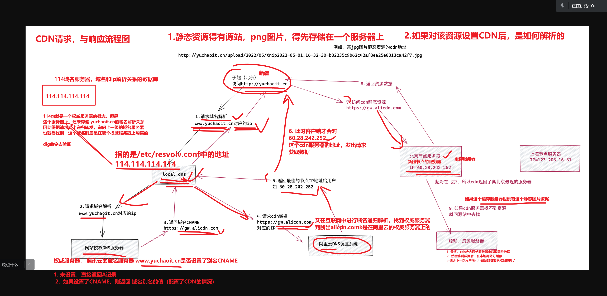

需要大伙，课下花点时间，看一看，捋一捋这个顺序


实际的用阿里云cdn操作一波，你就更清晰了

状态还很好的 扣6  

# 阿里云CDN实践

```
1.准备好一个源站服务器（还未配置cdn的服务器）nginx技术实现
网站的静态资源，一般会单独存放在一个静态url上
简单理解就是，准备好一个源站服务器，以及源站域名
http://alicdn.apecome.com/6.jpg

讲道理这个资源，原始的存放路径是  123.57.242.10/6.jpg

2. 用户此时访问的请求，都是交给了 123.57.242.10 服务器去解析，以及6.jpg存放在该服务器上的。

3. 将这个图片缓存到阿里云CDN服务器上

4. 给这个 apecome.com 域名，配置CNAME，解析到阿里云CDN的域名上，就行了

5. 打开阿里云的CDN控制台，创建加速域名（源站域名，需要做CDN的域名）
https://cdn.console.aliyun.com/overview

5.1 创建加速域名，一般都应该是三级域名，进行加速，比如公司会用如
三级域名，一般是针对了公司的某个业务
二级域名，是代表了这个公司的整体大域名

5.2 【看这里，cdn域名的添加正确顺序】
首先得确保，你已经创建了一个三级域名，且是正确可访问的，它默认可以是一个A记录，待会去修改它即可

alicdn.apecome.com


5.2 准备好源站服务器资源，http://123.57.242.10:80/6.jpg


6. 给dns解析，创建CNAME记录即可


```

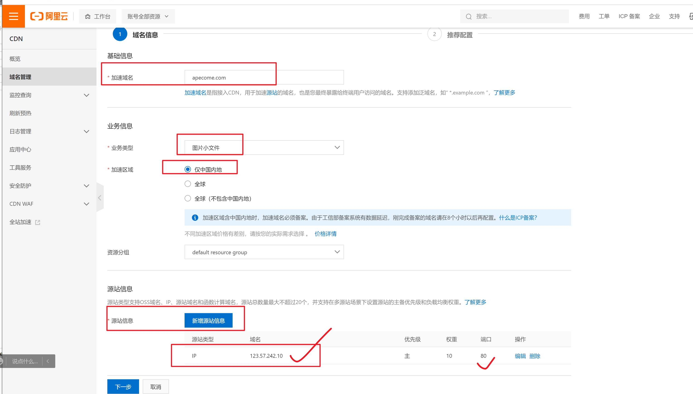

---

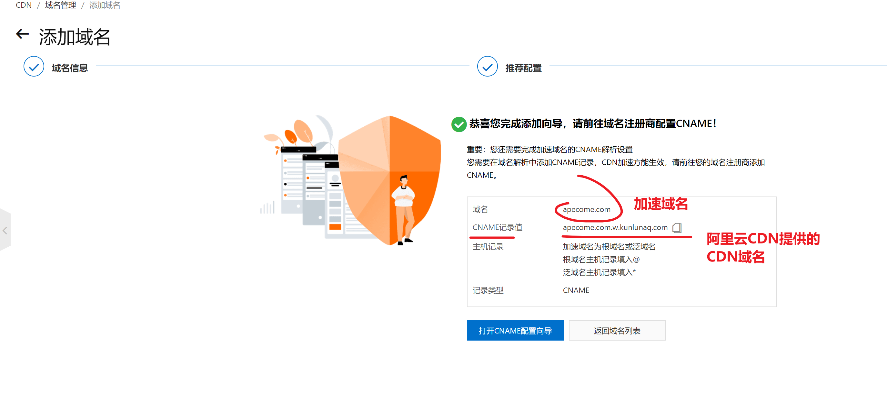

---

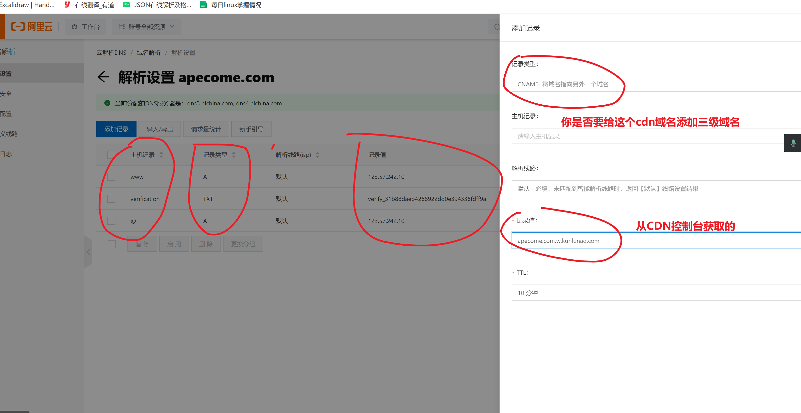

---

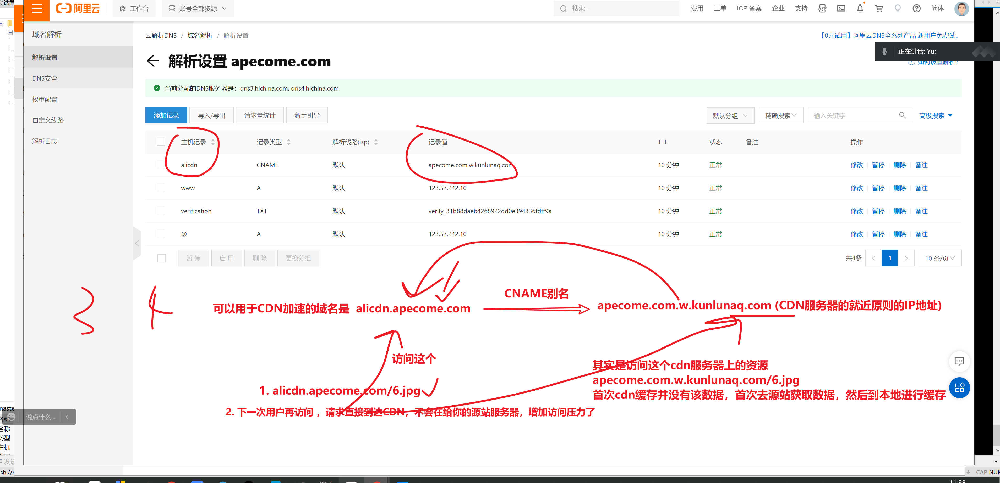


## 添加阿里云CDN的步骤


## 1.创建好一个加速域名

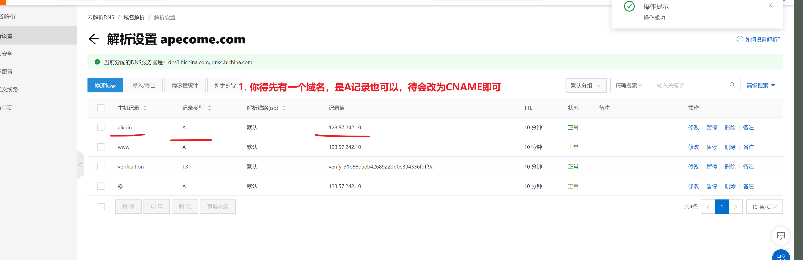

## 2.创建CDN域名

添加步骤，就是刚才给大家演示的在

https://cdn.console.aliyun.com/domain/list/alicdn.apecome.com

一步步添加即可

```
指定需要加速的域名
alicdn.apecome.com  这个地址，源站，还是设置的这个服务器 123.57.242.10


```


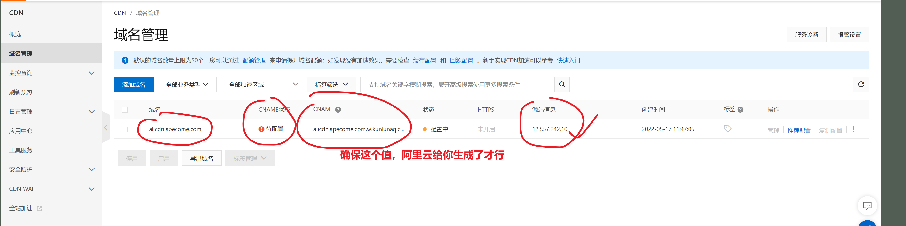

## 3.修改 【加速域名】的类型，从A记录改为CNAME

修改dns设置即可

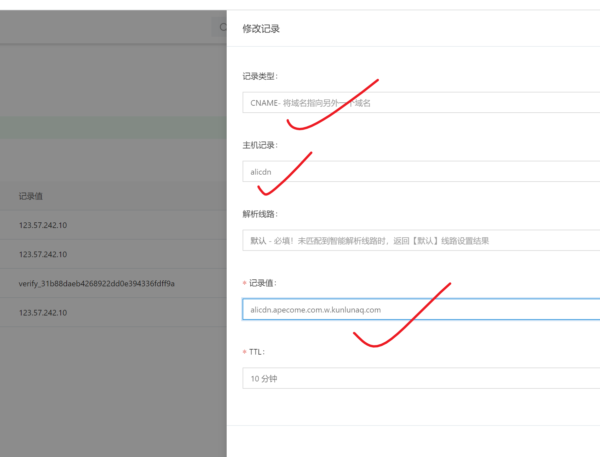

---

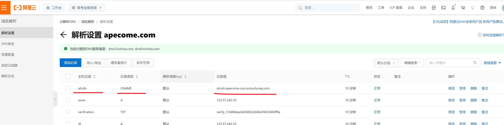

---


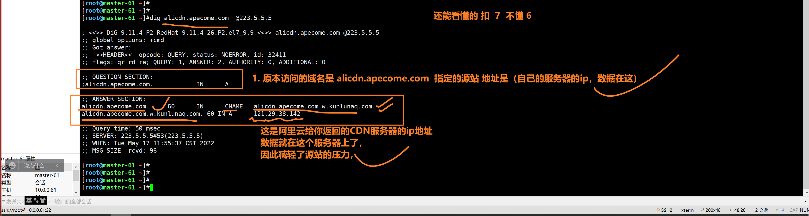


## 4.最终的访问流程

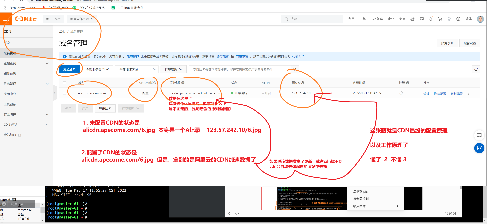


## 5.查看静态资源的访问实际效果

```
只有访问【加速域名】的资源，才会被阿里cdn所记录
1. 访问这个地址http://alicdn.apecome.com/

2. 查看网络请求


```

## 6.如何判断，静态资源是否使用到了CDN

```
1. 查看是否有CNAME
[root@master-61 ~]#ping alicdn.apecome.com
PING alicdn.apecome.com.w.kunlunaq.com (121.29.38.142) 56(84) bytes of data.


2. 查看图片的响应头部信息

2.1 查看没有用CDN的图片响应头部信息是如何

[root@master-61 ~]#curl -I http://yuchaoit.cn:8090/upload/2022/05/Xnip2022-05-01_16-32-30-b82235c9b62c42af8ea25e0313ca42f7.jpg
HTTP/1.1 200 OK
Date: Tue, 17 May 2022 04:05:43 GMT
Access-Control-Allow-Headers: Content-Type,ADMIN-Authorization,API-Authorization
Access-Control-Allow-Methods: GET, POST, PUT, DELETE, OPTIONS
Access-Control-Allow-Credentials: true
Access-Control-Max-Age: 3600
Set-Cookie: JSESSIONID=node0lfg3p0vcrgjx1rd1yooug6zxz16149.node0; Path=/
Expires: 
Vary: Origin
Vary: Access-Control-Request-Method
Vary: Access-Control-Request-Headers
Last-Modified: Sun, 01 May 2022 08:32:51 GMT
Cache-Control: max-age=604800
Content-Type: image/jpeg
Accept-Ranges: bytes
Content-Length: 128495


```

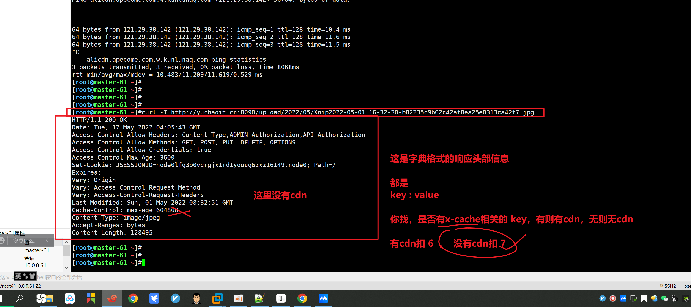


查看有cdn的情况

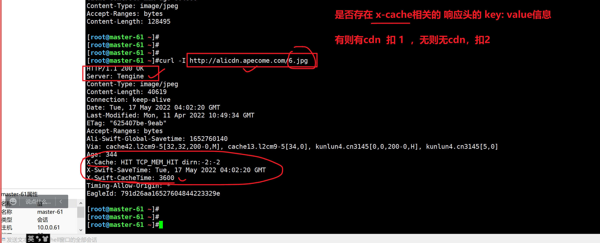


换一个cdn资源查看

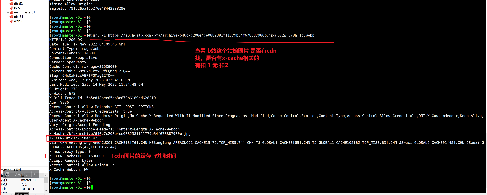


# CDN与HTTPS


# 今天作业

1. 做好学习笔记，理解这些理论知识
2. CDN，看如下文档，完成阿里云的域名购买，域名注册，域名和CDN的绑定解析

```
https://help.aliyun.com/document_detail/54068.html

建议买顶级域名，买的冷门些，也会便宜点

你要喜欢 .com  .cn .top 等 你自己看价格是否合适

域名买简单，需要备案，才能在互联网中正确解析


看教程就知道如何注册域名，如何备案了。。
注册过程里有任何不懂，随时问老师，。，。

```

3. 关于HTTP协议，URL协议的博客学习，做好笔记，后续的nginx会用到这些理论知识

