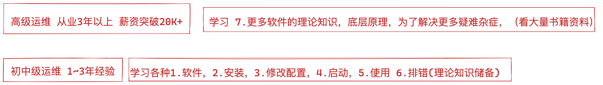

```### 此资源由 58学课资源站 收集整理 ###
	想要获取完整课件资料 请访问：58xueke.com
	百万资源 畅享学习

```
# web通信流程


# web服务器（nginx）工作原理

```
```


# client请求服务器的流程

```
```


# 抓包工具，抓取数据包

查看隐藏在背后的数据包收发情况。


## 抓取ssh登录的数据包

```
1. 查看client 和server在建立ssh连接之前，会先收发三个数据包，是TCP协议的

2. 以及在断开连接的时候，client和server之间收发的四个数据包，分别是什么类型。


```




# TCP/IP协议是什么


# OSI网络模型是什么

了解OSI网络模型，也依然是为了提升自己的排错思路。


# 什么是端口号


# 什么是socket


# socket套接字的使用场景


# HTTP协议的学习


# HTTP无状态特点


# cookie是什么


# HTTP请求方法


# HTTP请求、响应报文


# 抓包HTTP请求、响应报文

```
http是建立在tcp/ip基础之上的
```


# HTTP响应状态码


# URL组成


# Web服务器与前端静态资源

css

js

html

理解


# 什么是动态、静态资源

一般是除了静态资源，都是动态资源，以URL区分

```
静态资源特点，根据url区分即可

如www.yuchaoit.cn/static/hello.jpg
如www.yuchaoit.cn/hello.gif

www.yuchaoit.cn/hello.mp4

除此之外，都被判定为动态请求，nginx直接转发给后端服务器即可，交给如php去处理。

php作为是主流网站语言，当然也可以更换为其他语言，但是都得针对性的学习该语言的部署形式即可。

我们交大家如何部署php、python，java这三大主流的后端语言。


```


