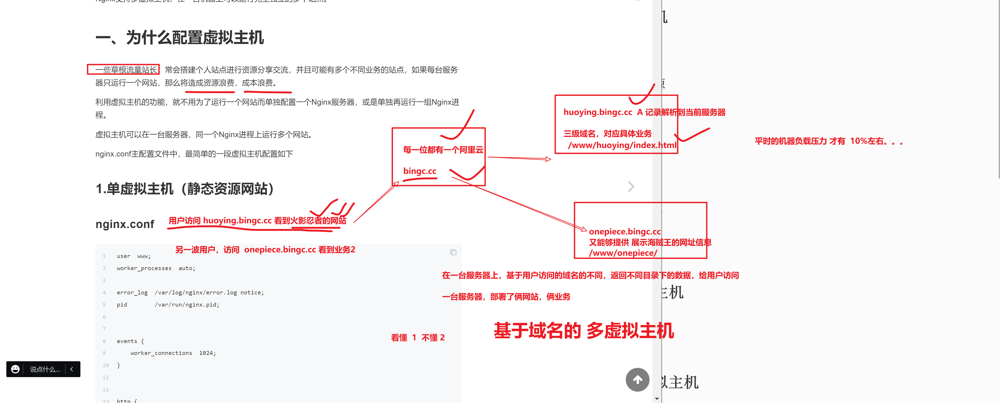
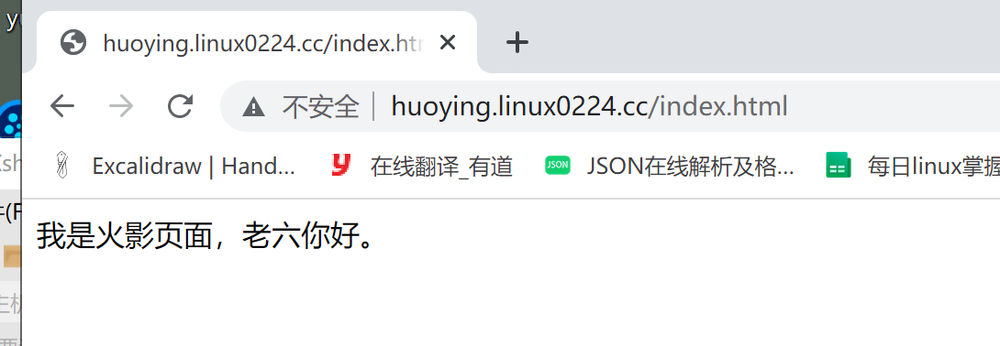
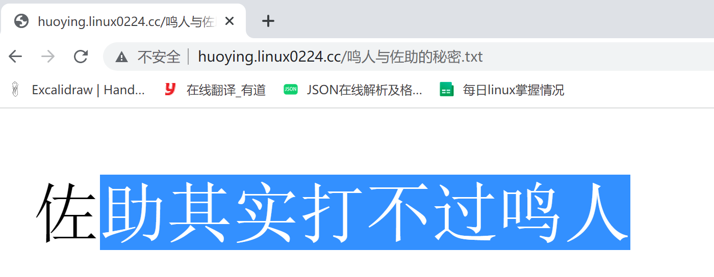
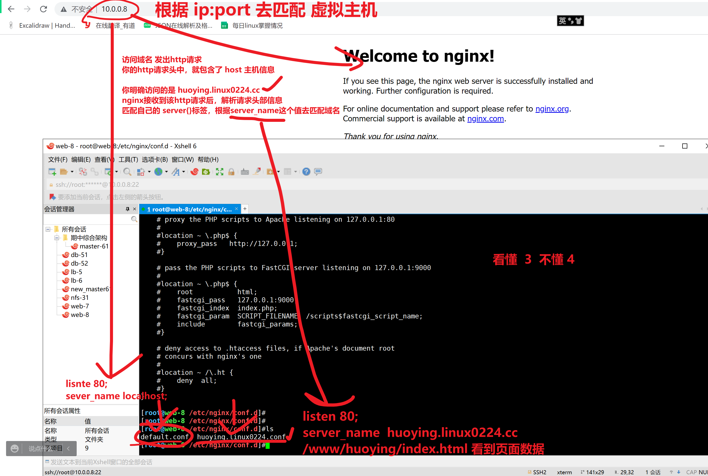
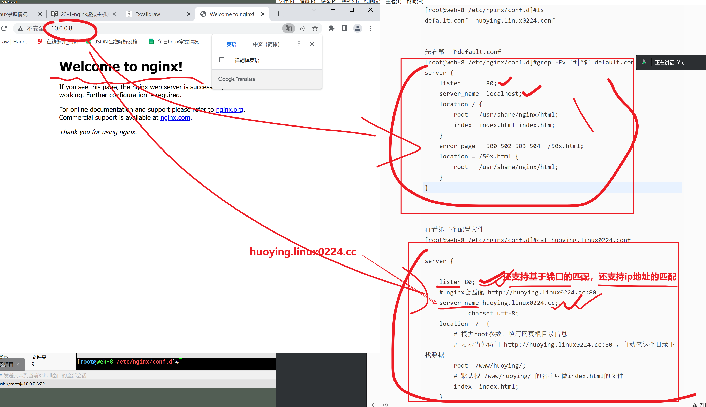
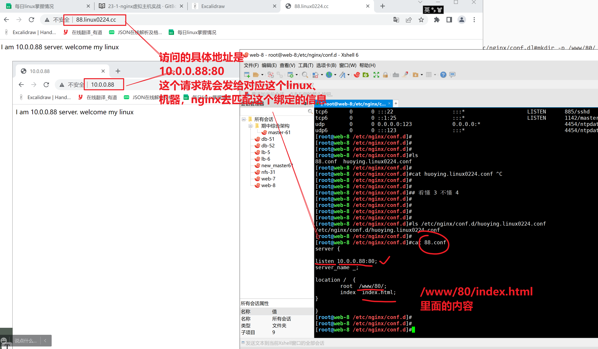
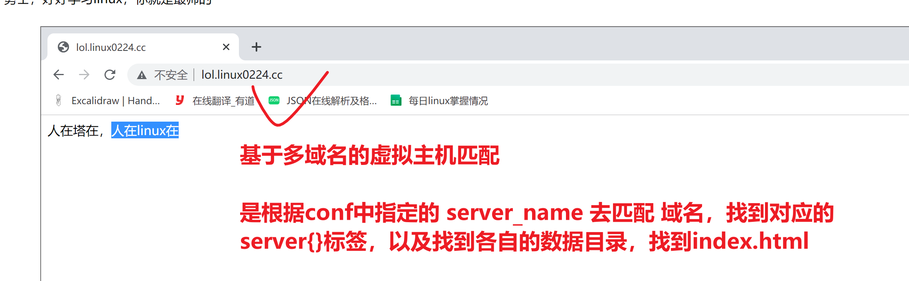
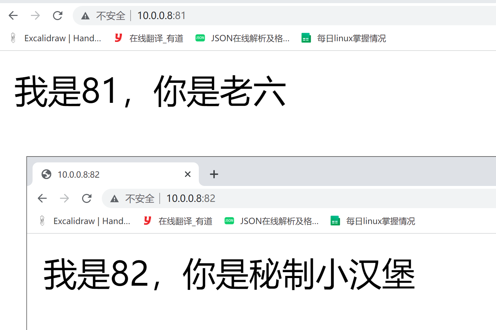

```### 此资源由 58学课资源站 收集整理 ###
	想要获取完整课件资料 请访问：58xueke.com
	百万资源 畅享学习

```
# nginx虚拟主机，部署网站

今天的东西，理论+实践都很多，大伙要加油了。。。





# 单虚拟主机

动手试一试。。。待会继续。。


只需要在http{}区域中，设置一个 server{}标签即可。


```
部署一个 huoying.linux0224.cc   看到 /www/huoying/index.html


配置文件如下
降低运行权限

[root@web-8 ~]#groupadd www -g 666
[root@web-8 ~]#
[root@web-8 ~]#useradd www -u 666 -g 666 -M -s /sbin/nologin 
[root@web-8 ~]#
[root@web-8 ~]#
[root@web-8 ~]#id www
uid=666(www) gid=666(www) groups=666(www)


修改nginx.conf
```

## nginx.conf入口配置文件

````
user  www;		# 设置运行用户 
worker_processes  auto;

error_log  /var/log/nginx/error.log notice;
pid        /var/run/nginx.pid;


events {
    worker_connections  1024;
}


http {
    include       /etc/nginx/mime.types;
    default_type  application/octet-stream;

    log_format  main  '$remote_addr - $remote_user [$time_local] "$request" '
                      '$status $body_bytes_sent "$http_referer" '
                      '"$http_user_agent" "$http_x_forwarded_for"';

    access_log  /var/log/nginx/access.log  main;

    sendfile        on;
    #tcp_nopush     on;

    keepalive_timeout  65;

    #gzip  on;

    include /etc/nginx/conf.d/*.conf;   # include导入该目录下的*.conf配置文件
}

````

## 创建虚拟主机子配置文件

只需要写server{}标签即可。 扣6 

```
# huoying.linux0224.cc
# 吧数据放在 /www/huoying/index.html

vim /etc/nginx/conf.d/huoying.linux0224.conf 
# 写入如下信息

server { 
	
	listen 80;
	# nginx会匹配 http://huoying.linux0224.cc:80
	server_name huoying.linux0224.cc;
	# 支持中文的参数
	charset utf-8;
	location  /  {
		# 根据root参数，填写网页根目录信息
		# 表示当你访问 http://huoying.linux0224.cc:80 ，自动来这个目录下找数据
		root  /www/huoying/;
		# 默认找 /www/huoying/ 的名字叫做index.html的文件
		index  index.html;
	}
	
}


# 创建网页静态文件，index.html 鸣人.jpg  鸣人与佐助的秘密.txt
# 你部署一个静态网站，最基本的提供，html，jpg，txt等静态数据
# nginx都可以帮你去返回，解析请求
# 
mkdir -p /www/huoying

cat > /www/huoying/index.html <<EOF
<meta charset=utf-8>
我是火影页面，老六你好。
EOF

cd /www/huoying ; wget -O 鸣人.jpg https://pics0.baidu.com/feed/d62a6059252dd42a57f830e3671230b2c8eab8b1.jpeg?token=df950341a2fc3467a01012e87e868f08

cd /www/huoying ; echo '佐助其实打不过鸣人' > 鸣人与佐助的秘密.txt


# 修改静态文件的属主，属组
[root@web-8 /www/huoying]#chown -R www.www /www/


```

## 测试nginx配置文件语法，然后启动

```
[root@web-8 /www/huoying]#nginx -t
nginx: the configuration file /etc/nginx/nginx.conf syntax is ok
nginx: configuration file /etc/nginx/nginx.conf test is successful

[root@web-8 /www/huoying]#systemctl restart nginx

```

## 根据域名访问该虚拟主机

```
你的本地添加好dns域名解析
分别添加二级域名，三级域名，hosts解析

10.0.0.8  huoying.linux0224.cc linux0224.cc   


你可以先访问ip试试，通不通
[C:\~]$ ping huoying.linux0224.cc 

正在 Ping huoying.linux0224.cc [10.0.0.8] 具有 32 字节的数据:
来自 10.0.0.8 的回复: 字节=32 时间<1ms TTL=64
来自 10.0.0.8 的回复: 字节=32 时间<1ms TTL=64
来自 10.0.0.8 的回复: 字节=32 时间<1ms TTL=64
来自 10.0.0.8 的回复: 字节=32 时间<1ms TTL=64

10.0.0.8 的 Ping 统计信息:
    数据包: 已发送 = 4，已接收 = 4，丢失 = 0 (0% 丢失)，
往返行程的估计时间(以毫秒为单位):
    最短 = 0ms，最长 = 0ms，平均 = 0ms


该测试域名是没问题，浏览器直接访问即可，
有时候如果出现故障，检查你本地是否设置了代理。关闭即可。。、


```


## html文件资源

```
```




## 图片资源


## 普通txt文件资源




## 如果是其他类型的文件，nginx默认不解析，直接下载

```
直接生成静态数据，不用重启nginx，这就是磁盘上的一些静态数据
nginx的server{}虚拟主机，以及设置了，去这个目录下搜索资料

nginx默认不识别这个test.ttt格式的文件，因此直接下载了


```

## nginx识别的文件类型都在这个文件里定义好了

```
[root@web-8 /www/huoying]#cat /etc/nginx/mime.types 

只有这个文件中定义的文件类型，nginx默认可以识别处理。。

```


# nginx的配置文件匹配




````
先看当前有几个nginx配置文件
[root@web-8 /etc/nginx/conf.d]#ls
default.conf  huoying.linux0224.conf


先看第一个default.conf
[root@web-8 /etc/nginx/conf.d]#grep -Ev '#|^$' default.conf 
server {
    listen       80;
    server_name  localhost;
    location / {
        root   /usr/share/nginx/html;
        index  index.html index.htm;
    }
    error_page   500 502 503 504  /50x.html;
    location = /50x.html {
        root   /usr/share/nginx/html;
    }
}


再看第二个配置文件
[root@web-8 /etc/nginx/conf.d]#cat huoying.linux0224.conf 

server { 
	
	listen 80;
	# nginx会匹配 http://huoying.linux0224.cc:80
	server_name huoying.linux0224.cc; 
        	charset utf-8;	 
	location  /  {
		# 根据root参数，填写网页根目录信息
		# 表示当你访问 http://huoying.linux0224.cc:80 ，自动来这个目录下找数据
		root  /www/huoying/;
		# 默认找 /www/huoying/ 的名字叫做index.html的文件
		index  index.html;
	}
	
}


````





## 规整，删除无用的配置文件

```
[root@web-8 /etc/nginx/conf.d]#ls
huoying.linux0224.conf
[root@web-8 /etc/nginx/conf.d]#
[root@web-8 /etc/nginx/conf.d]#systemctl restart nginx

```


# IP多虚拟主机

```
给指定的网卡，绑定多个ip地址
# 这个命令是临时添加一个ip
ip addr add 10.0.0.88/24 dev eth0

不得有人在用


```


## 修改虚拟主机，绑定多个ip

```
vim /etc/nginx/conf.d/88.conf

# 指定绑定ip地址的配置文件
[root@web-8 /etc/nginx/conf.d]#nginx -t
nginx: the configuration file /etc/nginx/nginx.conf syntax is ok
nginx: configuration file /etc/nginx/nginx.conf test is successful
[root@web-8 /etc/nginx/conf.d]#
[root@web-8 /etc/nginx/conf.d]#
[root@web-8 /etc/nginx/conf.d]#
[root@web-8 /etc/nginx/conf.d]#ls
88.conf  huoying.linux0224.conf
[root@web-8 /etc/nginx/conf.d]#cat 88.conf 
server {

listen 10.0.0.88:80;
server_name _;

location /  {
	root  /www/80/;
	index  index.html;
}

}

# 创建测试数据
[root@web-8 /etc/nginx/conf.d]#mkdir -p /www/80/
[root@web-8 /etc/nginx/conf.d]#
[root@web-8 /etc/nginx/conf.d]#echo 'I am 10.0.0.88 server. welcome my linux'  > /www/80/index.html
[root@web-8 /etc/nginx/conf.d]#
[root@web-8 /etc/nginx/conf.d]#
[root@web-8 /etc/nginx/conf.d]#systemctl restart nginx


```


## 测试基于ip的虚拟主机

```
1. 当你访问 10.0.0.8 或者 huoying.linux2004.cc
看到的是/etc/nginx/conf.d/huoying.linux0224.conf这个虚拟主机的内容

2. 当你访问，基于指定ip访问，看到的/etc/nginx/conf.d/88.conf的内容


```

## 给这个指定的IP，绑定一个测试域名

```
修改本地hosts
10.0.0.88  88.linux0224.cc

访问该域名也是可以通的，因为依然是基于绑定的socket地址匹配的该虚拟主机文件
http://88.linux0224.cc/

```




## nginx提供了那么多丰富的绑定机制，让你的各种请求，匹配各种虚拟主机

先学会这种配置语法，以后看到别人用的N种形式，你都能看懂了。。


# 多域名虚拟主机

```
dnf.linux0224.cc   /www/lol/index.html


lol.linux0224.cc   /www/lol/index.html

俩域名，就得分俩配置文件更合适些，表示是2个站点


```

## 创建各自的配置文件

dnf.linux0224.conf

```
[root@web-8 /etc/nginx/conf.d]#touch dnf.linux0224.conf

分别写入配置 ，基于域名的虚拟主机，这样写
server {

    listen 80;
    server_name dnf.linux0224.cc; # 这里写的是域名
	charset utf-8;
    location /  {
        root  /www/dnf/;
        index  index.html;
    }

}


```

lol.linux0224.conf 

```
server {

    listen 80;
    server_name lol.linux0224.cc;
	charset utf-8;
    location /  {
        root  /www/lol/;
        index  index.html;
    }

}

```

创建两个数据目录即可

听到这里，还跟得上的扣  6  ，晕了扣7 

```

mkdir -p /www/{lol,dnf}

# 分别创建测试数据

echo '人在塔在，人在linux在'  >  /www/lol/index.html 

echo '勇士，好好学习linux，你就是最帅的'  >  /www/dnf/index.html 

[root@web-8 /etc/nginx/conf.d]#systemctl restart nginx

```

## 重启nginx，查看各自的网站

```
还差什么步骤吗？
还差客户端机器上的 域名解析

10.0.0.8  huoying.linux0224.cc linux0224.cc     lol.linux0224.cc       dnf.linux0224.cc        


http://lol.linux0224.cc/

http://dnf.linux0224.cc/

```




没了兄弟们，辛苦了。。。明天继续嗨。。

休息吧，作业一会就来。。。

88


# 多端口虚拟主机

```
除了支持 
- 绑定域名
- 绑定ip
- 绑定多个端口，的虚拟主机
```

配置文件如下

在一个配置文件中，定义多个虚拟主机

```
vim /etc/nginx/conf.d/port.conf
# 平级
server {

    listen 10.0.0.8:81;
    server_name _;
	charset utf-8;
    location /  {
        root  /www/data81/;
        index  index.html;
    }

}
 # 平级
server {

    listen 10.0.0.8:82;
    server_name _;
	charset utf-8;
    location /  {
        root  /www/data82/;
        index  index.html;
    }

}


# 创建测试数据，   看懂扣6 不懂7 
mkdir -p /www/{data81,data82}

cd /www/data81 ;  echo "我是81，你是老六" > /www/data81/index.html

cd /www/data82 ;  echo "我是82，你是秘制小汉堡" > /www/data82/index.html
```

验证整个配置文件，和数据目录

```
[root@web-8 /www/data82]#tree -N /www/
/www/
├── 80
│   └── index.html
├── data81
│   └── index.html
├── data82
│   └── index.html
└── huoying
    ├── index.html
    ├── test.ttt
    ├── 鸣人.jpg
    └── 鸣人与佐助的秘密.txt


配置文件
[root@web-8 /www/data82]#tree -NF /etc/nginx/conf.d/
/etc/nginx/conf.d/
├── 88.conf
├── huoying.linux0224.conf
└── port.conf


```

重启服务，查看是否生效

```
[root@web-8 /www/data82]#systemctl restart nginx


[root@web-8 /www/data82]#netstat -tunlp |grep nginx
tcp        0      0 0.0.0.0:80              0.0.0.0:*               LISTEN      4563/nginx: master  
tcp        0      0 10.0.0.8:81             0.0.0.0:*               LISTEN      4563/nginx: master  
tcp        0      0 10.0.0.8:82             0.0.0.0:*               LISTEN      4563/nginx: master  


```

## 测试访问81和82页面

反向代理，负载均衡，就有用了，可以基于虚拟主机，实现多台服务器运行的多个网站


```
指定端口号才行
http://10.0.0.8:82/

http://10.0.0.8:81/


```




