```### 此资源由 58学课资源站 收集整理 ###
	想要获取完整课件资料 请访问：58xueke.com
	百万资源 畅享学习

```


# 正式进入网站部署的学习

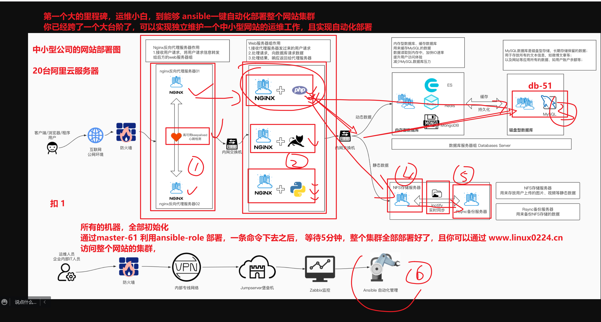


# web通信流程

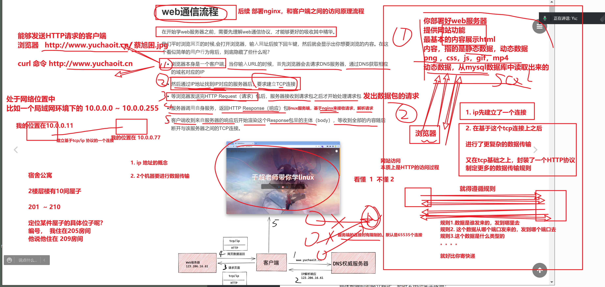

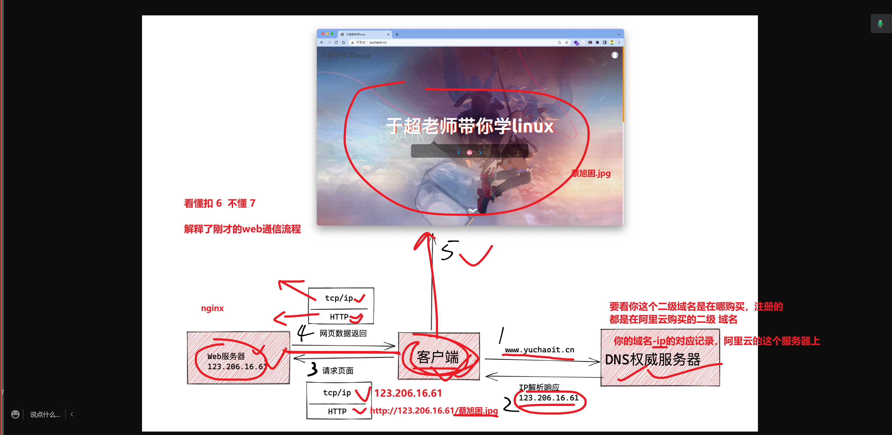


## server工作流程


## client工作流程

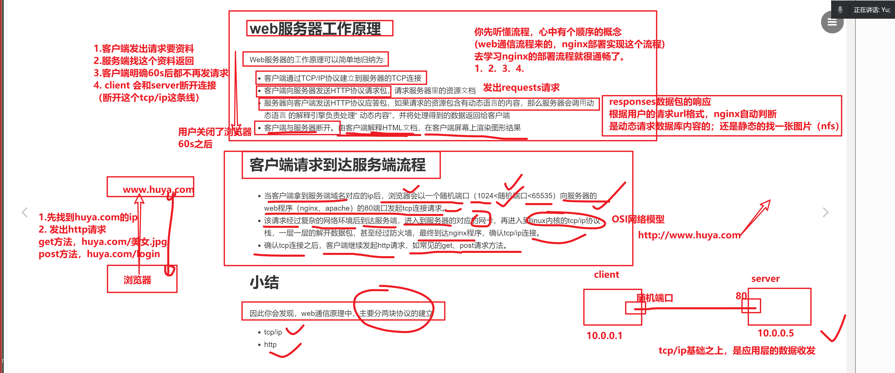


- http协议
- tcp/ip协议


# TCP/IP协议

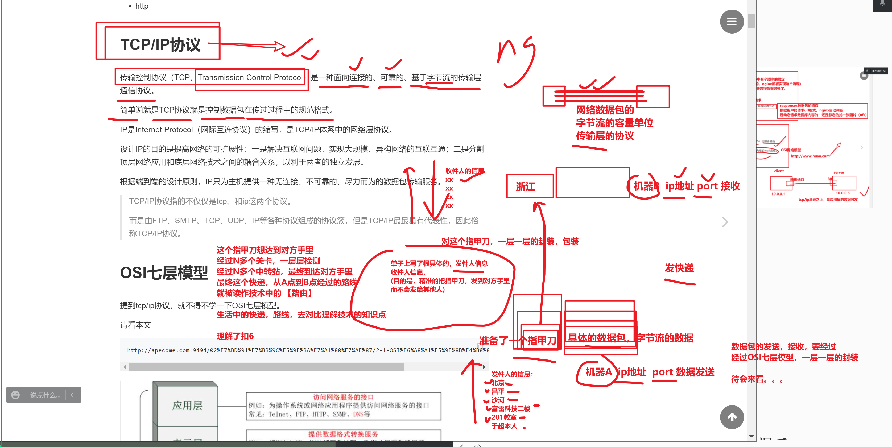


# OSI七层网络模型

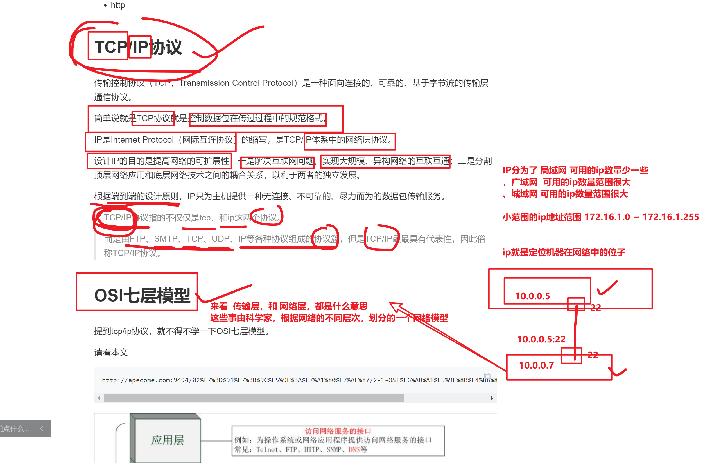


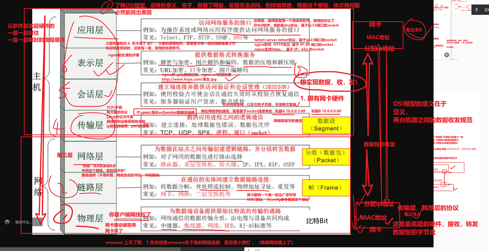


# 抓包工具，查看TCP/IP的三次握手

> 经典的问题，你了解TCP/IP的三次握手
>
> 四次挥手ma 

具体数据包的报文格式，暂时不用过多去琢磨；

什么时候需要琢磨数据包的序列号，只有当你在生产环境下，遇见的及其棘手的问题，比如一些数据不同步，交易数据丢失等极端情况，需要去抓取数据包，逐个分析，数据包的完整性，序列号。

目前只需要大致了解数据包的类型，以及作用即可；


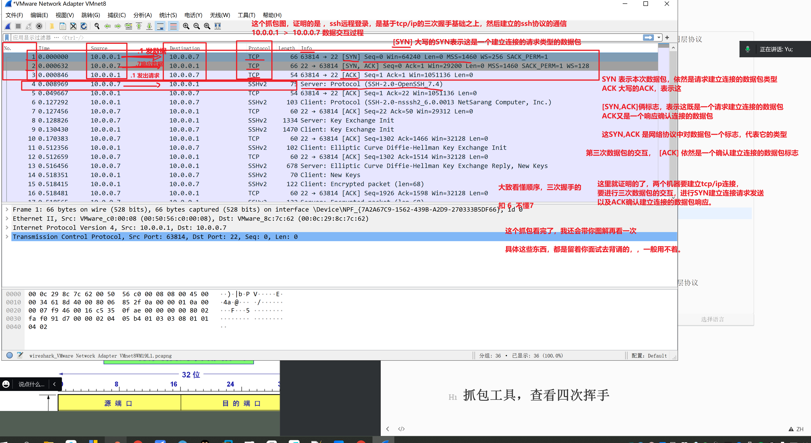


```
1. 抓取ssh登录的数据包，查看 tcp/ip协议基础之上的 SSH应用层协议
登录web-7机器
windows(192.168.xx.xx)  
↓
vmnet8(nat虚拟网卡，10.0.0.1)    
↓
web-7(nat 10.0.0.7)


两个ip:port的数据包交互
10.0.0.1:随机端口      >   10.0.0.7:22

wireshark大鲨鱼抓包工具查看ssh登录数据包收发情况

在window去登录 web-7


ssh远程连接，也是建立的tcp/ip的三次握手之上


2. 查看网站访问的数据包，基于 tcp/ip 基础之上的 HTTP应用层协议
由于捕捉的是 vmnet8的网卡流量，检测http协议，只能给这个网段内的机器，发http请求

这里需要注意，如果你多次访问nginx，你可能会抓不到默认的tcp三次握手
tcp三次握手，是用于首次连接的
访问nginx页面的请求，第一次以及建立好连接，默认会有一个保持连接
你后续的请求，。就不会再继续tcp三次握手，而是直接发送http请求
你和nginx服务器已经建立好tcp连接了。

使用firefox另一个浏览器，重新去建立tcp连接


```

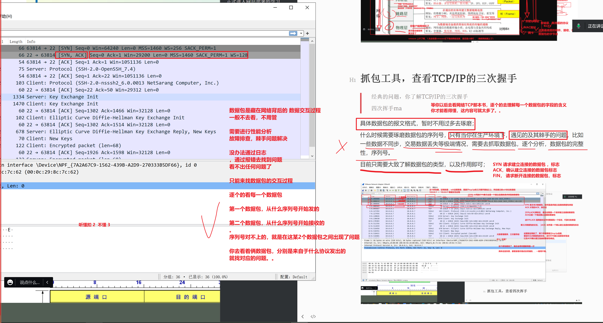


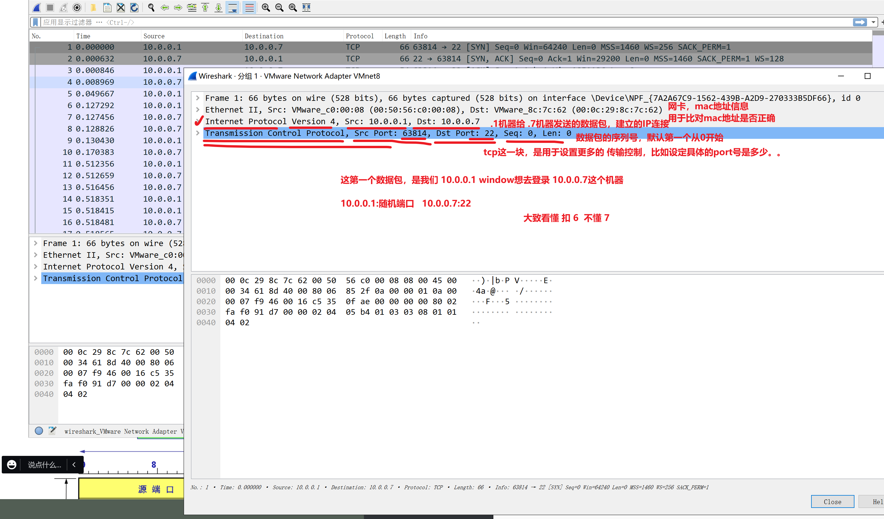


---

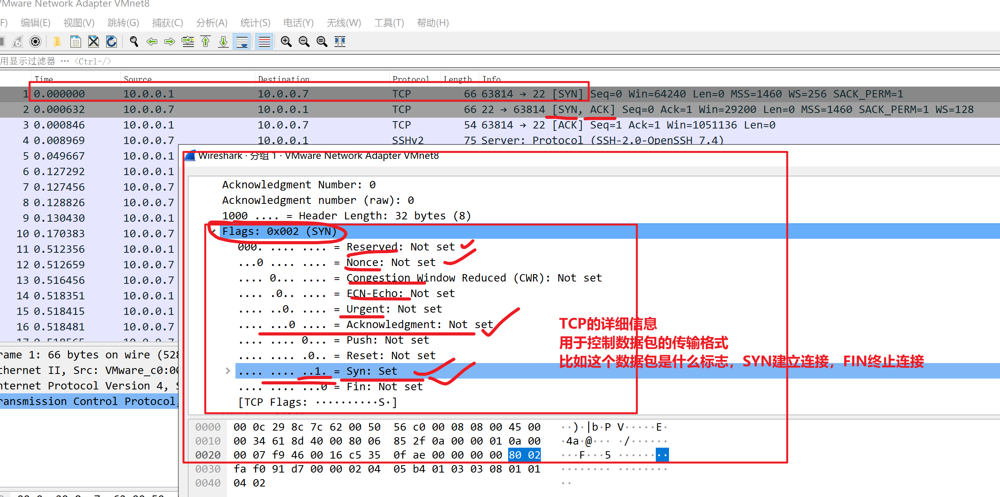


---


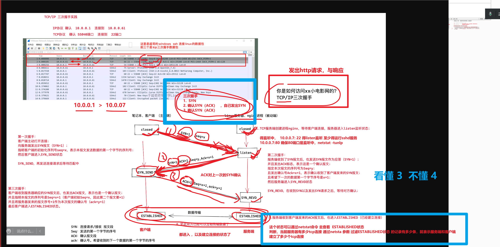


# 抓包工具，查看四次挥手

理论知识，固然确实重要，得先记住理论的流程，然后再去动手实践，得出真知。。


```
1.先建立ssh连接，然后退出ssh会话，查看是否发出tcp/ip 的四次挥手，四个数据包


```

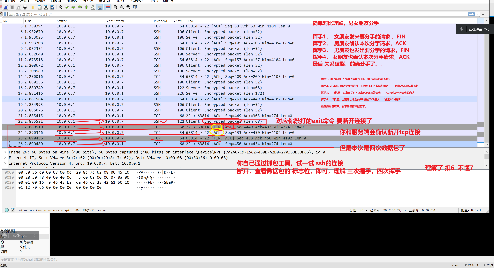


# 常见端口号

# 常用的熟知端口号

| 应用程序   | FTP   | TFTP | TELNET | SMTP | DNS  | HTTP | SSH  | MYSQL |
| ---------- | ----- | ---- | ------ | ---- | ---- | ---- | ---- | ----- |
| 熟知端口   | 21,20 | 69   | 23     | 25   | 53   | 80   | 22   | 3306  |
| 传输层协议 | TCP   | UDP  | TCP    | TCP  | UDP  | TCP  | TCP  | TCP   |


# 什么是socket套接字

```
任何，两个机器的连接，指的是tcp/ip协议的连接，本质上是两个socket的通信

socket套接字就是 ip+port的具象化

比如部署nginx服务，运行在 10.0.0.7:80 端口，这就是一个socket
通过本地去访问这个socket，浏览器随机指定的端口，发出请求

10.0.0.1:61145   这个也是一个socket


```


## 本地套接字

比如单机LNMP，应用程序在机器内部内存之间数据交互

```
========================================
套接字存在的意义，在于让两端进行数据交互，数据传输

php
10.0.0.7:9000

mysql(10.0.0.7:3306  这是一个ip:port形式的 socket)

mysql -uroot -p -h10.0.0.7


================================================================================
另一个形式是，也就是文件形式的本地socket
（因为本地内存文件socket形式，比网络socket传输效率更高，）
在后面高级部分，我教大家企业常用的python后端部署

socket的都是具象化证明服务的确运行了，可以对外提供访问了，可以交互了
mysql运行在 /tmp/mysql.sock

这个文件存在，则表示mysql运行
你可以通过这个/tmp/mysql.sock去登录mysql数据库


听懂 扣 6  不懂 7

咱们暂时部署形式都是 网络socket形式，将程序部署在 ip：port的形式。。


```


## 网络套接字

部署LNMP，这是不同机器之间的远程访问，就是远程socket

```
比如 http协议的交互

10.0.0.1:61145  >   10.0.0.7:80

马上学习nginx反向代理，远程部署

lb-5
10.0.0.5:80      

↓

web-7
10.0.0.7:9000 (php-fpm)

叫做远程的socket通信


简单说就是你部署 10.0.0.5:80   这个服务，还会和远程的另一个服务通过网络通信 
10.0.0.7:9000
两端进行数据交互


专业名词就叫做socket通信  听懂 扣 2 不懂 3
```


# HTTP协议工作原理

这些内容，都是你部署网站，后续的nginx高级知识点，必备的内容


## 无状态

http默认不会记住每一次连接的状态信息，下一次都会认为是一个新的客户端连接

```
比如你去找到禁用谷歌浏览器的cookie功能，

1.你去禁用这个功能后

2. 你每次登录淘宝网， 再打开一页面，网站又提示你需要登录
。。

这是网站为了解决无状态实现的技术

。。。


听懂扣 1  不懂 2

```


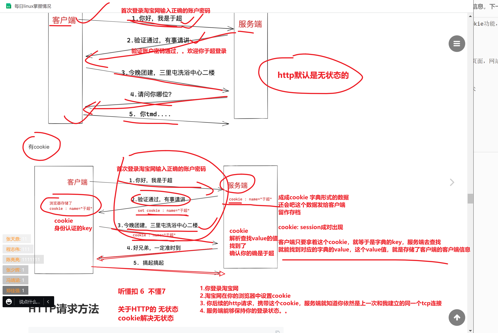


## cookie


# 后续HTTP知识

剩下这些，就是我们后续学nginx会用到的基础知识了，大家看博客，做好学习笔记即可。


## 请求方法

定义client发给server的请求，是什么类型

- get获取静态数据（查看一个图片）
- post 发送提交一些数据  （登录表单，提交账户密码数据）

- ...一堆方法，看博客即可


## 请求、响应报文查看

通过F12即可查看，也可以通过抓包工具查看

。。

慢慢学，慢慢练


## 响应状态码

```
1. 当你client  发出 get请求 获取一个图片信息  ，发出requests


2.  server  响应结果，nginx找到这个图片，返回给用户，  response
响应信息，是有对应的状态码的。。

学习nginx会遇见的内容
```

- 20x系列，表示请求，响应正常解析
- 30x系列，表示本次请求，被转发到另一个服务器上了。。
- 40x系列，表示client客户端访问的url有问题，该资源不存在
- 50x系列，表示网站的服务端出错了（php-fpm）没有运行
- 。。。

```
听懂 扣 2  不懂 3

```


# 总结梳理，面试拿出来背即可

这些更多的理论，很重要，必须你要做好笔记，去背，记忆，否则面试一问三不知。。


```
1.dns篇
用户访问域名www.yuchaoit.cn
↓
浏览器跳转
↓
浏览器缓存（disk cache）
↓
Hosts文件
↓
本地DNS服务器（递归查询 > 迭代查询）
↓
client 向 server发起查询（递归查询）
server 向 server发起查询（迭代查询）


2.TCP/IP协议篇（三次握手）
client > SYN报文，请求连接 
server > SYN，ACK报文 响应client
client  > ACK，建立连接 


3.客户端发起http请求
- 请求方法是什么、get、post、delete
- 请求主机是什么、www.yuchaoit.cn
- 请求资源是什么 、 http://yuchaoit.cn:8090/upload/2022/05/Xnip2022-05-01_16-32-30-b82235c9b62c42af8ea25e0313ca42f7.jpg
- 请求端口是什么、默认http是80、https是443
- 请求参数是什么、请求头部信息（资源类型、是否压缩、cookie、浏览器客户端等）
- 请求信息最后的换行

4.服务端响应的内容
- server信息（web服务器软件类型）
- 响应文件类型
- 响应头部信息（是否压缩，语言编码，是否保持连接等）

5.客户端发起TCP四次挥手断开连接。
client > 发起断开请求 FIN=1 
server  > 响应断开   FIN、ACK
server  > 发起断开请求 FIN=1
client > 确认断开连接 ACK
```


