```### 此资源由 58学课资源站 收集整理 ###
	想要获取完整课件资料 请访问：58xueke.com
	百万资源 畅享学习

```
# 内容回顾

- web协议篇

  - tcp/ip协议的，三次握手，四次挥手

    - client和server、之间会收发的数据包，wireshare去抓包看实际效果
    - 发送的数据包的次数
    - 以及数据包它的格式（tcp中对数据包设置的flag标志位）
    - SYN建立连接的标志（对数据包的标记flag，表示本次数据包的作用）
    - ACK 对上一次请求的确认回复。
    - FIN，发出一个终止tcp连接的请求的数据包

  - OSI七层模型，背诵出来（这个网络知识，前期你不会用到太多，基本的ip地址概念有就行，机器之间的网络通信概念，你需要找时间，课外时间，找点书看看。。）

  - 网络中的数据传递，是端对端的传递，机器A要基于OSI模型的数据发出，机器B也要基于OSI模型的数据接收

    - 从最底层的硬件，到mac地址，网线，到传输，应用层

      - 1.物理层

        - 硬件网卡，对电信号的字节流，进行接收，传递的。。

      - 2.链路层，二层交换机，网桥（端对端的数据传递）

        - 网卡物理地址，mac地址，是全球唯一的网卡的唯一标号

      - 3.网络层，IP地址就在这定义的，路由的指定（数据从A点传到B点的路线，路由，路由有下一跳的关键字）

        - 关键字，IP地址（局域网，私有网段，192.168.0.xx）
          - 路由器（自动的寻找，设定路线，数据源从哪发，要发到那里去，中间这个路线怎么定义）
        - 淮安的快递，寄到苏州
          - 路由，淮安到苏州的路线（高德地图去看看）
          - 淮安 > 扬州 > 南京 > 南通 > 昆山  > 苏州 （下一跳，下一跳的理念）
          - 数据包的传输，从数据源发出，到下一跳（路由器），再到下一跳（路由器） 。。。（N个路由器），到达目的地

        前三层，定义了网络的物理环境，网络硬件+网络地址环境

        从3.网络层建立连接后，后续的就是基于网络协议的数据传输了（协议就是控制数据包的传递格式，抓包工具可以看到这个数据包，被添加了很多字段，还都是有意义的）

        （简单理解就是你发的那个快递， 上面贴了一堆标签，严格定义，只能往哪个城市发，往哪个快递点发，发给那个小区，的谁。。数据包的封装）

      - 4. 数据可以基于协议发送了，（传输层，用于建立tcp/ip的连接，并且是socket形式的连接，ip:port的端对端的数据交互），
        5. 会话层（数据包的传递，本身是没有身份验证的，cookie技术，记录会话身份的）
        6. 表示层（基于复杂的逻辑处理， 图片的二进制数据的编码。。）
        7. 应用层（丰富的各种软件，工作在这一层，以HTTP为代表。。）

  ## 基于web协议通信的软件实践（nginx技术）

  server和client的web数据交互


# nginx的核心功能


nginx.conf最核心的几大块

- 每一条语句结尾必须是分号结束

- 以区段形式的配置参数，需要有闭合的花括号 {}

- 不同作用域的配置参数，不能瞎嵌套

  - server{}是用于定义nginx的 http核心模块功能的子配置，必须防止在http{}括号中
  - 写在http{}外层，与其同级，语法报错

- include配置参数

  - 导入外部的配置文件，优化，简化主配置文件的格式
  - `http{}利用include导入外部的 server{}配置`
    - include得写在http{}花括号内，才表示给这个区域导入外部的配置文件
    - 只针对http{}区域生效。
    - 听懂  6 不懂7 

  ```
  # /etc/nginx/nginx.conf 
  # 导入外部的虚拟主机
  http{
  	
  	xxxxx;
  	xxxxx;
  	include /etc/nginx/extra/*.conf;
  }
  
  # 后续你就可以去创建单独的虚拟主机文件了
  
  vim /etc/nginx/extra/my_blog.conf
  
  #写入虚拟主机配置
  server {
  	
  	# 端口号
  	listen 80;
  	# 域名匹配
  	server_name _; #不做域名匹配，只根据虚拟主机内的port去匹配
  	# 基于URL的匹配，在定位到具体的虚拟主机后，去哪找数据
  	# nginx强大的基于url处理用户请求吗，就是基于location来的
  	location / {
  	
  		# 定义网站根目录
  		root  /www/myblog/;
  		# 定义首页文件
  		index   index.html;
  	
  	}
  	
  }
  
  
  # 我们会有多个虚拟主机配置文件
  vim /etc/nginx/extra/crm.conf
  
  server {
  	
  	# 端口号，端口一般不变，浏览器默认是80，用户都得主动添加这个端口
  	listen 80;
  	# 域名匹配
  	server_name crm.linux0224.com;
  	
  }
  
  ```

  

nginx.conf


```
user  www;


http{
	数据传输性能相关的参数;


        server{}  区域中主要定义 单个的网站的处理
            网站的根目录，静态数据存放的地方

        server{
            端口
            域名匹配
            URL处理

        } 网站1

        server{} 网站2

        server{} 网站3


} 定义全局的一些关于http请求响应处理的参数


```


# 作业1

```
作业1 ：  
	部署两个版本的nginx，1.从官方yum下载的nginx  2.淘宝nginx的编译安装
	
	1. 编译安装tengine最新版，安装到 /opt/ngx/
	
	2. yum官网仓库也安装一个nginx
	
	3. 你要学会如何管理这多个版本的nginx
		yum安装的nginx /usr/sbin/nginx
		编译安装，默认不会给你这个二进制命令，加入到PATH变量
		
	4.（各自版本的nginx配置文件路径，PATH设置，数据目录）
		yum装的
			/etc/nginx/nginx.conf
			/var/log/nginx/access.log
			/usr/share/nginx/html/index.html
			/usr/sbin/nginx
			
		编译安装的，通过编译安装的软件，conf，html，log全都放在了一起
			/opt/ngx/conf/nginx.conf
			/opt/ngx/logs/access.log
			/opt/ngx/html/index.html
			/opt/ngx/sbin/nginx

			
理解扣 6  不懂7，务必要动手实践，工作环境下，nginx可能会很复杂，作业做出来，就没问题


	5. 当前机器运行的是哪个安装形式的nginx
		
	会用lsof查看进程打开文件的  ，扣 1  不懂 2
	
	


```

## nginx的命令复习

```
nginx -s 信号 #  stop, quit, reopen, reload

nginx -t  # 仅仅测试配置文件语法

nginx -c nginx.conf的路径 #指定用哪个配置文件


```


# 作业2

粘贴你的nginx.conf  虚拟主机.conf

```
作业2：
要求：
	1. 使用include语法，规范nginx配置文件
	2. 主配置文件nginx.conf ，子配置文件防止在/etc/nginx/extra/
题目：

	1. 部署单虚拟主机www.linux0224.cc，提供静态资源，png，txt，html，的展示
	且提供好访问url，以及访问的效果截图。
	你按照我这些格式写笔记，你就会理解以后再单位，给公司写部署文档，给同事写交付文档。。
	有的人写的细，有的人写的粗劣写
	写文档，图文并茂，你的同事都会喜欢你的。。
	
	
	2. 部署多port虚拟主机
		10.0.0.8:81   /www/81/index.html
		10.0.0.8:82   /www/82/index.html
		
		
	3. 部署多IP虚拟主机
		10.0.0.77    /www/77/index.html
		10.0.0.78    /www/78/index.html

	4. 部署多域名虚拟主机
		blog.linux0224.cc  /www/blog/index.html
		movie.linux0224.cc /www/movie/index.html

	5. 要求提供部署配置文件，以及每一个题目的访问效果截图。
		这些虚拟主机的配置文件，如何统一管理；
		以及你访问的客户端请求，URL，到底是匹配了哪一个虚拟主机；
		很清晰整个过程。
		nginx部署中，几乎都是，服务器之间的互相调用，你需要在心中对这个配置，请求的走向，有一个心中的路线。
		
		请求的走向，都是根据你nginx.conf中定义的参数，来决定的。。
		
client >		lb-5    >  [web7,web8]  > db-51
client >		lb-5    >  [web7,web8]  > nfs-31


```


# 作业3

如下，是更多结合nginx的实际业务，实践用法，日志功能。


nginx的功能都是基于插件（模块）来的

nginx的所有核心功能

```
https://nginx.org/en/docs/


老板让你在windows下部署nginx网站，
https://nginx.org/en/docs/windows.html
找到windows配置教程

```


找到关于nginx的日志模块功能


nginx支持多种日志

- 访客日志

  - client给server发出请求，基于访问某一个URL来的
  - client请求报文发来了，包含了client的具体信息，服务端如何提取这些信息，以及后续的处理
    - nginx支持了大量的内置变量，提取这些请求报文中的数据。然后后续的处理。
    - 

- 错误日志

  

# 作业4

```
nginx日志生产时间，awk提取。

```


## 访客日志

处理日志模块的官网教程


https://nginx.org/en/docs/http/ngx_http_log_module.html

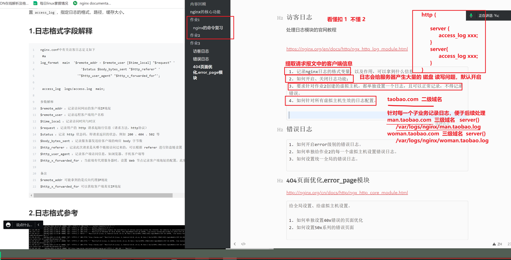

## nginx日志变量的格式，作用

## 找到nginx所有的内置变量，以及作用解释

```
https://nginx.org/en/docs/

https://nginx.org/en/docs/http/ngx_http_core_module.html#var_remote_addr

当你的nginx访客日志，需要记录更多的client请求信息，你可以来这里找，添加更多的变量，加入到如下的日志格式化参数中

看懂 扣 3 不懂 4

```


```
nginx.conf中有关访客日志定义如下
 #a
log_format  main  '$remote_addr - $remote_user [$time_local] "$request" '
                      '$status $body_bytes_sent "$http_referer" '
                    '"$http_user_agent" "$http_x_forwarded_for"';

 access_log  logs/access.log  main;

参数解释 
# 看到这个请求是从什么IP发来的。 remote_addr
$remote_addr ：记录访问网站的客户端IP地址
$remote_user ：记录远程客户端用户名称
$time_local ：记录访问时间与时区
$request ：记录用户的 http 请求起始行信息（请求方法，http协议）
$status ：记录 http 状态码，即请求返回的状态，例如 200 、404 、502 等
$body_bytes_sent ：记录服务器发送给客户端的响应 body 字节数
$http_referer ：记录此次请求是从哪个链接访问过来的，可以根据 referer 进行防盗链设置
$http_user_agent ：记录客户端访问信息，如浏览器、手机客户端等
$http_x_forwarded_for ：当前端有代理服务器时，设置 Web 节点记录客户端地址的配置，此参数生效的前提是代理服务器上也进行了相关的 x_forwarded_for 设置

备注
$remote_addr 可能拿到的是反向代理IP地址
$http_x_forwarded_for 可以获取客户端真实IP地址
```

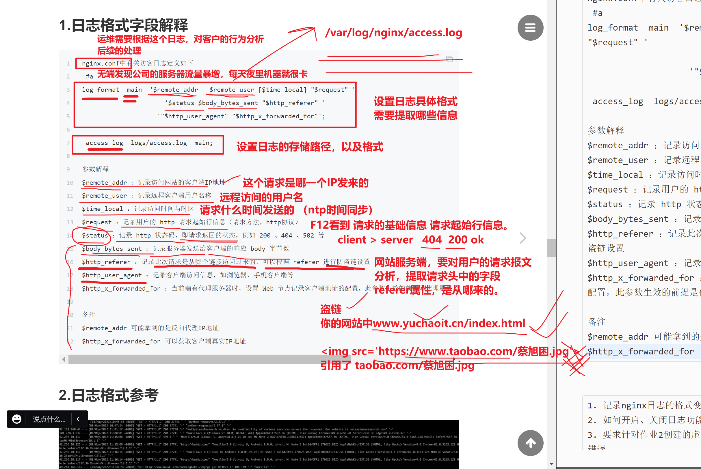


## 生产环境下的日志实践经验


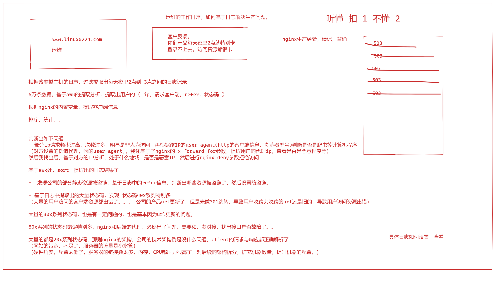


```
1. 记录nginx日志的格式变量，以及作用，可以拿到什么信息
2. 如何开启、关闭日志功能；

3. 要求针对作业2创建的虚拟主机，都单独设置一个日志，且可以正常记录，不得记录错误。
4. 如何针对所有虚拟主机生效的日志配置。


```


## 开启，关闭日志功能（先看默认的日志功能怎么用）

逐步分析，主配置文件nginx.con

```
[root@web-8 /etc/nginx]#cat /etc/nginx/nginx.conf 

user  www;
worker_processes  auto;

error_log  /var/log/nginx/error.log notice;
pid        /var/run/nginx.pid;


events {
    worker_connections  1024;
}


http {
    include       /etc/nginx/mime.types;
    default_type  application/octet-stream;

    log_format  main  '$remote_addr - $remote_user [$time_local] "$request" '
                      '$status $body_bytes_sent "$http_referer" '
                      '"$http_user_agent" "$http_x_forwarded_for"';

    access_log  /var/log/nginx/access.log  main;

    sendfile        on;
    #tcp_nopush     on;

    keepalive_timeout  65;

    #gzip  on;

    include /etc/nginx/conf.d/*.conf;
}

此时的虚拟主机配置文具，并未使用日志功能
[root@web-8 /etc/nginx]#cd conf.d/
[root@web-8 /etc/nginx/conf.d]#ls
88.conf  dnf.linux0224.conf  huoying.linux0224.conf  lol.linux0224.conf  port.conf
[root@web-8 /etc/nginx/conf.d]#
[root@web-8 /etc/nginx/conf.d]#grep 'access_log'  ./*


重启nginx服务，查看默认的日志功能
systemctl restart nginx
```

### 检测日志

```
tail -f /var/log/nginx/access.log
```

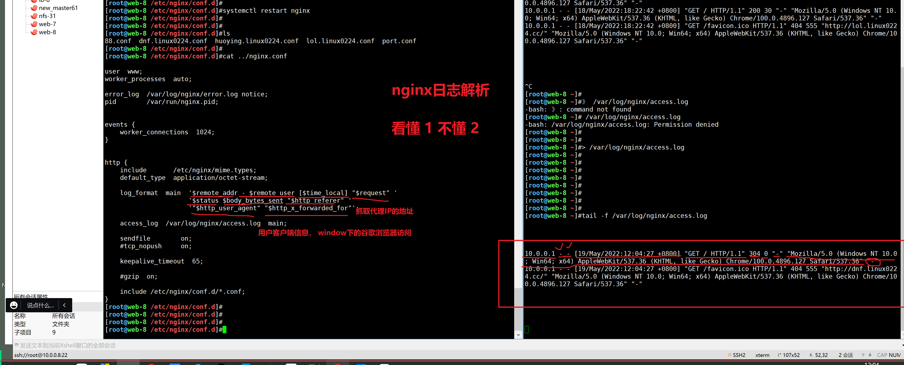

````
所有的子域名的日志都被统一记录到了一个文件中

http://dnf.linux0224.cc/
http://huoying.linux0224.cc/
````

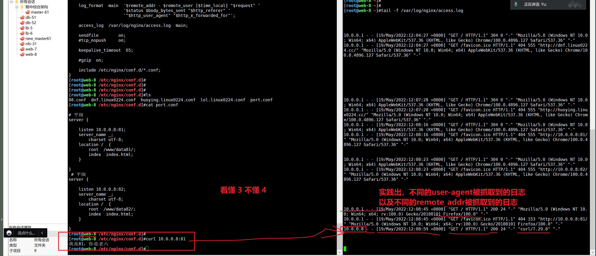


### 关闭日志功能

有时候在代理服务器上，转发服务器上，nginx日志可能不用记录，节省磁盘IO的资源。


```
http {
    include       /etc/nginx/mime.types;
    default_type  application/octet-stream;

    log_format  main  '$remote_addr - $remote_user [$time_local] "$request" '
                      '$status $body_bytes_sent "$http_referer" '
                      '"$http_user_agent" "$http_x_forwarded_for"';

    #access_log  /var/log/nginx/access.log  main;
    access_log off;


```


## 修改nginx访客日志的格式

自己添加，可以捕获更多的客户端的信息


```
https://nginx.org/en/docs/

https://nginx.org/en/docs/http/ngx_http_core_module.html#var_remote_addr

当你的nginx访客日志，需要记录更多的client请求信息，你可以来这里找，添加更多的变量，加入到如下的日志格式化参数中

看懂 扣 3 不懂 4


log_format  main  '$document_uri  $remote_addr - $remote_user [$time_local] "$request" '
                      '$status $body_bytes_sent "$http_referer" '
                      '"$http_user_agent" "$http_x_forwarded_for"';


```


### 单个虚拟主机，记录日志

针对每一个网站，单独的记录日志文件，便于分类管理。

正确的日志使用姿势如下。

·

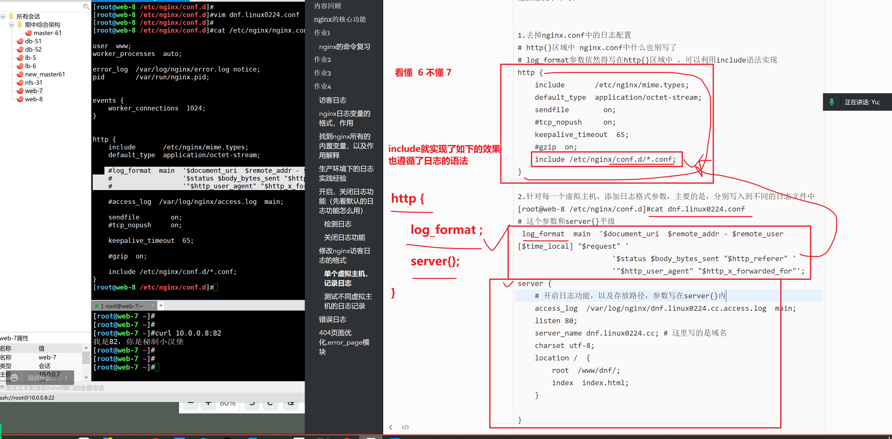


````
语法就是，将日志格式的配置参数，别写在http{}花括号中，而是写在各自的server{}虚拟主机中即可。
# 语法要求，log_format 格式化的日志的名字，还不得重复


1.去掉nginx.conf中的日志配置
# http{}区域中 nginx.conf中什么也别写了
# log_format参数依然得写在http{}区域中 ，可以利用include语法实现
http {
    include       /etc/nginx/mime.types;
    default_type  application/octet-stream;
    sendfile        on;
    #tcp_nopush     on;
    keepalive_timeout  65;
    #gzip  on;
    include /etc/nginx/conf.d/*.conf;
}

2.针对每一个虚拟主机，添加日志格式参数，主要的是，分别写入到不同的日志文件中
[root@web-8 /etc/nginx/conf.d]#cat dnf.linux0224.conf 
# 这个参数和server{}平级

 log_format  main  '$document_uri  $remote_addr - $remote_user [$time_local] "$request" '
                      '$status $body_bytes_sent "$http_referer" '
                      '"$http_user_agent" "$http_x_forwarded_for"';
server {
	# 开启日志功能，以及存放路径，参数写在server{}内
    access_log  /var/log/nginx/dnf.linux0224.cc.access.log  main;
    listen 80;
    server_name dnf.linux0224.cc; # 这里写的是域名
	charset utf-8;
    location /  {
        root  /www/dnf/;
        index  index.html;
    }

}


3. 单独记录lol域名业务的访客日志
[root@web-8 /etc/nginx/conf.d]#cat lol.linux0224.conf 

log_format  main2  '$remote_addr - $remote_user [$time_local] "$request" '
                      '$status $body_bytes_sent "$http_referer" '
                      '"$http_user_agent" "$http_x_forwarded_for"';

server {
    access_log  /var/log/nginx/lol.linux0224.cc.access.log  main2;
    listen 80;
    server_name lol.linux0224.cc;
	charset utf-8;
    location /  {
        root  /www/lol/;
        index  index.html;
    }

}


4.注意，开启access_log日志的参数，可以写在server{}区域里，但是日志格式化的参数，只能写在http{}区域中


````


### 测试不同虚拟主机的日志记录

现在有2个虚拟主机，单独记录了日志


#### dnf页面的访问情况，与日志记录

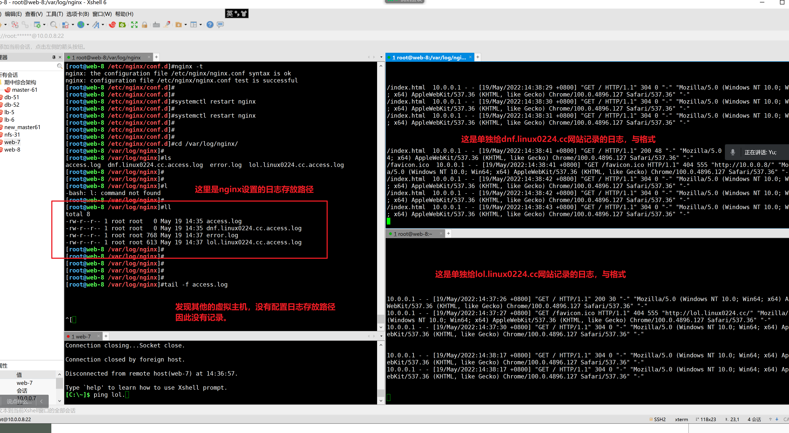


## 那其他的虚拟主机，日志不记录了吗？

解读日志的写入顺序


```
看你如何涉及了，你是继续针对每一个虚拟主机，添加日志
遵循上述讲解的语法

1. 给dnf和lol这两个三级域名，子业务的网站，单独记录访客日志

-rw-r--r-- 1 root root 3310 May 19 14:55 dnf.linux0224.cc.access.log

-rw-r--r-- 1 root root 2341 May 19 14:55 lol.linux0224.cc.access.log


2. 剩余其他的虚拟主机日志，全部统一记录到 /var/log/nginx/all-server-accesss.log

如下写法，就会去记录，除了你单独指定的虚拟主机的日志，剩下的日志，都会写入到这个all-server-accesss.log 文件中


nginx.conf 主配置如下
# 定义一个全局的设置
http {
    include       /etc/nginx/mime.types;
    default_type  application/octet-stream;

    log_format  main3  '$document_uri  $remote_addr - $remote_user [$time_local] "$request" '
                      '$status $body_bytes_sent "$http_referer" '
                      '"$http_user_agent" "$http_x_forwarded_for"';

    access_log  /var/log/nginx/all-server-accesss.log  main3;

    sendfile        on;
    #tcp_nopush     on;

    keepalive_timeout  65;

    #gzip  on;

    include /etc/nginx/conf.d/*.conf;
}


# 单独的虚拟主机，单独设置即可。。
到这，看懂扣 1不懂扣 3

# 检测所有的日志
[root@web-8 /var/log/nginx]#tail -f /var/log/nginx/*


# nginx的配置，存在虚拟主机的匹配，匹配到谁，就读取谁的配置。

# 只要是ip符合，port符合，并且有优先级加载顺序，就能匹配上

10.0.0.8:80   这个ip

你只要构造符合条件的 请求即可。

第一种虚拟主机，符合 10.0.0.8:80

第二种虚拟主机。符合，修改了端口的  10.0.0.8:81  10.0.0.8:82

第三种虚拟主机，符合修改了ip的  10.0.0.88:80

这里能看懂 扣  6  不懂 7 

练习的目的，在于搞懂，你有几个虚拟主机，以及你的请求，与哪一个虚拟主机匹配上了。

# 单独给 lol.linux0224.cc 设置了日志
# 单独给 dnf.linux0224.cc 设置了日志

# 其他的虚拟主机，就会默认匹配 http{ 设置的全局 日志参数了}


```

> 如果你觉得，默认的日志，和单独指定的日志，太混乱，
>
> 1.你就这么做，每一个虚拟主机，单独的设置日志参数，就行了，不需要去关心那个默认的日志（记录一堆网站的请求，也没什么实际意义）
>
> 只有针对单个的网站业务，记录的日志，才有提取，分析的意义。
>
> 


##  nginx提供的日志

```
记录用户访问记录的 ，access_log

记录nginx运行错误的日志  error_log

关于该参数的官网文档，以及具体的用法
https://nginx.org/en/docs/ngx_core_module.html#error_log

和access_log用法一样去以及
http{}
server{} 区域里面

Syntax:	error_log file [level];
Default:	
error_log logs/error.log error;
Context:	main, http, mail, stream, server, location


具体的level是指，日志记录的详细程度
有这些值让你填写
debug, info, notice, warn, error, crit, alert

从左到右，详细程度分别是 从 大  >>> 小

debug 会记录超级详细的信息，没必要，占用大量的磁盘空间
crit 表示nginx以及出现严重错误，以及崩溃了，才记录日志。。记录的内容太少
一般用的，以及默认的就是error日志级别，能够记录基本的，常见错误。


```


## 错误日志

```
1. 如何开启error级别的错误日志。
# 单独给的lol虚拟主机网址，设置错误日志，eroor级别 ，配置如下
# 支持写入http{}  server{}
[root@web-8 /etc/nginx/conf.d]#cat  lol.linux0224.conf 

log_format  main2  '$remote_addr - $remote_user [$time_local] "$request" '
                      '$status $body_bytes_sent "$http_referer" '
                      '"$http_user_agent" "$http_x_forwarded_for"';

server {
    access_log  /var/log/nginx/lol.linux0224.cc.access.log  main2;
    error_log /var/log/nginx/lol-error.log error;

    listen 80;
    server_name lol.linux0224.cc;
	charset utf-8;
    location /  {
        root  /www/lol/;
        index  index.html;
    }

}

重启服务
[root@web-8 /etc/nginx/conf.d]#systemctl restart nginx

检查日志
[root@web-8 /etc/nginx/conf.d]#tail -f /var/log/nginx/lol-error.log 

错误日志的，特点是记录，访问时的出错信息


2. 如何单独给作业2的每一个虚拟主机设置错误日志。


```

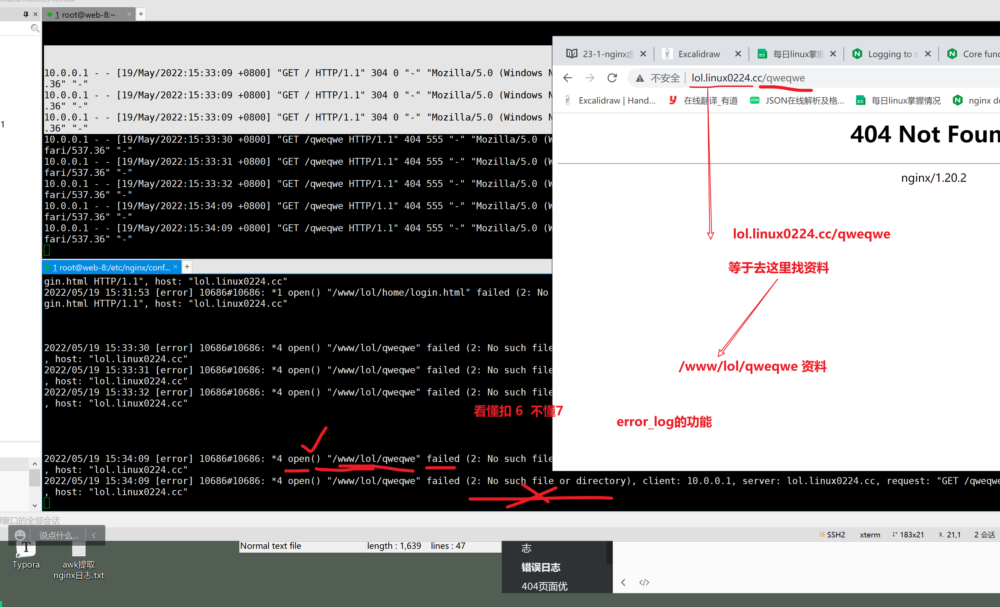

针对性的去分析error_log找出网站存在的弊端问题。。修复，告知给老大，你又多做了一些优化的活，年底绩效从B+ （3个月）打倒了 S+（5个月）


## 404页面优化,error_page模块

错误页面优化，nginx，默认访问出错后，会返回不同的错误页面

如 -

- 40x系列的页面
  - 404 not found 服务器上找不到该资源
  - 403 Forbidden 禁止访问（权限不够，找权限的问题）
- 如50x系列的页面
  - 学nginx反向代理
- 但是默认的都太丑，对其优化


http://nginx.org/cn/docs/http/ngx_http_core_module.html

```
给全局设置、给虚拟主机设置。

1. 如何单独设置40x错误的页面优化
2. 如何设置50x系列的错误页面

```

## 淘宝的错误页面

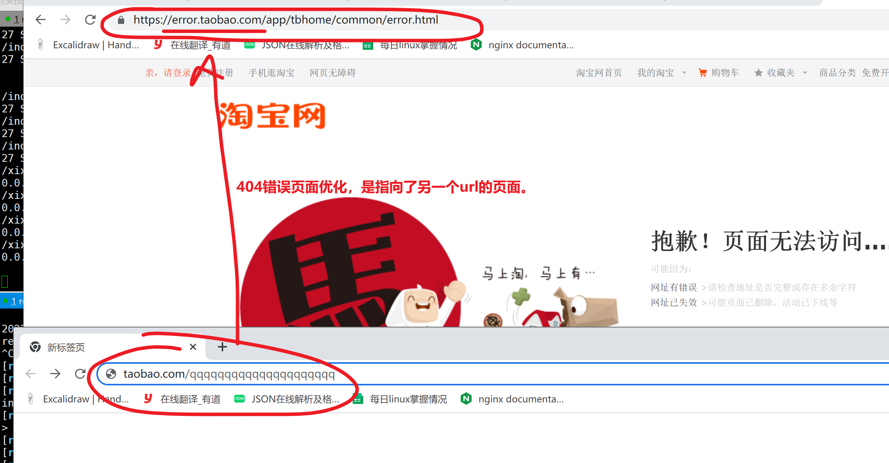

---

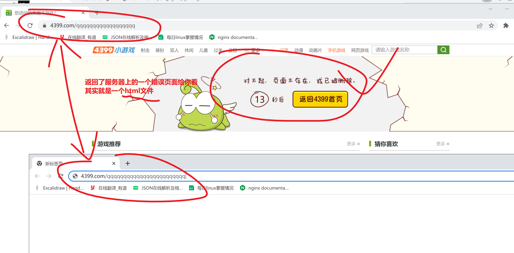


## 语法

```
# error_page  响应状态码    相对路径的html文件/ 填入url ; 

error_page 404             /404.html;
error_page 500 502 503 504 /50x.html;

```


### 优化错误页面，指向本地的html文件

```
针对lol的虚拟主机设置


[root@web-8 ~]#cat /etc/nginx/conf.d/lol.linux0224.conf 

log_format  main2  '$remote_addr - $remote_user [$time_local] "$request" '
                      '$status $body_bytes_sent "$http_referer" '
                      '"$http_user_agent" "$http_x_forwarded_for"';

# 当404错误时，返回当前机器上的my404.html
# 当403错误时，跳转到淘宝这个错误页面上
server {
    access_log  /var/log/nginx/lol.linux0224.cc.access.log  main2;
    error_log /var/log/nginx/lol-error.log error;
    error_page  404  /my404.html;
    error_page   403   https://error.taobao.com/app/tbhome/common/error.html;


    listen 80;
    server_name lol.linux0224.cc;
	charset utf-8;
    location /  {
        root  /www/lol/;
        index  index.html;
    }

}


# 创建404错误页面 
echo "我是美丽的404错误页面，你访问的资源不存在该服务器上！！！请检查你的URL"  > /www/lol/my404.html


[root@web-8 ~]#nginx -t
nginx: the configuration file /etc/nginx/nginx.conf syntax is ok
nginx: configuration file /etc/nginx/nginx.conf test is successful
[root@web-8 ~]#
[root@web-8 ~]#
[root@web-8 ~]#systemctl restart nginx

```

## 再次测试错误页面，针对lol这个虚拟主机

### 404错误页面


看懂扣 6  不懂 7 

从网站优化，用户体验角度设置的功能


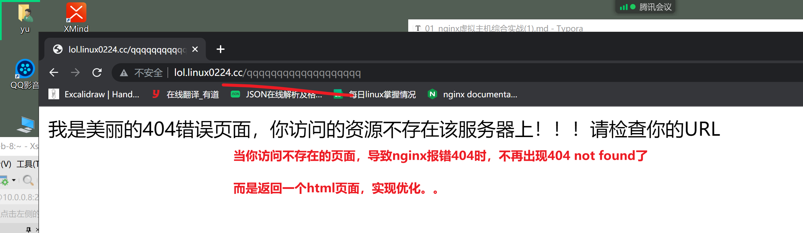


## 403错误的设置

```
指定跳转到另一个url，

```

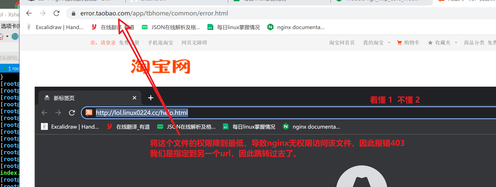


## 403指定跳转到当前机器的一个文件

```
[root@web-8 /etc/nginx/conf.d]#cat lol.linux0224.conf 

log_format  main2  '$remote_addr - $remote_user [$time_local] "$request" '
                      '$status $body_bytes_sent "$http_referer" '
                      '"$http_user_agent" "$http_x_forwarded_for"';

server {
    access_log  /var/log/nginx/lol.linux0224.cc.access.log  main2;
    error_log /var/log/nginx/lol-error.log error;
    error_page  404  /my404.html;
    error_page  403  /my403.html;


    listen 80;
    server_name lol.linux0224.cc;
	charset utf-8;
    location /  {
        root  /www/lol/;
        index  index.html;
    }

}

```

## 最后的测试。403，和404页面优化

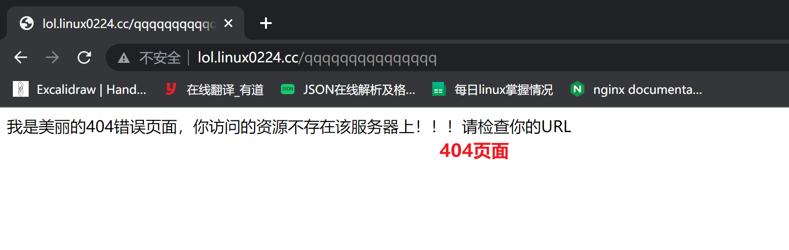


.

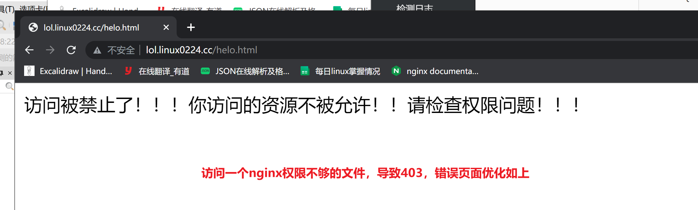


