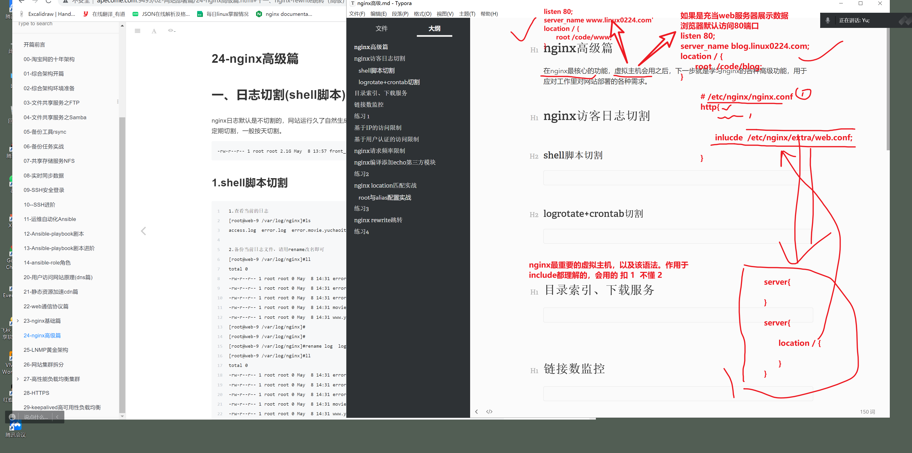
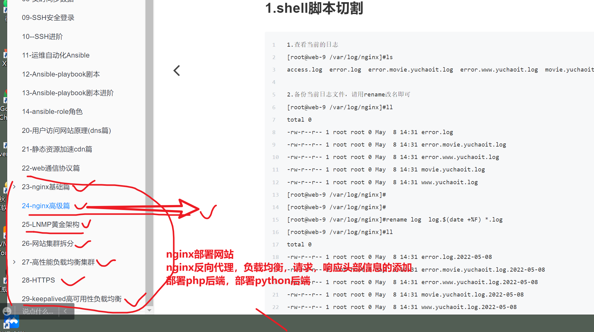
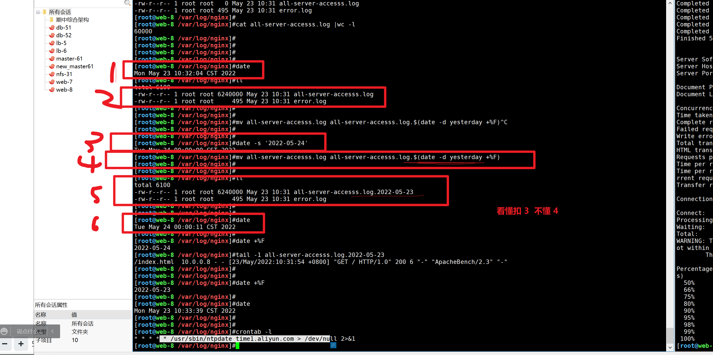
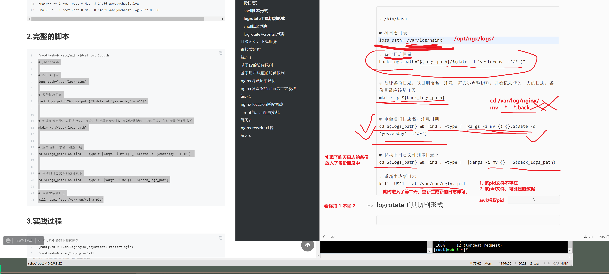
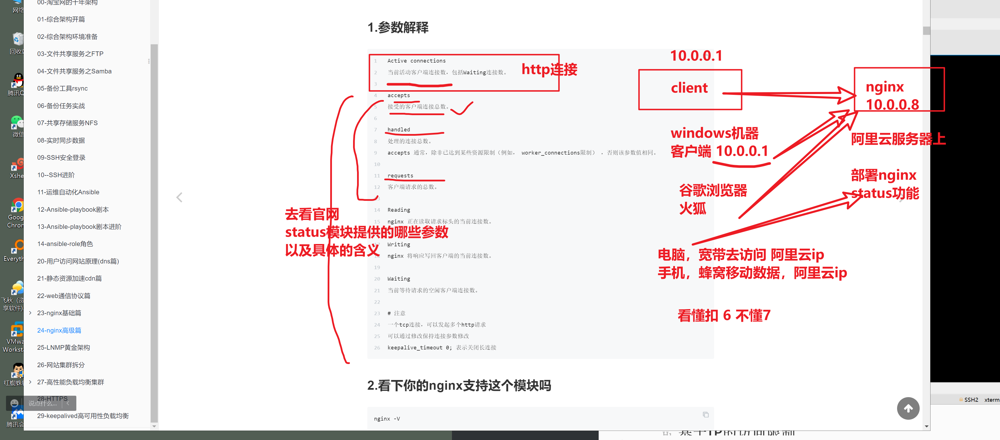
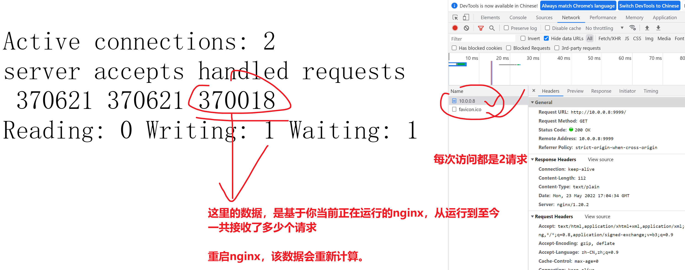
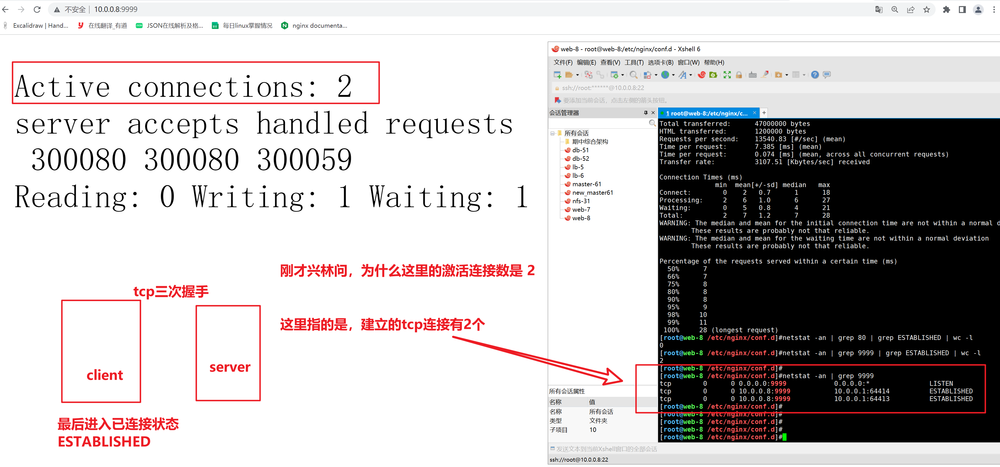

```### 此资源由 58学课资源站 收集整理 ###
	想要获取完整课件资料 请访问：58xueke.com
	百万资源 畅享学习

```
# nginx高级篇

在nginx最核心的功能，虚拟主机会用之后，下一步就是学习nginx的各种高级功能，用于应对工作里对网站部署的各种需求。







# nginx访客日志切割

## 切割理念（先纯手动的去切割日志，备份日志）

```
1. 给nginx进程发送信号，让nginx重新生成一个新日志文件，这就是一个日志切割根本


/var/log/nginx/access.log.bak   # 1.备份原本日志文件

nginx  reload  reopen信号
# 配置文件中定义的日志文件名，是这个
2. /var/log/nginx/access.log  	# 重新生成新日志文件，让新日志往这里去写


# 手动切割，修改日志
#1.准备好旧的日志文件，测试写入大量的日志记录，先用第一种办法，for循环
[root@web-8 ~]#for num in {1..10000};do curl 10.0.0.8 ; done


#2.使用支持多进程，并发写入的工具，如ab命令  apache提供的性能压测命令，给网站发送支持并发的大量的http请求。
[root@web-8 ~]#yum install httpd-tools -y

# 发送10000个http请求，且招来100个人同时发请求
ab -c 100 -n 10000  http://10.0.0.8/


# 3.当前日志数量
[root@web-8 /var/log/nginx]#cat all-server-accesss.log |wc -l
20000


# 3.让你有一个已经记录了大量日志的文件，得进行日志切割了

切割思路就是，1.先重命名，等于备份()  2. 重新记录nginx日志 (/var/log/nginx/access.log) 按天记录日志 （每天夜里的 整点分进行日志备份，日志）
按天，生成一个新的日志文件

# 备份旧日志（模拟是前一天的旧日志）

cd /var/log/nginx && mv all-server-accesss.log all-server-accesss.log.$(date '+%F')

# 还得生成新日志，得继续记录
给nginx进程发送reopen信号，重新生成新日志
# 用这种方式，可以最精确的提取进程id号。

kill -USR1 $(ps -ef|grep nginx |grep master | awk '{print $2}')

此时会生成新的日志
[root@web-8 /var/log/nginx]#ll
total 6084
-rw-r--r-- 1 www  root       0 May 23 10:10 all-server-accesss.log
-rw-r--r-- 1 root root 4160000 May 23 10:08 all-server-accesss.log.2022-05-23---10:04:17
-rw-r--r-- 1 www  root     700 May 23 10:10 error.log

此时新日志，就会记录到这个新的日志文件中了
==> all-server-accesss.log <==
/index.html  10.0.0.8 - - [23/May/2022:10:10:56 +0800] "GET / HTTP/1.1" 200 6 "-" "curl/7.29.0" "-"
/index.html  10.0.0.8 - - [23/May/2022:10:10:57 +0800] "GET / HTTP/1.1" 200 6 "-" "curl/7.29.0" "-"
/index.html  10.0.0.8 - - [23/May/2022:10:10:58 +0800] "GET / HTTP/1.1" 200 6 "-" "curl/7.29.0" "-"
/index.html  10.0.0.8 - - [23/May/2022:10:10:58 +0800] "GET / HTTP/1.1" 200 6 "-" "curl/7.29.0" "-"


对于旧的日志 你最好 创建文件夹去分类管理他们


```


## shell脚本形式

.你得先有解决问题的思路，然后将思路转变为linux命令，再优化为shell脚本



---




```\

#!/bin/bash

# 源日志目录
logs_path="/var/log/nginx"

# 备份日志目录
back_logs_path="${logs_path}/$(date -d 'yesterday' +'%F')"


# 创建备份目录，以日期命名，注意，每天零点整切割，开始记录新的一天的日志，备份目录应该是昨天
mkdir -p ${back_logs_path}


# 重命名旧日志名，注意日期
cd ${logs_path} && find . -type f |xargs -i mv {} {}.$(date -d 'yesterday'  +'%F') 


# 移动旧日志文件到该目录下
cd ${logs_path} && find . -type f  |xargs -i mv {}   ${back_logs_path}

# 重新生成新日志
kill -USR1 `ps -ef|grep nginx |grep master|awk '{print $2}'`

```

脚本写完了，先手动试试，脚本对不对

下一步就是，将这个脚本，添加到定时任务即可

```
crontab -e 

0 0  * * * /bin/bash /my_shell/back_nginx.sh 


# 测试修改日期，查看日志的备份是否正确
[root@web-8 /var/log/nginx]#ll /var/log/nginx/
total 0
drwxr-xr-x 2 root root 75 May 24 00:00 2022-05-23
-rw-r--r-- 1 www  root  0 May 24 00:00 all-server-accesss.log
-rw-r--r-- 1 www  root  0 May 24 00:00 error.log
[root@web-8 /var/log/nginx]#
[root@web-8 /var/log/nginx]#
[root@web-8 /var/log/nginx]#
[root@web-8 /var/log/nginx]#tail -5 all-server-accesss.log 
/index.html  10.0.0.8 - - [24/May/2022:00:00:28 +0800] "GET / HTTP/1.0" 200 0 "-" "ApacheBench/2.3" "-"
/index.html  10.0.0.8 - - [24/May/2022:00:00:28 +0800] "GET / HTTP/1.0" 200 0 "-" "ApacheBench/2.3" "-"
/index.html  10.0.0.8 - - [24/May/2022:00:00:28 +0800] "GET / HTTP/1.0" 200 0 "-" "ApacheBench/2.3" "-"
/index.html  10.0.0.8 - - [24/May/2022:00:00:28 +0800] "GET / HTTP/1.0" 200 0 "-" "ApacheBench/2.3" "-"
/index.html  10.0.0.8 - - [24/May/2022:00:00:28 +0800] "GET / HTTP/1.0" 200 0 "-" "ApacheBench/2.3" "-"
[root@web-8 /var/log/nginx]#
[root@web-8 /var/log/nginx]#
[root@web-8 /var/log/nginx]#
[root@web-8 /var/log/nginx]#ll
total 5076
drwxr-xr-x 2 root root      75 May 24 00:00 2022-05-23
-rw-r--r-- 1 www  root 5193864 May 24 00:00 all-server-accesss.log
-rw-r--r-- 1 www  root       0 May 24 00:00 error.log
[root@web-8 /var/log/nginx]#
[root@web-8 /var/log/nginx]#
[root@web-8 /var/log/nginx]#tail -5 2022-05-23/
all-server-accesss.log.2022-05-23  error.log.2022-05-23               
[root@web-8 /var/log/nginx]#tail -5 2022-05-23/all-server-accesss.log.2022-05-23 
/index.html  10.0.0.8 - - [23/May/2022:10:44:08 +0800] "GET / HTTP/1.0" 200 6 "-" "ApacheBench/2.3" "-"
/index.html  10.0.0.8 - - [23/May/2022:10:44:08 +0800] "GET / HTTP/1.0" 200 6 "-" "ApacheBench/2.3" "-"
/index.html  10.0.0.8 - - [23/May/2022:10:44:08 +0800] "GET / HTTP/1.0" 200 6 "-" "ApacheBench/2.3" "-"
/index.html  10.0.0.8 - - [23/May/2022:10:44:08 +0800] "GET / HTTP/1.0" 200 6 "-" "ApacheBench/2.3" "-"
/index.html  10.0.0.8 - - [23/May/2022:10:44:08 +0800] "GET / HTTP/1.0" 200 6 "-" "ApacheBench/2.3" "-"

```


## logrotate工具切割形式

比shell脚本手动切割日志更方便的工具

```
# 看看该日志切割工具，支持哪些软件


# 默认改工具，对nginx的支持.
# 这里的写法，是针对你的yum安装的nginx，实现日志切割

[root@web-8 /var/log/nginx]#cat /etc/logrotate.d/nginx 
/var/log/nginx/*.log {
        daily                            # 每天切割
        missingok                    # 忽略错误
        rotate 52                    # 最多保留多少个存档    
        compress                    # 切割后且压缩
        delaycompress            # 延迟压缩动作在下一次切割
        notifempty                # 日志为空就不切割
        create 640 nginx adm        # 切割的文件权限
        sharedscripts                # 共享脚本，结果为空
        postrotate                    # 收尾动作，重新生成nginx日志
                if [ -f /var/run/nginx.pid ]; then
                        kill -USR1 `cat /var/run/nginx.pid`
                fi
        endscript                        # 结束动作
}


# 如果说你要用这个logrotate工具对你的编译安装的淘宝nginx实现日志切割，你还会写吗？
# 会的扣 1 不会扣 2

# 区别是1.确定日志目录 /opt/ngx/logs/  ；    2.给nginx主进程发送USR1信号（tengine是生成了nginx.pid文件，还是没有）


# 生成切割脚本
# 针对你编译安装的 淘宝nginx，实现自动的日志切割

cat > /etc/logrotate.d/tengine <<EOF
/opt/ngx/logs/*.log {
        daily                            # 每天切割
        missingok                    # 忽略错误
        rotate 52                    # 最多保留多少个存档    
        compress                    # 切割后且压缩
        delaycompress            # 延迟压缩动作在下一次切割
        notifempty                # 日志为空就不切割
        create 640 nginx adm        # 切割的文件权限
        sharedscripts                # 共享脚本，结果为空
        postrotate                    # 收尾动作，重新生成nginx日志
                if [ -f /opt/ngx/sbin/tengine.pid ]; then
                        kill -USR1 `cat /opt/ngx/sbin/tengine.pid`
                fi
        endscript                        # 结束动作
}

看具体的效果，是否理解
先清理你刚才的shell的定时任务
重新生成nginx日志环境，然后测试工具
[root@web-8 /var/log/nginx]#crontab -e
crontab: installing new crontab
[root@web-8 /var/log/nginx]#
[root@web-8 /var/log/nginx]#
[root@web-8 /var/log/nginx]#
[root@web-8 /var/log/nginx]#ntpdate -u ntp.aliyun.com


23 May 10:59:03 ntpdate[4346]: step time server 203.107.6.88 offset -47699.063535 sec
[root@web-8 /var/log/nginx]#
[root@web-8 /var/log/nginx]#
[root@web-8 /var/log/nginx]#
[root@web-8 /var/log/nginx]#date
Mon May 23 10:59:14 CST 2022


应该先修改时间，作为测试

测试logrotate工具是否实现日志切割
手动实现日志切割，执行该工具
logrotate -f /etc/logrotate.d/nginx


被切割后的日志
[root@web-8 /var/log/nginx]#ll -h
total 21M
-rw-r----- 1 www  adm   10M May 24 00:01 all-server-accesss.log
-rw-r--r-- 1 root root 5.0M May 23 10:59 all-server-accesss.log.1
-rw-r----- 1 www  adm     0 May 24 00:01 error.log
-rw-r--r-- 1 root root  700 May 24 00:01 error.log.1


logrotate工具，本身会压缩备份的日志文件，是因为，压缩工作，被延迟到了下一次切割
logrotate -f /etc/logrotate.d/nginx
等于实现了第二次切割动作，本次会进行日志压缩了


最终的操作，应该吧这个切割命令，写入到定时任务即可
[root@web-8 /var/log/nginx]#crontab -l
00 00 * * *  logrotate -f /etc/logrotate.d/nginx


```


# 目录索引、下载服务

实现一个类似于ftp工具的功能

1.先准备好一个用于共享的数据目录

2.部署server虚拟主机，然后去展示这些数据，完事


```
1. 准备一个 rpm包的 目录

2. 提供该rpm包目录的展示
mkdir /0224rpms

[root@web-8 /0224rpms]#yum install python3 python3-devel --downloadonly --downloaddir=/0224rpms


3.创建nginx的虚拟主机
[root@web-8 /0224rpms]#cat /etc/nginx/conf.d/autoindex.conf
server {

listen 11111;
server_name _;
location / {
	        autoindex on;
        autoindex_localtime on;
        autoindex_exact_size off;
	root /0224rpms;
}
}


4.重启nginx实现该目录索引功能
[root@web-8 /0224rpms]#systemctl reload nginx
如何明确，该虚拟主机是否可用
[root@web-8 /0224rpms]#netstat -tunlp |grep 11111
tcp        0      0 0.0.0.0:11111           0.0.0.0:*               LISTEN      4361/nginx: master  


5.测试访问即可
此时这个虚拟主机就提供了基于http请求的文件下载功能


6.利用wget下载
wget http://10.0.0.8:11111/python3-3.6.8-18.el7.x86_64.rpm


```

## 动手完成这个实现

- 日志切割实现
- 目录索引功能，提供python3的rpm包下载功能
- 练习完毕后，去腾讯文档 输入1，表示练习完毕


# 链接数监控

web协议篇

tcp/ip

http 请求，与响应

nginx服务器，   client浏览器，curl，等都是封装了，以http协议规范发出的请求


```
http://www.linux0224.com/奥力给.jpg
这是一个完整的url，你要能看懂每一个符号的含义


默认nginx不支持这个功能，你要看一看你装的nginx是否有这个模块


创建nginx的虚拟主机文件，单独的去测试这个statsu状态功能即可

如果你的nginx默认不支持这个status功能，
重新编译nginx二进制命令，吧这个模块添加进去


# 创建虚拟主机文件，查看status功能

[root@web-8 /etc/nginx/conf.d]#cat  status.conf
# 作用就是让你访问 ip:9999可以精确定位到这个虚拟主机
server{
    listen 9999;
    server_name _;
  	stub_status on;
  	access_log off; # 因为它不是一个基于http请求响应的网站，仅仅是展示连接的信息，都不需要写location。
}

重新读取
[root@web-8 /etc/nginx/conf.d]#cat  status.conf
server{
    listen 9999;
    server_name localhost;
  stub_status on;
  access_log off;
}
[root@web-8 /etc/nginx/conf.d]#
[root@web-8 /etc/nginx/conf.d]#nginx -t
nginx: the configuration file /etc/nginx/nginx.conf syntax is ok
nginx: configuration file /etc/nginx/nginx.conf test is successful
[root@web-8 /etc/nginx/conf.d]#
[root@web-8 /etc/nginx/conf.d]#
[root@web-8 /etc/nginx/conf.d]#systemctl reload nginx


测试访问； 


```



---



```
因为你restart nginx
等于重新生成master进程，这些数据就没了，重新计算了。

关于nginx连接信息的，动态玩法
ab命令测试
这里的关于连接的详细信息，需要从web协议篇去理解，从tcp，http的理解
```

利用ab命令测试

```
ab -c 100 -n 100000 http://10.0.0.8/
```


## 为什么激活数是2





# 练习 1

```
```

上午，把nginx的访问认证讲完


12.25继续


# 基于IP的访问限制

```
```


 # 基于用户认证的访问限制

```
```


# nginx请求频率限制

```
```


# nginx编译添加echo第三方模块

```
```


# 练习2

```
```


# nginx location匹配实战

```
```


## root与alias配置实战

```
```


# 练习3

```
```


# nginx rewrite跳转

```
```


# 练习4

```
```


