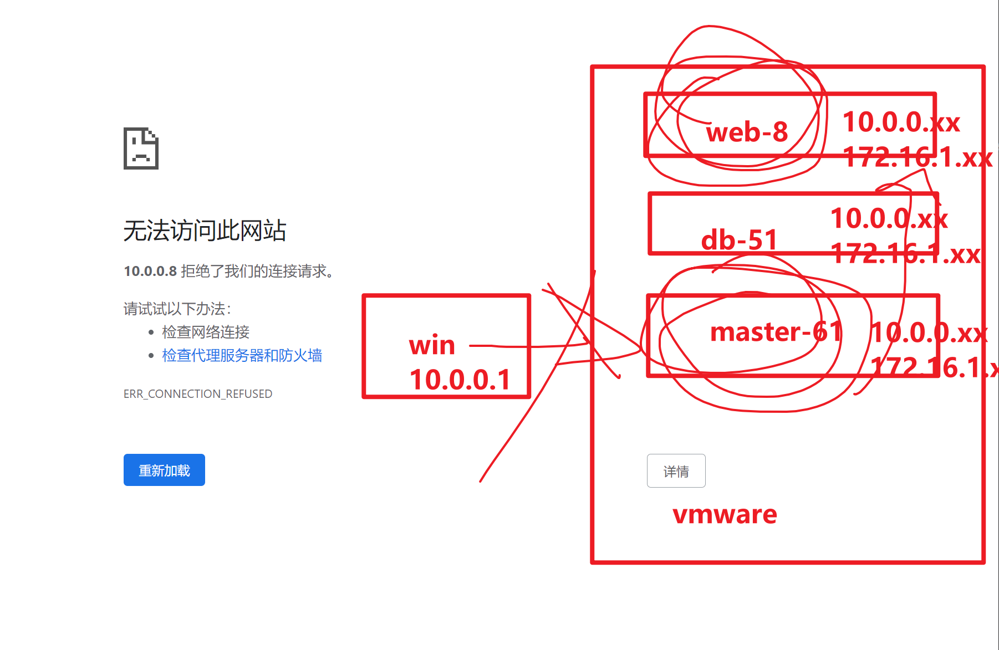

```### 此资源由 58学课资源站 收集整理 ###
	想要获取完整课件资料 请访问：58xueke.com
	百万资源 畅享学习

```
早晨起来，拥抱太阳，满满的正能量。。

开机。。学习。。

一杯茶，一包烟，一坐就是一天。。


```
石墨总结
作业练习，我都翻了翻

作业，做的有的是错的。。

你对题意不懂，或者对自己的做法，不确认是否正确
下午写作业，练习，等环节

随时给老师发微信，提问

务必去石墨上，写下你的学习疑问，这样，我能知道你的问题，帮你解决。。。


```

# nginx高级篇

# 基于ip地址的访问限制


```
allow xxxxx;
deny   xxxx;


他俩的放置顺序；


```

## 第一题

```

第一题
限制只允许10.0.0.0~10.0.0.255范围的IP访问（禁止其他网段的访问）

创建虚拟主机，完成该功能
[root@web-8 /etc/nginx/conf.d]#cat deny-allow.conf 
server {

listen 22334;
server_name _;

location /  {
    allow 10.0.0.0/24;
    deny all;
	root  /www/deny-allow;
	index index.html;
}

}

创建测试数据，查看访问情况
[root@web-8 /etc/nginx/conf.d]#mkdir -p /www/deny-allow
[root@web-8 /etc/nginx/conf.d]#
[root@web-8 /etc/nginx/conf.d]#
[root@web-8 /etc/nginx/conf.d]#echo 'I am web-8  , test  deny  and  allow !!!!!!!!'  > /www/deny-allow/index.html

[root@web-8 /etc/nginx/conf.d]#systemctl restart nginx
[root@web-8 /etc/nginx/conf.d]#
[root@web-8 /etc/nginx/conf.d]#
[root@web-8 /etc/nginx/conf.d]#netstat -tunlp|grep 22334
tcp        0      0 0.0.0.0:22334           0.0.0.0:*               LISTEN      7402/nginx: master  


看到这里，看懂扣 1，不懂2

测试访问情况   可以 6 不可以 7  

1. 用win去访问，可以吗？  可以的
http://10.0.0.8:22334/

2. 用61机器去访问，
# 网卡的流量，网段是对应起来的 
eth0   10.0.0.61
eth1    172.16.1.61

看懂扣 1，不懂 2 

curl 10.0.0.8:22334        # 从61机器的10.0.0.61发出
curl 172.16.1.8:22334	  # 从61机器的172.16.1.61发出


```

提示

```
只写一个allow的话，等于没有任何意义，必须做好deny限制，才有实际意义。

```

## 第二题


```
- 限制只允许172.16.1.0 ~ 172.16.1.255 范围的IP访问，禁止其他任意的地址访问。
[root@web-8 /etc/nginx/conf.d]#cat deny-allow.conf 
server {

listen 22334;
server_name _;

location /  {
        #allow 10.0.0.0/24;
        allow 172.16.1.0/24;
		deny  all;  # 拒绝客户端访问该网页根目录下的资源，返回403权限不足
	root  /www/deny-allow;
	index index.html;
}

}


你发现，处于同一个内网环境下的 ，有172网段的机器是通的，
比如win这回访问可以通码？ 可以 1 不可以 2


```

## 第三题

```
- 限制只允许windows访问（禁止其他机器访问，比如任意的 10.0.0.61  任意的172.16.1.52）


[root@web-8 /etc/nginx/conf.d]#cat deny-allow.conf 
server {

listen 22334;
server_name _;

location /  {
        # allow 10.0.0.0/24;
        # allow 172.16.1.0/24;
        allow 10.0.0.1;
		deny  all;  # 拒绝客户端访问该网页根目录下的资源，返回403权限不足
	root  /www/deny-allow;
	index index.html;
}

}

# 看懂 3  不懂 4

# 待会试试，用不同网段的客户端ip，访问，查看权限
# 测试几个客户端
10.0.0.1 通 ，只有这一个ip地址是通的.

10.0.0.61  不通
172.16.1.52 不通


```

## 第四题


```
- 限制拒绝10.0.0.0~10.0.0.255范围的IP访问（得允许其他网段访问）
(这个ip限制规则，自上而下的匹配，匹配到规则后，就不会继续向后匹配了)


此时只能通过内网的172网卡去访问这个机器了
# 配置如下
[root@web-8 /etc/nginx/conf.d]#cat deny-allow.conf 
server {

listen 22334;
server_name _;

location /  {
    deny 10.0.0.0/24;
	root  /www/deny-allow;
	index index.html;
}

}


# 通过如下这几个客户端试试，先用10网段的试试
发现10网段全部被拒绝
发现172网段是允许被访问的

```


## 第五题

基于ip，判断出目标机器是windos吗？

通过目标机器的user-agent去判断，判断的浏览器客户端，是windows等情况，拒绝

>

```
限制只拒绝windows访问。其他人都允许访问
[root@web-8 /etc/nginx/conf.d]#cat deny-allow.conf 
server {

listen 22334;
server_name _;

location /  {
        deny 10.0.0.1;
	root  /www/deny-allow;
	index index.html;
}

}


10.0.0.1 只有它不能访问

测试


```


```
window访问 172.16.1.8:22334 

能通 扣 1，不能扣 2


windows(vmnet8  10.0.0.1，)

172网段（vmware提供的LAN网段，纯局域网，）
```


# 基于用户认证的访问限制


---


---




```
给虚拟主机，加上密码验证


1. 创建密码，密码不是一个简单的纯文本文件，得基于密码数据库的存储
有工具帮你完成htpasswd这个工具去创建密码文件
yum -y install httpd-tools 

创建密码文件
# -b 免交互，输入账号密码即可
# -c 设置密码写入到什么文件

htpasswd -b -c /etc/nginx/auth_passwd yuchao01 yuchao666

[root@web-8 /etc/nginx/conf.d]#cat /etc/nginx/auth_passwd 
yuchao01:$apr1$.D27Ssim$P9KebeNNrgXWUIbo1fZs40


2. 让nginx 的虚拟主机，支持该功能，并且由于是内网文档，让他只在内网下可访问
[root@web-8 /etc/nginx/conf.d]#nginx -t
nginx: the configuration file /etc/nginx/nginx.conf syntax is ok
nginx: configuration file /etc/nginx/nginx.conf test is successful
[root@web-8 /etc/nginx/conf.d]#
[root@web-8 /etc/nginx/conf.d]#
[root@web-8 /etc/nginx/conf.d]#
[root@web-8 /etc/nginx/conf.d]#
[root@web-8 /etc/nginx/conf.d]#cat auth_basic.conf 
server {
	listen 172.16.1.8:33334;
	charset utf-8;
	server_name _;
	location / {
		    	auth_basic "please input your account password";
        auth_basic_user_file /etc/nginx/auth_passwd;
		root /www/auth-html;
		index index.html;
	
	} 

}


        


3.创建测试数据
[root@web-8 ~]#mkdir -p /www/auth-html
[root@web-8 ~]#
[root@web-8 ~]#echo '我是用于验证账户密码的，你不输入密码，别想看到我！！！' > /www/auth-html/index.html


4.启动测试访问
用win去测试
10.0.0.8:33334  觉得通的 扣 1 不通 2，这一次都不是权限之类的问题，而是tcp/ip都没有建立。直接提示网络连接失败

这里由于我们是学习环境，linux虚拟机的网段，都是vmware提供的纯局域网
在企业里，也会有内网环境，但是有网工给你配置好了所有的环境

你的办公电脑，会有该内网的ip，可以访问到该内网下的资料（需要进行一系列的网络转发设置）


只能在内网环境下，去访问了
172，只能是linux下的访问


# 咱们临时测试，还是先用windows去访问该站点
# 理解了nginx虚拟主机，绑定网段即可，
# 还是改为，允许让windows也可以访问，修改监听的地址，放置到10网段


[root@web-8 /etc/nginx/conf.d]#
[root@web-8 /etc/nginx/conf.d]#netstat -tunlp|grep 33334
tcp        0      0 10.0.0.8:33334          0.0.0.0:*               LISTEN      7765/nginx: master  
[root@web-8 /etc/nginx/conf.d]#cat auth_basic.conf 
server {
	#listen 172.16.1.8:33334;
	listen 10.0.0.8:33334;
	charset utf-8;
	server_name _;
	location / {
		    	auth_basic "please input your account password";
        auth_basic_user_file /etc/nginx/auth_passwd;
		root /www/auth-html;
		index index.html;
	
	} 

}
[root@web-8 /etc/nginx/conf.d]#
[root@web-8 /etc/nginx/conf.d]#netstat -tunlp|grep 33334
tcp        0      0 10.0.0.8:33334          0.0.0.0:*               LISTEN      7765/nginx: master  


# 此时你就可以基于10网段去访问了


```


---

基于ie浏览器可以看到你的提示信息，看不到也无所谓


# nginx限流模块

>1.知道用法即可，生产下的限流，更多的是后端框架中限制，nginx这里一般不做，可能导致请求出错。知道用法，以后看到企业里在用，会维护即可。
>
>2.以及理解限流的概念。


```
计算机程序，会给网站带来极大的恶意流量，导致服务器压力多大，以及网站所有的负载都会很大


www.taobao.com  

服务端
nginx 解析这用户的请求
tcp/ip连接

大量的客户端，大量的ip，去访问服务器，导致服务器建立的大量的tcp连接
(这些大量的ip都是恶意ip，肉鸡一类的机器，而非正常用户的ip)

默认情况下，服务器可建立的连接时65535个tcp连接

```

### 具体nginx限流的配置

```
针对客户端ip判断的，以及针对请求访问速率的限制模块


```


```
基础语法看懂 扣 6 不懂7 


```

实际配置

- 限速规则是1秒一个请求
- 提供3个VIP特殊请求

- nodelay参数作用

```
```


```
你自己别去瞎写规则，这里是基于令牌算法，需要对该算法有一定认识，才能看懂规则，根据我的思路来

# 定制虚拟主机文件
[root@web-8 /etc/nginx/conf.d]#cat limit_req.conf 
limit_req_zone $binary_remote_addr zone=one:10m rate=1r/s;

server {
    listen       33555;
    server_name  _;
    charset utf-8;
    access_log /var/log/nginx/limit_req.log;
    limit_req zone=one burst=3 nodelay;
    location / {
        root   /www/limit-req; 
        index  index.html index.htm;
    }
}


# 创建测试数据目录
[root@web-8 /etc/nginx/conf.d]#mkdir -p /www/limit-req
[root@web-8 /etc/nginx/conf.d]#
[root@web-8 /etc/nginx/conf.d]#echo '我是限速模块，你别太快，太快不好' > /www/limit-req/index.html
[root@web-8 /etc/nginx/conf.d]#
[root@web-8 /etc/nginx/conf.d]#
[root@web-8 /etc/nginx/conf.d]#nginx -t
nginx: the configuration file /etc/nginx/nginx.conf syntax is ok
nginx: configuration file /etc/nginx/nginx.conf test is successful
[root@web-8 /etc/nginx/conf.d]#
[root@web-8 /etc/nginx/conf.d]#
[root@web-8 /etc/nginx/conf.d]#systemctl restart nginx


```


查看限速，以及3个VIP名的作用

```

```


---


### nodelay参数作用

用法1，不加nodelay参数

这个nginx的意思是，该虚拟主机，限制客户端 1秒内只能有5个请求，其他请求全部延迟排队。这个参数有麻烦，别用，可能导致出现大问题。

```
[root@web-8 ~]#cat  /etc/nginx/conf.d/limit_req.conf 
limit_req_zone $binary_remote_addr zone=one:10m rate=5r/s;

server {
    listen       33555;
    server_name  _;
    charset utf-8;
    access_log /var/log/nginx/limit_req.log;
    limit_req zone=one burst=3 ;
    location / {
        root   /www/limit-req; 
        index  index.html index.htm;
    }
}

```

用法2，添加nodelay参数

请求不排队，限速是几个就几个，超过就直接503拒绝，以及设置了burst特殊请求。


# 内置变量


```
[root@master-61 ~]#cat vars.txt 
echo $args
echo $query_string
echo $arg_NAME
echo $is_args
echo $uri
echo $document_uri
echo $document_root
echo $host
echo $hostname
echo $https
echo $binary_remote_addr
echo $body_bytes_sent
echo $bytes_sent
echo $connection
echo $connection_requests
echo $content_length
echo $content_type
echo $cookie_name
echo $limit_rate
echo $msec
echo $nginx_version
echo $pid
echo $pipe
echo $proxy_protocol_addr
echo $realpath_root
echo $remote_addr
echo $remote_port
echo $remote_user
echo $request
echo $request_body
echo $request_body_file
echo $request_completion
echo $request_filename
echo $request_length
echo $request_method
echo $request_time
echo $request_uri
echo $scheme
echo $server_addr
echo $server_name
echo $server_port
echo $server_protocol
echo $status
echo $time_iso8601
echo $time_local
echo $cookie_NAME
echo $http_NAME
echo $http_cookie
echo $http_post
echo $http_referer
echo $http_user_agent
echo $http_x_forwarded_for
echo $sent_http_NAME
echo $sent_http_cache_control
echo $sent_http_connection
echo $sent_http_content_type
echo $sent_http_keep_alive
echo $sent_http_last_modified
echo $sent_http_location
echo $sent_http_transfer_encoding

```

# 接下来的几个nginx高级知识点

```
吧nginx 的核心知识点，拆开讲解

部署LNMP架构，单机架构，集群架构

反向代理，负载均衡

必须得吧nginx基础玩明白


虚拟主机。日志，。参数使用的作用于，内置变量，以及nginx的location匹配，url重写等。


```


```
和HTTP协议指南挂钩，

想把web做好，必须得玩明白HTTP协议。


```


# nginx开启第三方模块


```
1.nginx装好之后，想添加额外的模块，只能重新编译，添加这个模块。

2. nginx的第三方模块 echo模块，用于打印nginx中所有变量的信息。

先看看一个不支持echo模块的，使用该语法什么样


```


## 编译安装nginx，添加第三方模块

.


```
# 1.重新下载安装nginx，设置新的 nginx命令

yum -y install gcc-c++ 

yum -y install pcre pcre-devel
yum -y install zlib zlib-devel
yum -y install openssl openssl-devel  


# 3.准备好nginx编译环境
yum install pcre pcre-devel openssl openssl-devel  zlib zlib-devel gzip  gcc gcc-c++ make wget httpd-tools vim -y


# 降低nginx运行时的权限，但是也要注意，你的网页根目录，是否给该用户设置了读写权限。

groupadd www -g 666
useradd www -u 666 -g 666 -M -s /sbin/nologin

# 4.开始下载echo模块源码，然后编译且安装，添加给nginx

# 下载源码nginx，进行编译，添加第三方模块的代码即可
cd /opt/
wget http://nginx.org/download/nginx-1.19.0.tar.gz
tar -zxf nginx-1.19.0.tar.gz 

[root@web-8 /opt]#cd nginx-1.19.0/
[root@web-8 /opt/nginx-1.19.0]#
[root@web-8 /opt/nginx-1.19.0]#ls
auto  CHANGES  CHANGES.ru  conf  configure  contrib  html  LICENSE  man  README  src

# 5.此时可以编译安装这个nginx了，重点就在这
#通过编译参数 --add-module添加第三方的模块，给nginx
[root@web-8 /opt]#cd /opt/nginx-1.19.0/
[root@web-8 /opt/nginx-1.19.0]#
[root@web-8 /opt/nginx-1.19.0]#
# 编译三部曲，第一曲，设置编译参数
[root@web-8 /opt/nginx-1.19.0]#ls
auto  CHANGES  CHANGES.ru  conf  configure  contrib  html  LICENSE  man  README  src
[root@web-8 /opt/nginx-1.19.0]#

./configure \
--user=www \
--group=www \
--prefix=/opt/nginx-1-19-0 \
--with-http_stub_status_module \
--with-http_ssl_module \
--with-pcre \
--add-module=/opt/echo-nginx-module

# 第二曲，第三曲
make && make install 

# 你必须吧上面的linux基础编译依赖环境给装好，否则这里可能会出错。。

# 编译结束后，查看生成的二进制命令，是否支持了echo模块
# 编译结束后，nginx的源码目录就可以删除了。 

# 查看最终的nginx安装目录

[root@web-8 /opt/nginx-1-19-0]#./sbin/nginx -v
nginx version: nginx/1.19.0
[root@web-8 /opt/nginx-1-19-0]#
[root@web-8 /opt/nginx-1-19-0]#
[root@web-8 /opt/nginx-1-19-0]#./sbin/nginx -V
nginx version: nginx/1.19.0
built by gcc 4.8.5 20150623 (Red Hat 4.8.5-44) (GCC) 
built with OpenSSL 1.0.2k-fips  26 Jan 2017
TLS SNI support enabled
configure arguments: --user=www --group=www --prefix=/opt/nginx-1-19-0 --with-http_stub_status_module --with-http_ssl_module --with-pcre --add-module=/opt/echo-nginx-module

# 发现该nginx是支持echo模块的


# 下载echo模块的源代码
# 通过个git命令，去下载github代码仓库中的源码目录

yum install git -y # 

cd /opt/
# 由于某些不可描述的因素，代码可能下载不了。。
# 去windows中下好了，发给linux

git clone https://github.com/openresty/echo-nginx-module.git

下载完毕
[root@web-8 /opt]#git clone https://github.com/openresty/echo-nginx-module.git
Cloning into 'echo-nginx-module'...


remote: Enumerating objects: 3039, done.
remote: Counting objects: 100% (21/21), done.
remote: Compressing objects: 100% (16/16), done.
remote: Total 3039 (delta 7), reused 15 (delta 5), pack-reused 3018
Receiving objects: 100% (3039/3039), 1.17 MiB | 1.44 MiB/s, done.
Resolving deltas: 100% (1631/1631), done.


查看echo模块的源代码内容
[root@web-8 /opt]#ls /opt/echo-nginx-module/
config  LICENSE  README.markdown  src  t  util  valgrind.suppress


```


## 使用该echo模块，可以打印，调试nginx的变量等信息

```
创建虚拟主机了，给你编译的nginx创建配置文件了。。

优化默认的配置文件，去除无用的内容
利用include语法，导入自定义的配置文件
[root@web-8 /opt/nginx-1-19-0/conf]#cat nginx.conf
worker_processes  1;
events {
    worker_connections  1024;
}
http {
    include       mime.types;
    default_type  application/octet-stream;
    sendfile        on;
    keepalive_timeout  65;

    # 自定义配置文件优化
    include /opt/nginx-1-19-0/conf/extra/*.conf;
}


# 创建子配置文件
[root@web-8 /opt/nginx-1-19-0/conf]#mkdir extra
[root@web-8 /opt/nginx-1-19-0/conf]#
[root@web-8 /opt/nginx-1-19-0/conf]#cd extra/
[root@web-8 /opt/nginx-1-19-0/conf/extra]#
[root@web-8 /opt/nginx-1-19-0/conf/extra]#vim test-echo.conf
[root@web-8 /opt/nginx-1-19-0/conf/extra]#
[root@web-8 /opt/nginx-1-19-0/conf/extra]#
[root@web-8 /opt/nginx-1-19-0/conf/extra]#
[root@web-8 /opt/nginx-1-19-0/conf/extra]#cat test-echo.conf 
server {
    listen       11444;
    server_name  localhost;
    charset utf-8;
    location / {
       echo "yuchaoit.cn welcome you!";
       echo $uri;
       echo $document_uri;
       echo $remote_addr;
       echo $remote_port;
       echo $http_user_agent;
    }
}


# 验证配置是否正确，启动nginx
[root@web-8 /opt/nginx-1-19-0/conf/extra]#/opt/nginx-1-19-0/sbin/nginx -t
nginx: the configuration file /opt/nginx-1-19-0/conf/nginx.conf syntax is ok
nginx: configuration file /opt/nginx-1-19-0/conf/nginx.conf test is successful
[root@web-8 /opt/nginx-1-19-0/conf/extra]#
[root@web-8 /opt/nginx-1-19-0/conf/extra]#
[root@web-8 /opt/nginx-1-19-0/conf/extra]#/opt/nginx-1-19-0/sbin/nginx 
[root@web-8 /opt/nginx-1-19-0/conf/extra]#
[root@web-8 /opt/nginx-1-19-0/conf/extra]#netstat -tunlp|grep 11444
tcp        0      0 0.0.0.0:11444           0.0.0.0:*               LISTEN      11945/nginx: master 
[root@web-8 /opt/nginx-1-19-0/conf/extra]#


```

测试访问，该echo模块是否正确

```
你如果用浏览器去访问，nginx默认不会解析这个echo打印的内容，会提供下载功能，让你查看这些字符串

```


```
在linux客户端中，查看这个echo打印的内置变量的信息

至此也证明了，我们编译现状的nginx，支持echo模块。了。。
```


# location 实战


```
1. 先学懂语法，清晰locaiton的匹配规则
Syntax:	location [ = | ~ | ~* | ^~ ] uri { ... }
location @name { ... }
Default:	—
Context:	server, location

Syntax:    location [ = | ~ | ~* | ^~ ] uri { ... }
location @name { ... }
Default:    —
Context:    server, location


官网用法

location = / {
    [ configuration A ]
}

location / {
    [ configuration B ]
}

location /documents/ {
    [ configuration C ]
}

location ^~ /images/ {
    [ configuration D ]
}

location ~* \.(gif|jpg|jpeg)$ {
    [ configuration E ]
}

测试用法，如果定义了如上的5个location，则

http://yuchaoit.cn/                                                     匹配A

http://yuchaoit.cn/hello                                          匹配B

http://yuchaoit.cn/documents/hello                        匹配C

http://yuchaoit.cn/images/葫芦娃.gif                    匹配D

http://yuchaoit.cn/documents/德玛西亚.gif           匹配E


2. 在后续的php网站部署，python网站，java网站部署实践配置中，反复用到location语法，即可加深理解。


```


## 2.location语法优先级

优先级从高到低

> 有符号的，才有优先级，
>
> 否则都往后排


| 匹配符 | 匹配规则                                            | 优先级 |
| ------ | --------------------------------------------------- | ------ |
| =      | 定义 URI 和位置的精确匹配。                         | 1      |
| ^~     | 以某个字符串开头，不检查正则(，区分大小写)          | 2      |
| ~      | 区分大小写的正则匹配 （认识正则，区分url大小写）    | 3      |
| ~*     | 不区分大小写的正则匹配（认识正则，不区分url大小写） | 4      |
|        |                                                     |        |
|        |                                                     |        |

四个规则

## 生成具体location的匹配规则


```
# 配置文件如下
server {
    listen 22333;
    server_name _;

    # 最低级匹配，不符合其他locaiton就来这
    # 属于通用url规则
    location / {
        return 200 "location /  \n";
    }


    # 优先级最高，等于号后面可以指定url
    location = / {
        return 200 "location = /  \n";
    }


    #以/documents/开头的url，来这里，如符合其他locaiton，则以其他优先
    location /documents/ {
        return 200 "location /documents/ \n";
    }

    #匹配任何以/images/开头的请求，不匹配正则
    location ^~ /images/ {
        return 200 "location ^~ /images/  \n";
    }

    #匹配任何以.gif结尾的请求，支持正则
    location ~* \.(gif|jpg|jpeg)$ {
        return 200  "location ~* \.(gif|jpg|jpeg) \n";
    }

    access_log off;

}
```


## 进行url的设置访问，查看结果

```
[root@master-61 ~]## 精确匹配
[root@master-61 ~]#curl 10.0.0.8:22333
location = /  
[root@master-61 ~]#curl 10.0.0.8:22333/
location = /  

[root@master-61 ~]## 最低级匹配，没有location匹配上，就找默认的 location / {}
[root@master-61 ~]#
[root@master-61 ~]#curl 10.0.0.8:22333/xixixixixixi
location /  
[root@master-61 ~]#curl 10.0.0.8:22333/hehehehehe
location /  
[root@master-61 ~]#
[root@master-61 ~]#
[root@master-61 ~]#curl 10.0.0.8:22333/jinitaimei
location /  
[root@master-61 ~]#
[root@master-61 ~]#
[root@master-61 ~]#curl 10.0.0.8:22333/律师函我是跑不掉了
location /  


[root@master-61 ~]## 指定url的匹配
[root@master-61 ~]#
[root@master-61 ~]## 指定url的匹配，指定以/documents/开头的url
[root@master-61 ~]#
[root@master-61 ~]## 得你客户端url，以/documnets/开头才行
[root@master-61 ~]#
[root@master-61 ~]#
[root@master-61 ~]#curl 10.0.0.8:22333/documents
location /  
[root@master-61 ~]#
[root@master-61 ~]#
[root@master-61 ~]#
[root@master-61 ~]## 你写的这个url，拿到的是  $url   /documents   
[root@master-61 ~]#
[root@master-61 ~]#
[root@master-61 ~]## 你写的这个url，拿到的是  $url   /documents   必须是 /documents/才行，看 懂扣 3 不懂 4
[root@master-61 ~]#
[root@master-61 ~]#
[root@master-61 ~]#curl 10.0.0.8:22333/documents/
location /documents/ 
[root@master-61 ~]#
[root@master-61 ~]#
[root@master-61 ~]#
[root@master-61 ~]#curl 10.0.0.8:22333/documents/xixixixi
location /documents/ 
[root@master-61 ~]#curl 10.0.0.8:22333/documents/xixixihahahahahah
location /documents/ 
[root@master-61 ~]#curl 10.0.0.8:22333/documents/xixixihahahahahah基尼太美
location /documents/ 
[root@master-61 ~]#


# 匹配，第二优先级的 location  ^~ 匹配指定的url是 /images/

[root@master-61 ~]## 继续指定url，也等于精确匹配字符串 ，必须是以 /images/
[root@master-61 ~]#
[root@master-61 ~]#
[root@master-61 ~]#curl 10.0.0.8:22333/images/
location ^~ /images/  
[root@master-61 ~]#curl 10.0.0.8:22333/IMAGES/
location /  
[root@master-61 ~]#
[root@master-61 ~]#
[root@master-61 ~]#
[root@master-61 ~]#curl 10.0.0.8:22333/images/
location ^~ /images/  
[root@master-61 ~]#curl 10.0.0.8:22333/images/xixixix
location ^~ /images/  
[root@master-61 ~]#
[root@master-61 ~]#
[root@master-61 ~]#curl 10.0.0.8:22333/images/xixixixhahahaha
location ^~ /images/  
[root@master-61 ~]#
[root@master-61 ~]#
[root@master-61 ~]#curl 10.0.0.8:22333/image/xixixixhahahaha
location /  
[root@master-61 ~]#
[root@master-61 ~]#
[root@master-61 ~]## 如何证明它的高优先级，排第二
[root@master-61 ~]#
[root@master-61 ~]#
[root@master-61 ~]#curl 10.0.0.8:22333/images/两年半练习生.jpg
location ^~ /images/  


[root@master-61 ~]#curl 10.0.0.8:22333/asdasdasdasdasdasd/asdasdasd/caixukun.jpg
location ~* \.(gif|jpg|jpeg) 
[root@master-61 ~]#
[root@master-61 ~]#
[root@master-61 ~]##   $url  /asdasdasdasdasdasd/asdasdasd/caixukun.jpg
[root@master-61 ~]#
[root@master-61 ~]#
[root@master-61 ~]#curl 10.0.0.8:22333/asdasdasdasdasdasd/asdasdasd/caixukun.jpg
location ~* \.(gif|jpg|jpeg) 
[root@master-61 ~]#
[root@master-61 ~]## 测试不区分大小写
[root@master-61 ~]#
[root@master-61 ~]#curl 10.0.0.8:22333/asdasdasdasdasdasd/asdasdasd/caixukun.JPG
location ~* \.(gif|jpg|jpeg) 
[root@master-61 ~]#curl 10.0.0.8:22333/asdasdasdasdasdasd/asdasdasd/caixukun.gif
location ~* \.(gif|jpg|jpeg) 
[root@master-61 ~]#curl 10.0.0.8:22333/asdasdasdasdasdasd/asdasdasd/caixukun.GIf
location ~* \.(gif|jpg|jpeg) 
[root@master-61 ~]#
[root@master-61 ~]#
[root@master-61 ~]#curl 10.0.0.8:22333/asdasdasdasdasdasd/asdasdasd/caixukun.jpeg
location ~* \.(gif|jpg|jpeg) 
[root@master-61 ~]#
[root@master-61 ~]#
[root@master-61 ~]#curl 10.0.0.8:22333/asdasdasdasdasdasd/asdasdasd/caixukun.jpeG
location ~* \.(gif|jpg|jpeg) 
[root@master-61 ~]#curl 10.0.0.8:22333/asdasdasdasdasdasd/asdasdasd/caixukun.jpEG
location ~* \.(gif|jpg|jpeg) 
[root@master-61 ~]#
[root@master-61 ~]#
[root@master-61 ~]#curl 10.0.0.8:22333/asxixixixixix/asdasd/caixukun.jpEG
location ~* \.(gif|jpg|jpeg) 
[root@master-61 ~]#
[root@master-61 ~]#
[root@master-61 ~]## 看到这，理解 不区分大小写，以jpg,gif,jpeg结尾的url，看懂扣 1 不懂 2[root@master-61 ~]#


#  ~* 排在老四，优先级算低，
```

```
]## 1. =   2.  ^~ 不检查正则，且区分大小写的url匹配
[root@web-8 /opt/nginx-1-19-0/conf/extra]#
[root@web-8 /opt/nginx-1-19-0/conf/extra]## 3.  ~ 区分大小写的正则匹配
[root@web-8 /opt/nginx-1-19-0/conf/extra]#
[root@web-8 /opt/nginx-1-19-0/conf/extra]## 4. ~*  不区分大小写的正则匹配
[root@web-8 /opt/nginx-1-19-0/conf/extra]#

```


```
前言

学基础语法，是最重要，也是比较难的一个环节，因为是全新的知识，要记，要练习；

明天开始nginx基础语法就结束了，开始实战型部署，LNMP架构，以练习居多，吸收这些知识点。


```


实际用法


# location中的root和alias实战

```
1.明确了location是根据用户访问的具体url来决定做什么事。

2. 要做的事是 返回一些静态数据给用户看
（问题在于，你通过什么语句，把nginx机器上的数据，返回给用户）


已知的语法是
server {


	listen 33555;
	server_name _;
	
	# 你现在需要设置
	# 需要访问 10.0.0.8:33555/static/caixukun.jpg
	#  你有什么写法，可以返回这个数据，给用户看到呢？
	# 当前有一个代码目录，叫做 /huya/ 要求静态数据放在这个目录下
	# 已知有一个静态图片，放在如下的目录中 /huya/static/caixukun.jpg 
	# 要求，要进行静态请求匹配，匹配/static/ url开头
	# 到这还看懂扣1 不懂 3
	# 等于匹配用户访问的url形式是  10.0.0.8:33555/static/caixukun.jpg
	location ^~ /static/ {
		# 两种写法第一个，写root，root特点是会将该url(/static)填充到网页根目录下，认为它也是一个目录
		# 测一测是否能让你访问到 caixukun.jpg
		
		root  /huya/static/;
		
		# 第二种写法，alias别名用法
		
	}

}

```


### 不正确的写法1,

为了让你理解root的参数含义


### 正确写法（root参数）

```
1.你还是必须要明确，用户要访问的url，是如下
http://10.0.0.8:33555/static/caixukun.jpg


2. 正确的配置文件应该是如下
[root@web-8 /huya/static]#cat /opt/nginx-1-19-0/conf/extra/test-root-alias.conf 
server {


	listen 33555;
	server_name _;
	
	# 你现在需要设置
	# 需要访问 10.0.0.8:33555/static/caixukun.jpg
	#  你有什么写法，可以返回这个数据，给用户看到呢？
	# 当前有一个代码目录，叫做 /huya/ 要求静态数据放在这个目录下
	# 已知有一个静态图片，放在如下的目录中 /huya/static/caixukun.jpg 
	# 要求，要进行静态请求匹配，匹配/static/ url开头
	# 到这还看懂扣1 不懂 3
	# 等于匹配用户访问的url形式是  10.0.0.8:33555/static/caixukun.jpg
	location ^~ /static/ {
		# 两种写法第一个，写root，root特点是会将该url(/static)填充到网页根目录下，认为它也是一个目录
                # 应该正确写法如下
		root  /huya/;
		
		# 第二种写法，alias别名用法
		
	}

}

重启服务


3.按照这个写法的话，该资源文件应该是防止在什么位置？
给我发弹幕，你觉得完整的，正确的绝对路径是
最终你要确保


（这里的路径，意识是，该caixukun.jpg资源放在服务器上的什么路径下！！）
才能正确的访问
http://10.0.0.8:33555/static/caixukun.jpg


李文杰
/huya/static/caixukun.jpg 
王仁刚
/huya/static/caixukun.jpg 
张鑫
/huya/static/caixukun.jpg 
杨松麟
/huya/static/caixukun.jpg 
郑佳强
/huya/static/caixukun.jpg 
叶小爷
/huya/static/caixunkun.jpg 
刘永飞
/huya/static/下面 
程志伟
/huya/static/caixukun.jpg 
陈亮亮
/huya/static/caixukun.jpg 
张天鼎
/huya/static/caixukun.jpg  


```


所以说，你要确保，这个静态资源存放的绝对路径是如下

```
/huya/static/caixukun.jpg  
```

你再试试，可以访问了吗？

## alias参数用法，就结束

看alias定义网页数据的用法


```
1.还拿这个url来做实验，用户需要访问的url依然是

http://10.0.0.8:33555/static/caixukun.jpg

2. 修改nginx的配置文件


```


nginx location的root参数，和alias参数如上解释，自己根据location的匹配规则，结合root，alias参数，去找静态文件试试。


今天就到这里，辛苦大伙。。


## 今天作业

```
1.吧这个练习，参考笔记，博客好好敲一敲，后续才能跟上的复杂的项目部署。。

视频笔记，发到阿里云盘，一会就到。下课吧。。明天9.30不见不散。。。


```


