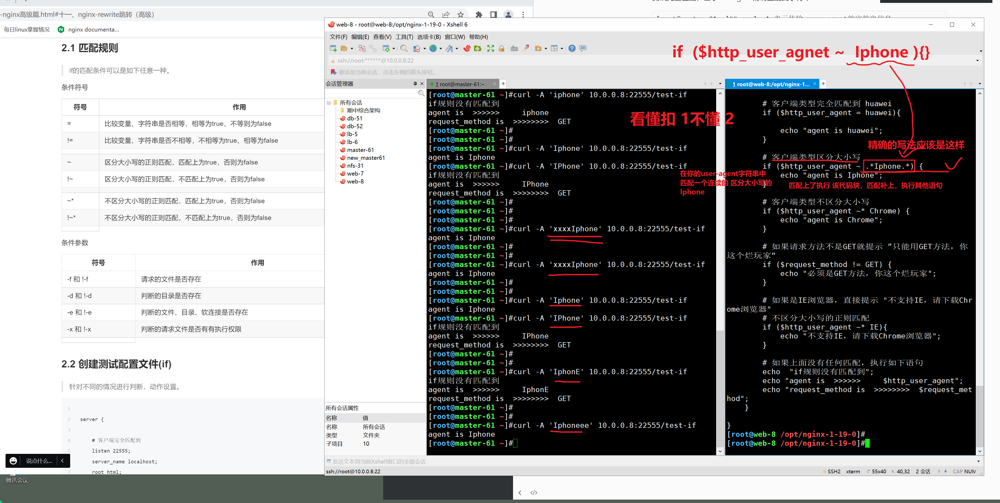

```### 此资源由 58学课资源站 收集整理 ###
	想要获取完整课件资料 请访问：58xueke.com
	百万资源 畅享学习

```
# 又是美好的一天，奥力给


# nginx-rewrite技术


```
url重写技术
更改请求的url
http://www.yuchaoit.cn/
自动跳转到
new.yuchaoit.cn


比如早期的京东官网，域名叫做 
360buy.com

企业就进行域名修改。
jd.com


老用户他又不知道你改名了，
360buy.com 看到网页无响应，以为京东挂了。。不用这个网站了，京东跑路了，以后用拼多多吧。。


京东就是用rewrite技术，实现，让旧域名的请求，自动重定向（永久重定向）
到新域名


老客户浏览器发出请求 www.360buy.com 浏览器自动的又发出一个新请求，跳转到新请求域名上 www.jd.com（会发现浏览器的url，也自动更换为了新的域名）


rewrite还有哪些功能，
1.实现URL的永久重定向
（1.整个域名的全部替换 2.比如给http跳转到https）


在你学习rewrite之前，要先掌握它基本的一些逻辑参数，如何用

3.这个功能就得通过ngx_http_rewrite_module 这个模块实现
该模块提供了多个指令功能

break     # 中断配置
if        # 请求判断
set      # 设置变量
return  # 返回值


rewrite  # 对用户请求URL重写
```


# if指令


```
1.if语句，用于条件判断，根据判断结果的不同，执行不同的动作，if写在server{}或者location{}标签里。


# 比如针对用户的请求客户端判断，或者针对用户的ip地址判断
# 基于nginx的内置变量就可以提取出这些信息。。
if (匹配条件) {
    执行动作
}

匹配条件
	- nginx内置变量
	- 使用nginx的if提供的条件判断符号，等于不等于，....


```

## 实际用法


---


```


server {

    # 客户端完全匹配到
    listen 22555;
    server_name localhost;
    root html;
    charset utf-8;

    location  /test-if {

        # 客户端类型完全匹配到 huawei
        if ($http_user_agent = huawei){

            echo "agent is huawei";
        }

        # 客户端类型区分大小写
        # 你这里的正则符号，就是一个完全的字符 ，区分大小写的字符串
        # Iphone ，你只能传入 Iphone才行
        # 基于正则匹配，你得写入正则符号。
        if ($http_user_agent ~ Iphone) {
            echo "agent is Iphone";
        }

        # 客户端类型不区分大小写
        if ($http_user_agent ~* Chrome) {
            echo "agent is Chrome";
        }

        # 如果请求方法不是GET就提示 ”只能用GET方法，你这个烂玩家“
        if ($request_method != GET) {
            echo "必须是GET方法，你这个烂玩家";
        }

        # 如果是IE浏览器，直接提示 "不支持IE，请下载Chrome浏览器"
        # 不区分大小写的正则匹配
        if ($http_user_agent ~* IE){
            echo "不支持IE，请下载Chrome浏览器";
        }

        # 如果上面没有任何匹配，执行如下语句
        echo  "if规则没有匹配到";
        echo "agent is  >>>>>>     $http_user_agent";
        echo "request_method is  >>>>>>>>  $request_method";
    }

}
```


## 测试实际用法

```
# http默认的请求方式，如浏览器访问，如curl命令访问，都是GET方法，获取资源的意思
[root@master-61 ~]#curl 10.0.0.8:22555/test-if
if规则没有匹配到
agent is  >>>>>>     curl/7.29.0
request_method is  >>>>>>>>  GET


```

测试完全匹配，基于useragent精确匹配到字符串huawei

```
[root@master-61 ~]## curl -A 表示传输 user-agent的字符串信息
[root@master-61 ~]#
[root@master-61 ~]#
[root@master-61 ~]#curl 10.0.0.8:22555/test-if
if规则没有匹配到
agent is  >>>>>>     curl/7.29.0
request_method is  >>>>>>>>  GET
[root@master-61 ~]#
[root@master-61 ~]#
[root@master-61 ~]#curl -A 'huawei-mate40' 10.0.0.8:22555/test-if
if规则没有匹配到
agent is  >>>>>>     huawei-mate40
request_method is  >>>>>>>>  GET
[root@master-61 ~]#curl -A 'Huawei' 10.0.0.8:22555/test-if
if规则没有匹配到
agent is  >>>>>>     Huawei
request_method is  >>>>>>>>  GET
[root@master-61 ~]#curl -A 'huawei' 10.0.0.8:22555/test-if
agent is huawei

```

测试区分大小写的正则匹配

```
重点就在于 
如下表达式，你看懂即可

if ($http_user_agnet ~ 正则表达式 ) {
	代码块；
}
```





```
[root@master-61 ~]##测试区分大小的 Iphone
[root@master-61 ~]#
[root@master-61 ~]#curl -A 'iphone' 10.0.0.8:22555/test-if
if规则没有匹配到
agent is  >>>>>>     iphone
request_method is  >>>>>>>>  GET
[root@master-61 ~]#
[root@master-61 ~]#
[root@master-61 ~]#curl -A 'Iphone' 10.0.0.8:22555/test-if
agent is Iphone
[root@master-61 ~]#curl -A 'IPhone' 10.0.0.8:22555/test-if
if规则没有匹配到
agent is  >>>>>>     IPhone
request_method is  >>>>>>>>  GET

```

测试不区分大小写的正则匹配

```
[root@master-61 ~]#
[root@master-61 ~]#curl -A 'windows xxxxx chrome xxxxx' 10.0.0.8:22555/test-if
agent is Chrome
[root@master-61 ~]#
[root@master-61 ~]#
[root@master-61 ~]#curl -A 'windows xxxxx CHroME xxxxx' 10.0.0.8:22555/test-if
agent is Chrome
[root@master-61 ~]#
[root@master-61 ~]#curl -A 'windows xxxxx CHroMxE xxxxx' 10.0.0.8:22555/test-if
if规则没有匹配到
agent is  >>>>>>     windows xxxxx CHroMxE xxxxx
request_method is  >>>>>>>>  GET
[root@master-61 ~]#
[root@master-61 ~]#
[root@master-61 ~]## 看懂扣 3 不懂 4
[root@master-61 ~]## 不区分大小写的正则匹配

```

测试指定请求方法

```
[root@master-61 ~]## 如果你给 10.0.0.8:22555/test-if 发送的请求方式不是GET，就会进入如下的 if条件区域
[root@master-61 ~]#
[root@master-61 ~]#curl -X POST 10.0.0.8:22555/test-if 
必须是GET方法，你这个烂玩家
[root@master-61 ~]#
[root@master-61 ~]#
[root@master-61 ~]#curl -X PUT  10.0.0.8:22555/test-if 
必须是GET方法，你这个烂玩家
[root@master-61 ~]#curl -X DELETE  10.0.0.8:22555/test-if 
必须是GET方法，你这个烂玩家
[root@master-61 ~]#
[root@master-61 ~]#
[root@master-61 ~]## 看懂扣 1不懂2

```


测试IE浏览器

```
1.测试方法，基于curl去测
[root@master-61 ~]#curl -A 'windows xxxx   IE11xxxxxx' 10.0.0.8:22555/test-if 
不支持IE，请下载Chrome浏览器


2. 直接使用ie浏览器去测
可能是我机器的问题，你们也试试
```


# return指令


## 具体return用法

```
[root@web-9 /etc/nginx/conf.d]#cat return.conf 
server {

    listen 22666;
    server_name _;
    root html;

    # 精确匹配，客户端只访问了网页根目录
    location  = / {
        echo "welcome to chaoge linux course.";
    }

    location /test-return {

            # 客户端完全匹配
            if ($http_user_agent = huawei){
              return 200 "agent is  $http_user_agent \n";
            }

            # 限制必须是GET方法
            if ($request_method != GET){

              return 405 "必须是GET方法！其他方法不允许\n";
            }

            # 如果是IE浏览器，就重定向
            if ($http_user_agent ~* IE){
              return 301 http://yuchaoit.cn/cai.jpg;
            }

                        # 没有if条件匹配到
            return 404 "sorry, nothing ....\n";
     }

        # 默认匹配，如果没有匹配到任意内容，跳转到首页 jd.com就是这个做法
        location / {
      return 301 http://yuchaoit.cn/cai.jpg;
        }

        location /ji {
            return 500 "鸡你太美\n";
        }

}
```


## 实践return的执行

精准匹配location

```
[root@master-61 ~]#
[root@master-61 ~]#curl 10.0.0.8:22666/
welcome to chaoge linux course.

```


没有匹配到任何location，进入默认的location

并且结合了301的用法


```
[root@master-61 ~]#curl -L  10.0.0.8:22666/xixixixixi
{"status":404,"message":"Not Found","devMessage":null,"data":{"timestamp":1653447840376,"status":404,"error":"Not Found","message":"无法定位到该路径：/cai.jpg","path":"/cai.jpg"}}[root@master-61 ~]#


浏览器测试
访问的是 10.0.0.8:22666/xixixixi
但是实现了301永久跳转，url会跟着变化
跳转到了 新url ，。http://yuchaoit.cn/cai.jpg


```


访问具体的location规则

```
[root@master-61 ~]#curl -I 10.0.0.8:22666/ji
HTTP/1.1 500 Internal Server Error
Server: nginx/1.19.0
Date: Wed, 25 May 2022 03:08:47 GMT
Content-Type: application/octet-stream
Content-Length: 13
Connection: keep-alive

[root@master-61 ~]#
[root@master-61 ~]#
[root@master-61 ~]#curl -I 10.0.0.8:22666/ji/xixixixixi
HTTP/1.1 500 Internal Server Error
Server: nginx/1.19.0
Date: Wed, 25 May 2022 03:09:05 GMT
Content-Type: application/octet-stream
Content-Length: 13
Connection: keep-alive

[root@master-61 ~]#curl  10.0.0.8:22666/ji/xixixixixi
鸡你太美
[root@master-61 ~]#curl  10.0.0.8:22666/ji/xixixixix/haHAHAH
鸡你太美
[root@master-61 ~]#
[root@master-61 ~]## 看懂3 不懂4
[root@master-61 ~]#
[root@master-61 ~]#

```

基于location匹配的综合用法

```
[root@master-61 ~]#curl -I  10.0.0.8:22666/test-return/xixixixixixi
HTTP/1.1 405 Not Allowed
Server: nginx/1.19.0
Date: Wed, 25 May 2022 03:12:51 GMT
Content-Type: application/octet-stream
Content-Length: 43
Connection: keep-alive

[root@master-61 ~]#curl   10.0.0.8:22666/test-return/xixixixixixi
sorry, nothing ....
[root@master-61 ~]#
[root@master-61 ~]#
[root@master-61 ~]#
[root@master-61 ~]#
[root@master-61 ~]#
[root@master-61 ~]#curl  -A 'huawei'  10.0.0.8:22666/test-return/xixixixixi
agent is  huawei 
[root@master-61 ~]#curl  -I  -A 'huawei'  10.0.0.8:22666/test-return/xixixixixi 
HTTP/1.1 200 OK
Server: nginx/1.19.0
Date: Wed, 25 May 2022 03:13:42 GMT
Content-Type: application/octet-stream
Content-Length: 18
Connection: keep-alive

[root@master-61 ~]#
[root@master-61 ~]#
[root@master-61 ~]## 看懂这些综合用法的，扣 1 不懂2
[root@master-61 ~]#
[root@master-61 ~]#
[root@master-61 ~]#curl -X POST 10.0.0.8:22666/test-return/xxxxxxxxxxxxxxxxxxx
必须是GET方法！其他方法不允许
[root@master-61 ~]#
[root@master-61 ~]#curl -I  -X POST 10.0.0.8:22666/test-return/xxxxxxxxxxxxxxxxxxx
HTTP/1.1 405 Not Allowed
Server: nginx/1.19.0
Date: Wed, 25 May 2022 03:15:18 GMT
Content-Type: application/octet-stream
Content-Length: 43
Connection: keep-alive


```

测试关于ie浏览器的封禁，很多企业开发的网站，以及是不再支持ie浏览器了

你可能还会有很老旧的用户，用的机器是ie，会导致网站一些资源无法加载

是你网站的问题。。

运维需要针对用户客户端判断，发现是ie，就告诉他ie不被支持，直接重定向，


# set指令

```
用于在nginx中设置变量，然后可以在配置文件中调用该变量


# 测试用法如下

server {

    listen 22777;
    server_name _;
    root html;
    
    set $my_url http://yuchaoit.cn/data/cai.jpg;

    location /test-set {
        return 301 $my_url;
    }

}

# 测试执行
访问10.0.0.8:22777/test-set/
```

# break指令

```
break是专门用于终止，rewrite的其他指令的执行的

rewrite这个url重写模块，支持如下几个关键字
break, if, return, rewrite, and set
这些关键字都可以在server{} location中定义

break的作用是，nginx的代码，执行带break之后，就会停止后续的

if, return, rewrite,  set指令的执行。。

结合rewrite实际用法，来看break的其他用法
```

准备测试配置文件

```
server {

        listen 22888;
        server_name _;
        root html;

        location / {

                set $my_website yuchaoit.cn;
                echo "welcome to my website:" $my_website;
                break;

                set $my_name yuchao;
                echo "my name is" $my_name;

        }

}
```


# 重点，rewrite实际用法

```
你上面学  if，return，set，break都是为了这个指令去服务的

当你去访问 
实际的京东的官网，是怎么用rewrite技术的

# ?key=value 这是基于get请求格式的，url传递参数
# 用于交给后端编程语言，提取这个key,value的

1. https://www.360buy.com/index.html?name=yuchao  301跳转永久重定向
（信息1：  访问的主机，端口，以及后续的url，
后续的参数index.html?name=yuchao）

2. 当发生301跳转之后，会保留后续的所有url，后续的路径参数，全部转发给新的域名

知道了 
旧 www.360buy.com  新域名 www.jd.com
除了要让域名跳转之外，还得实现，参数的保留！！！！最重要的

京东的做法是，跳转到 www.jd.com且保留了参数
http://www.jd.com/index.html?name=yuchao


rewrtite重写技术且保留的参数

（讲解具体生产换机下的业务用法）

听懂扣 6 不懂7 

实现这个用法

句法：    rewrite regex replacement [flag];
默认：    —
语境：    server, location,if


rewrite  目的就是为了提取出url后面的参数  新的域名  [参数，301永久跳转，302临时跳转]
```


## 实际的配置文件


## 查看301的实际用法（permanent）


```
301，域名永久更新，更换域名

laoliulinux.cc  旧域名
↓
linux0224.com   新域名


在rewrite中使用 rewrite /  http://linux0224.com permanent;
自动识别为301状态，永久跳转

```

旧域名配置文件，基于域名的虚拟主机了，做好域名匹配


```
[root@web-8 /opt/nginx-1-19-0/conf/extra]#cat laoliu.conf 
server {
    listen 80;
    server_name laoliulinux.cc;
    location / {
        root /laoliu/;
        index index.html;
        # rewrite regex   新域名  参数
        #  rewrite regex(提取域名后面的参数)   新域名  参数
        # 简单的域名跳转用法
        rewrite /  http://linux0224.com permanent;
    }
}

# 创建数据文件
[root@web-8 /opt/nginx-1-19-0/conf/extra]#mkdir /laoliu
[root@web-8 /opt/nginx-1-19-0/conf/extra]#
[root@web-8 /opt/nginx-1-19-0/conf/extra]#echo 'laoliu 666666666 old   domain' > /laoliu/index.html 


```

新域名配置文件

这个新域名，应该放到新服务器上


```
[root@web-8 /opt/nginx-1-19-0/conf/extra]#cat linux0224.conf 
server {
    listen 80;
    server_name linux0224.com ;
    location / {
        root /linux0224.com/;
        index index.html;
    }
}


#新网站的数据文件
[root@web-8 /opt/nginx-1-19-0/conf/extra]#mkdir /linux0224.com/
[root@web-8 /opt/nginx-1-19-0/conf/extra]#
[root@web-8 /opt/nginx-1-19-0/conf/extra]#
[root@web-8 /opt/nginx-1-19-0/conf/extra]#echo 'new domain  linux0224.com ' > /linux0224.com/index.html


```


配置客户端，做好域名解析

windows去测试 hosts文件


```
10.0.0.8   laoliulinux.cc linux0224.com
```

## 测试访问结果

先手动测试，新网站是否可以访问


测试访问旧网站


## 302的实际用法（redirect）

```
302，域名的临时跳转，一般是结合业务的临时修改
临时跳转，一般都是企业内部的活页域名，不是二级域名的修改。

看懂扣1，不懂2


# 基于访问路径的url
# 跳转到3级域名的活动页面的操作
# location，和rewrite的玩法，就很清晰了

www.laoliulinux.cc/phone  旧域名
↓
跳转到3级域名，302也
phone.laoliulinux.cc


# 换这个参数，就是302，临时跳转
rewrite /  http://linux0224.com redirect;


```

旧网站的虚拟主机

```
server {
    listen 80;
    server_name www.laoliulinux.cc;
    # 添加匹配的活页url
    # 本次是302参数 redirect
    location /phone {
   		 rewrite / http://phone.laoliulinux.cc redirect;
    }
}

# 让用户去访问 www.laoliulinux.cc/phone
自动跳转到 
http://phone.laoliulinux.cc这个新域名


```

新的活页页面网站

```
# 创建配置文件

server {
    listen 80;
    server_name phone.laoliulinux.cc;
    location / {
        root /phone.laoliulinux.cc/;
        index index.html;
    }
}

# 创建测试数据
[root@web-8 /opt/nginx-1-19-0/conf/extra]#
[root@web-8 /opt/nginx-1-19-0/conf/extra]#mkdir /phone.laoliulinux.cc/
[root@web-8 /opt/nginx-1-19-0/conf/extra]#
[root@web-8 /opt/nginx-1-19-0/conf/extra]#echo 'new website  !!!!!!!!!!!  phone.laoliulinux.cc !!!!!welcome you !!' > /phone.laoliulinux.cc/index.html


```

测试配置文件是否正确

```
[root@web-8 /opt/nginx-1-19-0/conf/extra]#nginx -t
nginx: the configuration file /opt/nginx-1-19-0/conf/nginx.conf syntax is ok
nginx: configuration file /opt/nginx-1-19-0/conf/nginx.conf test is successful
[root@web-8 /opt/nginx-1-19-0/conf/extra]#nginx -s reload
[root@web-8 /opt/nginx-1-19-0/conf/extra]#
#
```

### 测试客户端的访问

先测试新网站是否正确

```
做好dns解析
10.0.0.8   laoliulinux.cc linux0224.com  phone.laoliulinux.cc   www.laoliulinux.cc

看到这，没问题的扣6  看不懂7

```

访问旧网站，看一看是否会302跳转


## rewrite中的break和last参数

```
在虚拟主机中，可以定义多个location来处理多个url，进行多个动作的设置。

www.yuchaoit.cn/home/xxxxxxxxxxxx
www.yuchaoit.cn/movie/xxxxxxxxxxxxxx

多个location之间，可以基于last，break去设置匹配规则，比较高级了。。
知道语法即可。

看懂 扣 3 不懂 4

```


## 实际用法（last）


```
可以从 location {}  >  location {}  > location {}
多次匹配。

访问AAA、重写到BBB、重写到CCC，且是服务器内部跳转。

访问AAA
服务器内部跳转BBB
最后跳转到CCC


```

配置文件

```
# 创建测试数据，用于查看url内部跳转效果，以及保持了url的参数

# 1.创建测试数据
mkdir -p /linux0224/
echo 'i am ccc,  how are you ~~~' > /linux0224/hello.html


# 2.配置文件
server {
    listen 30000;
    server_name _;

    #
    location /CCC {
        alias /linux0224/;
    }

    location /BBB {
        rewrite ^/BBB/(.*)$ /CCC/$1 last;
    }

    location /AAA {

        rewrite ^/AAA/(.*)$ /BBB/$1 last;
    }

}
```

## 图解跳转关系 ，第一次跳转


## 第二次跳转，最终的访问效果


### 测试last的访问形式


### break参数

```
break是在本条规则匹配完毕后，终止匹配，不再匹配后面的location{}；

表示中断匹配，访问到AAA资源后，只rewrite跳转一次，终止后续的跳转。

# 创建测试数据，用于查看url内部跳转效果，以及保持了url的参数
```

配置文件如下

```
server {
    listen 31000;
    server_name _;

    #
    location /CCC {
        root /www/;
        index index.html;
    }

    location /BBB {
      root /www/;
        index index.html;
        rewrite ^/BBB/(.*)$ /CCC/$1 last;
    }

    location /AAA {
        root /www/;
        index index.html;
        rewrite ^/AAA/(.*)$ /BBB/$1 break;
    }

}
```


### 测试执行


```
得创建好测试的数据

mkdir -p /www/{AAA,BBB,CCC}
echo 'AAA' > /www/AAA/index.html
echo 'BBB' > /www/BBB/index.html
echo 'CCC' > /www/CCC/index.html


```

测试访问

出现一个小坑


```
```


---


# 下午的安排

笔记，视频， 待会更新到腾讯文档里， 


下午不能讲课，。。你们没时间练习没啥用，听完就忘

```
作业
1. 完成nginx的 rewrite练习
搞懂 if、return、set、break的用法

2. 完成课堂中所讲的rewrite实际用法
2.1 二级域名的永久更新，301跳转
2.2 三级域名的活动页面上线，302跳转


3.完成LNMP单机的部署，一个下午应该是能做完的。
完成wordpress.laoliu.cc 网站1
完成wecenter.laoliu.cc  网站2 

完成linux+nginx+php+mysql的单机部署。作为nginx学习的实战。


```


