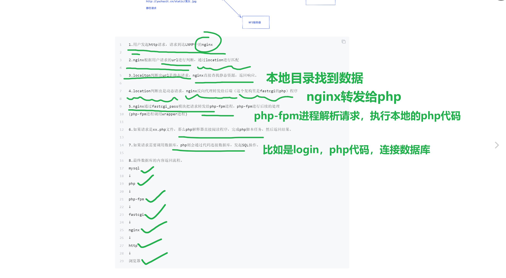

```### 此资源由 58学课资源站 收集整理 ###
	想要获取完整课件资料 请访问：58xueke.com
	百万资源 畅享学习

```
# 黄金架构LNMP

```
1. 如何安装软件，部署一个网站， 仅仅使用nginx的知识点，那是属于部署一个静态网站。

2. 是为了理解nginx和后端的协同工作，完成动态网站的部署 
网站支持数据库等动态功能，nginx + 编程语言 + 数据库。（反向代理）

3.动态网站，才是一个完整的功能。（对于不同的后端语言，要基于不同的协议，nginx的设置去转发。）

主人公是 php、

目前市面上主流的开发语言
这三个学会了，市面上的网站你都会部署了。

php

python

java

golang部署，纯二进制部署。基本上反向代理就完事。
```


lnmp架构就是永久不变的，最好用的黄金架构

```
2个php，python后端，2月后端就写完，脚本开发语言的高效率,用时间去换来效率（）

选择用java，golang，4个月后端才能学完（发展到了公司上市，流量巨大，python > golang重写后端，扛得住你们的打流量。）
```


# LNMP部署实践

lnmp的协同工作流程，与动静态处理的解释图


## nginx和php协同工作的原理


---


---




---


协议这个东西，只能靠你去看书，HTTP书籍，方可理解。

纯理论知识，补充自己的知识量。

课上通过通俗的例子，让大家理解组件通信流程。

```
linux nginx > php > mysql

如何配置，是最重要的，先会用。会用之后，以后有时间，看书，理解协议是什么。
```


```
我们在生产环境下能遇见的。

# 反向代理篇去讲解
1.关于http协议的通信，基于proxy_pass转发，如两个nginx之间的请求转发

2. 关于php,fastcgi协议的通信，基于fastcgi_pass转发，如nginx和php的转发
（1.安装php，修改配置文件，支持fastcgi协议）


3. 关于python，uwsgi协议的通信，基于uwsgi_pass的转发，如nginx和python的转发。

nginx 发出http请求 >  【uwsgi_pass，ngx_http_uwsgi_module.html】
https://nginx.org/en/docs/http/ngx_http_uwsgi_module.html
↓
（通信桥梁，要支持高并发协议的桥梁，大神开发出了高性能的，在http协议与python代码之间的一个通信转换接口，叫做uwsgi协议）   
看书，看HTTP协议书籍，理解协议是什么东西。。

【uwsgi协议】
↓

【要基于这个工具去运行  】
python后端去解析


回头我给大家整理好书籍的pdf，发到腾讯文档，自己课下翻一翻。
补充理论知识。
前提，先把课堂将的部署操作，给完成，懂了60%，40%（看书，学理论。）


参考如下文档，获取更多关于nginx和php的知识

https://www.nginx.com/resources/wiki/start/topics/examples/phpfcgi/

https://nginx.org/en/docs/http/ngx_http_fastcgi_module.html

```


---


## 实际的部署，去理解通信的过程。

# 部署LNMP

一台web-7机器上，安装 nginx ,php ,.mysql

指定的是 安装php-7的版本，需要找依赖，去搜索引擎找就行。

以后你看到一个代码

```
yum install -y php71w-cli php71w-common php71w-devel php71w-embedded php71w-gd

执行后，找不到这些包，缺少yum源
又不知道怎么找到这些源

吧这个代码，复制到搜索引擎里
yum install -y php71w-cli php71w-common php71w-devel php71w-embedded php71w-gd

看有没有人写了类似教程。。

技巧，听懂 6  不懂7 


```

## 部署nginx和php7的安装

```
1.创建nginx的运行环境，准备一个新的机器，去测试部署LNMP，认真听课的扣 6 
groupadd www -g 666
useradd www -s /sbin/nologin -M -u 666 -g 666


2.设置nginx官网方库
cat > /etc/yum.repos.d/nginx.repo << 'EOF'
[nginx-stable]
name=nginx stable repo
baseurl=http://nginx.org/packages/centos/$releasever/$basearch/
gpgcheck=1
enabled=1
gpgkey=https://nginx.org/keys/nginx_signing.key
EOF


3.安装，启动nginx
yum clean all 
yum install nginx -y

systemctl start nginx
systemctl enable nginx


4.部署php7 版本，以及要安装php7连接mysql的驱动，执行如下代码即可

# 卸载旧php环境，可能会导致冲突
yum remove php-mysql-5.4 php php-fpm php-common -y

# 安装第三方epel源
# 其实就是在下载2个 yum的repo仓库文件
# 这俩都是用于给centos安装一些额外的rpm包的仓库。

rpm -Uvh https://dl.fedoraproject.org/pub/epel/epel-release-latest-7.noarch.rpm
rpm -Uvh https://mirror.webtatic.com/yum/el7/webtatic-release.rpm


# 如果这个命令执行失败，安装不了这个rpm怎么办？
# 这玩意，不就是一个https提供的一个静态资源吗？
你可以用N个办法，去下载这个资源，放到linux里面去 rpm安装

- 在window下，下载好了，放到linux里安装即可
[root@web-7 ~]#rpm -Uvh ./webtatic-release.rpm 
warning: ./webtatic-release.rpm: Header V4 RSA/SHA1 Signature, key ID 62e74ca5: NOKEY
Preparing...                          ################################# [100%]
Updating / installing...
   1:webtatic-release-7-3             ################################# [100%]


看懂扣 6 

到这里，安装php-7环境的yum仓库就设置好了，

# 卡在了网络问题，琢磨下如何解决吧
# 我待会这些包，全部下载好，提供离线rpm包，回头发给你们，就可以了。
# 本地代理去下。


ping mirror.webtatic.com 不通的
没法去下载，你都无法和这个机器，建立http连接
这里看懂扣 1不懂2

https://mirror.webtatic.com/

location /yum/ {
 root rpm仓库的路径;
}


########################
如果你网络环境正常的话，你直接执行下属命令，去官网安装php-7就ok了

# 安装php7版本的依赖
yum install -y php71w-cli php71w-common php71w-devel php71w-embedded php71w-gd php71w-mcrypt php71w-mbstring php71w-pdo php71w-xml  php71w-fpm  php71w-mysqlnd  php71w-opcache php71w-pecl-memcached php71w-pecl-redis php71w-pecl-mongodb php71w-json php71w-pecl-apcu php71w-pecl-apcu-devel


```


## 自定义yum本地仓库

这部分知识点，留作伏笔，给大伙酝酿一个大招。

【尽请期待。。吧每一天的知识点都搞明白。】

你遇见我这个大招，你就会被我打成筛子。。。


> 你不需要依赖外网的yum仓库，可能导致该仓库无法访问，下载软件失败。。
>
> 大公司，会自建yum仓库
>
> 防止出现网络问题，自建了yum仓库，本地yum仓库
>
> 你可以去阿里云上，部署一个在线的yum仓库。。
>
> 

```

# 先准备好了一个 lnmp所有的rpm包，以及他们需要的依赖
# 准备一个minomal最小化安装的机器，基于
# 只下载对应的软件包，以及依赖，到指定目录，rpm，但是不安装
# 记得扣6 忘了7

yum install --donwloadonly --downloaddir=/your_rpm/   xxxxxxx


# 如果是本地的rpm包安装
#针对LNMP涉及的RPM包，rsync，nfs等

[root@web-7 /etc/yum.repos.d/local-rpm]#ls |wc -l
160


# 自建yum仓库
[root@web-7 ~]#yum install createrepo -y


[root@web-7 ~]#createrepo /etc/yum.repos.d/local-rpm/
Spawning worker 0 with 160 pkgs
Workers Finished
Saving Primary metadata
Saving file lists metadata
Saving other metadata
Generating sqlite DBs
Sqlite DBs complete


[root@web-7 /etc/yum.repos.d]#
cat > /etc/yum.repos.d/local-rpm.repo  <<EOF
[local-rpm]
name=local yum repo
baseurl=file:///etc/yum.repos.d/local-rpm/
enabled=1
gpgcheck=0
EOF

# 最终的仓库源如下
# 我当前的yum源目录，只有一个repo文件，只读这个本地yum仓库

[root@web-7 /etc/yum.repos.d]#ls
local-rpm/  local-rpm.repo


# 指定仓库安装
# 安装仓库安装

yum install --enablerepo=local-rpm php71w-cli php71w-common php71w-devel php71w-embedded php71w-gd php71w-mcrypt php71w-mbstring php71w-pdo php71w-xml  php71w-fpm  php71w-mysqlnd  php71w-opcache php71w-pecl-memcached php71w-pecl-redis php71w-pecl-mongodb php71w-json php71w-pecl-apcu php71w-pecl-apcu-devel


```

至此，自建的本地yum仓库，就把php环境装好了。

## 修改php的配置文件

先部署的基础环境，待会该得修改，支持fastcgi高性能协议的php进程运行。

```
修改php-fpm配置文件，修改php-fpm进程的运行用户，改为和nginx一致

[root@web-7 ~]#grep -E '^(user|group)' /etc/php-fpm.d/www.conf 
user = apache
group = apache


# 改为www用户
[root@web-7 ~]#sed -i '/^user/c user = www' /etc/php-fpm.d/www.conf 
[root@web-7 ~]#sed -i '/^group/c group = www' /etc/php-fpm.d/www.conf 
[root@web-7 ~]#grep -E '^(user|group)' /etc/php-fpm.d/www.conf 
user = www
group = www


# 尝试启动php进程
[root@web-7 ~]#systemctl start php-fpm
[root@web-7 ~]#
[root@web-7 ~]#systemctl enable php-fpm
Created symlink from /etc/systemd/system/multi-user.target.wants/php-fpm.service to /usr/lib/systemd/system/php-fpm.service.
[root@web-7 ~]#

# 查看后端进程
[root@web-7 ~]#netstat -tunlp|grep php
tcp        0      0 127.0.0.1:9000          0.0.0.0:*               LISTEN      9562/php-fpm: maste 


```


# 部署数据库（mariadb）

```
# 使用的是自建的yum仓库


# 在我这个机器上，我已经准备好自建的yum仓库


1.注意这个是来自于epel仓库的数据库
yum install mariadb-server mariadb -y

# 启动myqsl

```

## myqsl光速入门

基本的数据查看的SQL语句，用于部署好产品后，去数据库里面检查动态的数据。

数据是放在mysql数据库管理软件里面的，需要基于SQL语句去查询。

而不是磁盘上的文件数据，`ls /www/media/`


## 什么是本地进程套接字文件


本地进程套接字


看懂 扣 6 不懂7 

记住就行。会用就行。


```
[root@web-7 ~]#systemctl start mariadb
[root@web-7 ~]#
[root@web-7 ~]## 该服务器，提供了2个连接方式，网络socket，本地进程套接字，看懂 1  不懂 
[root@web-7 ~]#
[root@web-7 ~]## 该服务器，提供了2个连接方式，网络socket，本地进程套接字，看懂 1  不懂 2
[root@web-7 ~]#
[root@web-7 ~]#
[root@web-7 ~]#
[root@web-7 ~]#!net
netstat -tunlp
Active Internet connections (only servers)
Proto Recv-Q Send-Q Local Address           Foreign Address         State       PID/Program name    
tcp        0      0 127.0.0.1:9000          0.0.0.0:*               LISTEN      9562/php-fpm: maste 
tcp        0      0 0.0.0.0:3306            0.0.0.0:*               LISTEN      10284/mysqld        
tcp        0      0 0.0.0.0:80              0.0.0.0:*               LISTEN      8325/nginx: master  
tcp        0      0 0.0.0.0:22              0.0.0.0:*               LISTEN      900/sshd            
tcp        0      0 127.0.0.1:25            0.0.0.0:*               LISTEN      1155/master         
tcp6       0      0 :::22                   :::*                    LISTEN      900/sshd            
tcp6       0      0 ::1:25                  :::*                    LISTEN      1155/master         
[root@web-7 ~]#
[root@web-7 ~]#
[root@web-7 ~]#
[root@web-7 ~]#ls /var/lib/mysql/mysql.sock -l\
> ^C
[root@web-7 ~]#
[root@web-7 ~]#ls /var/lib/mysql/mysql.sock -l
srwxrwxrwx 1 mysql mysql 0 May 26 15:10 /var/lib/mysql/mysql.sock
[root@web-7 ~]#

```


## 光速入门mysql的SQL语句

```
0.先登录试试 默认mysql提供了连接的方式

mysql  -u没有空格的用户名  -p没有空格的密码   -h没空格的主机地址

# 如下空密码，登录mysql

[root@web-7 ~]#mysql -uroot -p
Enter password: 
Welcome to the MariaDB monitor.  Commands end with ; or \g.
Your MariaDB connection id is 2
Server version: 5.5.68-MariaDB MariaDB Server

Copyright (c) 2000, 2018, Oracle, MariaDB Corporation Ab and others.

Type 'help;' or '\h' for help. Type '\c' to clear the current input statement.

MariaDB [(none)]> 
# 退出mysql

MariaDB [(none)]> exit
Bye


1. 修改默认的密码，默认是空密码
# 这是改密码的完整命令，通过password指令，指定新密码

mysqladmin -uroot -p   password 'linux0224'
完毕之后，密码就已经被修改了，
此时账户密码是
root
linux0224


# 查看登录mysql的两个方式，1.基于网络socket连接
# -u, --user=name     User for login if not current user.
# -p, --password[=name] 
# -h, --host=name     Connect to host.
# -P, --port=#        Port number to use for connection

[root@web-7 ~]#mysql -uroot -plinux0224 -hlocalhost -P3306


# 基于本地套接字文件，无须指定ip:port了
# -S, --socket=name   The socket file to use for connection.
[root@web-7 ~]#mysql -uroot -plinux0224 -S/var/lib/mysql/mysql.sock


会用这2个方式的，扣1 不会2 


往后你学习高级的反向代理，也会用到这个socket文件(进程运行了，就有sock文件，进程挂了，sock文件也没了，通过这个sock文件，可以找到对应的进程。)


```


```
# 改完mysql密码后，登录，学习基本的SQL语句
# 默认你在本地执行mysql连接，无须指定地址信息了，默认就是本地的3306
mysql -uroot -plinux0224

# 查看数据库
MariaDB [(none)]> show databases;
+--------------------+
| Database           |
+--------------------+
| information_schema |
| mysql              |
| performance_schema |
| test               |
+--------------------+
4 rows in set (0.00 sec)

# 查看当前数据库的用户信息，如有多少个用户

# 切换进入数据库
MariaDB [(none)]> use mysql;
Reading table information for completion of table and column names
You can turn off this feature to get a quicker startup with -A

Database changed
MariaDB [mysql]> 


# 查看当前数据库下有多少张数据表
MariaDB [mysql]> show tables;
+---------------------------+
| Tables_in_mysql           |
+---------------------------+
| columns_priv              |
| db                        |
| event                     |
| func                      |
| general_log               |
| help_category             |
| help_keyword              |
| help_relation             |
| help_topic                |
| host                      |
| ndb_binlog_index          |
| plugin                    |
| proc                      |
| procs_priv                |
| proxies_priv              |
| servers                   |
| slow_log                  |
| tables_priv               |
| time_zone                 |
| time_zone_leap_second     |
| time_zone_name            |
| time_zone_transition      |
| time_zone_transition_type |
| user                      |
+---------------------------+
24 rows in set (0.00 sec)


# 查看数据表的结构信息
MariaDB [mysql]> desc user;

# 查看表中，指定字段的信息
MariaDB [mysql]> select Host,User,Password from user;
+-----------+------+-------------------------------------------+
| Host      | User | Password                                  |
+-----------+------+-------------------------------------------+
| localhost | root | *8D45A1DAD603EDC2980B51D2C900E6BCFE6E13A8 |
| web-7     | root |                                           |
| 127.0.0.1 | root |                                           |
| ::1       | root |                                           |
| localhost |      |                                           |
| web-7     |      |                                           |
+-----------+------+-------------------------------------------+
6 rows in set (0.00 sec)


```

```
大文件夹
	- 文件中的文件
	- 文件中的文件
	- 文件中的文件
	- 文件中的文件
	- 文件中的文件

mysql的数据库中
	数据表
	数据表
	数据表
	数据表
	数据表
```

对比mysql的数据表，理解为excel的表，长一样


查看数据表的结构信息


---


```
你学了基本的mysql语句
查看你部署的产品，写入到数据库中的数据，你看一看有没有。

```

# 部署nignx代理php后端


## 部署nginx，能把请求转发给后端的php


```
nginx接收到关于php的动态请求，转发给php-fpm


需要用的参数是fastcgi_pass
语法如下

用法1，转发给ip:port形式
fastcgi_pass localhost:9000;

用法2，转发给unix socket本地进程套接字
fastcgi_pass unix:/tmp/fastcgi.socket;

# 语法看懂 1 不懂2


# 具体修改nginx配置如下

[root@web-7 /etc/nginx/conf.d]#cat php.conf 
server{
    listen 80;
    server_name www.linux0224.cc;
    # 动态请求处理
    # 遇见以.php结尾的请求就进入到这里的location
    location ~ \.php$ {
   		 # 如果要找具体的后端代码，在/code/去找
        root /code;
        # 会吧请求转发给后端的php-fpm进行加工
        fastcgi_pass 127.0.0.1:9000;
        # 默认的首页文件名字是index.php
        fastcgi_index index.php;
        # 转发的参数，
        fastcgi_param SCRIPT_FILENAME $document_root$fastcgi_script_name;
        include fastcgi_params;
    }
}


```


## 准备php的测试代码，查看nginx是否和php可以正常结合工作

```
1.确保php-fpm进程存在
[root@web-7 /etc/nginx/conf.d]#netstat -tunlp|grep 9000
tcp        0      0 127.0.0.1:9000          0.0.0.0:*               LISTEN      9562/php-fpm: maste 


2.进入刚才nginx中设置的，php的代码目录
mkdir -p /code
cd /code

chown -R www.www /code 

创建一个测试数据，创建phpinfo页面
cat > /code/test-phpinfo.php <<EOF
<?php
phpinfo();
echo "welcome to yuchaoit.cn"
?>
EOF


```

最后来访问测试nginx是否可以吧请求转发给php

确保是没问题的


## nginx转发请求给php的流程图


```
1. 不要睡得太晚！ 超过1点就必须休息了

2. 熟能生巧，时间能搞定大部分问题。

精神抖擞点，没毛病 扣6 
```


## 彻底玩明白，php的动静态请求处理


**我们现在不是的是php解释型语言的网站**

1. 准备好静态资源如 gif，png，jpg等，nginx去处理
2. php特点是，解释型语言，网站源码，说白了也是一堆文本文件！！！
3. 这堆php代码文件，必须得交给php-fpm进程去读取！！！

```
转化为了nginx的配置
[root@web-7 /code]#cat /etc/nginx/conf.d/php.conf 
server{
    listen 80;
    server_name www.linux0224.cc;
	# 纯静态请求处理
	location ~* \.(jpg|gif|png)$ {
		root /www/static/;
	}
    # nginx直接吧所有的请求，全部甩给了php-fpm
    # 其他全部识别为动态请求，转发给php
    location /  {
    	# 你需要吧这个php源代码，放在这个目录中！！！
        root /code;
        fastcgi_pass 127.0.0.1:9000;
        # 默认找到的首页php代码文件，名字叫做index.php
        fastcgi_index index.php;
        fastcgi_param SCRIPT_FILENAME $document_root$fastcgi_script_name;
        include fastcgi_params;
    }
}

# 准备一个静态数据
mkdir -p /www/static/
wget -O /www/static/caixukun.jpg  http://yuchaoit.cn/data/cai.jpg

# 准备一些动态数据
mkdir -p /code
cat > /code/index.php <<EOF
<?php
phpinfo();
echo "welcome to yuchaoit.cn"
?>
EOF

# 重启nginx
nginx -s reload


# 重启php-fpm（默认就是fastcgi协议了，不用你管，你只需要知道，在nginx哪里，设置为fastcgi_pass 127.0.0.1:9000;即可！！！）
systemctl restart php-fpm


www.linux0224.cc  # 直接看到php后端的代码文件

www.linux0224.cc/caixukun.jpg


# 问题如下

/www/static/ 这里放的是什么资源
/code  这里放的是什么资源
# 你先只需要访问这个域名，默认就可以直接看到内容了，想想为什么

看懂扣   1

看不懂 2


```


```
client 请求url
↓
nginx （虚拟主机），具体怎么配置，把请求转发给后端的php-fpm
↓
php-fpm（1.找到你要执行的php代码文件）
```


## 后端的php-fpm默认就是基于fastcgi协议运行的了

```
# 配置文件路径
/etc/php-fpm.d/www.conf
```


```
你把这个琢磨明白
后面，只需要，把各种php源代码，直接放到这个/code里面就完事了，。

听懂 扣 1		不懂 2
```


## 测试php连接mysql是否正常

```
[root@web-7 /code]#cat test-mysql.php 
<?php

    $server="127.0.0.1";
    $mysql_user="root";
    $mysql_pwd="linux0224";


    // 创建数据库连接
    $conn=mysqli_connect($server,$mysql_user,$mysql_pwd);

    // 检测连通性
    if($conn){
        echo "mysql successful by yuchaoit.cn \n";
    }else {
        die( "Connection failed:  "  .  mysqli_connect_error());
    }

?>

```


# 完成产品部署

```
在一个支持lnmp的机器上部署2个网站产品

基于多域名的虚拟主机，更贴切生产。


```


# wecenter

第一个php产品，部署知识网站

```
1. 下载源代码
cd /code/wecenter && wget http://yuchaoit.cn/data/wecenter.zip

[root@web-7 /code/wecenter]#ls /code/wecenter/wecenter.zip 
/code/wecenter/wecenter.zip


2. 设置nginx代理的配置

1.  wecenter.linux0224.cn/index.php  会发给 9000端口的php-fpm
2.  wecenter.linux0224.cn/hello.html 就直接去 /code/wecenter找资源

看懂扣 6 不懂 7

# 重点是，这个网站，是前端段不分离的开发模式，前端代码，和php代码都放一块了。


[root@web-7 /etc/nginx/conf.d]#cat wecenter.conf 
server{
    listen 80;
    server_name wecenter.linux0224.cn;

    # 静态请求，资源存放路径
    # 这里是个简写除了以.php结尾的请求，都判断为是静态请求
    # 来/code/wecenter目录下找资源
    # 因为这个wecenter开源产品，他们的开发模式是，单体应用
    # 静态数据（前端内容） 和 后端数据（php代码文件）全部放在了一块
    # 当你去访问wecenter.linux0224.cn 
    root /code/wecenter;
    index index.php index.html;

    # 动态请求处理
    # 只有你访问的是 wecenter.linux0224.cn/xxxx.php 
    # 这个请求就会转发给9000的php-fpm去执行。
    location ~ \.php$ {

        root /code/wecenter;
        fastcgi_pass 127.0.0.1:9000;
        fastcgi_index index.php;
        fastcgi_param SCRIPT_FILENAME $document_root$fastcgi_script_name;
        include fastcgi_params;
    }
}


# 准备好源代码数据，即可
[root@web-7 /code/wecenter]#ls /code/wecenter/
app            composer.lock  license.txt     README.md   tmp          views
cache          index.php      models          robots.txt  uploads      wecenter.zip
changelog.txt  install        nginx.htaccess  static      vendor
composer.json  language       plugins         system      version.php


# 去访问了，还得做好dns解析，以及服务忘记重启了
[root@web-7 /code/wecenter]#nginx -s reload

授权步骤
[root@web-7 /code/wecenter]#chown -R www.www /code/wecenter/

看懂 3  不懂 4


# 你得先创建好对应的数据库，才能写入数据。
MariaDB [(none)]> create database wecenter;
Query OK, 1 row affected (0.00 sec)

MariaDB [(none)]> show databases;
+--------------------+
| Database           |
+--------------------+
| information_schema |
| mysql              |
| performance_schema |
| test               |
| wecenter           |
+--------------------+
5 rows in set (0.00 sec)


查看库中有数据表吗
MariaDB [(none)]> 
MariaDB [(none)]> show tables from wecenter;
Empty set (0.00 sec)


wecenter安装成功后，检查数据表
MariaDB [(none)]> show tables from wecenter;

# 创建该系统的管理员
yuchao01
chaoge666
yc_uuu@163.com

# 删除安装的脚本，防止黑客恶意重置你的网站
[root@web-7 /code/wecenter]#cd /code/wecenter/install/
[root@web-7 /code/wecenter/install]#ls
db  index.php
[root@web-7 /code/wecenter/install]#rm -f index.php 


再次使用管理员账号登录。

最后一波，验证数据库中，是否有你创建的管理员密码信息
# 查看wecenter这个库下的，数据表，名字是 aws_users;
# 指定查看几个字段


[root@web-7 /code/wecenter/install]#!mysql
mysql -uroot -plinux0224
Welcome to the MariaDB monitor.  Commands end with ; or \g.
Your MariaDB connection id is 32
Server version: 5.5.68-MariaDB MariaDB Server

Copyright (c) 2000, 2018, Oracle, MariaDB Corporation Ab and others.

Type 'help;' or '\h' for help. Type '\c' to clear the current input statement.

MariaDB [(none)]> select user_name,password from wecenter.aws_users;
+-----------+----------------------------------+
| user_name | password                         |
+-----------+----------------------------------+
| yuchao01  | d0373d14bedca3ae9f1534d9b8772d54 |
+-----------+----------------------------------+
1 row in set (0.00 sec)

MariaDB [(none)]> 

```

最后一步的环境检查。，确保权限都是小绿勾。


至此，确认wecenter部署好了。

以及确认，数据库的数据写入都是正确的。


# wordpress的部署

```
1. 下载源代码
确保如下代码存在即可
[root@web-7 /code/wordpress]#ls /code/wordpress/
index.php                  wp-admin              wp-includes        wp-signup.php
license.txt                wp-blog-header.php    wp-links-opml.php  wp-trackback.php
readme.html                wp-comments-post.php  wp-load.php        xmlrpc.php
wordpress                  wp-config-sample.php  wp-login.php
wordpress-5.9.3-zh_CN.zip  wp-content            wp-mail.php
wp-activate.php            wp-cron.php           wp-settings.php


[root@web-7 /code/wordpress]#ls /code/wordpress/index.php 
/code/wordpress/index.php


2. 准备nginx的反向代理配置文件，转发请求给php
1.创建虚拟主机文件
server{
    listen 80;
    server_name wordpress.linux0224.cn;

    # 静态请求，资源存放路径
    root /code/wordpress;
    index index.php index.html;

    # 动态请求处理
    #
    location ~ \.php$ {

        root /code/wordpress;
        fastcgi_pass 127.0.0.1:9000;
        fastcgi_index index.php;
        fastcgi_param SCRIPT_FILENAME $document_root$fastcgi_script_name;
        include fastcgi_params;
    }
}

2.重启nginx
[root@web-7 /etc/nginx/conf.d]#nginx -s reload


[root@web-7 /etc/nginx/conf.d]#chown -R www.www /code/wordpress


创建数据库
mysql -uroot -plinux0224
MariaDB [(none)]> create database wordpress;
Query OK, 1 row affected (0.00 sec)


```

下一步，访问即可

```
注意，做好dns解析
10.0.0.7  wecenter.linux0224.cn wordpress.linux0224.cn

```

开始安装wordpres，填写你的数据库信息

```
yuchao01
chaoge666
yc_uuu@163.com
```

## 发布一篇博客，看看对吗


## 去数据库看看这个博客数据在吗

```
MariaDB [(none)]> 
MariaDB [(none)]> use wordpress;
Reading table information for completion of table and column names
You can turn off this feature to get a quicker startup with -A

Database changed
MariaDB [wordpress]> show tables;
+-----------------------+
| Tables_in_wordpress   |
+-----------------------+
| wp_commentmeta        |
| wp_comments           |
| wp_links              |
| wp_options            |
| wp_postmeta           |
| wp_posts              |
| wp_term_relationships |
| wp_term_taxonomy      |
| wp_termmeta           |
| wp_terms              |
| wp_usermeta           |
| wp_users              |
+-----------------------+
12 rows in set (0.00 sec)


MariaDB [wordpress]> desc wp_posts;

MariaDB [wordpress]> 
MariaDB [wordpress]> select post_content from wp_posts;

```


没了，下课。开整。休息会吧。88

视频，笔记一会就到腾讯文档。


