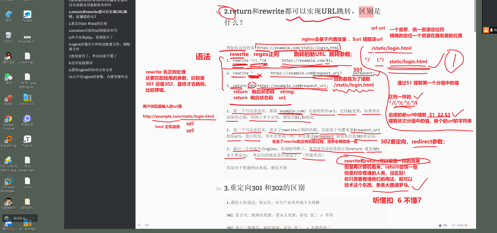
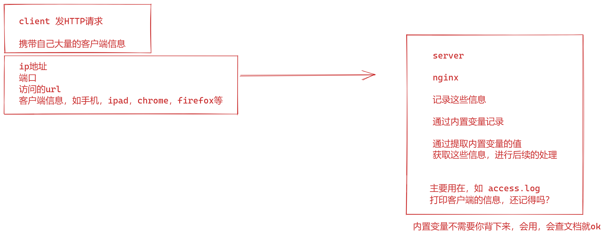

```### 此资源由 58学课资源站 收集整理 ###
	想要获取完整课件资料 请访问：58xueke.com
	百万资源 畅享学习

```
# 这种问答，都是面试题的由来

面试题，且这些属于难点的面试题，边边角角的细节问题

你会发现，你不踩坑，你就接触不到。

踩坑了，解决了，你就经验值+999。


# 1.就搭建LNMP架构的时候编译安装的话全部都是用最新版本的吗

linux mysql  php nginx


```
不是，版本要根据其他软件架构的适配性来选择，一般是运维老大来决定，告诉你安装什么版本了。
开发组长选择的是php8最新版本，高版本
php连接mysql的驱动（ yum install xxxx  依赖）
mysql就没法用较低的版本如 5.6，低版本，正常的适配


如 linux，centos7.9 + mysql5.7 + php7 + nginx 1.20 

软件版本需要适配，太高的php，也就无法连接mysql，需要懂这个【平衡】的概念。
```

明白扣1 


# 2.return和rewrite都可以实现URL跳转，区别是什么？




```
例如你访问的是 https://example.com/static/login.html

1. rewrite ^/(.*)$		 https://example.com/$1;

2. rewrite ^ 		https://example.com$request_uri?     permanent;

3. return 301 https://example.com$request_uri;


1. 第一个写法意思是，抓取 example.com/ 后面的所有url，交给$1变量，如果你在前面的正则，用到了多个分组，就依次$2,$3提取

2. 第二个写法意思是，省去了rewrite正则的匹配，直接基于内置变量$request_uri 提取url，进行转发，效率会更高一些，并且通过permanent 知道本次是301重定向；

3. 最后一个直接告诉nginx，你别瞎判断了，我直接告诉你你执行到return 就是301永久重定向， 重定向的地址是后面这个。（性能更高）

但是对于普通网站来说，感觉不到

```

# 3.重定向301 和302的区别


```
1.我给大伙说过，你记住，在生产业务环境下去理解

301 是公司二级域名更新，要永久更新，好比 张三 > 李四

302 用于三级域名，临时添加，好比 张三  > 长胖的张三


302重定向是暂时的重定向，搜索引擎会抓取新的内容而保存旧的网址。
由于效劳器前往302代码，搜索引擎以为新的网址只是暂时的。 
301重定向是永久的重定向，搜索引擎在抓取新内容的同时也将旧的网址交换为重定向之后的网址。


```

# 4. location后面的url到底如何写

```
先记住语法，location 后面支持的四个符号
# 先看懂如下语法！！！
# 先看懂如下语法！！！
# 先看懂如下语法！！！


location  =   /xixi/  {}  # 精确匹配  example.com/xixi/

location   ^~ /static/ {} 
# 不支持正则，完全的字符串匹配 example.com/static/

location   ~* /media/ {} 
#    不区分大小写的正则匹配  
example.com/media/xxxxxxxxxxxxxxx
example.com/Media/xxxxxxxxxxxxxxx
example.com/MEDIA/xxxxxxxxxxxxxxx


location   ~  /media/ {}  
example.com/media/xxxxxxxxxxxxxxx


location   url  {}  # 比如  

# 最低优先级
location  / {}

example.com/xxixixix
example.com/hahaha
example.com/aoligei
example.com/你谁啊


# 优先级也很低的，没有符号，优先级就很低

# 如果你上面有基于符号的location匹配，优先级高于这里
# 只是带你看看，这个写法，能匹配到什么url
# 通用型匹配
# 一般情况下，不会过多的去考虑，大小写的问题， 你知道这个语法就行
# 这个location不是你运维先去定义的
# 你们公司的官网，可以通过什么URL去访问，这是开发工程师去写代码限制好的！！！

############################################################
# 根据开发提供的网站说明书，去写你的nginx location匹配！！！
# 你要达到的能力就是，吧老师说的语法，看懂，以及，我也给大家提供后续的生产级别的nginx部署案例，你就看懂了！

############################################################
location  /static/ {}

example.com/static/aaaaaaaaaaaaaa
example.com/static/bbbbbbbbbbbbbbbbbbb
example.com/static/xcccccccccccc


# 你要注意，这个url结尾的 斜线，尽量，尽量给写上

location  /AAA/ {}  

# 听懂 1  不懂 2


location /BBB/  {}


# 看懂 扣 6 不懂 7  ，你学过，练过的写法，就是这些了。


记不住意思，正常，但是你学过了，看笔记，就得知道他们的区别

```


```
1. 我说过，这个location url {}  ，是运维，要配合开发去写的。不是你自己瞎琢磨的。

# 开发写的url，什么意思呢？
# 你，获取一个开发写好的源代码，这个源代码里面，设计好了url的规则
#你的nginx要按照这个规则去写，
# 参考超哥的jumpserver堡垒机生产写法，请看博客

后面学到jumpserver，你就知道了，例如如下的生产级别nginx设置

# 这些配置，是为了让nginx，找到，匹配堡垒机，每一个组件的设置，请看


server {
  listen 80;
  # server_name www.yuchaoit.cn;

  client_max_body_size 5000m; 文件大小限制

  # Luna 配置
  # 经过实测，这个v12版本，只能http://10.0.0.61:4200/luna/这样去访问，前端这里有点难处理。
	
	# myjumpserver.com/luna/aaaaaaaaaaaaaaa
	# myjumpserver.com/luna/bbbbbbbbbbbb
  location /luna/ {
    proxy_pass http://luna:4200;
  }


  # Core data 静态资源
  # myjumpserver.com/media/replay/aaaaaaaaaaaaaaaaaaa
  # myjumpserver.com/media/replay/bbbbbbbbbbbb
  
  
  location /media/replay/ {
    add_header Content-Encoding gzip;
    root /opt/jumpserver-v2.12.0/data/;
  }

  #  myjumpserver.com/media/aaaaaaa
  #  myjumpserver.com/media/bbbbbb
  #  myjumpserver.com/media/cccc
  location /media/ {
    root /opt/jumpserver-v2.12.0/data/;
  }

  # 只要你部署这个堡垒机产品，人家产品的html网页中，发送了大量的请求是如下，就进入这些location去找资源
  #  myjumpserver.com/static/xxxxxxxxxxxxxxxx
  location /static/ {
    root /opt/jumpserver-v2.12.0/data/;
  }

  # KoKo Lion 配置
  #  关于基础组件的，反向代理了
  #  只要你的url，访问的是 myjumpserver.com/koko/xxxxxx
  location /koko/ {
    proxy_pass       http://koko:5000;
    proxy_set_header X-Real-IP $remote_addr;
    proxy_set_header Host $host;
    proxy_set_header X-Forwarded-For $proxy_add_x_forwarded_for;
    proxy_http_version 1.1;
    proxy_buffering off;
    proxy_set_header Upgrade $http_upgrade;
    proxy_set_header Connection "upgrade";
  }

  # lion 配置
  # myjumpserver.com/lion/xxxxxxxxx
  location /lion/ {
    proxy_pass http://lion:8081;
    proxy_buffering off;
    proxy_request_buffering off;
    proxy_http_version 1.1;
    proxy_set_header X-Forwarded-For $proxy_add_x_forwarded_for;
    proxy_set_header Upgrade $http_upgrade;
    proxy_set_header Connection $http_connection;
    proxy_ignore_client_abort on;
    proxy_connect_timeout 600;
    proxy_send_timeout 600;
    proxy_read_timeout 600;
    send_timeout 6000;
  }

  # Core 配置
  # myjumpserver.com/ws/xxxxxxx
  location /ws/ {
    proxy_pass http://core:8070;
    proxy_set_header X-Real-IP $remote_addr;
    proxy_set_header Host $host;
    proxy_set_header X-Forwarded-For $proxy_add_x_forwarded_for;
    proxy_http_version 1.1;
    proxy_buffering off;
    proxy_set_header Upgrade $http_upgrade;
    proxy_set_header Connection "upgrade";
  }
	#  myjumpserver.com/api/xxxxxx
  location /api/ {
    proxy_pass http://core:8080;
    proxy_set_header X-Real-IP $remote_addr;
    proxy_set_header Host $host;
    proxy_set_header X-Forwarded-For $proxy_add_x_forwarded_for;
  }
	#   myjumpserver.com/core/xxxxxx
  location /core/ {
    proxy_pass http://core:8080;
    proxy_set_header X-Real-IP $remote_addr;
    proxy_set_header Host $host;
    proxy_set_header X-Forwarded-For $proxy_add_x_forwarded_for;
  }

  # 前端 Lina
  #  myjumpserver.com/ui/xxxxxxx
  location /ui/ {
    proxy_pass http://lina:9528;
    proxy_set_header X-Real-IP $remote_addr;
    proxy_set_header Host $host;
    proxy_set_header X-Forwarded-For $proxy_add_x_forwarded_for;
  }
#  通用型匹配，上述的url，都匹配不到，就进入到这里！！！
# 这里具体意思，等我讲解堡垒机时候，再说
#但是这个写法，你应该已经看懂了！！！
#看不懂，就是你练习的不够多！！！
  location / {
    rewrite ^/(.*)$ /ui/$1 last;
  }
}

# 为什么要写这些location，是人家堡垒机，定义好了这些功能路径
#你 要在前端部署一个nginx作为代理的，话，得基于这些url，去对应的写location。。


# 看懂 扣 6  不懂7 
# 老铁们，我做的对吗~ 对的扣6


```

# 5.昨天安装php，发现装不了

新博客，lnmp单机架构

```
超哥的锅，笔记漏了一步。
```

# 6.nginx好像在不停的改配置文件，测配置文件

```
没错，运维就是这样，学软件用法，看文档，改配置文件，你现在是该nginx风格的配置文件

it，互联网大类
开发（创造规则，制造规则 ,定义配置文件的规范，参数），（运维，测试，安全）使用规则，调试规则
软件提供的配置文件。
nginx 
listen 80;
listen  xx;


nginx语法还算简单的

全局配置
作用域{}
ansible剧本，yaml

遵循yaml语法，缩进，列表，字典的，规范，写配置文件

以后遇见复杂，更高级的运维工具，你就是在改yaml配置文件。

除非你去做开发，你就去定义配置文件，让别人去改。。。

这个问题，理解了，扣1  不懂 2
```

# 7.视觉疲劳了，单词也看不懂了

```

你别看他简单，光头，十年运维，遇见这个坑，至少也得花上30分钟排错。。
认为是些高级问题。。一顿日志，一顿debug，调试。
字母敲错了。。

就看你谁更细！，越细越nb，


自己定义的
location  /iphone/ {

}


然后一直访问 http://example.com/phone/  告诉我404,。。

字母别少了！！有时候，仔细点，能解决绝大多数问题。。

你定义的是 location  /iphone/ {}
你访问的是 /phone/ 所以就是单词错了。。

超哥，我已经看了十几遍了，真的看不出了。什么鬼啊。。。


看出问题在哪 6 不懂7

我真想给你一锤子。

但是，兄弟你累了。。。你是该休息会了。劳逸结合很重要，

亚健康是学不进去的。
```

# 8.还有低级错误

不够细心

```
防火墙忘记关 linux中可以访问的通，可以看到nginx页面，你都在内网环境下，linux环境

windows > linux
 
服务忘记重启 
systemctl restart nginx


用错了yum的nginx，和编译的nginx


配置文件写在/optnginx里面，用yum的nginx启动的。。


都是细节，有些情况下你不能细

但是你学运维技术，你必须得细！

明白了 扣 1  不懂 2

```

# 9.感觉nginx的知识点有点多

```
没错，是多，还不是为了让你能成为一个能打的技术大佬；

nginx知识点，写几本书不是问题，提取工作里，后续的部署里，需要用到的基本知识，高级知识。提炼出来讲解了。
基础很重要，基操基本操作，很重要，基础不牢，地动山摇。


不想被别人嫌弃，就得通过自己的技术能力，碾压别人，程序员有时候不是那么友好的。

去新公司，前一个交接的人 跑路了，啥也不给你交接，你去了之后，你不是新人，20k+
没人手把手教你，自己去熟悉公司的部署架构，自己技术能力有多深了

快速理解业务！
1.解决手中的问题，看脚本。shell脚本，ansible剧本，角色。整体，搞明白，你维护的这个架构都有什么内容。

2. 公司其他的大业务，只能看公司文档，


10k运维，老人带带你


早上刷小红书，一个测试发文章，说被开发喷了，但是自己又没办法，就很委屈。
提bug，居家办公，大家火气比较大，开发就远程在群里开喷了。


底下留言评论有测试的关怀，也有开发的鼓舞（嫌弃），说到底，就是开发给的文档看不懂，写的不够细致，导致测试，技术，不太懂，不知道开发想要什么结果。
出现了一些信息偏差，事搞错了。测试不是太懂这部分的技术，。听着别人喷。。
对喷。谁怕谁啊

，会的太少了，你为啥要当黑盒测试（很基础的，所有软件，在黑盒测试严重，都是一个封闭的盒子，看不懂期中原理）？
多学点做白盒测试(网站访问，访问某个url 503了)，做测开不好么。

# 测登录接口
# 503 属于开发的问题，代码故障。php代码，连接不上mysql(服务器没启动)了。
# 提bug，开发代码有问题，503，开发要扣工资的。。
# 开发我这个代码，绝对没问题，你就是在搞我，。blalalalal
# 公司内部扯皮了。最后两拨的技术老大，出来协调，调节气氛了。。

# 从中吸收的，一是，提升你的技术能力
# 二 是，


axample.com/login/ # 出现503接口报错的思路

报错了。
运维来
# 1.找nginx设置，找到后端地址

location /login/ {
	反向代理  后端服务器地址是多少；

}

#.2 找到后端地址，看日志，数据库连不上

503就是后端故障了，看后端日志就行了。。

#3. 排查数据库问题，数据库没启动
systemctl start mariadb

# 4.接口恢复正常axample.com/login/

nginx基础知识学明白了，看懂了，。


你只需要跟着超哥的安排来，把基础打牢，然后我带你部署php网站，python堡垒机jumpserver，以及后续的java网站tomcat，反复结合nginx，都是生产级别的项目，复杂度够你喝一壶。就没问题了。

部署过程中，一个坑一个萝卜，一个坑，经验值+10 ，慢慢成为 最强的男人，一拳超人。

听懂 扣 6不懂7 


```


# 10.记不住nginx的参数，，内置变量咋办

location

rewrite

return

server{}

http{}

root xxx;

alias xx;


$uri

$remote_add

$document_url


没人让你背下来，遇见了查资料。

分享正确学习的姿势。


```
你想想你学多久运维了，前面那么多的linux命令，你是咋学，咋记忆的，还是那话

1. 看懂老师讲的 !!!!

2. 模仿老师的笔记，大量练习，模仿，模仿，模仿，就像小孩儿学说话，慢慢你就会了
你想三天就把英文学会了，不可能，一点一点来。
转变为你的思路，你就突然，茅塞顿开，顿悟了，这些知识，原理就这样。
必须通过大量的练习
写代码，10万行理论。
运维，部署10万行配置文件。


3. 还有nginx的内置变量，咱说了


```





开胃菜就到这里了。


