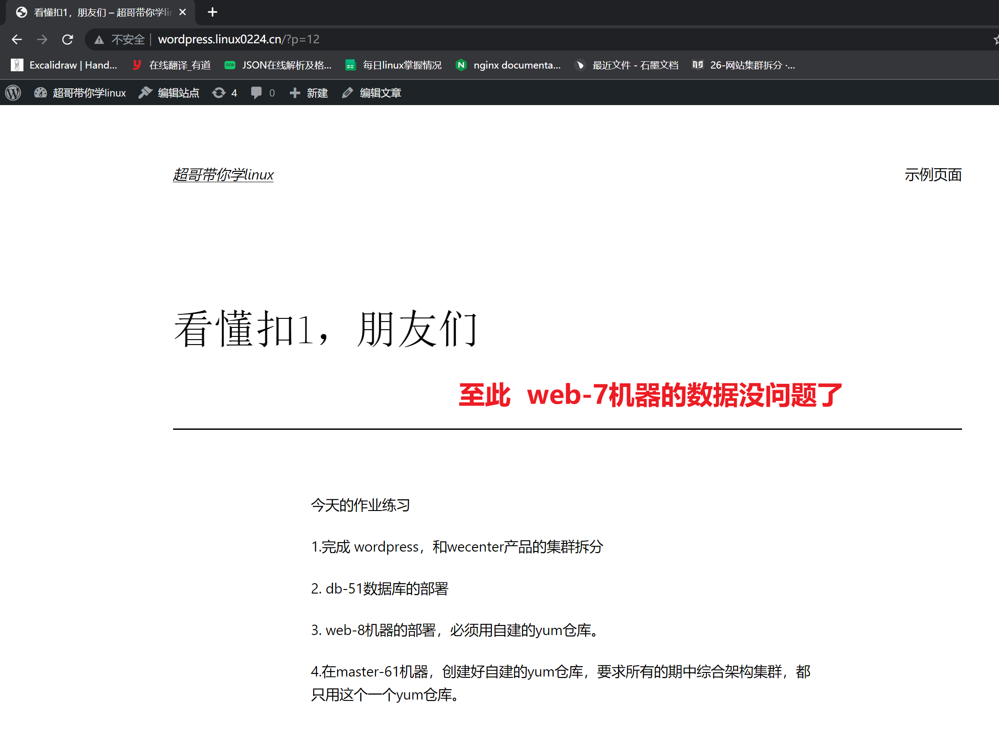

```### 此资源由 58学课资源站 收集整理 ###
	想要获取完整课件资料 请访问：58xueke.com
	百万资源 畅享学习

```
# 拆分思路

```
由172.16.1.7单节点

拆分为集群，一堆机器做一件事（多个机器提供了一个网站访问）

添加节点
db-51
nfs-31
web-8

1.拆分数据库，部署db-51

2.增加web-8节点,初识负载均衡

3. 添加共享存储nfs-31


```

# 美好的一天又开始了

```
 会遇见，N多个协议
 非常底层的知识，需要有很多的基础理论知识铺垫
 就类似学tcp/ip一样
 
 你日常在使用各种软件，底层都是计算机网络协议在，定制数据通信的规则。
 这些协议你短期内是不会过多接触的，起码在你工作1年后。才会去琢磨这个
 你前期就是把各种软件会用了，知道这些协议原理的存在。
 
 bind软件  dns协议
 ntpd服务   ntp协议
 nginx软件  http协议
 php-fpm软件  fastcgi协议运行
 
 python  	  uwsgi协议运行 
 
 不需要，会部署就行，工作1年后，再去看理论书籍，去理解，进阶提升的，解决疑难杂症。
 
 
 php-fpm进程（这个进程是为了接收nginx发来的请求，如找到一个login.php的教程程序，去加载代码，判断用户是否可以登录的，一个加工厂。
 php-fpm 内部有如下2个东西。
 
 1. 基于fastcgi协议运行的程序 -------(fastcgi_pass 把http的数据，发给了这个网关接口)和nginx来收发数据的
 2. 这个进程可以去读取某个目录下的php源代码文件，（login.php test-mysql.php,  register.php  index.php 网站的官网）
 ）
 
 文字描述，nginx+php的通信过程
wordpress.linux0224.cn 

经过你的nginx配置
server{
	listen 80;
	server_name wordpress.linux0224.cn ;
	# 在这里判断，例如当用户想访问网站官网，其实要访问的index.php
	# wordpress.linux0224.cn:80/index.php
	# 这个网站官网的代码文件，放哪呢。
	# 以及这个请求如何转发给php-fpm去加载这个php代码呢！
	location / {
		root /code/wordpress/;
		fastcgi_pass 127.0.0.1:9000;
		fastcgi_index index.php;
		# 保留用户想请求的脚本名，以及具体的uri信息的！
		 fastcgi_param SCRIPT_FILENAME $document_root$fastcgi_script_name;
		 # 导入一个文件，能够让fastcgi识别http的这些内置变量
		 # 在nginx的默认路径下
		 # cat /etc/nginx/fastcgi_params 
        include fastcgi_params;
	}
}
 
```


属于昨日知识的复习。


# 集群拆分


老师会给大家分享很多，工作的实际运用理念，你务必要听进去，消化，在心中理解为你就是你的工作经验！！

伏笔。

## 数据库拆分+php远程访问


# 实践1，拆分数据库

```
1.拆分背景，单机的各个组件，容易抢夺资源，导致服务器压力较大，拆的第一步，吧数据库拆出去
测试ab命令，对网站的整体压力

如何对nginx，php都造成压力，请发弹幕
访问动态资源，请求就会发给php


```


```
通过这个top结果，判断出
当前的后端压力很大，1000个请求还没发完，还没解析玩

关于更多的性能分析了，了解即可，先不用过多琢磨

判断出，后端解析能力较差的。比较慢的。

```


## 具体的拆分步骤

在你知道为什么要拆之后，再去拆。学通，学透彻。

```
1. 基于以有数据的web-7开始操作
导出当前数据库的数据（还得数据库锁表，防止数据写入，备份时候，出现错误。专门的学mysql时候再去细聊）

先导出所有的数据
# -A 备份所有的数据库，数据表
# --single-transaction 保证数据完整性的参数

# 这里是把当前机器的所有数据库，以及数据表发给目标机器。
#会携带着当前数据库的mysql.user 也就是用户信息

mysqldump -uroot -p'linux0224' -A --single-transaction > /opt/alldb.sql

# 这里导出的SQL文件，就是完全的 SQL语句，恢复操作，也就其实是db-51的数据库
把这些SQL重新执行一遍
其实就是在重新的创建数据库
创建数据表
插入表数据。


2.把备份的数据，发给db-51机器
前提是db-51机器，安装好了mariadb。

web-7数据发给db-51
[root@web-7 ~]#scp /opt/alldb.sql root@172.16.1.51:/opt/


3.db-51机器，导入数据了
导入了该备份的数据，也同时会导入用户的信息
【你准备一个新机器，从零去安装mysql，默认是没密码，】

db-51上登录mysql，用web-7那会指定的用户名，密码也就行行了。


[root@db-51 ~]#mysql -uroot -pwww.yuchaoit.cn  < /opt/alldb.sql 

导入之后，重启数据库
[root@db-51 ~]#systemctl restart mariadb

重启之后，当前数据库的用户信息，就会以你恢复的数据为准了。
登录测试
[root@db-51 ~]#mysql -uroot -plinux0224

# 查看，是否能select查询到你昨天写的博客数据
# 这里就是让你执行如下的SQL语句，去查询mysql里面的数据，也就是你在wordpress里面的数据
# 大家先临时记一记这些基本的SQL语句，
# 还有专门的学习mysql所有内容。

# 你就记忆这5条就够了文杰。。

MariaDB [wordpress]> show databases;

MariaDB [wordpress]> use wordpress;

MariaDB [wordpress]> show tables;

MariaDB [wordpress]> 
MariaDB [wordpress]> desc wp_posts;

MariaDB [wordpress]> 
MariaDB [wordpress]> select post_content  from wp_posts;

这里mysql看懂 3  不懂 4


4.你还得设置SQL语句，创建一个可以用于远程连接的账号。
web-7 去远程连接它。
# grant all privileges 授予所有权限
#  on *.*  对所有的数据库.里面的数据表 操作
# to 'linux0224'@'%' identified by 'linux666';
# 上述语句，表示创建一个用户名linux0224，允许在任何远程的主机上 %
# 去登录当前这个db-51，且设置该用户的密码是  linux666

MariaDB [wordpress]> grant all privileges on *.* to 'linux0224'@'%' identified by 'linux666';


Query OK, 0 rows affected (0.00 sec)


# 立即刷新mysql的权限

MariaDB [wordpress]> flush privileges;
Query OK, 0 rows affected (0.00 sec)

这个SQL授权语句，看懂 6 不懂7 


5.测试在web-7机器可以远程登录吗？

[root@web-7 ~]#mysql -ulinux0224 -plinux666 -h172.16.1.51


Welcome to the MariaDB monitor.  Commands end with ; or \g.
Your MariaDB connection id is 2
Server version: 5.5.68-MariaDB MariaDB Server

Copyright (c) 2000, 2018, Oracle, MariaDB Corporation Ab and others.

Type 'help;' or '\h' for help. Type '\c' to clear the current input statement.

MariaDB [(none)]> 

测试ok
看懂 3  不懂 4


```


## 测试web-7的php网站是否可以远程连接该数据库


```
你只需要修改wordpress的php源码即可
源码代码在
 vim /code/wordpress/wp-config.php
 
 
 修改如下
 // ** Database settings - You can get this info from your web host ** //
/** The name of the database for WordPress */
define( 'DB_NAME', 'wordpress' );

/** Database username */
define( 'DB_USER', 'linux0224' );

/** Database password */
define( 'DB_PASSWORD', 'linux666' );

/** Database hostname */
define( 'DB_HOST', '172.16.1.51' );

/** Database charset to use in creating database tables. */
define( 'DB_CHARSET', 'utf8mb4' );

/** The database collate type. Don't change this if in doubt. */
define( 'DB_COLLATE', '' );


```

## 测试再次访问web-7可以读取到远程的db-51数据吗

```
1. 停止web-7的数据库
[root@web-7 ~]#systemctl stop mariadb
[root@web-7 ~]#
[root@web-7 ~]#
[root@web-7 ~]#netstat -tunlp|grep 3306


2.访问测试

```


```
如何判断，这里的数据库，是读取的db-51呢?

请发弹幕。

1. 再写一篇博客，试试db-51里面有数据吗
http://wordpress.linux0224.cn/wp-login.php
访问后台，写入数据
yuchao01
chaoge666

你在后台的操作，也等于去修改数据库内容
你学完数据库mysql的语句后，可以直接修改msyql的内容，让网站的内容更新（最底层了，一般不建议直接修改数据库，但是也最暴力的办法）
看懂 1不懂 2


2. 删除数据，把这个蔡旭困照片给删了，学习下删除数据的sql语句


3. 查看当前web-7机器的 tcp连接情况，是否连接了db-51机器。
[root@web-7 ~]#ss -an |grep 3306
tcp    TIME-WAIT  0      0      172.16.1.7:38320              172.16.1.51:3306               
tcp    TIME-WAIT  0      0      172.16.1.7:38308              172.16.1.51:3306               
tcp    TIME-WAIT  0      0      172.16.1.7:38312              172.16.1.51:3306               
tcp    TIME-WAIT  0      0      172.16.1.7:38316              172.16.1.51:3306 

这里通过ss命令，就是看到tcp/ip的 三次握手，四次挥手情况。
以及可以看到当前服务器，建立了多少TCP连接


4. 停止db-51数据库
[root@db-51 ~]#systemctl stop mariadb


发现在前端的php告诉你，它连接数据库出错了。（找db-51的问题）


```


## 至此数据库拆分完毕

实现了把web-7的数据，备份，发给了db-51

db-51导入了该数据

配置了远程访问的权限


修改web-7的产品代码，远程连接数据库

测试数据库读写正常。

```
wordpress
wecenter

# 修改wecenter连接数据库的配置文件
vim /code/wecenter/system/config/database.php 


$config['charset'] = 'utf8mb4';^M
$config['prefix'] = 'aws_';^M
$config['driver'] = 'MySQLi';^M
$config['master'] = array (
  'charset' => 'utf8mb4',
  'host' => '172.16.1.51',
  'username' => 'linux0224',
  'password' => 'linux666',
  'dbname' => 'wecenter',
  'port' => '3306',
);^M
$config['slave'] = false;^M
$config['port'] = '3306';^M


# 因为你修改的不是php-fpm进程的配置文件
# 你修改的只是php源代码的静态程序文件，因此无须重启php-fpm进程
# 理解 3 不懂 4


```


# 问题解答


```
1.如何查看linux的网络连接情况

ss -an 命令查看系统的所有的网络连接
ss -an |grep 具体的端口号 # 用于故障排查，基于tcp/ip很细节的角度

ss，netstat，ps命令。
tcupdump，根据底层的网络连接数据库，去排查故障疑难杂症。。
性能分析的高级操作。。
tcp/ip数据包

查看当前机器，和数据库db-51机器的连接情况
ss -an |grep 172.16.1.51


这里访问不是一个index.php吗，为什么会去读取数据呢？

可是刚才访问的是10.0.0.7/index.php，并不是wordpress.linux0224.cn

```


---


```
关于nginx虚拟主机理解的疑问


```


## 增加web节点（web-8）基本的引入负载均衡理念


---


```
1. 增加web-8节点

部署和web-7一样的环境，从软件版本，到配置文件，全一样
你把web-7的配置，写成shell脚本，剧本，

写一个部署web7的剧本
这个操作是你们后期的大作业伏笔。
ansible 批量给 web7 8 9 三台机器部署 多个后端节点，。 听懂 6  不懂7 


手工理解部署过程，然后转化为自动化的脚本即可。


groupadd www -g 666
useradd www -s /sbin/nologin -M -u 666 -g 666

拷贝web7的所有配置文件 ，都是nginx+php功能的

- yum
注意你用的yum源，是阿里云的，还是自建的yum仓库。给捋清楚了。
# 老师这里用的是自建的yum仓库，如下

# 确保你的客户端，使用的是单独的一个自建yum仓库的设置
cat >61.repo<<EOF
[local-rpm]
name=local yum repo
baseurl=http://172.16.1.61:12345
enabled=1
gpgcheck=0
EOF


# 自建yum源，本地rpm的制作，yum仓库的创建+nginx虚拟主机的设置。

[root@web-8 ~]#scp root@172.16.1.7:/etc/yum.repos.d/61.repo /etc/yum.repos.d/

yum install nginx -y 


- nginx
拷贝nginx配置文件

[root@web-8 /etc/yum.repos.d]#scp root@172.16.1.7:/etc/nginx/conf.d/* /etc/nginx/conf.d/
root@172.16.1.7's password: 
wecenter.conf                                                                                                       100%  853     1.1MB/s   00:00    
wordpress.conf                                                                                                      100%  456   387.5KB/s   00:00 


- php文件

安装php，基于自建rpm仓库的安装，领导再也不担心我的yum源网络出问题了。。
yum install -y php71w-cli php71w-common php71w-devel php71w-embedded php71w-gd php71w-mcrypt php71w-mbstring php71w-pdo php71w-xml  php71w-fpm  php71w-mysqlnd  php71w-opcache php71w-pecl-memcached php71w-pecl-redis php71w-pecl-mongodb php71w-json php71w-pecl-apcu php71w-pecl-apcu-devel

纯内容yum仓库环境，速度嘎嘎块，看懂 6  不懂7 


拷贝php配置文件
[root@web-8 /etc/yum.repos.d]#scp -rp root@172.16.1.7:/etc/php-fpm.d  /etc/

[root@web-8 /etc/yum.repos.d]#scp -rp root@172.16.1.7:/etc/php-fpm.d  /etc/
root@172.16.1.7's password: 
www.conf                                                                                                            100%   18KB  12.7MB/s   00:00  


获取web-7机器的所有产品源代码
看懂操作的 扣 1，看懵了 2


wordpress

wecenter

拷贝命令如下

[root@web-8 /etc/yum.repos.d]#scp -rp root@172.16.1.7:/code/  /code/

此时，web-8机器就有了 web-7的所有内容

修改权限
[root@web-8 /code]#chown -R www.www /code/


web-8机器，可以启动nginx，php-fpm，查看是否可以访问wordpress。wecenterl
[root@web-8 /code]#systemctl start nginx
[root@web-8 /code]#
[root@web-8 /code]#
[root@web-8 /code]#systemctl start php-fpm


你们在做练习的时候，必须限制nginx和php-fpm都统一为www用户。

[root@web-8 /code]#ps -ef|grep php-fpm
root      11455      1  0 12:05 ?        00:00:00 php-fpm: master process (/etc/php-fpm.conf)
www       11456  11455  0 12:05 ?        00:00:00 php-fpm: pool www
www       11457  11455  0 12:05 ?        00:00:00 php-fpm: pool www
www       11458  11455  0 12:05 ?        00:00:00 php-fpm: pool www
www       11459  11455  0 12:05 ?        00:00:00 php-fpm: pool www
www       11460  11455  0 12:05 ?        00:00:00 php-fpm: pool www
root      11484  11159  0 12:07 pts/0    00:00:00 grep --color=auto php-fpm


```


## 测试访问（修改dns设置）


```
修改dns设置

10.0.0.7  wecenter.linux0224.cn wordpress.linux0224.cn

# 10.0.0.8  wecenter.linux0224.cn wordpress.linux0224.cn

```


测试整个lnmp所有环节

```
1.登录，nginx，php，mysql
2. 写入数据 nginx，php，mysql

```


---



## 测试web-8

```
1. 修改dns之后，查看web8的网站，能否读取到这些数据，就足以证明，

web读取到了mysql数据，配置是OK

web-7 web-8公用一个mysql，因此数据一样

看懂  3  不懂 4

2.修改dns
C:\Users\yu>ping wordpress.linux0224.cn

正在 Ping wecenter.linux0224.cn [10.0.0.8] 具有 32 字节的数据:
来自 10.0.0.8 的回复: 字节=32 时间<1ms TTL=64
来自 10.0.0.8 的回复: 字节=32 时间<1ms TTL=64
来自 10.0.0.8 的回复: 字节=32 时间<1ms TTL=64

3.访问测试

```


## 故障测试

### nginx挂了

```
分别测试nginx，挂掉，php，挂掉，数据库挂掉的过程，看报错，学透网站部署，


```


## nginx挂了什么情况

```
systemctl stop nginx 


访问http://wordpress.linux0224.cn/ 会出现什么情况

1.  404         2  叶金阳和 亮亮


2.  拒绝连接     1


```


## php挂了


```
php挂了会怎样

刷新 http://wordpress.linux0224.cn/ 会出现了什么

请发弹幕。

50x  

404  

无法解析

502


```


该错误状态码是 502

```
502 Bad Gateway  错误的网关（php-fpm   127.0.0.1:9000）

以后看到502就知道，nginx的代理转发出了问题，后端节点出了问题

看懂扣 1  不懂 2

恢复这个过程

```


### 数据库挂了

```
[root@db-51 ~]#systemctl stop mariadb
[root@db-51 ~]#


http://wordpress.linux0224.cn/ 会出现什么、猜一猜

这个是后端框架，php-fpm会去根据数据库故障，代码中写的，异常处理的规则。

开发人员决定好的。（一般情况下，都是提示数据库无法连接）


```


---


---


### 修复故障，修复数据库

```
systemctl start mariadb

```


# NFS网站静态数据共享

```
1.具体的网站源码，静态文件放哪，那是开发决定好的，这是属于网站开发中的URL设计。

比如你来看
想知道一个网站，大致url设计是什么样

https://i0.hdslb.com/bfs/banner/be55628ace5508317e900f3fe8460ad9873a1476.png@976w_550h_1c.webp
https://i0.hdslb.com/bfs/banner/9388bfdd5aa4e266329234116c8f777ed911c571.png@976w_550h_1c.webp
https://i0.hdslb.com/bfs/banner/be55628ace5508317e900f3fe8460ad9873a1476.png@976w_550h_1c.webp


你能提取出这些图片存储的路径共性，https://主机地址/bfs/banner/xxx资源

看懂扣 1  不懂 2

通过f12，抓取网站的http数据包，查看每一个请求具体的url格式。


分析自己的wordpress图片链接，在服务器上的位置
http://wordpress.linux0224.cn/wp-content/themes/twentytwentytwo/assets/images/flight-path-on-transparent-d.png


图片服务器的设置
url设计的形式，设置nginx的配置文件。，


针对具体的静态文件目录，
root /code/wordpress/static/; # 设置为挂载点，挂载到NFS


运维需要根据开发提供的文档，或者要求，设置对应的location来处理静态请求，以及设置对应的目录挂载（NFS）

所以你只需要打好基础，nginx玩明白，NFS玩明白，遇见需求，见招拆招就好。


```


```

```

## 给wordpress设置静态目录

```
wordpress支持让用户自定义上传图片，图片上传的越来越多，导致服务器存储资源太大。

解决这个问题，单独的设置共享存储。降低web-7的存储压力。


2， 当你引入多个后端节后段，web-7 上传图片，在本地

web-8读取这个数据，能读到吗？


```

### 当你在单机web-8上传数据， 看web-7有吗？如何解决这个问题。

```
1.如何查看该图片的具体url？
会找到这个蔡旭困具体存储路径的，扣 1 不会的扣 2
有这个思路的，扣1 ，看不到 2
F12抓HTTP请求

http://wordpress.linux0224.cn/wp-content/uploads/2022/05/cai.jpg

2.找到web-8的这个图片

3.修改dns，你访问web-7试试，看得到这个数据吗？
肯定没有，看下图

```


## 配置NFS如下

```
实现效果，让每一个节点上传数据后，数据都是共享可见的。
完成对wordpress上传数据的共享，让用户上传的大量图片uploads目录数据，挂载到NFS服务器，以后用户上传的图片，附件，都统一在了NFS机器上。
防止资源找不到的问题，并且降低了web-7 web-8的磁盘存储问题。
NFS-31磁盘会很给力。


1.部署nfs-31
[root@nfs-31 ~]#yum install nfs-utils rpcbind -y


2.设置共享目录
创建目录，且设置为 www用户

[root@nfs-31 ~]#mkdir /wordpress-uploads
groupadd www -g 666
useradd www -s /sbin/nologin -M -u 666 -g 666


检查目录权限
[root@nfs-31 ~]#id www
uid=666(www) gid=666(www) groups=666(www)
[root@nfs-31 ~]#
[root@nfs-31 ~]#
[root@nfs-31 ~]#chown -R www.www /wordpress-uploads/


[root@nfs-31 ~]#cat /etc/exports
/wordpress-uploads  172.16.1.0/24(rw,sync,all_squash,anonuid=666,anongid=666)

确保你的nfs是正常共享
[root@nfs-31 ~]#exportfs -r
[root@nfs-31 ~]#
[root@nfs-31 ~]#showmount -e 172.16.1.31
Export list for 172.16.1.31:
/wordpress-uploads 172.16.1.0/24


NFS服务器的部署，看懂扣 6 不懂7 


```

## 设置web服务器的共享（web-7,web-8）

```
给web-7 web-8的 uploads目录上传目录挂载给NFS即可

yum install nfs-utils rpcbind -y

挂载NFS
mount -t nfs  172.16.1.31:/wordpress-uploads   /code/wordpress/wp-content/uploads

df -h


```

## 测试数据的写入

```
查看每一个web节点，以及NFS服务器的数据
```

web-7和web-8的切换，图片都正常吗


## 查看图片服务器挂了的情况（故障1,服务端挂了）

```
nfs-31故障
systemctl stop nfs


刷新会出现什么？
如果你图片服务器挂了，nginx去 挂载点找数据，发现NFS卡死，会导致网站卡死。

修复nfs31服务器，最好高可用性。。

，立即停止这个挂载动作。
systemctl start nfs

看懂扣 6 不懂7 


```

## 做好自动挂载，方式重启机器后，导致未挂载没数据（故障2，客户端挂了，未挂载）

```
[root@web-7 /code/wordpress/wp-content/uploads/2022/05]#cd
[root@web-7 ~]#
[root@web-7 ~]#
[root@web-7 ~]#umount /code/wordpress/wp-content/uploads

猜猜刷新，会出现什么报错。

404 。。

404 图片没了，就裂了

去服务器上看看图片数据又吗

如果你发现错误的结果是404，那可能是你客户端的问题，定位到时未挂载，而不是NFS服务端的问题

修复这个问题，挂载上就好了。

```

## 最后你可以自己做好fstab挂载动作

```
留作作业。。太简单。 

```


# 作业要求


```
今天的作业练习

1.完成 wordpress，和wecenter产品的集群拆分

2. db-51数据库的部署

3. web-8机器的部署，必须用自建的yum仓库。

4.在master-61机器，创建好自建的yum仓库，要求所有的期中综合架构集群，都只用这个一个yum仓库。

5. 给web-8，和web-7设置好统一的NFS文件共享

6. 做好开机挂载准备


```


下课。古德拜。老踢门。

有问题随时向超哥提问。


