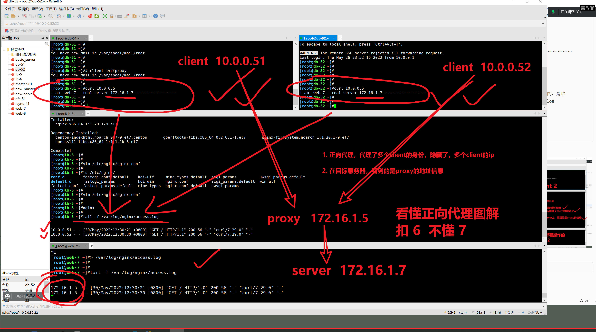

```### 此资源由 58学课资源站 收集整理 ###
	想要获取完整课件资料 请访问：58xueke.com
	百万资源 畅享学习

```


# 1.理解集群

1.一堆机器，做一件事，这就是服务器集群。

2.只有基于服务器集群的环境，才能实现负载均衡。


有些种类的服务器集群


# 2.负载均衡集群


优点是


说到这，很清晰，服务器集群的绘图架构，优点，性能的


切身的体会，去理解，从事多年运维，在工作里的一些心得感受，而不是单单学一些技术知识点。。。


```
web7 
web-8

web-9
web-10
web-xxxx


只要是服务器集群，就必然能实现如下特定
高性能

价格合适，价格有效性

服务器集群可以很容易的扩容、缩容，  10 > 20   20 > 10 ，比如公司要上架新的秒杀活动，活动结束之后，要撤掉服务器。


（物理机，人家厂家能让你随便退换吗？因此，你觉得什么样的服务器形式，可以让你随意购买，随意退换？）

因此，云服务器，公有云服务器就是怎么牛

（阿里巴巴，买了1万物理机，通过vmware等虚拟化手段，创建了一个巨大的虚拟机，从这个虚拟机里面，按需划分资源，按价格，划分资源，给用户创建云服务器。也就是你买的那个机器）

企业是10个阿里云，上架秒杀活动，随之而来的高并发的请求，
防止这10个机器被暴增的压力击垮，再买一组服务器，应对秒杀活动，你只买1个月。。
活动结束后，1个月后，服务器自动被释放，价格有效性


高可用性，  web7 web8 web9

透明性，你访问一个入口，在用户是不得知后面有多少个集群的。。。

可管理性 ，维护这个服务器群组，按分类划分，web组 数据库组，缓存组，负载均衡组。等等，如何管理啊？基于ansible的主机清单去管理如
[web]
xx.xx.xx.xx
[db]
xx.xx.xx.xx
[slb]
xx.xx.xx.xx

看懂扣 1 不懂2


可编程性，后端的语言选择很多种。。


集群分类web组 数据库组，缓存组，负载均衡组。


具体的实践，查看web负载均衡组


```

## 2.1 图解负载均衡理念

```
集群的意思就是，一堆机器，一群机器做一件事

具体做什么事，就是来划分集群的作用，分类了。。

负载均衡集群和高可用性集群是互联网行业常用的集群架构模式，也是我们要学习的重点。


```


--=-


## 2.2 梳理负载均衡知识点

```
怪我哈，朋友们，不应该直接去讲解前后端分离理念的，这个有点绕远了，得带着你们部署过才能听懂。

没部署过前后端分离的项目
你还不懂什么是反向代理
你还不懂什么是负载均衡

画了一个负载的流程图，你肯定听不懂。。。

刚才花的图，忘记它就行了！！！

2天之后，就可以理解刚才的图是什么意思了。。。。


忘记刚才讲的，从这里跟着我的思路来，咱们就去部署wordpress负载均衡。


负载均衡的学习路线

1. 理解代理的概念

2. 理解代理的nginx配置

代理就是把请求转发给后端。。

3. 理解基于代理之后的 负载均衡服务器组配置

4. 完成wordpress的负载均衡搭建。

理解这一些列的知识点了。。


```

这次听懂，学习路线的，扣 1 不懂 2


---


---


## 2.3 如何实现负载均衡的部署

```
1. 从硬件角度，
商业集群软件，有F5、Netscaler(实体硬件，了解即可。)等。
最终的配置，和nginx差不多理念，配置的方式不同。


互联网公司常用的开源软件、nginx、lvs、haproxy、keepalived、heartbeat。

商业集群软件，有F5、Netscaler等。


```


---


# 3.0 先得理解什么是代理的概念，才能理解什么是负载均衡

```
代理，说白了就是有一个 代理机器，去分别代理不同的角色

关于代理 proxy，分为正向代理，和反向代理两种，分别应用在不同的环境下。

```


# 3.正向代理


---

---


```
用途
正向代理的具体用途，

通过代理服务器，突破client本身的ip访问限制，访问国外资源。
你在国内，是无法访问到国外的数据的，因为你的ip地址都被运营商检测了
你的ip无法直接访问到国外的数据，根本ip就不同。。

客户端 115.171.244.219北京市朝阳 电信
↓ （无法通信，中间有一堵墙）
youtube的服务器，ip


如何通信，基于正向代理，通过另一个ip的伪装去访问

客户端 115.171.244.219北京市朝阳 电信
↓（正向代理，连接上VPN，此时我client的ip表现，就不是115.171.244.219这个ip地址，而是代理服务器的ip地址，比如 ）
是你的VPN服务器的ip地址（123.206.16.61）
↓
youtube的服务器ip（会看到请求是来自于谁？来自于 123.206.16.61）


正向代理是什么，就是 proxy代理的是client。


隐藏client真实信息，可以保护client服务器，隐藏自己的ip，免受攻击。


```


能理解正向代理的特点，扣 1 ，不懂 2

我写了多少，你就去理解多少。

```
你只需要记住
正向代理，proxy代理的是client


```

正向代理你一般用不上，用得少。

# 4.反向代理


反向代理，使用的很多，因为它用在负载均衡中。


```
先入为主引入一句话

反向代理，proxy 代理的就是 server服务端。

```


# ------------------正向代理实验-------------

## 4.1 图解正向代理，反向代理区别()


```
正向代理，指的是通过代理服务器 代理浏览器/客户端去重定向请求访问到目标服务器 的一种代理服务。

正向代理服务的特点是代理服务器 代理的对象是浏览器/客户端，也就是对于目标服务器 来说浏览器/客户端是隐藏的。

```


```
因此，你只需要，基于nginx的 proxy_pass 转发给一个后端节点就行。

就可以实现正向代理。


```

## 4.1.1 实践nginx的正向代理（重要！！！！！！！）

```
完成效果是
这里的正向代理，理念，2句话，看明白的扣 1，不懂 2


1.  伪装客户端，隐藏客户端（可以去准备多个client，多个client都被隐藏了）

访问 proxy机器（请求是通过proxy发出去的）

2.  在一个明确的目标server上，看到的是proxy机器的地址信息。


准备环境如下，至少需要3台机器即可。

client 

↓
proxy（正向代理的配置） lb-5机器


↓
server


```


### 【部署lb-5机器，正向代理的设置】

```
1.安装nginx
[root@lb-5 ~]#yum install nginx -y


2. 修改配置文件（实现，吧client的请求，转发给一个明确的目标机器）
# 实现代理转发的参数，叫做proxy_pass 
# client > nginx(proxy_pass) >  明确的目标机器。


user nginx;
worker_processes auto;
error_log /var/log/nginx/error.log;
pid /run/nginx.pid;

# Load dynamic modules. See /usr/share/doc/nginx/README.dynamic.
include /usr/share/nginx/modules/*.conf;

events {
    worker_connections 1024;
}

http {
    log_format  main  '$remote_addr - $remote_user [$time_local] "$request" '
                      '$status $body_bytes_sent "$http_referer" '
                      '"$http_user_agent" "$http_x_forwarded_for"';

    access_log  /var/log/nginx/access.log  main;

    sendfile            on;
    tcp_nopush          on;
    tcp_nodelay         on;
    keepalive_timeout   65;
    types_hash_max_size 4096;

    include             /etc/nginx/mime.types;
    default_type        application/octet-stream;
    include /etc/nginx/conf.d/*.conf;

    server {
        listen       80;
        server_name  _;

        # 接收请求，转发给目标server
        # 只修改了这里
        location  / {
                proxy_pass http://172.16.1.7/;
        }

        }
    }

# 运行nginx
[root@lb-5 ~]#nginx 


# 检测日志
[root@lb-5 ~]#tail -f /var/log/nginx/access.log 


3.启动nginx


4. 检测访问日志


```

### 【部署目标server（web-7）】

明确，准备好了，一个提供数据的 目标server、

并且只能通过内网访问


```
1.web-7提供一个静态页面，模拟真实数据
yum install nginx -y

生成静态页面
[root@web-7 ~]#echo 'i am  web-7   real server 172.16.1.7 ~~~~~~~~~~~~~~~~~~' > /usr/share/nginx/html/index.html 


2. 本地测试访问一下
[root@web-7 ~]#curl 172.16.1.7
i am  web-7   real server 172.16.1.7 ~~~~~~~~~~~~~~~~~~


3. 检测 web-7 目标server的日志，查看请求是从哪来的，是谁
[root@web-7 ~]#tail -f /var/log/nginx/access.log 


```

### 【部署多个client】（最终验证）


.




```

```


## 4.2 nginx如何实现正向代理、反向代理


```
1. 正向代理，单纯的proxy_pass，转发给另一个机器，就是正向代理。


2. 反向代理，只要是结合着负载均衡的，就是反向代理，也就是使用proxy_pass加上upstream参数


```


# 5.实战nginx正向代理（从这里开始）

三台机器，至少3台，然后client可以放大多个


client   >  proxy  >  server


# ---------------反向代理（负载均衡）实验---------------

之前的操作，都属于nginx的正向代理，只用到了nginx的proxy_pass这个参数。


## 实现七层负载均衡的模块 upstream


>后续的实验，防止混乱反向代理，或是正向代理，就统一读作，请求转发。

```
反向代理在nginx中的设置，就是基于如下2个参数

1. proxy_pass  请求转发发给一组服务器;

2.  upstream{} 这个关键字去定义一组服务器;

3.既然是请求转发给了一组服务器，并且这个upstream{}参数中可以设定，负载均衡的算法，
因此，这俩参数，实现了负载均衡的效果。。


```

## 实现四层负载均衡的模块，stream

```
官网文档的地址
https://nginx.org/en/docs/stream/ngx_stream_core_module.html


```


# 记住这句话，100%没错

```


关于正向代理、反向代理

还是只需要记住两句话

1. 正向代理，是proxy 代理【多个】client

2. 反向代理，是proxy代理【多个】server

维基百科的资料

代理服务器
https://zh.wikipedia.org/wiki/%E4%BB%A3%E7%90%86%E6%9C%8D%E5%8A%A1%E5%99%A8

反向代理
https://zh.wikipedia.org/wiki/%E5%8F%8D%E5%90%91%E4%BB%A3%E7%90%86
```


---


--


## 什么是七层负载均衡


## 什么是四层负载均衡

就是从 1 ~ 4层

只有 基于 mac地址，网线，到ip地址，到这就结束。


# 6.nginx负载均衡（四层）

nginx叫做，一个强大的，支持七层负载均衡的负载均衡器。


负载均衡就是至少要准备以四个机器

```
client  > proxy  > server1,server2

四层转发，就是基于OSI七层网络模型里的第四层，ip:port的转发。


准备机器

client


nginx四层代理


db-51

db-52


```

## 6.1 实践mysql的四层转发

```
nginx实现四层负载均衡的模块，名字叫做 
stream模块


```


```
client
去登录lb-5这个机器，以mysql的命令去登录


lb-5 ，查看lb-5是如何吧你的请求转发出去的
你可以开始测负载均衡了，修改nginx的配置如下


db-51


db-52

先部署好着俩数据库，这里的操作，仅仅是想演示给大家看，nginx是如何转发client的请求，基于ip:port的转发过程。

理解扣 1 不懂 2


确保可以远程连接即可
没有设置远程访问权限

[root@db-51 ~]#mysql -uroot -pwww.yuchaoit.cn
[root@db-52 /etc/yum.repos.d]#mysql -uroot -pwww.yuchaoit.cn

需要设置远程访问权限，基于如下的快捷命令操作即可

分别操作db-51
db-52


# 这个sql语句，看懂扣 1，不懂 2
# 授权一个用于远程连接的用户名 yuchao01，密码是chaoge666，允许在任何机器去登录

mysql -uroot -pwww.yuchaoit.cn -e "grant all privileges on *.* to yuchao01@'%'  identified by  'chaoge666'"


先手动测试，是否可以远程连接
[root@master-61 ~]#mysql -uyuchao01 -pchaoge666 -h172.16.1.51  -e "show variables like 'hostname';"
+---------------+-------+
| Variable_name | Value |
+---------------+-------+
| hostname      | db-51 |
+---------------+-------+
[root@master-61 ~]#
[root@master-61 ~]#
[root@master-61 ~]#mysql -uyuchao01 -pchaoge666 -h172.16.1.52  -e "show variables like 'hostname';"
+---------------+-------+
| Variable_name | Value |
+---------------+-------+
| hostname      | db-52 |
+---------------+-------+


```


# 7.nginx负载均衡（七层）

```
负载均衡就是至少要准备以四个机器

client  > proxy  > server1,server2

四层转发，就是基于OSI七层模型里的第七层，可以根据用户url的转发，也就是nginx的location结合proxy_pass的功能。


```


```
相比于正向代理，反向代理的定义如下：

反向代理，指的是浏览器/客户端并不知道自己要访问具体哪台目标服务器，只知道去访问代理服务器 ，代理服务器再通过反向代理 +负载均衡实现请求分发到应用服务器的一种代理服务。

反向代理服务的特点是代理服务器代理的对象是应用服务器，也就是对于浏览器/客户端 来说应用服务器是隐藏的。


```

## 7.1 实践nginx七层转发，负载均衡


```
七层负载均衡的模块是 http_upstream {}

https://nginx.org/en/docs/http/ngx_http_upstream_module.html
实现对http请求的转发


配置语法如下
# 2.定义地址池
upstream backend {
	# 是基于七层的地址池
	# 第七层的DNS协议进行转发，简单说就是支持域名的地址池
	# 
    server backend1.example.com      ;
    server backend2.example.com:8080;
    server unix:/tmp/backend3;

    server backup1.example.com:8080 ;
    server backup2.example.com:8080 ;
}

# 1.要定义虚拟主机

server {
    location / {
        proxy_pass http://backend;
    }
}

这个基本的 http七层负载均衡，语法能看懂 扣 1 看不懂 2

# 俩步骤 
1. 定义虚拟主机，指定请求发给一组服务器

server {
    location / {
        proxy_pass http://backend;
    }
}

2.定义一组服务器的地址信息

upstream 地址池的名字 {
	server  地址1；
	server  地址2;
}

```

简单点，最简化来理解http七层负载均衡的效果

```


lb-5 负载均衡，实现基于七层的负载均衡转发

[root@lb-5 /etc/nginx/conf.d]#cat web78.conf 


upstream myweb {

	server 172.16.1.7:9999;
	server 172.16.1.8:9999;

}


server {

listen 80;
server_name _;

location /test-web/ {
	proxy_pass http://myweb;

}

}


web-7  就提供静态页面 

web-8  就提供静态页面 

配置统一即可

1. /etc/nginx/nginx.conf 默认配置即可

2. 写一个conf.d/my-web.conf 提供最简单的文本页面即可

server {
	listen 9999;
	server_name _;
	location / {
	
		root  /my-web/;
		index index.html;
	}
}

# 创建测试数据
mkdir /my-web/
分别写入两句话


echo 'web-8 ~~~~~~~~~'  > /my-web/index.html


echo 'web-7 !!!!!!!!!!!!!!!!!!!!!!!!!'  > /my-web/index.html
```

准备如下环境

```
[root@web-8 /etc/nginx/conf.d]#
[root@web-8 /etc/nginx/conf.d]#curl 172.16.1.8:9999
web-8 ~~~~~~~~~


[root@web-7 /etc/nginx/conf.d]#
[root@web-7 /etc/nginx/conf.d]#curl 172.16.1.7:9999
web-7 !!!!!!!!!!!!!!!!!!!!!!!!!
[root@web-7 /etc/nginx/conf.d]#


```

## 最终测试

访问lb-5机器即可

```
效果应该是

10.0.0.5:80

请求会分发给后端的两个机器

```


# 今天作业

```
http://apecome.com:9495/02-%E7%BD%91%E7%AB%99%E9%83%A8%E7%BD%B2%E7%AF%87/27-%E9%AB%98%E6%80%A7%E8%83%BD%E8%B4%9F%E8%BD%BD%E5%9D%87%E8%A1%A1%E9%9B%86%E7%BE%A4.html?q=#5--%E5%AE%9E%E6%88%98%E4%B8%83%E5%B1%82%E8%B4%9F%E8%BD%BD%E5%9D%87%E8%A1%A1%EF%BC%88nginx%EF%BC%89

把博客看看，动手敲一敲，明天继续负载均衡的参数
```


