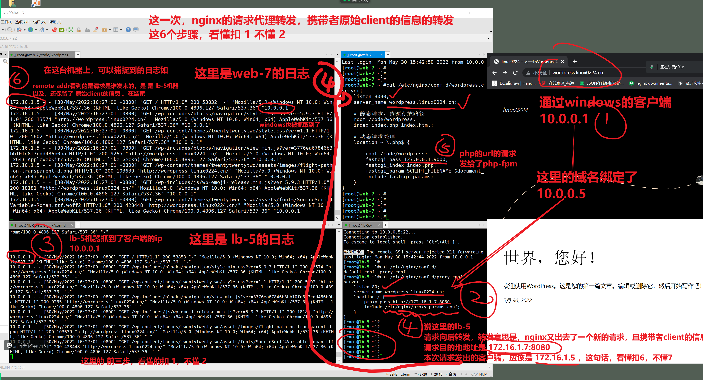
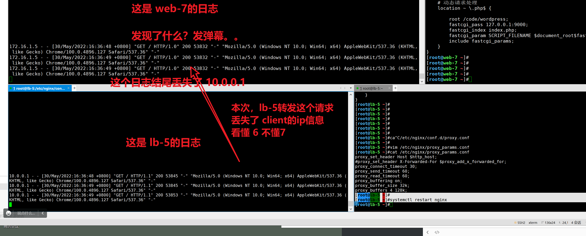
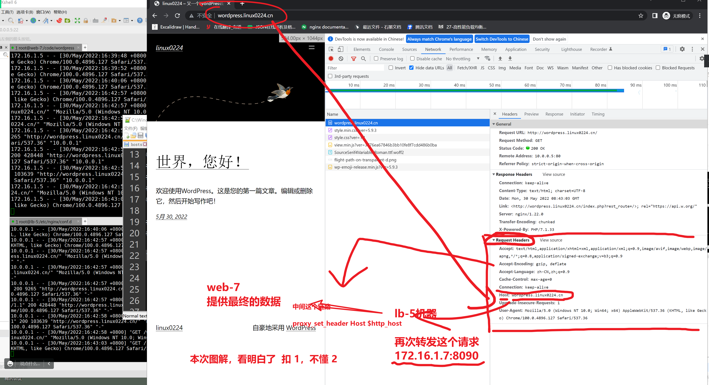

```### 此资源由 58学课资源站 收集整理 ###
	想要获取完整课件资料 请访问：58xueke.com
	百万资源 畅享学习

```
# 梳理一波

```
1. linux的集群的概念

2. 集群在web架构中的应用，主要是如 负载均衡集群

3. 在学负载均衡之前，需要需要先理解nginx代理转发请求的概念
主要学习了nginx的转发请求的参数proxy_pass  填写后端的地址 ip:port;

先是成功的演示了 纯ip:port的转发形式

client 
↓
lb-5，  proxy_pass  http://10.0.0.7/;
↓
web-7 （仅仅提供了 静态页面， i am web 7 ）

以及关于正向代理，反向代理的区别


4. 下一步的演示，是携带着域名的 请求转发

client   10.0.0.1 ，外网地址
↓
lb-5   使用内网地址去转发， 172.16.1.5
↓
web-7  172.16.1.7 （部署wordpress）


上述所有的通信流程，通过nginx的access_log可以看清楚


想实现的效果，是访问 lb-5 但是可以看到 web-7的wordpress内容。
这个需求，明确理解的扣 6 不懂7 


下一步，具体的操作如下，完成这个实验。
注意，你可以纯手动去部署，确保 lb-5 和web-7的nginx 安装一致。


```


# 环境准备

```
client

nginx

web-7  


确保机器配置一致，防止nginx的配置不一样，导致故障。


[nginx-stable]
name=nginx stable repo
baseurl=http://nginx.org/packages/centos/$releasever/$basearch/
gpgcheck=1
enabled=1
gpgkey=https://nginx.org/keys/nginx_signing.key


yum clean all

yum install nginx -y


```

# lb-5机器

```
[nginx-stable]
name=nginx stable repo
baseurl=http://nginx.org/packages/centos/$releasever/$basearch/
gpgcheck=1
enabled=1
gpgkey=https://nginx.org/keys/nginx_signing.key


yum clean all

yum install nginx -y

# 转发的参数文件
# 参数都在这里了，博客中也有解释
# proxy转发请求，且携带，保留客户端的真实信息。
# access_log去看
[root@lb-5 /etc/nginx/conf.d]#cat  /etc/nginx/proxy_params.conf 
proxy_set_header Host $http_host;
proxy_set_header X-Forwarded-For $proxy_add_x_forwarded_for;
proxy_connect_timeout 30;
proxy_send_timeout 60;
proxy_read_timeout 60;
proxy_buffering on;
proxy_buffer_size 32k;
proxy_buffers 4 128k;


[root@lb-5 /etc/nginx/conf.d]#cat /etc/nginx/conf.d/proxy.conf 
server {
    listen 80;
    server_name wordpress.linux0224.cn;
    location / {
        proxy_pass http://172.16.1.7:8080;
        include /etc/nginx/proxy_params.conf;
    }
}


```

# web-7机器wordpress

```
[root@web-7 ~]#groupadd www -g 666
[root@web-7 ~]#useradd www -s /sbin/nologin -M -u 666 -g 666


[nginx-stable]
name=nginx stable repo
baseurl=http://nginx.org/packages/centos/$releasever/$basearch/
gpgcheck=1
enabled=1
gpgkey=https://nginx.org/keys/nginx_signing.key


yum clean all
yum install nginx -y


# 卸载旧环境
yum remove php-mysql-5.4 php php-fpm php-common -y

# 安装第三方epel源
rpm -Uvh https://dl.fedoraproject.org/pub/epel/epel-release-latest-7.noarch.rpm

rpm -Uvh https://mirror.webtatic.com/yum/el7/webtatic-release.rpm


yum install -y php71w-cli php71w-common php71w-devel php71w-embedded php71w-gd php71w-mcrypt php71w-mbstring php71w-pdo php71w-xml  php71w-fpm  php71w-mysqlnd  php71w-opcache php71w-pecl-memcached php71w-pecl-redis php71w-pecl-mongodb php71w-json php71w-pecl-apcu php71w-pecl-apcu-devel


sed -i '/^user/c user = www' /etc/php-fpm.d/www.conf 
sed -i '/^group/c group = www' /etc/php-fpm.d/www.conf 
systemctl restart php-fpm

yum install mariadb-server mariadb -y
systemctl start mariadb


# nginx设置
# 最终环境解决好了就2件事

# 1. nginx的配置文件

# 2是  php的源代码

1.注意我们是修改了后端节点的入口为 172.16.1.8:8080

2.修改配置文件
[root@web-8 ~]#cat  /etc/nginx/conf.d/wordpress.conf 
server{
    listen 8080;
    server_name wordpress.linux0224.cn;

    # 静态请求，资源存放路径
    root /code/wordpress;
    index index.php index.html;

    # 动态请求处理
    location ~ \.php$ {

        root /code/wordpress;
        fastcgi_pass 127.0.0.1:9000;
        fastcgi_index index.php;
        fastcgi_param SCRIPT_FILENAME $document_root$fastcgi_script_name;
        include fastcgi_params;
    }
}

3.启动nginx（后端节点）
[root@web-8 ~]#systemctl start nginx
```

王者归来

踩坑归来


环境问题。


# 最后一步的访问，先检测日志，来看请求走向

```
先确认日志的格式
    log_format  main  '$remote_addr - $remote_user [$time_local] "$request" '
                      '$status $body_bytes_sent "$http_referer" '
                      '"$http_user_agent" "$http_x_forwarded_for"';

    access_log  /var/log/nginx/access.log  main;

第一个数据，应该是远程客户端的ip，也就是这个请求谁发来的

最后一个数据
$http_x_forwarded_for 用于真实的客户端ip地址，也就是windows的ip

因为如下顺序
1.  client 发出请求  wordpress.linux0224.cn （10.0.0.1）

2.  lb-5机器，接收到请求，转发请求，且保留该客户端的信息
整体转发如下信息
host: wordpress.linux0224.cn
真实的客户端ip:  10.0.0.1


3. 最后的web-7服务器可以捕捉到如下信息

$remote_addr    请求是从哪发来的   10.0.0.5
$http_x_forwarded_for  真实的客户端ip应该是谁    10.0.0.1

访问试试

```

做好windows的域名解析

```
10.0.0.5   wordpress.linux0224.cn
```

在windows中 使用 ctrl + shift + r 强制刷新，不保留缓存，查看请求的发送情况





访问全流程，如上。


## 测一测，你去掉一些请求转发的参数，查看效果

```
在lb-5机器上添加的。
这个代理参数，就是能实现
proxy_set_header X-Forwarded-For $proxy_add_x_forwarded_for;

通过lb-5 把 client  10.0.0.1的信息，携带者，发给web-7 因此你才能在 web-7的access_log看到

这句话，看懂 2  不懂 3

然后我们测试，去掉这个参数，看看日志
[root@lb-5 ~]#cat /etc/nginx/proxy_params.conf
proxy_set_header Host $http_host;
#proxy_set_header X-Forwarded-For $proxy_add_x_forwarded_for;
proxy_connect_timeout 30;
proxy_send_timeout 60;
proxy_read_timeout 60;
proxy_buffering on;
proxy_buffer_size 32k;
proxy_buffers 4 128k;


此时这个配置文件，就会导致lb-5机器，转发请求，但是丢失了client的真实ip
[root@lb-5 ~]#
[root@lb-5 ~]#systemctl restart nginx


```

再次访问

```
http://wordpress.linux0224.cn/

```




再次去掉一个参数，试试什么鬼

这里的操作，就别演示了，你记住，上述，正确的用法即可。

搞懂，请求转发，还要携带参数就对了！！！


```
最终，发现，远程的机器，返回了一个目标server的 内网ip，
你的windows是无法访问这个 内网ip的，因此访问故障

从这个现象来看，你必须在请求转发的时候，携带者host 主机头部信息，才是正确的。

```





