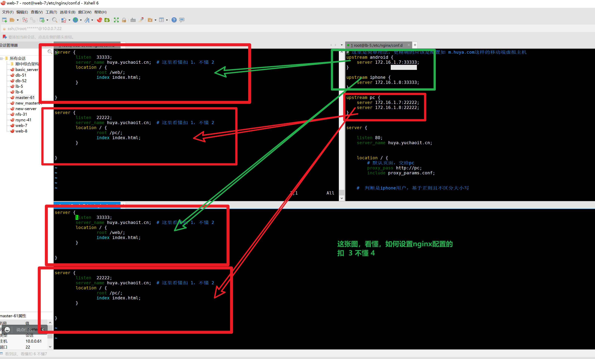
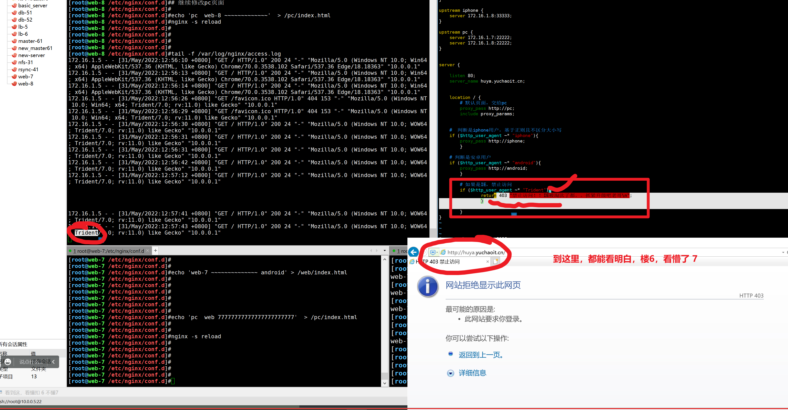

```### 此资源由 58学课资源站 收集整理 ###
	想要获取完整课件资料 请访问：58xueke.com
	百万资源 畅享学习

```
# 昨日内容回顾

## 1.nginx可以实现代理转发功能

```
1.nginx可以实现代理转发功能，七层代理转发，基于http协议的转发

- 正向代理（nginx代理多个client）
	多个 client  
	↓
	nginx代理服务器（nginx  access_.log）
	proxy_pass http://后端;
	如果你是四层转发，就不能加上这个协议
	proxy_pass ip:port;
	↓
	后端的服务器（nginx  access_.log）
	
	

- 反向代理（nginx代理一组多个server）nginx中

 多个 client ，windows浏览器去访问，或者是linux的curl命令去访问
 ↓
 nginx代理代理服务器（特点在利用nginx的http_upstream模块实现定义一组http协议的主机组）
 整个的配置是在 http{} 这个大标签里面的
 # 代理配置还差些什么
 cat /etc/nginx/nginx.conf
 
 http{    
 
 	upstream my-web{
 		# 定义后端机器的节点地址
 		# 就看你后端地址ip:port是多少
 		server 172.16.1.7:12345;
 		server 172.16.1.8:12345;
 	}      
 	
 	server {
 		listen 80;
 		server_name _;
 		# 通用请求匹配，所有请求都到这
 		location / {
 			proxy_pass http://my-web;
 		
 		}
 	
 	}
 
 
 
 }
	

先把后端节点给配置好
模拟用了

web-7 提供资源展示 ，提供访问的地址是 172.16.1.7:12345
web-8 提供资源展示 ，提供访问的地址是 172.16.1.8:12345
	
，因此，综上的配置，是昨天学的nginx实现的代理转发功能，以及
正向代理的配置语法
反向代理（实现了负载均衡的效果）的配置语法
看懂扣 6 不懂7 


```

## 2.反向代理（负载均衡的重要参数）

```

2.反向代理（负载均衡的重要参数）


# 转发http请求的，明确你的后端是运行在基于http协议上。

proxy_pass  请求转发的目标地址;

proxy_pass  http://127.0.0.1:8888;

# 部署PHP网站
# 后端php-fpm此时配置文件/etc/php-fpm.d/www.conf
# 人家说该服务，是以fastcgi这个协议运行（http  > fastcgi > php-fpm）
fastcgi_pass  php-fpm运行的地址;
web-7 (nginx+php-fpm)

fastcgi_pass  127.0.0.1:9000;

这里的俩种协议配置语法，能看懂扣  1，看不懂 2；
请求转发的


# 关于http协
# 你要记住，除了要吧请求转发过去，还得保留着客户端原始的信息数据
# 如何保留这个数据，也是基于不同的协议来设置的


# 先看如下的转发参数，都是基于http协议来的，因为它是以proxy_pass开头的参数
# 和proxy_pass参数对应起来。 
# 你在做负载均衡转发参数的时候，如果不加这些参数，
# nginx代理机器，就会丢失client的信息
# 目标server也拿不到client的信息了
# 你公司的网站架构，是 
client  >  nginx机器    >    后端的机器
如果client的信息全部丢失，你无法再后端获取client的信息
你要在后端client做一些基于ip，基于用户身份的验证，那就全部没法验证了，因为http客户端信息丢失了。。。。
简单理解，就是 如 remote_addr那个信息，x_forwarder_for 参数，获取client真实ip

真实ip 是 10.0.0.1  >  nginx代理 10.0.0.5  >   10.0.0.7


proxy_pass 结合着用;

proxy_set_header Host       $http_host; 
lb服务器将用户访问网站的hosts信息转发给后端节点
浏览器访问 域名的形式 ,  请求头部信息
host: 域名xxxx

【这里的关于http协议的请求转发，以及客户端信息转发，参数能听懂的】
结合者proxy_pass  proxy_set_header  这些参数
能理解 扣 6  不懂 7 


# nginx的代理转发参数，就是proxy_pass
# 四层转发
proxy_pass  ip:port;

# 基于七层的，http协议转发
proxy_pass  http://ip:port; 

【这两句话，看懂扣 1，不懂 2】


proxy_set_header  X-Forwarded-For   $proxy_add_x_forwarded_for ;
将用户真实的ip传递给后端的节点

其他的就是关于性能的参数，你可以不加，直接使用nginx默认的设置，也没问题，
关于性能的参数，不加，比你乱加，要稳定的多！这是线上的经验。

proxy_connect_timeout 60s;
peoxy和server的连接超时，要求不超过75s；

proxy_send_timeout 60s;
proxy等待server回传数据的超时时间

proxy_read_timeout 60s；
proxy等待server响应的超时;

proxy_buffering on | off;
把server返回的数据先放入缓冲区，然后再返回给client，一边收数据，一边传递，而不是全部接收完再传递。

proxy_buffers  4 128k;
缓冲区的容量参数；

```


## 3.nginx四层负载均衡实践（ip:port）

注意了，四层的负载均衡模块，和七层的模块，在nginx中是不一样的，配置文件完全不一样。你务必动手实践，方可理解。

你是否了解nginx的七层负载，四层负载，你得说一说。。

四层是没有应用层协议的，基于ip:port找到目标的地址。

```

3.nginx可以同时实现
- 四层负载均衡，基于ip:port的转发，配置如下
# nginx配置文件
# 【无须关于http的请求参数了】

[root@lb-5 /etc/nginx]#cat /etc/nginx/nginx.conf 

user  nginx;
worker_processes  auto;

error_log  /var/log/nginx/error.log notice;
pid        /var/run/nginx.pid;


events {
    worker_connections  1024;
}

# 四层基于stream{}这个模块即可，无须http协议相关的

stream {
    upstream mysql_pool {
		# 目标机器，后端的ip:port  以及负载均衡的参数
      server 172.16.1.51:3306  max_fails=3 fail_timeout=30s;
      server 172.16.1.52:3306  max_fails=3 fail_timeout=30s;
    }
	# 定义虚拟主机，nginx最基本的功能，就是虚拟主机，得接收请求
	# 访问这个nginx代理机器的3306端口，请求就进入如下
    server {
            listen 0.0.0.0:3306;
            proxy_pass mysql_pool;
    }


}

# 描述下请求转发过程

client 发出登录mysql请求
mysql -uroot -p -h10.0.0.5 -P3306
登录请求发给了代理服务器
↓
nginx四层代理服务器，请求轮询发给后端2个节点
↓ 
一次看到 51机器数据
一次看到52机器数据

对于四层的转发，使用mysql的测试，用了它的3306默认端口
比如 比如数据库的redis，6379，四层转发，用法和这个一样，就是端口不同。
四层负载均衡，会配置了，扣 3  不懂 4


```

## 4.七层负载均衡配置（http）

给大家讲解了一个最简单的案例，只有请求转发，无任何参数转发。

仅仅是为了看到负载，均衡的效果。

配置如下


```
主配置文件，如下的http协议的配置都应该在


/etc/nginx/nginx.conf
# 打标签
http {

	xxxxx;
    
    include /etc/nginx/conf.d/*.conf;
  

}

[root@lb-5 ~]#cat  /etc/nginx/conf.d/proxy.conf 
# 定义一组服务器 nginx反向代理，请求转发给一组服务器
# client是不知道，本次请求，到底是 7 给你返回的，还是8返回的
# client 数据都是 nginx这个代理，发给他的
# 因此实现了反向代理+负载均衡的效果
# 这里的nginx七层反向代理负载均衡，看懂扣 6，不懂7 


upstream  web-pools {
    server 172.16.1.7:8080;
    server 172.16.1.8:8080;
}

server {
    listen 80;
    # 当你访问 
    #   http://wordpress.yuchaoit.cn:80/
    #   协议 http://        域名wordpress.yuchaoit.cn 端口80  
    #  path网页资源路径 /
    
    #  这个http 的url协议规范，看懂扣 1 不懂 2
    # http://wordpress.yuchaoit.cn:80/
    server_name wordpress.yuchaoit.cn;
    	
    location / {
        proxy_pass http://web-pools;
        include /etc/nginx/proxy_params.conf;
    }
}

才能协同工作。


```


# 今日内容


## 1.负载均衡、策略

```
目前基本的发现负载均衡，默认是轮训方式，后端upstream里面定义的多个节点
默认是一人一个请求。
还有其他均衡算法。

upstream web-pool{
	server 172.16.1.7;
	server 172.16.1.8;
}

如果某个节点挂了，如果是php的后端，必然出502
负载均衡要做健康检查，后端节点出问题，请求就不应该再发给他了。
要不然就会导致用户，刷次一次，看到7的错误页面，刷新一次，看到8的正确页面。

昨天给大家演示 
负载均衡
7 8 的交替的页面，不一样。

因此负载均衡服务器池中的节点，这些机器的后端服务的部署，应该是完全一致的，数据都是一致的。这样，用户的请求，无论发给7 还是8 ，看到的内容都一样。都没问题。
理解负载均衡理念的扣 1，不懂2


调度算法一般分几类：

第一类是静态调度算法：负载均衡器根据自身设定的规则进行分配，不需要考虑后端节点的健康情况。


例如轮询、加权轮询、哈希类型调度算法。


```

### 第一个，默认的轮训机制

```
按照请求顺序逐一分配给不同的后端节点服务器

如果后端节点宕机，宕机的服务器会被自动从地址池中剔
新的请求会发给正常的服务器。

lb-5

web-7
web-8


# 测试部署如下，测试轮训的机制
# 你在部署nginx的时候，记录好每一步的操作，如果到哪一步，卡壳了，回头看笔记，一步步捋清楚即可。
运维这个东西，不难，需要你细心，踏实，知道你自己每一步多做了什么事。记不住，
笔记帮你记。


先准备后2个后端节点，提供数据访问
web-7   web-8 提供静态页面展示即可
yum install nginx -y

[root@web-7 ~]#curl 127.0.0.1
web7~~~

[root@web-8 ~]#curl 127.0.0.1
~~~~~~~~~~~web8


部署lb机器
[root@lb-5 ~]#yum install nginx- y

# 编写地址池
upstream web-pool{
	# 默认这么写，就是轮训模式，没加任何其他的参数
	server 172.16.1.7;
	server 172.16.1.8;

}

# 以及转发参数
# 创建虚拟主机文件，实现代理转发功能
# 大伙能看懂，调试配置文件，解决错误问题的过程吗？
# 能 3  不能 4

server {

	listen 22555;
	server_name _;
	location / {
		proxy_pass http://web-pool;
		include /etc/nginx/proxy_params;
	}
}


明确加上，代理参数，保留客户端的信息
创建代理参数文件
vim /etc/nginx/proxy_params 

proxy_set_header Host $http_host;
proxy_set_header X-Forwarded-For $proxy_add_x_forwarded_for;
proxy_connect_timeout 30;
proxy_send_timeout 60;
proxy_read_timeout 60;
proxy_buffering on;
proxy_buffer_size 32k;
proxy_buffers 4 128k;


# 测试语法，运行nginx
[root@lb-5 /etc/nginx]#nginx -t
nginx: the configuration file /etc/nginx/nginx.conf syntax is ok
nginx: configuration file /etc/nginx/nginx.conf test is successful


[root@lb-5 /etc/nginx]#nginx

```

测试轮训的效果


### 测试，关掉一个节点

```
停止web-8的nginx，停止后端的意思，查看默认的轮训，还会转发请求给 8机器吗？
你通过查看7的日志，是否每次都给了它，即可理解

手动停止nginx，确保nginx进程挂了
你得明确某个节点挂了
[root@lb-5 /etc/nginx]#curl 172.16.1.8
curl: (7) Failed connect to 172.16.1.8:80; Connection refused


以及，你要注意，是windows的花
ctrl + shift + r 强制刷新，不带缓存

如果nginx，没剔除web8的话，请求应该是 50%的几率，给web7

因此这里证明了，nginx默认的轮训机制，发现地址池的8机器挂了，就被剔除负载均衡算法的节点列表了。后续的请求100%全给了 7机器

upstream web-pool{
	# 默认这么写，就是轮训模式，没加任何其他的参数
	server 172.16.1.7;
	server 172.16.1.8;

}


```

### 第二个，权重策略，加权轮训

```
当你有多个后端节点，某个节点的服务器，配置较高，能处理较多请求，给权重就高一些，请求就多给他分配一些

配置较低的机器，请求可以少分一些。

Weight（权重轮询）
给后端节点服务器增加权重，数值越大，优先获得客户端请求，可以以服务器配置来决定比例大小，从而解决新旧服务器的性能不均衡问题等。
企业又一波服务器老旧，配置较低
上新一波新机器，全新配置，较高，利用权重算法，逐步的把请求，引入到新机器上，看是否能正常解析，以及扛得住更多的压力，。


配置方法如下，修改lb-5机器即可


1:2分配规则
[root@lb-5 /etc/nginx/conf.d]#cat proxy-web.conf 
# 编写地址池
upstream web-pool{
	# 默认这么写，就是轮训模式，没加任何其他的参数
	server 172.16.1.7 weight=1;
	server 172.16.1.8 weight=2;

}

nginx -s reload


查看访问情况
[root@web-7 ~]#curl 10.0.0.5:22555
~~~~~~~~~~~web8
[root@web-7 ~]#curl 10.0.0.5:22555
~~~~~~~~~~~web8
[root@web-7 ~]#curl 10.0.0.5:22555
web7~~~


再换一个规则  4:1 比例
[root@lb-5 /etc/nginx/conf.d]#cat proxy-web.conf 
# 编写地址池
upstream web-pool{
	# 默认这么写，就是轮训模式，没加任何其他的参数
	server 172.16.1.7 weight=4;
	server 172.16.1.8 weight=1;

}
[root@web-7 ~]#curl 10.0.0.5:22555
web7~~~
[root@web-7 ~]#curl 10.0.0.5:22555
web7~~~
[root@web-7 ~]#curl 10.0.0.5:22555
web7~~~
[root@web-7 ~]#
[root@web-7 ~]#curl 10.0.0.5:22555
web7~~~
[root@web-7 ~]#
[root@web-7 ~]#
[root@web-7 ~]#
[root@web-7 ~]#curl 10.0.0.5:22555
~~~~~~~~~~~web8


```

### 第三个，基于哈希的分发算法

```
MD5sum 能够得到字符串的唯一值，对它进行哈希


你client每次来访问，得有client的ip地址
针对这个ip进行哈希算法，求值，nginx底层做的，得到一个唯一值
后续这个ip继续访问nginx，nginx就讲这个ip客户端的请求，固定的发给后端的一个节点。


本次客户端是10.0.0.1 nginx判断这个ip，得到一个哈希值 如  haxi111，决定这个10.0.0.1的请求，固定发给 web7,


下次10.0.0.1又来访问nginx，nginx基于haxi11没变，请求直接甩给web7
以后这个ip的请求，固定甩给一个后端节点。

要注意的是ip_haxh不得和weight权重一起用，。会冲突，因此不要一起用。
能听懂这句话的，扣 1，不懂 2


upstream web-pool{
	# 默认这么写，就是轮训模式，没加任何其他的参数
	ip_hash;
	server 172.16.1.7;
	server 172.16.1.8;
}

[root@lb-5 /etc/nginx/conf.d]#
[root@lb-5 /etc/nginx/conf.d]#
[root@lb-5 /etc/nginx/conf.d]#nginx -s reload
[root@lb-5 /etc/nginx/conf.d]#


```


测试访问


```
这个ip_hash不好用，会导致后端成为单节点，容易故障，一般没人用。

线上你能见到的，基本就是轮训，权重这两种居多。

```

### 第四个，其他用得少的算法（学习判断及其的tcp连接情况）

```
url_hash
ip_hash都会让请求固定给某一个节点，节点挂了。。

根据访问url的hash结果分配，同一个url固定发给一个后端节点。
curl 10.0.0.7:/hello.html


least_conn 最少连接数
该算法根据后端节点的链接数决定分配请求，哪个机器链接数少，就发给谁。

引入知识点，如何判断及其的连接数情况？
面试题，如何判断，当前机器的 http连接数有多少个。
（思路，先去会议，http基于tcp/ip连接，tcp/ip完成三次握手之后，最后进入，已连接的状态，）


学这些负载均衡的策略
线上你能见到的，基本就是轮训，权重这两种居多。
```


## 学习查看linux的tcp连接情况（ss命令）

```
查看当前机器的所有socket连接情况（ip:port）的连接数有多少个
# -a -a, --all           display all sockets
# -a 显示当前服务器，所有的socket

#  -n, --numeric       don't resolve service names
# 只显示ip:port 而不是显示主机名，让你跟更清晰，ip地址是谁


ss -an 

netstat -an 

这两个查看linux的socket情况的命令

```


## netstat命令

```
[root@web-7 ~]#netstat -an |grep -i estab
Active Internet connections (servers and established)
tcp        0     52 10.0.0.7:22             10.0.0.1:53292          ESTABLISHED
tcp        0      0 10.0.0.7:22             10.0.0.1:58119          ESTABLISHED
Active UNIX domain sockets (servers and established)
[root@web-7 ~]#
[root@web-7 ~]#
[root@web-7 ~]#
[root@web-7 ~]#ss -an |grep -i estab | grep '10.0.0.7:22'
tcp    ESTAB      0      52     10.0.0.7:22                 10.0.0.1:53292              
tcp    ESTAB      0      0      10.0.0.7:22                 10.0.0.1:58119      


```

### 测HTTP的连接情况

```
[root@web-7 ~]#
[root@web-7 ~]#ss -an |grep -i estab |grep 10.0.0.7:80
[root@web-7 ~]#
[root@web-7 ~]#netstat -an |grep 10.0.0.7:80
[root@web-7 ~]#
[root@web-7 ~]#
[root@web-7 ~]## 1. 这是2条，查看linux有多少个http连接的命令
[root@web-7 ~]## 2.nginx的tcp连接，默认有超时时间，保持60s的一个连接状态，60s之后自动四次挥手， 断开这个socket，让其他的请求继续进来
[root@web-7 ~]#
[root@web-7 ~]## 3.这个用法，看懂扣 6，不懂 7
[root@web-7 ~]#

[root@web-7 ~]## 4.这个是属于，linux的web性能分析，需要你看一看HTTP，TCP相关书籍资料，补充知识

```


## 2.负载均衡参数

### backup参数


```
看完了nginx负载均衡的算法
看一看负载均衡中的一些参数


upstream web-pool{
# 默认是轮训算法
# 还可以针对每一个节点，设置不同的功能参数
# backup 被标记为backup参数的服务器，只有服务器池内的其他机器都无法访问了，才会使用该该机器。
	server 172.16.1.7;
	server 172.16.1.8 backup;
}

重启nginx
[root@lb-5 /etc/nginx/conf.d]#nginx -s reload
[root@lb-5 /etc/nginx/conf.d]#


```

客户端测试访问

```
```


## down参数

```
down
标记这个机器停止使用了。

某个服务器，要停掉，但是也不能立即删除配置文件，down让它下线，不再接收负载均衡的请求。


[root@lb-5 /etc/nginx/conf.d]#cat proxy-web.conf 
# 编写地址池
upstream web-pool{
	# 默认这么写，就是轮训模式，没加任何其他的参数
	server 172.16.1.7 down;
	server 172.16.1.8;
}


[root@master-61 ~]#curl 10.0.0.5:22555
~~~~~~~~~~~web8
[root@master-61 ~]#curl 10.0.0.5:22555
~~~~~~~~~~~web8
[root@master-61 ~]#curl 10.0.0.5:22555
~~~~~~~~~~~web8
[root@master-61 ~]#curl 10.0.0.5:22555
~~~~~~~~~~~web8
[root@master-61 ~]#curl 10.0.0.5:22555
~~~~~~~~~~~web8


```

## 其他参数，了解即可

更多参数，请看nginx的 http_ngx_upstream官网参数介绍

用的不多的，就不讲了

```
由于nginx默认有健康检查，这个参数，不太好演示


max_failes
允许请求失败的次数，一般和fail_timeout结合用
nginx请求转发给某个节点，如果它故障，重试次数

fail_timeout
经过max_failes失败后服务暂停的时间。
重试超时时间

nginx新版本中，默认直接就是健康检查，且延迟很短，后端挂掉，立即请求转发给健康节点，在轮训实验中看过了。


down
标记这个机器停止使用了。

max_conns
限制最大接收的连接数。
以后学nginx高级用法，深入玩法，性能分析再去琢磨。


```


## 图解四层负载均衡，七层负载均衡


# 让你理解，阿里云的负载均衡产品，。是如何实现大并发优化的底层原理


## 3.nginx实现七层负载均衡（基于user_agent）

```
你先明确，第七层的协议是什么
http协议
dns协议
等
垫定了客户端访问的url，应该如何被nginx这个七层负载均衡器，去解析，转发给哪一种后端去处理。


只要是涉及到了 http协议，以及dns解析，以及url的解析，就是七层

写一个url

http://www.yuchaoit.cn:80/hello/index.html
http协议  http://
dns解析  www.yuchaoit.cn
socket的建立 目标主机是谁？  10.0.0.5:80  
具体uri ，也叫作path， /hello/index.html


能看懂扣 6，看不懂7 

nginx就是去拆解，这个url，然后让自己的nginx配置去加载不同的功能。


```

实践

基于url，做不同动作

基于http请求头的信息，来决定不同的动作，这是七层的另一个应用场景


```

1. 如果用户是iphone跳转到iphone页面
2. 如果用户是Android跳转的android页面
3. 如果用户是PC端，跳转到PC页面
4. 如果用户是IE浏览器，提示他该升级电脑了。。。IE已经被世界淘汰了。


编写lb-5机器


```


```
# 这里是简单用法，更精确的应该是配置如 m.huya.com这样的移动端虚拟主机
upstream android {
    server 172.16.1.7:33333;
}

upstream iphone {
    server 172.16.1.8:33333;
}

upstream pc {
    server 172.16.1.7:22222;
    server 172.16.1.8:22222;
}


server {

    listen 80;
    server_name huya.yuchaoit.cn;


    location / {
        # 默认页面，交给pc
        proxy_pass http://pc;
        include proxy_params.conf;


    #  判断是iphone用户，基于正则且不区分大小写
    if ($http_user_agent ~* "iphone"){
        proxy_pass http://iphone;
        }

    # 判断是安卓用户
    if ($http_user_agent ~* "android"){
        proxy_pass http://android;
        }

        # 如果是IE，禁止访问
        if ($http_user_agent ~* "msie"){
                return 403 "禁止访问！！IE被淘汰了都。。抓紧升级吧老哥\n";
                }

        }
}
~       
```


### 创建测试数据

### web7虚拟主机




## 测基于location的转发


## 基于user-agnent的转发


## 除了curl，还可以用浏览器

```
基于浏览器去测试，。pc页面，以及移动端的转发页面

```





# 4.现wordpress网站的负载均衡


```
友情提醒，部署web-7，和web-8机器的 wordpress

初始化安装的时候，都必须、必须、必须

以统一的域名去访问，因为这些数据，会写入wordpress的mysql

并且和nginx的入口保持一致即可！

也就是 
lb-5
web-7
web-8
使用的nginx server_name 都一样就行！

```

## 作业练习

```
1.完成nginx负载均衡的学习笔记整理，之前学的
linux命令基础，磁盘管理，软件管理，权限管理，ansible自动化批量管理
运维的基本功维护服务器的基本功。
↓
网站部署篇
nginx，LNMP，负载均衡，来回改的，就是转发的参数，负载均衡的参数。
nginx里面的你学的参数
rewrite
location


也会发现，已经学习到一半的知识点了
如今的公司，都是以网站围绕，电商网站，旅游的网站，游戏的网站，直播的网站
基于web来打转。
你会发现nginx这样的和web部署相关的技术，必然是工作中的使用重点。
jd.com
360buy.com域名 rewrite技术

nginx虚拟主机，就定义了网站可以访问的 域名，ip,port
http的80端口的网站
https的443的网站

让用户访问的是 https://域名:443 ，还是以ip:port为优先，找到对端的socket

client 浏览器的随机端口
10.0.0.1:57887
↓
10.0.0.7:443 的虚拟主机 ，看懂扣 1 不懂 2


2.部署好wordpress、wecenter的负载均衡。（实践操作）


使用
lb-5 （基于多域名的虚拟主机）


web-7

web-8 机器。


# nginx如何精确定位多个虚拟主机，以及如何定义多个，独立的虚拟主机
# nginx最基本的功能，不就是部署多个独立网站（ip，port，server_name）

# 手写多个虚拟主机
# 1.  基于端口的， 访问方式就是 http://ip:14455

server {

	listen  14455;
	server_name _;
	location {} # 这个等于针对当前的虚拟主机，设定的url匹配规则
}


# 2. 基于多ip的，http://10.0.0.111:80
server {

	listen  10.0.0.111:80;
	server_name _;
	location {} # 这个等于针对当前的虚拟主机，设定的url匹配规则
}

# 3.基于多域名的虚拟主机

server {

	listen  80;
	server_name www.linux0224.cn;
	location {} # 这个等于针对当前的虚拟主机，设定的url匹配规则
}

# 4. 生产下的用法，较多的是多域名，多端口平。多ip基本没人用。
# 访问方式就是，客户端要做好dns解析
# http://blog.linux0224.cn   就进入如下第一个虚拟主机
 
server {

	listen  80;
	server_name  blog.linux0224.cn;
	location {} # 这个等于针对当前的虚拟主机，设定的url匹配规则
}

# movie.linux0224.cn 就进入如下第二个虚拟主机！
server {

	listen  80;
	server_name  movie.linux0224.cn;
	location {} # 这个等于针对当前的虚拟主机，设定的url匹配规则
}


# 大家要明确，这些都是独立的虚拟主机，你别写乱了，是多ip就多ip，是多port就多port，是多域名就多域名！！被搀着用！那是完全错的！！！


这里的nginx最基本的虚拟主机，会配置的，扣 6，看不懂扣7 
这个要都不懂，拿nginx你就没法学了。

自己明确访问该虚拟主机步骤是 
1. 先看配置文件怎么写的 。

2. 明确你的访问方式，如果是多端口的， ip:port

3.如果是多域名，你要清晰，你本地的hosts文件，是否做了解析关系

这些都是细节,和思路。


按照图示的要求
http://apecome.com:9495/02-%E7%BD%91%E7%AB%99%E9%83%A8%E7%BD%B2%E7%AF%87/pic/image-20220515205638212.png


```


