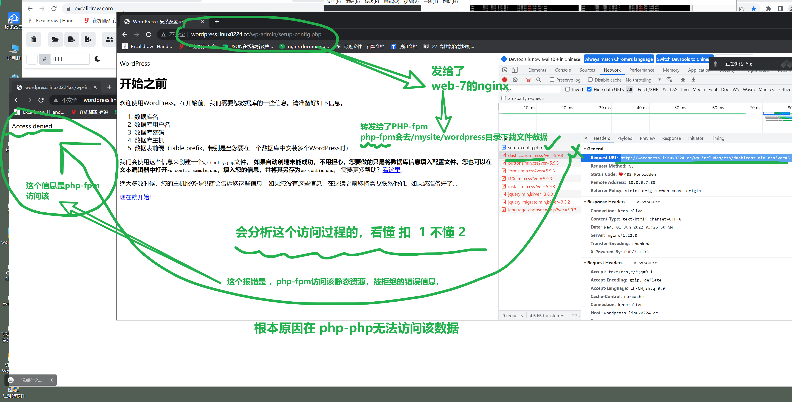

```### 此资源由 58学课资源站 收集整理 ###
	想要获取完整课件资料 请访问：58xueke.com
	百万资源 畅享学习

```
# 昨日内容回顾

1. wordpress负载均衡部署
2. 将这个http的部署，升级为https加密的部署


```
wordpress 这是一个成熟的 基于php开发后端的网站产品

运维给公司部署产品的，
就是将由编程语言写好的程序，在linux机器上运行起来
（是类似于wordpress这样一个完整的软件代码，解压缩后有大量的文件）
也甚至可能就是几个代码文件，hello.py文件


且最常见的形式，是以http形式运行 
（http 服务端的形式运行了，会在linux机器上绑定的一个端口，10.0.0.7:80）


client，也就是用户，可以去访问这个http的服务了。

这个理念能看懂 扣 1


下一步，具体，你在部署wordpress这样的企业级产品时，你该如何以正确的流程，去部署它呢？


```

## 部署好web7


当你有了一个web7之后，web8就是复制就完事。

然后最终加上一个lb-5，整个架构就完事了。

因此部署的顺序应该是


先有后端，再有前端的lb-5。


```
部署顺序是 

1.  web7

2.  复制 web8

3. 创建lb-5，改吧配置文件，请求发给这个web7  web8 就好了。


听懂扣 3，不懂 4

```


### 部署web7的全流程

纯手动从零部署，明确每一步的细节。


```
# 装nginx
groupadd www -g 666
useradd www -s /sbin/nologin -M -u 666 -g 666

# 你要确保，你装的所有机器，软件版本都一致，否则可能出奇怪bug
#web7 ，web8用同一套软件，你最好自己去自建yum源


cat > /etc/yum.repos.d/61.repo  <<EOF
[local-rpm]
name=local yum repo
baseurl=http://172.16.1.61:12345
enabled=1
gpgcheck=0
EOF

yum clean all 
yum install nginx -y

# 装php
# 卸载旧环境

yum remove php-mysql-5.4 php php-fpm php-common -y

yum install -y php71w-cli php71w-common php71w-devel php71w-embedded php71w-gd php71w-mcrypt php71w-mbstring php71w-pdo php71w-xml  php71w-fpm  php71w-mysqlnd  php71w-opcache php71w-pecl-memcached php71w-pecl-redis php71w-pecl-mongodb php71w-json php71w-pecl-apcu php71w-pecl-apcu-devel


修改php的配置文件
sed -i '/^user/c user = www' /etc/php-fpm.d/www.conf 
sed -i '/^group/c group = www' /etc/php-fpm.d/www.conf 

看一看，该配置中，默认以fastcgi协议运行的参数

这里就明确告诉你，后端这个应用服务器，php-fpm
是以 fastcgi协议运行在127.0.0.1:9000地址上。
这里看懂扣1，不懂2

 12 ; The address on which to accept FastCGI requests.
 13 ; Valid syntaxes are:
 14 ;   'ip.add.re.ss:port'    - to listen on a TCP socket to a specific IPv4 address on
 15 ;                            a specific port;
 16 ;   '[ip:6:addr:ess]:port' - to listen on a TCP socket to a specific IPv6 address on
 17 ;                            a specific port;
 18 ;   'port'                 - to listen on a TCP socket to all addresses
 19 ;                            (IPv6 and IPv4-mapped) on a specific port;
 20 ;   '/path/to/unix/socket' - to listen on a unix socket.
 21 ; Note: This value is mandatory.
 22 listen = 127.0.0.1:9000


查看，启动后端的应用服务器（php-fpm）
systemctl start php-fpm

确保后端应用服务器，运行起来了
[root@web-7 /etc/yum.repos.d]#netstat -tunlp|grep php
tcp        0      0 127.0.0.1:9000          0.0.0.0:*               LISTEN      5011/php-fpm: maste 


下一步，你可以做什么事了？

写php代码文件，看一看这个后端应用服务器，是否可以正常执行php源代码
这句话看懂扣1，不懂2
问题就在于，你如何把一个请求，发给这个fastcgi服务器（php-fpm）
比如你想访问一个机器上的 test-info.php代码文件

1.你先在机器上准备一个文件
/php-code/test-info.php

2.部署nginx服务器，去找这个资源
# 错误在于，你没有正确的，转发fastcgi可以认识的数据格式！！！
# 大坑在这里！！！！
# 因为你访问的请求是http://10.0.0.7/test-info.php
# 所有的信息都在http的请求头中
# 但是这堆数据，转发给了fastcgi_pass 127.0.0.1:9000;
# 但是数据走向是 client > http > nginx（fastcgi_params改写数据格式）  > (fastcgi php-pm)
# 

[root@web-7 /etc/nginx]## 看懂掌声
[root@web-7 /etc/nginx]#
[root@web-7 /etc/nginx]#
[root@web-7 /etc/nginx]#ls
conf.d  default.d  fastcgi_params  mime.types  modules  nginx.conf  scgi_params  uwsgi_params
[root@web-7 /etc/nginx]#
[root@web-7 /etc/nginx]#cat conf.d/php.conf 
server {
	listen 80;
	server_name _;
	location / {
		root /php-code/;
		# 请求转发给后端 
		fastcgi_pass 127.0.0.1:9000;
	    # 保留请求的url格式
		fastcgi_param SCRIPT_FILENAME $document_root$fastcgi_script_name;
		# 将http数据，转换为fastcgi协议
		include fastcgi_params;	
		
	}
}


3. 当你已http协议去访问这个源的时候
http://10.0.0.7:80/test-info.php
↓
到达nginx，找到test-info.php
↓
fastcg_pass 127.0.0.1:9000;  (php-fpm去读取，执行test-info.php)
↓
返回执行结果给nginx
↓
用户浏览器看到这个代码的结果

过滤进程，和端口
[root@web-7 /php-code]#
[root@web-7 /php-code]#netstat -tunlp|grep  -E '(nginx|php)'
tcp        0      0 127.0.0.1:9000          0.0.0.0:*               LISTEN      5011/php-fpm: maste 
tcp        0      0 0.0.0.0:80              0.0.0.0:*               LISTEN      5095/nginx: master  

[root@web-7 /php-code]#ps -ef|grep -E '(nginx|php)'
root       5011      1  0 09:48 ?        00:00:00 php-fpm: master process (/etc/php-fpm.conf)
www        5012   5011  0 09:48 ?        00:00:00 php-fpm: pool www
www        5013   5011  0 09:48 ?        00:00:00 php-fpm: pool www
www        5014   5011  0 09:48 ?        00:00:00 php-fpm: pool www
www        5015   5011  0 09:48 ?        00:00:00 php-fpm: pool www
www        5016   5011  0 09:48 ?        00:00:00 php-fpm: pool www
root       5095      1  0 09:55 ?        00:00:00 nginx: master process nginx
nginx      5096   5095  0 09:55 ?        00:00:00 nginx: worker process
root       5119   2054  0 09:57 pts/1    00:00:00 grep --color=auto -E (nginx|php)


注意授权
chown -R www.www /php-code/


```

### 确保最终访问php-info页面正常

nginx结合php的一个运行环境。


告一段落


休息片刻，待会，你现在，以及明确，知道，如何吧http的请求，转发，发给后端php-fpm了。


下一步，你只需要将这个测试代码，换为 wordpress源码就OK了，很简单了。

最难的协议转换部分，你已经懂了，。


### 准备开始部署wordpress了

```
1. 下载源码，放入指定目录

2. 修改nginx配置，找到wordpress代码

3. 就可以初始化安装wordpress了。

4.数据库要远程部署，
```

#### 部署web7的wordpress全流程

```
你要注意，以下知识点，是大坑，认真听。


1. 在部署wordpress的时候，你会设置nginx的访问入口，定义好域名，端口
这个域名，和端口，定义好后，就别动了，别随便修改，数据都写入到数据库里了

2. 基于web7部署好wordpress之后，数据就会写入到db-51
web8，就无须再初始化了，能自动读取db-51的数据，直接看到内容。。wordpress会自动提示你，已有数据，无须初始化

【数据写入到db-51，如果想修改网站的数据，你可以去修改db-51的wordpress库中的表数据，但是mysql没学，不和你聊这个】
【场景】
比如你部署好web7之后，出故障了，导致web8访问不了

你可以直接删除wordpress数据库，重新初始化即可
记住，删除数据库是等于进号子的操作，务必，理解了再操作。
这里的操作，完全是为了，重新初始化web7的讲解。
能看懂这里操作，扣3，不懂4

如下SQL
[root@db-51 ~]#mysql -uroot -plaoliu666 
Welcome to the MariaDB monitor.  Commands end with ; or \g.
Your MariaDB connection id is 7
Server version: 5.5.68-MariaDB MariaDB Server

Copyright (c) 2000, 2018, Oracle, MariaDB Corporation Ab and others.

Type 'help;' or '\h' for help. Type '\c' to clear the current input statement.

MariaDB [(none)]> show databases;
+--------------------+
| Database           |
+--------------------+
| information_schema |
| mysql              |
| performance_schema |
| test               |
| wordpress          |
+--------------------+
5 rows in set (0.00 sec)

MariaDB [(none)]> drop database wordpress;
Query OK, 0 rows affected (0.00 sec)

MariaDB [(none)]> show databases;
+--------------------+
| Database           |
+--------------------+
| information_schema |
| mysql              |
| performance_schema |
| test               |
+--------------------+
4 rows in set (0.00 sec)

MariaDB [(none)]> create database wordpress;
Query OK, 1 row affected (0.00 sec)

MariaDB [(none)]> show databases;
+--------------------+
| Database           |
+--------------------+
| information_schema |
| mysql              |
| performance_schema |
| test               |
| wordpress          |
+--------------------+
5 rows in set (0.00 sec)


我看刑。


这里听懂 3不懂 4

```


## 部署web8

同时，部署web7，web8，从零初始化安装wordpress


```
部署网站的理念，之前给大家说过，两种形式
web-7 wordpress  db-51数据库 也有数据 

新添加web8 ，将web7的配置，完全一致的，复制到web8上来，数据库都共用同一套db-51，即可看到数据一致的页面。。
（基于已有环境，去复制新环境，的部署方法，会玩扣 3，不懂 4）


1. 在已有成熟环境的情况下，做数据迁移，也就是web7 完全部署好了的情况


大家在做练习时候，反复的初始化机器

2. 从零开始初始化的情况，web7，web8，都是新机器，两个机器，从零部署。
（用在你基于ansible一键自动化部署，多台机器的，统一操作方式，让你理解ansible如何自动化部署多个网站产品的思路。你能会先手动部署这个环境）

```

### 部署web8的nginx+php环境

写脚本，需要逐步调试，坑可能比较多，因为毕竟自动化。。。

```
# 装nginx
groupadd www -g 666
useradd www -s /sbin/nologin -M -u 666 -g 666

# 讲道理，在你自建yum源之后，应该去除其他的第三方的yum源
# 只保留这一个61.repo文件。

cat > /etc/yum.repos.d/61.repo  <<EOF
[local-rpm]
name=local yum repo
baseurl=http://172.16.1.61:12345
enabled=1
gpgcheck=0
EOF

yum clean all 
yum install nginx -y
yum remove php-mysql-5.4 php php-fpm php-common -y

yum install -y php71w-cli php71w-common php71w-devel php71w-embedded php71w-gd php71w-mcrypt php71w-mbstring php71w-pdo php71w-xml  php71w-fpm  php71w-mysqlnd  php71w-opcache php71w-pecl-memcached php71w-pecl-redis php71w-pecl-mongodb php71w-json php71w-pecl-apcu php71w-pecl-apcu-devel


sed -i '/^user/c user = www' /etc/php-fpm.d/www.conf 
sed -i '/^group/c group = www' /etc/php-fpm.d/www.conf 

systemctl start php-fpm

#  脚本的逻辑性，先后关系
# 在配置文件之前，先创建好测试数据，然后再去启动，否则报错
# 保证如下配置，原始的内容，发过去即可
# 创建如下完整的配置信息，即可

cat >/etc/nginx/conf.d/php.conf <<EOF
server {
	listen 80;
	server_name _;
	location / {
		root /php-code/;
		# 请求转发给后端 
		fastcgi_pass 127.0.0.1:9000;
	    # 保留请求的url格式
		fastcgi_param SCRIPT_FILENAME $document_root$fastcgi_script_name;
		# 将http数据，转换为fastcgi协议
		include /etc/nginx/fastcgi_params;	
	}
}
EOF

# 创建好测试数据
mkdir -p /php-code/

chown -R www.www /php-code/

cat >/php-code/test-info.php <<EOF
web88888888888888
<?php
	phpinfo();
?>
EOF

# 最后去启动nginx，然后确保可以访问
# 理解扣 1，不懂2
nginx


```

写入脚本，一键安装，最终查看页面是否可以访问即可

```
[root@web-8 ~]#vim install-nginx-php.sh
[root@web-8 ~]#bash install-nginx-php.sh 

安装完毕后，你可以去测试访问了

```

### 裁了虚拟主机加载顺序的大坑


## 明确当前的进度

### 部署db-51


```
web7 

web8 
都已经提供好了  nginx+php的环境

下一步就是准备wordpress代码即可，修改nginx配置即可


你现在用了2个机器，因此数据库别分开，导致2份数据。。

带着大家，部署mariadb db-51机器，远程连接

目的是为了让2个产品的数据一致！！！！


清空旧的yum源
rm -f /etc/yum.repos.d/*.repo

cat > /etc/yum.repos.d/61.repo  <<EOF
[local-rpm]
name=local yum repo
baseurl=http://172.16.1.61:12345
enabled=1
gpgcheck=0
EOF

yum install mariadb-server mariadb -y

systemctl start mariadb

启动，修改密码，授予远程访问
[root@db-51 ~]#systemctl start mariadb
[root@db-51 ~]#
[root@db-51 ~]#
[root@db-51 ~]#mysqladmin -uroot -p password 'laoliu666'
Enter password: 


直接非交互式的创建一个用于远程连接的用户
[root@db-51 ~]#mysql -uroot -plaoliu666  -e "grant all privileges on *.* to laoliu@'%' identified by 'laoliu666'"


本地测试该用户是否可以用，指定机器的ip即可
mysql -ulaoliu -plaoliu666 -h10.0.0.51


到这里，部署db-51机器，看懂扣 6不懂7 

得用root创建

还得去创建一个数据库wordpress（初始化创建是空的目录，初始化安装wordpress之后，就会写入大量的数据）

[root@db-51 ~]#mysql -uroot -plaoliu666 -e "create database wordpress"


```


# --------------部署web7和web8的wordpress从这开始-----------

如下操作，web7 和web8都得有


````

1. 下载wordpress源码，然后请你用老师提供给你的源代码，你自己去下载，网站源码变了，功能变了，会导致你出现一堆你没见过的内容。回头你又蒙了。。。

创建目录
mkdir -p /mysite/wordpress
cd /mysite/wordpress

[root@web-7 /mysite/wordpress]#ls
wordpress-5.9.3-zh_CN.zip


解压缩源代码
明确，wordpress网站的代码，目录在 、/mysite/wordpress
[root@web-7 /mysite/wordpress]#
[root@web-7 /mysite/wordpress]#ls /mysite/wordpress/
index.php                  wp-admin              wp-includes        wp-signup.php
license.txt                wp-blog-header.php    wp-links-opml.php  wp-trackback.php
readme.html                wp-comments-post.php  wp-load.php        xmlrpc.php
wordpress                  wp-config-sample.php  wp-login.php
wordpress-5.9.3-zh_CN.zip  wp-content            wp-mail.php
wp-activate.php            wp-cron.php           wp-settings.php


到这里，看懂扣 1 不懂 2


2.修改nginx的配置文件，创建wordpress的虚拟主机
cat /etc/nginx/conf.d/wordpress.conf
server {

	listen 80;
	server_name wordpress.linux0224.cc;
	
	location / {
		root /mysite/wordpress/;
		fastcgi_pass 127.0.0.1:9000;
		fastcgi_index index.php;
		fastcgi_param SCRIPT_FILENAME $document_root$fastcgi_script_name;
		include /etc/nginx/fastcgi_params;	
	}
}


3. 可以启动nginx了
nginx

检查进程端口


4.去客户端测试访问了（）dns解析做好

注意，


````


---


---


## 测试访问，务必记住，用域名去访问，去安装（这个信息会写入mysql，这是wordpress的代码中指定的规则）


```
1. 明确你的windows可以正常解析

C:\Users\yu>ping wordpress.linux0224.cc

正在 Ping wordpress.linux0224.cc [10.0.0.7] 具有 32 字节的数据:
来自 10.0.0.7 的回复: 字节=32 时间<1ms TTL=64
来自 10.0.0.7 的回复: 字节=32 时间<1ms TTL=64


2. 确保你的浏览器可以访问该域名

```




## 大坑记录2

认真听超哥给你分析一波，。。扣6


```
1. 以.php后缀的请求，才给php-fpm去处理

php动态请求，发给php-fpm


此时，php的内容， 以及正确加载，看到内容，但是丢失了css网页的美化的页面


2. 除了.php结尾的请求，都发给nginx去处理，如css。js

所以你要修改nginx的配置文件


cat  /etc/nginx/conf.d/wordpress.conf 
server {

	listen 80;
	server_name wordpress.linux0224.cc;

	location / {
	root /mysite/wordpress/;
	index index.php index.html;
}
		
	location  ~* \.php$   {
		root /mysite/wordpress/;
		fastcgi_index index.php;
		fastcgi_pass 127.0.0.1:9000;
		fastcgi_param SCRIPT_FILENAME $document_root$fastcgi_script_name;
		include /etc/nginx/fastcgi_params;	
	}
}


nginx -s reload 

再次刷新，查看请求

听懂掌声

```


### 下一步可以安装了

```
10.0.0.7  wordpress.linux0224.cc

```


```
生成了数据库信息文件 wp-config.php

[root@web-7 /mysite/wordpress]#ls /mysite/wordpress/wp-config.php
/mysite/wordpress/wp-config.php

发给web8

[root@web-7 /mysite/wordpress]#scp /mysite/wordpress/wp-config.php  root@172.16.1.8:/mysite/wordpress/
The authenticity of host '172.16.1.8 (172.16.1.8)' can't be established.
ECDSA key fingerprint is SHA256:Csqwr63+SZRFFOug/IGoFTgRe8hDSI/QalSMBcC6IaU.
ECDSA key fingerprint is MD5:4c:9a:37:e2:5b:b5:de:a8:bf:90:b5:28:d8:5b:ac:60.
Are you sure you want to continue connecting (yes/no)? yes
Warning: Permanently added '172.16.1.8' (ECDSA) to the list of known hosts.
root@172.16.1.8's password: 
wp-config.php    


安装wordpress的账户密码

yuchao01
chaoge666

```


### 到这里，web7以及把wordpress装好了，修改dns为web8，确保可以正常访问

才是一切OK的

```

# 10.0.0.7  wordpress.linux0224.cc


10.0.0.8  wordpress.linux0224.cc


```

### 测试访问web8


```
杨松麟
这次不用改wordpress连接数据库的代码了吗？ 

不用做任何修改

因为web7 和web8 ，读取的是同一套配置

wp-config.php


都是去读取的 db-51   172.16.1.51   laoliu  laoliu666 账户密码

读取的库，是wordpress 库。


```


# 部署lb-5负载均衡

```
1. web7 web8可以放着不管了


2. 部署lb-5机器（使用nginx的七层负载均衡）
部署nginx，设置nginx


rm -f /etc/yum.repos.d/*.repo

cat > /etc/yum.repos.d/61.repo  <<EOF
[local-rpm]
name=local yum repo
baseurl=http://172.16.1.61:12345
enabled=1
gpgcheck=0
EOF

yum clean all 
yum install nginx -y


3.设置nginx负载均衡的规则
提供 80端口，以及域名

# lb-5机器，是基于http转发请求的，规则，和参数，不一样了！！

# 限定义 基于http协议的一组服务器，以及负载均衡的规则。
upstream my-web {
    server  172.16.1.7:80 weight=4 ;
    server  172.16.1.8:80 weight=1 ; 
}


# nginx这里，基于http协议转发请求，且注意保留客户端的请求http信息
server {
    listen 80;
    server_name wordpress.linux0224.cc;
   
   # 这里不需要判断url了，直接所有请求，全部甩给后端即可
   # 后端的nginx在等待着用户的请求url格式，然后去解析
   # 因此这里直接甩如下配置即可
   location / {
   
   			proxy_pass http://my-web/;
   			include /etc/nginx/proxy_params;
 
   }
   
}


# 4.创建代理参数文件
proxy_set_header Host $http_host;
proxy_set_header X-Forwarded-For $proxy_add_x_forwarded_for;
proxy_connect_timeout 30;
proxy_send_timeout 60;
proxy_read_timeout 60;
proxy_buffering on;
proxy_buffer_size 32k;
proxy_buffers 4 128k;


# 5.启动nginx
[root@lb-5 /etc/nginx/conf.d]#nginx 
[root@lb-5 /etc/nginx/conf.d]#
[root@lb-5 /etc/nginx/conf.d]#
[root@lb-5 /etc/nginx/conf.d]#ps -ef|grep nginx
root       1990      1  0 12:44 ?        00:00:00 nginx: master process nginx
nginx      1991   1990  0 12:44 ?        00:00:00 nginx: worker process


6.测试饭


```

## 测试访问是否正常

```
做好dns解析
10.0.0.5 wordpress.linux0224.cc

确保你的cmd 中，windows解析正确。
[C:\~]$ 
[C:\~]$ ping wordpress.linux0224.cc

正在 Ping wordpress.linux0224.cc [10.0.0.5] 具有 32 字节的数据:
来自 10.0.0.5 的回复: 字节=32 时间<1ms TTL=64
来自 10.0.0.5 的回复: 字节=32 时间<1ms TTL=64
来自 10.0.0.5 的回复: 字节=32 时间<1ms TTL=64


到这里，lb-5机器的部署操作，和客户端操作，都完全看懂 扣 1，不懂 2


```

### 通过日志去检测，请求是否正常，以及负载均衡的规则


### 常见负载均衡故障

```
1.  入口的slb挂了（因此你必须学习，高可用性负载均衡）
[root@lb-5 /etc/nginx/conf.d]## 会发生什么？
[root@lb-5 /etc/nginx/conf.d]## 入口挂了。
[root@lb-5 /etc/nginx/conf.d]#
[root@lb-5 /etc/nginx/conf.d]##请求直接就拒绝了，和网站就无法通信了。


2.  后端节点挂了（后端的nginx代理挂了）
[root@lb-5 /etc/nginx/conf.d]## 分析一波，nginx请求会发给Upstream地址池的节点
[root@lb-5 /etc/nginx/conf.d]## 如果某个节点不通了，会被剔除
[root@lb-5 /etc/nginx/conf.d]## 模拟的是172.16.1.7:80
[root@lb-5 /etc/nginx/conf.d]#
[root@lb-5 /etc/nginx/conf.d]## 模拟的是172.16.1.7:80 80端口挂了，节点挂了，被剔除，请求全部走 另外的节点，完全懂了 ，扣 1，不懂2
[root@lb-5 /etc/nginx/conf.d]#
[root@lb-5 /etc/nginx/conf.d]#
[root@lb-5 /etc/nginx/conf.d]#
[root@lb-5 /etc/nginx/conf.d]## 不会有英雄
[root@lb-5 /etc/nginx/conf.d]## 不会有影响
[root@lb-5 /etc/nginx/conf.d]#
[root@lb-5 /etc/nginx/conf.d]## 如何判断是否有故障，看日志，是否记录，

# 不通
curl 172.16.1.7:80
curl: (7) Failed connect to 172.16.1.7:80; Connection refused


这个故障，，以及修复方式。（修复的是upstrem中定义的后端节点地址。。）
确保172.16.1.7:80 这个地址又通了。。

修复，确保通
修复好web7的nginx后，负载均衡又恢复了  4 1 比率。完全看懂扣  6不懂7  


3.  后端的应用服务器挂了。。。（php-fpm挂了，怎么办，错误类型是什么）
模拟web8的后端故障
[root@web-8 ~]#pkill -9 php-fpm


4.最后总结，在线上维护网站架构，要搞清楚，什么节点，挂了，请求如何通信
这个web8机器的 php-fpm挂了。
最终的 访问过程，心中完全清晰的，听懂掌声。


```


回答

```
陈亮亮
1次502，四次正常页面 


2112130009李文杰
四次访问能通，1次502 


郑佳强
四次正常访问 1次 502 


刘永飞
4此访问7日志正常，第五次8日志标有502 


```


## 问题回答


```
王仁刚
后端服务器用80端口  可是2个网站怎么区分呢 
（回答，基于多域名的虚拟主机匹配即可，都可以是80端口）

cd /etc/nginx/conf.d/

touch wordpress.conf

touch  wecenter.conf

能理解吗文杰，不要去琢磨灵异事件，跟着超哥的教学来。。

就是一个基于多域名的虚拟主机么。。。


======================================================

于超


后端服务器，如果80端口被别人占用怎么办？


```


# 今日作业

详细，透彻的，讲解了 nginx负载均衡的部署，通信流程，踩坑。等等。


```
【今天必须完成】 今天讲完了，你必然得会了。

1. 再次完成，wordpress，wecenter的负载均衡部署操作，且录制视频讲解，部署流程、访问流程，自己要会部，也要会说。

【录制视频，讲你的虚拟机通信架构环境。】
基于机器，lb-5  ，web7，web8  ，db51，nfs-31 ，完成负责的部署。

----------------------------------------------------------------------
【可选】
2. 完成的较快的同学，预习HTTPS的博客，给wordpress加上https访问，试试可以搞定吗。（自建的HTTPS证书）

------------------------------------------------------------


3. 抓紧把阿里云的域名进行备案，确保可以解析，上课练习会用到，作业也会用到。 
------------------------------------------------------------
```


# 问题

```
ㅤㅤ代
超哥，问个问题。为什么wecenter 使用轮询，两台机器都刷新日志  而使用wordpress使用轮询就不会有这样的情况 


【这个不是问题，是正常的日志】

是因为没自习去看这个日志提示了什么，
以后你自己去分析，到底是故障，是正确的请求，你得分析日志，的每一个字段


```


开心吗老铁们，有收获吗，

今天就到这。。干饭吧朋友吗。88


