```### 此资源由 58学课资源站 收集整理 ###
	想要获取完整课件资料 请访问：58xueke.com
	百万资源 畅享学习

```


# 知识点回顾


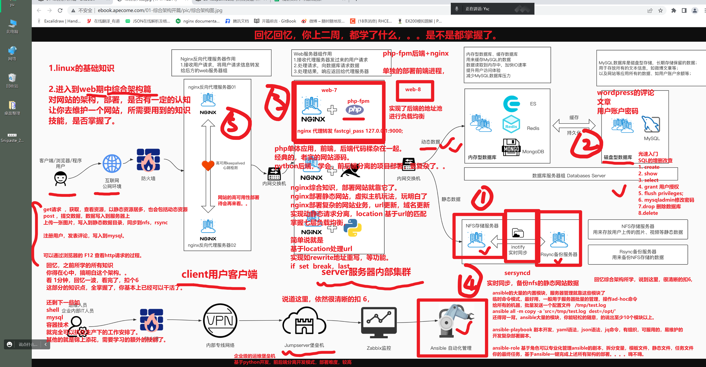


# 为什么需要keepalived（保持存活）


# keepalived实现高可用的工作原理

```
需要用到如下组件知识

1.  准备一个集群，为了实现高可用，如nginx负载均衡的2个机器，确保用户的请求，能正确，高可用性的到达这个nginx集群

2. 部署keepalived，生成VIP，虚拟IP资源。


3. keepalived是将 一组服务器，组成一个虚拟设备组，实现他们之间的心跳通信（可以通过抓包，查看他们的通信协议，其实是VRRP虚拟路由冗余协议。）
```


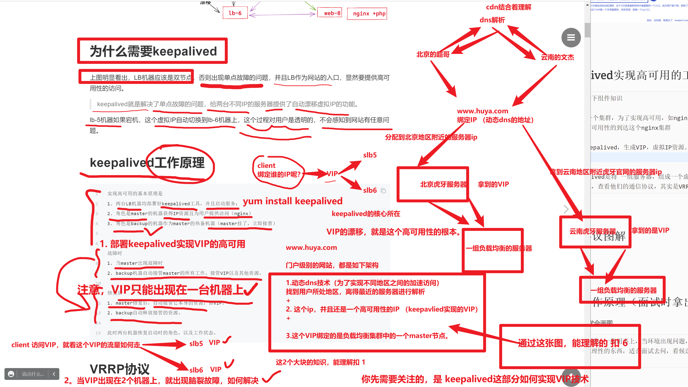


网络协议的通信原理过程。


# vrrp协议图解

```
虚拟，路由， 冗余，协议  ，vrrp

在同一组虚拟网络设备中，master可以和backup互相通信，知道对方的存活。

vip的漂移条件是，
心跳机制。
当backup收不到master发来的心跳数据包之后，就确认master挂掉了


```


# vrrp工作原理（面试时拿出来背即可）

其实就是，理解keepalvied设置的master机器，和backup机器，如何知道对方存活，然后决定VIP交给谁的原理过程，。


如何记忆，学会画图。

```
1.原理性的东西，一般用不上，当环境出现问题，你就得从原理流程，一步步去捋清楚；


2.其二就是原理性的东西，适合面试去问，看候选人是否对这个技术有更多的认识。


```

````
1. keppalived高可用是基于VRRP虚拟路由冗余协议实现的，因此我从VRRP给您描述起
2. VRRP也就是虚拟路由冗余协议，是为了解决静态路由的单点故障；
3. VRRP通过竞选协议将路由任务交给某一台VRRP路由器。
4. VRRP正常工作时，master会自动发送数据包，backup接收数据包，目的是为了判断对方是否存活；如果backup收不到master的数据包了，自动接管master的资源；
backup节点可以有多个，通过优先级竞选，但是keepalived服务器一般都是成对出现；
5. VRRP默认对数据包进行了加密，但是官网默认还是推荐使用明文来配置认证；

说完了VRRP，我再给您描述下keepalived工作原理。
1.keepalived就是基于VRRP协议实现的高可用，master的优先级必须高于backup，因此启动时master优先获得机器的IP资源，backup处于等待状态；若master挂掉后，backup顶替上来，继续提供服务。
2.在keepalived工作时，master角色的机器会一直发送VRRP广播数据包，告诉其他backup机器，“我还活着”，此时backup不会抢夺资源，老实呆着。
当master出现问题挂了，导致backup收不到master发来的广播数据包，因此开始接替VIP，保证业务的不中断运行，整个过程小于1秒。

通过画图自己去理解，以及抓包工具去理解，面试时候拿出来背诵就可。


````

## 通过抓包工具，查看lb5和lb6的vrrp数据包的通信（心跳数据包的发送）

```
抓取 10.0.0.0/24网段内的数据包
抓取vmnet8

发现 lb5机器， 10.0.0.5 一直
```


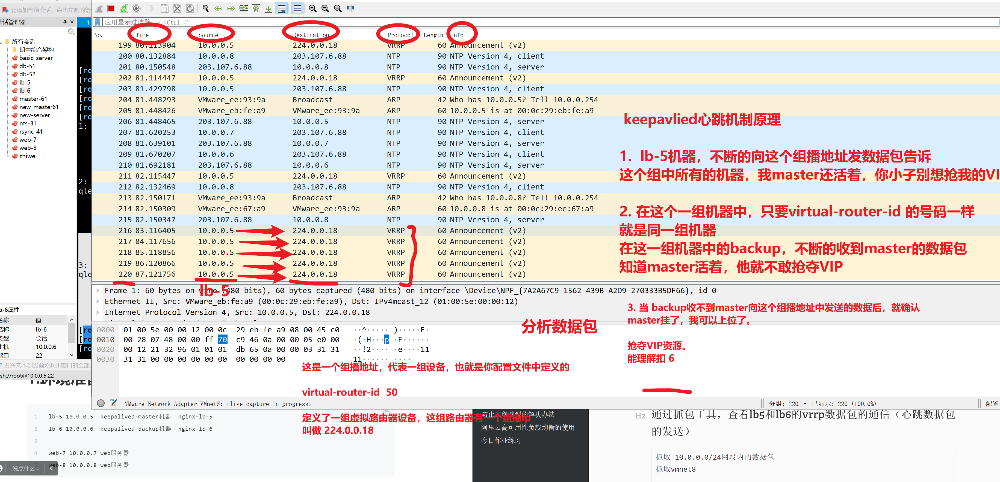

查看数据包

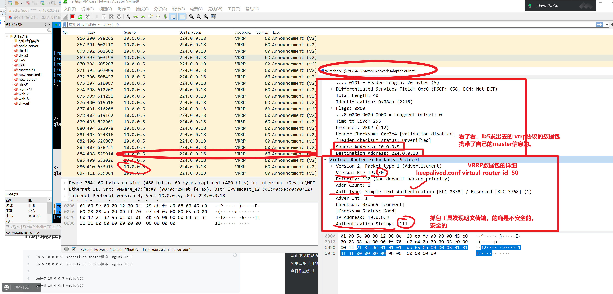

模拟master挂掉，查看数据包

目前，master会不断的向这个组播地址，发心跳数据包，。


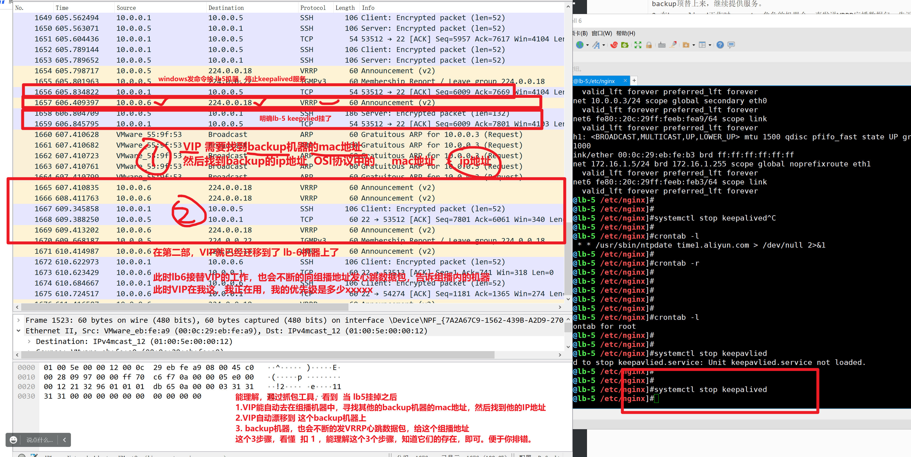

查看数据包

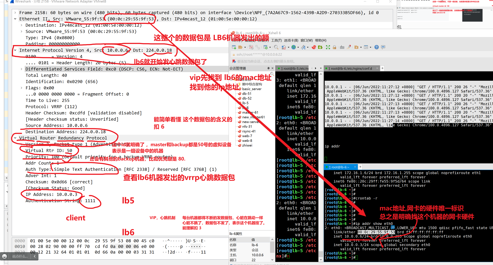


### 恢复master机器，查看这个心跳数据包的走向。


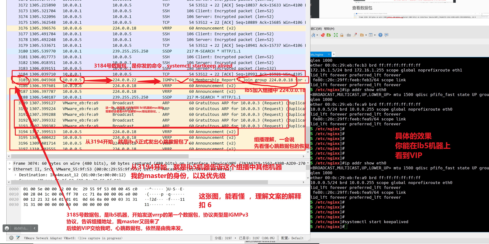

这是抓取数据包，查看VRRP心跳数据包的漂移过程，恢复过程，以及发送过程。


### 什么是组播呢？

````
你会发现keepalived的master机器，或者backup机器 
都不断的会向 组播地址发心跳数据包。

````

### 单播、广播、组播的简单理解。

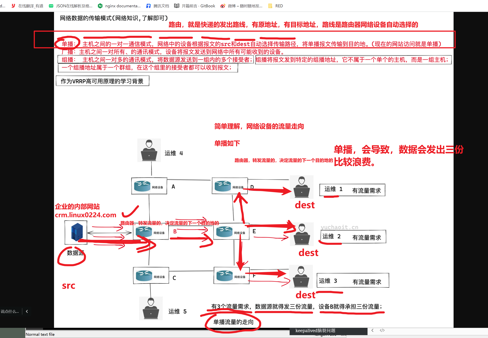


广播的流量走向。

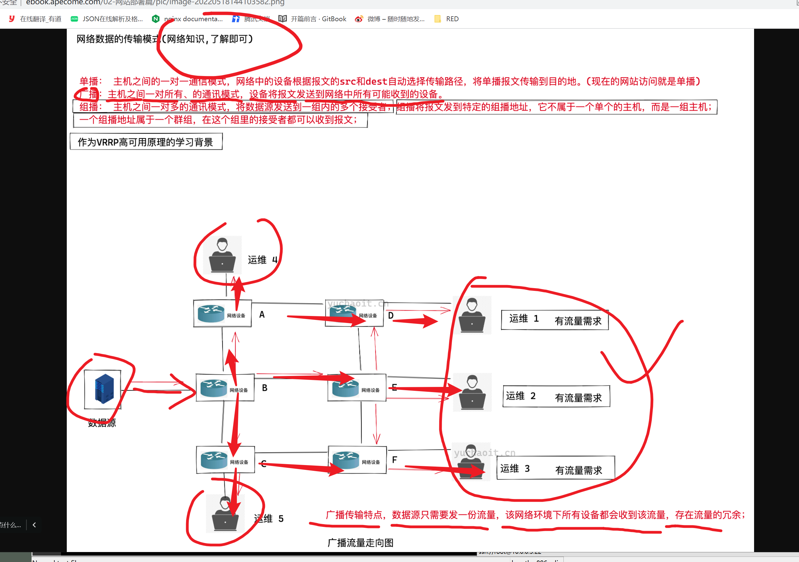

组播

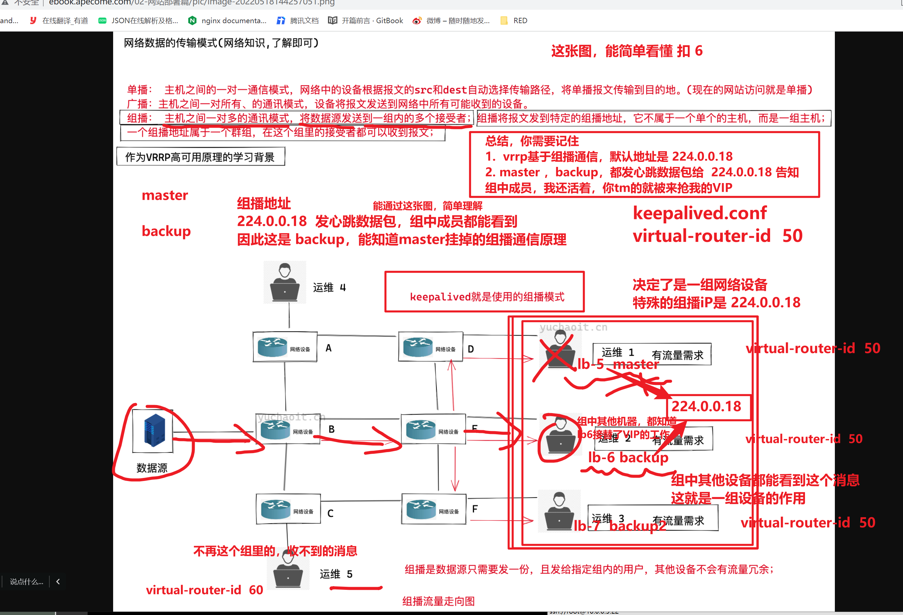


为了让大家，简单理解，组播（224.0.0.18）的含义。

理解数据包为什么这样走，以及一组服务器的概念。

master  >  224.0.0.18

backup >  224.0.0.18


---------------------------------------------------------------------------------------------------------------------------------------------


# keepalived环境准备（实践部署）

```
讲解了为什么网站架构，需要去部署keepalived，为了防止负载均衡的入口，成为单点，太危险。

VIP 实现在slb5和slb6之间实现漂移，使得，这个VIP是一个高可用性IP地址。

先去把keepalived环境部署好，然后再学其中原理，看看他是如何实现的VIP漂移。


```


先把环境部署好，查看高可用性集群的实际效果，然后再去学原理，理解其中过程，更容易接收。

```

lb-5 10.0.0.5  keepalived-master机器  nginx-lb-5

lb-6 10.0.0.6  keepalived-backup机器  nginx-lb-6

web-7 10.0.0.7 web服务器

web-8 10.0.0.8 web服务器


```

## 1，先部署web机器组（web7、web8）

```
简单部署，让web7，web8分别提供一个不同的静态页面，能看出负载均衡的效果即可。

1. 安装nginx
yum install nginx -y


2. 部署nginx，提供静态页面的虚拟主机就OK


3.创建测试数据
echo 'web7 ~~~~~~~~~~~~~~'   > /usr/share/nginx/html/index.html

echo 'web8 ===================='   > /usr/share/nginx/html/index.html

4.启动2个web机器
nginx

5.本地测试，检查nginx
[root@web-7 ~]#ps -ef|grep nginx
root       2172      1  0 10:40 ?        00:00:00 nginx: master process nginx
nginx      2173   2172  0 10:40 ?        00:00:00 nginx: worker process
root       2175   2054  0 10:40 pts/1    00:00:00 grep --color=auto nginx
[root@web-7 ~]#
[root@web-7 ~]#
[root@web-7 ~]#
[root@web-7 ~]#netstat -tnlp|grep nginx
tcp        0      0 0.0.0.0:80              0.0.0.0:*               LISTEN      2172/nginx: master  
tcp6       0      0 :::80                   :::*                    LISTEN      2172/nginx: master  
[root@web-7 ~]#
[root@web-7 ~]#
[root@web-7 ~]#
[root@web-7 ~]#
[root@web-7 ~]#
[root@web-7 ~]#curl 127.0.0.1
web7 ~~~~~~~~~~~~~~


到这里的步骤，完全理解扣 6


```

## 2.部署负载均衡设备（lb5，lb6）

```
1. 安装nginx，使用它的负载均衡功能

yum install nginx -y

2. 创建负载均衡地址池

upstream web_pools {
        server 10.0.0.7;
        server 10.0.0.8;
}
server {
listen 80;
server_name _;
location / {

        proxy_pass http://web_pools;
        include proxy_params;
}

}


代理参数的配置
[root@lb-6 /etc/nginx/conf.d]#cat /etc/nginx/proxy_params 
proxy_set_header Host $http_host;
proxy_set_header X-Forwarded-For $proxy_add_x_forwarded_for;
proxy_connect_timeout 30;
proxy_send_timeout 60;
proxy_read_timeout 60;
proxy_buffering on;
proxy_buffer_size 32k;
proxy_buffers 4 128k;


3.启动nginx，查看负载均衡的效果
[root@lb-5 /etc/nginx]#curl 127.0.0.1
web7 ~~~~~~~~~~~~~~
[root@lb-5 /etc/nginx]#curl 127.0.0.1
web8 ====================
[root@lb-5 /etc/nginx]#curl 127.0.0.1
web7 ~~~~~~~~~~~~~~
[root@lb-5 /etc/nginx]#curl 127.0.0.1
web8 ====================
[root@lb-5 /etc/nginx]#curl 127.0.0.1
web7 ~~~~~~~~~~~~~~
[root@lb-5 /etc/nginx]#curl 127.0.0.1
web8 ====================
[root@lb-5 /etc/nginx]#curl 127.0.0.1
web7 ~~~~~~~~~~~~~~

到这里，就明确配置好了  slb5 和slb6，都可以正确的进行负载均衡

到这完全看明白， 扣6.


```

## 3.部署两台lb设备，需要支持高可用了。（keepavlied技术）


```

要注意设置 master和 backup的角色，具体为什么，待会学vrrp原理，抓包去看过程即可。


这里得细心了，注意看配置文件。，默认基于epel源即可安装。

yum install keepalived -y


1.  部署slb5的keepalived（master角色，优先获取VIP资源，当master挂掉不可用，然后才轮到backup上场。）
注意，中文注释，别写入到配置文件中


global_defs {
    router_id lb-5 # 路由器ID，每个机器不一样
}

vrrp_instance VIP_1 {       # 设置VRRP路由器组组名，属于同一组的名字一样
    state MASTER            # 角色，master、backup两种            
    interface eth0          # VIP绑定的网卡         
    virtual_router_id 50    # 虚拟路由IP，同一组的一样    
    priority 150            # 优先级，优先级越高，权重越高
    advert_int 1            # 发送组播间隔1s
    authentication {        # 认证形式
        auth_type PASS      # 密码认证，明文密码 1111
        auth_pass 1111
    }
    virtual_ipaddress {
        10.0.0.3            # 指定虚拟VIP地址，必须没人使用
    }
}


# lb5机器的配置文件

global_defs {
    router_id lb-5
}

vrrp_instance VIP_1 {
    state MASTER        
    interface eth0      
    virtual_router_id 50    
    priority 150
    advert_int 1
    authentication {
        auth_type PASS
        auth_pass 1111
    }
    virtual_ipaddress {
        10.0.0.3
    }
}

# 简单能理解，keepalived的配置文件，需要设置哪些参数的，扣6，
# 总结一波，如下设置，理解这个参数，是方便你如果出错，可以去拍错，检查这些参数即可。

# 
 router_id 在这个虚拟路由器组中的都不一样
 state 只有一个master，可以有多个backup
 interface 指定当前负载均衡机器的 通信的网卡即可，。
 virtual_router_id  注意，每个机器，都一样，表示是一组内的设备
 priority 优先级，master需要高于backup
 authentication  一组设备中的master和backup的通信认证，是明文形式的 1111
 这个信息，可以通过抓包看到。
 
 virtual_ipaddress  指定VIP的ip地址，需要在局域网内，无人使用。。
 
 
 
 
 
 
 
 
# lb6机器的配置文件，注意如下部分参数，要和lb5机器区分开即可。

global_defs {
    router_id lb-6
}

vrrp_instance VIP_1 {
    state BACKUP
    interface eth0
    virtual_router_id 50
    priority 100
    advert_int 1
    authentication {
        auth_type PASS
        auth_pass 1111
    }
    virtual_ipaddress {
        10.0.0.3/24
    }
}


更精确的ip范围，让VIP和eth0两个机器的本身的网卡，地址，在一起，确保子网掩码也一样即可。

```

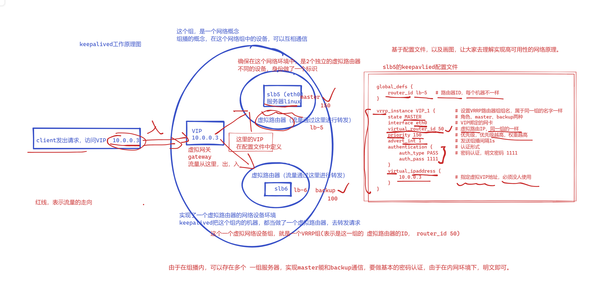


--

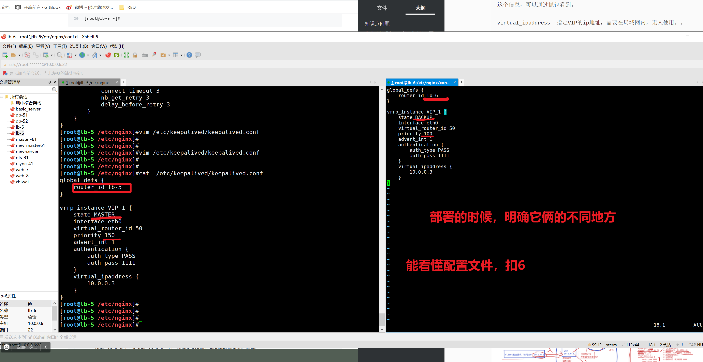


## 4.分别启动两台机器的keepalived，查看VIP是否生成

```
systemctl start keepalived


检查VIP地址的信息

```


## 5.绑定客户端的VIP，访问查看效果，查看日志

```
10.0.0.3  www.linux0224.cc

去检测lb机器的日志即可。

```

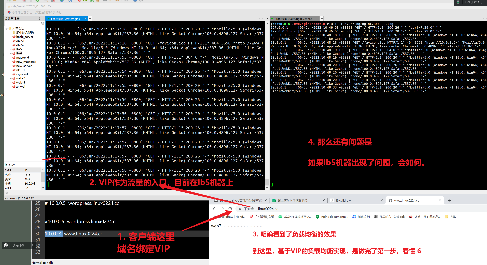


## 6.当lb5机器出了问题（模拟keepalived出现故障）

```
停止lb5机器的keepalived
1.查看VIP漂移情况
2. 查看客户端访问是否受影响。
3. 注意日志的检测


[root@lb-5 /etc/nginx]#systemctl stop keepalived

继续访问客户端
```

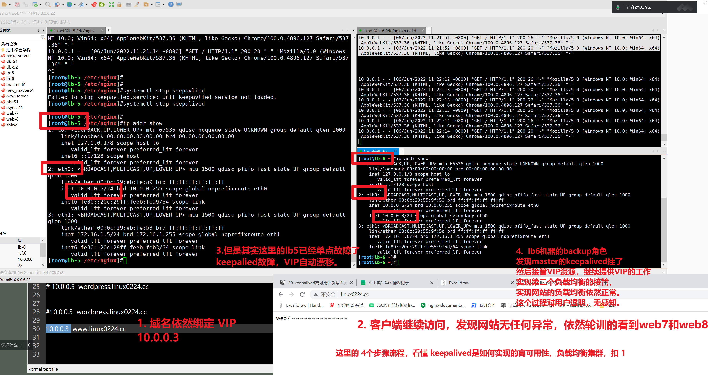


## 7.恢复master，查看VIP的漂移。


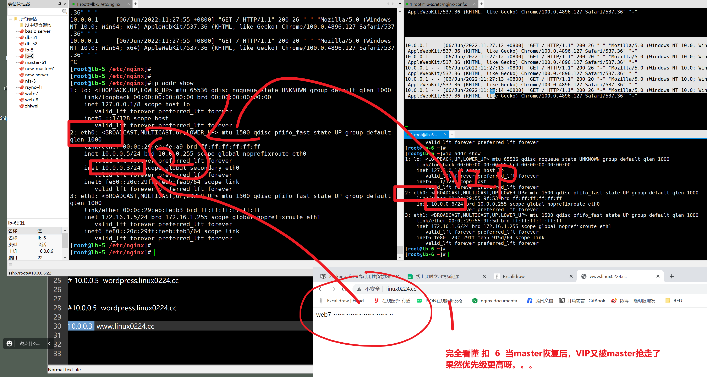


## 8.小结

```
vip 一会在master上 lb-5
当master挂了，漂移搭配lb-6上

backup的lb6是如何知道master挂掉的，聊一聊，vrrp通信协议。 


```


到这里，基本的，基于keepalived实现nginx的高可用性负载均衡以及搞定，实现了VIP的漂移

```
1. VIP底层原理是如何漂移的，backup机器，是如何发现master挂掉的？

2. 如果说，master机器恢复了keepalived会自动恢复VIP的接管，又是为什么会这样？

3. 以及如果master的nginx挂了，而keepalived没挂，会如何？。，。

4. 如何解决这些问题。。


```


## 上午所学复习


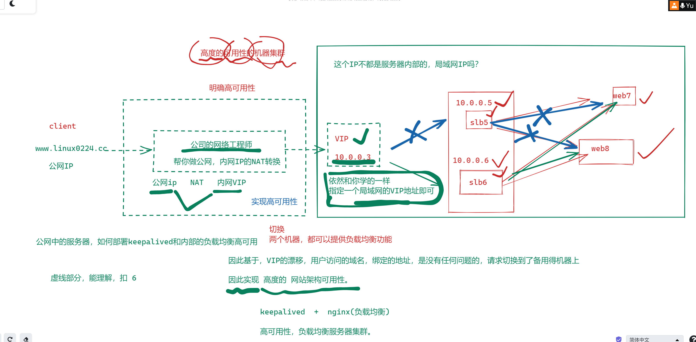


# keepalived脑裂问题


```
keepalived是一个实现高可用的软件

基于VIP的漂移，使得对外提供访问的ip，可以漂移到不同的机器上，以此实现高可用性。

```


## 1.脑裂原因


## 2.如何解决脑裂


# vrrp通过组播确保心跳机制

```
1.通过单播、广播、组播，理解vrrp协议中的master、backup机器如何确保对方存活。

2. 组播是一个特殊ip地址，通过wirashark可以抓包看到

3. 也可以通过linux的tcpdump命令抓包，一个意思。

```


# 1.主动模拟脑裂故障（在backup机器出现故障）

1.backup收不到master的数据包，导致抢夺VIP

2.导致后续的master如果故障，backup也无法正确的接替VIP去工作，流量是切不过去的。


```
1. 提供好keepalived高可用性环境，
默认应该是master发心跳数据包，backup可以收到这个数据包
具象化表现是，，VIP只有在slb5， slb6没有。

# 去组播地址中的设备，去监听组播流量情况
# 只能在lb5 和lb6机器查看
# 为何windows可以抓取到这个组播的数据，是抓取vmnet8的原因，这些网卡流量进过了vmnet8的NAT转换，，了解即可。。

yum install tcpdump -y

# 抓取这个组播地址的数据包情况
# -nn 就是不做主机名解析，直接显示ip   -i  any 指定任何的网络接口   host 指定组播地址
# 去lb5或者lb6机器抓数据包

tcpdump -nn -i any host 224.0.0.18


2. 演示故障，将backup机器打开防火墙
systemctl restart firewalld


3.通过抓取数据包，发现，两台机器都在发心跳数据包，出现脑裂情况。


4.你此时，即使去停止lb5的keepalived也无法正确实现VIP的漂移，让lb6继续提供 负载均衡的工作了。

5.如何恢复，
一是，立即去恢复lb5机器，让网站继续提供访问，然后修复lb6机器，找出导致脑裂故障的原因。解决。

停止lb6的防火墙，确保master和backup通信后，高可用性恢复了，查看VIP是否正确的漂移即可。


6.发现此时，VIP正确的漂移了。 
高可用性负载均衡集群恢复了。
到这里看懂扣 1


7.但是，你不能一直这么手动解决脑裂的故障吧。。得通过自动化的脚本，一旦判断脑裂出了问题，自动进行处理。。


```


# 防止出现脑裂的解决办法

基于shell脚本去维护。


```
问题1，故障出在了backup机器，抢夺了VIP

# 脚本如下

#!/bin/bash
MASTER_VIP=$(ssh 10.0.0.5 ip a|grep 10.0.0.3|wc -l)
MY_VIP=$(ip a|grep 10.0.0.3|wc -l)

# 如果远程有VIP并且自己本地也存在了VIP，就干掉自己
if [ ${MASTER_VIP} == 1 -a ${MY_VIP} == 1 ]
then
   systemctl stop keepalived
fi


问题2，master可能故障（nginx故障，导致vip无意义）


```

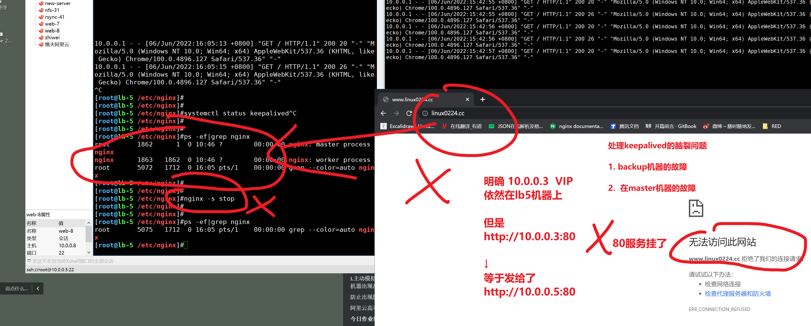


## 故障1，backup抢夺VIP


看明白注释，脚本的含义扣 3，不懂 4

脚本可以先复制粘贴，后续学完shell的语法，你再详细琢磨。


```
[root@lb-6 /etc/nginx/conf.d]#cd /etc/keepalived/
[root@lb-6 /etc/keepalived]#ls
check_vip.sh  keepalived.conf


# 1.在backup机器，设置好监控脚本
[root@lb-6 /etc/keepalived]#
[root@lb-6 /etc/keepalived]#cat check_vip.sh 
#!/bin/bash
MASTER_VIP=$(ssh 10.0.0.5 ip a|grep 10.0.0.3|wc -l)
MY_VIP=$(ip a|grep 10.0.0.3|wc -l)

# 如果远程有VIP并且自己本地也存在了VIP，就干掉自己
if [ ${MASTER_VIP} == 1 -a ${MY_VIP} == 1 ]
then
   systemctl stop keepalived
fi


#  2. 让keepalived去检测使用这个脚本，修改配置文件如下
【前提矫健是，lb5和lb6机器可以免密登录，才可以远程执行命令，以及给脚本添加可执行权限】


global_defs {
    router_id lb-6
}

# 定义脚本
vrrp_script check_vip {
    script "/etc/keepalived/check_vip.sh"
    interval 5 # 脚本执行的时间间隔
}

vrrp_instance VIP_1 {
    state BACKUP 
    interface eth0
    virtual_router_id 50
    priority 100
    advert_int 1
    authentication {
        auth_type PASS
        auth_pass 1111
    }
    virtual_ipaddress {
        10.0.0.3
    }
    # 调动脚本
    track_script {
        check_vip
    }
}


务必别忘记重启keepalived
# 加载脚本的功能
systemctl restart keepalived 

```

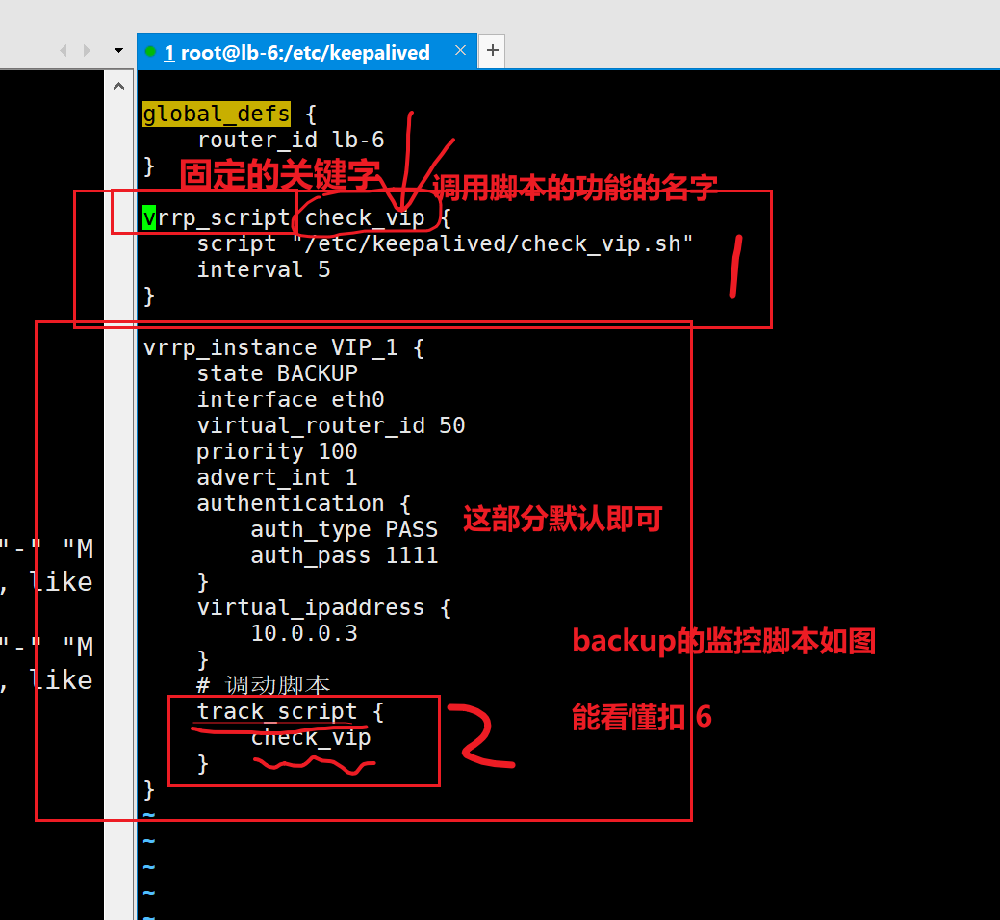

---


```
# 注意，做好免密登录，以及脚本权限
# 这里手残，写错了。给配置文件设置执行权限了。。。

[root@lb-6 /etc/keepalived]#chmod +x check_vip.sh
[root@lb-6 /etc/keepalived]#
[root@lb-6 /etc/keepalived]#
[root@lb-6 /etc/keepalived]#
[root@lb-6 /etc/keepalived]#ssh-copy-id root@10.0.0.5


确保可以正确重启keepavlied
[root@lb-6 /etc/keepalived]#systemctl restart keepalived
[root@lb-6 /etc/keepalived]#
[root@lb-6 /etc/keepalived]#
[root@lb-6 /etc/keepalived]#systemctl status keepalived
● keepalived.service - LVS and VRRP High Availability Monitor
   Loaded: loaded (/usr/lib/systemd/system/keepalived.service; disabled; vendor preset: disabled)
   Active: active (running) since Mon 2022-06-06 16:28:13 CST; 6s ago
  Process: 15616 ExecStart=/usr/sbin/keepalived $KEEPALIVED_OPTIONS (code=exited, status=0/SUCCESS)
 Main PID: 15617 (keepalived)
   CGroup: /system.slice/keepalived.service
           ├─15617 /usr/sbin/keepalived -D
           ├─15618 /usr/sbin/keepalived -D
           └─15619 /usr/sbin/keepalived -D

Jun 06 16:28:13 lb-6 Keepalived_vrrp[15619]: WARNING - default user 'keepalived_script' for script execution does not exist - please create.
Jun 06 16:28:13 lb-6 Keepalived_vrrp[15619]: SECURITY VIOLATION - scripts are being executed but script_security not enabled.
Jun 06 16:28:13 lb-6 Keepalived_vrrp[15619]: VRRP_Instance(VIP_1) removing protocol VIPs.
Jun 06 16:28:13 lb-6 Keepalived_vrrp[15619]: Using LinkWatch kernel netlink reflector...
Jun 06 16:28:13 lb-6 Keepalived_vrrp[15619]: VRRP_Instance(VIP_1) Entering BACKUP STATE
Jun 06 16:28:13 lb-6 Keepalived_vrrp[15619]: VRRP sockpool: [ifindex(2), proto(112), unicast(0), fd(10,11)]
Jun 06 16:28:14 lb-6 Keepalived_healthcheckers[15618]: Opening file '/etc/keepalived/keepalived.conf'.
Jun 06 16:28:14 lb-6 Keepalived_vrrp[15619]: VRRP_Instance(VIP_1) Now in FAULT state
Jun 06 16:28:14 lb-6 Keepalived_vrrp[15619]: VRRP_Script(check_vip) succeeded
Jun 06 16:28:15 lb-6 Keepalived_vrrp[15619]: VRRP_Instance(VIP_1) Entering BACKUP STATE


```

### 演示脚本的自愈过程（backup机器)

```

1. 当lb6机器，也出现了VIP，keepalived会调用我们写的脚本，干掉自己
到这里能理解扣 3，不懂 4
干掉自己之后，应该给运维，发送邮件等，告知backup机器出问题了，出现了脑裂问题。


2. 首先，去手动，让backup机器，抢夺VIP资源，如开启防火墙服务

systemctl restart firewalld

3. 等待，查看backup机器的是否会干掉自己的keepalived以及检查VIP


4.手动处理，导致脑裂的故障后，恢复backup的备用keepalived即可。


```

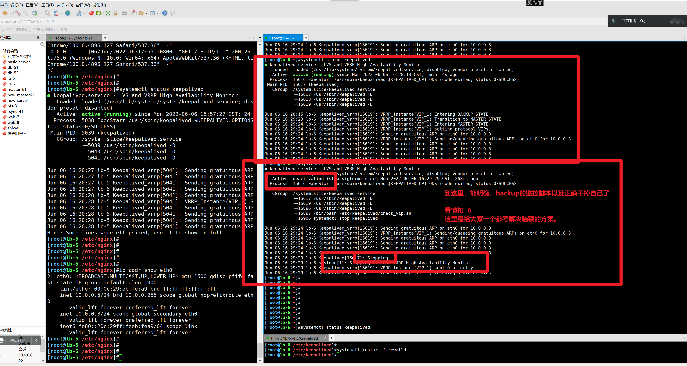


## 故障2，master机器出现了nginx挂掉的解决方案


```
这个脚本，运行于 master机器


#!/bin/bash
NGINX_STATUS=$(ps -ef|grep ngin[x]|wc -l)
# 如果nginx挂了
if [ ${NGINX_STATUS} == 0 ]
then
   systemctl restart nginx
   # 如果重启失败
   if [ $? == 1 ]
   then
         # keepalived没必要活着了
      systemctl stop keepalived
   fi
fi


# 给脚本执行权限

[root@lb-5 /etc/keepalived]#vim check-web.sh
[root@lb-5 /etc/keepalived]#
[root@lb-5 /etc/keepalived]#
[root@lb-5 /etc/keepalived]#
[root@lb-5 /etc/keepalived]#
[root@lb-5 /etc/keepalived]#chmod +x check-web.sh 


修改keepalived配置文件
global_defs {
    router_id lb-5
}

vrrp_script check_web {
    script "/etc/keepalived/check-web.sh"
    interval 5
}

vrrp_instance VIP_1 {
    state MASTER
        interface eth0
        virtual_router_id 50
        priority 150
        advert_int 1
        authentication {
            auth_type PASS
            auth_pass 1111
        }
        virtual_ipaddress {
            10.0.0.3
        }
        track_script {
            check_web
        }
}


[root@lb-5 /etc/keepalived]#systemctl restart keepalived
[root@lb-5 /etc/keepalived]#
[root@lb-5 /etc/keepalived]#
[root@lb-5 /etc/keepalived]#
[root@lb-5 /etc/keepalived]#systemctl status keepalived


```

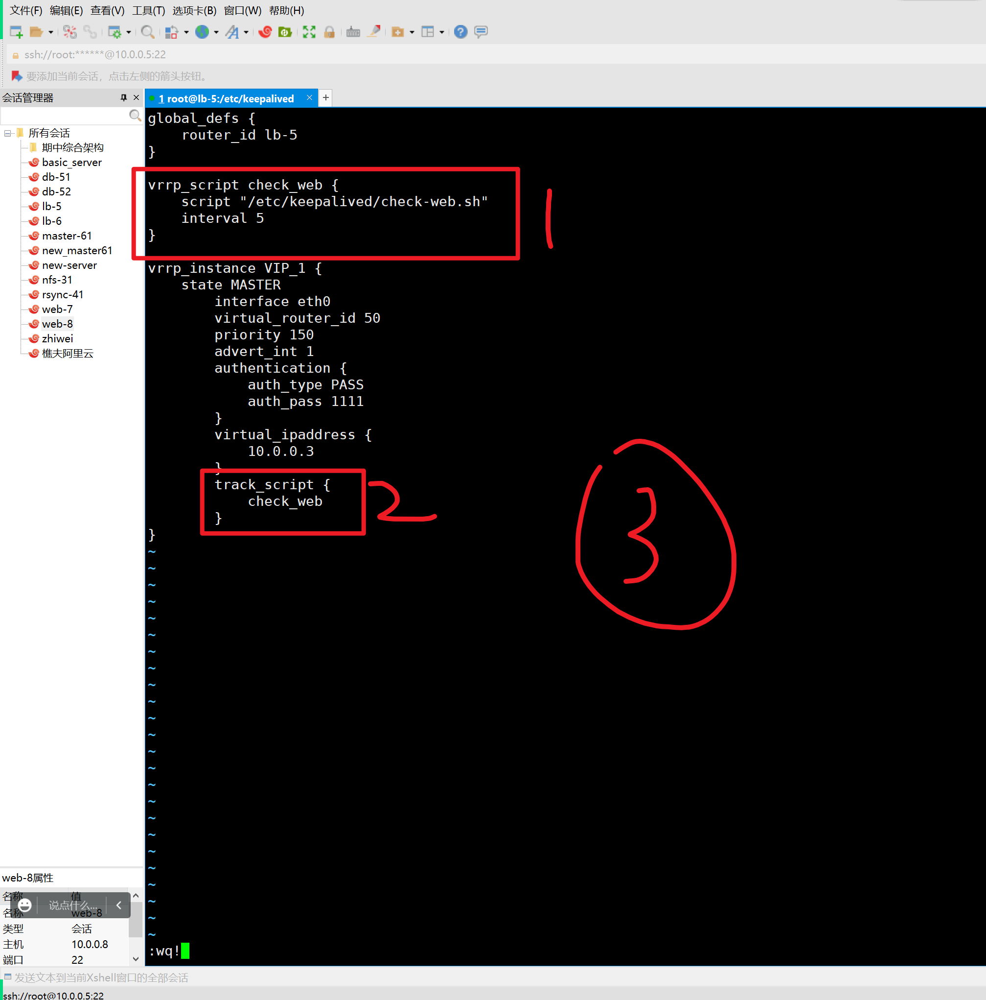


### 最后一步，检查master机器的监控脚本

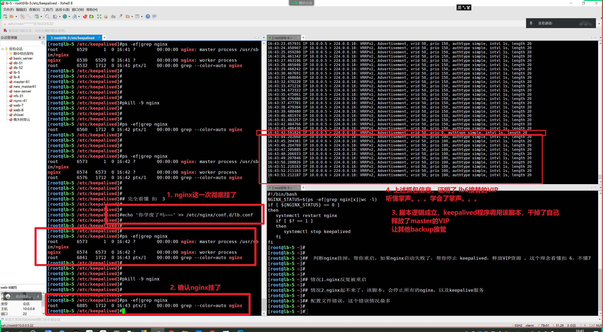


检查，高可用性负载均衡，此时可用吗？

确认，vip在lb6机器，且提供了新的负载均衡。

支持，检测master，backup的脚本，全部成立。恭喜你，少年。


# 阿里云高可用性负载均衡的使用


>简单接触下，后期专门再学。


学keepalived，是能实现自己在维护大规模服务器，部署内网的高可用性负载均衡集群

能自己实现keeplived+ nginx。

现在主流的基于公有云的运维，阿里云卖给你的负载均衡，超级好用，无论是稳定性，并发性，高可用性， 都足够的好用。。

你把keepalived维护的原理琢磨明白了，用这些点点点的操作。易如反掌。

```
公司里，用阿里云等产品发布网站，很多功能都是点点就搞定了，你作为专业的运维，得掌握其背后的原理。。vrrp通信原理。


```


```
https://help.aliyun.com/document_detail/27539.html

https://help.aliyun.com/document_detail/67915.html

等于在负载均衡的地址池中加节点就可以
强大的扩展性，伸缩能力，负载均衡集群的特点。。能明白扣 1
upstream  web-pools {
	server  x.x.x.x;
	server  x.x.x.x;
	server  x.x.x.x;


}

公有云的负载均衡，太简单了
你就可以去部署阿里云的强大的，负载均衡服务器架构了。 、。、

以及底层的具体的操作，你也都学过了。。部署nginx+keepalived


1.  购买负载均衡的产品，他会给你一个VIP让你用 ，默认帮你做好看了 
（keepalived+负载均衡的软件）

【注意，购买和你云服务器，同一个地区下的负载均衡服务器。】

 1.1 购买负载均衡产品，默认让你免费用一个月。
 选最便宜的，也就是部署了keepalived的这个阿里云虚拟机，配置低的可怜，让你体验一下而已。。
 该规格最大可以支持连接数: 5000，新建连接数 (CPS): 3000，每秒查询数 (QPS): 1000
 
选择1m的白嫖负载均衡


2. 只需要添加后端服务器节点的 ip地址信息即可。。。
步骤1，添加后端机器的信息
步骤2，设置阿里云负载均衡的转发规则


3. 做一个实验，基于阿里云的企业级的负载均衡用法，配置过程。


访问 负载均衡的地址，看到后端的网站节点


```

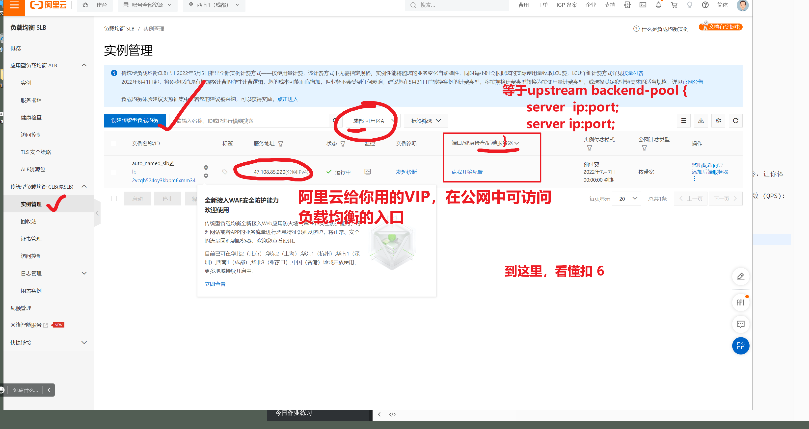


---

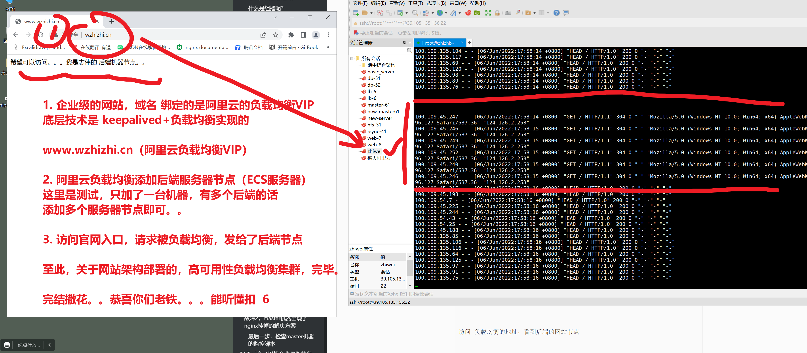


# 今日，明天的作业练习


```
1. 部署基于keepalived实现的高可用性wordpress集群 + 脑裂监控脚本
（完成如要求的部署，以及录制视频，演示脑裂的正确回复）

明天给足时间去写，务必要完成，今天到明天，慢慢写，你要想肝到夜里4点。。。不建议。。专家建议早睡早起。。


2.  完成阿里云的负载均衡产品的购买，以及后端节点的部署
完成阿里云的负载均衡部署。


```


