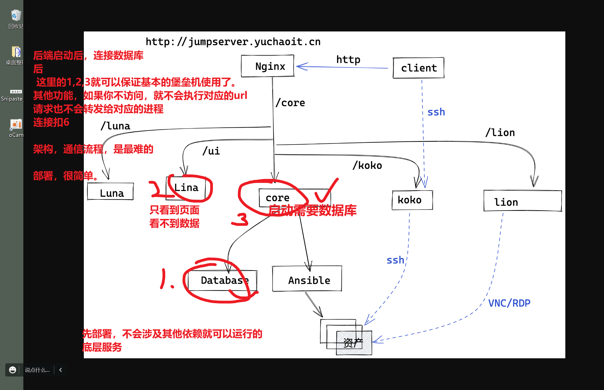
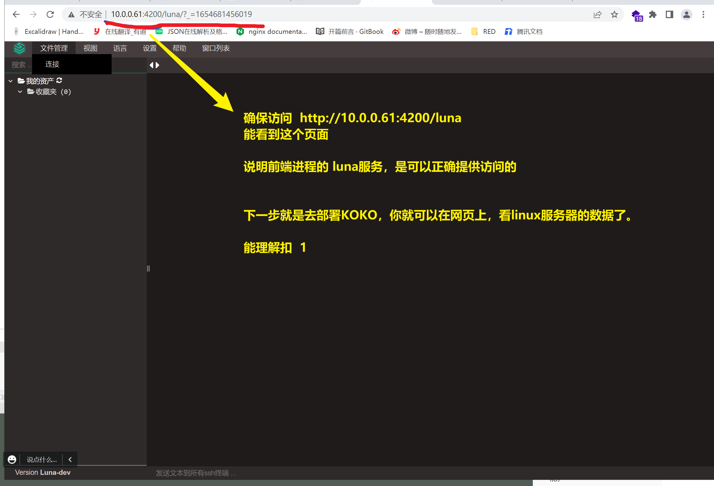

```### 此资源由 58学课资源站 收集整理 ###
	想要获取完整课件资料 请访问：58xueke.com
	百万资源 畅享学习

```


# 如何部署python的代码

```
既然是运维，运维，部署，维护

一个完整的产品、 前端开发工程师(前端代码 html,css,js) + 后端工程师（编写和数据库交互的逻辑代码）

前端、后端源码，打包，发给运维，部署到linux服务器上
1.如果是web产品，需要运维，部署如nginx这样的web服务器，提供域名，端口，防火墙，等允许网站在公网中的可访问。


2. 如果是控制汽车运行的智能算法系统，仅仅要求在linux上运行。基本都要提供基于http协议的一个访问服务。


3. 单纯的计算服务，在系统上，确保可以运行即可,不提供socket(ip:port)让客户端去访问。


不同的公司，使用的技术栈不一样，基本是根据企业的技术沉淀有关，以及招聘来的技术老大有关。决定你开发技术栈，架构，用什么形式的。

早期的，老旧的技术栈，单体应用， 前后端不分离开发模式。（前端、后端代码，糅杂在一起，后端代码，也包括前端代码）

后端代码文件，里面还能看到html这样的标签。。。

具体部署形式，比较简单，整个代码，跑起来，甩给nginx去反向代理即可。，如，经典的wordpress，用的是php后端。

说到这里，听懂扣1.
如果你去其他公司，如360这样公司，大量使用php，那么你的日常维护，部署工作，基本是围绕着LNMP来打转。。


-------------------------
如果你是去了一些新型的互联网公司，某单位，技术栈，用的都是比较新的，复杂的。
那么必然会接触到 ，前后端分离开发模式。具体形式如图


看主流，常见的部署技术栈


php + html + css + js  = wordpress


python + vue  = jumpserver


很方便的看到网站，是基于什么技术开发的


现在大多数网站，前端都是基于vue开发

后端，编程语言选择性很多


数据库，基本是mysql

javascript框架，就知道，这是前端的服务器框架   


python框架，就知道后端用的是python  


bilibili.com

前端 服务器是  运行着 vue.js进程的服务器


后端服务器  是运行着   golang 进程的服务器


数据库服务器，运行着mysql进程的服务器

理解扣 1


```


# 部署堡垒机jumpserver(python+vue+golang)

```
生产级别，较为复杂的项目部署。

再次体验难度加大的部署，前后端不分离的wordpress你已经会了。前后端分离的如何部署。

独立的前端vue项目部署


独立的python项目部署


独立的mysql、redis数据库

独立的golang项目


运维开发，就是去写python，维护jumpserver源码

招运维，就是去给客户，部署jumpserver，以及运行过程中，出现问题，运维做技术支持，解决客户的问题。。

```


```
为了细粒度的，监控运维，任意登录服务器操作的行为

可以责任制，防止无端背黑锅

也保证了服务器的安全

等。


```


# jumpserver基于ansible远程执行命令


# 项目架构图（组件版本要求）


这些每一个组件，当你部署好，运行好进程后， 需要整合起来，整合为一个可访问的统一入口

这个整合的和事老是，是nginx。


请看nginx统一架构图，也是用户访问jumpserver的核心请求逻辑图。


# 完整部署笔记

大项目，都是一个工程化开发结构，还是狠复杂的。




## 服务器准备

```
准备好你的master-61机器，至少给它4G内存，因为 这里部署形式，是让前端，和后端在一台机器上，先不拆了。

如果是你的官网应用，基于前后端分离开发模式，一定要分开多台机器的

master-61 运行堡垒机所有组件，5大组件

db-51  部署数据库mysql，和redis


但是拆开部署后，需要前端，后端工程师的配合。远程连接，需要设置一定的配置参数，协议，否则导致无法连接。
```


## mysql、redis（db-51，数据库机器）

```
重要，友情提醒

友情提示：mysql数据库密码请使用 "字母+数字"

可以和超哥配置的一样

用"yuchao666"

数据库密码连接，读取的是字符串类型

如果你的数据库密码是 "123456"这样的纯数字，

在config.yml里面填入的DB_PASSWORD: "123456" 需要像这样，添加引号，否则报错。

1. 密码，复杂一点，数字+字母

2， 给大家准备的堡垒机 v2.12版本，要求mysql版本大于等于5.7


# 具体部署笔记
yum -y localinstall http://mirrors.ustc.edu.cn/mysql-repo/mysql57-community-release-el7.rpm

sed  -i '/gpgcheck=1/c gpgcheck=0' /etc/yum.repos.d/mysql-community*

yum clean all
yum install -y mysql-community-server

初始化mysql数据
shell命令，修改mysql的启动脚本
mysql5.7之后，默认初始化启动，会随机给你生成密码，你得去配置文件中找这个随机密码。
用如下命令，修改配置文件，可以让他默认别生成随机密码。

if [ ! "$(cat /usr/bin/mysqld_pre_systemd | grep -v ^\# | grep initialize-insecure )" ]; then
    sed -i "s@--initialize @--initialize-insecure @g" /usr/bin/mysqld_pre_systemd
fi

启动
systemctl enable mysqld
systemctl start mysqld


检查进程，端口
[root@db-51 ~]#
[root@db-51 ~]#netstat -tunlp|grep mysql
tcp6       0      0 :::3306                 :::*                    LISTEN      2450/mysqld         
[root@db-51 ~]#
[root@db-51 ~]#
[root@db-51 ~]#
[root@db-51 ~]#ps -ef|grep mysql
mysql      2450      1  1 11:32 ?        00:00:00 /usr/sbin/mysqld --daemonize --pid-file=/var/run/mysqld/mysqld.pid
root       2484   1659  0 11:33 pts/0    00:00:00 grep --color=auto mysql


尝试连接mysql，然后设置一个远程连接的用户，因为master-61机器需要用


[root@db-51 ~]#mysql
Welcome to the MySQL monitor.  Commands end with ; or \g.
Your MySQL connection id is 2
Server version: 5.7.38 MySQL Community Server (GPL)

Copyright (c) 2000, 2022, Oracle and/or its affiliates.

Oracle is a registered trademark of Oracle Corporation and/or its
affiliates. Other names may be trademarks of their respective
owners.

Type 'help;' or '\h' for help. Type '\c' to clear the current input statement.

mysql> 
mysql> 
# 创建数据库，用于堡垒机写入数据表信息
mysql> create database jumpserver default charset 'utf8';
Query OK, 1 row affected (0.00 sec)

mysql> 
mysql> 
# 设置弱密码参数，默认密码难度限制较大，数字，字母，特殊符号。
mysql> set global validate_password_policy=LOW;
Query OK, 0 rows affected (0.00 sec)

mysql> 
mysql> 
# 创建用户，jumpserver 以及密码，待会用于远程连接

mysql> create user 'jumpserver'@'%' identified by 'linux0224';
Query OK, 0 rows affected (0.00 sec)

# 用户授予远程连接权限

mysql> grant all on jumpserver.* to 'jumpserver'@'%';
Query OK, 0 rows affected (0.00 sec)

mysql> 
mysql> flush privileges;
Query OK, 0 rows affected (0.00 sec)


到这里，数据库mysql5.7就配置完毕了，看懂6


```

### redis内存型数据库

```
mysql 磁盘性数据库存储网站的 冷数据，读取不频繁的


redis 数据存内存里。存储网站热数据，如用户信息等，用户的session身份保持信息等。 
组件连接的信息等

要求版本大于6.0

编译安装，准备编译环境，以及redis源码

yum -y install epel-release wget make gcc-c++

# 6.2.4版本
cd /opt ; wget https://download.redis.io/releases/redis-6.2.4.tar.gz
[root@db-51 /opt]#tar -xf redis-6.2.4.tar.gz 

进入源代码目录，编译安装即可，注意可以指定安装的路径参数

cd redis-6.2.4
make && make install PREFIX=/usr/local/redis


检查你的redis安装情况
[root@db-51 /opt/redis-6.2.4]#cd /usr/local/redis/
[root@db-51 /usr/local/redis]#ls
bin
[root@db-51 /usr/local/redis]#ls bin
redis-benchmark  redis-check-aof  redis-check-rdb  redis-cli  redis-sentinel  redis-server

需要你自己添加PATH变量，方可直接使用。


[root@db-51 /opt/redis-6.2.4]#tail -2 /etc/profile

export PATH=$PATH:/usr/local/redis/bin/


修改配置文件的参数，设定redis数据库的连接信息，以及密码

# 拷贝配置文件
cp redis.conf /etc/redis.conf
# 允许redis在任意地址可访问
sed -i "s/bind 127.0.0.1/bind 0.0.0.0/g" /etc/redis.conf

# 让redis以守护进程，在后台运行
sed -i "s/daemonize no/daemonize yes/g" /etc/redis.conf

# 设置redis的内存性参数，内存缓存算法
sed -i "561i maxmemory-policy allkeys-lru" /etc/redis.conf

# 设置redis的连接密码requirepass设置密码的，后面写密码
sed -i "481i requirepass linux0224" /etc/redis.conf


这个配置文件能理解扣 6


验证你的配置，是否生效
grep -Ev '^#|^$' /etc/redis.conf 

验证你的修改操作

[root@db-51 /opt/redis-6.2.4]#grep -Ev '^#|^$' /etc/redis.conf  | grep -E '(bind|require|daemonize)'
bind 0.0.0.0 -::1
daemonize yes
requirepass linux0224

由于是编译安装，默认没有systemctl的管理脚本，可以自己写一个即可

cat >/etc/systemd/system/redis.service <<EOF
[Unit]
Description=Redis persistent key-value database
After=network.target
After=network-online.target
Wants=network-online.target

[Service]
Type=forking
PIDFile=/var/run/redis_6379.pid
ExecStart=/usr/local/redis/bin/redis-server /etc/redis.conf
ExecReload=/bin/kill -s HUP $MAINPID
ExecStop=/bin/kill -s QUIT $MAINPID

[Install]
WantedBy=multi-user.target
EOF


可以用systemctl去管理了

# 启动redis
systemctl enable redis
systemctl start redis


确保redis运行中
[root@db-51 /opt/redis-6.2.4]#ps -ef|grep redis


root       7009      1  0 11:50 ?        00:00:00 /usr/local/redis/bin/redis-server 0.0.0.0:6379
root       7015   1659  0 11:50 pts/0    00:00:00 grep --color=auto redis
[root@db-51 /opt/redis-6.2.4]#
[root@db-51 /opt/redis-6.2.4]#
[root@db-51 /opt/redis-6.2.4]#
[root@db-51 /opt/redis-6.2.4]#
[root@db-51 /opt/redis-6.2.4]#netstat -tunlp|grep redis
tcp        0      0 0.0.0.0:6379            0.0.0.0:*               LISTEN      7009/redis-server 0 
tcp6       0      0 ::1:6379                :::*                    LISTEN      7009/redis-server 0 


本地连接redis测试，查看密码是否好用


[root@db-51 /opt/redis-6.2.4]#redis-cli 
127.0.0.1:6379> 
127.0.0.1:6379> 
127.0.0.1:6379> 
127.0.0.1:6379> ping
(error) NOAUTH Authentication required.
127.0.0.1:6379> 
127.0.0.1:6379> 
127.0.0.1:6379> auth linux0224
OK
127.0.0.1:6379> 
127.0.0.1:6379> 
127.0.0.1:6379> ping
PONG
127.0.0.1:6379> 
127.0.0.1:6379> exit
[root@db-51 /opt/redis-6.2.4]#
[root@db-51 /opt/redis-6.2.4]#
[root@db-51 /opt/redis-6.2.4]## master-61去远程连接redis
[root@db-51 /opt/redis-6.2.4]#
[root@db-51 /opt/redis-6.2.4]#redis-cli  -h 172.16.1.51
172.16.1.51:6379> 
172.16.1.51:6379> 
172.16.1.51:6379> ping
(error) NOAUTH Authentication required.
172.16.1.51:6379> 
172.16.1.51:6379> 
172.16.1.51:6379> auth linunx0224
(error) WRONGPASS invalid username-password pair or user is disabled.
172.16.1.51:6379> 
172.16.1.51:6379> 
172.16.1.51:6379> auth linux0224
OK
172.16.1.51:6379> 
172.16.1.51:6379> ping
PONG
172.16.1.51:6379> exit
[root@db-51 /opt/redis-6.2.4]#
[root@db-51 /opt/redis-6.2.4]## 本地连接，远程连接，密码认证，ping pong通了，看懂扣  6
[root@db-51 /opt/redis-6.2.4]#
[root@db-51 /opt/redis-6.2.4]#


```


## core(核心堡垒机后端服务)（内存至少4G，其他服务起不来）

光jumpserver核心core程序，至少用到2G内存。


### 基础环境安装


```
先确保环境正确，基础环境部署。
先恢复master61机器，注意，做好快照。

从端口来看，这个机器是干净的。

[root@master-61 ~]#netstat -tunlp
Active Internet connections (only servers)
Proto Recv-Q Send-Q Local Address           Foreign Address         State       PID/Program name    
tcp        0      0 0.0.0.0:22              0.0.0.0:*               LISTEN      893/sshd            
tcp        0      0 127.0.0.1:25            0.0.0.0:*               LISTEN      1151/master         
tcp6       0      0 :::22                   :::*                    LISTEN      893/sshd            
tcp6       0      0 ::1:25                  :::*                    LISTEN      1151/master         
[root@master-61 ~]#


检查防火墙

yum源，基础环境部署
wget -O /etc/yum.repos.d/CentOS-Base.repo http://mirrors.aliyun.com/repo/Centos-7.repo
wget -O /etc/yum.repos.d/epel.repo http://mirrors.aliyun.com/repo/epel-7.repo

# 一是，安装基础软件
yum install -y bash-completion vim lrzsz wget expect net-tools nc nmap tree dos2unix htop iftop iotop unzip telnet sl psmisc nethogs glances bc ntpdate  openldap-devel

2.第一个里程：需要部署跳板机依赖软件，重要

# 二是，安装python程序，必须的一些基础依赖。

yum -y install git python-pip  gcc automake autoconf python-devel vim sshpass lrzsz readline-devel  zlib zlib-devel openssl openssl-devel


设置master-61机器的系统编码环境，支持中文
localedef -c -f UTF-8 -i zh_CN zh_CN.UTF-8
# 设置操作系统所有的语言环境，改为中文utf8编码
export LC_ALL=zh_CN.UTF-8

查看编码情况
使用locale命令，查看系统本地所有编码的变量
需要你切换系统的中英文支持。

[root@master-61 ~]#locale
LANG=en_US.UTF-8
LC_CTYPE="zh_CN.UTF-8"
LC_NUMERIC="zh_CN.UTF-8"
LC_TIME="zh_CN.UTF-8"
LC_COLLATE="zh_CN.UTF-8"
LC_MONETARY="zh_CN.UTF-8"
LC_MESSAGES="zh_CN.UTF-8"
LC_PAPER="zh_CN.UTF-8"
LC_NAME="zh_CN.UTF-8"
LC_ADDRESS="zh_CN.UTF-8"
LC_TELEPHONE="zh_CN.UTF-8"
LC_MEASUREMENT="zh_CN.UTF-8"
LC_IDENTIFICATION="zh_CN.UTF-8"
LC_ALL=zh_CN.UTF-8


# 这是一个python3开发的源代码，jumpserver，因此需要配置python3环境，咱们是编译安装，因为有版本要求。
# 编译安装，python是可以处理ssl加密，因此你的底层需要安装openssl基础环境


# 下载安装python3源代码，部署python这一块，会需要用到一些python的环境知识，认真听，稍微有点难度。


# 1. 下载jumpserver后端核心源码

mkdir /opt/jumpserver-v2.12.0
wget -O /opt/jumpserver-v2.12.0.tar.gz https://github.com/jumpserver/jumpserver/archive/refs/tags/v2.12.0.tar.gz


# 2. 解压缩源代码，安装后端源码，运行所需的linux环境依赖，rpm包，人家给提供好了
# --strip-components 1 参数意思是，
cd /opt ; tar -xf jumpserver-v2.12.0.tar.gz -C /opt/jumpserver-v2.12.0 --strip-components 1
---------------------------------------------------------------------------------
# 3.检查解压的源码（这就是python的web框架，django的一堆源代码，都是py文件）
# 其实就是一堆py代码，和sh脚本，这个源码是飞致云的运维开发，写的程序
#  纯开发，纯后端开发，是写业务代码，如电商后台，员工管理系统后台，医疗系统后台
#    管理的纯业务的员工数据，商业数据。
------------------------------------------------------------------------
#  运维开发，写代码，写平台，数据库管理的是机器的信息，如资产管理平台， 代码发布平台，容器管理平台
# ansible自动化调度平台。运维开发，通过运维技术+开发技术，管理服务器，等资产信息。
# 能大致理解扣 1
# 
---------------------------------------------------------------------------------

[root@master-61 /opt/jumpserver-v2.12.0]#ls
apps                data        docs           jms      logs          README.md     run_server.py  utils
config_example.yml  Dockerfile  entrypoint.sh  LICENSE  README_EN.md  requirements  tmp            Vagrantfile


# 3. jumpserver源码，给你提供了一堆rpm包，需要你去安装方可运行，
yum install -y $(cat /opt/jumpserver-v2.12.0/requirements/rpm_requirements.txt)


```

### python3.6开发环境安装

```
当你以后去维护python的产品

目前市面上有2个版本

1. python2的版本，以及不再维护了，但是有老企业在用(linux系统默认很多工具用的是python2，如yum工具)
[root@master-61 /opt/jumpserver-v2.12.0]#python -V
Python 2.7.5


2. python3的版本，主流版本

3. 要注意的是，同时保留python2，和python3，不要乱改。
添加到PATH，让2个版本共存即可。


4. 先安装python3的编译环境，注意整理python的包，是不带3这个数字的！！
yum install gcc patch libffi-devel python-devel  zlib-devel bzip2-devel openssl-devel ncurses-devel sqlite-devel readline-devel tk-devel gdbm-devel db4-devel libpcap-devel xz-devel -y

5. 下载python3源码，编译且安装
# 使用自建的yum仓库即可。
# 确保你的编译过程，没有errorr，看好日志
# python语言是由C语言开发而来。。。它也叫做Cpython。。没想到吧。。

cd /opt && wget https://www.python.org/ftp/python/3.6.9/Python-3.6.9.tgz
tar -zxf Python-3.6.9.tgz
cd Python-3.6.9/
./configure --prefix=/opt/python369/
make && make install

6.看到如下日志，你的python3才是正常的，看懂扣 6

Collecting setuptools
Collecting pip
Installing collected packages: setuptools, pip
Successfully installed pip-18.1 setuptools-40.6.2

检查python3的环境如下，添加到PATH变量中

[root@master-61 /opt/python369/bin]#tail -2 /etc/profile
# 添加python3的PATH
export PATH=$PATH:/opt/python369/bin
[root@master-61 /opt/python369/bin]#source /etc/profile


7.检查，确保如下2个命令可以正确执行，你的python3环境才是对的

# 这个是python3的解释器，用于执行*.py代码的。
[root@master-61 ~]#python3 -V
Python 3.6.9
[root@master-61 ~]#
[root@master-61 ~]#


# 这是管理python程序的模块依赖包的
# 这么去理解
#    yum是给centos安装rpm包依赖的。
#    pip3命令是给python3，给python项目，安装项目所需的依赖的。
# 它俩是2个 东西


[root@master-61 ~]#pip3 -V
pip 18.1 from /opt/python369/lib/python3.6/site-packages/pip (python 3.6)


能看懂确python3安装成功的，以及这个pip3解释的，扣个6


```


### 补充：设置pip3的下载源，豆瓣源，加速模块下载

````

# 在用户家目录下，生成一个全局的 .pip.conf配置文件而已。
# 这里能看明白什么意思的，扣 1，不懂 2
# 就是生成一个文件而已。然后pip3 install  xxx模块的时候，会使用如下这个地址
# 就和你配置yum源一个意思。。。

# 创建文件夹
mkdir ~/.pip

# 创建配置文件
(venv_py3) [root@master-61 ~]#cat ~/.pip/pip.conf 
[global]
index-url=https://pypi.douban.com/simple

````


### python3的虚拟环境安装（虚拟环境原理就是在修改PATH变量）


```
当前机器上，存在一个python3的环境，绝对路径在
[root@master-61 ~]#which python3
/opt/python369/bin/python3


# 具体的演示如下


1. 创建虚拟环境（其实就是又下载了一个python3解释器，而已，你理解是本体解释器的一个分身即可。）

# 基于python3命令 指定用venv这个模块功能，下载安装一个解释器路径到   /opt/venv_py3

cd /opt && python3 -m venv /opt/venv_py3


2. 演示，物理解释器的环境信息，以及虚拟环境的解释器信息

------------------------------------------------------------
查看【物理解释器】本体的模块信息
[root@master-61 /opt]#which pip3
/opt/python369/bin/pip3

查看模块列表
[root@master-61 /opt]#pip3 list
Package    Version
---------- -------
pip        18.1   
setuptools 40.6.2 

随便装一个模块，再查看模块列表

[root@master-61 /opt]#pip3 install requests

￥￥￥￥￥￥￥￥￥￥￥￥￥￥￥￥￥￥￥￥￥￥￥￥￥￥￥￥￥￥￥￥￥￥￥￥￥￥￥￥￥￥￥￥
[root@master-61 /opt]#pip3 list
Package            Version    
------------------ -----------
certifi            2022.5.18.1
charset-normalizer 2.0.12     
idna               3.3        
pip                18.1       
requests           2.27.1     
setuptools         40.6.2     
urllib3            1.26.9    
￥￥￥￥￥￥￥￥￥￥￥￥￥￥￥￥￥￥￥￥￥￥￥￥￥￥￥￥￥￥￥￥￥￥￥￥￥￥￥￥￥￥￥￥
------------------------------------------------------------

3. 激活虚拟环境，安装jumpserver后端所需的python依赖
[root@master-61 /opt]#source /opt/venv_py3/bin/activate
(venv_py3) [root@master-61 /opt]#
(venv_py3) [root@master-61 /opt]#
(venv_py3) [root@master-61 /opt]#
(venv_py3) [root@master-61 /opt]#
(venv_py3) [root@master-61 /opt]#
(venv_py3) [root@master-61 /opt]#
(venv_py3) [root@master-61 /opt]#
(venv_py3) [root@master-61 /opt]#
(venv_py3) [root@master-61 /opt]#which pip3
/opt/venv_py3/bin/pip3
(venv_py3) [root@master-61 /opt]#

查看当前python3解释器的模块列表
￥￥￥￥￥￥￥￥￥￥￥￥￥￥￥￥￥￥￥￥￥￥￥￥￥￥￥￥￥￥￥￥￥￥￥￥￥￥￥￥￥￥￥￥
(venv_py3) [root@master-61 /opt]#pip3 list
Package    Version
---------- -------
pip        18.1   
setuptools 40.6.2 
￥￥￥￥￥￥￥￥￥￥￥￥￥￥￥￥￥￥￥￥￥￥￥￥￥￥￥￥￥￥￥￥￥￥￥￥￥￥￥￥￥￥￥￥

能看明白，此时基于虚拟环境，管理了一个新的解释器模块依赖
和物理解释器的模块信息，是分开的，


```

说到这里，就是已经装好了一个虚拟环境 

```
/opt/venv_py3/ 这个路径的解释器


```

### 为什么激活虚拟环境后，解释器用which查看的路径就变了。

````
很简单，因为它帮你修改了PATH
PATH有加载顺序，从左到右。

1. 查看虚拟环境下的PATH信息
(venv_py3) [root@master-61 /opt]#echo $PATH
/opt/venv_py3/bin:/usr/local/sbin:/usr/local/bin:/usr/sbin:/usr/bin:/root/bin:/opt/python369/bin
(venv_py3) [root@master-61 /opt]#


2. 退出虚拟环境后再看

(venv_py3) [root@master-61 /opt]#deactivate 
[root@master-61 /opt]#
[root@master-61 /opt]#
[root@master-61 /opt]#echo $PATH
/usr/local/sbin:/usr/local/bin:/usr/sbin:/usr/bin:/root/bin:/opt/python369/bin
[root@master-61 /opt]#
[root@master-61 /opt]#which pip3
/opt/python369/bin/pip3


````


### 安装jumpserver后端所需的python依赖

```
1.确保要激活虚拟环境

2. 找到项目中的，项目依赖文件，这是每一个python开发者，必然会设置的一个文件，方便运维去部署这些依赖模块。
(venv_py3) [root@master-61 /opt/jumpserver-v2.12.0/requirements]#ls /opt/jumpserver-v2.12.0/requirements/requirements.txt 
/opt/jumpserver-v2.12.0/requirements/requirements.txt

先查看当前的虚拟环境下的依赖列表
(venv_py3) [root@master-61 ~]#pip3 list
Package    Version
---------- -------
pip        18.1   
setuptools 40.6.2 
You are using pip version 18.1, however version 21.3.1 is available.
You should consider upgrading via the 'pip install --upgrade pip' command.


3. 安装这些模块依赖（注意，使用豆瓣源去下载，否则让你怀疑人生）
(venv_py3) [root@master-61 ~]#pip3 install -r /opt/jumpserver-v2.12.0/requirements/requirements.txt

这个python模块，要么全部成功，要么全部会失败。
注意别报错即可。

别出现error，否则pip3命令会立即终止的，然后看报错，解决报错即可。


4. 查看模块依赖（依然是虚拟环境下的模块依赖）
差不多有198行模块
(venv_py3) [root@master-61 ~]#pip3 list |wc -l
198


5. 可以退出虚拟环境，对比着物理环境理解下，看下区别。


```

### 再次确认，物理环境，和虚拟环境的区别


### 解决pip版本太低的问题，升级即可

```
(venv_py3) [root@master-61 ~]#pip install --upgrade pip
Looking in indexes: https://pypi.douban.com/simple
Collecting pip
  Downloading https://pypi.doubanio.com/packages/a4/6d/6463d49a933f547439d6b5b98b46af8742cc03ae83543e4d7688c2420f8b/pip-21.3.1-py3-none-any.whl (1.7MB)
    100% |████████████████████████████████| 1.7MB 26.9MB/s 
Installing collected packages: pip
  Found existing installation: pip 18.1
    Uninstalling pip-18.1:
      Successfully uninstalled pip-18.1
Successfully installed pip-21.3.1


```

### 下一步，python3环境好了之后，可以运行项目了

### 修改jumpserver代码的配置文件


```
1.  提示，你在部署core服务，后端python服务的时候，确保全程激活虚拟环境

2.拷贝配置文件，修改配置文件如下
(venv_py3) [root@master-61 /opt/jumpserver-v2.12.0]#cp config_example.yml config.yml
(venv_py3) [root@master-61 /opt/jumpserver-v2.12.0]#
(venv_py3) [root@master-61 /opt/jumpserver-v2.12.0]#
(venv_py3) [root@master-61 /opt/jumpserver-v2.12.0]#ls config.yml 
config.yml


3. 修改如下
jumpserver整个架构的所有组件，相互之间的通信，都是基于一个密钥来加密的。
基于如下命令，生成2个密钥。

先打印这2个变量看有没有
echo $SECRET_KEY
echo $BOOTSTRAP_TOKEN
 


# 生成如下2个变量的随机值，待会配置文件得用

if [ "$SECRET_KEY" = "" ]; then SECRET_KEY=`cat /dev/urandom | tr -dc A-Za-z0-9 | head -c 50`; echo "SECRET_KEY=$SECRET_KEY" >> ~/.bashrc; echo $SECRET_KEY; else echo $SECRET_KEY; fi

if [ "$BOOTSTRAP_TOKEN" = "" ]; then BOOTSTRAP_TOKEN=`cat /dev/urandom | tr -dc A-Za-z0-9 | head -c 16`; echo "BOOTSTRAP_TOKEN=$BOOTSTRAP_TOKEN" >> ~/.bashrc; echo $BOOTSTRAP_TOKEN; else echo $BOOTSTRAP_TOKEN; fi


4. 修改jumpserver后台的配置文件【请注意，这个文件是yaml语法，空格语法很严格】
大家，照着我这个修改即可，


SECRET_KEY: "$SECRET_KEY"
BOOTSTRAP_TOKEN: "$BOOTSTRAP_TOKEN"
DEBUG: true                   # 开发建议打开 DEBUG, 生产环境应该关闭
LOG_LEVEL: DEBUG              # 开发建议设置 DEBUG, 生产环境推荐使用 ERROR
SESSION_EXPIRE_AT_BROWSER_CLOSE: true  # 浏览器关闭 session 过期
DB_ENGINE: mysql	# 数据库引擎是mysql
DB_HOST: 10.0.0.51       # 自行配置 数据库相关
DB_PORT: 3306		# 数据库端口
DB_USER: jumpserver		# 数据库远程连接的用户
DB_PASSWORD: linux0224		# mysql密码
DB_NAME: jumpserver			# mysql存储的库名
HTTP_BIND_HOST: 0.0.0.0  	# core服务运行的地址
HTTP_LISTEN_PORT: 8080		# core服务运行的端口
WS_LISTEN_PORT: 8070		# 后端websocket协议的端口
REDIS_HOST: 10.0.0.51       # 自行配置 Redis 相关
REDIS_PORT: 6379
REDIS_PASSWORD: linux0224	 # 自定义的redis密码


因此最终的配置如下
(venv_py3) [root@master-61 /opt/jumpserver-v2.12.0]#cat config.yml 
SECRET_KEY: "$SECRET_KEY"
BOOTSTRAP_TOKEN: "$BOOTSTRAP_TOKEN"
DEBUG: true
LOG_LEVEL: DEBUG
SESSION_EXPIRE_AT_BROWSER_CLOSE: true
DB_ENGINE: mysql
DB_HOST: 10.0.0.51
DB_PORT: 3306
DB_USER: jumpserver
DB_PASSWORD: linux0224
DB_NAME: jumpserver
HTTP_BIND_HOST: 0.0.0.0
HTTP_LISTEN_PORT: 8080
WS_LISTEN_PORT: 8070
REDIS_HOST: 10.0.0.51
REDIS_PORT: 6379
REDIS_PASSWORD: linux0224


```


### 数据库迁移

```
通过python3命令，生成jumpserver的核心数据库，数据表内容，会写入到mysql

都是python开发的知识。。。运维会部署也得会。。


(venv_py3) [root@master-61 /opt/jumpserver-v2.12.0/apps]#python3  ./manage.py makemigrations


此步骤，会写入mysql数据库的jumpserver 库中的数据表
发现生成了97张数据表
看懂扣3

(venv_py3) [root@master-61 /opt/jumpserver-v2.12.0/apps]#python3  ./manage.py migrate 


```

### 有了数据之后，可以启动后端了

```
进入到jumpserver源码目录中，它提供好了启动脚本。


一键执行python的启动服务脚本，运行后端所有程序
并且是后台运行，不会占用你的窗口，xshell关了，也不会断开。


(venv_py3) [root@master-61 /opt/jumpserver-v2.12.0]#
(venv_py3) [root@master-61 /opt/jumpserver-v2.12.0]#ls /opt/jumpserver-v2.12.0/jms 
/opt/jumpserver-v2.12.0/jms
(venv_py3) [root@master-61 /opt/jumpserver-v2.12.0]#
(venv_py3) [root@master-61 /opt/jumpserver-v2.12.0]#
(venv_py3) [root@master-61 /opt/jumpserver-v2.12.0]#./jms start all -d 


检查所有的组件，状态，确保有进程id号，才是对的。
(venv_py3) [root@master-61 /opt/jumpserver-v2.12.0]#./jms status
gunicorn is running: 2977
flower is running: 2992
daphne is running: 3152
celery_ansible is running: 3347
celery_default is running: 3448
beat is running: 3587

确保这6个进程的pid，都存在，即正确。

以及，查看该进程的 端口，注意是端口。

(venv_py3) [root@master-61 /opt/jumpserver-v2.12.0]#netstat -tunlp
Active Internet connections (only servers)
Proto Recv-Q Send-Q Local Address           Foreign Address         State       PID/Program name    
tcp        0      0 0.0.0.0:8070            0.0.0.0:*               LISTEN      3152/python3        
tcp        0      0 0.0.0.0:8080            0.0.0.0:*               LISTEN      2977/python3        
tcp        0      0 0.0.0.0:5555            0.0.0.0:*               LISTEN      2992/python3        
tcp        0      0 0.0.0.0:22              0.0.0.0:*               LISTEN      958/sshd            
tcp        0      0 127.0.0.1:25            0.0.0.0:*               LISTEN      1127/master         
tcp6       0      0 :::5555                 :::*                    LISTEN      2992/python3        
tcp6       0      0 :::22                   :::*                    LISTEN      958/sshd            
tcp6       0      0 ::1:25                  :::*                    LISTEN      1127/master  

直接告诉大家，后端core服务，运行的http端口是 8080

因此你可以试着访问试试。


```

### 首次访问，登录，修改密码

首次是可以访问，它会让你修改密码，下一次，人家代码中限制，你就没法直接访问后台了，。必须通过前端lina服务器，才能访问到后台。

````
admin

admin

首次修改密码为，chaoge666


````


```
部署到这里，可以退出虚拟环境

记住，虚拟环境影响的只是python的PATH。


(venv_py3) [root@master-61 /opt/jumpserver-v2.12.0]#deactivate 
[root@master-61 /opt/jumpserver-v2.12.0]#


```


## lina前端(可视化前端页面)


---


### 部署前端lina全流程

```
1. 下载前端源代码，下载源码，解压缩。

# 这里由于网络问题，我是去windows下载，能看懂扣 6，会这么玩的扣 6


mkdir -p /opt/lina-v2.12.0
wget -O /opt/lina-v2.12.0.tar.gz https://github.com/jumpserver/lina/archive/refs/tags/v2.12.0.tar.gz
cd /opt/lina-v2.12.0
tar -xf lina-v2.12.0.tar.gz -C /opt/lina-v2.12.0 --strip-components 1

# 注意，源代码放入到指定的目录中
# 确保代码如下即可。
[root@master-61 /opt]#ls /opt/lina-v2.12.0
alias.config.js  dump.rdb        mock               public     utils
babel.config.js  jest.config.js  nginx.conf         README.md  vue.config.js
build            jsconfig.json   package.json       src        yarn.lock
Dockerfile       LICENSE         postcss.config.js  tests


2. 部署nodejs  （学到现在，你已经部署了 php编程语言，python语言，nodejs前端开发的语言）
# node.js和python，php一样，是一个编程语言，专门运行*.js程序的。

# 部署php后端是 2个步骤  一是下载*.php源码，安装php7解释器执行这个代码
# 部署 python后端 2个步骤  一是下载*.py，编译python3去执行代码

# 部署nodejs是因为，前端源代码是一堆*.js文件，需要用node.js解释器去运行

# 程序员大牛，必备技能ctrl +c  ctrl +v   


mkdir -p /opt/node-v10.24.1 && cd /opt/node-v10.24.1 && wget https://nodejs.org/dist/v10.24.1/node-v10.24.1-linux-x64.tar.gz

# 这里下载，解压缩的node.js解释器，是一个二进制的命令，无须安装了，配置PATH即可使用

tar -xf node-v10.24.1-linux-x64.tar.gz -C /opt/node-v10.24.1  --strip-components 1

tail -1 /etc/profile

export PATH=$PATH:/opt/python369/bin/:/opt/node-v10.24.1/bin


# 你最终，确保node.js的运行目录如下即可。
[root@master-61 /opt/node-v10.24.1/bin]#ls /opt/node-v10.24.1/bin
node  npm  npx


# 配置PATH，确保和我一样
[root@master-61 /opt/node-v10.24.1/bin]#tail -2 /etc/profile
# 添加python3的PATH
export PATH=$PATH:/opt/python369/bin:/opt/node-v10.24.1/bin
[root@master-61 /opt/node-v10.24.1/bin]#


[root@master-61 /opt/node-v10.24.1/bin]#node -v
v10.24.1
[root@master-61 /opt/node-v10.24.1/bin]#
[root@master-61 /opt/node-v10.24.1/bin]#
[root@master-61 /opt/node-v10.24.1/bin]#npm -v
6.14.12

[root@master-61 /opt/node-v10.24.1/bin]## 确保node解释器可以用，以及npm命令可以用
[root@master-61 /opt/node-v10.24.1/bin]#
[root@master-61 /opt/node-v10.24.1/bin]##npm 命令又是管理 node.js项目的依赖工具，装前端依赖模块的。。


到这里，前端的node.js开发环境，就已经部署好了

能理解扣  6


```

### 配置前端npm的下载加速源

```
执行如下命令即可

npm config set registry https://registry.npm.taobao.org
npm config get registry
```

### 理解npm和node的关系（对比pip和python的关系）


### 安装前端源代码的依赖

```
# 1.配置加速源
[root@master-61 /opt/lina-v2.12.0]#
[root@master-61 /opt/lina-v2.12.0]#cd /opt/lina-v2.12.0/

配置淘宝的下载加速源

[root@master-61 /opt/lina-v2.12.0]#npm config set registry https://registry.npm.taobao.org
[root@master-61 /opt/lina-v2.12.0]#npm config get registry
https://registry.npm.taobao.org/


# 2.进入源代码目录，执行命令，安装即可、
先安装yarn工具，为了安装前端vue的依赖，跟着操作就行，都是前端开发的知识。
公司里会有前端工程师，配合你，给你文档，你跟着操作就行。

[root@master-61 /opt/lina-v2.12.0]#npm install -g yarn


# 3.通过如下命令，安装前端的依赖
[root@master-61 /opt/lina-v2.12.0]#yarn install


# 4.你只需要确保，能理解这些步骤，是在部署前端代码，下载前端的项目依赖，确保命令正确执行就OK
只要别跟着笔记操作，一个命令8个报错就行。。。。

到这里的3个步骤，能理解扣 6

# 装前端依赖，装十次，得报错8次，没办法，和前端工程协同工作，报错直接发给他，让他看。


# 多玩几次，就熟练了，

# 一般的错误，你作为一个高级运维，你还是得自己先看一看报错，试着解决，
# 疑难杂症，得让前端配合你。。

# 生产环境下的部署，需要有前端、后端的接口、参数、调试配合，如果没有自动化的话，一天时间，能跑起来。

剩下的复杂的接口，其他程序，数据能调通，慢慢来了。。


```

最终，确保如下安装结果，才是对的。

```
[root@master-61 /opt/lina-v2.12.0]#
[root@master-61 /opt/lina-v2.12.0]#yarn install
yarn install v1.22.19
[1/5] Validating package.json...
[2/5] Resolving packages...
[3/5] Fetching packages...
[############################################-----------------------------------------------------------------[############################################-----------------------------------------------------------------[############################################-----------------------------------------------------------------[#############################################---------------------------------------------------------------
warning url-loader@1.1.2: Invalid bin field for "url-loader".
[#########################################################################-----------------------] 1284/1681
[4/5] Linking dependencies...
warning " > less-loader@5.0.0" has unmet peer dependency "webpack@^2.0.0 || ^3.0.0 || ^4.0.0".
warning " > html-webpack-plugin@3.2.0" has unmet peer dependency "webpack@^1.0.0 || ^2.0.0 || ^3.0.0 || ^4.0.0".
warning " > compression-webpack-plugin@6.1.1" has unmet peer dependency "webpack@^4.0.0 || ^5.0.0".
warning " > sass-loader@7.3.1" has unmet peer dependency "webpack@^3.0.0 || ^4.0.0".
warning " > script-ext-html-webpack-plugin@2.1.3" has unmet peer dependency "webpack@^1.0.0 || ^2.0.0 || ^3.0.0 || ^4.0.0".
[5/5] Building fresh packages...
success Saved lockfile.
Done in 259.36s.

```

### 修改前端的js文件，设置一些运行参数

```
[root@master-61 /opt/lina-v2.12.0]#cat .env.development 
# 全局环境变量 请勿随意改动
ENV = 'development'


# base api
VUE_APP_BASE_API = ''
VUE_APP_PUBLIC_PATH = '/ui/'

# vue-cli uses the VUE_CLI_BABEL_TRANSPILE_MODULES environment variable,
# to control whether the babel-plugin-dynamic-import-node plugin is enabled.
# It only does one thing by converting all import() to require().
# This configuration can significantly increase the speed of hot updates,
# when you have a large number of pages.
# Detail:  https://github.com/vuejs/vue-cli/blob/dev/packages/@vue/babel-preset-app/index.js

VUE_CLI_BABEL_TRANSPILE_MODULES = true

# External auth
VUE_APP_LOGIN_PATH = '/core/auth/login/'
VUE_APP_LOGOUT_PATH = '/core/auth/logout/'


# Dev server for core proxy
VUE_APP_CORE_HOST = 'http://localhost:8080'
VUE_APP_ENV = 'development'


# 我们这里是测试，前端的lina项目和后端的core项目运行在同一台机器，因此 这里用
# 前端后端在一起的用法。
# 还记得，我们刚才去访问 core的堡垒机登录页面，确认后端端口是8080

到这里能理解扣 1

所这里啥也没改。


```


### 运行lina前端项目

```
执行如下命令，让lina在后台运行即可。

[root@master-61 /opt/lina-v2.12.0]#nohup yarn serve &  


[root@master-61 /opt/lina-v2.12.0]## 确保如下端口存在，前端的lina进程就已经运行了，前端端口是 9528
[root@master-61 /opt/lina-v2.12.0]#
[root@master-61 /opt/lina-v2.12.0]#
[root@master-61 /opt/lina-v2.12.0]#netstat -tunlp|grep 9528
tcp        0      0 0.0.0.0:9528            0.0.0.0:*               LISTEN      5385/node   


```


### 测试访问前端

至此，你已经可以基于如下的通信请求，正确访问堡垒机了。

但是，还缺少

- nginx做端口代理
- 其他基础组件。

测试访问，能确保正确看到堡垒机后台，就OK

```
访问的地址入口是前端

http://10.0.0.61:9528/

```


### 前端lina、后端core的架构图

```
目前完成的任务


1. db-51的 mysql，redis组件

2. master-61  core后台组件    lina前端组件


```


## 良苦用心

>难度 五颗星。
>
>>**今天加油听，讲的很细，确保你能学会，部署复杂的前后端分离项目**
>>
>>明天慢慢练即可。
>>
>>（作业会很变态，要求你部署完毕之后，重启所有机器，看还能确保堡垒机正常访问吗，虐虐自己）
>>
>>重启后，还能让它继续访问，确保可以访问。
>>
>>理解良苦用心的扣1

## luna前端（网页版命令行）

```
lina项目，是堡垒机的前端项目，咱们目前是运行了一个前端进程  10.0.0.61:9528 对的吧。


在生产环境下的部署，会有前端工程师配合你，将所有的前端的代码，编译 执行前端的 build命令，生成 纯静态文件。

得前端代码中，填写后端的接口地址（负载均衡的地址）

这个得你清晰部署流程。


还有一个luna组件，提供网页版命令行的，这个功能也是是基于 vue前端开发的页面 +  和后端进行数据交互，提供的网页版命令行。

web开发的知识。。大家不用过多琢磨。。


学会如何部署即可。。


1. 部署node环境，因为需要运行 luna的前端代码。

[root@master-61 /opt/lina-v2.12.0]#
[root@master-61 /opt/lina-v2.12.0]#node -v
v10.24.1
[root@master-61 /opt/lina-v2.12.0]#
[root@master-61 /opt/lina-v2.12.0]#npm -v
6.14.12


2.下载luna的前端源代码
mkdir -p  /opt/luna-v2.12.0

wget -O /opt/luna-v2.12.0.tar.gz https://github.com/jumpserver/luna/archive/refs/tags/v2.12.0.tar.gz

tar -xf luna-v2.12.0.tar.gz -C /opt/luna-v2.12.0 --strip-components 1


最后确保如下代码一样即可。
[root@master-61 /opt]#ls /opt/luna-v2.12.0
angular.json  Dockerfile  e2e            LICENSE  nginx.conf    package-lock.json   proxy.conf.json  src            tslint.json
deploy        docs        karma.conf.js  mock.py  package.json  protractor.conf.js  README.md        tsconfig.json  utils


3.安装luna项目的前端依赖，安装依赖的时候，发现缺少如下gcc工具，跟着操作，安装即可。踩坑之后的文档。


yum -y install gcc gcc-c++


4. 安装前端的依赖，很棘手，很容易出现问题。

执行如下2条命令。

命令一，安装依赖，直接执行这个命令即可，会自动寻找目录下的 package.json文件，安装前端依赖信息

[root@master-61 /opt/luna-v2.12.0]#pwd
/opt/luna-v2.12.0
[root@master-61 /opt/luna-v2.12.0]#
[root@master-61 /opt/luna-v2.12.0]#npm install 


老师的机器安装了如下1477个依赖包。
added 1477 packages from 1909 contributors in 244.312s

11 packages are looking for funding
  run `npm fund` for details


命令二：
# 大致能明白啥意思，扣 1

# 必须安装对应版本的 node-sass依赖，否则又是一堆报错。
# 这个命令是单独的，安装一个组件，限定了版本，这是我踩坑的解决办法，你跟着操作就行。
# 你根据这个教程，部署的是v2.12.0 luna源代码，因此这个前端项目，依赖的模块，有指定的版本。
# 如果是其他的luna源码版本你或许不需要装这个操作。。理解即可。。

SASS_BINARY_SITE=https://npm.taobao.org/mirrors/node-sass/ 
npm install node-sass@4.13.0


```

如果想加速下载，可以设置linux的全局http_proxy代理。走你的梯子即可。

http,https的数据请求。

搞个梯子，设置全局http代理，

【机器请求 > 梯子】 > 发给目标机器

称之为正向代理，还是反向代理？

对，正向代理。


### 修改luna 的配置文件

```
由于luna和 core服务部署在一台机器，因此这里的地址，不用用localhost
如果luna和core服务，分开在不同得机器，你得填写 core机器的ip，理解扣 1


因此这里，啥也不写即可

[root@master-61 /opt/luna-v2.12.0]#cat proxy.conf.json 
{
  "/koko": {
    "target": "http://localhost:5000",
    "secure": false,
    "ws": true
  },
  "/media/": {
    "target": "http://localhost:8080",
    "secure": false,
    "changeOrigin": true
  },
  "/api/": {
    "target": "http://localhost:8080",
    "secure": false,
    "changeOrigin": true
  },
  "/core": {
    "target": "http://localhost:8080",
    "secure": false,
    "changeOrigin": true
  },
  "/static": {
    "target": "http://localhost:8080",
    "secure": false,
    "changeOrigin": true
  },
  "/lion": {
    "target": "http://localhost:9529",
    "secure": false,
    "pathRewrite": {
      "^/lion/monitor": "/monitor"
    },
    "ws": true,
    "changeOrigin": true
  }
}
[root@master-61 /opt/luna-v2.12.0]#


```

### 启动luna

需要安装ng命令

你要运行luna这个项目，需要安装ng命令，为了执行，`ng server 运行luna进程` ，

这是前端的命令工具。

```
# 安装ng命令，用于启动前端服务器，注意，必须是这个版本（再次吐槽，官网文档，就不能用心点写吗？一堆烂坑）
# 安装这个ng命令，使用这条命令，添加--unsafe-perm参数，提权，让node的权限大一点
npm install -g @angular/cli@1.3.2  --unsafe-perm

# 确保ng命令能装好,执行如下命令即可。

[root@master-61 /opt/luna-v2.12.0]#ng --version

     _                      _                 ____ _     ___
    / \   _ __   __ _ _   _| | __ _ _ __     / ___| |   |_ _|
   / △ \ | '_ \ / _` | | | | |/ _` | '__|   | |   | |    | |
  / ___ \| | | | (_| | |_| | | (_| | |      | |___| |___ | |
 /_/   \_\_| |_|\__, |\__,_|_|\__,_|_|       \____|_____|___|
                |___/
    

Angular CLI: 7.3.9
Node: 10.24.1
OS: linux x64
Angular: 7.2.15
... animations, common, compiler, compiler-cli, core, forms
... http, language-service, platform-browser
... platform-browser-dynamic, router

Package                           Version
-----------------------------------------------------------
@angular-devkit/architect         0.13.9
@angular-devkit/build-angular     0.13.9
@angular-devkit/build-optimizer   0.13.9
@angular-devkit/build-webpack     0.13.9
@angular-devkit/core              7.3.9 (cli-only)
@angular-devkit/schematics        7.3.9 (cli-only)
@angular/cdk                      7.3.7
@angular/cli                      7.3.9
@angular/flex-layout              7.0.0-beta.24
@angular/material                 7.3.7
@ngtools/webpack                  7.3.9
@schematics/angular               7.3.9
@schematics/update                0.13.9
rxjs                              6.3.3
typescript                        3.2.4
webpack                           4.29.0


# 后台运行命令如下，必须运行在0.0.0.0地址上，否则不通。
# 必须执行这个命令。

# 当前是没有luna的端口的
[root@master-61 /opt/luna-v2.12.0]#netstat -tunlp|grep 4200


# 执行命令，运行luna进程

[root@master-61 /opt/luna-v2.12.0]#nohup ng serve --proxy-config proxy.conf.json --host 0.0.0.0 & 

# 检查端口
[root@master-61 /opt/luna-v2.12.0]#netstat -tunlp|grep 4200
tcp        0      0 0.0.0.0:4200            0.0.0.0:*               LISTEN      7244/@angular/cli   

# 至此，luna就OK了，可以访问网页版linux命令行了。

```


### 测试访问luna

由于这个luna版本，有点问题，v2.12.0，总是需要前端工程师配合，才能精确的调通。

这里的部署，有点bug，需要指定luna的端口才可以访问到 网页版命令行。

以及luna需要去连接koko服务，才能实现远程网页，执行linux命令。

你先确保可以看到luna的页面。



得给自己灌鸡汤

感到难受，就是在爬坡了，就是有长进了。


## koko后端（命令行版堡垒机）

早期的命令行堡垒机，是基于coco服务，是飞致云公司，基于python开发的工具。

```
部署python的环境，运行coco代码。
```


后来代码升级，基于golang重构了，换为了koko。

```
需要提供golang的开发环境，才能运行koko

```

Koko 是 Go 版本的 coco，重构了 coco 的 SSH/SFTP 服务和 Web Terminal 服务。

Koko组件用于基于ssh的跳板机登录，统一管理。

```
jumpserver是一个 跳板机（koko）的升级版，添加了很多4A功能，完成了整个的堡垒机产品。


```

### 部署koko

```
1. 下载koko代码，由于是基于golang开发，可以直接打包二进制，你无须安装了，下载即用。

mkdir /opt/koko-v2.12.0
cd /opt ; wget https://github.com/jumpserver/koko/releases/download/v2.12.0/koko-v2.12.0-linux-amd64.tar.gz

tar -xf koko-v2.12.0-linux-amd64.tar.gz  -C /opt/koko-v2.12.0 --strip-components 1


2. 确保如下目录存在即可
看懂扣 1

[root@master-61 /opt]#ls /opt/koko-v2.12.0
config_example.yml  init-kubectl.sh  koko  kubectl  locale  static  templates


3.配置golang的环境，也是下载即可，然后配置环境变量就可以用了


直接下载二进制版本
wget https://golang.google.cn/dl/go1.15.linux-amd64.tar.gz

tar -xf go1.15.linux-amd64.tar.gz 

添加path
[root@master-61 /opt/go/bin]#tail -2 /etc/profile
# 添加python3的PATH
export PATH=$PATH:/opt/python369/bin:/opt/node-v10.24.1/bin:/opt/go/bin


确认版本
[root@master-61 /opt/go/bin]#source /etc/profile
[root@master-61 /opt/go/bin]#
[root@master-61 /opt/go/bin]#
[root@master-61 /opt/go/bin]#go version
go version go1.15 linux/amd64


至此golang开发环境，go编译器已经装好， 看懂扣6


```

### 启动koko

```
1.先修改配置文件
[root@master-61 /opt/koko-v2.12.0]#cp config_example.yml config.yml
[root@master-61 /opt/koko-v2.12.0]#
[root@master-61 /opt/koko-v2.12.0]#
[root@master-61 /opt/koko-v2.12.0]#ls
config_example.yml  config.yml  init-kubectl.sh  koko  kubectl  locale  static  templates


2. 修改如下即可
CORE_HOST: http://127.0.0.1:8080   # Core 的地址
# 第一次运行的时候，koko会用这个值，注册当前机器的信息到jumpserver中，证明这个机器是当做了跳板机，安全验证
# 第二次运行，这个参数就给删除即可，否则会反复注册，如果说你运行koko出了问题，找超哥，你估计解决不了。

BOOTSTRAP_TOKEN: "$BOOTSTRAP_TOKEN" 
BIND_HOST: 0.0.0.0         # koko服务绑定运行在0.0.0.0上，表示可以基于10.0.0.61访问
# 表示你可以基于ssh 协议，连接koko， 用法是  ssh root@10.0.0.61  -p 2222
# 连接22端口是 sshd进程，  连接2222是koko进程，这里能听懂扣   1

SSHD_PORT: 2222            # 使用 0.0.0.0:2222,
HTTPD_PORT: 5000           # 使用 0.0.0.0:5000
LOG_LEVEL: DEBUG           # 开发建议设置 DEBUG, 生产环境推荐使用 ERROR


3.具体配置如下，和我一样即可

[root@master-61 /opt/koko-v2.12.0]#cat config.yml 
CORE_HOST: http://127.0.0.1:8080
BOOTSTRAP_TOKEN: "$BOOTSTRAP_TOKEN"
BIND_HOST: 0.0.0.0
SSHD_PORT: 2222
HTTPD_PORT: 5000
LOG_LEVEL: DEBUG


4.运行koko服务，首次会注册到堡垒机中，以及确保2222，和5000端口都运行了，koko才是正常运行。

[root@master-61 /opt/koko-v2.12.0]#ls
config_example.yml  config.yml  init-kubectl.sh  koko  kubectl  locale  static  templates
[root@master-61 /opt/koko-v2.12.0]#
[root@master-61 /opt/koko-v2.12.0]#
[root@master-61 /opt/koko-v2.12.0]#./koko  -f config.yml  -d  


5.到这第五步，跟得上的扣 6 


6.验证koko的运行
[root@master-61 /opt/koko-v2.12.0]#netstat -tunlp|grep -E '(5000|2222)'
tcp6       0      0 :::5000                 :::*                    LISTEN      7613/./koko         
tcp6       0      0 :::2222                 :::*                    LISTEN      7613/./koko    

7.至此，koko已经运行成功了


```

### 此时你可以试试，跳板机的实际用法了，1.访问luna的网页命令行

由于还没在堡垒机中，添加你的服务器资产数据，所以说看不到服务器列表，下节课，添加资产列表就可以管理你的机器了。

为了验证luna和koko结合，点击文件管理功能即可。


### 以及试试，基于ssh协议连接koko


这张图，能看懂扣  1

确保如下操作，正常即可，说明你的koko，跳板机以及可以使用，使用的是jumpserver的用户信息

```
账户 admin  密码chaoge666

ssh admin@10.0.0.61 -p 2222
```


到这里能看懂扣 ，发生什么了扣 1.

说明你的koko，命令行，跳板机已经可以用了。


## 部署lion（提供vnc远程桌面功能）

> 体验下，阿里云服务器的两种登录方式。
>
> 无法基于ssh连接的话，基于vnc连接去解决机器的故障。


看懂扣 1

下一步，部署jumpserver也提供给你的lion服务


### 先装一个工具叫做 guacamole，远程桌面依赖的一个前端框架

```
mkdir /opt/guacamole-v2.12.0
cd /opt/guacamole-v2.12.0
wget http://download.jumpserver.org/public/guacamole-server-1.3.0.tar.gz
tar -xzf guacamole-server-1.3.0.tar.gz
cd guacamole-server-1.3.0/

注意，需要安装centos的依赖环境，才可以使用这个VNC远程桌面协议。

# 踩坑了
yum -y install cairo-devel libjpeg-devel libpng-devel uuid-devel

# 粘贴如下代码即可

./configure --with-init-dir=/etc/init.d
make && make install

# 让你的linux，更新底层的驱动，加载远程桌面 guacamole协议
ldconfig


```

### 安装lion程序

```
cd /opt
wget https://github.com/jumpserver/lion-release/releases/download/v2.12.0/lion-v2.12.0-linux-amd64.tar.gz

tar -xf lion-v2.12.0-linux-amd64.tar.gz

cd lion-v2.12.0-linux-amd64

最终看到如下数据即可
[root@master-61 /opt]#tar -xf lion-v2.12.0-linux-amd64_\(1\).tar.gz 
[root@master-61 /opt]#
[root@master-61 /opt]#
[root@master-61 /opt]#cd lion-v2.12.0-linux-amd64/
[root@master-61 /opt/lion-v2.12.0-linux-amd64]#
[root@master-61 /opt/lion-v2.12.0-linux-amd64]#
[root@master-61 /opt/lion-v2.12.0-linux-amd64]#ls
config_example.yml  lion  ui


拷贝配置文件
[root@master-61 /opt/lion-v2.12.0-linux-amd64]#cp config_example.yml config.yml


修改配置文件，参考如下写法

# 项目名称, 会用来向Jumpserver注册, 识别而已, 不能重复
# NAME: 

# Jumpserver项目的url, api请求注册会使用
CORE_HOST: http://127.0.0.1:8080   # Core 的地址

# Bootstrap Token, 预共享秘钥, 用来注册使用的service account和terminal
# 请和jumpserver 配置文件中保持一致，注册完成后可以删除
BOOTSTRAP_TOKEN: "$BOOTSTRAP_TOKEN"

# 启动时绑定的ip, 默认 0.0.0.0
BIND_HOST: 0.0.0.0

# 监听的HTTP/WS端口号，默认8081
HTTPD_PORT: 8081

# 设置日志级别 [DEBUG, INFO, WARN, ERROR, FATAL, CRITICAL]
LOG_LEVEL: DEBUG           # 开发建议设置 DEBUG, 生产环境推荐使用 ERROR

# Guacamole Server ip， 默认127.0.0.1
# GUA_HOST: 127.0.0.1

# Guacamole Server 端口号，默认4822
# GUA_PORT: 4822

# 会话共享使用的类型 [local, redis], 默认local
# SHARE_ROOM_TYPE: local

# Redis配置
# REDIS_HOST: 127.0.0.1
# REDIS_PORT: 6379
# REDIS_PASSWORD:
# REDIS_DB_ROOM:


```


### 启动guacd程序

都是官网提供的教程，学会操作，确保操作正确即可。

```
/etc/init.d/guacd start

[root@master-61 /opt/lion-v2.12.0-linux-amd64]#/etc/init.d/guacd start
Starting guacd: guacd[13422]: INFO:	Guacamole proxy daemon (guacd) version 1.3.0 started
SUCCESS

```


### 启动lion进程

```
[root@master-61 /opt/lion-v2.12.0-linux-amd64]#nohup ./lion -f config.yml &
[3] 13435

```


## 部署nginx（整合所有组件，提供统一的七层反向代理）

经历九九八十一难，终于来到了最后，是被boss打死，还是打死boss成为赢家。。就看这里了。

先看架构图。


### 部署nginx的配置文件

```
1. 确保nginx安装，在大于 1.18版本即可
[nginx-stable]
name=nginx stable repo
baseurl=http://nginx.org/packages/centos/$releasever/$basearch/
gpgcheck=1
enabled=1
gpgkey=https://nginx.org/keys/nginx_signing.key


2. 安装nginx
yum install nginx -y


3. 配置nginx虚拟主机文件，实现整合所有jumpserver的组件，统一访问入口，如

jumpserver.linux0224.cc 默认80端口即可。


4.具体配置文件如下
[root@master-61 /etc/yum.repos.d]#cd /etc/nginx/conf.d/
[root@master-61 /etc/nginx/conf.d]#ls
default.conf
[root@master-61 /etc/nginx/conf.d]#
[root@master-61 /etc/nginx/conf.d]#
[root@master-61 /etc/nginx/conf.d]#rm -f default.conf 
[root@master-61 /etc/nginx/conf.d]#


server {
  listen 80;
  # 不做域名解析，基于ip:port直接访问
  # server_name www.yuchaoit.cn;

  client_max_body_size 5000m;

  # Luna 配置
  # 经过实测，这个v12版本，只能http://10.0.0.61:4200/luna/这样去访问，前端这里有点难处理。

  location /luna/ {
    proxy_pass http://luna:4200;
  }

  # Core data 静态资源
  location /media/replay/ {
    add_header Content-Encoding gzip;
    root /opt/jumpserver-v2.12.0/data/;
  }

  location /media/ {
    root /opt/jumpserver-v2.12.0/data/;
  }

  location /static/ {
    root /opt/jumpserver-v2.12.0/data/;
  }

  # KoKo Lion 配置
  location /koko/ {
    proxy_pass       http://koko:5000;
    proxy_set_header X-Real-IP $remote_addr;
    proxy_set_header Host $host;
    proxy_set_header X-Forwarded-For $proxy_add_x_forwarded_for;
    proxy_http_version 1.1;
    proxy_buffering off;
    proxy_set_header Upgrade $http_upgrade;
    proxy_set_header Connection "upgrade";
  }

  # lion 配置
  location /lion/ {
    proxy_pass http://lion:8081;
    proxy_buffering off;
    proxy_request_buffering off;
    proxy_http_version 1.1;
    proxy_set_header X-Forwarded-For $proxy_add_x_forwarded_for;
    proxy_set_header Upgrade $http_upgrade;
    proxy_set_header Connection $http_connection;
    proxy_ignore_client_abort on;
    proxy_connect_timeout 600;
    proxy_send_timeout 600;
    proxy_read_timeout 600;
    send_timeout 6000;
  }

  # Core 配置
  location /ws/ {
    proxy_pass http://core:8070;
    proxy_set_header X-Real-IP $remote_addr;
    proxy_set_header Host $host;
    proxy_set_header X-Forwarded-For $proxy_add_x_forwarded_for;
    proxy_http_version 1.1;
    proxy_buffering off;
    proxy_set_header Upgrade $http_upgrade;
    proxy_set_header Connection "upgrade";
  }

  location /api/ {
    proxy_pass http://core:8080;
    proxy_set_header X-Real-IP $remote_addr;
    proxy_set_header Host $host;
    proxy_set_header X-Forwarded-For $proxy_add_x_forwarded_for;
  }

  location /core/ {
    proxy_pass http://core:8080;
    proxy_set_header X-Real-IP $remote_addr;
    proxy_set_header Host $host;
    proxy_set_header X-Forwarded-For $proxy_add_x_forwarded_for;
  }

  # 前端 Lina
  location /ui/ {
    proxy_pass http://lina:9528;
    proxy_set_header X-Real-IP $remote_addr;
    proxy_set_header Host $host;
    proxy_set_header X-Forwarded-For $proxy_add_x_forwarded_for;
  }

  location / {
    rewrite ^/(.*)$ /ui/$1 last;
  }
}


```


## 图解nginx配置


---


### 注意，配置文件中用的都是测试域名，你要在master-61上做好hosts解析


### 最后，启动nginx，访问入口

```
[root@master-61 /etc/nginx/conf.d]#
[root@master-61 /etc/nginx/conf.d]#nginx -t
nginx: the configuration file /etc/nginx/nginx.conf syntax is ok
nginx: configuration file /etc/nginx/nginx.conf test is successful
[root@master-61 /etc/nginx/conf.d]#
[root@master-61 /etc/nginx/conf.d]#nginx
[root@master-61 /etc/nginx/conf.d]#
[root@master-61 /etc/nginx/conf.d]#
[root@master-61 /etc/nginx/conf.d]#ps -ef|grep nginx
root      13675      1  0 19:01 ?        00:00:00 nginx: master process nginx
nginx     13676  13675  0 19:01 ?        00:00:00 nginx: worker process
nginx     13677  13675  0 19:01 ?        00:00:00 nginx: worker process
nginx     13678  13675  0 19:01 ?        00:00:00 nginx: worker process
nginx     13679  13675  0 19:01 ?        00:00:00 nginx: worker process
root      13681   1333  0 19:01 pts/0    00:00:00 grep --color=auto nginx
[root@master-61 /etc/nginx/conf.d]#
[root@master-61 /etc/nginx/conf.d]#


```


### 注意，客户端，windows也做好域名解析

```
不用域名解析了。
```


# 最终访问，访问堡垒机官网

这里，不能用域名去测试了，用ip去访问即可，所有的后端进程，它还不认识你这个域名。

```
访问入口是

http://10.0.0.61:80
```


### 确保可以正确登录，整个实验就没问题了。

### 堡垒机大盘页面


### 个人信息页面


### 总之，你在页面上，确保点点点，各种链接，访问都是正常的

你的这个堡垒机才是正确的部署完毕。

### 以最终看到，个人页面为结束


### 到这里，朋友们，你已经搞定了很复杂的，前后端分离模式

你接触了 前端nodejs项目的部署

搞定了python后端的部署

以及golang程序的部署

以及nginx的复杂代理配置


## 变态作业

1. 明天，完成jumpserver的正确部署，确保页面可点击，访问各种功能
2. 需要你演示，直接reboot重启，master-61，以及db-51机器，然后还能再讲jumpserver重新启动，确保可以访问。


录制视频，完成结果的演示，这2个作业就行。


