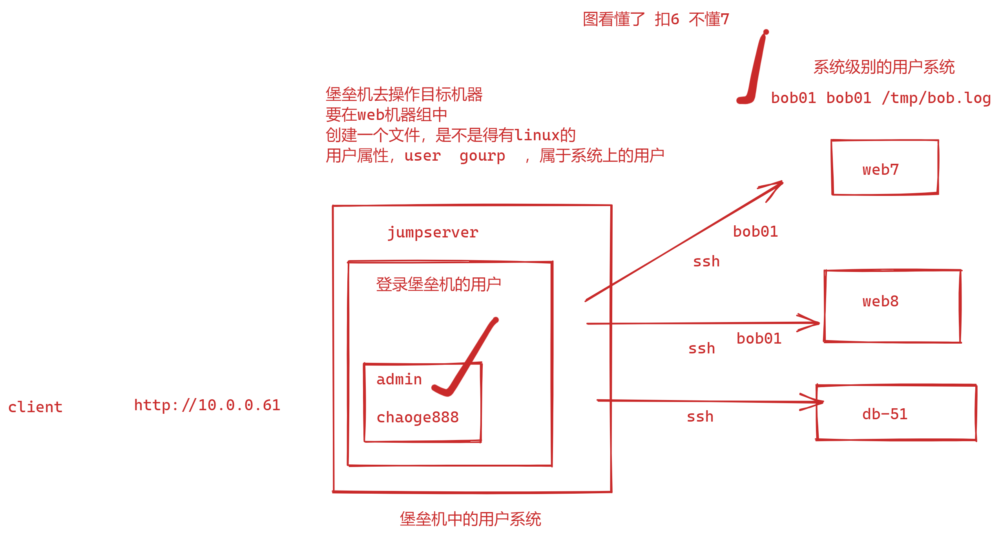
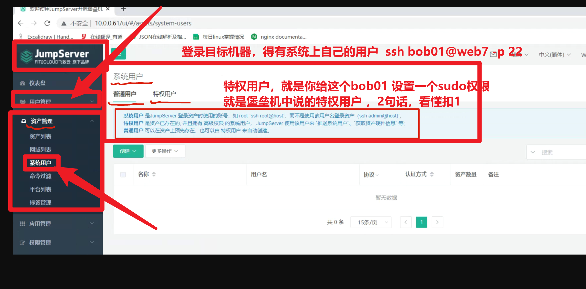

```### 此资源由 58学课资源站 收集整理 ###
	想要获取完整课件资料 请访问：58xueke.com
	百万资源 畅享学习

```
# 昨日练习


练习部署jumpserver所有组件，确保最终可访问


nginx配置上踩坑

内存上踩坑，cpu，内存，磁盘资源。

堡垒机组件，一台mastet-61机器，python程序core，nodejs程序，lina，luna，nginx

1G内存。。

2G都不够、、

python的core程序起不来。

free -m

1G  900M 剩余可控 60多M

master-61机器，至少给4G内存 2核cpu

# 重启所有的机器，再次启动程序，试试又会踩到多少坑


```
1. 重启master-61 和 db-51机器


[root@master-61 ~]#netstat -tunlp
Active Internet connections (only servers)
Proto Recv-Q Send-Q Local Address           Foreign Address         State       PID/Program name    
tcp        0      0 0.0.0.0:22              0.0.0.0:*               LISTEN      957/sshd            
tcp        0      0 127.0.0.1:25            0.0.0.0:*               LISTEN      1041/master         
tcp6       0      0 :::22                   :::*                    LISTEN      957/sshd            
tcp6       0      0 ::1:25                  :::*                    LISTEN      1041/master   


[root@db-51 ~]#netstat -tunlp
Active Internet connections (only servers)
Proto Recv-Q Send-Q Local Address           Foreign Address         State       PID/Program name    
tcp        0      0 0.0.0.0:6379            0.0.0.0:*               LISTEN      933/redis-server 0. 
tcp        0      0 0.0.0.0:22              0.0.0.0:*               LISTEN      909/sshd            
tcp        0      0 127.0.0.1:25            0.0.0.0:*               LISTEN      1019/master         
tcp6       0      0 :::3306                 :::*                    LISTEN      1008/mysqld         
tcp6       0      0 ::1:6379                :::*                    LISTEN      933/redis-server 0. 
tcp6       0      0 :::22                   :::*                    LISTEN      909/sshd            
tcp6       0      0 ::1:25                  :::*                    LISTEN      1019/master         
udp        0      0 0.0.0.0:123             0.0.0.0:*                           1247/ntpdate        
udp6       0      0 :::123                  :::*                                1247/ntpdate        
[root@db-51 ~]#


```

## 重新运行master-61的堡垒机所有组件

```
core服务  核心后台服务 python程序，1. 进入代码目录  2.激活虚拟环境  3.通过jms脚本运行所有程序 4.检查

lina服务  ，前端ui页面，网站的前端官网  1. 进入代码目录   2.通过前端命令，运行前端进程

luna 服务  ，提供网页版命令行的前端页面。。 1. 进入代码目录   2.通过前端命令，运行前端进程


koko服务 ，提供跳板机功能的程序，1. 进入代码目录 2通过 koko命令运行该进程


lion服务，提供vnc远程桌面的  1. 进入代码目录， 2. 命令启动即可


学会心中有架构的流程，这里理解 1

这里每一个组件都是，分离，独立的，有独立的进程，端口

分别运行后，互相调用http的 socket，对应进程的 ip:port 因此建立连接。


1. 运行lina进程
yarn serve 命令测试启动

后台 运行是
nohup yarn serve &

2. 出错解决思路

f12
无法和后端建立连接，看后端
服务器出错，继续启动别的服务

看机器运行的服务

参考思路如下：

1.访问独立的前端进程 10.0.0.61:9528 发现看不到内容，直接去f12看请求，不用思考
2.发现js文件正常，但是有一个请求错误，如下
http://10.0.0.61:9528/api/v1/settings/public/
通过url， /api/ 判断出这是后端接口的请求出错。也是开发设计好的url，代码中写好的，也会有对应的技术文档，告诉你
域名/api/ 这个请求就是发给后端的core服务的。
3.因此判断core服务肯定是有问题，至少他500了，。检查core即可
4.通过lina的运行日志，精确的判断出，前端的9528访问后端的8080出错，因此直接去查看后端的8080是否启动即可。
Proxy error: Could not proxy request /api/v1/settings/public/ from 10.0.0.61:9528 to http://localhost:8080.
See https://nodejs.org/api/errors.html#errors_common_system_errors for more information (ECONNREFUSED).


理解这个1234，以后你工作也得这么玩，扣1

隐藏的问题，确保你的lina前端是在后台运行的。


```


## 运行core后端，确保先让最主要的，前端，后端运行起来

```
1. 进入代码原目录


2. 激活虚拟环境
[root@master-61 /opt/jumpserver-v2.12.0]#source /opt/venv_py3/bin/activate
(venv_py3) [root@master-61 /opt/jumpserver-v2.12.0]#
(venv_py3) [root@master-61 /opt/jumpserver-v2.12.0]#

查看当前虚拟环境下的python解释器，安装了哪些依赖模块
(venv_py3) [root@master-61 /opt/jumpserver-v2.12.0]#pip3 list |grep psutil 
psutil                    5.6.6

因此证明，该激活的虚拟环境，拥有jms脚本运行所需的模块。

创建激活虚拟环境的别名
(venv_py3) [root@master-61 ~]#tail -2 /etc/profile

alias venv_jms='source /opt/venv_py3/bin/activate'


3.启动所有程序（检查你的内存情况）
[root@master-61 /opt/jumpserver-v2.12.0]#free -m
              total        used        free      shared  buff/cache   available
Mem:           7966         602        7078          11         285        7075
Swap:             0           0           0


4.确认后端运行的进程
(venv_py3) [root@master-61 ~]#/opt/jumpserver-v2.12.0/jms status
gunicorn is running: 8341
flower is running: 8729
daphne is running: 9114
celery_ansible is running: 9443
celery_default is running: 9568
beat is running: 9572


查看内存情况，看看后端大约吃了多少
(venv_py3) [root@master-61 ~]#free -m
              total        used        free      shared  buff/cache   available
Mem:           7966        1797        5687          11         481        5862
Swap:             0           0           0

发现大约core服务的几个进程，就占了大约1G内存，


5.测试core是否可访问，已知，前端，调用后端core的地址是8080端口

6.必须通过访问lina，才能看到core后端的内容
再一次证明，前后端分离开发模式
意思是
2个独立的进程，互相调用

client > 前端 > 后端core 

当你在同一个浏览器下访问，先登录core之后，因此当前浏览器，产生了cookie，有了身份标识，因此你访问前端lina的时候，无须登录，直接看到后端的数据了。

到这里，lina前端、core后端，以及部署完毕，整个过程涉及的，实践技巧，看懂扣  6


7. 别忘记，给你的后端设置为后台运行，

(venv_py3) [root@master-61 /opt/jumpserver-v2.12.0]#./jms start all -d 


```

## 下一个组件，luna组件，koko组件，lion组件，nginx入口整合

带着大家，一步步，细节的，搞明白，复杂的项目，每一个组件是如何通信，如何看请求，如何看日志，这样你在自己独立部署的时候，会有思路，能够解决问题，掌握这个技能，你才能应对生产环境中的各种随机问题。

理解扣6


```
1.在你没启动luna之前， 访问lina的前端，点击标签，向luna发请求
来看日志
请求走向是
9528的lina服务，请求的地址是  127.0.0.1:4200/luna
发现这里，luna服务是没启，因此，500报错。。。

Proxy error: Could not proxy request /luna/?_=1654826454342 from 10.0.0.61:9528 to http://127.0.0.1:4200/luna/.
See https://nodejs.org/api/errors.html#errors_common_system_errors for more information (ECONNREFUSED).


2.启动luna服务，这样你点击【web终端】的时候，luna才是正常的。

ng命令，需要你安装angular程序

后台启动即可
[root@master-61 /opt/luna-v2.12.0]#
[root@master-61 /opt/luna-v2.12.0]#nohup ng serve &


检测日志，以及端口，查看4200的luna是否运行


3. luna服务，由于这个v2.12源码版本存在前端bug，没法直接通过lina，跳转访问到luna服务你可以去下载最新的堡垒机代码，看官网教程，结合课堂的教程去部署。看最新的修复效果。

进过实测，这个的luna只能加上端口去访问，
因此windows中直接访问10.0.0.61:4200 要求该luna绑定运行在0.0.0.0上

但是在正确的部署换下，无bug的环境下，client用户是直接和nginx交互，在前后端分离部署的环境下，应用一般都是暴露在0.0.0.0需要对外提供访问，但是需要设置一些安全策略。简单理解即可。。

只需要理解，程序部署在127.0.0.1上只能在机器内部通信访问
如果说需要从外部访问，必须绑定在0.0.0.0上，
理解这个理念即可。未来你会用的上的。
理解扣 1


[root@master-61 /opt/luna-v2.12.0]#nohup ng serve --proxy-config proxy.conf.json --host 0.0.0.0 &


4.确认启动后，尝试去访问lina前端，然后点击web终端，查看luna

5.看到网页命令行页面，确认luna服务运行了。
http://10.0.0.61:4200/luna/?_=1654826454342

没问题扣6


```

### 下一个组件，koko组件

当你访问web终端时，需要调用koko组件，才能远程登录目标服务器。

浏览器 > luna发请求 ，前端，接收用户请求，构造网页命令行的展示形式，数据，还是要从后端机器上获取。

luna

↓（点击前端的，文件管理，或者连接资产，就会向koko发请求，通过日志即可看懂）

koko服务

```
通过查看luna的日志，查看请求的发送

[root@master-61 /opt/luna-v2.12.0]#tail -f nohup.out 


[HPM] Error occurred while trying to proxy request /koko/elfinder/sftp/ from 10.0.0.61:4200 to http://localhost:5000 (ECONNREFUSED) (https://nodejs.org/api/errors.html#errors_common_system_errors)


发现 请求是
from 10.0.0.61:4200 to http://localhost:5000

4200的luna服务要请求  5000端口的 koko服务，因此你要去部署koko服务了


这个很清晰的 扣 1


```

启动koko组件

```
1. 先前台运行，查看是否正确，再去后台运行

[root@master-61 ~]#netstat -tunlp|grep -E '5000|2222'
tcp6       0      0 :::5000                 :::*                    LISTEN      13645/./koko        
tcp6       0      0 :::2222                 :::*                    LISTEN      13645/./koko    

2.此时你可以去访问，lina，请求koko服务，查看koko的日志，看请求记录（koko其实就是一个web后端，基于golang的gin框架开发来的，因此你可以看gin框架的日志）


查看koko这个后台日志，信息如下，日志是帮你解决故障的第一要素
2022-06-10 10:54:28 [DEBU] Volume List: /收藏夹
[GIN] 2022/06/10 - 10:54:28 | 200 |   35.983388ms |       127.0.0.1 | GET      "/koko/elfinder/connector/_/?sid=e3d4d8a4-a103-41a3-b01b-ad5ce2e253f7&cmd=open&target=54b6092e972473c41d1c96671c4e71b1_L-aUtuiXj-WkuQ&reqid=1814b88d2e0c2"


这里能理解看日志操作的，扣 6


3. 此时你可以设置koko为后台运行了,并且找到koko记录的日志路径

[root@master-61 /opt/koko-v2.12.0]#find . -name *.log
./data/logs/koko.log
[root@master-61 /opt/koko-v2.12.0]#
[root@master-61 /opt/koko-v2.12.0]#
[root@master-61 /opt/koko-v2.12.0]#
[root@master-61 /opt/koko-v2.12.0]#
[root@master-61 /opt/koko-v2.12.0]#tail -f data/logs/koko.log 


4.然后再次访问koko的页面内容


5.至此，koko确认再次重启ok，完全看懂扣 1


```


## lion服务

```
直接启动即可
[root@master-61 /opt/lion-v2.12.0-linux-amd64]#nohup ./lion -f config.yml &
[3] 13750
[root@master-61 /opt/lion-v2.12.0-linux-amd64]#nohup: ignoring input and appending output to ‘nohup.out’


检查lion的端口，进程
[root@master-61 ~]#netstat -tunlp|grep lion
tcp6       0      0 :::8081                 :::*                    LISTEN      13750/./lion  


还差一个guacomole程序，是vnc的后端进程，还会再次发现，有些组件，由于是独立运行的，你不访问，也不报错。

不影响前后端的运行，目前主流的开发手段，程序的耦合性很低，不会导致，一个小组件没运行，其他都挂掉。

lion 
luna
core
koko
如果每一个组件耦合性很高，koko没起，其他前后端都无法运行。koko一更新，其他服务全挂掉。。
明显感到代码的开发模式差异性。。。


你会发现
每一个组件都是独立运行，最终组合为一个堡垒机提供服务的。

如果你更新koko代码，只要不用web终端，就不影响其他组件，堡垒机的官网不影响访问。
或者lina，core的，更新前后端，大操作，必然导致，前端挂掉，后端挂载。
更新小组件，不会影响整体系统，小组件更新完毕后，继续提供http的接口服务。
这个每一个组件，就是每一个接口的理念。。

听懂扣 6


最后，启动guacomole进程，提供vnc的底层协议解析。

[root@master-61 ~]#
[root@master-61 ~]#/etc/init.d/guacd start
Starting guacd: guacd[13842]: INFO:	Guacamole proxy daemon (guacd) version 1.3.0 started
SUCCESS
[root@master-61 ~]#
[root@master-61 ~]#
[root@master-61 ~]#
[root@master-61 ~]#ps -ef|grep guacd
root      13844      1  0 11:07 ?        00:00:00 /usr/local/sbin/guacd -p /var/run/guacd.pid
root      13846   1291  0 11:07 pts/0    00:00:00 grep --color=auto guacd


```

## nginx程序

```
1. 第一个是hosts文件的记录

[root@master-61 /opt/lion-v2.12.0-linux-amd64]#tail -1 /etc/hosts
10.0.0.61 luna koko lion core lina


2. 因为nginx.conf中用到了这些名字，生产环境下，会有前后端工程师配合你，做所有配置的域名解析。
这里你先用ip测试即可，得前后端的所有源代码中，也把ip改为公司的域名。
localhost，因此转变为 127.0.0.1即可

部署公司的域名 ，做好dns解析。


3.启动nginx即可

4、访问统一的入口
[root@master-61 ~]#nginx -t
nginx: the configuration file /etc/nginx/nginx.conf syntax is ok
nginx: configuration file /etc/nginx/nginx.conf test is successful
[root@master-61 ~]#
[root@master-61 ~]#
[root@master-61 ~]#nginx -s reload
[root@master-61 ~]#

5.最后，发现url，是以80位入口，确保nginx的反向代理都是ok的
http://10.0.0.61/ui/#/dashboard

6.到这里，堡垒机再次重启运行，以及启动每一个组件，需要查看的日志，与思路，完毕。

理解扣 6


```

# 堡垒机实践用法

## 修改密码

首次让你改了密码

后续想修改登录堡垒机的密码，修改的方法。

```
个人信息
登录密码设置
修改密码


更新账户密码，这是一个管理员角色的账户。
admin
chaoge888
```


## 管理员页面、区分、普通用户的页面

如下讲解，用户的角色权限理解，理解扣6

只要提及到用户相关，就必然有权限相关，并且有

- 权限比较大的用户角色，
- 权限较低的用户角色

```
linux系统的用户 /etc/passwd 中的，root超级用户，uid=0 超级用户，uid>1000的useradd创建的普通用户

mysql创建用户，1. 先创建用户 2.给用户授权


```


```
堡垒机的用户管理

这是一个web网站平台，必然得有用户管理系统

目前你用的账户，是系统内置的、管理员角色的admin，密码chaoge888，运维掌握

在公司部署了堡垒机之后，所有的服务器资产，必然要通过堡垒机进行二次登录。

因此做好权限控制

1. 运维掌握管理员角色的账户，去登录堡垒机，权限最大，可以对这个平台做很多事。
2. 运维要给开发、给测试、给其他人员开通登录堡垒机的账户，角色是普通用户，权限较低。

理解这个用户，给扣1


具体场景


运维老大，有一个堡垒机平台，管理员的账户，权限最大，可以增删改查服务器资产的信息，也可以继续添加其它的普通账号。
admin
chaoge666
这是管理员账户，可以看到堡垒机的管理页面，如所有服务器的大盘信息，如添加用户，等操作。
堡垒机的大盘页面，展示了服务器被使用的详细信息，只有管理员可见。


普通账号，给 开发小王，想登录，使用堡垒机，连接某个如数据库服务器。
运维老大，给他创建一个堡垒机上的普通登录账号，开发小王，用账号登录后，只能看到自己维护的一些服务器信息，连接这些机器，以及使用的权限也被限制了。


```


## 设置站点url

当你给堡垒机部署nginx之后，就是上线的操作了，堡垒机的入口应该是nginx定义的域名，端口。

看懂扣 1

```
堡垒机的系统设置，站点设置，你的堡垒机访问入口是这个地址
http://10.0.0.61
```


## 设置邮箱功能，堡垒机需要有运维的联系方式，可以在如出问题之后，自动给运维的邮箱，发送邮件

确保堡垒机可以给其他的客户端发邮件。

```
先给堡垒机设置，【邮件设置】
填写发件人的信息，堡垒机使用该信息，给其他客户端发邮件。

你需要去设置如 网易云的发件人信息
选择给堡垒机配置，我的 yc_uuu@163.com，且能给其他人发邮件，使用smtp发邮件协议。
设置你的邮箱授权码，也就是如密码的作用，。
MSRAIQZVAPITNLMT
注意这个授权码，就能登录你的邮箱了，不能发给别人。


或者是qq邮箱的发件人信息

目前来看，你的邮件设置，是能正确发邮件到互联网的，。

这里看懂扣 1


```

你登录堡垒机平台的用户，用户的邮箱，得和发件人的邮箱一致。

```
1. 你用amdin去登录的堡垒机

2. 基于admin设置的邮件功能，给别人发邮件。


3.待会自己再添加一个管理员账号，并非是这个amdin，那会，你和你自己的163邮箱绑定即可。

```

## 用户与资产管理

关于整合堡垒机，有如下用户


运维小张 > 登录堡垒机（xiaozhang01）   > 目标服务器资产（web7，/etc/passwd）

1. 堡垒机平台的

- 管理员用户
- 普通用户


2. 登录到目标资产的用户

最终你在这个linux上做操作，创建文件，运行程序的用户

- root超级用户
- 配置了sudo的用户，可以提权到root
- 没有sudo权限的普通用户，只能登录，基本操作


理解这类的用户关系的，扣 3，不懂4


# 堡垒机用户的作用

```
1. 登录web版本的堡垒机，不同角色，看到不同的页面，权限不一样

2. 此用户，同样适用于koko，因为koko和core读取的是同一套用户管理的数据库
权限也一样

其实你访问网页版的堡垒机，也是走的koko服务，去登录目标机器

具体用法如
ops01 linux0224

登录堡垒机，koko的密码
ssh ops01@10.0.0.61 -p 2222  linux0224

看懂扣 1


```


## 堡垒机用户创建案例

创建的堡垒机用户，用户登录这个系统的

当你访问  http://10.0.0.61时用这个用户

```
案例

根据要求创建创建堡垒机的用户。
都是管理员的角色，权限一样大。
管理员账号   ops01  linux0224 权限最大，可以登录web7 web8 db51 db52资产

普通用户，开发小王账号  xiaowang01  laowang666  可以登录db-51 db-52资产


```


## 创建用户

> 1. 重置密码的邮件，是你给平台设置的邮件发送功能，smtp邮件功能，设置一个发件人。
>
> 目前是重新设置了堡垒机的邮件设置，以qq邮箱发送。
>
> 这里看懂扣 1
>
> 2. 下一步，你可以主动，再给用户发一个密码重置的邮件。
>
> 用户点击重置连接，发现是一个发给core服务的密码重置url
>
> 理解扣3
>
> 

```
运维老大ops
ops01
此时的密码是  ops666
yc_uuu@163.com
default

密码策略是，首次登录，进行首次改密码。  http://10.0.0.61
这个用法是，直接给该用户的邮箱，发了个重置邮件。


普通用户，开发小王
xiaowang01  需要用户首次登录修改，默认是系统给的laowang666


到这里，看懂堡垒机用户创建的，
```

## 使用平台用户登录查看效果

### ops01用户是管理员角色，权限很大

```
ops01
ops666

看懂运维老大，ops01用户，和amdin一样是管理员的作用，理解扣6 


```

### 用普通用户，开发小王登录

```
xiaowang01
laowang666
首次登录要改密码
xw666666


普通用户，啥也看不到，只能维护自己被允许的资产（linux服务器）

```

下一步，创建资产，绑定给用户去管理即可。这就是堡垒机核心功能。

用户+资产。


# 资产的用户（简单说就是linux机器上具体的/etc/passwd用户而已）

最终得登录到目标服务器，进行基本的linux用户操作


ssh test01@10.0.0.61  -p 22

```
连接的是22端口，是sshd服务，是系统级别的用户


连接的是2222端口，是koko服务，是堡垒机的用户


理解扣 1，不懂2


```



----




# 资产创建，资产绑定用户

```
目前你的堡垒机，还没添加要管理的服务器，需要加入到堡垒机的资产列表中
才能去管理。

其一 用管理员去登录

资产管理
↓
资产列表
↓
添加database资产树目录
↓
添加2个db-51  db-52机器


```

### 添加资产，就是让堡垒机管理linux机器，你得有登录这些机器的用户吧。。

```
咱们目前已有的用户

堡垒机的平台用户
	ops01
	xiaowang01
	
系统用户（还没创建，用于登录具体的linux资产机器）
	yuyu01 给他系统sudo的权限，属于特权用户
	laoliu01  系统上的普通用户
	资产管理
	↓
	系统用户
	↓
	创建 yuyu01  laoliu01
	↓
	到这里，明确系统用户是什么的扣 1
	
先创建特权用户，就是可以执行sudo命令在linux上操作的用户
yuyu01 默认不能sudo


======================================================================
根据要求来看，这个特权用户 yuyu01 ，必须在目标机器上存在，且配置好sudo权限。

useradd yuyu01
passwd yuyu01
yuyu666

配置好sudo权限


至此，配置好了一个资产用户（特权用户），可以去操作资产，绑定资产了。
---------
创建laoliu01 ，系统上的普通用户，没有sudo权限的
手动去资产上先创建好。
useradd laoliu01
passwd laoliu01  # 设置密码 laoliu666


至此，你就又创建了第二个系统上的用户，权限很低。
给普通用户，加入到堡垒机平台上。


最后你在堡垒机上的，资产管理 >  系统用户  (普通用户 laoliu01 ，特权用户yuyu01)

看懂扣6  ，不懂7


	

```

## 给资产，绑定这个用户，然后可以改用户，去操作这些机器了。

```
用的ops01用户登录的机器
↓
创建资产 db-51 db-52
↓
绑定【管理用户、特权用户】，堡垒机会基于ansible，基于这个特权用户，去远程操作，否则权限太低
↓
机器添加完毕后，堡垒机，基于ansible的ping模块，远程执行，看是否可以挂管理这个机器
(ansible db-51  -m setup ，获取机器所有的远程信息，然后展示)

先理解就行，然后回去练习。


```

继续创建db-52，web7，web8机器，都是用yuyu01这个特权用户，去远程执行ansible的命令。

后面操作都一样，大家看好。

```
至此，资产列表 > database组 > db-51 db-52连接成功，看懂扣 6
下一步，web组 > web7 web8，特权用户，得在这些机器上存在

useraddd yuyu01
# 踩坑了，得有密码，你用的这个yuyu01 在创建特权时是设置了密码的， yuyu666
passwd yuyu666
# 这个底层堡垒机的做法就是，例如你用ansible去管理机器
至少得在主机清单文件里，写好用户名，以及用户密码，默认走ssh去连接，去远程执行命令。。
这个理解扣6


配置sudo文件，这个操作是针对你执行sudo以root身份运行时，不用输入密码的意思

sudo ls /root/
提示你让你输入当前用户的密码
这里记得扣 1

[root@web-7 ~]#grep 'yuyu01' /etc/sudoers
yuyu01	ALL=(ALL) 	NOPASSWD: ALL


----
web7好了之后，继续web8
资产信息，右侧的，快速更新，其实就是封装了2个ansible的命令，
一个是获取主机的硬件信息
一个是ping模块的执行
看懂扣 1


```

### 总结，至此，四个资产，服务器已经创建完毕


## 题目要求

> 这个堡垒机的用户+linux的用户，会比较恶心。。比较难理解。。
>
> 先听懂，看懂老师的操作。
>
> 然后完成如下的这个作业题，就能捋清楚了。


```
案例

根据要求创建创建堡垒机的用户。
都是管理员的角色，权限一样大。


管理员账号   登录堡垒机的账户ops01  linux0224
	权限最大，可以登录web7 web8 db51 db52资产(登录这些机器，走ssh的用户是谁呢？)

普通用户，登录堡垒机的开发小王账号  xiaowang01  laowang666 
	可以登录db-51 db-52资产 (登录这些机器，走ssh的用户是谁呢？)


这道题,涉及2个用户

1. 用什么账号登录堡垒机平台

2. 登录堡垒机之后，用什么用户去登录linux系统


======================================================================
玩法1.
权限最大的玩法，管理员+特权用户
【ops01 登录平台+  yuyu01(特权用户)走ssh登录目标机器】

web组  db组，直接给ops01，授予访问default大组权限即可。
踩坑在了这里，你给这个规则，绑定了节点，导致所有资产树的节点，都有这个规则

给ops01，绑定defuault节点，以及四个机器。


【权限管理 > 资产授权】


玩法2
权限很小，普通用户+普通系统用户
xiaowang01 +  laoliu01(ssh登录机器)


当前你已经创建好了第一条，资产授权访问的规则，名字是 ops01-defualt-all-server

使用ops01用户去管理四个资产机器。

完事之后，你用ops01，进入到它的，【用户界面】
即可查看该ops01用户，允许操作哪些机器。

使用ops01，发现可以管理四个资产机器，点击登录后
网页版命令行，自动选择，你刚才授权的yuyu01用户，走ssh协议，登录了目标机器。

看懂扣 666
到这里，第一道题，完成了，继续第二道题。


======================================================================
这个解释，能捋清楚的 ，扣666，蒙了。777


目前你做好的环境是
平台的
ops01  管理员
xiaowang01  普通平台用户


系统的用户
yuyu01 可以sudo的ssh用户
laoliu01 只能ssh登录的普通用户

添加好的资产
db-51 db-52        database组
web-7 web-8        web组


到这里依然很清晰的，扣 111


最后一步，就是将平台的用户，和这些资产做授权， 

某个用户只能访问某个资产。

======================================================
完成结果是，确保，xiaowang01登录后，只能看到db组的机器，且只能用户laoliu01去登录，权限低的离谱。

1. 这个授权的操作，必然得是管理员才行，因此你如果怕懵，你可以用admin去操作。
添加授权规则

xiaowang01-db-server
这个规则创建结束。

试着访问看看。
xiaowang01
xw666666


```


### 用户实践2，添加用户组，普通用户与资产授权

具体的练习要求

```
要求一：
ops01平台用户，默认属于default用户组，授权管理的机器是 所有机器，所有节点，default节点树

当你用ops01用户登录，可见，可维护所有机器，四个机器节点，且用特权用户 yuyu01登录的ssh用户。

到这里，很清晰的扣6

要求二：
踩坑在了，这个普通用户，和ops01都属于default组，错在这里了。


基于普通账号 xiaowang01 ，去登录平台，且只允许访问 db-51，db-52资产。

1. 先添加一个用户组，独立的用户组
针对所有的开发人员，创建一个dev组

2. 修改xiaowang01用户，属于的组，改为dev


3. 创建资产授权规则
xiaowang01-dev-db授权规则
xiaowang01
dev
db51 db-52
laoliu01 

整体创建了个规则，到这里，清晰的扣 1


```


# 会话管理

能看到当前谁登录了堡垒机，操作目标资产。


# 会话监控

实时，看到此人在干啥


# 强制下线

去你的吧，你赶紧给我下线，老六。

```
[laoliu01@db-51 ~]$
[laoliu01@db-51 ~]$echo 我还在这嘚瑟呢
我还在这嘚瑟呢
[laoliu01@db-51 ~]$
[laoliu01@db-51 ~]$echo 嘿嘿嘿
嘿嘿嘿
[laoliu01@db-51 ~]$
[laoliu01@db-51 ~]$echo 貌似不行啊老弟
貌似不行啊老弟
[laoliu01@db-51 ~]$
[laoliu01@db-51 ~]$
管理员终断连接
Receive Connection closed

堡垒机的这个功能是python web开发的一个任务系统，消息队列，需要远程执行命令，有等待时间。。
及时性没那么高。你要想在这时间内，删库，豪华号子套餐等你，


```


# 视频回放

你所有的登录堡垒机的操作，都被人盯着呢，录制屏幕下来了。想跑你也跑不掉。

在线的历史会话记录，无法记录用户如vim后续的操作，

但是视频功能记下来了。

```
找到刚才vim写入/tmp/laoliu.log的操作

历史会话记录，找到其他员工的操作，视频回放记录，看懂扣 111

责任划分至，就很清晰了，别想背黑锅。


```


# 命令历史记录

```
堡垒机，针对每一个会话，每一个
用户> 目标资产，建立了一个ssh，连接，就是一个会话，就会被堡垒机监控，录屏。

这个堡垒机所有功能，都支持master-61上的一些进程而已，以及一些文件而已
linux一切皆文件。


```


# koko跳板机

```
只要你能够连接到 堡垒机服务器的 2222端口即可 登录跳板机

以后所有ssh请求，只能走堡垒机的koko服务，2222端口，提供了5000端口。
你所有的连接请求，都走的koko，koko会被这些记录，全部返回给core服务，在会话管理中记录。

maste61
↓

登录其他资产
如web7 web8 nfs-31等，但是需要你在堡垒机中添加这些资产信息


测试
client > 172.16.1.61:2222  登录koko


实践，分别以 ops01 和 xiaowang01登录


ssh xiaowang01@172.16.1.61 -p 2222


最后，发现ssh连接koko的会话，中断了，历史视频也就结束了。


测试用admin用户登录，发现权限最大，可以看到所有的机器，且是特权用户yuyu01


```


# 其余堡垒机的功能

1.看堡垒机官网的文档资料

2.在堡垒机的页面上，点击各种功能，继续研究。

3、 到这里，就已经基于一个成熟的前后端分离运维工具，堡垒机，练习项目部署的过程，以及用法实践，恭喜你，完结撒花。


# 今日作业

  1.继续完成堡垒机的部署，确保会部署，玩明白，前后端分离的部署流程，确保重启机器，自己能每次都正确启动。

2. 演示今天所讲的功能使用即可，跟着笔记操作，重点难点，在 用户创建+资产创建+用户资产绑定+授权规则。
3. 具体后续，等我安排，先吧堡垒机作业搞定。


