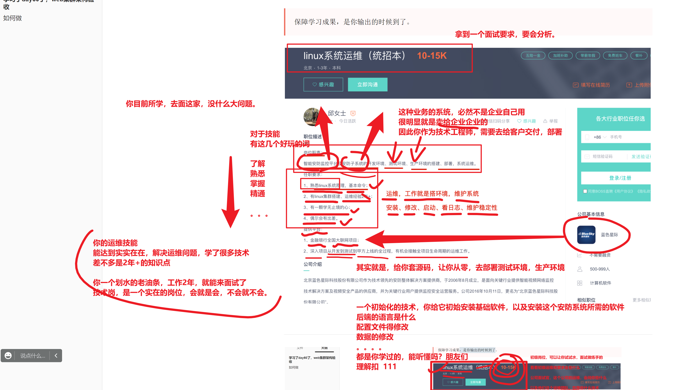
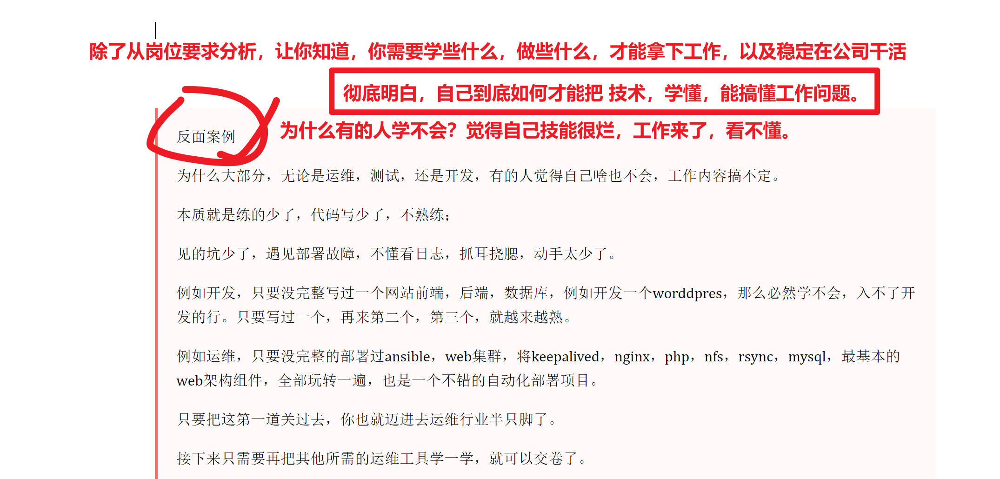
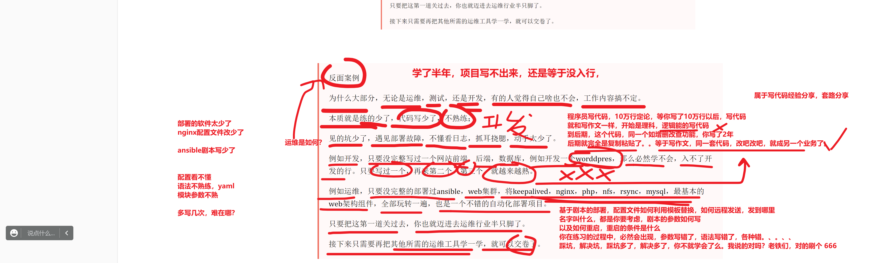
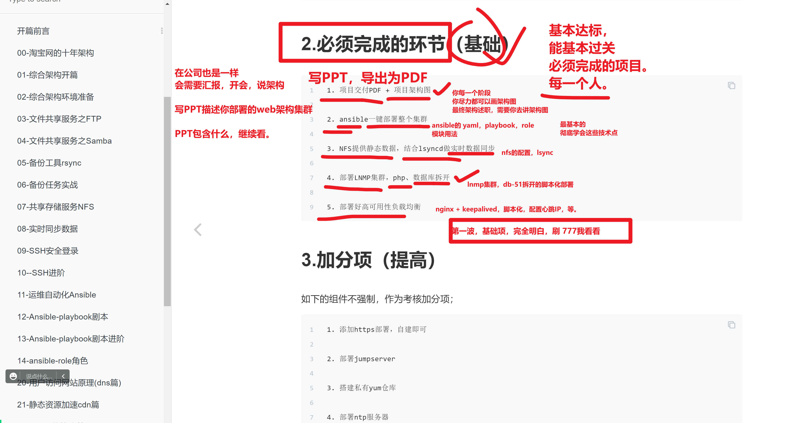

```### 此资源由 58学课资源站 收集整理 ###
	想要获取完整课件资料 请访问：58xueke.com
	百万资源 畅享学习

```


# 学习了day60了，web集群架构验收

也是等于你的第一次面试，看看你学的技能，能达到初级运维，工作水准吗？

如过关，你已经可以去试一试了（这个意思而已，单纯的指技术点）

别别，，不是让你投简历。。。


> 保障学习成果，是你输出的时候到了。


---





在学完了运维集群部署后，你需要掌握的精髓能力是

- 拿到一套公司的源码程序，能根据文档，理解程序需要部署的系统平台、要求安装的系统依赖包，如何修改配置文件，路径都在哪，就和你部署jumpserver一样
- 以及所谓的运维部署生命周期，就是如从零部署一套新环境，该软件源码的后端，是什么编程语言，你需要装哪些环境，前端需要准备些什么。数据库需要安装什么版本
- 除了软件包，静态文件，还有就是数据库的安装，数据导入等。
- 基本上，我们接触到的软件有两类
- 一类是纯后端，直接linux上运行，提供某种协议的访问接口，以http居多，或者其他协议。
  - 你可以立即如mysq运行提供的数据库访问
  - 如koko服务运行后，提供的ssh连接。
- 另一种是web端应用，有前后端，结合工作。以LNMP架构为主。


那么接下来，你的任务，就是要输出了，当做你第一次的面试，如何能轻松达到10k的招聘要求。

完成ansible一键部署web集群的自动化能力，除了能让你达到这个工作水准，更重要的是，的的确确做出来了这个综合大练习，你就能维护这样的工作内容了。

基本上小公司，就是ansible+shell+LNMP集群+持续发布=10~20k ，看个人心理素质，面试情况不同。

然后就是我们课程剩下的知识点，用于应对更高级的运维岗工作。


说到这里，依然理解扣  777








> 反面案例
>
> 为什么大部分，无论是运维，测试，还是开发，有的人觉得自己啥也不会，工作内容搞不定。
>
> 本质就是练的少了，代码写少了，不熟练；
>
> 见的坑少了，遇见部署故障，不懂看日志，抓耳挠腮，动手太少了。
>
> 例如开发，只要没完整写过一个网站前端，后端，数据库，例如开发一个worddpres，那么必然学不会，入不了开发的行。只要写过一个，再来第二个，第三个，就越来越熟。
>
> 例如运维，只要没完整的部署过ansible，web集群，将keepalived，nginx，php，nfs，rsync，mysql，最基本的web架构组件，全部玩转一遍，也是一个不错的自动化部署项目。
>
> 只要把这第一道关过去，你也就迈进去运维行业半只脚了。
>
> 接下来只需要再把其他所需的运维工具学一学，就可以交卷了。

-----

面试会遇见N种人，技术，能来面试你的，都是大佬，也别太关注他是否是大佬，和你没关系，你只要关心，你自己会多少，你自己技能达到工作水准

- 和技术无关的，面试官，就是在这家工作的技术员而已，技术必然是达到工作水准的。
- 友好的面试官
- 比较烧饼的面试官


像这样的一些小公司，就可以去试试水，蹭蹭面试经验，体验下，面试流程

看人家到底会问你些什么，需要你掌握些什么。


好了，未来的方向说完了。

踏踏实实的搞技术，把这个综合架构，认真做，确保做好，做正确。


> 期中架构述职过程中，你得演示你部署的系统是完全正确的，要发表文章，发评论，登录后台管理。

> 这个意思必然是为了保障你部署的系统，前端高可用性负载均衡，后端，数据库的请求调用都是正确的。
>
> 是无bug的，你作为一个工程师，得对你的项目负责，确保正确性。


还有就是根据博客中要求的，架构述职流程讲解即可。

# 如何做

- 都是学过的知识
- 只不过这一次，是完全需要你自己，自主思考，锻炼你独立解决复杂架构自动化部署的能力
- 部署好了，web集群，你也玩的差不多了，心中也有数了。
- 尽全力，自己先憋，每一步的脚本如何写，配置文件如何发送
- 不到憋进死胡同，出不来了，快要废了，那时候再去请教别人，否则永远都只是人家懂了，你不懂。
- 冲吧兄弟们，蜕变的时候到了。


# 具体怎么做，做什么？

http://ebook-p2.apecome.com/02-%E7%BD%91%E7%AB%99%E9%83%A8%E7%BD%B2%E7%AF%87/32-%E6%9C%9F%E4%B8%AD%E7%BB%BC%E5%90%88%E6%9E%B6%E6%9E%84%E9%AA%8C%E6%94%B6.html


---



---


## 补充。。。加大难度，确保slb的keepalived，脑裂脚本也加在自动化部署中

来吧，不差这一个。

看懂意思的，刷 666

叶小爷这句话有意思。。。


---


---


----

```
数据库，目前没学mysql的内容，db-51一个就够。

web服务器，web7和web8就可以。

其他的是必须的。


```


---


连夜买车票想跑路的，来我这，登记一下。


# 我给大家演示一波，大致什么流程

演示ansible操作，是在你讲完ppt之后最后一步，因为安装过程可能较久，

1. 先把ansible环境讲解下，然后执行安装脚本，等待过程中
2. 讲解你的ppt
3. 理解回复111

- 每一台机器，全部恢复到 初始化好 ip-主机名，即可。
- 先用ansible检测下机器，是否远程管理正常，检查你的ansible配置。

```
[root@master-61 /etc/ansible]## 因此到这里，确认web集群的机器，通信正常，ansible管理正常，看懂666
[root@master-61 /etc/ansible]#
[root@master-61 /etc/ansible]#
[root@master-61 /etc/ansible]#
[root@master-61 /etc/ansible]#ansible all -m shell -a 'hostname;free -m'

```

- 演示安装

```
[root@master-61 /etc/ansible]#bash all-server-start.sh 

PLAY [db] ******************************************************************************************************************************************************************************

TASK [Gathering Facts] *****************************************************************************************************************************************************************
ok: [172.16.1.51]

TASK [mariadb_server : copy yum repo] **************************************************************************************************************************************************
changed: [172.16.1.51]

TASK [mariadb_server : install mariadb-server client] **********************************************************************************************************************************

```

在这个安装等待的时候，你可以讲ppt了

> 最终ansible的剧本执行，会有一个paly recp，也就是执行结果的回复
>
> 你得确保没有错误。没有failed

```
PLAY RECAP *******************************************************************************
172.16.1.41                : ok=8    changed=6    unreachable=0    failed=0    skipped=0    rescued=0    ignored=0   

```

> 别追求速度，追求，功能的完善性，完整性，正确性。、你们要认真的去写，思考剧本的逻辑，如何用高级语法

> 这都是为了你能力增长，面试过程中，自信的部分。

db

rsync

nfs

web

slb


## 结果

你必须的演示的部署，不准存在任何的failed，这是生产环境下不允许的。


```
PLAY RECAP *****************************************************************************
172.16.1.6                 : ok=7    changed=3    unreachable=0    failed=1    skipped=0  rescued=0    ignored=0   

```

# 最终访问

浏览器，直接去访问你要绑定的域名，VIP


wordpress.yuchaoit.cc


> 我建议大家，去演示，检查nfs，rsync数据的时候，通过jumpserver去登录目标资产，检查数据
>
> 这样的项目操作更完整，理解刷 111

那我这里，基于ansible去检查了。


下一步，演示负载均衡的VIP漂移。


至此，高可用性的，web负载均衡集群，vip票以后，架构也不受影响，用户感知不到网站出了点问题。

最后你就可以发表感谢环节了。


