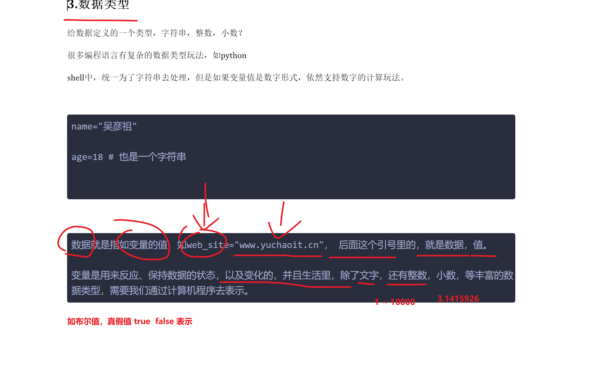

```### 此资源由 58学课资源站 收集整理 ###
	想要获取完整课件资料 请访问：58xueke.com
	百万资源 畅享学习

```
# 变量复习脑图


# 1.特殊变量具体场景

```bash
$@和$* 
都可以将用户给脚本传递的多个位置参数，提取为一个单个的数据，当你直接echo打印查看这俩特殊变量的值。

# 1. 直观来看 这俩特殊变量的作用，直接打印，不去for循环取值

#!/bin/bash

echo "---\$@---- 您给脚本传入的参数是：$@"

echo "==============================================="

echo "----\$*-----您给脚本传入的参数是：$*"


#执行案例
[root@m-61 ~/part3-shell]#
[root@m-61 ~/part3-shell]#bash test-var.sh yu1 yu2 yu3 yu4 yu5 yu6 yu7 yu8 yu9 yu10
---$@---- 您给脚本传入的参数是：yu1 yu2 yu3 yu4 yu5 yu6 yu7 yu8 yu9 yu10
===============================================
----$*-----您给脚本传入的参数是：yu1 yu2 yu3 yu4 yu5 yu6 yu7 yu8 yu9 yu10
[root@m-61 ~/part3-shell]#
[root@m-61 ~/part3-shell]#
[root@m-61 ~/part3-shell]#
[root@m-61 ~/part3-shell]## 看懂刷3333，直接打印，看不出区别
[root@m-61 ~/part3-shell]#
[root@m-61 ~/part3-shell]## 看懂刷3333，直接打印，看不出区别 ，都是将参数整合为一个整体


# 具体区别是
$@  在整合所有参数之后，依然还可以区分单个元素

$*  在整合所有参数之后，,且是将所有位置参数，整合单个字符串

请看如下案例，用法，理解下使用场景


```


案例，创建多个用户

你会给脚本传入很多的用户名，需要一次性创建。。。

```bash
# 但是结果如你意吗？应该如何改？


# 希望的是创建系统用户，用这些传入的用户名


# 脚本开发思路


# 先接收所有用户的输入，再批量创建用户
# 你不知道参数的个数具体有多少，，因此没法这样去写，听懂刷1111
# 因此，你会想到，用$@ 和 $* 能一次性提取用户输入的所有参数，再后续处理，for循环提取每一个元素

# 你只要用这俩特殊变量，就给加上双引号，且必须加
# 用$* 对吗？不对，得用 "$@"
#!/bin/bash

for user in "${@}"
do
	echo "用户创建中。。。${user}"
	useradd  ${user}
	echo "检查该用户是否存在 $( id ${user} )"
	# 看懂333，不懂444
done


# 测试执行
bash for_user.sh yu1 yu2 yu3 yu4 yu5 yu6 yu7 yu8 yu9 yu10

# 总结，发现，该场景，无法用 $* 符号批量循环创建，为什么？思考下，以及如何正确去循环创建
# 练习10分钟，课件休息，答案发到微信群里。


清晰 "$@"  和"$*" 使用的场景之一了。


```


# 2.常量

```
常量在shell中没有严格的语法支持，但是只有约定俗称的写法（全大写），以及通过命令强制性转为常量；
在其他数据类型更丰富的语言中，支持设定

普通变量，如name，age（如果age设置为常量，你理解下是什么意思，这种bug，常出现于初级开发的代码中。。）

常量，如月份，是固定的12个月，因此只能设定为无法修改的值，就是常量。
```


```
自己玩一玩

readonly ZHANGSANFENG_AGE=500

[root@m-61 ~/part3-shell]#readonly ZHANGSANFENG_AGE=500
[root@m-61 ~/part3-shell]#
[root@m-61 ~/part3-shell]#
[root@m-61 ~/part3-shell]#set |grep -i zhangsanfeng
ZHANGSANFENG_AGE=500
_=ZHANGSANFENG_AGE
[root@m-61 ~/part3-shell]#
[root@m-61 ~/part3-shell]#
[root@m-61 ~/part3-shell]#
[root@m-61 ~/part3-shell]#ZHANGSANFENG_AGE=600
-bash: ZHANGSANFENG_AGE: readonly variable
[root@m-61 ~/part3-shell]#


```


# 3.数据类型

给数据定义的一个类型，字符串，整数，小数？

很多编程语言有复杂的数据类型玩法，如python

shell中，统一为了字符串去处理，但是如果变量值是数字形式，依然支持数字的计算玩法。


```
name="吴彦祖"

age=18 # 也是一个字符串


```


```
数据就是指如变量的值，如web_site="www.yuchaoit.cn"， 后面这个引号里的，就是数据，值。

变量是用来反应、保持数据的状态，以及变化的，并且生活里，除了文字，还有整数，小数，等丰富的数据类型，需要我们通过计算机程序去表示。
```



了解即可。具体目前依然以shell的语法规则来学习理解，。


## 具体的，shell的数据类型有哪些，以及如何用


### 数字


---


# 4.变量数值计算


## 基本语法，符号


```
这里基于变量进行数学计算的玩法，太多，语法太多，看懂，做好笔记即可

未来需要用到数字计算，选择其中一个你用的顺手的命令即可


```


## 基于命令进行数学计算

- 直接对数字计算
- 对变量值进行计算

### expr

```
[root@m-61 ~/part3-shell]#expr 3 + 4
7
[root@m-61 ~/part3-shell]#
[root@m-61 ~/part3-shell]#
[root@m-61 ~/part3-shell]#expr 3 - 4
-1
[root@m-61 ~/part3-shell]#expr 3 * 4
expr: syntax error
[root@m-61 ~/part3-shell]#
[root@m-61 ~/part3-shell]#
[root@m-61 ~/part3-shell]#expr 3 \* 4
12
[root@m-61 ~/part3-shell]#
[root@m-61 ~/part3-shell]#
[root@m-61 ~/part3-shell]#expr 3 / 4
0
[root@m-61 ~/part3-shell]#expr 10 / 2
5
[root@m-61 ~/part3-shell]#
[root@m-61 ~/part3-shell]#
[root@m-61 ~/part3-shell]#
[root@m-61 ~/part3-shell]## expr命令要求运算符两边有空格、有些特殊符号需要转义，看懂1111
[root@m-61 ~/part3-shell]#


变量的数学计算

[root@m-61 ~/part3-shell]#n1=16
[root@m-61 ~/part3-shell]#
[root@m-61 ~/part3-shell]#n2=4
[root@m-61 ~/part3-shell]#
[root@m-61 ~/part3-shell]#
[root@m-61 ~/part3-shell]#expr ${n1} + ${n2}
20
[root@m-61 ~/part3-shell]#
[root@m-61 ~/part3-shell]#expr ${n1} - ${n2}
12
[root@m-61 ~/part3-shell]#
[root@m-61 ~/part3-shell]#
[root@m-61 ~/part3-shell]#expr ${n1} \*  ${n2}
64
[root@m-61 ~/part3-shell]#
[root@m-61 ~/part3-shell]#
[root@m-61 ~/part3-shell]#
[root@m-61 ~/part3-shell]#expr ${n1} /  ${n2}
4

```


### `$(())`

```
双小括号，这种符号，也是用于数学计算才使用。

[root@m-61 ~/part3-shell]#
[root@m-61 ~/part3-shell]#
[root@m-61 ~/part3-shell]#echo $(( ${num1} + ${num2}   ))
15
[root@m-61 ~/part3-shell]#
[root@m-61 ~/part3-shell]#
[root@m-61 ~/part3-shell]#echo $(( ${num1} - ${num2}   ))
9
[root@m-61 ~/part3-shell]#
[root@m-61 ~/part3-shell]#
[root@m-61 ~/part3-shell]#echo $(( ${num1} * ${num2}   ))
36
[root@m-61 ~/part3-shell]#
[root@m-61 ~/part3-shell]#
[root@m-61 ~/part3-shell]#echo $(( ${num1} / ${num2}   ))
4
[root@m-61 ~/part3-shell]#
[root@m-61 ~/part3-shell]#
[root@m-61 ~/part3-shell]## 看懂 $((变量计算表达式)) 写法，刷 3333 
[root@m-61 ~/part3-shell]#
[root@m-61 ~/part3-shell]#

```

### $[]

```
建议用这个写法，比较直观，易懂


[root@m-61 ~/part3-shell]#echo "计算结果是：$[ $num1 + $num2 ]"
计算结果是：15
[root@m-61 ~/part3-shell]#
[root@m-61 ~/part3-shell]#
[root@m-61 ~/part3-shell]#
[root@m-61 ~/part3-shell]#echo "计算结果是：$[ $num1 - $num2 ]"
计算结果是：9
[root@m-61 ~/part3-shell]#
[root@m-61 ~/part3-shell]#
[root@m-61 ~/part3-shell]#
[root@m-61 ~/part3-shell]#echo "计算结果是：$[ $num1 * $num2 ]"
计算结果是：36
[root@m-61 ~/part3-shell]#
[root@m-61 ~/part3-shell]#

[root@m-61 ~/part3-shell]#
[root@m-61 ~/part3-shell]#echo "计算结果是：$[ $num1 / $num2 ]"
计算结果是：4
[root@m-61 ~/part3-shell]#
[root@m-61 ~/part3-shell]#
[root@m-61 ~/part3-shell]#echo "计算结果是：$[ $num1 / $num2 * 8 ]"
计算结果是：32
[root@m-61 ~/part3-shell]#
[root@m-61 ~/part3-shell]#echo "计算结果是：$[ $num1 / $num2 * 8 + 3*2 ]"   
计算结果是：38

```


### let

强烈建议，直接用 

```
$[] 这种写法，用的居多。

```


```
计算命令
语法如下

let  结果变量=变量1 运算符 变量2

不得有任何得空格，得连起来写


[root@m-61 ~/part3-shell]#let  result=${num1}+${num2}
[root@m-61 ~/part3-shell]#
[root@m-61 ~/part3-shell]#
[root@m-61 ~/part3-shell]#
[root@m-61 ~/part3-shell]#let  result2=${num1}-${num2}
[root@m-61 ~/part3-shell]#
[root@m-61 ~/part3-shell]#
[root@m-61 ~/part3-shell]#let  result3=${num1}*${num2}
[root@m-61 ~/part3-shell]#
[root@m-61 ~/part3-shell]#
[root@m-61 ~/part3-shell]#let  result4=${num1}/${num2}
[root@m-61 ~/part3-shell]#
[root@m-61 ~/part3-shell]#
[root@m-61 ~/part3-shell]#
[root@m-61 ~/part3-shell]#echo $result  $result2 $result3  $result4
15 9 36 4
[root@m-61 ~/part3-shell]#
[root@m-61 ~/part3-shell]#
[root@m-61 ~/part3-shell]## 简单看懂 刷11111
[root@m-61 ~/part3-shell]#

```

### bc命令计算变量的数据

```
[root@m-61 ~/part3-shell]#
[root@m-61 ~/part3-shell]#echo $num1+$num2 |bc
15
[root@m-61 ~/part3-shell]#
[root@m-61 ~/part3-shell]#echo "$num1 - $num2" |bc
9
[root@m-61 ~/part3-shell]#
[root@m-61 ~/part3-shell]#echo "$num1 *  $num2" |bc
36
[root@m-61 ~/part3-shell]#
[root@m-61 ~/part3-shell]#
[root@m-61 ~/part3-shell]#echo "$num1 /  $num2" |bc
4
[root@m-61 ~/part3-shell]#
[root@m-61 ~/part3-shell]#
[root@m-61 ~/part3-shell]##看懂 111

```

你知道有多种命令，多种语法，也就是以后再解决问题的时候，可以考虑到不同的场景，自己去选择最合适，自己最能理解的写法即可，写代码，千变万化，没有什么标准答案，能尽量少bug的完成最终结果，即可。


```
比如你这一周的任务，是写一个数据库备份脚本

领导只想看到，你的确完成了数据库备份，他看到备份的数据就放心了，不关心你到底咋写的
领导没时间去看你的代码，只关心结果。

你的程序是否按要求
1 定时的， 每周5的凌晨3点 ，crontab -l
2 备份到指定目录，路径对不对  /backup/
3 备份的数据文件，是否按要求添加了时间戳 ，且要压缩 /backup/mysql.sql.2022-06-23.tar.gz 


领导就根据这些标准，结果，验证你的工作情况。
你的脚本，不管你怎么写的，但是结果要保证这些细节。
听懂理解 666666


[root@m-61 ~/part3-shell]## 这里的写法，涉及到 awk的引号细节，awk调用shell变量的引号细节，比较高级，绕，先简单记住语法即可
[root@m-61 ~/part3-shell]#
[root@m-61 ~/part3-shell]#
[root@m-61 ~/part3-shell]#
[root@m-61 ~/part3-shell]#
[root@m-61 ~/part3-shell]#awk 'BEGIN{print  "'${num1}'" + "'${num2}'"     }'
15
[root@m-61 ~/part3-shell]#
[root@m-61 ~/part3-shell]#awk 'BEGIN{print  "'${num1}'" - "'${num2}'"     }'
9
[root@m-61 ~/part3-shell]#
[root@m-61 ~/part3-shell]#awk 'BEGIN{print  "'${num1}'" * "'${num2}'"     }'
36
[root@m-61 ~/part3-shell]#
[root@m-61 ~/part3-shell]#
[root@m-61 ~/part3-shell]#awk 'BEGIN{print  "'${num1}'" / "'${num2}'"     }'
4
[root@m-61 ~/part3-shell]#
[root@m-61 ~/part3-shell]#
[root@m-61 ~/part3-shell]#
[root@m-61 ~/part3-shell]## 能大致看懂，理解上述的注释，以及写法， 刷 3333
[root@m-61 ~/part3-shell]#
[root@m-61 ~/part3-shell]## 能大致看懂，理解上述的注释，以及写法， 刷 3333 ，回头写作业时候，自己在慢慢琢磨即可。
[root@m-61 ~/part3-shell]#


```

# 5.语法学完了，看练习题

```
根据系统时间打印出，今天、明天的时间； 至少3种写法，用上述的3种数学计算命令即可


[root@m-61 ~/part3-shell]#echo "今天是 $(date +%d) 号"
今天是 23 号
[root@m-61 ~/par

# 外层用 $[] 进行变量的数学计算， 内层用  $( 提取今天的日期 )
[root@m-61 ~/part3-shell]#echo "明天是  $[   $(date +%d)    + 1       ] 号"
明天是  24 号


[root@m-61 ~/part3-shell]#echo "去年是 $[ $(date +%Y) - 1 ] 年"
去年是 2021 年


主要就考察， 基于date来获取不同的时间结果


提取日期的格式化
[root@m-61 ~/part3-shell]#echo  "当前日期是  $(date +%Y-%m-%d-%T)"
当前日期是  2022-06-23-11:33:54
[root@m-61 ~/part3-shell]#
[root@m-61 ~/part3-shell]## 看懂 111


2.根据系统当前时间，今年还剩下多少个星期

需求拆解，
1. 判断今年还剩下多少天，2. 除以7 不就完事么。


[root@m-61 ~/part3-shell]#echo "今年过去了 $(date +%j) 天"
今年过去了 174 天
[root@m-61 ~/part3-shell]#
[root@m-61 ~/part3-shell]#


[root@m-61 ~/part3-shell]#
[root@m-61 ~/part3-shell]#echo "今年还剩下 $[ 365 - $(date +%j)]天"
今年还剩下 191天

还剩下多少个星期
[root@m-61 ~/part3-shell]#echo "今年还剩下 $[ (365 - $(date +%j)) / 7 ] 个星期"
今年还剩下 27 个星期


```


## 6. 简易版计算机开发（结合逻辑控制语句后，不断优化该计算器版本）

方案1，交互式接收用户输入

用read命令去写，更像计算器

```bash
3
+
6

echo "结果是  9 "

# 代码


#!/bin/bash

read -p "please input first num："  num1

read -p "please input sign ："  sign 

read -p "please input second num：" num2


# 计算结果，使用数学计算表达式  $[ ]

echo "计算结果是：$[ ${num1} ${sign}  ${num2}    ]"


# 执行结果，你先完成最基本的，语法学习，语法会用了，再不断打磨 v1 v2 v3 版本的高质量代码，慢慢来，欲速则不达。


[root@m-61 ~/part3-shell]#bash calc.sh 
please input first num：8
please input sign ：/
please input second num：2
计算结果是：4
[root@m-61 ~/part3-shell]#


```

方案2 

位置参数去写代码

```

bash calc.sh  3 + 6 

echo "结果是 9"


```


# --------------------------作业题讲解

要理解脚本，采集服务器数据，是要提取精确的数值。

写脚本的思路，编程的思路学习。


```bash

1. 采集主机信息，题意
写脚本，提取当前机器的静态属性，包括如下，写入文件/tmp/server_info.log

# 开发思路
1. 先别着急去写脚本，你先把命令都写正确了，最后不就直接塞入 $() 符号不就完事吗， 。

============【系统版本】===============
具体工作中要精确提取哪些信息，根据业务要求来，你得灵活使用linux命令即可。
这里是告诉大家，一些参考写法。
如下2个，看懂6666

[root@m-61 ~]#echo "当前主机，系统版本信息是：$(cat /etc/redhat-release)"
当前主机，系统版本信息是：CentOS Linux release 7.5.1804 (Core) 

[root@m-61 ~]#echo "当前系统版本是：$(grep -i 'pretty_name' /etc/os-release |awk -F '"' '{print $2}')"
当前系统版本是：CentOS Linux 7 (Core)


=======内核版本==================
[root@m-61 ~]#echo "当前系统内核版本是：$(uname -r)"
当前系统内核版本是：3.10.0-862.el7.x86_64


主机名
[root@m-61 ~]#echo "当前系统主机名是：$(hostname)"
当前系统主机名是：m-61


eth0网卡ip,,建议写法如下，提取系统直接看到，正在使用的ip
以系统正在用的数据，为提取标准，如下2个参考写法，看懂刷33333

[root@m-61 ~]#echo "当前系统eth0网卡ip是：$(ifconfig eth0 |awk 'NR==2{print $2}')"
当前系统eth0网卡ip是：10.0.0.61


读取网卡配置文件，过滤出的ip，不建议这么用，


eth1网卡ip
[root@m-61 ~]#echo "当前系统eth1网卡ip是：$(ifconfig eth1 |awk 'NR==2{print $2}')"
当前系统eth1网卡ip是：172.16.1.61


当前主机的公网ip，看懂  刷33333
# 访问了一个互联网中的网站ifconfig.me 人家网站拿到了你的remote_addr，直接

[root@m-61 ~]#echo "当前网络环境，对外的公网IP是：$(curl -s ifconfig.me )"
当前网络环境，对外的公网IP是：115.171.167.199


内存使用率
[root@m-61 ~]#echo "当前内存已使用的百分比情况是 ：$(free -m | awk 'NR==2{print $3/$2*100}')%"
当前内存已使用的百分比情况是 ：3.10117%

磁盘使用率（判断，当根目录分区容量不足30%的时候，告诉运维，该扩容了）
如何获取出根目录分区的使用率。

[root@m-61 ~]#echo "当前根目录分区已用资源百分比是 ：$(df -h|awk '/\/$/{print $5}')"
当前根目录分区已用资源百分比是 ：80%


CPU使用率
松麟：【mpstat 这个命令也行 】看你们自己发挥了，办法有很多。
ansible 提取更方便了，随你用N种办法
这里是为了让大家练习，解决问题的思路，锻炼。


解决思路，参考解决办法

1. 利用top命令，或者 读取该 /proc/cpuinfo cpu资源信息文件

2. 提取cpu空闲率字段

3. 生产服务器，资源一般不会 99.9空闲的，模拟一定的压测

4. 脚本提取资源使用情况，一般是指某一个时间点的快照

日后你要写服务器资源监控脚本，判断一旦cpu使用率超过 85%，立即给运维发邮件，报警。

# 用如下命令
# 模拟当前机器，有一定的cpu压力
# 这3,个写法，都是核心在于，提取第八个字段的数据！！！！坑在这里。
# 当我撤掉机器的cpu压力

top -n1 | grep "Cpu(s)" |awk '{print 100-$8}'  # 目前对的


echo  "CPU使用率: $(top -n 1 | awk 'NR==3  {print  100-$8}')%"  # 目前对的

top -n1 | awk 'NR==3{print 100-$8"%"}'  # 目前对的


#### 如上几个答案，都存在top命令动态更新的坑，建议用志伟这个办法，或者其他大家自行琢磨。

# sar 动态获取服务器的资源使用率，  
# 每隔1秒，获取1个数据
# sar -u 显示所有信息，显示比较齐全
# sar命令是一个优秀的性能检测命令，但是得额外安装，sysstat包
# 

echo -e "CPU使用率如下--$(sar -u 1 1|awk 'NR==5{print 100-$NF}')%"

建议如下


2. 计算机，无论你用read，还是位置参数，能基本的完成 ，加减乘除即可
- 仅支持整数版本
- 支持小数计算


```


---


---


# -------------------------今日安排

- 你别太在意，写的好与坏，初期，能写出来，完成正确的结果就行。

- 欲速则不达，day2的学习，在编程思维上，还需要在多一些练习，产生自己的理解
- 


## 最终服务器信息采集脚本

```bash
[root@m-61 ~/part3-shell]#
[root@m-61 ~/part3-shell]#cat show_server_info.sh 
#!/bin/bash

# ***************************************************************************
# * 
# * @file:show_server_info.sh 
# * @author:www.yuchaoit.cn 
# * @date:2022-06-23 16:02 
# * @version 1.0  
# * @description: Shell script 
# * @Copyright (c)  all right reserved 
#* 
#**************************************************************************/ 

# 采集当前服务器信息的脚本

echo -e " 
当前系统版本是：$(grep -i 'pretty_name' /etc/os-release |awk -F '"' '{print $2}')
当前系统内核版本是：$(uname -r)
当前系统主机名是：$(hostname)
当前系统eth0网卡ip是：$(ifconfig eth0 |awk 'NR==2{print $2}')
当前系统eth1网卡ip是：$(ifconfig eth1 |awk 'NR==2{print $2}')
当前网络环境，对外的公网IP是：$(curl -s ifconfig.me )
当前内存已使用的百分比情况是 ：$(free -m | awk 'NR==2{print $3/$2*100}')%
当前根目录分区已用资源百分比是 ：$(df -h|awk '/\/$/{print $5}')
CPU使用率如下--$(sar -u 1 1|awk 'NR==5{print 100-$NF}')%
============================================================" >> /tmp/server_info.log


[root@m-61 ~/part3-shell]#

```


- 

  ```
  发现问题还是很多
  
  1. 不跟着题意要求做，那就是不合规的，少步骤，就会挨批。比如缺少信息写入文件。
  
  2.0 关于脚本提取数据，一般都是指，精确提取，而不是简单地执行个命令就行
  
  
  
  2. 还没能精确理解运维需求，要慢慢锻炼,例如提取内存使用率，磁盘使用率，是精确提取值，而不是执行下命令就行的。
  
  
  
  
  
  
  
  ```

- 

- 完成学习shell变量笔记的整理。

- 看下一篇博客，跟着博客动手敲一敲，完成如下题目，今晚提交代码作业。

- （如果实在写不出来，就写写你的思路）

- 也要学会去找答案，实在不行，去搜索引擎找，参考别人的写法，也要为了先完成需求

- （别超纲，没讲的知识点，可以不去用，如果会用那就用）

- 明天讲解。


```
1. 提取服务器信息，且写入文件中/tmp/server_info.log 。
系统版本
内核版本
主机名
eth0网卡ip
eth1网卡ip
当前主机的公网ip
内存使用率
磁盘使用率
CPU使用率

2. 简易版计算器开发


3. 猜数字游戏开发

4. 判断用户输入是否是整数

5. 限制程序的参数输入个数

6. 开发登录程序小脚本。


```


